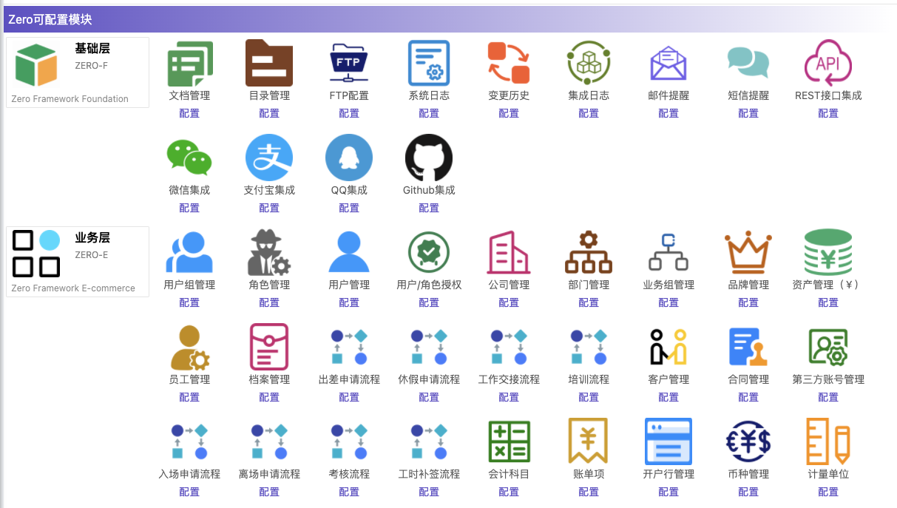

---
title：Zero 中文教程
---

[](https://maven-badges.herokuapp.com/maven-central/cn.vertxup/vertx-zero/)  [](https://www.apache.org/licenses/LICENSE-2.0.txt)  [](https://travis-ci.org/silentbalanceyh/vertx-zero)

# 0.楔子

Zero，又称为：“零”，最初的名字起源于高达W中的“飞翼零式”，其实那时想写个框架，最好是：零编码、零配置、零BUG——也许这只是个遥远的梦。从正式官方网站的英文教程问世后，就再也没有更新过教程了，于是重新开启“零”的大门，只是我依旧在尝试将教程写得更加梦幻，最初的落笔点就是名字，包括项目名字、章节名字。

有人说Zero只有后端，其实相反，它还包含一套定制过的前端，虽然不是符合所有人的胃口，但是，从目前已经上线的几个生产系统看来，也简化了不少开发的工作量。于是通过“**闯关**
”的方式来写一条类似游戏攻略一样的东西，说不定把读者当做玩家，简而精，能提炼更好的心得呢？

# 1. 资源

Zero相关的资源表

| 在线地址 | 说明 |
|---|:---|
| <http://www.vertxup.cn> | Zero，后端框架 |
| <http://www.vertxui.cn> | Zero UI，前端框架 |
| <http://www.vertxai.cn> | Zero 工具集 |

Zero公众号（申请微信群先加微信号：445191171）：


如果您喜欢Zero，帮忙点个Star，谢谢：<https://github.com/silentbalanceyh/vertx-zero>

# 2. 教程

> 我一直在思考使用什么样的方式来写教程，如果告别了曾经那种概念，是不是会写成空中楼阁一样只有代码和“招式”的东西，沉淀下来，还是简单点吧（图、代码、解说一步到位），不过项目名称还是沿用希腊神话中的诸神之名，含义为：以诸神之名开启零之誓约。

Zero目前的版本中仅支持Maven，最新版为`0.6.2`，一直以`0`前缀做版本号，是因为我在收集生产环境的运行数据，当然我希望它的`1.0`是经过了生产环境验证的框架，成为一个真正可用的框架，而不是简单的样子货而已。

## 环境

在您的Maven项目的 `pom.xml` 文件中引入以下配置（推荐使用正式版，0.6.2已发布）：

**JDK 8, Vert.x 3.x**

```xml
<parent>
    <artifactId>vertx-import</artifactId>
    <groupId>cn.vertxup</groupId>
    <version>0.6.2</version>
</parent>
```

**JDK 11, Vert.x 4.x**

```xml
<parent>
    <artifactId>vertx-import</artifactId>
    <groupId>cn.vertxup</groupId>
    <version>0.8.1</version>
</parent>
```

**特殊说明**：写这套教程的过程中，我会验证所有的演示代码，验证过程的BUG以及最新的版本会在[BUG表](document/bug.md)
中公布，不过由于教程先于框架，最终的框架版本以主页的最新版为主，而正文中所有的版本号都是写教程时的版本号。

然后书写主程序：

```java
package cn.vertxup;

import io.vertx.up.VertxApplication;
import io.vertx.up.annotations.Up;

@Up
public class ApolloUp {

    public static void main(final String[] args) {
        VertxApplication.run(ApolloUp.class);
    }
}
```

启动该程序，您将在控制台看到如下信息，就证明Zero系统成功启动：

```shell
[ ZERO ] ( Http Server ) ZeroHttpAgent Http Server has been started successfully. 
         Endpoint: http://198.18.21.28:6083/.
```

**最新版模块**

最新版模块以Zero开发中心**模块化**后的功能表（包含前后端）：



# 3. 教程（Zero）

## 零之遥（Απόλλων）

> Zero Framework

* [1.1.启航：Zero](document/zero/001.first.md)
* [1.2.曲径通幽：@Path](document/zero/002.uri.md)
* [1.3.四叶葎：Http方法](document/zero/003.method.md)
* [1.4.思无邪：入参](document/zero/004.param.md)
* [1.5.孤城暗雪：验证](document/zero/005.validation.md)
* [1.6.潘多拉魔盒：异步](document/zero/006.async.md)
* [1.7.珠玉在侧：容错](document/zero/007.error.md)
* [1.8.铁马冰河：细谈Worker](document/zero/008.worker.md)
* [1.9.虚之墙：安全](document/zero/009.security.md)
* [1.10.珷玞：Jooq](document/zero/010.jooq.md)
* [1.11.笙歌散：JSR330/JSR340](document/zero/011.jsr330.md)
* [1.12.阡陌：Ux编排](document/zero/012.function.md)
* [1.13.始源之地：Vert.x集成](document/zero/013.native.md)
* [1.14.俯瞰：配置地图](document/zero/014.configuration.md)
* [1.15.鼚乎：Shell](document/zero/015.devops.md)
* [1.16.二向箔：Excel](document/zero/016.excel.md)
* [1.17.隐匿者：Job](document/zero/017.job.md)
* [1.18.天下：集成](document/zero/018.integration.md)
* [1.19.冰刀：部署](document/zero/019.deployment.md)

## 风之殇（Πόλεμος ανέμου）

> Zero Extension

* [2.1.扬帆：Zero Extension](document/zero-extension/001.extension.md)
* [2.2.漆冰裂：Ambient](document/zero-extension/002.ambient.md)
* [2.3.木叶鸢：CRUD](document/zero-extension/003.crud.md)

## 影之月（Σάντοου μήνα）

> Zero Ui

* [3.1.初赦：Zero Ui](document/zero-ui/001.structure.md)
* [3.2.苍山暮雪：Ajax](document/zero-ui/002.ajax.md)
* [3.3.智多星：属性解析器](document/zero-ui/003.attribute.md)
* [3.4.死线：表单](document/zero-ui/004.field.md)
* [3.5.太阳帆：列表](document/zero-ui/005.column.md)
* [3.6.水平线：ExComplexList](document/zero-ui/006.component.list.md)
* [3.7.七巧板：ExForm](document/zero-ui/007.component.form.md)

## 氷る世界（Ψυχρός κόσμος）

> Aeon System

* [4.1.贪婪岛：Aeon](document/zero-cloud/001.aeon.md)
* [4.2.盖亚：Ceph](document/zero-cloud/002.ceph.md)
* [4.3.零步进：Harbor](document/zero-cloud/003.harbor.md)
* [4.4.执子之手：Ceph RBD](document/zero-cloud/004.rbd.md)

## 䆐之疆（Σύνορα της χώρας）

> 本章节为快速链接，原文中的快捷方式。

* [1.信封模型：Envelop](document/zero/006.async.md#er-tong-yi-mo-xing)
* [2.任务模型：Mission](document/zero/017.job.md#1-6-mission)
* [3.集成模型：Integration](document/zero/018.integration.md#2-1-integration)
* [4.异常查询表](document/zero/007.error.md#er-yi-chang-cha-xun-biao)
* [5.异步模式：5 Style](document/zero/006.async.md#1-2-zero-mo-shi)
* [6.参数签名：Agent组件](document/zero/004.param.md#3-4-shang-xia-wen)
* [7.参数签名：Worker组件](document/zero/008.worker.md##3-2-kuo-zhan-can-shu)
* [8.参数签名：Job组件](document/zero/017.job.md#2-2-on-off)
* [9.查询引擎语法](document/zero/010.jooq.md#san-cha-xun-yin-qing)
* [10.Ex: ServiceLoader通道](document/zero-extension/001.extension.md#2-2-tong-dao-ding-yi)


# COPYRIGHT IN CHINA


