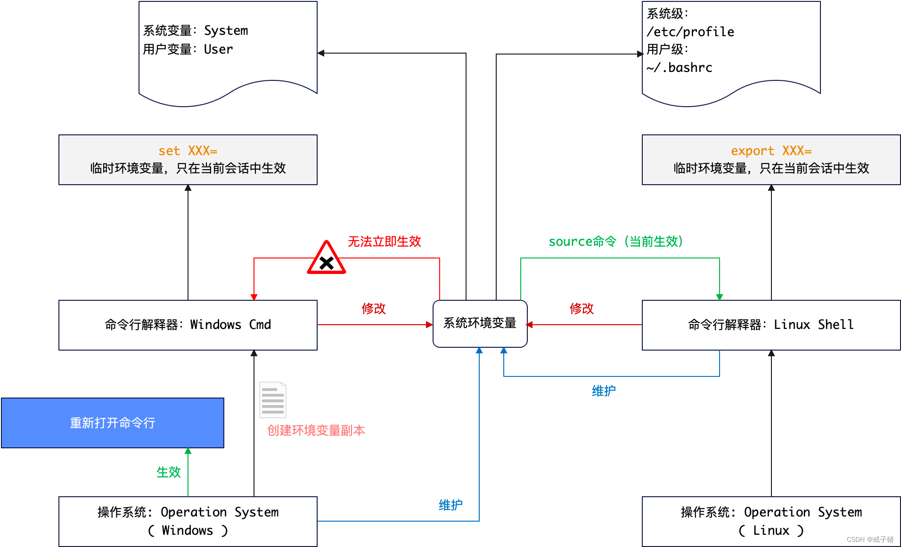

# 1. 基本概念

环境变量是操作系统中用于存储和传递配置信息的机制，它们在程序设计和系统管理中扮演着关键角色，对于刚入门的程序员来说，理解环境变量的概念和用法是非常重要的。

## 1.1. 定义和用途

环境变量是键值对，其中键是变量的名称，值是与之关联的数据。它们被用来存储有关操作系统环境的信息，如文件路径、系统配置、用户信息等。这些变量为程序提供了执行环境的相关信息，使得程序能够在不同的系统配置下灵活运行。

## 1.2. 全局性

环境变量通常是全局的，这意味着它们对于在同一操作系统上运行的所有程序和进程都是可见的。因此，通过修改一个环境变量，可以影响多个程序的行为。

## 1.3. 可配置性

环境变量可以在系统级别或用户级别设置。系统级变量影响所有用户和进程，而用户级变量则仅影响设置它们的特定用户的进程。这种区分使得环境变量既可以用来进行广泛的系统配置，也可以用来满足个别用户的特定需求。

## 1.4. 常见环境变量

- PATH是一个用于指定可执行文件搜索路径的环境变量。
- HOME或USERPROFILE指定了用户的主目录。

## 1.5. 使用

在编程中，程序员经常需要读取和设置环境变量。大多数编程语言和操作系统提供了访问和修改环境变量的方法。例如，在UNIX和类UNIX系统中，可以在shell脚本中使用环境变量，而在Windows系统中，则可以通过命令提示符或脚本来进行操作。

## 1.6. 重要性

环境变量对于确保程序在不同的系统环境中以预期的方式运行至关重要。它们使得程序能够在不修改源代码的情况下，适应不同的系统设置和用户偏好。

<hr/>

# 2. 临时变量

操作系统中的临时环境变量是在特定会话或进程中设置的环境变量，它们只在该会话或进程中有效，并不会影响其他会话或在系统重启后持续存在。

## 2.1. 作用

- 局部配置：临时环境变量允许在特定会话或进程中定义配置，而不影响整个系统或其他进程。这对于测试新的配置或修改仅适用于当前会话的设置非常有用。
- 安全性：通过使用临时环境变量，可以限制敏感信息（如密码或API密钥）的可见范围，只在需要的进程中暴露，而不是系统级别。
- 环境隔离：在开发或测试过程中，临时环境变量可以帮助创建特定的环境设置，而不会与其他开发或测试环境冲突。
- 资源指向：临时变量常用于指定资源的临时路径，如临时文件夹或特定版本的程序。

## 2.2. 特征

- 会话限定：临时环境变量仅在它们被设置的命令行会话或程序进程中有效。
- 非持久性：与永久环境变量不同，临时环境变量在会话结束或系统重启后消失。
- 灵活性：可以快速设置和修改，无需重启系统或进行持久性更改。

## 2.3. 设置

```shell
# Windows中设置临时环境变量
set JAVA_HOME=xxxx
# Linux中设置临时环境变量
export JAVA_HOME=xxxx
```

<hr/>

# 3. 配置流程

## 3.1. 操作流程图



## 3.2. 修改生效

> 为什么有时候设置了环境变量（非临时变量）没生效？

常见原因：

- 错误的设置命令
- 会话或作用域问题
- 权限问题
- 配置文件错误
- 操作系统限制或错误
- 环境变量名称冲突
- 没有重启进程或系统

您可以重新打开一个新的 Shell 窗口，检查环境变量是否生效：

```bash
# 打印环境变量的值
echo $JAVA_HOME
# 直接查看环境变量
env | grep JAVA_HOME
# Windows中可使用如下
set | findstr JAVA_HOME
```

参考操作流程图，Windows操作系统中使用命令提示符会创建环境变量副本，所以更新了环境变量之后必须打开新的命令提示符窗口才能生效。

## 3.3. Linux环境变量

Linux中的环境变量不仅只有 `/etc/profile` 和 `~/.bashrc` 文件，有可能包含其他路径下的文件：

| 文件名 | 类型 | 关键点 |
|:--|:--:|:--|
| `~/.bashrc` | 用户级 | 该环境变量只针对当前用户生效，包括新打开一个终端Shell，也只<br/>会针对**相同用户**生效，但对这个用户而言是永久性的，若您不想打<br/>开新终端，可使用该账号直接运行：`source ~/.bashrc` 使得环境<br/>变量在当前Shell中生效。|
|`~/.bash_profile` | 用户级 | 用法同 `~/.bashrc` ，只是文件名不同，若用户目录不存在<br/> `~/.bash_profile`，您也可以编辑或创建 `~/.profile` 文件。|
|`/etc/bashrc` | 系统级 | 该环境变量的基本执行步骤和用户级环境变量类似，但需管理员权<br/>限才可更改（`sudo`），且这种更改对该操作系统的所有用户都生效。|
|`/etc/profile`| 系统1级 | 用法同 `/etc/bashrc` |
|`/etc/environment` | 系统级 | 用法同 `/etc/bashrc` |

Linux系统中环境变量的基本加载顺序如下：

```bash
/etc/environment            # 系统级
/etc/profile                # 系统级：内部调用检查 /etc/bashrc
/etc/profile.d/xxx.sh       # 系统级：自定义环境变量部分
~/.profile                  # 用户级：内部检查 ~/.bash_profile
~/.bashrc                   # 用户级：环境配置过程中推荐使用该文件更改环境变量

# 如果您安装了其他插件，还会加载其他环境变量文件，如
~/.zshrc					# 用户级：ZSH 命令行环境变量
```

您可以将 `~/` 目录下的环境变量都识别成**用户级**环境变量，相反，一般 `/etc/` 目录下的变量都是**系统级**环境变量。

<hr/>

# 4. Java环境变量

> 不仅是Java开发，包括其他环境的搭建，环境变量的设置都是十分重要的步骤。

## 4.1. `JAVA_HOME`

`JAVA_HOME` 是一个非常重要的环境变量，它指向您安装的Java开发工具包（JDK）的路径，正确设置 `JAVA_HOME` 对Java应用程序开发至关重要，尤其对于直接使用命令行工具进行**服务器配置**时。

## 4.2. `PATH`

`PATH` 环境变量是在大多数操作系统中使用的一个非常重要的概念。

- 它是一个指向多个目录的路径列表的环境变量，这些目录包含了可执行文件。
- 作用：
    - 当你在命令行输入一个命令时，操作系统会在 `PATH` 变量指定的目录中搜索命令的可执行文件。
    - 它可以让操作系统更快找到执行程序而不依赖程序的完整路径。
- 结构：
    - 它可以包含多个路径，这些路径通过特定的分隔符分开。
    - Windows中使用 `;` 分号做分隔符。
    - Linux / MacOS中使用 `:` 冒号做分隔符。
    

> 这个环境变量的更改尤其小心，有可能会对操作系统产生破坏！！！一般在配置Java环境过程中，您只需要找到操作系统的 `PATH` 变量然后对其进行更改即可，且一定不要更改原始操作系统的 `PATH`。

## 4.3. 配置步骤

### 4.3.1. Windows 中配置

1. 找到 JDK 安装目录，通常格式：`C:\Program Files\Java\jdk-<version>`
2. 设置环境变量：
    1. 右键：我的电脑/此电脑 -> 属性。
    2. 点击：高级系统设置。
    3. 选择：环境变量。
    4. 此处有两个区域：系统变量 / 用户变量，根据实际情况自行设置，一般选择：系统变量 -> 新建。
    5. 输入：`JAVA_HOME` 和变量值——JDK的安装目录。
3. 找到 `PATH` 环境变量 -> 编辑，追加新的条目：`%JAVA_HOME%\bin`。
4. 点击：保存 设置并关闭所有窗口，重启命令提示符窗口使更改生效。

### 4.3.2. Linux / MacOS 中配置

1. 找到 JDK 安装目录：
    - Linux：通常位于 `/usr/lib/jvm/java-<version>` 的路径。
    - MacOS：通常位于 `/Library/Java/JavaVirtualMachines/java-<version>` 的路径。
2. 编辑配置文件，参考前文：`.bashrc, .bash_profile, .zshrc` 等，在文件末尾追加：

    ```bash
    export JAVA_HOME=/Library/Java/JavaVirtualMachines/zulu-17.jdk/Contents/Home
    export CLASSPATH=.                  # 1.4 或之前的版本
    export PATH=$PATH:$JAVA_HOME/bin
    ```
3. 保存文件并关闭，终端直接使用 `source ~/.bashrc` 使更改生效（不用重启窗口）。

### 4.3.3. 验证

Windows / Linux / MacOS 的验证步骤可以相同：

```bash
echo %JAVA_HOME%        # Windows
echo $JAVA_HOME         # Linux / MacOS
java -version

# 比如我机器上的输出
openjdk version "17.0.8.1" 2023-08-24 LTS
OpenJDK Runtime Environment Zulu17.44+53-CA (build 17.0.8.1+1-LTS)
OpenJDK 64-Bit Server VM Zulu17.44+53-CA (build 17.0.8.1+1-LTS, mixed mode, sharing)
```

## 4.4. `CLASSPATH`

`CLASSPATH`环境变量在Java开发中有着重要作用，它是用来定义Java类文件的查找路径的。

### 4.4.1. 作用

- 它告诉Java虚拟机（JVM）和Java编译器在哪里找类和包，默认使用 `.`（当前目录），它可以包含**目录、ZIP文件、JAR文件**的路径。
- 当编译/运行Java程序时，JVM和编译器根据 `CLASSPATH` 查找和加载必要的类。

> 上述配置中设置了 `CLASSPATH=.`，这个设置主要在于不同操作系统中表现有所区别，若您的操作系统中出现了找不到JVM的问题，您可以尝试手动设置 `.` 到这个变量中，这种情况通常用于：
>
> - Java产品安装过多导致系统环境变量被安装程序覆盖，后安装的会重写之前安装的环境。
> - JDK版本过多导致执行 `java` 命令时无法定位正确的版本以及类加载变量。

### 4.4.2. 副作用

若您不设置 `CLASSPATH`，那么：

- 默认：Java将使用当前目录 `.` 作为默认类路径，JVM 会在执行命令的当前目录中查找类文件（`.class`）。
- 限制：若您的类不在当前目录中或位于不同目录结构，JVM可能无法找到这个类，引起：
    - 如果代码中使用**反射**无法查找到对应类，会抛出 `ClassNotFoundException` 异常，和动态加载相关。
    - 若类路径配置错误，会抛出 `NoClassDefFoundError` 错误，和类静态加载相关。
- 依赖：大型项目中（一般是工程项目），可能您需要很多外部库（ `jar` 文件），不设置 `CLASSPATH` 会导致项目无法启动。

### 4.4.3. 命令行使用

除了在环境变量中配置 `CLASSPATH` 以外，您还可以直接使用命令行参数设置环境变量，如：

```bash
java -cp
java -classpath
# 上述两个参数功能是相同的
```

## 4.5. `dt.jar / tools.jar`

在 JDK 1.4 或之前的版本中，这两个依赖是需要直接配置到 `CLASSPATH` 中的，否则会导致您的Java程序无法正常运行，那个时候 JavaSE（J2SE）中的 `Swing` 可以帮助您做 GUI 设计，一般初期学习的开发人员都会配置 `dt.jar` 来支撑对应的GUI功能。

### 4.5.1. 作用

|依赖|含义|
|:---|:---|
|`dt.jar`| 全称为 DesignTime，它包含了支持 JavaBeans 组件的类，主要用于**设计时**环境，比如**GUI**设计（拖拽、所见即所得）。
|`tools.jar`| 包含了执行一些高级开发任务所需的类，例如：Java编译、执行工具类，`javac` 工具、`javadoc` 文档工具的实现。

### 4.5.2. JDK 9 之后

从 JDK 9 开始，Java平台执行了重大模块化改革（ `jigsaw` ），导致一些重要变化，`dt.jar / tools.jar` 已经被替代：

- 模块化系统：JDK 9 引入了模块化系统，提高Java项目的可维护性和性能，这个新的模块系统改变了类和包的组织方式，`ClassLoader` 类加载器也有所调整。
- `dt.jar / tools.jar`：在 JDK 9 或之后的版本中，这两个依赖不再作为单独的 `jar` 文件存在，它们包含的部分功能被直接整合到 JDK 中。

> 上述心得在升级的时候尤其重要！！！

<hr/>