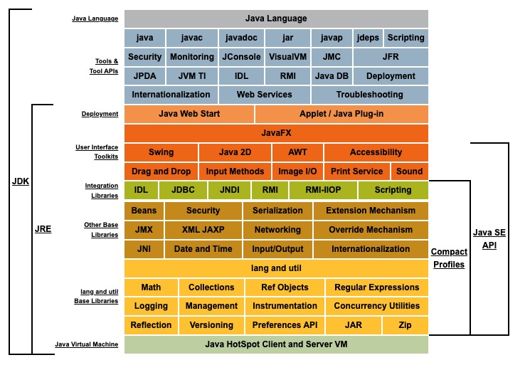

# 1. Java平台

## 1.1. SE

> SE，全称是 Standard Edition，历史上有一段时间三个版本并行称为 `J2SE、J2ME、J2EE`，后边从 6 开始改了名字叫 `JavaSE、JavaEE`。



上图主要基于JDK 8.0 的版本。

JDK和JRE是Java编程语言中的两个核心概念：

- JDK全称 Java Development Kit（**面向开发人员**）：<br/>它提供了Java应用程序/小程序的开发环境，包括Java编译器、Java虚拟机等工具。
- JRE全称 Java Runtime Environment（**面向用户人员**）：<br/>它是Java虚拟机的实现，主要用于运行Java程序。

## 1.2. EE

> EE，全称是 Enterprise Edition，备注：Spring不是JavaEE，它们有近似但很多设计是补充了JavaEE曾经的弱点，最新 JavaEE 的稳定版本是 8。

Java EE是一套企业软件标准，由业界专家、商业组织、开源组织、Java用户组、个人开发者共同维护的符合业界标准的企业软件定义，它的每个版本都符合业界需求的新特性，提高了应用可移植性、提升了开发人员的工作效率。

补充：JavaEE服务器是指符合JavaEE标准（实现了所有相关规范）的服务器，又称为JavaEE容器，很多开发人员对JavaEE和Web开发有所误解，像常用的Tomcat、Jetty都不属于JavaEE服务器，目前市面上符合JavaEE规范的标准服务器如下：

|服务器|规范|含义|
|---:|:---:|:---|
|Apache TomEE|Java EE 6 Web Profile|基于Tomcat的JavaEE应用服务器。
|GlassFish|Java EE 8|「**官方**」官方提供的开源JavaEE应用服务器。
|JBoss EAP|Java EE 8|商业的JavaEE应用服务器。
|WebLogic Server|Java EE 8|Oracle的商业的JavaEE应用服务器。
|WebSphere Server|Java EE 8|IBM的商业JavaEE应用服务器。

开发人员必须分清楚 **Web服务器** 和 **应用服务器** 的区别：

- Web服务器：主要用于处理静态页面（如HTML）、文件、图像、视频，响应来自Web浏览器的HTTP请求，也支持动态内容。通常Web容器只会实现 Servlet/JSP（JSR340）相关标准，很多Web容器连JSF、JNDI都需要独立配置扩展才可使用。
- 应用服务器：主要用于运行业务逻辑，支持最终客户终端和服务端之间的代码交互，从而生成动态内容，如事务结果、决策支持、实时分析。

## 1.3. ME

> ME，全称是 Micro Edition，很多人会本能觉得此处 M 代表 Mobile，其实不是。

它是一种基于 Java 的嵌入式和移动设备的开发平台，也是轻量级的Java平台，通常为嵌入式设备（传感器、网关、移动电话、打印机、机顶盒等）提供可移植的Java代码部署和开发。

<hr/>

# 2. Java的选择

## 2.1. 版本选择

Java如今已经进入了 `21` 的版本，那么选择什么版本的JDK对很多开发人员都是一种纠结。一般Java的版本号如下格式：

```shell
11.0.12

# 第一个数字11：表示Java的主版本号
# 第二个数字0：表示Java的次版本号
# 第三个数字12：表示更新版本号
```

除此之外，Java会有三种特殊的版本：

|版本号|含义|
|:---:|:---|
|STS, Short-Term Support|短期支持版本，一般是新功能的测试版本，或者只提供短时间技术支持的版本。
|MTS，Multi-Term Support|中期支持版本，一般介于 LTS / STS 之间的版本，提供一定的支持时间。
|LTS，Long-Term Support|（**推荐**）长期支持版本，长期支持版本，一般比较稳定，官方会不断更新补丁包。

所以真正在实际开发过程中，特别是生产环境，推荐使用 `LTS` 的版本，Java所有版本如下（从 `6` 开始）：

|版本号|特殊版本|
|---:|:---|
|Java 6| LTS |
|Java 7| LTS |
|Java 8| LTS（可用）|
|Java 9| STS |
|Java 10| STS |
|Java 11| LTS（可用）|
|Java 12| STS |
|Java 13| MTS |
|Java 14| STS |
|Java 15| MTS |
|Java 16| STS |
|Java 17| LTS（可用）|
|Java 18| STS |
|Java 19| STS |
|Java 20| STS |
|Java 21| LTS（可用）？|

> 上述版本中加 ? 实际是官方目前还未给出支持时间，很多开发人员觉得学习Java版本眼花缭乱，被版本误导了，实际在学习过程中您可以只关注几个稳定的 `LTS` 版本，如上述表格中的 `8, 11, 17, 21`，那么这样的学习曲线就会少很多烦恼。

## 2.2. JVM选择

> OpenJDK 和 标准JDK 都是基于 JavaSE 的实现，二者性能上基本相同，前者由社区维护和开发，更加自由开放；后者由 Oracle 公司维护开发，会包含部分商业特性和 License 限制。

### 2.2.1. 概念VS特性

Java虚拟机（Java Virtual Machine，JVM）是Java平台的核心组成部分之一，它是一个在计算机上运行Java字节码的虚拟机。JVM充当了Java应用程序和底层操作系统之间的中间层，提供了跨平台的特性，使得Java程序可以在不同的操作系统和硬件上运行。

|特点|备注|
|---|:---|
|字节码执行|JVM能够解释和执行Java程序编译后生成的字节码文件（.class文件）。|
|内存管理|JVM负责动态分配和管理Java程序的内存。它提供了垃圾回收<br/>（Garbage Collection）机制来自动释放不再使用的内存，减轻了开发者<br/>对内存管理的负担。|
|即时编译|JVM使用即时编译器（Just-In-Time Compiler，JIT）来优化字节码的执行<br/>速度。即时编译器将热点代码（被频繁执行的代码）编译为本地机器码，<br/>提高程序的执行效率。|
|异常处理|JVM提供了异常处理机制，可以捕获和处理Java程序中的异常。它通过异常<br/>表和异常处理器来管理异常的传播和处理流程，保证程序的稳定性和可靠性。|
|类加载和运行环境|JVM负责加载、验证、链接和初始化Java类。它使用类加载器（Class Loader）<br/>将类文件加载到内存中，并在运行时创建和管理类的实例。|

> Java语言通常说的：一次编写多处运行 的跨平台性，就是依赖JVM，不同操作系统JVM的Java语言规范是一致的。

### 2.2.2. 可用的JVM

常用的Java虚拟机如下：

- **HotSpot**：（**默认**）Oracle公司开发的**参考实现**，标准的Java虚拟机，也是目前使用最广泛的JVM。
- **OpenJ9**：IBM公司开发的Java虚拟机，它是 Eclipse 基金会的一部分，采用了先进的垃圾回收技术、出色的性能和内存管理，——但是由于IBM的许可限制，无法在普通项目中大规模使用。
- **Zing**：是 Azul System 公司开发的 Java 虚拟机，主要服务于高吞吐量、低延迟应用程序，具有出色的性能、可靠性，为大型企业应用量身打造，你也可以理解成 **HotSpot** 扩展出来的**高性能**JVM，又称为服务端程序员的**偷懒神兵**，性能不够？换 `Zing`！。
- **JRockit**：原来是 BEA 公司的作品，后来被 Oracle 收购之后炮灰了，最大版本 `R28`，只支持到 `Java 6`——曾经最快的JVM。

从上述虚拟机可以看到，开发人员可选择的**主流JVM**就只有 **HotSpot** 和 **Zing**（Zulu JDK）两个，推荐使用 [Zulu JDK](https://www.azul.com/downloads/#zulu)。除开上述主流JVM以外，业界还有很多非主流的JVM：

|名称|类型|含义|
|---|---|:---|
|DRLVM| SE |「**炮灰JVM**」Apache Harmony出品，最惨的JVM没有之一，由于<br/>不让它跑 JCK 被 Sun 阴死的 JVM。|
|Java SE Embedded| ME | 内置JVM还是 **HotSpot**，是 Java SE 的定制版，简化了JVM内部部分<br/>组件，以内存优化为核心，也是侵蚀了 `JavaME` 的一个 JVM。|
|JamVM| ME |一个小巧的、可以支持完整 OpenJDK 类库和 Java SE 的VM。| 
|CLDC-HI| ME |目前主流 ME 的 JVM，又称为 Monty VM，它是用于支持 Java ME <br/>CLDC Profile 的专用 JVM。| 
|CDC-HI（CVM）| ME |「**炮灰JVM**」Oracle调整了 Java ME战略之后就翘辫子了，可以在 <br/>iOS 中运行Java程序（Oracle ADF Mobile）。| 
|KVM| ME | 部分小厂还在使用的 Java ME 方案，简单且资源消耗很少。|
|J9 VM| ME | IBM高度模块化打造的 ME 平台的VM解决方案。|
|Dalvik / ART| SE |虽然名字中没有 VM，但骨子里就是 JVM，几乎支持完整的 <br/>Java SE 功能，阿里的 `LemurVM` 就是它的变种，弱点是ClassLoader，<br/>动态生成字节码等功能坑。|
|JavaCard（JCVM）| ME |一般是政府和企业用户才会使用的 JVM。|
|Squawk VM| ME |Sun SPOT出品，一个非常小巧，专门为小型嵌入式系统环境设计的JVM。|
|Jikes RVM| SE |开源JVM，是为了虚拟机技术设计的研究型JVM，采用先进的编译技术、<br/>垃圾回收，具有出色性能和可靠性，支持多种处理器架构和操作系统。|
|Maxine VM| SE |开源JVM，是元循环虚拟机，包含了一个 Maxine Inspector 调试工具对<br/>虚拟机的运行状态进行可视化、调试。|
|Graal VM| SE |开源JVM，专门为了高性能应用程序而设计，且支持多种不同的脚本语言<br/>如：JavaScript、Python等。|

**元循环虚拟机**（metacircular virtual machine）是一种用一种语言实现它自己的虚拟机，它是用 Java 语言编写的 Java 虚拟机。元循环虚拟机的实现具有研究价值，可以帮助开发人员更好地理解虚拟机的工作原理。

### 2.2.3. 运行模式

JVM通常有两种运行模式：`Client` 和 `Server`，二者区别如下：

- Client模式（C1）：启动快，内存占用少，编译快，主要针对桌面应用程序的优化，在客户端环境中减少启动时间而优化。
- Server模式（C2）：启动慢，但一旦运行起来之后，性能会有更大提升，编译更完全、效率更高，主要针对服务端应用程序而优化。

> Client模式内置使用 C1 编译器，Server模式内置使用 C2 编译器。32位 JDK 默认使用 Client 模式，若要启动 Server 模式需追加 `-server` 的参数，64位 JDK 则默认使用 Server 模式。

<hr/>

# 3. JSR

关于JSR的后续可以参考：<https://www.zerows.art>（备战中），这里就不综述：

- **JCP**：全称是 Java Community Process <https://jcp.org/>，是一个开放的国际组织，它的核心成员是Java语言开发者，JCP的原创是SUN，JCP是SUN公司在1995年创造的非正式过程，到如今已经包含了数百名来自世界各地的Java代表成员，共同定制Java发展的正式程序。
- **JSR**：全称是 Java Specification Requests，它的中文翻译是 Java规范提案 ，表示 JCP 提出新增一个标准化技术规范的正式请求，任何人都可以提交JSR、向Java平台追加新的API、服务、功能，它已经成为了Java世界的一个重要标准。若JSR规范提案通过之后，就可以交给JDK团队成员开发，通常JSR的范围是和Java语言相关的，它通常会使用一个编号来置顶，如 JSR-370、JSR-311 等。
- **JEP**：全称是 JDK Enhancement Proposal，中文翻译是 JDK增强建议 ，JEP是一个JDK核心技术的增强建议文档，JEP可能要求探索一些新颖（或古怪）的想法，而这些想法通常是尚未进入正式规划的建议。但它对Java语言的贡献很明显，一般来说会要求原型设计区分可行、不可行的想法，直到能产生正式的规范说明。
- **JLS**：全称是 Java Language Specification，中文翻译是 Java语法规范：它用于指出Java的语法标准和基础语法规则，这些语法规则描述了程序的合规以及不合规的相关说明，同时指出了程序的含义并且告诉开发人员之后会发生什么？JLS比JSR更加权威，它对Java语言的合规性保驾护航。

<hr/>