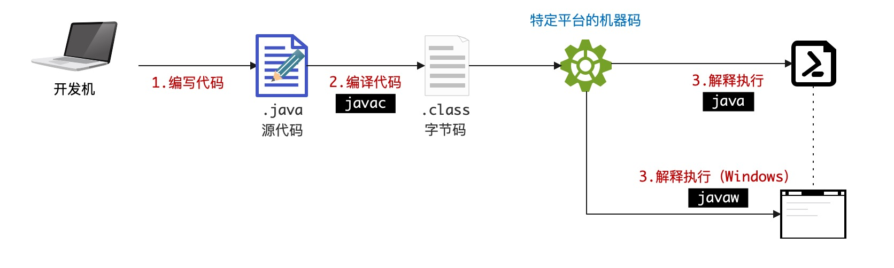

# 1. 关于语言

## 1.1. 语言分类

计算机语言可以根据不同维度的进行分类。

> 下边的分类本身不是互斥的，许多编程语言可以归入多个分类。

### 1.1.1. 抽象级别

- **低级语言**：和硬件操作密切相关，一般包括机器语言和汇编。
    - **机器语言**：由二进制代码组成，直接被计算机中央处理单元（CPU）执行。
    - **汇编语言**：借助助记符代替二进制代码，通过汇编器转换成机器语言。
- **高级语言**：更接近于人类语言，易于阅读和编写。
    - **过程式**：侧重于如何实现算法细节。
    - **面向对象**：基于对象和类，侧重于现实的映射，如：Java。
    - **函数式**：强调不可变性和副作用控制。

### 1.1.2. 用途

- **系统编程语言**：开发操作系统、驱动程序专用，如：C、Rust。
- **应用编程语言**：开发通用应用程序，如：Java、Python。
- **脚本语言**：开发自动化任务，如：Python、Bash。
- **标记语言**：格式化或展示数据，如：HTML、XML。
- **查询语言**：数据查询，如：SQL。
- **DSL-领域特定语言**：可自定义，针对特定领域的问题设计的语言。

### 1.1.3. 编程范式

- **命令式语言**：详细描述行为来改变程序状态。
- **声明式语言**：表达逻辑和计算规则而不显示指定的控制流。
- **结构化语言**：侧重于程序的流程结构以及控制。
- **并发编程语言**：支持并行任务处理。

> 编程范式很多，此处并没有枚举所有的编程范式，而且语言本身有可能是跨范式的。

### 1.1.4. 运行机制

- **编译型语言**：源代码在执行前完全编译成机器语言，然后执行，一般编译型语言是静态语言。
- **解释型语言**：源代码在执行时逐行解释，如 `Python, Ruby` 等。

## 1.2. 运行Java

### 1.2.1. Java分类

从**编译型**和**解释型**的角度来看Java语言，它就显得十分特殊了。Java编写的程序要经过 `javac` 命令的编译步骤，但是这个编译步骤又不会生成特定平台的机器码，而是平台无关的字节码（`.class`）文件，这种字节码文件可以被 JVM 中的 Java解释器解释执行。

**结论**：Java既是编译型语言，也是解释型语言（Java并非纯粹的编译型或解释型语言）。

### 1.2.3. Java运行



Java程序的完整开发流程如上图：

1. 开发人员编写Java源代码（文件扩展名使用 `.java`）。
2. 使用 `javac` 的命令编译Java源代码生成字节码文件（`.class`）。
3. 调用 `java / javaw` 的命令解释执行字节码文件。

> 流程图中将 `java / javaw` 放到一起是因为 `javaw` 一般在Windows中可用于窗口程序执行，且二者几乎等价。

在Java语言中，负责解释执行字节码文件的就是**Java虚拟机**（JVM，Java Virtual Machine），任何操作系统平台的JVM都面向编译器提供了统一的**编程接口**，编译器只需面向JVM将源代码编译成符合Java语言规范的字节码让JVM可以理解并解释执行即可，不同平台的JVM实现存在一定的差异，JVM会将字节码转换成特定系统平台的机器码并优化执行效率。

Java中的**跨平台性**就是依靠JVM来实现的，`javac` 命令编译Java源代码生成的字节码文件具有平台无关性，不论任何操作系统平台，只要它安装了JVM，这些字节码都可以被解释执行，虽然不同平台上安装的JVM有差异，但提供的编程和运行的接口是相同的，于是就可以让相同字节码运行在不同的平台。

<hr/>

# 2. Java入口

## 2.1. 文件名

### 2.1.1. 基本规范

Java语言的文件名本身设计是为了追求**严谨规范**，只是没想到这个设计成为了一个弊端，文件名和类名的绑定随着 JDK 不断升级，演变成了Java语言中最反人类的设计——理论上文件名和类名是不应该存在**绑定**行为的（应该像 C++ 面向对象设计一样自由）。

Java源代码文件名基本规范如下：

- 「**规**」源文件的扩展名必须是 `.java`，不可以是其他扩展名（注意Windows中打开**显示扩展名**的选项）。
- 「**规**」根据源文件是否定义了 `public` 的类或接口分如下两种情况：
  1. 若没有定义任何 `public` 的类或接口，则文件名可以是任意合法 Unicode 文件名，包括中文。
  2. 若定义了 `public` 的类或接口，那么文件必须和此 `public` 定义一致。
- 「**规**」一个Java源文件中可以包含多个类定义，但根据第二条规范，`public` 的定义只能有一个。

### 2.1.2. 示例

当您使用 `javac` 编译时，若一个文件中存在多个类定义，那么编译的 `.class` 文件也会是多个，如：

```java
// 文件名：你好.java
class 你好{
}

class 测试{
}

interface 跑{
}
```
编译上述文件，您可以看到如下信息：

```bash
> javac 你好.java
> ll
-rw-r--r--  1 lang  staff   186B Dec 12 18:54 你好.class
-rw-r--r--  1 lang  staff    51B Dec 12 18:54 你好.java
-rw-r--r--  1 lang  staff   186B Dec 12 18:54 测试.class
-rw-r--r--  1 lang  staff    90B Dec 12 18:54 跑.class
```

如果类定义中包含嵌套，那么会生成 `<主类>$<嵌套类>.class` 的文件，如：

```java 
interface 跑{
    interface A{
    }
}
```

上述代码编译之后会生成 `跑.class` 和 `跑$A.class` 两个文件。

### 2.1.3. 带 `-` 文件名

根据操作系统的文件名规范，文件名中是可以以**数字**开头，并且带 `-` 符号的，当您使用这样的特殊文件名时，只要不和Java的 `public` 定义冲突，也是可以通过编译并且生成合法的 `.class` 文件的，如：

- `1H.java`
- `k-b.java`

上述源文件对编译器是合法的——**限制就是文件中不可以定义 `public` 的类或接口**，原因在于：若定义了 `public` 的类或接口，那么这个文件名必须和 `public` 定义保持一致，而 `1H` 和 `k-b` 两个名称都是非法标识符，这种情况下编译器会报错。

#### `package-info.java` 和 `module-info.java`

细心的您会发现在如今的开源项目中，这两个文件十分常见，此处讲解一下二者的基本用法：

- `package-info.java` 是一个Java文件，可以添加到任意Java源码包中，它存在的意义在于提供一个包级别的**文档说明或注释**，您可以在此处写下这个包的功能、作者、版本等信息，这个文件中通常只包的声明语句。

    ```java
    /**
     *  ......
     */
    package io.horizon.fn;
    ```
    这个文件的核心作用有三：
    
    - 若部分 `Annotation` 注解是使用在包级别的，那么这个文件可以为它提供便利。
    - 友好的类和包常量定义。
    - 提供包的整体注释说明。
    
    其中**包注解**的例子参考如下：
  
    ```java
    // Annotation 注解定义文件：PkgAnnotation.java
    @Target(ElementType.PACKAGE)
    @Retention(RetentionPolicy.RUNTIME)
    public @interface PkgAnnotation {}
    
    // 注解的使用
    @PkgAnnotation
    package com.test.demo;
    ```

- `module-info.java` 是 JDK 9 引入的模块系统的一部分，用来声明模块的信息，如：模块名称、依赖关系、导出的包等，它内部语法如：

    ```java
    module com.mycompany.mymodule{
        requires java.desktop;
        exports com.mycomany.mymodule.myfeature;
    }
    ```

    > 此处不细讲 JDK 9 中的 **模块化**，后续章节专程来讨论。

## 2.2. 程序入口

<hr/>
