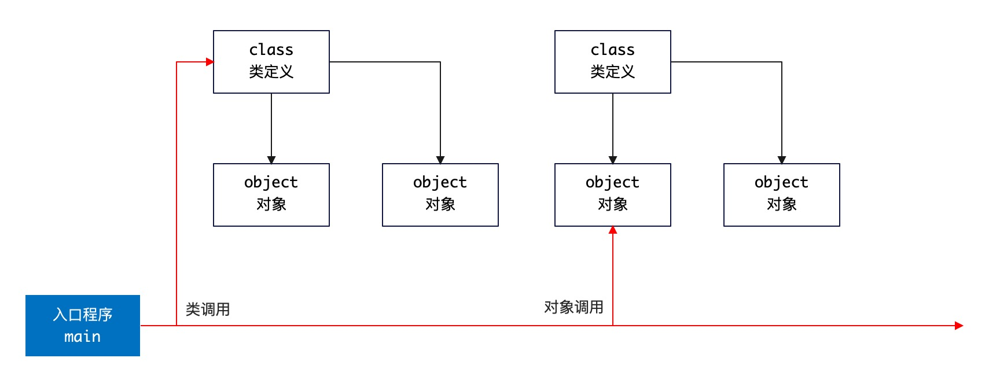

# 1. 关于语言

## 1.1. 语言分类

计算机语言可以根据不同维度的进行分类。

> 下边的分类本身不是互斥的，许多编程语言可以归入多个分类。

### 1.1.1. 抽象级别

- **低级语言**：和硬件操作密切相关，一般包括机器语言和汇编。
    - **机器语言**：由二进制代码组成，直接被计算机中央处理单元（CPU）执行。
    - **汇编语言**：借助助记符代替二进制代码，通过汇编器转换成机器语言。
- **高级语言**：更接近于人类语言，易于阅读和编写。
    - **过程式**：侧重于如何实现算法细节。
    - **面向对象**：基于对象和类，侧重于现实的映射，如：Java。
    - **函数式**：强调不可变性和副作用控制。

### 1.1.2. 用途

- **系统编程语言**：开发操作系统、驱动程序专用，如：C、Rust。
- **应用编程语言**：开发通用应用程序，如：Java、Python。
- **脚本语言**：开发自动化任务，如：Python、Bash。
- **标记语言**：格式化或展示数据，如：HTML、XML。
- **查询语言**：数据查询，如：SQL。
- **DSL-领域特定语言**：可自定义，针对特定领域的问题设计的语言。

### 1.1.3. 编程范式

- **命令式语言**：详细描述行为来改变程序状态。
- **声明式语言**：表达逻辑和计算规则而不显示指定的控制流。
- **结构化语言**：侧重于程序的流程结构以及控制。
- **并发编程语言**：支持并行任务处理。

> 编程范式很多，此处并没有枚举所有的编程范式，而且语言本身有可能是跨范式的。

### 1.1.4. 运行机制

- **编译型语言**：源代码在执行前完全编译成机器语言，然后执行，一般编译型语言是静态语言。
- **解释型语言**：源代码在执行时逐行解释，如 `Python, Ruby` 等。

## 1.2. 运行Java

### 1.2.1. Java分类

从**编译型**和**解释型**的角度来看Java语言，它就显得十分特殊了。Java编写的程序要经过 `javac` 命令的编译步骤，但是这个编译步骤又不会生成特定平台的机器码，而是平台无关的字节码（`.class`）文件，这种字节码文件可以被 JVM 中的 Java解释器解释执行。

**结论**：Java既是编译型语言，也是解释型语言（Java并非纯粹的编译型或解释型语言）。

### 1.2.3. Java运行


Java程序的完整开发流程如上图：

1. 开发人员编写Java源代码（文件扩展名使用 `.java`）。
2. 使用 `javac` 的命令编译Java源代码生成字节码文件（`.class`）。
3. 调用 `java / javaw` 的命令解释执行字节码文件。

> 流程图中将 `java / javaw` 放到一起是因为 `javaw` 一般在Windows中可用于窗口程序执行，且二者几乎等价。

在Java语言中，负责解释执行字节码文件的就是**Java虚拟机**（JVM，Java Virtual Machine），任何操作系统平台的JVM都面向编译器提供了统一的**编程接口**，编译器只需面向JVM将源代码编译成符合Java语言规范的字节码让JVM可以理解并解释执行即可，不同平台的JVM实现存在一定的差异，JVM会将字节码转换成特定系统平台的机器码并优化执行效率。

Java中的**跨平台性**就是依靠JVM来实现的，`javac` 命令编译Java源代码生成的字节码文件具有平台无关性，不论任何操作系统平台，只要它安装了JVM，这些字节码都可以被解释执行，虽然不同平台上安装的JVM有差异，但提供的编程和运行的接口是相同的，于是就可以让相同字节码运行在不同的平台。

<hr/>

# 2. Java入口规范

## 2.1. 文件名

### 2.1.1. 基本规范

Java语言的文件名本身设计是为了追求**严谨规范**，只是没想到这个设计成为了一个弊端，文件名和类名的绑定随着 JDK 不断升级，演变成了Java语言中最反人类的设计——理论上文件名和类名是不应该存在**绑定**行为的（应该像 C++ 面向对象设计一样自由）。

Java源代码文件名基本规范如下：

- 「**规**」源文件的扩展名必须是 `.java`，不可以是其他扩展名（注意Windows中打开**显示扩展名**的选项）。
- 「**规**」根据源文件是否定义了 `public` 的类或接口分如下两种情况：
  1. 若没有定义任何 `public` 的类或接口，则文件名可以是任意合法 Unicode 文件名，包括中文。
  2. 若定义了 `public` 的类或接口，那么文件必须和此 `public` 定义一致。
- 「**规**」一个Java源文件中可以包含多个类定义，但根据第二条规范，`public` 的定义只能有一个。

### 2.1.2. 示例

当您使用 `javac` 编译时，若一个文件中存在多个类定义，那么编译的 `.class` 文件也会是多个，如：

```java
// 文件名：你好.java
class 你好{
}

class 测试{
}

interface 跑{
}
```
编译上述文件，您可以看到如下信息：

```bash
> javac 你好.java
> ll
-rw-r--r--  1 lang  staff   186B Dec 12 18:54 你好.class
-rw-r--r--  1 lang  staff    51B Dec 12 18:54 你好.java
-rw-r--r--  1 lang  staff   186B Dec 12 18:54 测试.class
-rw-r--r--  1 lang  staff    90B Dec 12 18:54 跑.class
```

如果类定义中包含嵌套，那么会生成 `<主类>$<嵌套类>.class` 的文件，如：

```java 
interface 跑{
    interface A{
    }
}
```

上述代码编译之后会生成 `跑.class` 和 `跑$A.class` 两个文件。

### 2.1.3. 带 `-` 文件名

根据操作系统的文件名规范，文件名中是可以以**数字**开头，并且带 `-` 符号的，当您使用这样的特殊文件名时，只要不和Java的 `public` 定义冲突，也是可以通过编译并且生成合法的 `.class` 文件的，如：

- `1H.java`
- `k-b.java`

上述源文件对编译器是合法的——**限制就是文件中不可以定义 `public` 的类或接口**，原因在于：若定义了 `public` 的类或接口，那么这个文件名必须和 `public` 定义保持一致，而 `1H` 和 `k-b` 两个名称都是非法标识符，这种情况下编译器会报错。

#### `package-info.java` 和 `module-info.java`

细心的您会发现在如今的开源项目中，这两个文件十分常见，此处讲解一下二者的基本用法：

- `package-info.java` 是一个Java文件，可以添加到任意Java源码包中，它存在的意义在于提供一个包级别的**文档说明或注释**，您可以在此处写下这个包的功能、作者、版本等信息，这个文件中通常只包的声明语句。

    ```java
    /**
     *  ......
     */
    package io.horizon.fn;
    ```
    这个文件的核心作用有三：
    
    - 若部分 `Annotation` 注解是使用在包级别的，那么这个文件可以为它提供便利。
    - 友好的类和包常量定义。
    - 提供包的整体注释说明。
    
    其中**包注解**的例子参考如下：
  
    ```java
    // Annotation 注解定义文件：PkgAnnotation.java
    @Target(ElementType.PACKAGE)
    @Retention(RetentionPolicy.RUNTIME)
    public @interface PkgAnnotation {}
    
    // 注解的使用
    @PkgAnnotation
    package com.test.demo;
    ```

- `module-info.java` 是 JDK 9 引入的模块系统的一部分，用来声明模块的信息，如：模块名称、依赖关系、导出的包等，它内部语法如：

    ```java
    module com.mycompany.mymodule{
        requires java.desktop;
        exports com.mycomany.mymodule.myfeature;
    }
    ```

    > 此处不细讲 JDK 9 中的 **模块化**，后续章节专程来讨论。

## 2.2. 主函数

### 2.2.1. 主函数位置

**类不成类** 指的就是带有程序入口的类定义，先看一段小代码：

```java
package io.zerows.ch01;

public class HelloMain {
    public static void main(final String[] args){
        System.out.println("Hello, World!");
    }
}
```

上述代码实际在语言级应该是如下结构：



计算机语言中，正常情况程序入口不隶属于任何类或对象，而是直接执行 `main` 函数，但是您会发现一个有意思的事实就是 **面向对象** 的语言中多数都是定义在一个类中。如：

```csharp
// C# 语法
class Program {
    static void Main(string[] args){
        // 程序代码
    }
}
```

不过也有例外，标准的 ActionScript（基于 ECMAScript 规范的面向对象脚本）如：

```actionscript
// ActionScript 语法
package {
    import flash.display.Sprite;

    public class Main extends Sprite {
        public function Main() {
            // 程序代码
        }
    }
}
```

此处针对Java语言需要讲的是：`main` 函数此处的位置有两个用法：

- 作为静态方法，直接调用。——**这种用法只是因为Java的语言特性导致（一切皆是对象）**。
- 作为函数入口，启动主程序。

### 2.2.2. 主函数示例

> 主函数不限定要定义在 public 的类中，但是一般标准开发过程中是需要这样定义的。

先做个游戏，看下边代码（你不妨猜测一下哪些 Main 是可以正常输出结果的）：

```java 
class MainA{
    public static void main(String[] args){
        System.out.println("Main A");
    }
}

class MainB{
    public static void main(String... args){
        System.out.println("Main B");
    }
}

class MainC{
    public static void main(String args){
        System.out.println("Main C");
    }
}

class MainD{
    static void main(String[] args){
        System.out.println("Main D");
    }
}

class MainE{
    public static synchronized void main(String []args){
        System.out.println("Main E");
    }
}

class MainF{
    public static final void main(String... args){
        System.out.println("Main F");
    }
}

class MainG{
    public void main(String[] args){
        System.out.println("Main G");
    }
}

interface MainH{
    static void main(String[] args){
        System.out.println("Main H");
    }
}

class MainI{
  public static int main(String[] args){
    System.out.println("Main I");
    return 0;
  }
}
```

> 上述代码放在一个 `main.java` 文件中，编译没有问题，会生成八个 `.class` 文件。

如果您使用了 IDE 工具，它可以直接检查出来哪些主函数是合法的（带有运行标志），若主函数不合法，使用 `java` 语言运行时，会抛出如下异常：

```bash 
# 无法找到主函数
Error: Main method not found in class MainC, please define the main method as:
   public static void main(String[] args)
or a JavaFX application class must extend javafx.application.Application

# 返回值错误
Error: Main method must return a value of type void in class MainI, please 
define the main method as:
   public static void main(String[] args)
   
# 找不到类（大小写错误通常会遇到）
Error: Could not find or load main class mainI
Caused by: java.lang.NoClassDefFoundError: MainI (wrong name: mainI)
```

最终输出如下：

| 类名 | 输出结果      |
| --- |-----------|
| MainA | Main A    |
| MainB | Main B    |
| MainC | **ERROR** |
| MainD | **ERROR**     |
| MainE | Main E    |
| MainF | Main F    |
| MainG | **ERROR**     |
| MainH | Main H    |
| MainI | **ERROR**     |

### 2.2.3. 主函数签名

您可以把 main 主函数签名分成如下几个点来理解：

1. 函数名必须是`main`，大小写敏感。
2. 函数返回值必须是 `void`。
3. 函数的参数必须是 `String[]` 字符串二维数组类型，注意 `String...` 是**变参**定义，底层反射可拿到的类型依旧是 `String[]`。
4. 函数中必须使用 `public` 和 `static` 关键字同时修饰，注意 `interface` 自带 `public` 所以可省略。
5. 附加修饰关键字可使用
   - `final`：编辑器会提示移除，无任何意义。
   - `synchronized`：合法定义。
   - `strictfp`：（JDK 17之前可用），合法定义限定浮点数规范，若是 17 或之后会抛出 `main.java:39: warning: [strictfp] as of release 17, all floating-point expressions are evaluated strictly and 'strictfp' is not required` 错误，编译通不过。

综上所述，实际开发过程中**入口函数**通常按如下方式书写：

```java
// 推荐写法1
public static void main(String... args){
}
// 推荐写法2
public static void main(String[] args){
}

// 不推荐的写法，这种写法是 C 语言常用写法
// Parameter 'args' has C-style array type declaration 
public static void main(String args[]){
}
```

### 2.2.4. 被隐藏的主函数

实际开发过程中您有可能还会遇到其他主函数的写法：

_Servlet_

```java
import javax.servlet.*;

public class MainServlet implements Servlet {
    public void init(ServletConfig config) throws ServletException {
        // 初始化代码
    }

    public void service(ServletRequest req, ServletResponse res) throws ServletException, IOException {
        // 服务代码
    }

    // 其他方法...
}
```
_Applet_
```java
import java.applet.Applet;
import java.awt.Graphics;

public class MainApplet extends Applet {
  public void init() {
    // 初始化代码
  }

  public void paint(Graphics g) {
    // 绘图代码
  }
}
```

这些写法对开发人员而言看起来不遵循前文提到的 `main` 函数签名规范，实际上它只是被隐藏了，隐藏在哪儿？

- `Servlet` 的主函数隐藏在服务器的**启动器**中。
- `Applet` 的主函数隐藏在 `applet` 的沙盒中。

看不见主函数的代码很大程度上是因为**封装**，只是在开发视角无法看见罢了，若您追溯它的源代码，还是可以找到它的主函数的。

<hr/>
