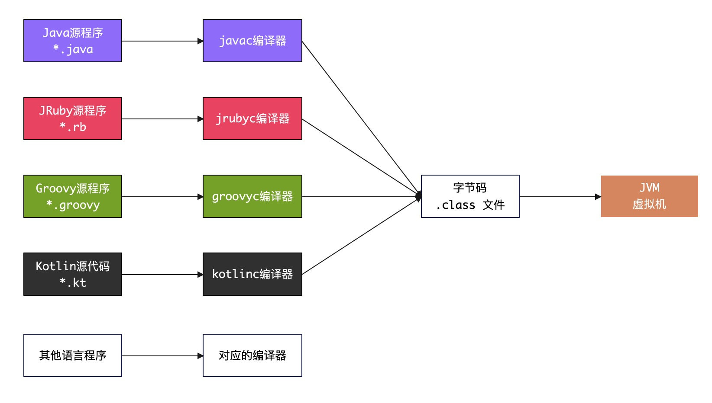
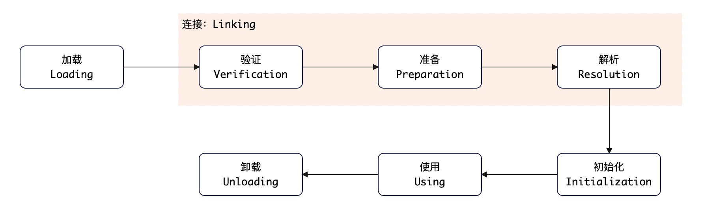
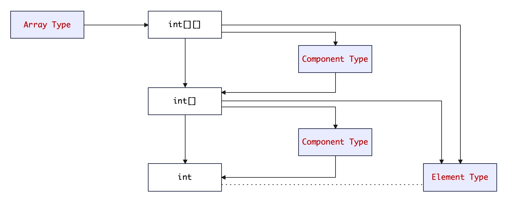
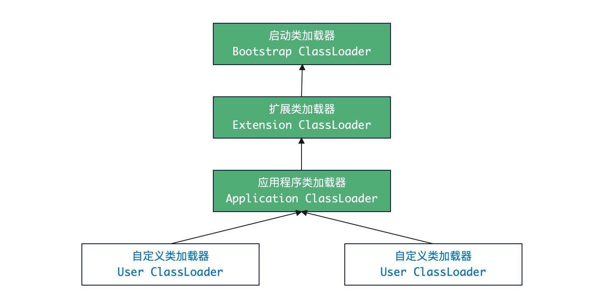
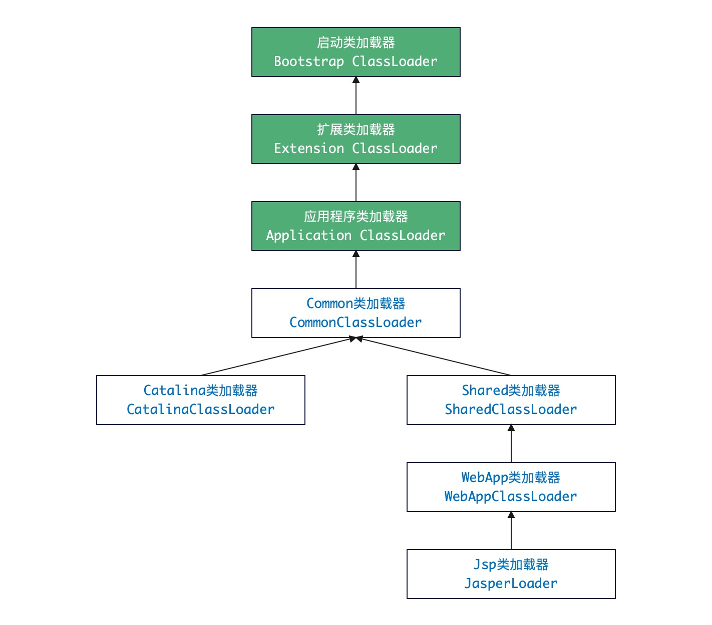
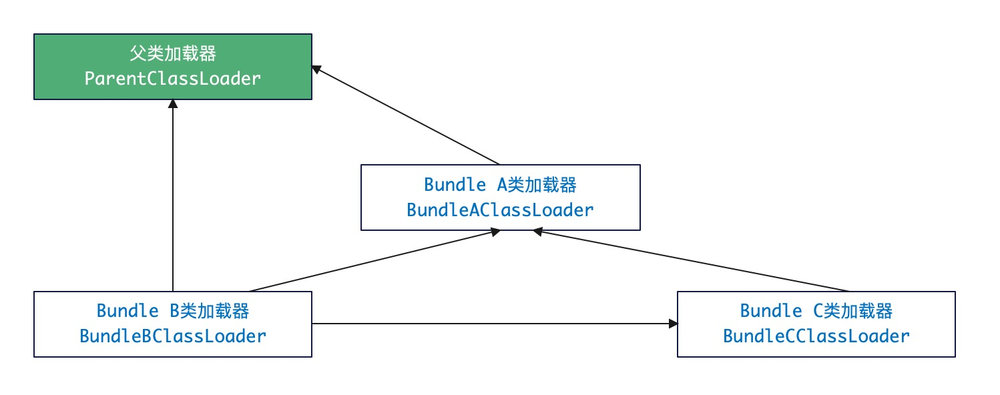

# 1. 基础

## 1.1. `.class` 文件

Java源代码经过编译后会生成 `.class` 文件，这个文件是Java虚拟机可以识别的二进制文件，计算机只能识别 `0` 或 `1`，所以通常编写的程序最终会经过编译器翻译成 `0` 和 `1` 构成的二进制格式才可以被计算机执行。直到今天我们的计算机依旧只能识别 `0` 和 `1`，但由于**虚拟机**技术的突飞猛进，将程序编译成机器码（ `Native Code` ）已经不是第一选择，很多语言采用了和操作系统和机器指令集无关、平台中立的格式作为编译后的存储格式—— `.class` 就是这样一种格式。

## 1.2. 无关性探讨

若CPU指令集只有 `x86`，操作系统只有 `Windows`，那么 Java 也就不会出现了。Java横空出世最响亮的口号就是：

> Write Once, Run Anywhere, 一次编写，到处运行。

这句话的意思是：只要你的程序编译成了 `.class` 文件，那么这个文件就可以在任何平台上运行，不需要重新编译，这种特性就是Java的平台无关性——这似乎也是开发人员的一种理想。所以从 Java 开始虚拟机技术突飞猛进，不同的虚拟机、平台都开始统一使用字节码（ `ByteCode` ）作为程序编译之后的存储格式，这里诱发了另外一种思考：**语言无关性**。

JVM的虚拟机初期的规范（1997年）中提到：

> In the future, we will consider bounded extensions to the Java virtual machine to provide better support for other languages. 

JDK 7 ~ 8 开始，JSR-292 兑现了这个承诺，如今的 JVM 已经不是一个和语言直接绑定的虚拟机，而是一个通用的虚拟机，它可以支持多种语言，如：`Groovy、Scala、Kotlin、JRuby、JPython、Clojure、Ceylon、Rhino` 等等，`.class` 文件也成为了一个通用的、机器无关的执行平台。



## 1.3. 生命周期

JVM虚拟机会解读 `.class` 字节码文件并加载到内存，其中类加载机制遵循如下五步：

1. 加载
2. 验证
3. 准备
4. 解析
5. 初始化

和其他语言不同，JVM的类加载、链接（Link）、初始化都是在运行期进行，这种策略也是Java语言被吐槽没有其他语言快的一个诟病，但是这种策略也带来了很多好处：**提高灵活性、动态扩展、动态更新**等等。

先统一话术：

|术语| 含义                       |
|---|:-------------------------|
|类| 类表示的是Java语言定义的 “类或接口”的统称。|
|Class文件|表示一串二进制的字节流，不论是何种形式存在都可以，如磁盘上的 `.class` 文件。|

JVM的完整生命周期参考下图：



上述步骤中，解析阶段的顺序并非必然，某些场景下解析是在初始化之后完成，如Java的运行时绑定（又称动态绑定、延迟绑定）。

## 1.4. 加载时机

究竟什么情况下要开始类加载过程的第一阶段：加载？JVM并没严格指出，但对**初始化**阶段有明确规定——下列情况发生时，Java虚拟机必须对类执行“初始化”：

1. 遇到 `new`、`getstatic`、`putstatic` 或 `invokestatic` 这四条字节码指令时，如果类没有进行过初始化，则需要先触发其初始化。生成这四条指令的最常见的Java代码场景是：使用 `new` 关键字实例化对象的时候、读取或设置一个类的静态字段（被 `final` 修饰、已在编译期把结果放入常量池的静态字段除外）的时候，以及调用一个类的静态方法的时候。
2. 使用 `java.lang.reflect` 包的方法对类进行反射调用的时候，如果类没有进行过初始化，则需要先触发其初始化。
3. 当初始化一个类的时候，如果发现其父类还没有进行过初始化，则需要先触发其父类的初始化。
4. 当虚拟机启动时，用户需要指定一个要执行的主类（包含 `main()` 方法的那个类），虚拟机会先初始化这个主类。
5. 当使用 `JDK 7` 新加入的动态语言支持时，如果一个 `java.lang.invoke.MethodHandle` 实例最后的解析结果为 `REF_getStatic`、`REF_putStatic`、`REF_invokeStatic` 的方法句柄，并且这个方法句柄所对应的类没有进行过初始化，则需要先触发其初始化。

> 上述五个场景在虚拟机中给的定义是：“**有且只有**” 的强制性描述！

# 2. JVM生命周期

> 《JVM虚拟机规范》阅读搬运，首先JVM是Java虚拟机，而类加载器（CL）负责加载类，是Java虚拟机的一部分。

## 2.1. 加载

> 注意区分 **加载** 和 **类加载**（Class Loading）的概念。

加载阶段 JVM 要完成如下3个任务：

1. 通过一个类的全限定名来获取定义此类的二进制字节流。
2. 将这个字节流所代表的静态存储结构转化为方法区的运行时数据结构。
3. 在内存中生成一个代表这个类的 `java.lang.Class` 对象，作为方法区这个类的各种数据的访问入口。

有意思的是上述步骤被开发人员玩得遍地开花。

### 2.1.1. 字节流

既然你说获取类的二进制字节流，可你没说从哪里获取，于是：

1. 从ZIP中读取，如 `JAR, EAR, WAR` 三种常用格式。
2. 从网络中读取，早期版本最典型如 `Applet` 应用。
3. 直接在运行时生成——如动态代理技术，使用 `ProxyGenerator.generateProxyClass` 方法生成代理类（形如：`*$Proxy` ）产生二进制字节流。
4. 从其他文件生成，典型如 `JSP`。
5. 从数据库中读取，这种场景虽然少，但也是可行的。

### 2.1.2. 数组

和其他语言类型不同，Java语言中的**数组**类本身不通过类加载器创建，而是JVM直接创建，但数组类和类加载器密切相关。参考下边语法结构：

```bash 
# Java 中的数组若写成：
[E,E,E,...]
# 那么 E 在这个地方表示元素类型 Element Type
# 元素类型又称为数组去掉所有维度的类型，最原子级类型
```

- 数组本身是JVM创建。
- 元素类型最终是依靠类加载器CL创建。

数组的创建遵循如下几个规则：

- 若数组组件类型（Component Type，指代数组去掉一个维度之后的类型）是引用类型，就递归采用这个加载过程加载组件类型，数组 `[]` 将在加载该组件类型的类加载器的类名称空间上被标识。
- 若数组组件类型不是引用类型（如 `int[]`），Java虚拟机会把数组 `[]` 标记为与引导类加载器关联。
- 数组类的可见性和它组件类型的可见性一致，若组件类型不是引用类型，数组类的可见性默认为 `public`。

从二维数组结构图理解一下 JVM 中的数组：



> 理论上加载和连接阶段（Linking）的部分内容是交叉进行的，加载未完成时，连接可能已经开始了。

## 2.2. 验证

验证是连接（Linking）的第一步，这个阶段的目的是为了确保 `.class` 文件的字节流中包含的信息符合当前虚拟机的要求，保证被加载类的正确性。

### 2.2.1. JVM编译

理解JVM的编译是认识验证步骤的**重点**，众所周知Java虚拟机会将源代码**编译**成 `.class` 字节码文件（结构参考：[《Java字节码.class文件案例分析》](https://blog.csdn.net/silentbalanceyh/article/details/42640739?spm=1001.2014.3001.5501)），这个字节码文件不一定要依靠Java源代码编译而来，您可以使用任何途径修改它，如十六进制编辑器直接写更改或编写。

Java语言本身是安全的，走**源代码**途径时如下（C语言可以做的）动作是被自动屏蔽的：

- 访问数组边界以外的数据。
- 将一个对象转型为它未实现的类型。
- 更改底层指针的指向地址。
- 跳转到不存在的代码行。

但是，如果您直接修改了 `.class` 文件，那么这些动作是可以做到的，这就是为什么Java虚拟机要对 `.class` 文件进行验证的原因。所以 JVM 编译与其说是编译，不如说是**转译**，它是一种从 `.java` 源文件转译成 `.class` 文件的过程，最终的输出并非是本地机器码，从这个角度严格来讲 JVM 不属于传统的编译型语言，而是带有编译特性的语种。

### 2.2.2. 验证内容

有了前一个章节给出的场景，那么**验证**的重要性就不言而喻了，这个阶段是否严谨，直接决定了Java虚拟机是否可以承受恶意代码攻击，从性能角度讲，验证阶段的工作量在虚拟机的类加载子系统中占了相当大的一部分。

验证阶段的主要工作如下：

|阶段| 内容                                                                                                                                                                                                                                                     |
|---|:-------------------------------------------------------------------------------------------------------------------------------------------------------------------------------------------------------------------------------------------------------|
|**文件格式验证**| <li>开头是否 `OxCAFEBABE` 的魔数。</li><li>主、次版本号是否在当前虚拟机的处理范围之内。</li><li>常量池中的常量是否有不被支持的常量类型。</li><li>指向常量池的各种索引值中是否有指向不存在的常量或不符合类型的常量。</li><li>`CONSTANT_Utf8_info` 型的常量中是否有不符合 `UTF-8` 编码的数据。</li><li>`Class` 文件中各部分和文件本身是否有被删除、附加的其他信息。</li><li>....</li>  |
|**元数据验证**| 语义分析，检查描述信息是否符合Java语义。这个阶段验证点包括： <li>这个类是否有父类（除了 `java.lang.Object` 之外，所有的类都应当有父类）。</li><li>这个类的父类是否继承了不允许被继承的类（ `final` 修饰的类）。</li><li>如果这个类不是抽象类，是否实现了其父类或接口中要求实现的所有方法。</li><li>类中的类型、方法是否和父类矛盾。</li><li>....</li>                                   |
|**字节码验证**| 通过数据流、控制流的分析，确定程序语义是合法的、符合逻辑的（运行时不出现危害JVM的行为）：<li>保证任意时候操作数栈的数据类型和指令代码序列能配合工作（典型如 `int` 和 `long` 冲突）。</li><li>跳转指令不会跳转到方法体以外的字节码指令上。</li><li>保证方法体中类型转换的有效性。</li><li>...</li>                                                                          |
|**符号引用验证**| 符号引用验证发生在虚拟机将符号引用转化为直接引用的时候，这个转化动作将在连接的第三阶段——解析阶段发生，这个阶段的验证动作是保证解析动作可以正确执行。校验内容如：<li>符号引用中通过字符串描述的全限定名是否可以找到对应的类。</li><li>在指定类中是否存在符合方法的字段描述符以及简单名称所描述的方法和字段。</li><li>符号引用中的类、字段、方法的访问性（ `private, protected, public, default` ）是否合法。</li><li>...</li> |

> 关于 `-Xverify:none` 参数，它可以关闭类加载的验证过程，但是这个参数在JDK 7中已经被废弃，JDK 8中已经无法使用。
> 弃用这个选项的原因如下：
> 
> - 验证阶段是JVM的一个重要的安全机制，它用于确保字节码的合法性和安全性。如果关闭验证阶段，可能会导致JVM执行非法或恶意的字节码，从而引发安全漏洞或系统崩溃。 
> - 验证阶段的性能已经得到了很大的提升，特别是在Java 6引入了StackMapTable之后，类型检查的效率大幅提高。因此，关闭验证阶段所带来的性能收益已经不明显，甚至可能会带来性能损失，因为JVM需要额外的逻辑来处理没有验证的类。 
> - 验证阶段的兼容性也受到了影响，特别是在Java 7引入了invokedynamic指令之后，StackMapTable成为了字节码文件中的强制部分，如果没有StackMapTable，JVM会拒绝加载类。因此，关闭验证阶段可能会导致一些类无法加载，或者加载错误。

## 2.3. 准备

准备阶段是正式给类变量分配内存并设置类变量初始值的阶段，这些变量使用的内存都将在方法区中分配。注意：**这里说的是类变量（ `static` 修饰的变量），而不是实例变量，实例变量将会在对象实例化时随着对象一起分配在Java堆中**。

先看一段代码：

```java 
// 类变量
public static int value = 123;

// 类常量
public static final int value = 123;
```

猜猜我想干嘛？没错，这两行代码看起来没区别，但是在准备阶段JVM的行为是不同的。

1. **类变量**：`value` 的值在准备阶段之后是 `0`，而不是你看到的 `123`，此时并没有执行任何Java方法，设置变量值为 `123` 是在类构造器方法的 `putstatic` 指令中进行的，所以此时 `value = 123` 是在初始化阶段执行。
2. **类常量**：`value` 的值在准备阶段之后是 `123`，编译时 `javac` 会为 `value` 生成 `ConstantValue` 属性，这种情况下这个 `value` 的相关内容虚拟机会提前知道，于是在准备阶段就将 `value` 设置成了 `123`。

参考如下表格看看 Java 语言中的数据类型的 **零值**（准备阶段之后的默认值）：

|数据类型| 零值       |
|---|:---------|
|boolean| false    |
|char| '\u0000' |
|byte| (byte)0  |
|short| (short)0 |
|int| 0        |
|long| 0L       |
|float| 0.0f     |
|double| 0.0d     |
|reference| null     |

## 2.4. 解析

### 2.4.1. 引用分类

解析阶段是虚拟机将常量池内的符号引用替换为直接引用的过程。

- **符号引用（Symbolic Reference）**：符号引用以一组符号来描述所引用的目标，符号可以是任何形式的字面量，只要使用时能无歧义地定位到目标即可，符号引用与虚拟机实现的内存布局无关，引用的目标并不一定已经加载到内存中。
- **直接引用（Direct Reference）**：直接引用可以是直接指向目标的指针、相对偏移量或是一个能间接定位到目标的句柄。如果有了直接引用，那引用的目标必定已经在内存中存在。

JVM在底层部分指令执行之前（ `JDK 7` 是 `16` 个），先对它们使用的符号引用进行解析，所以 JVM 会有两种判断结果：

- 在类被加载阶段就对常量池中的符号进行解析。
- 等到一个符号引用将要被使用前才去解析。

### 2.4.2. 解析缓存

此处非常有意思的一个事情就是：同一个符号引用有可能会进行多次解析（ `invokedynamic` 指令除外），JVM 会将第一次符号解析结果缓存起来而避免重复的动作，之后：

- 若一个符号解析之前解析成功，那么后续引用就一直成功。
- 若一个符号解析失败了，那么后续引用就一直失败。

若您使用的 `invokedynamic` 指令，若遇到之前解析的符号引用，并不意味着解析结果对其他 `invokedynamic` 指令也同样生效（上述规则不成立），一般我们将 `invokedynamic` 对应的引用称为“**动态调用点限定符**”（ `Dynamic Call Site Specifier` ），此处的 **动态** 就代表：必须等到程序实际运行此指令时，解析动作才进行（延迟解析）。

### 2.4.3. 解析对象

解析动作主要针对以下七种：

|解析对象| 常量池符号 |
|---|:---------|
|类或接口的解析| `CONSTANT_Class_info` |
|字段解析| `CONSTANT_Fieldref_info` |
|类方法解析| `CONSTANT_Methodref_info` |
|接口方法解析| `CONSTANT_InterfaceMethodref_info` |
|方法类型解析| `CONSTANT_MethodType_info` |
|方法句柄解析| `CONSTANT_MethodHandle_info` |
|动态调用点限定符解析| `CONSTANT_InvokeDynamic_info` |

> 后续我们还会回到此处来讲解解析部分的内容，等您对Java面向对象设计有相当基础之后再来攻克和此相关的知识点。

## 2.5. 初始化

类初始化是类加载过程的最后一步，前边的类加载完成之后，除了在加载阶段用户应用程序可以通过自定义类加载器参与之外，其余动作完全由虚拟机主导和控制。也就是说：初始化阶段才真正开始执行类中定义的Java代码。

此时不得不提 `<clinit>()` 方法，初始化阶段里，JVM实际就是执行类构造器 `<clinit>()` 方法的过程，这个过程会分两部分：

- 机器部分：JVM负责的和机器密切相关的内容，面向底层开发人员。
- 人工部分：影响程序运行的部分特征，面向Java开发人员。

本章节根据虚拟机规范的解读，先丢出几个点：
1. `<clinit>()` 方法是由编译器自动收集类中的**所有类变量的赋值动作**和**静态语句块**（ `static { ... }`，又称静态初始化块 ）中的语句合并产生，这部分内容有一点要注意：源代码中出现的顺序很重要。
    
    ```java
    public class StaticCollect {
        static{
            i = 0;                  // 给变量赋值可以正常编译通过
            System.out.println(i);  // 这句编译器会提示“非法向前引用”
        }
        static int i = 1;
    }
    ```

2. `<clinit>()` 方法和类的构造函数（实例构造方法 `<init>()`）不同，它不需要显示调用父类构造器，虚拟机会保证在子类的 `<clinit>()` 方法执行之前，父类的 `<clinit>()` 方法已经执行完毕。
    
    _所以虚拟机中第一个执行的 `<clinit>()` 方法一定是 `java.lang.Object`。_
3. 由于父类 `<clinit>()` 先执行，所以父类定义的静态语句块也要优先于子类执行。
4. `<clinit>()` 方法对于类或接口来说并不是必须的，如果一个类中没有静态语句块，也没有对变量的赋值操作，那么编译器可以不为这个类生成 `<clinit>()` 方法。
5. 接口中不能使用静态语句块，但仍然有变量初始化的赋值操作，因此接口与类一样都会生成 `<clinit>()` 方法，但接口与类不同的是：
   - 执行接口的 `<clinit>()` 方法不需要先执行父接口的 `<clinit>()` 方法，只有当父类接口中定义的变量使用时，父接口才会初始化。
   - 接口的实现类在初始化时也不会执行接口的 `<clinit>()` 方法。
6. 虚拟机会保证一个类的 `<clinit>()` 方法在多线程环境中被正确的加锁、同步，如果多个线程同时去初始化一个类，那么只会有一个线程去执行这个类的 `<clinit>()` 方法，其他线程都需要阻塞等待，直到活动线程执行 `<clinit>()` 方法完毕。

<hr/>

# 3. 类加载器

## 3.1. ClassNotFound

类和类加载器存在一个从属关系，我们学习的语法中像 `equals(), isAssignableFrom()，isInstance()` 等方法都是基于这个关系定义，简单来说：**只有同一个类加载器加载的类才会被认为是相同的类**，这种语法比较才会生效，所以当您在开发过程中遇到 `ClassNotFound` 异常时，需要先确认您的类加载器是否一致，这种开发场景多出现于：

- 服务器底层研发。
- 容器插件层研发。
- 中间件框架研发。
- OSGI热部署模式下的Bundle研发。
- 多线程模型下的线程协同研发（含虚拟线程）。

> 简单说您在Java语言中看到的很多语法特性是在**同一个类加载器**中的假设前提，比如 `==`、`equals()` 这种，若这个假设不成立，那么这些语法特性就会失效。

## 3.2. 类加载器模型

- **双亲委派模型**：这是Java类加载器的默认模型，它要求每个类加载器在加载一个类之前，先将请求委派给其父类加载器，直到最顶层的启动类加载器，如果父类加载器能够加载该类，则返回，否则子类加载器尝试自己加载。这样可以避免类的重复加载，保证Java核心类库的安全性和一致性。

    
- **破坏双亲委派模型**：这是一种特殊的模型，它允许开发人员自定义类加载器去加载某些特殊的类，这些类可以是Java核心类库中的类，也可以是来自其它来源的类库。这种模型的实现方式是重写 `loadClass()` 方法，但是这种模型破坏了双亲委派模型的一致性和安全性，因此需要开发人员自己去保证加载的类的正确性。

    > Java中所有涉及 SPI 的加载动作都是破坏双亲委派模型的，如：`JDBC`、`JNDI`、`JCE`、`JAXB`、`JBI` 等。

## 3.3. 案例：Tomcat正统架构

Tomcat是一个Web容器（非 `JavaEE` 容器），它的架构是一个典型的双亲委派模型，如下图所示：



上述结构中扩展的类加载器就是 Tomcat 自定义的类加载器，主要会包含如下几个目录的处理：

| 目录                       |类加载器| 含义                              |
|--------------------------|:---|:--------------------------------|
| `/common/`               | `CommonClassLoader` | 可以被 Tomcat 和所有的 Web应用程序共同使用。    |
| `/server/`               | `CatalinaClassLoader` | 只能被 Tomcat 使用，对所有的 Web应用程序不可见。  |
| `/shared/`               | `SharedClassLoader` | 对所有的 Web应用程序不可见，但不能被 Tomcat 使用。 |
| `/webapp/<app>/WEB-INF/` | `WebappClassLoader` | 只能被对应的 Web应用程序使用。              | 

- Tomcat 7 之前的版本中，`/common/`、`/shared/`、`/server/` 目录下的类都是由 `CommonClassLoader` 加载的。
- Tomcat 7 之后的版本中，`/common/`、`/shared/` 目录下的类由 `CommonClassLoader` 加载，`/server/` 目录下的类由 `CatalinaClassLoader` 加载（配置对应的 `server.loader` 和 `share.loader` 属性）。

Tomcat 类加载器的模型是一个十分典型的双亲委派模型，它解决了几个 Web 容器面临的核心问题：

1. 部署在同一个服务器上的两个 Web 应用程序所使用的 Java 类库可以实现相互隔离。
2. 部署在同一个服务器上的两个 Web 应用程序所使用的 Java 类库可以实现相互共享。
3. 服务器需要尽可能保证自身的安全不受部署的 Web 应用程序影响。
4. 支持 JSP 应用的 Web 服务器，大多数都需要支持 HotSwap 功能。

> 上述问题是所有的 Web 容器都会面临的问题，其实 Tomcat 的类加载模型提供了一个 Web 容器比较标准的一种类加载结构的参考，这才是它可以作为 Java Web 容器的霸主存在的核心原因（此处不谈 JavaEE 服务器）。

## 3.4. 案例：OSGI网状架构

### 3.4.1. OSGI概念/特征

OSGI（ `Open Service Gateway Initiative` ）是一个动态模块化系统，这个规范最初由 `Sun、IBM、爱立信` 等公司联合发起，如今已经在Java世界中成为了“事实上”的模块化标准：

- OSGI框架实现：`Equinox`、`Felix`（推荐）、`Knopflerfish` 等。
- OSGI服务器：`IBM Jazz`、`GlassFish` 服务器，`JBoss OSGi` 等。

OSGI 中每个模块（术语使用 `Bundle`）和普通的 Java 类库区别不太大，两者一般都使用 `JAR` 封装，但是 OSGI 中的 Bundle 可以主动声明：

- 通过 `Import-Package` 声明它所依赖的 Java 包。
- 通过 `Export-Package` 声明它所导出的 Java 包。

而OSGI还有一个特性是可以实现模块级的**热插拔功能**，当程序升级、调试时，可以只停用、重新安装其中一部分，这是企业级应用的一个十分有诱惑力的点。

### 3.4.2. Jigsaw 对比

众所周知 JDK 9 开始，Java 本身支持了模块化系统（ `Jigsaw` ），而这套模块化系统规范和 OSGI 实际是有很大的区别的。

|对比项| OSGI | Java 9 |
|---|:---|:---|
|目标| OSGI 又称为 OSGI 服务平台，主要是为了解决应用程序动态性和灵活性问题而设计。| JDK 9 中的模块化系统又称为 Java 平台模块化系统（ JPMS），为了解决 Java 平台本身的膨胀、复杂性问题而设计。|
|隔离| OSGI 的模块化系统是基于类加载器的彻底隔离，要求每个模块有自己的类加载器，从而实现模块间的强制隔离。| JDK 9 的模块化系统是基于包的，它要求每个模块显式声明包的导入和导出实现隔离。|
|动态| OSGI 是动态的，支持动态热插拔，在运行时解析所有的依赖关系（同样可变更）。| JDK 9 的模块化系统是静态的，要求在编译时和启动之前就决定所有的依赖关系。|
|服务| OSGI 的模块化系统提供了一种基于注册表的服务机制，要求将服务注册到一个全局注册表中。| JDK 9 则是基于接口的服务机制，要求提供者和消费者都声明它们使用的服务接口。|

### 3.4.3. OSGI类模型

OSGI 的类加载模型使用的是灵活类加载架构，每个 Bundle 之间只有规则，没有固定的委托关系，而且这种加载关系也可以随着运行过程中发生该变。

举个例子：存在三个 Bundle，分别 A、B、C。

- Bundle A：声明发布 `packageA`，依赖 `java.*` 的包。
- Bundle B：依赖 `packageA` 和 `packageC`，同时依赖 `java.*` 的包。
- Bundle C：声明发布 `packageC`，依赖 `packageA` 的包。

那么这三个 Bundle 的加载关系如下图所示：



真实场景下的 OSGI 的类加载模型远比这三个 Bundle 复杂。OSGI 的类加载规则如下：

1. 以 `java.*` 开头的类，委托给父类加载器（ `ParentClassLoader` ）加载。
2. 否则，委托列表名单内的类，我托给父类加载器加载。
3. 否则，Import 列表中的类，委托给 Export 这个类的 Bundle 类加载器加载。
4. 否则，查找当前 Bundle 的类路径（ `ClassPath` ），使用自己的类加载器加载。
5. 否则，查找是否在自己的 Fragment Bundle 中，如果在，使用 Fragment Bundle 的类加载器加载。
6. 否则，查找 Dynamic Import 列表中的 Bundle，委托给对应的 Bundle 类加载器加载。
7. 否则，查找失败。

所以 OSGI 中的类加载模型是一个典型的网状加载模型，并且破坏了双亲委派模型的一致性和安全性，这也是 OSGI 服务平台的一个重要特征。