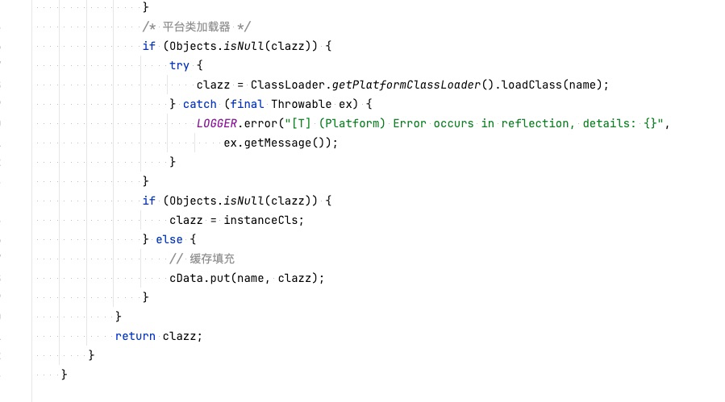
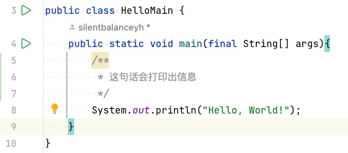
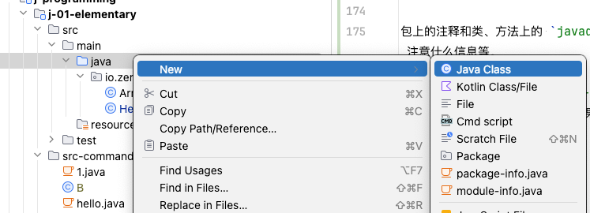
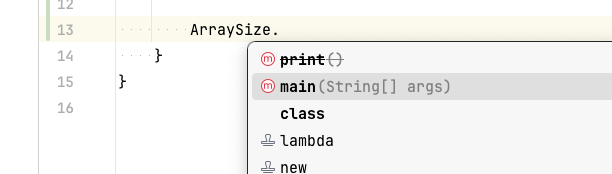
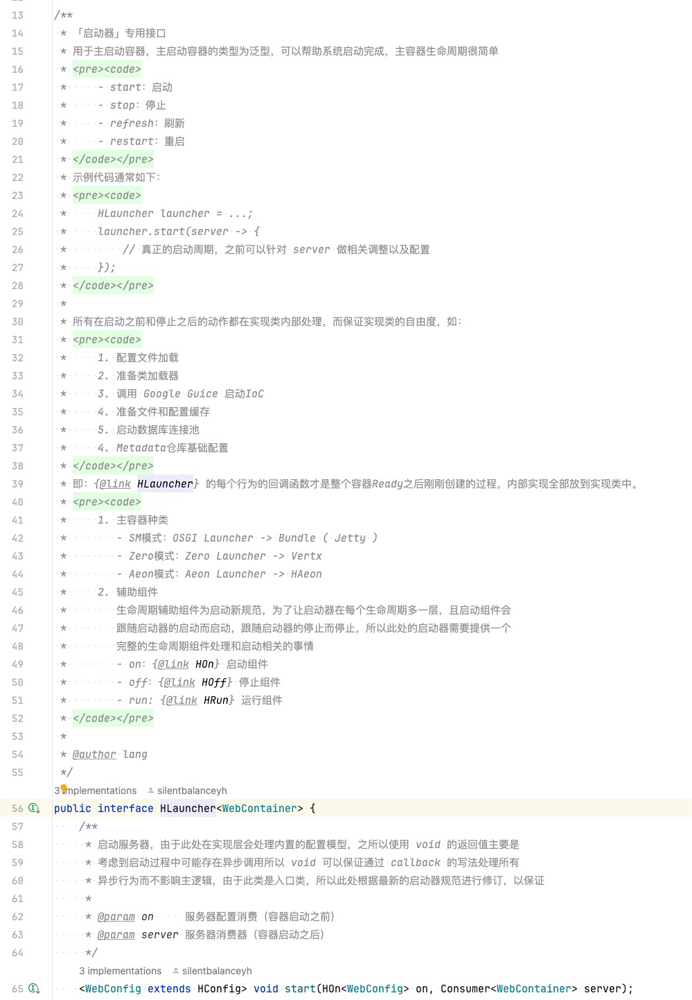

# 1. 基本

## 1.1. 语法

Java语言中的注释有三种：

- **单行注释**

    ```java
    // 这是单行注释
    ```
- **多行注释**

    ```java
    /*
     * 这是多行注释
     */
    ```
- **文档注释**

    ```java
    /**
     * 概要描述
     * <p>
     * 详细描述
     * </p>
     * @标签
     */
    ```

## 1.2. 场景

Java中的**单行注释**和**多行注释**一般用于方法内，如：



- 一般情况下，在您的注释不需要追加时，直接使用 `//` 的单行注释对代码进行说明。
- 方法内部 `/**/` 的多行注释会用得很多，但多行注释的格式本身可以是**多行**，也可以是**单行**，更多开发过程提倡直接使用 `/* xxx */` 的格式代替 `//` 的单行注释。

> 其实从实战过程中发现，单行注释的使用频率并不是特别高，**它**更适合注释部分有结论的备注，对于很多位置不一定带有结论的注释，需要使用 `/* xxx */` 留空，由于后期可能注释部分越发负责，所以这样的方式会让您的注释出现堆积，那么最好的方式就是先试用**多行注释**格式代替 `//` 单行的格式，后续直接使用单个回车就转换成对应格式了。

## 1.3. 如何写注释

此处提供两种特殊的思路帮助你写代码和注释，让您可以思考到编程过程中更多细节，写出更高质量的代码。

### 1.3.1. 文学化编程

**文学化**编程是《代码大全》和《编程匠艺》中提倡的一种编程范式，全称为 `Literate Programming`，它将编程语言和文档语言组合，使得程序可以达到如下两个核心目的：

- 程序可以被计算机执行。
- 程序可以被人阅读和理解。

这种编程的主要思想是把程序当做一种文学作品，用人的语言而不单纯是计算机的语言的逻辑和思路，它的优点是工程库程序可读性、可维护性、可重用性，也可以增加程序员的创造性和乐趣。

### 1.3.2. 底层思路

除了**文学化**编程的范式以外，您还需要在编程设计过程中使用底层思维进行编程，这种编程方式不是一种范式，而是要求程序员从硬件的角度出发，理解计算机的底层原理和机制，利用这些原理和机制来设计和实现程序，提高程序的性能、可移植性、执行效率，通过这种方式增强工程师解决和分析问题的能力。

如Java中常考虑的点（**未列全**）：

- 内存的开销。
- 对象的数量、符号引用的数量。
- JVM是否会自动对齐，还是需要手动对齐。
- 底层是否开启缓存（只要可防止二次加载和二次创建都可以考虑）。
- 是否将**强引用**改成**软引用**或**弱引用**。
- 最终编译好的代码是否会被JIT编译器优化。
- 打包的 `jar` 尺寸。
- 是否大概率出现挂起的**符号引用**。

> 初级程序员和高级程序员很大一层的区别在于编程过程的思维模式，虽然写出来的Java代码类似，但您会发现从底层思路上看计算机更能理解高级程序员写的代码。可能你会觉得现代硬件的成熟度已经不需要考虑这些内容了，但若您目前的程序是在一台嵌入式设备上运行（存储不够、内存不够、GC不全、实时性很高），可能您就不得不考虑这样的问题了，服务器集群下的程序不用如此粒度，而一旦上了硬件微端设备，计算机对上述点的改动是十分敏感的。

举个例子，参考代码：

```java 
        final List<String> data = new ArrayList<>();
        data.add("A");
        data.add("B");
        // 迭代1
        for(int idx = 0; idx < data.size(); idx++ ){
            final String name = "Name " + idx;
            System.out.println(name);
        }
        // 迭代2
        final int size = data.size();
        for(int idx = 0; idx < size; idx++ ){
            final String name = "Name " + idx;
            System.out.println(name);
        }
```

上述代码中调用了 `data.size()` 来提取尺寸，按计算机本身的逻辑而言，此处要考虑的点在于：`size` 的计算模式：**实时运算**还是**缓存运算**——当然很多底层写法对现代新版的语言不一定生效，但最终是否有效取决于源代码中的内容，参考 `ArrayList` 中的源代码：

```java 
/**
 * Returns the number of elements in this list.
 *
 * @return the number of elements in this list
 */
public int size() {
  return size;
}
```

上述代码说明上述两种带索引的迭代的方式没有任何所谓的**性能差异**，但若是 `Class` 中的 `getSimpleName()` 方法，那么就会有所不同：

```java 
/**
 * Returns the simple name of the underlying class as given in the
 * source code. An empty string is returned if the underlying class is
 * {@linkplain #isAnonymousClass() anonymous}.
 * A {@linkplain #isSynthetic() synthetic class}, one not present
 * in source code, can have a non-empty name including special
 * characters, such as "{@code $}".
 *
 * <p>The simple name of an {@linkplain #isArray() array class} is the simple name of the
 * component type with "[]" appended.  In particular the simple
 * name of an array class whose component type is anonymous is "[]".
 *
 * @return the simple name of the underlying class
 * @since 1.5
 */
public String getSimpleName() {
  ReflectionData<T> rd = reflectionData();
  String simpleName = rd.simpleName;
  if (simpleName == null) {
    rd.simpleName = simpleName = getSimpleName0();
  }
  return simpleName;
}
```

上述代码中的 `getSimpleName()` 从代码上看它会在每次调用时都会重新计算一次，当然由于新版JDK中使用了 `ReflectionData` 对元数据解析的内容做了缓存，所以此处你可以理解为底层已处理了缓存，但此处若您每次都调用 `getSimpleName()` 方法依旧可以产生开销：**创建局部 `simpleName` 符号引用**，只是这种开销是可以忽略的。

<hr/>

# 2. `javadoc` 命令

`javadoc` 是一款能根据源代码中的文档注释生成文档的工具，它是Java SDK中自带的工具，可以通过命令行来调用，也可以通过IDE来调用，Java语言中的**文档注释**可以直接被此工具识别，并生成HTML格式的API文档。若要使用 `javadoc` 生成文档，您必须按照**文档注释**的格式和对应标签来书写注释。

## 2.1. 文档注释位置

根据文档注释所在的位置，`javadoc` 注释主要分为三类：

- 写在类和方法上面的注释（类和方法上的 `javadoc` 注释虽然位置不同，但写法一样）。
- 写在包上的注释。
- 写在字段上的注释。

**注**：文档注释一般不在方法内部使用，您若使用也不会被 `javadoc` 工具解析并处理，倘若用了 IDE 工具，会被**警告**，所以——**文档工具**的位置一定不要弄错。



## 2.2. 格式解析

### 2.2.1. 类/方法上

这种注释一般分三段：

1. **概要描述**（又称 `Main Description`），用一句话或者一段话来描述类或者方法的作用，以**英文句号**结束，这句话会被提及并放到索引目录中。如果工具识别到第一个**英文句号**，系统会自动认为概要描述已经结束，紧接着所有的描述都不会放到概要中。

   > 若您想避免上述情况发生，可以在英文句号后边加上 `&nbsp;`（HTML中的空白），这样系统将会判定 `&nbsp;` 后的下一个英文句号为概要描述的结束标记。
2. **详细描述**，用一段话或者多段话详细描述该类的作用，每段话都以英文句号结束，详细描述中可以直接使用 `HTML` 标签，如：
   
   - `<p>`：定义段落、写在段前边。
   - `<pre>`：放在此标签内的内容可以保留“原始格式”（这个标签比较高频）。
   - `<a>`：定义超链接。
   - `<li>`：定义列表项等标签。
3. **文档标记**：类似小标签一样的说明。

**注**：描述部分和文档标记中间必须空一行来书写。

### 2.2.2. 包上

包上的注释和类、方法上的 `javadoc` 的格式一样，内容方面主要是介绍这个包是干什么用的，包的结构在使用方面要注意什么信息等。

通常包上的注释是写在 `package-info.java` 这个文件中的，此文件在您创建包时可以选择自动创建，或者只能用 `IDE` 的**特殊**菜单创建，如果你使用类模式创建，它会提示非法（类名中不能带 `-` 符号）。



### 2.2.3. 字段

字段注释唯一的限制就是只有 `public` 类型的字段需要注释，一般 `private` 不使用注释，所以这种情况下在Java面向对象设计中，通常会注释在 `static` 的字段中（接口常量或类静态变量）。

## 2.3. 文档标记

接下来介绍几个最常用的 `javadoc` 标记，标题括号中是这个标记最早出现的JDK版本号。

```bash 
javadoc -d <输出目录> xxx.java
```

### 2.3.1. @since (1.1)

用于表示当前的API、或者这段代码最早出现在哪个版本，通常可以填版本号带日期，这样这个API就限定了最低运行环境。如：

```java 
@since 1.4          // JDK 1.4 版本
@since 2023-01-01   // 最早出现日期：2023年1月1日
@since JDK 1.7      // 最低运行是JDK 1.7
```

### 2.3.2. @author (1.0)

作者标记，用于指明作者，可以是一个人，也可以是团队或组织，还可以附加邮箱或超链接。

- 若您的作者有多个，那么可以多次使用 `@author` 标签。
- 若您的作者是一个团队或组织，也可以直接使用 `@author` 标签。
- 若您不知道作者是谁，可以使用团队的约定

若您不确定作者，也可以使用网上一种约定俗成：`@author unascribed` 或自定义类似 `@author unknown` 来指明。

```java
// 作者
@author Lang
// 组织
@author ECNU
// 文本邮箱
@author silentbalanceyh@126.com
// 超链接邮箱
@author <a href="mailto:silentbalanceyh@126.com">Lang</a>
```

### 2.3.3. @version (1.0)

指明当前代码版本号，若使用 `-version` 选项时，那么这部分内容会给生成文档追加“版本”子标题，简单如：

```java 
@version 0.0.2
```

### 2.3.4. @deprecated (1.0)

这个标记在升级开发过程中比较常用，用于标记某个API已经被废弃，不建议使用，但仍然保留在代码中，通常会在 `@deprecated` 标记中附加一段说明，说明替代的API是什么，如：

```java
/**
 * @deprecated 请使用 {@link #getXXX()} 方法。
 */
```

大部分IDE会识别这种类型的API、字段或类，并且使用删除线在源代码中标记出来。如：



### 2.3.5. @code (1.5)

此标签可以将一些关键字或代码解析成代码样式，类似于部分文章中的粗体或斜体，它的支持的可以解析的样式如：

- Java关键字，Java Keywords。
- 包名，Package Name。
- 类名，Class Name。
- 方法名，Method Name。
- 接口名，Interface Name。
- 字段名，Field Name。
- 参数名，Argument Name。
- 代码示例，Code Example。

### 2.3.6. @value (1.4)

常量注释专用标签，此标签通常只用于在字段上描述常量信息。

```java
    /**
     * {@value #KEY_PAGER}, It's mapped to `pager` field in json configuration.
     * 「Pagination」This json contains following two field:
     * 1. page: The page index ( started from 1 ).
     * 2. size: The page size.
     */
    String KEY_PAGER = "pager";
```

### 2.3.7. @param (1.0) / @return (1.0)

方法中常用的两个标签：

- @param：用来说明方法参数，有几个参数就使用几个这种标签。
- @return：用来说明方法返回值。

```java
    /**
     * @param param1 参数1
     * @param param2 参数2
     * @return 返回值说明
     */
    public String getXXX(String param1, String param2){
        return "XXX";
    }
```

### 2.3.8. @throws (1.2) / @exception (1.0)

一般用来描述何时抛出异常，而这两种标签用法几乎一致：

```java
    /**
     * @throws NullPointerException 当参数为null时抛出此异常。
     * @exception NullPointerException 当参数为null时抛出此异常。
     */
    public void getXXX(String param1, String param2){
        if(param1 == null){
            throw new NullPointerException("param1 is null.");
        }
    }
```

### 2.3.9. @see (1.0) / @link (1.2) / @linkplain (1.4)

这三个标签都可以用来创建**超链接**，用来链接到其他的类、方法、字段、包等。

- @link / @linkplain 的区别在于：@link 直接将超链接中的地址当做显示文本，格式如：
    
    ```java
    {@link 地址}
    ```
    而 @linkplain 可以自己设置显示文本，格式如：

    ```java
    {@linkplain 地址 显示文本} 
    ```
- 上述格式中 **地址** 格式为：`包名.类名#方法名` 或 `包名.类名#字段名` 或 `包名.类名` 或 `包名`。
- @see 标签可以用来创建超链接，也可以用来创建文本超链接，格式如：

    ```java
    @see 地址
    @see #方法名
    @see #字段名
    @see #类名
    @see #包名
    @see #类名#方法名
    @see #类名#字段名
    @see #包名#类名
    @see #包名#类名#方法名
    @see #包名#类名#字段名
    ```
- @link 和 @see 的区别在于：@link 可以放在某一行中的任意位置，但 @see 只能放在行首。

<hr/>

## 3. 心得分享

注释的格式会影响代码的美感，而且会导致阅读的成本有所提升，所以在编程过程中，您应该尽量避免使用过多的注释，而是通过代码本身的结构和命名来提高代码的可读性，注释只是作为一种补充，而不是主要的阅读方式。但是若您的系统是偏向底层比较复杂的系统，那么注释的格式显得尤其重要。

### 3.1. `<pre>` 和 `<code>`

这两个标记在 Zero 框架中经常使用，其作用在于：

- 保持原始文本格式。
- 保持原始代码风格。

其中 `<code>` 还可以追加 `class` 属性表示它的语言，使用 `<pre>` 的好处在于**保留空白**，对很多想要格式化排班的开发工程师而言，不用通篇使用 `<li>` 的标签，而是将语法直接扔在 `<pre>` 中，由于现代开发文档工具 `Markdown` 和 `AsciiDoc` 的流行，您也可以直接在 `<pre>` 中书写相关语法，然后配合 Maven 插件来生成更多样化格式的 HTML。

### 3.2. 关键点

1. **注释不废话**：比如您已经定义了一个属性为 `name`，那么没有必要再翻译一次；或者说您定义了常用的 `get/set` 方法，除非是IDE自动生成，没有必要自己去补齐注释（两个方法内部存在运算的时候除外）。
2. **不用大段文字**：没有人会去看您的大段文字，除非您的代码是开源的，而且是一个很重要的项目，否则您的注释不要超过两三行，否则您的注释就是一种阅读负担。
3. **多用 `<pre>`**：由于 `<pre>` 可以保证原始格式，所以您可以在注释中使用 `<pre>` 来保证代码的格式，这样可以让您的注释更加美观，也可以让您的注释更加易读。
4. **解释设计**：对于不太容易理解的设计，您可以在注释中详细解释，这样可以让您的代码更加易读，也可以让您的代码更加易于维护。

参考：



上述代码中的注释由于解释了复杂的高阶设计，所以有很多的文字，但是由于使用了 `<pre>` 标签，所以代码的格式依旧保持了原始的格式，这样可以让您的注释更加易读，也可以让您的注释更加易于维护。避免了大段文字之后，您的注释就不会成为阅读负担，而是一种阅读的补充。


