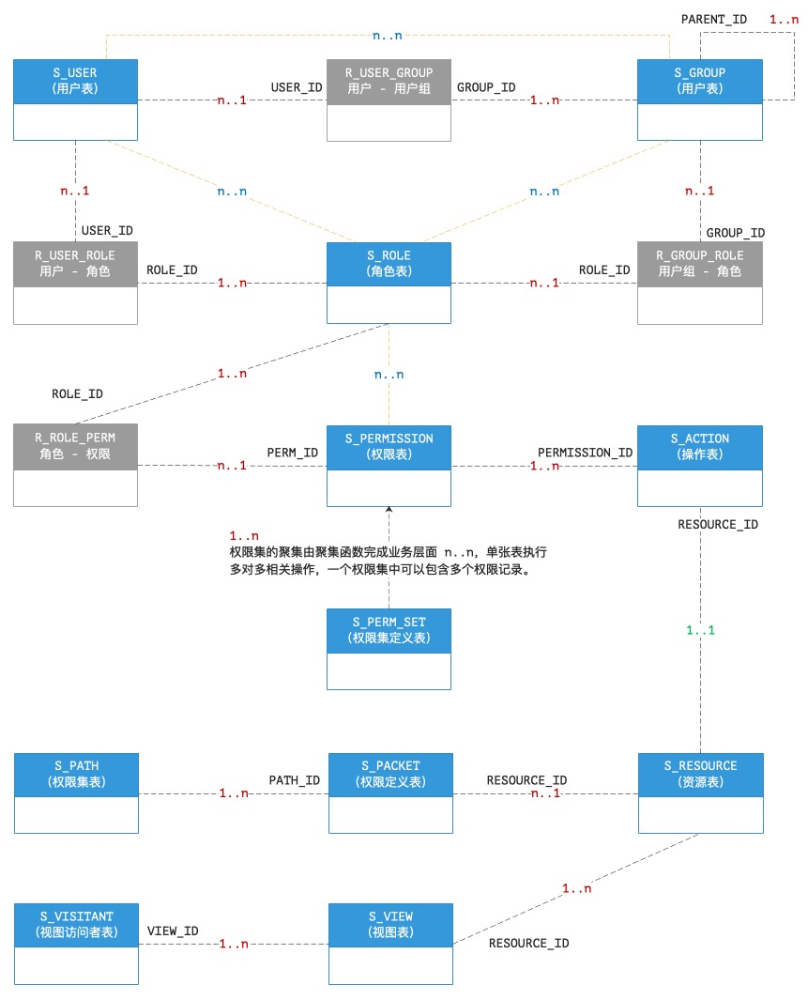

# 3.1. 四象之疆：RBAC

> &ensp;&ensp;&ensp;&ensp;“有渰萋萋，兴雨祈祈。雨我公田，遂及我私。”——《小雅·北山之什·大田》

* 项目URI地址（非Git）：<https://github.com/silentbalanceyh/vertx-zero/tree/master/vertx-pin/zero-rbac>
* 扩展项目：`verxt-pin/zero-rbac`

&ensp;&ensp;&ensp;&ensp;`zero-rbac`项目是Zero Extension扩展框架中的核心项目，它提供了一个应用系统的基本RBAC权限管理模型，该模块表结构以`S_`
为前缀，在Zero中实现了复杂的认证和授权流程。

## 「壹」原理解析

### 1.1. 数据表结构

&ensp;&ensp;&ensp;&ensp;`zero-rbac`中的所有数据表结构如下：

**实体表**

|表名|术语|含义|
|:---|---|:---|
|S_USER|用户|账号基本信息。|
|S_ROLE|角色|角色基本信息。|
|S_GROUP|用户组|用户组基本信息。|
|S_PERMISSION|权限|权限基本信息。|
|S_ACTION|操作|操作基本信息。|
|S_RESOURCE|资源|资源基本信息。|
|S_VIEW|视图|资源窗口视图基本信息。|

**管理表**

|表名|术语|含义|
|:---|---|:---|
|S_PERM_SET|权限集|权限集基本信息。|
|S_PATH|权限集管理|权限集管理配置信息。|
|S_PACKET|数据域管理|数据域管理配置信息。|
|S_VISITANT|资源访问者|动态资源访问配置（数据域专用）。|

**关联表**

|表名|含义|
|:---|:---|
|R_GROUP_ROLE|用户组 - 角色（多对多）|
|R_ROLE_PERM|角色 - 权限（多对多）|
|R_USER_GROUP|用户 - 用户组（多对多）|
|R_USER_ROLE|用户 - 角色（多对多）|

&ensp;&ensp;&ensp;&ensp;其中三种不同的表结构功能不同：

* **实体表**：所有的**安全实体**对象定义表结构。
* **管理表**：在标准的**权限管理**模块专用的管理定义表，用于启用`zero-rbac`前端管理模块专用。
* **关联表**：描述**安全实体**关系表结构。

&ensp;&ensp;&ensp;&ensp;这些表结构的完整ER图如下

&ensp;&ensp;&ensp;&ensp;上图是RBAC中完整的ER结构图。

### 1.2. 功能支持

&ensp;&ensp;&ensp;&ensp;Zero框架支持AOP认证插件，并在`zero-rbac`中实现了最基础的RBAC模型，它的完整功能表如下：

#### 1.2.1. 独立功能

* 支持最基础的**（用户-角色）**模型，一个用户可关联多个角色。
* 支持**（用户-用户组）**的安全实体模型，一个用户可隶属多个用户组，这种模式下，自然支持**（用户组-角色）**模型，一个用户组同样可关联多个角色。
* 支持**优先级**模式，在多角色环境下，不同角色之间支持四种核心模式：
    1. UNION：取多个角色的权限**并集**——最大权限集（默认模式）。
    2. EAGER：这种模式下，权限集取**优先级最高**的角色的权限集。
    3. LAZY：这种模式下，权限集取**优先级最低**的角色的权限集。
    4. INTERSECT：取多个角色的权限**交集**——最小权限集。
* 支持**树型优先级**用户组，在树型用户组环境下，同一级别的用户组之间又支持上述四种不同的核心模式，而对树的权限计算而言，支持以下两种不同维度计算：
    1. 平级组选择：
        1. HORIZON：**「水平模式」**取多个用户组的权限**并集**（默认模式，所有关联组）。
        2. CRITICAL：**「决定模式」**这种模式下，只考虑**优先级最高**的用户组的权限集。
        3. OVERLOOK：**「忽略模式」**这种模式下，只考虑**优先级最低**的用户组的权限集。
    2. 树形组选择：
        1. （无值标记，默认模式），只考虑直接关联组，按平级组选择计算。
        2. PARENT：**「父辈模式」**这种模式中，只考虑父组。
        3. CHILD：**「子辈模式」**这种模式中，只考虑子组。
        4. INHERIT：**「继承模式」**这种模式下，只考虑父组和当前组。
        5. EXTEND：**「扩展模式」**这种模式下，只考虑子组和当前组。
*
定义了Profile的虚拟概念，任意一个用户在登录过后会计算出该用户定义的所有权限集，并且分装在不同的Profile中，最终执行认证授权时会根据资源本身支持的Profile来判定用户是否有权访问该资源。——目前的版本中资源定义只能设定一种Profile访问，这种设计可以对用户执行动态授权以实现单用户多资源域的登陆流程。
* ACL授权流程中，支持**数据域**功能（连续行、连续列、离散行、离散列、查询过滤），使用复杂的规则后，在**读/写**两种操作中，任一资源都可以让登陆用户实现数据的细粒度访问（最小资源权限为数据单元格）。
* ACL授权流程中，支持**角色**级（通用权限）和**用户**级（特定权限）两种模式。
* ACL授权流程中，支持**用户**级特权中的时效性，可针对该用户某一个时间区间进行授权，超时过后系统自动回收该用户的权限。
* ACL授权流程中，实现**资源搜索**功能，提供核心组件**资源访问者**以检索单个资源下的不同形态以形成**资源窗口**和**权限窗口**的混合运算以决定该安全实体（角色/用户）最终访问的真实资源信息。

#### 1.2.2. OOB功能

> 配合`zero-ui`，RBAC模型实现了复杂的**表单、列表、操作**的权限控制，OOB功能中还包含了前端项目的**权限管理**界面，前提是前后端都使用Zero框架。

* 表单部分
    * 针对不同表单，支持**静态渲染**（Json配置）和**动态渲染**（数据库配置）两种模式。
    * 支持对表单字段的三种控制：
        * **不可见**：用户不可以编辑该字段，有数据时会显示`****`以提示用户。
        * **只读**：用户不可以编辑该字段。
        * **可编辑**：用户可以编辑该字段，如果可编辑，那么该字段必须是**可见的**。
* 列表部分
    * 针对不同列表，支持四种维度的列数据计算：
        * **完全列**：当前实体的所有列信息。
        * **系统列**：系统强制设置了**只读、系统**等所有后台运算列（特殊列）。
        * **可见列**：根据基础ACL计算过后当前用户/角色能够访问的最大列集。
        * **视图列**：使用不同视图时，用户/角色能够访问的最大列集。
    * 上述四种维度的计算公式如：
        * `完全列 = 系统列 + 非系统列（业务列）`
        * `可见列`和`视图列`都是经过ACL计算过后非系统列的**子集**。
    * 支持**数据域**的功能，可以将访问数据构造成**二维数据集**，经过规则配置后，构造该**数据集**的**资源窗口**，资源窗口对数据集执行筛选构造最终的**二维数据子集**：
        * **行筛选**：（OOB中的菜单设置），执行`IN`条件离散行筛选功能。
        * **查询筛选**：直接动用查询引擎实现数据集查询功能（这种模式包含了行筛选，但由于离散行筛选在很多场景中比较高频，所以直接独立一类）。
        * **列过滤**：对数据实体实现列过滤功能（第一点中的不同列、视图核心原理）。
* 操作部分
    * 支持十六种粒度的操作级别，CRUD各四种。
    * `zero-ui`提供了资源的十五种基本操作（包括增删改的单量和批量、导入导出、视图设置等复杂列表），在基础的CRUD中进行了更加细粒度的扩展。
    * 每个安全实体（角色/用户）都可以对每一种细粒度的操作实现ACL授权。

> 上述功能目前Zero全栈框架已全部实现——特别是OOB部分的功能，主要是为了解决复杂的企业需求，而之中有部分功能只是经过了基础测试，未经历过**生产环境**验证（大概24%左右）。

## 「贰」开发流程

### 2.1. AOP开发

## 「叁」ACL配置

