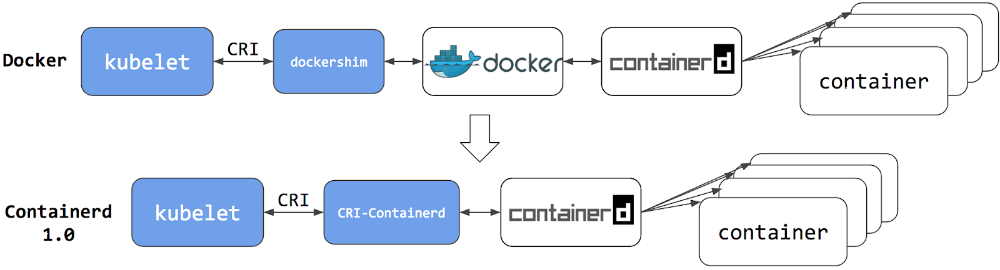
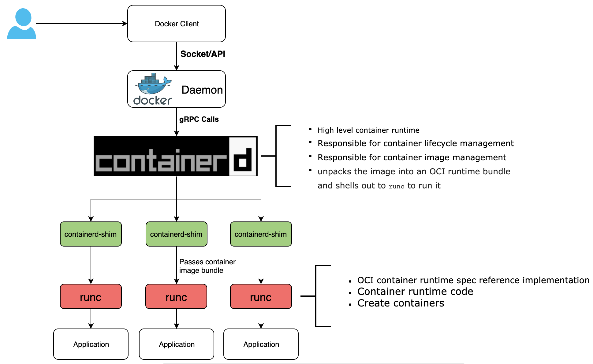
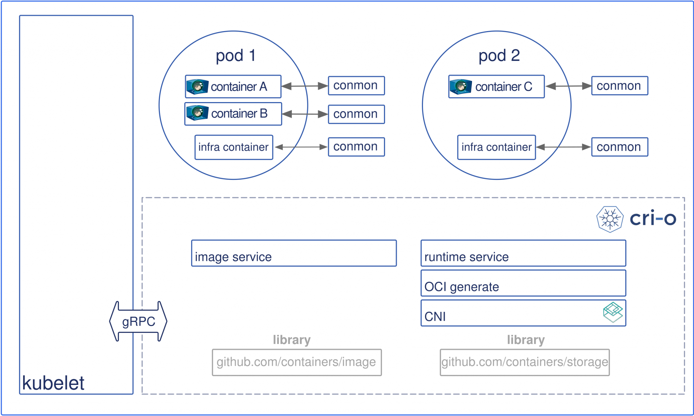
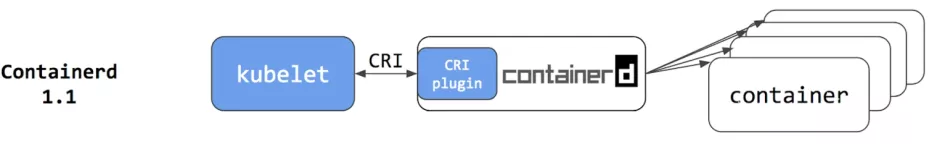
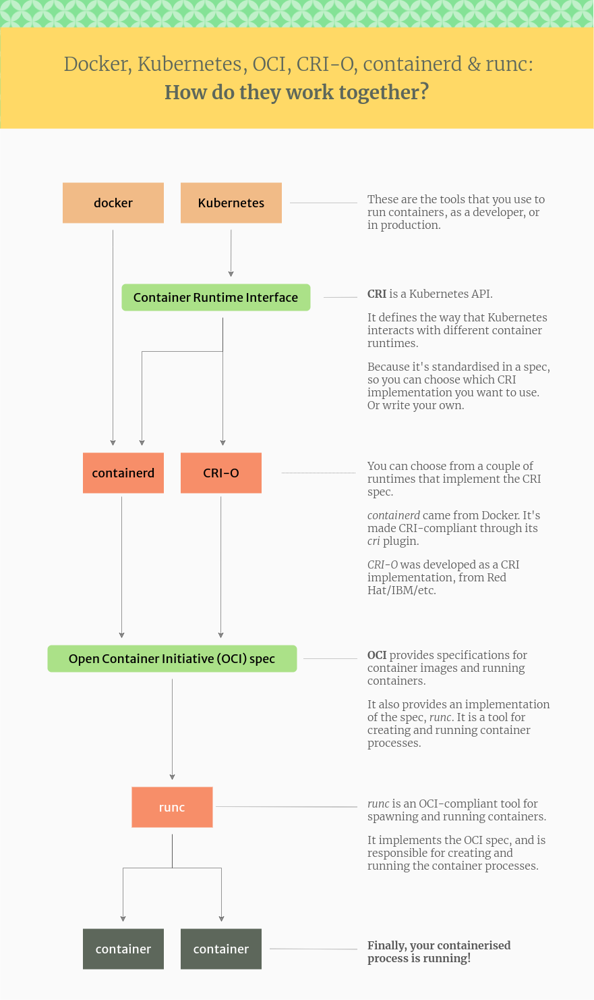
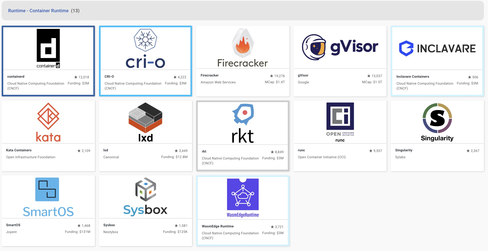
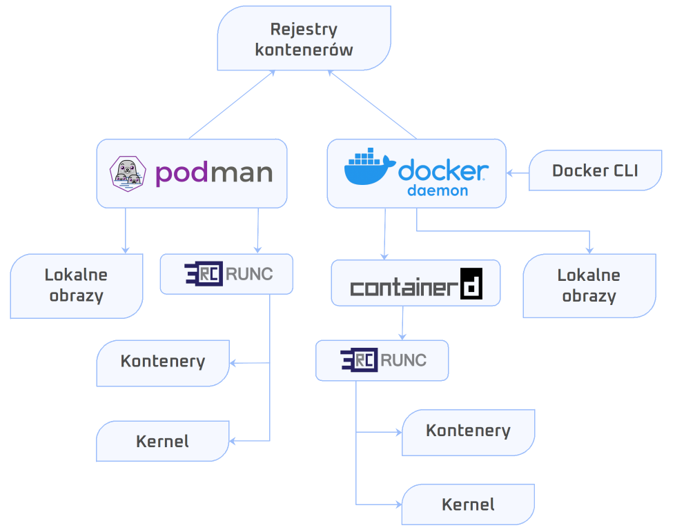
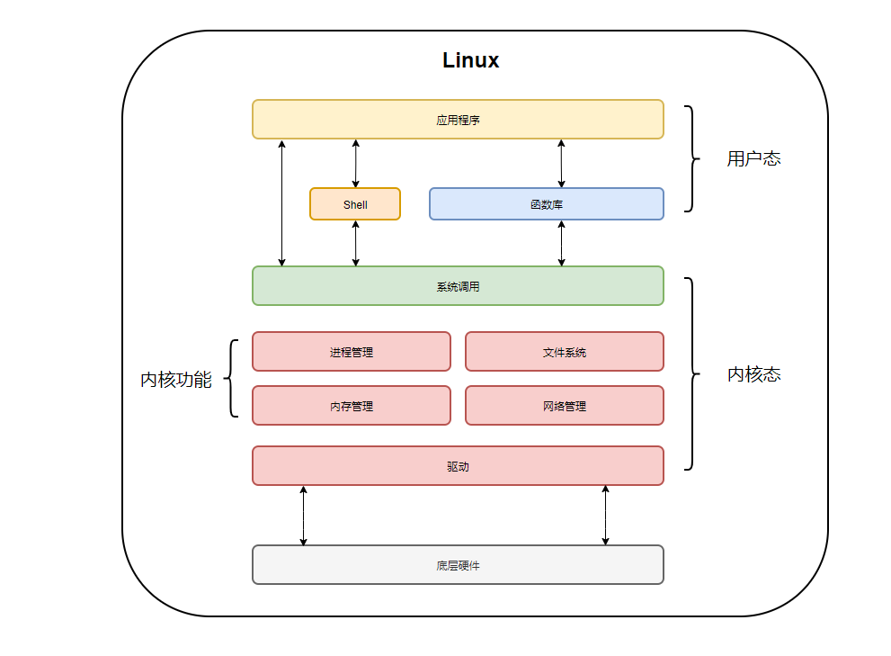
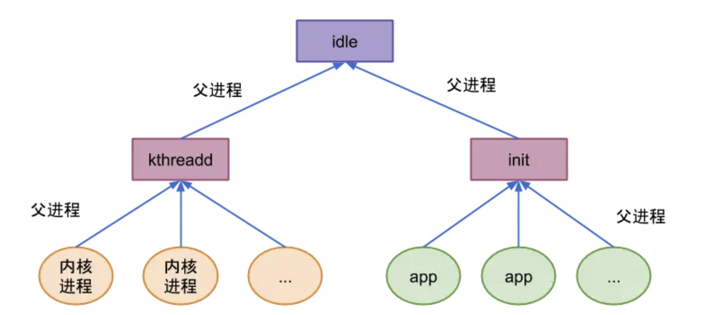
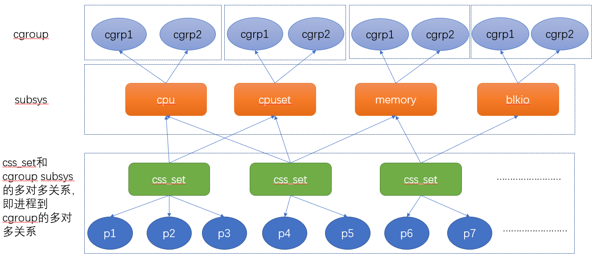

# 贪婪岛：Aeon

> 好风凭借力，送我上青云。——曹雪芹《临江仙·柳絮》

&ensp;&ensp;&ensp;&ensp;由于项目原因，Extension部分作为单点系统目前已运行了多个生产项目，一直想把这部分内容做个总结，但事实证明，这个工程量十分巨大，而且一直在重构和进行中，文档也许**严重滞后**，随着云端双项目的启动：

* 云端脚手架：<https://github.com/silentbalanceyh/vertx-zero-cloud>
* Zero数据标准：<http://www.vertx-cloud.cn/>

&ensp;&ensp;&ensp;&ensp;我打算换一种视角来讲Zero Extension的故事，对的，新故事的主角是**Aeon系统**，而故事的老主角依旧是**Zero Extension**（**它的故事慢慢补**），新版Zero重绘了架构图（参考：<https://gitee.com/silentbalanceyh/vertx-zero>），本章我们就敲开Aeon的大门。章节标题叫做《氷る世界（Ψυχρός κόσμος）》，起源于霜月遥的这首歌——又是一扇二次元的大门，而Aeon的名字起源于缇欧妹纸（零之轨迹角色）启动的永世系统，aeon本身翻译：**永世**。第一章叫**贪婪岛**是因为**不贪婪的人不会上云去玩**，而这个标题熟悉动漫的人也知道，这是《猎人》的第三章故事，一个虚拟的世界，类似于元宇宙的发源地。

&ensp;&ensp;&ensp;&ensp;Aeon系统最初的设计是为了上云，而又鉴于底层云平台在华为、腾讯、阿里三大平台上的高成本，所以只能万丈高楼平地起，从操作系统开始搭建底层系统，底层选择K8并非是追逐潮流，而是Zero最初的微架构就是搭建在gRPC和Etcd基础上准备玩Istio的（**了解Zero的人清楚，最开始它只是个玩具**），所以这次只是拿到古老的钥匙，开了当年哈迪斯残留在人间的潘多拉魔盒——重启`vertx-istio`项目罢了。这个故事很长，我没有信心能讲完，但我尽可能把Zero Extension和Aeon部分的内容娓娓道来，也许从这个视角，读者才明白Zero Extension的独特之处。

> 本章参考文档：<https://kubernetes.io/docs/home/>

## 1. 人生如初见：Container Runtime

* 参考：[移除 Dockershim 的常见问题](https://kubernetes.io/zh-cn/blog/2022/02/17/dockershim-faq/)

&ensp;&ensp;&ensp;&ensp;Aeon来到一个充满未知的世界，这个世界的名字叫做K8S（Kubernetes，来自希腊语“舵手”、“领航员”，8代表中间缩写了8个字母），带上您的初级装备，先把这个世界走一走（Zero中的第一个新角色叫做：[aeon-aurora](https://gitee.com/silentbalanceyh/vertx-zero/tree/master/vertx-istio/zero-edge/aeon-aurora)，aurora：黎明的女神），它的责任就是将zero中前后端统一打包成一个独立镜像，等待着K8S的召唤，独立镜像不意味着**大胖纸**——Zero Extension中的公共服务会逐渐从原始模块中抽象和分离出来形成云原生平台的共享服务，不过目前这种低等级时代，就先胖一胖。

> 真枪实弹的刀剑场，我会抛弃`minikube`环境（实验/学习环境之一），这个环境的搭建可直接参考官方教程以及在线的各种文档，本文直接搭建**生产环境**（3节点、应该叫伪生产环境），并做下相关战斗记录。

&ensp;&ensp;&ensp;&ensp;本文环境信息如下：

| 项目           | 版本     |
| -------------- | -------- |
| CentOS         | 8.5.2111 |
| Kubernates     | 1.25     |
| Istio          |          |
| TiDB           |          |
| Vert.x Cluster | 4.3.3    |
| JDK            | 17.x     |
| Node           | 18.x     |

&ensp;&ensp;&ensp;&ensp;准备三台机器（账号root、lyu）：

|IP地址|主机名|
|---|---|
|192.168.0.154|k8s-master|
|192.168.0.123|k8s-node-01|
|192.168.0.208|k8s-node-02|

### 1.1. 容器之争

&ensp;&ensp;&ensp;&ensp;容器运行时（全称Container Runtime），它是一个负责运行容器的软件，使Pod可以运行在上面，K8S早期的版本仅适用于特定容器运行时：Docker Engine；之后K8S增加了其他容器运行时的支持，从1.5的版本开始创建了**容器运行时标准接口**（CRI，Container Runtime Interface），该标准主要是为了实现编排各种异构容器运行时并在其之间实现交互操作。

&ensp;&ensp;&ensp;&ensp;由于Docker Engine没有实现CRI，因此K8S团队尝试创建特殊代码来帮助它实现过渡，并且使`dockershim`代码成为K8S的一部分，由于`dockershim`是一个临时解决方案（参考[移除Dockershim的讨论](https://github.com/kubernetes/enhancements/tree/master/keps/sig-node/2221-remove-dockershim)），维护`dockershim`已成为了K8S运维团队的沉重负担，另外在最新的CRI运行时中实现了和`dockershim`不兼容的功能——所以`1.20`版本宣布，从`1.24`版本开始，dockershim正式从K8S项目中移除[^1]。



&ensp;&ensp;&ensp;&ensp;容器运行时是一个软件，主要用来组成K8S Pod的容器，K8S负责编排和调度Pod，在每一个节点上，kubelet使用抽象的容器运行时接口，所以您可以选用兼容的容器运行时，由于Docker是在CRI规范创建之前存在的，`dockershim`相当于K8S和Docker之间的一个适配器组件。

&ensp;&ensp;&ensp;&ensp;不论是Docker还是CRI，底层都调用了`Containerd`，它是一个工业级标准的容器运行时[^2]，强调**简单性、健壮性、可移植性**，它诞生于Docker——Docker作为一个完整的容器引擎，主要包含三部分，由统一的**Docker Daemon**进程提供[^3]（1.11开始）：

* 计算：`Containerd`提供
* 存储：`Docker-Volume`提供
* 网络：`Docker-Network`提供



&ensp;&ensp;&ensp;&ensp;当创建容器请求到达Docker Api，它会调用Containerd执行创建操作，此时Containerd会启动一个`containerd-shim`进程，该进程调用`runc`执行容器的创建；创建完成后，`runc`退出、`containerd-shim`作为容器的父进程收集运行状态并上报给`containerd`，并在容器中`pid`为`1`的进程退出后接管容器中的子进程执行清理以确保不会出现僵尸进程。

&ensp;&ensp;&ensp;&ensp;**为什么containerd不直接调用runc，而要启动一个containerd-shim调用runc**？因为容器进程是需要一个父进程来做状态收集、维持`stdin`等`fd`打开以及抽象层相关工作，若父进程是`Containerd`，它挂掉则整个宿主机上的所有容器都会退出，引入`containerd-shim`解决了这个问题，所以在早期`Containrd`一直是作为`Docker`创建容器的子组件而存在。

&ensp;&ensp;&ensp;&ensp;**何为`runc`**？很久很久以前……

&ensp;&ensp;&ensp;&ensp;**Round 1**[^4]：**Linux基金会 vs Docker**，2013年Docker开源了容器镜像格式和容器运行时，为业界提供了一种更轻量级、灵活的“计算、存储、网络”资源虚拟化和管理的解决方案，2014年容器技术引爆，各种容器编排工具也逐步发力，此时K8S的第一个Release版本也由Google发布。Docker容器的两项核心技术：**Namespace**（资源隔离）和**Cgroup**（资源管理）其并非Docker原创，而是很早就进入了Linux内核的东西，所以Docker的容器解决方案离不开Linux内核的支持：**倘若有人掌握了这两项技术，谁都可以做一套类似Docker的容器解决方案**。

&ensp;&ensp;&ensp;&ensp;容器技术的引爆，使得Docker容器镜像和容器运行时当时成为了行业标准，Docker成为了行业新星，它面对各个行业**神魔**（Linux基金会、Google、微软等）提出的合作邀请充耳不闻，态度强硬且傲慢，力图独自主导容器生态的发展。由于Docker的运行时向下兼容性的问题导致口碑逐渐变差，于是各个**神魔**都打算另起炉灶自己干。Linux基金会联合这些**神魔**向Docker施压，最终Docker屈服，于2015年6月在Docker大会上推出容器标准，并成立了容器标准化组织（OCI、Open Container Initiative），并发展成Linux基金会下的一个项目。OCI标准主要包含两部分：

* 容器运行时规范（runtime-spec）：定义了如何根据对应配置构造容器运行时。
* 容器镜像规范（image-spec）：定义了容器运行时使用的镜像打包规范。

&ensp;&ensp;&ensp;&ensp;而`runC`就是这两个规范落地的实体，它是一个符合OCI规范的轻量级容器运行时生命周期管理工具，最初也是Docker贡献给社区，来源于Docker原始的运行时管理部分，您可以运行`runC -h`查看帮助文档，它提供了生命周期管理、暂停、恢复、热迁移、状态查询等具体细节操作，使用`runC`创建和管理容器比较简单，解决了容器最核心、最底层、最基础的问题。

&ensp;&ensp;&ensp;&ensp;**Round 2**：**K8S vs Docker**，K8S的诞生正是Docker如日中天之时，那时它没有办法和Docker正面对决，只能通过硬编码的方式在`kubelet`中调用Docker API创建容器。OCI的诞生给了Google一把利刃，于是从K8S 1.5开始，它创建了容器运行时接口CRI，本质上就是K8S定义了一组和容器运行时交互的接口，所以只要实现了这套接口的容器运行时都可以直接对接K8S，由于当时CRI没有如今这种统治地位，有部分容器没有实现CRI接口，于是就有了`shim`（垫片）项目，一个`shim`的职责就是作为适配器将各种容器运行时本身的接口适配到K8S的CRI接口上，而`dockershim`就是K8S对接Docker到CRI接口上的一个实现。

&ensp;&ensp;&ensp;&ensp;OCI标准提出后，Red Hat的一些人开始设计和构建一个更简单的运行时，这个运行时仅为K8S使用，于是就有了`skunkworks`项目，最后这个项目定名为`CRI-O`——它实现了一个最小的CRI接口——引用原话：**CRI-O被设计为比其他的方案都要小，遵从Unix只做一件事并把它做好的设计哲学，实现组件重用**[^5]。根据CRI-O开发者的研究报告，这个项目最开始服务于`OpenShift`平台，同时得到了Intel和SUSE的支持，CRI-O和CRI规范兼容，并与OCI和Docker镜像格式也兼容，`CRI-O 1.0`于2017年10月正式发布。



&ensp;&ensp;&ensp;&ensp;于是2017年，Docker公司将容器运行时Containerd贡献给了CNCF，为了将Containerd接入到CRI标准中，K8S成立了`cri-containerd`项目，它是一个单独的守护进程，直接实现了`kubelet`和`containerd`之间的交互，形成了`Containerd 1.0`的样子，之后`cri-containerd`又被改造成了`Containerd`的CRI插件位于内部，K8S启动更加高效，就形成了如下结构：



&ensp;&ensp;&ensp;&ensp;再加上CRI-O的催化，直接兼容CRI和OCI规范，最终结果都比`dockershim`得方式接入K8S简单，于是这场战役以Docker失败告终。综合提到的`runC, OCI, CRI-O, Containerd, CRI`，它们的完整结构如如下[^6]：



&ensp;&ensp;&ensp;&ensp;Docker和K8S的战争中，Google最初只是一个独角戏，而[云原生计算基金会](https://www.cncf.io/)（CNCF, Cloud Native Computing Foundation）带来的社区力量改变了这一切，它成立的目的是构建“云原生”计算并推动其落地，这是一种围绕**微服务、容器、动态调度**以基础设施架构为中心的方式，这种风格就是通常我们提到的FIFEE（Google's Infrastructure For Everyone Else）：为其他所有人用的Google基础设施。

&ensp;&ensp;&ensp;&ensp;回顾Docker这位屠龙少年，虚拟化技术从虚拟机转移到容器运行时，它以简洁优雅的方式出场即王炸直接将VMware旗下的Cloud Foundry斩于马下，`Build Once, Run Anywhere`这句致胜的法则就是Docker打败CF的秘诀，加上Docker对开发人员的友好性，夺取了当之无愧的C位。而它在拿到融资之后，开始大量收购（DockerCompose, Docker Swarm, DockerMachine），从此这位开源的屠龙少年开始进行了商业化进程，释放的信号是未来的云厂商需要向Docker公司支付授权费用，过早暴露的商业化意图也为自己埋下了隐患。OCI基金会的成立被少年的傲慢忽略了，当时的它并没把OCI放在眼里，凭借自身的用户优势对**标准**漠不关心，OCI虽然在Docker缺席中发展缓慢，而之后的CNCF的成立却给OCI打了一剂强心针，也将K8S正式推出了舞台。之后的故事就没有什么可讲的了，Docker输在了视觉上：如果说Docker Swarm编排只是站在了容器视觉处理问题，而K8S则只是将容器定位为运行时环境（**容器运行时**），Pod和Service才是编排建模中的重点，只要符合标准的容器运行时都可以被Pod编排；如果说Docker打败CF依靠的是简洁，那么K8S打败Docker就是真正意义上的**降维打击**。有了这样的优势，K8S开始去Docker化操作，`1.20`版本会有警告，而从`1.22`版本之后移除了Docker的支持，`1.24`版本后拿掉了`dockershim`项目。

### 1.2. CRI的选择

&ensp;&ensp;&ensp;&ensp;`dockershim`虽然被K8S拿掉，但您依旧可以使用Docker在本机进行开发，`docker build`的镜像依旧适用于所有CRI实现，而Docker在`dockershim`移除之后为Docker Engine开发了一个替代品[cri-dockerd](https://github.com/Mirantis/cri-dockerd)，您可以直接安装`cri-dockerd`让`kubelet`和Docker Engine连接。

&ensp;&ensp;&ensp;&ensp;当然您可能正在使用Docker Engine，您也可以选择迁移到Containerd，从调用链上可以看到它比原生的Docker有更好的性能和开销，您可以访问[CNCF landscape](https://landscape.cncf.io/card-mode?category=container-runtime&grouping=category)提供的选项选择适合您的CRI。



&ensp;&ensp;&ensp;&ensp;虽然Docker和大多数CRI（包括Containerd）之间的底层容器化代码是相同的，但周边会存在一定差异，迁移时需要考虑：

* 日志配置
* 运行时的资源限制
* 调用 docker 或通过其控制套接字使用 Docker Engine 的节点配置脚本
* 需要 docker 命令或 Docker Engine 控制套接字的 kubectl 插件
* 需要直接访问 Docker Engine 的 Kubernetes 工具（例如：已弃用的 'kube-imagepuller' 工具）
* registry-mirrors 和不安全注册表等功能的配置
* 保障 Docker Engine 可用、且运行在 Kubernetes 之外的脚本或守护进程（例如：监视或安全代理）
* GPU 或特殊硬件，以及它们如何与你的运行时和 Kubernetes 集成

&ensp;&ensp;&ensp;&ensp;还有一个关注点就是创建镜像时，系统维护、嵌入容器的任务无法工作：前者，您可以使用[`crictl`](https://github.com/kubernetes-sigs/cri-tools)工具作为临时解决方案[^7]；后者，您可以使用新的容器创建选项，如：

* img: <https://github.com/genuinetools/img>
* buildah: <https://github.com/containers/buildah>
* kaniko: <https://github.com/GoogleContainerTools/kaniko>
* buildkit-cli-for-kubectl: <https://github.com/vmware-tanzu/buildkit-cli-for-kubectl>

### 1.3. Podman一枝独秀

&ensp;&ensp;&ensp;&ensp;Podman是RedHat旗下的一款产品，它旨在使用K8S的方法来构建、管理、运行容器，作为一款主流容器的可靠替代品；RedHat从RHEL 8起，使用`CRI-O/Podman`取代了`Docker Daemon`。探讨下为什么？

1. Docker有单点故障问题，一旦Docker Daemon死亡所有容器都将死亡。
2. Docker Daemon拥有运行中容器的所有子进程。
3. 所有Docker操作都必须由具有跟root相同权限的用户执行。
4. Docker构建容器时容易导致安全漏洞。

&ensp;&ensp;&ensp;&ensp;Podman和Docker区别[^8]如下：



&ensp;&ensp;&ensp;&ensp;Podman是一种开源的Linux原生工具，旨在根据OCI标准开发、管理、运行容器和Pod，它是RedHat开发的一个用户友好的容器调度器，也是RedHat 8和CentOS 8中默认的容器引擎。Podman的工具集包括：

* **Podman**：Pod和容器镜像管理器
* **Buildah**：容器镜像生成器
* **Skepeo**：容器镜像检查器
* **Runc**：容器运行期和特性构建器，传递给Podman/Buildah
* **Crun**：可选运行时，为Rootless容器提供更大的灵活性、控制和安全性

&ensp;&ensp;&ensp;&ensp;Podman 2.0的**优势**如：

1. 因为Docker和Podman创建的镜像都符合OCI标准，它可以使用比较流行的容器注册中心（`Docker Hub或Quary.io`）。
2. Podman不会使用额外的守护进程运行容器，它可以直接和`systemd`集成支持在后台运行容器。
3. 允许您创建和管理Podami，支持一组（一个或多个容器）一起工作，这有助于之后将工作负载转移到K8S和Podman的编排任务中。
4. 它可以使用UID分离命名空间，这样等价于在容器运行时提供了额外的隔离层，更安全。
5. 它可以基于正在运行的容器为K8S生成YAML文件（命令：`podman generate kube`）。

&ensp;&ensp;&ensp;&ensp;Podman的使用定位也是兼容Docker的：

* **构建者角度**：用Podman的默认软件和Docker的区别不大，它只是在进程模型、进程关系方面有所区别，而Podman相对于Docker而言更简单，由于不需要守护进程，它的重启的机制也有所变化。
* **使用者角度**：Podman和Docker的命令基本兼容，都包括容器运行时、本地镜像、镜像仓库，它的命令行工具和Docker几乎保持一致，您可直接使用`alias docker=podman`进行替换。

<hr/>

## 2. 他山之石：Cgroup

&ensp;&ensp;&ensp;&ensp;前边章节讲解了容器运行时，本章节我们一起来看看另一个重量级的东西，容器运行的基石——Cgroup，我尽可能追溯更多相关内容，翻翻这个角色的历史[^9]，让您从起源开始理解Cgroup。

### 2.1. 指令集

&ensp;&ensp;&ensp;&ensp;CPU指令集[^10]是CPU实现软件指挥硬件工作的桥梁，每一条汇编语句都对应了一条CPU指令，大量CPU指令一起协同工作就组成了CPU指令集。**复杂指令集**（CISC、Complex Instruction Set Computing）和**精简指令集**（RISC、Reduced Instruction Set Computing）架构是目前的CPU的两大主流架构，其中CISC以Intel、AMD的`x86/x64`为代表，而RISC则以ARM、IBM Power为代表，二者区别如[^11]：

|CISC|早期的RISC|
|---|---|
|指令集数量多，Intel早期文档1200多页说明。|指令数量少得多，通常少于100个。|
|指令延迟很长。|没有较长延迟指令，早期CPU都没有乘法，而是连加实现。|
|编码是可变长度，可以是1 ~ 15个字节。|编码是固定长度，所有指令都是4个字节。|
|指令操作数的方式很多、寻址复杂，通常由偏移量、基地址、变址寄存器、伸缩因子组合而成。|寻址方式简单，只有基地址和偏移量寻址。|
|可对存储器和寄存器执行算术、逻辑运算。|只能对寄存器执行算术和逻辑运算，对存储器则是load/store体系结构。|
|对机器级程序来说实现细节是不可见的。|对机器级细节来说实现细节是可见的，有些RISC禁止某些特殊的指令序列。|
|有条件码，作为指令执行副产品，设置了一些特殊标志位，可用于条件分支检测。|没有条件码，对条件检测来说，要用明确的测试指令，并将测试结果放到一个寄存器中。|
|栈密集的过程链接，栈被用来存取过程参数和返回值。|寄存器密集的过程链接，寄存器被用来存取过程参数和返回值。|

&ensp;&ensp;&ensp;&ensp;CPU指令集存在权限分级。由于它可以直接操作硬件，操作不规范造成的错误会影响整个计算机系统，造成不可挽回的损失；而对硬件的操作十分复杂、参数众多，出错概率相当大，所以操作系统内核直接屏蔽了开发人员某些对硬件操作的可能，不让开发人员碰到这部分CPU指令集。基于此，硬件设备厂商的做法就是对CPU指令集设置了权限，不同级别权限能使用的CPU指令集是有限的。如Intel的CPU分为：`Ring 0、Ring 1、Ring 2、Ring 3`四个权限级，Windows操作系统则使用了`Ring 0`和`Ring 3`两个级别，其中`Ring 0`权限最高，只提供给操作系统使用，而`Ring 3`谁都能用；对Linux系统而言，`Ring 0`就叫做**内核态**，在操作系统内核中运行，`Ring 3`就称为**用户态**，在应用程序中运行。

&ensp;&ensp;&ensp;&ensp;操作系统内部定义了规则，让**用户态和内核态**可实现切换，其本质就是CPU指令集权限的区别，如：应用程序进程要读写IO，必然会使用`Ring 0`级指令，此时CPU指令操作权限是`Ring 3`级，操作系统内部会让应用程序先从`Ring 3`切换到`Ring 0`，再执行相对应的内核代码，执行完成后返回`Ring 3`级别。Linux系统中每个进程都有两个指令栈：用户栈和内核栈，其分别对应用户态和内核态。



&ensp;&ensp;&ensp;&ensp;通常以下三种情况会从用户态切换到内核态：

1. **系统调用**：用户进程通过系统调用向操作系统申请资源完成工作，系统调用核心机制是使用操作系统为用户特别开放的一个中断来实现，又称软中断。
2. **异常**：当CPU执行用户态进程时，发生了一些没有预知的异常，这时当前运行进程会切换到处理异常的内核相关进程，也就是切换到内核态，如缺页异常。
3. **中断**：当CPU执行用户态进程时，外围设备完成用户请求操作后，向CPU发出相应中断信号，此时CPU会暂停执行下一条即将执行的指令，转到与中断信号对应的处理程序去执行，切换到内核态。如硬盘读写操作完成。

> Linux源代码中，一般会把进程称为任务（Task）或线程（Thread）。

### 2.2. 特殊进程

&ensp;&ensp;&ensp;&ensp;传统Unix系统中，某些只能在内核态运行的系统进程，现代操作系统会把它们的函数委托给内核线程（kernel thread）执行，它不受不必要的用户态上下文的影响；注：**内核线程只能运行在内核态，普通线程可以运行在内核态，也可以运行在用户态**。

#### idle进程

&ensp;&ensp;&ensp;&ensp;所有进程的祖先叫做**进程0**（PID=0），*idle进程* 因为历史原因又叫做**swapper进程**，它是在Linux的初始化阶段从无到有创建的一个内核进程（系统创建的第一个进程），运行在内核态，这个祖先进程使用静态分配的数据结构，是唯一一个不通过`fork()`或`kernel_thread()`产生的进程，**加载完成后**转变成进程调度、交换。

&ensp;&ensp;&ensp;&ensp;多处理器系统中，每个CPU都有一个进程0，打开电源，计算机BIOS就会启动一个CPU（称CPU 0），同时禁用其他CPU；运行在CPU 0上的swapper进程初始化内核数据结构，然后激活其他CPU，通过`copy_process()`函数创建其他CPU的idle进程，把0传递给新创建的swapper进程作为它们的新PID。

#### init进程

&ensp;&ensp;&ensp;&ensp;由进程0创建（idle进程调用`kernel_thread()`创建）的内核线程会执行`init()`函数，该函数依次完成内核初始化，它调用`execve()`系统函数加载可执行程序*init*，最终在用户空间创建init进程（PID=1, PPID=0，PPID为父进程ID）。结果，init内核进程转换成一个普通进程，并且拥有自己的进程内核数据结构，它是系统中其他所有用户进程的祖先进程——简单说Linux系统中所有的普通进程都是init进程创建并运行的，**加载完成后**，init转变成**守护进程**监视系统其他进程。

#### kthreadd进程

&ensp;&ensp;&ensp;&ensp;由进程0创建（idle进程调用`kernel_thread()`创建）并始终运行在内核空间，负责所有内核进程的调度和管理。它的任务是管理和调度其他内核进程，会循环执行一个`kthread`函数，该函数作用就是运行全局链表中维护的`kthread`，当系统调用`kernel_thread()`创建内核进程时，创建的进程会被加到此链表中，因此所有的内核进程都是直接或间接的以`kthreadd`为父进程。

&ensp;&ensp;&ensp;&ensp;下图[^12]是最终结构：



> 简单说，idle进程是祖先进程，它创造了init和kthreadd；init进程是所有用户进程的父进程，kthreadd进程是所有内核进程的父进程。

#### 守护进程

&ensp;&ensp;&ensp;&ensp;Linux守护进程（Linux Daemon）是运行在Linux操作系统后台的一种特殊进程，它独立于控制终端并且周期性地执行某种任务或等待处理某些发生的事件，它不需要用户输入就能运行而且提供某些服务，这些服务要么面向整个系统、要么面向某个用户程序。Linux系统的大多数服务器就是通过守护进程实现，常见的守护进程如：

* `httpd`Web服务器。
* `sendmail`邮件服务器。
* `mysqld`数据库服务器。
* `syslogd`系统日志进程。

&ensp;&ensp;&ensp;&ensp;守护进程一般会在系统启动时运行，除非强制终止，否则到操作系统关机时它都一直运行着。通常守护进程以超级用户root权限运行，它们要使用特殊的端口（`1 - 1024`）、或访问特殊资源；它没有交互式控制终端，它的任何输出都需要特殊处理（写入日志），通常以`d`结尾，`httpd、syslogd`等。**爸爸在哪儿**——一般**用户态守护进程**的父进程就是init进程（PID=1）；而**内核态守护进程**的父进程有可能不是init进程，它真正的父进程在`fork()`出子进程之后就先于子进程`exit()`退出了，所以它可以算作init进程直接继承的孤儿进程。

&ensp;&ensp;&ensp;&ensp;理解守护进程需先理解几个概念：

|概念|含义|
|---|---|
|进程组<br/>Process Group|进程的集合，每个进程组会有一个组长（Leader），它的进程ID就是进程组的ID。|
|会话<br/>Session|进程组集合，每个会话有一个组长，其进程ID就是该会话组ID。|
|控制终端<br/>Controlling Terminal|每个会话可以有一个单独的控制终端，和控制终端连接的Leader就是控制进程Controlling Process|

&ensp;&ensp;&ensp;&ensp;守护进程的创建步骤如：

* **fork**：守护进程的父进程通常是init进程，它在创建时从父进程fork出来一个子进程并退出父进程，此时子进程就变成了孤儿进程，算作init的子进程。
* **setid**：该函数用来创建新的会话，同时脱离原来的进程组、会话、控制终端，成为新的会话组长。此时它可能会再申请一个控制终端，所以再fork一下，并保留新的子进程，这样就不是新的会话组长，不能申请控制终端了。
* **close(fd)**：然后关闭从父进程继承的文件描述符——最少关闭`0,1,2`三个文件描述符，分别对应`stdin, stdout, stderr`，通常会调用`sysconf(_SC_OPEN_MAX)`获取系统允许的最大文件描述符个数，然后全部`close`掉——关闭之后还应该将`0,1,2`重新定向到`/dev/null`中防止新打开的文件描述符为`0,1,2`。
* **umask(0)**：设置文件掩码为了不受父进程的umask影响，可自由创建读写文件和目录。
* **chdir("/")**：守护进程一般会执行到系统关机，在它运行过程中所在的目录就不能卸载（unmounted），通过将它的工作目录转移到根目录，该目录就允许卸载了（不一定选择根目录，可以选择一个不需卸载的路径）。

### 2.3. 资源管理

#### systemd

&ensp;&ensp;&ensp;&ensp;systemd[^13]是Linux操作系统中的一种init软件，它的作用是提供更优秀的框架以计算系统服务之间的依赖关系，并且依次实现系统初始化服务时的并行启动，达到降级`shell`系统开销的效果。**它和init进程的区别是什么**？

&ensp;&ensp;&ensp;&ensp;Linux操作系统启动会从BIOS开始，然后Linux引导程序将内核映像加载到内存执行内核初始化，初始化完成后会创建init进程（PID=1），这个进程是系统的第一个进程，它负责产生其他所有的用户进程。单纯启动内核其实毫无用处，于是我们需要一个**系统**可以定义、管理、控制init进程的行为，并可组织、运行许多初始化相关的任务，从而让系统进入一个用户设定的运行模式中，这个系统就是**init系统**（它和System V兼容，因此又称为`sysvinit`）。

&ensp;&ensp;&ensp;&ensp;由于init系统依赖Shell脚本，并且是一次一个任务串行启动，所以启动特别慢，服务器配置比较高无法体会到瓶颈，但在嵌入式设备、移动终端上，这个**缺陷**就显而易见了。于是开发者们开始折腾，对`sysvinit`进行改进，先后出现了upstart和systemd两个主要的新一代init系统，Ubuntu为代表的Linux采用的就是upstart，而RHEL 7.x/CentOS 7.x中默认采用了systemd，由于systemd出现时间更晚发展很快，未来很有可能替换掉upstart成为唯一的选择。

&ensp;&ensp;&ensp;&ensp;`sysvinit`使用术语`runlevel`定义系统运行级别，在之前系统中通常有7种运行级别，但每个Linux发行版对运行级别定义都有所区别，唯一达成共识的是`0, 1, 6`三个级别：

|级别|含义|
|---|---|
|0-关机模式||
|1-单用户模式|单用户只有系统管理员可以登陆。|
|6-重启模式|执行关闭所有运行的进程，然后重新启动系统。|
|2-多用户模式|「不常用」不支持文件共享。|
|3-完全多用户模式|支持NFS服务，最常用的多用户模式，默认登录到终端界面。|
|4-基本不用的用户模式|实现某些特定登录请求。|
|5-完全多用户模式|默认登录到`X-window`系统——Linux图形界面。|

&ensp;&ensp;&ensp;&ensp;systemd是**新一代的init系统**，其主要特点是并发处理所有服务，加速开机流程。早期的运行级别（runlevel）被新的运行目标（target）取代，target命名类似`multi-user.target`形式，如原来的`runlevel 3 = multi-user.target`，原来的`runlevel 5 = graphical.target`。

* **init管理机制**：所有的服务启动脚本都放置于`/etc/init.d`目录，基本上都是用`bash shell`编写的脚本程序，系统启动时依次执行——这就是开篇提到的为什么说systemd是**降级shell系统开销**（常用命令`daemon`和`chkconfig`）。
* **systemd管理机制**：它是运行在**用户态**的应用程序，包含了一个完整软件包，配置文件位于`/etc/systemd`目录下，所有服务脚本位于`/usr/lib/systemd/system`目录下，这些脚本都以`.service`结尾（常用命令`systemctl`）。

> systemctl是一个更强大的命令行工具，您可以把它看作`service`和`chkconfig`的组合体，想要查看、启动、停止、重启、启用、禁用系统级服务，都可以通过systemctl来实现。

#### cgroups

&ensp;&ensp;&ensp;&ensp;cgroups全称是Control Groups[^14]，它是Linux内核提供的一种机制，这种机制根据具体的资源需求把一系列系统任务和子任务按资源等级划分到不同的组进行管理，从而为系统资源管理形成一个统一的框架。简单说，cgroups可以限制、记录任务组使用的物理资源，本质上，它是内核附加在程序上的一系列钩子（Hook），通过程序运行时对资源的调度触发对应钩子以达到资源限制和追踪的目的。

&ensp;&ensp;&ensp;&ensp;典型的子系统如：

|系统名|作用|
|---|---|
|cpu子系统|限制进程的CPU利用率。|
|cpuacct子系统|统计cgroups中的进程cpu使用报告。|
|cpuset子系统|为cgroups中的进程分配单独的cpu节点、内存节点。|
|memory子系统|限制进程的memory使用量。|
|blkio子系统|限制进程的块设备io。|
|devices子系统|控制进程能够访问的某些设备。|
|net_cls子系统|标记cgroups中进程的网络数据包，然后使用tc模块（Traffic Control）对数据库进行控制。|
|net_prio子系统|设置cgroups中进程产生的网络流量优先级。|
|freezer子系统|可挂起或恢复cgroups中的进程。|
|ns子系统|使不同cgroups下的进程使用不同的namespace。|

&ensp;&ensp;&ensp;&ensp;上述每个子系统都需要和内核中对应的模块配合来完成资源的控制和调度，它是分组管理操作系统资源的核心模块，由Google的工程师提出，之后整合到了Linux操作系统中，设计它的目的是为不同用户层面的资源管理提供一个统一化的接口。它提供的功能如下：

* 资源限制（Resource Limiting）
* 优先级控制（Prioritization）
* 资源统计（Accounting）
* 进程组隔离（Isolation）
* 进程组控制（Control）

&ensp;&ensp;&ensp;&ensp;如今以容器为代表的虚拟化技术大行其道，通过了解cgroups您可以管中窥豹感受到Linux系统对资源管理的各个经脉。cgroups相关概念有四：

1. **任务**（Task）：在Linux系统中它就表示一个进程。
2. **控制组**（Cgroup）：资源控制的单位，可能是任务组的集合，每个任务组被分配相对应的资源，包含了一个或多个子系统——一个任务可以加入到这个组中，或者迁移到另外一个组中。
3. **子系统**（Subsystem）：一个资源调度器（Resource Controller），控制各种资源的分配和资源访问权限。
4. **层级树**（Hierarchy）：一种操作系统的组织结构，可理解为一个cgroup树，将cgroup串成树状结构通过虚拟端口暴露给用户。

&ensp;&ensp;&ensp;&ensp;cgroups的整体框架如[^15]：



> Docker到K8S的转变以及容器技术的发展无法绕开systemd和cgroups两个角色，我不打算在这里讲解这两个角色的所有方面，只是引导您囫囵吞枣，保证您可以在遇到环境配置问题时变得不那么困惑。

#### cgroup v2（k8s）

&ensp;&ensp;&ensp;&ensp;K8S中，kubelet和底层容器运行时都要对接`cgroup`来强制执行资源管理——包括为容器化工作负载配置CPU/内存请求/限制，`cgroup v2`是`cgroup` API的下一个版本，它提供了一个具有增强资源管理能力的统一控制系统。它的改进如：

* API中单个统一的层次结构设计。
* 更安全的子树委派给容器。
* 更多新功能，如：压力阻塞信息（PSI[^16] - Pressure Stall Information）。
* 跨多个资源的增强资源分配管理和隔离：
    * 统一核算不同类型的内存分配（网络内存、内核内存）。
    * 考虑非即时资源变化，如页面缓存回写。

&ensp;&ensp;&ensp;&ensp;使用`cgroup v2`最简单的方法是使用一个默认启用`cgroup v2`的Linux发行版，具体要求如下：

* 操作系统发行版启用cgroup v2。
* Linux内核为5.6或更高版本。
* 容器运行时支持cgroup v2，如：
    * containerd v1.4或更高版本。
    * cri-o v1.20或更高版本。
* kubelet和容器运行时配置成使用**systemd cgroup驱动**。

&ensp;&ensp;&ensp;&ensp;您可以执行如下命令查看发行版的cgroup版本：

```shell
stat -fc %T /sys/fs/cgroup/
# 输出为cgroup2fs,  cgroup v2
# 输出为tmpfs,      cgroup v1
```

#### cgroup驱动（k8s）

&ensp;&ensp;&ensp;&ensp;kubelet在管理资源时，若要对接控制组，它和容器运行时需要使用一个**cgroup驱动**，关键点事kubelet和容器运行时需要使用相同的cgroup驱动且使用相同的配置。可选择的驱动有两种：

* **cgroupfs**：它是kubelet中默认的cgroup驱动，当使用该驱动时，kubelet和容器运行时将直接对接cgroup文件系统来配置cgroup。

    > 当systemd时初始化系统时，**不推荐**使用`cgroupfs`驱动，systemd期望系统上只有一个cgroup管理器，此外若您想要使用`cgroup v2`，则需使用`systemd cgroup`驱动代替`cgroupfs`。
* **systemd**：若Linux发行版使用systemd作为初始化系统，初始化进程会生成一个root控制组（cgroup），并充当cgroup管理器。systemd和cgroup集成紧密，它为每个systemd单元分配一个cgroup，因此若您使用systemd用作初始化系统，同时使用`cgroupfs`驱动，系统中就存在两个不同的cgroup管理器。同时存在两个cgroup管理器将造成系统中针对可用的资源和使用中的资源出现两个视图，某些情况下，kubelet和容器运行时配置为使用cgroupfs、但为剩余进程使用systemd的节点在资源压力增大时变得极度不稳定。

    > 所以若Linux发行版是选用systemd作初始化系统时，为了缓解这种不稳定就直接使用systemd作cgroup驱动。

&ensp;&ensp;&ensp;&ensp;要将systemd设置为cgroup驱动，需编辑`KubeletConfiguration`的`cgroupDriver`选项，并将其设置为systemd。如：

```yaml
apiVersion: kubelet.config.k8s.io/v1beta1
kind: KubeletConfiguration
...
cgroupDriver: systemd
```

&ensp;&ensp;&ensp;&ensp;若您将systemd配置为kubelet的cgroup驱动，也必须将systemd配置为容器运行时的cgroup驱动。**注**：更改已加入集群的节点的cgroup驱动是一项敏感的操作，如果kubelet已经使用某cgroup驱动的语义创建了Pod，更改运行时以使用别的cgroup驱动，当为现有Pod重新创建PodSandbox时会产生错误，重启kubelet也可能无法解决此类问题。——**这个过程最好使用自动化操作**。

<hr/>

## 3. 千里之行：环境安装

&ensp;&ensp;&ensp;&ensp;为区分实际步骤和讲解，所有步骤点使用如下语法：

>> **Action**：步骤和解释
> ```shell
> 命令区间
> ```

### 3.1. 首联：OS准备

#### 3.1.1. 再探cgroup v2

* 参考：<https://zorrozou.github.io/>

&ensp;&ensp;&ensp;&ensp;cgroup v2早已经在Linux 4.5的时候加入到内核了，Cent OS 8默认使用了4.18作为内核版本，但系统中仍然默认使用的是cgroup v1。

> **Action**：查看cgroup版本
> ```shell
> stat -fc %T /sys/fs/cgroup/
> # v1 - tmpfs，
> # v2 - cgroup2fs
> ```
> 
> 
> 

&ensp;&ensp;&ensp;&ensp;由于系统上默认开启的是cgroup v1，所以需配置一下系统切换到cgroup v2。

* 查看v1什么样子

    ```shell

    ```


### 3.2. 颔联：K8S环境

### 3.3. 颈联：Istio环境

### 3.4. 尾联：三方环境

## 4. 小结

[^1]: [Docker依赖详解](https://kubernetes.io/zh-cn/docs/tasks/administer-cluster/migrating-from-dockershim/check-if-dockershim-removal-affects-you/)


[^2]: [Containerd的前世今生](https://blog.csdn.net/weixin_30641567/article/details/123838705)，作者：[班婕妤](https://banjieyu.blog.csdn.net/?type=blog)


[^3]: [Let's deeply understand how to run a container](https://blog.caoyu.info/docker-world.html)，作者：[紫玄](https://blog.caoyu.info/)


[^4]: [浅析容器运行时奥秘——OCI标准](https://zhuanlan.zhihu.com/p/478237201)


[^5]: [轻量级容器运行时 CRI-O 解析](https://blog.csdn.net/ccy19910925/article/details/118386726)，作者：[挖煤工人学IT](https://blog.csdn.net/ccy19910925?type=blog)

[^6]: <https://shenxianpeng.github.io/2022/03/container-ecosystem/>，作者：[Peter Shen](https://shenxianpeng.github.io/)

[^7]: [使用circtl对Kubernetes节点进行调试](https://kubernetes.io/zh-cn/docs/tasks/debug/debug-cluster/crictl/#mapping-from-docker-cli-to-crictl)

[^8]: [Podman是什么？它与Docker有什么区别？](https://blog.csdn.net/ma_xiao_qi/article/details/124688653)，作者：[程序员阿宇](https://blog.csdn.net/ma_xiao_qi?type=blog)

[^9]: 《深入理解Linux内核》，作者：Daniel P.Bovet, Marco Cesati，ISBN 978-7-5083-5394-4

[^10]: [从根上理解用户态和内核态](https://blog.csdn.net/m0_37199770/article/details/113482312)，作者：[程序猿阿星](https://blog.csdn.net/m0_37199770?type=blog)

[^11]: 《深入理解计算机系统》，作者：Randal E.Bryant，David R.O'Hallaron，ISBN 978-7-111-32133-0

[^12]: [揭秘Android系统启动过程](https://juejin.cn/post/6844903807801901070)，作者：jeanboy

[^13]: [Linux下init机制和systemd管理机制](https://developer.aliyun.com/article/979836)

[^14]: [Linux资源管理之cgroups简介](https://blog.csdn.net/fly910905/article/details/123642233)，作者：[琦彦](https://glory.blog.csdn.net/)

[^15]: [Linux cgroup的整体框架](https://www.icode9.com/content-3-159148.html)

[^16]: [PSI - Pressure Stall Information](https://www.kernel.org/doc/html/latest/accounting/psi.html)，作者：[Johannes Weiner](mailto:hannes@cmpxchg.org)