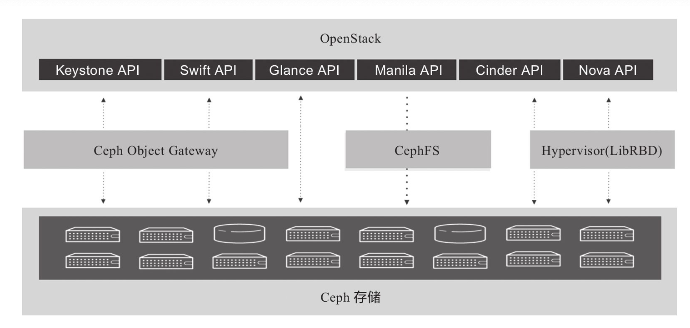
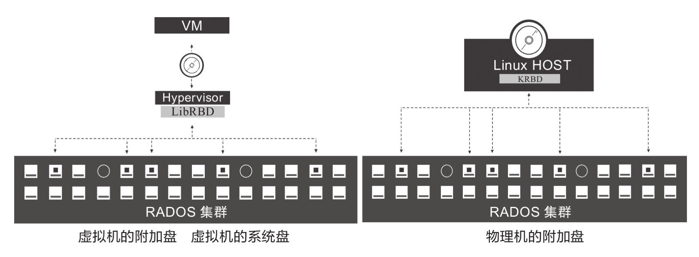
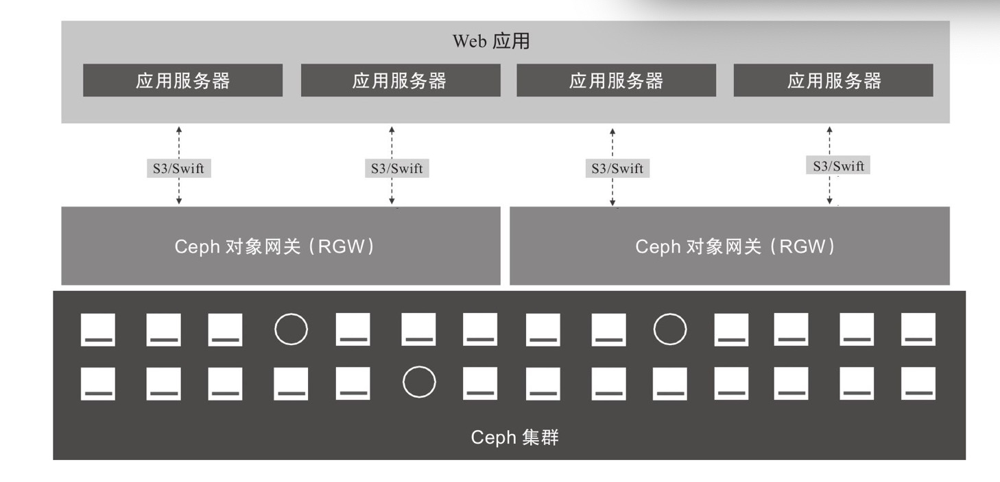
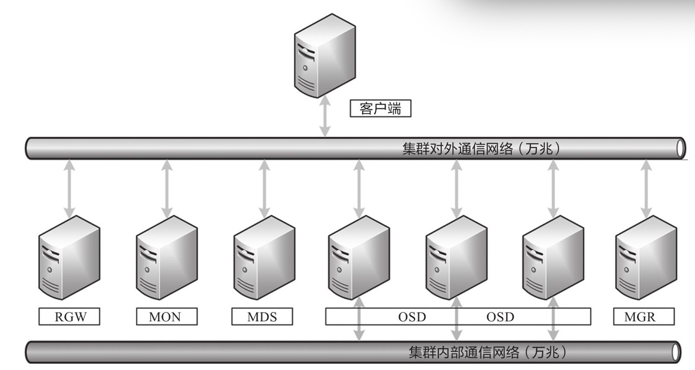
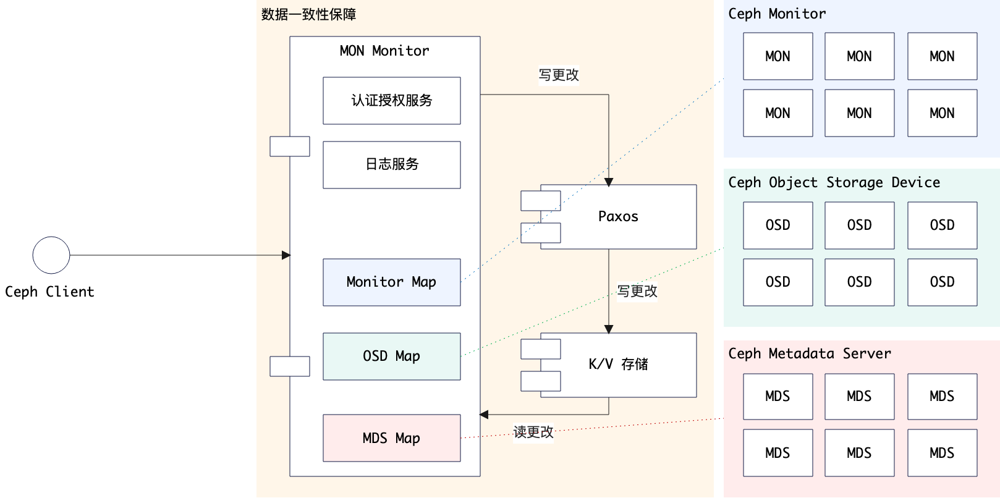
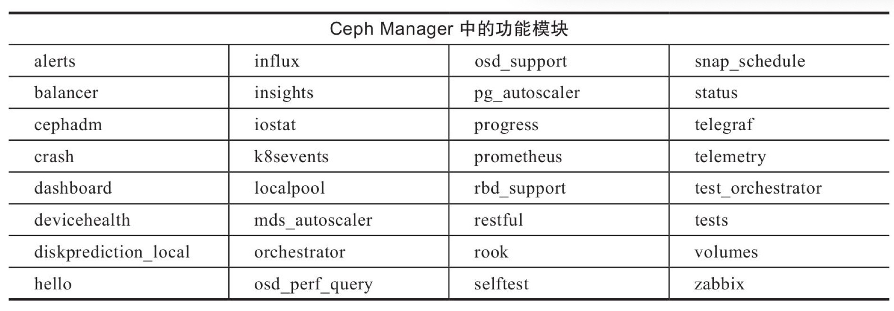

# 盖亚：Ceph

> 版图远奏尧天阔，万物呈祥乐圣情。——释智遇《偈颂二十四首》

&ensp;&ensp;&ensp;&ensp;本章直奔主题，本章在服务器中搭建一个Ceph集群，然后将它和K8S集群集成，之后所有的Pod的存储都会以Ceph为主，整体环境搭建步骤如下：

* 搭建独立的`Ceph`集群。
* K8S集群和`Ceph`集群集成。

&ensp;&ensp;&ensp;&ensp;考虑到后期整体的云原生**运维**，目前搭建的`Ceph`集群只是开发测试专用，后续生产环境直接使用云厂商提供的`Ceph`集群服务，云厂商在存储这层的经验远高于中小型企业，这部分的成本开销相对于K8S服务、TiDB服务而言，大部分企业是可接受的。关于这点我和很多人讨论过，最大的一个问题是企业发展初期的**成本开销**。

* **标准商业玩法**（财大气粗）：这种玩法属于标准玩法，直接申请云厂商（阿里、华为、腾讯）的服务资源，如`TiDB、MySQL、K8S、ES、Neo4j、Ceph`等，所有的服务直接向云厂商购买——这样做的优点是将运维全程托管给可靠的大厂处理，公司本身可以只关注业务层PaaS和上层SaaS的运维。
* **小成本玩法**：之所以会出现这种玩法，在于标准商业玩法对中小型企业而言其实并没带来很大的便利，特别对于业务尚未拓展的企业来说，购买上边提到的服务完全是一场**兵祸**，不是每个人都像**迅联科技**那样有一个土豪爸爸，开篇就是终局，直接上顶配。但是即使是小成本，对于最底层的存储，我个人的建议还是购买（该痛必须痛），除非你手中有经验丰富的**存储相关的基础设施人员**（小公司可能测试都不齐，运维岗位就更加不奢望了），否则就不要自信到您可以应对**故障、灾备、应急**各种IT复杂场景而保证数据不出问题。

&ensp;&ensp;&ensp;&ensp;Aeon选择了`K8S`，所以在另外几种组件选型时也有所考虑：

* 底层存储：Ceph
* 数据库：TiDB
* 容器治理：K8S + CRI-O（后期再考虑要不要切换到Podman或Docker）
* 服务网格：Istio
* Web容器：Vertx（对的，整个系统是将Vertx作为Web容器在使用）
* 数字化中间件：Zero

> 基础资料来自《Ceph企业级分布式存储原理与工程实践》前四章节。

## 1. 俯瞰：Ceph基本

### 1.1. 软件定义存储

&ensp;&ensp;&ensp;&ensp;**软件定义存储**：软件定义存储将**存储操作**抽象，而不是抽象实际**物理存储**。

#### 特征

|特点|描述|
|---|---|
|自动化|安装部署、扩容、运维等全面自动化，可降低成本。|
|标准接口|用于管理、维护存储设备和服务的应用程序编程接口。|
|写入类型多样|支持应用程序通过块、文件和对象接口写入数据。|
|扩展性|不影响性能的情况下，可无限扩展存储容量。|
|透明性|软件自身可以监控以及管理存储空间的使用，哪些资源可用、新数据的放置、完整性如何保证。|

#### 优势

* 避免技术锁定。
* 节省成本：分布式的，可横向扩容。
* 介质多样：如SAS、SATA、SATA SSD、NVME SSD、虚拟磁盘。
* 简化运维
* 扩展性强
* 云存储

### 1.2. Ceph定义

&ensp;&ensp;&ensp;&ensp;Ceph是一种**开源、高可扩展、部署在通用架构服务器**的软件定义存储产品，思路是将通用的服务器和硬盘设备通过网络协议进行集群组件，构建成一套存储集群并对外提供多种访问接口，实现满足使用场景的分布式存储。

&ensp;&ensp;&ensp;&ensp;适用场景（对数据读写性能要求不苛刻，对计算水平要求高）：

|场景|需求|
|---|---|
|数据分析|1. 大数据分析 2. 海量日志分析。|
|云计算平台 AI/ML/IoT/BC|1. OpenStack私有云存储、容器云后端存储 2. 为人工智能、机器学习、物联网等提供后端存储|
|富媒体和归档|1. 非结构化数据（文件、视频、图片） 2. 数据归档、企业数据备份|
|企业文件同步和共享|企业文件共享存储，如企业内部网盘|
|服务器和应用程序|1. 物理机、虚拟机的数据存储盘 2. 应用程序数据存储|

### 1.3. 基本执行结构

&ensp;&ensp;&ensp;&ensp;Ceph在OpenStack中的**结构**：

> `OpenStack 2017`的后端存储统计显示`Ceph RBD`的排名第一。

&ensp;&ensp;&ensp;&ensp;Ceph直接集成`Bareos/Bacula/Amanda`备份软件，可实现应用数据的备份。**备份架构如下**：

&ensp;&ensp;&ensp;&ensp;服务器添加Ceph RBD的方式添加块设备：

&ensp;&ensp;&ensp;&ensp;应用程序和Ceph集成：

## 2. 囫囵：Ceph结构剖析

&ensp;&ensp;&ensp;&ensp;Ceph的集群主要包含**三种守护进程**：

1. **Ceph OSD**：利用Ceph节点上的CPU、内存、网络进行数据复制、纠错、重新平衡、恢复、监控和报告等。
2. **Ceph Monitor**：维护Ceph集群的主副本映射、Ceph集群的当前状态和工种与运行控制相关的工作。
3. **Ceph Manager**：维护放置组（Placement Group）详细信息，代替`Monitor`处理元数据和主机元数据，显著提高大规模集群访问性能。

### 2.1. 客户端通信

&ensp;&ensp;&ensp;&ensp;客户端和Ceph集群通所需数据：

* Ceph配置文件、集群名称（通常为ceph）、Monitor地址。
* 存储池名称
* 用户名和密钥路径

&ensp;&ensp;&ensp;&ensp;客户端连接的**整体流程**如下：

1. Ceph客户端维护了存储的**对象ID**和存储对象的**存储池名称**。
2. Ceph客户端访问Ceph Monitor并检索最新的**Cluster Map副本**。
3. Ceph客户端向Librados提供对象名称和存储池名称。
4. Librados使用CRUSH算法为将要检索的数据计算对象放置**组和主OSD**。
5. 客户端连接**主OSD**，执行读写操作。

### 2.2. 集群架构

&ensp;&ensp;&ensp;&ensp;核心关注点：

* **网络**：对外通信和对内通信合并、生产环境一定使用万兆网络（服务器绑定万兆网卡）。
* **服务器**：主要角色如上图。

### 2.3. MON：Monitor节点

&ensp;&ensp;&ensp;&ensp;每个Monitor节点运行**守护进程**（`ceph-mon`），该守护进程可维护集群映射的主副本，包括集群拓扑图。它的工作原理如下图：

1. Ceph客户端
    * 只需连接一个Monitor节点，就可以知道所有的Monitor以及OSD的位置。
    * 连接Monitor之后，借助集群映射中存储的副本和CRUSH算法，可直接计算任意对象位置（**高扩展性、高性能的核心因素**）。
2. Ceph Monitor
    * 主要维护集群数据**主副本映射关系**。
    * 为每个组件维护一个信息图，所有集群节点都向Monitor报告（包括更改信息）。
        * OSD Map
        * MON Map
        * MDS Map
        * PG Map
        * CRUSH Map
    * Monitor本身不存储实际数据，数据交给OSD存储。
    * 提供身份验证和日志服务。
3. Paxos服务：**数据一致性保证**：
    1. Monitor将所有更改信息写入Paxos。
    2. Paxos服务更改写入的`K/V`存储，实现强一致性。
    3. Monitor使用`K/V`存储的快照和迭代器（LevelDB数据库）执行同步。
4. Paxos容错：
    * 运行在允许有服务器宕机的系统中。
    * 不要求可靠的消息传递。
    * 可容忍消息丢失、延迟、乱序和重复。
    > 大多数（Majority）机制保证`2N + 1`的容错能力，`2N + 1`个节点最多允许`N`个节点同时出现故障。

#### Ceph Cluster Map

&ensp;&ensp;&ensp;&ensp;Cluster Map负责跟踪重要事件：

* Ceph集群中有哪些进程状态为In。
* Ceph集群中哪些进程已启动、正在运行、或关闭。
* 放置组是处于活动状态、非活动状态、清洁状态还是其他。
* 集群当前状态的其他详细信息，如：总存储空间、已使用存储空间。

#### Quorum机制

&ensp;&ensp;&ensp;&ensp;单个节点的Monitor会存在单点故障风险，一般生产环境使用多节点模式（集群），最少3个Monitor确保高可用，规模扩大可增加到5个以上。

* 3个存活2个
* 5个存活3个
* 6个存活4个

> Monitor存在一个逻辑，就是配置信息全部保存在集群中，而不是配置文件，即使单个Monitor配置出错，而Ceph集群的每个MonMap依旧存在于集群中，不影响多个Monitor之间的通信。

### 2.4. OSD节点分析

&ensp;&ensp;&ensp;&ensp;Ceph OSD是Ceph的对象存储守护进程，主要负责：

* 存储数据。
* 处理数据复制、恢复、重新平衡。
* 检查其他守护进程是否故障，向Ceph Monitor提供监控信息。

&ensp;&ensp;&ensp;&ensp;一般是每个磁盘存储设备对应一个OSD守护进程，不论是设置`3副本`还是`2:1纠删码`，最少都要3个OSD才能实现冗余和高可用，磁盘类型可以是：`HDD, SSD, NVMe SSD`。

#### Scrub

&ensp;&ensp;&ensp;&ensp;Scrub是Ceph集群对放置组执行数据清洗（扫描）的操作，主要检测副本数据间的一致性。它类似于对象存储中的`fsck`命令，包括：

* **Light-scrubing**：只对元数据进行扫描，速度快；一般每天检查对象的大小和属性。
* **Deep-scrubing**：除了元数据还扫描数据，速度慢，但更彻底；一般每周（频率可调）读取数据并使用校验确保数据完整性。

#### 回填

&ensp;&ensp;&ensp;&ensp;CRUSH算法通过将放置组**移入或移出**OSD来重新平衡集群数据分布达到均匀分布，这个操作会降低性能，为了保证性能，Ceph采用回填（Backfill）的方式执行迁移。

&ensp;&ensp;&ensp;&ensp;**Backfill**：配置Ceph降低回填操作优先级，使得比读取/写入的优先级更低，优先保证读写性能，读写完成后再平衡。

#### 恢复

&ensp;&ensp;&ensp;&ensp;如果重新恢复的OSD对象版本比较旧，Ceph OSD进入恢复模式——寻求获取数据最新副本并将其映射恢复到最新状态。优于恢复过程耗时、耗资源，Ceph会限制恢复请求的数量——控制线程数和对象块大小，使得Ceph在`Degraded`状态下表现出良好性能。

### 2.5. Ceph Manager节点

&ensp;&ensp;&ensp;&ensp;Ceph Manager节点从整个集群收集状态信息，一般**Ceph Manager守护进程**和**Monitor守护进程**一起运行，提供附加监控、外部监控、管理系统入口（Web UI），可跟踪运行指标。

> Ceph Manager和Ceph Monitor放在同一节点运行比较明智（不强制）。

### 2.6. 对象存储/对象网关

&ensp;&ensp;&ensp;&ensp;Ceph对象网关提供了客户端访问接口。

#### 对象存储

&ensp;&ensp;&ensp;&ensp;对象存储是一种接触和处理离散单元的方法，离散之后的数据称为对象，一般数据会离散出很多对象。和传统文件系统不同，对象存储不会通过**目录树或文件**组织，它是在一个平台的命名空间中使用对象的**Object ID**连检索所有数据对象。

&ensp;&ensp;&ensp;&ensp;一般就有两种访问对象API的方式：

* **Amazon S3**：将对象扁平命名空间称为桶（Bucket）。
* 