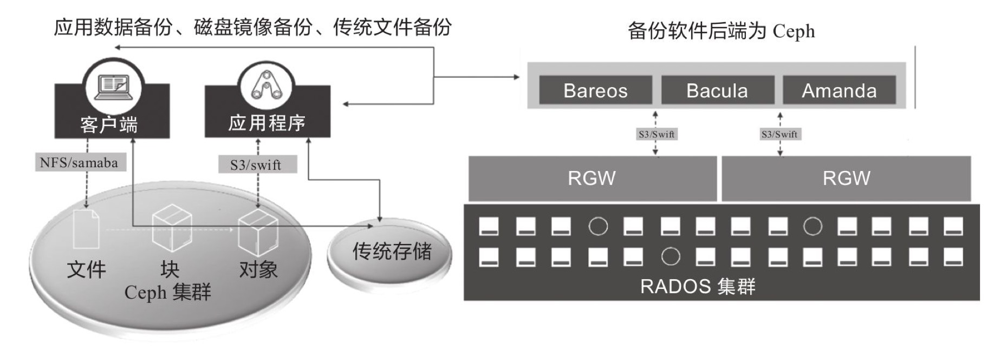
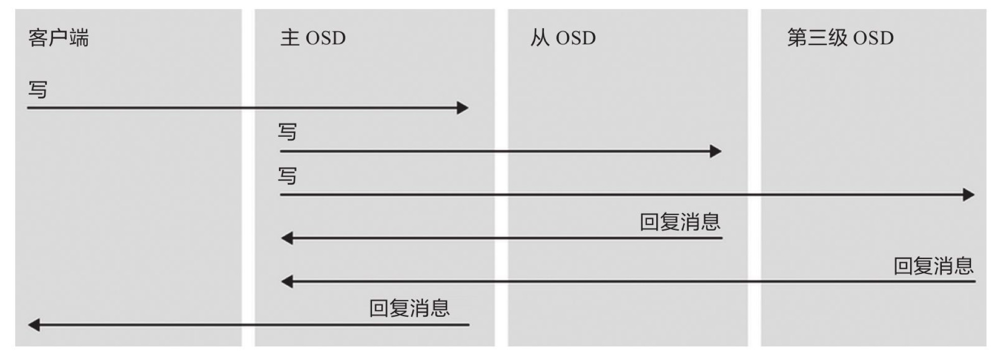
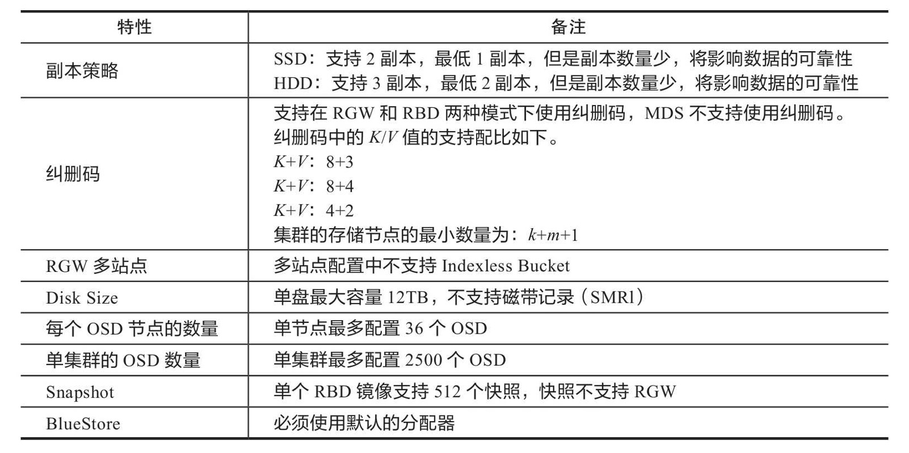

# 盖亚：Ceph

> 版图远奏尧天阔，万物呈祥乐圣情。——释智遇《偈颂二十四首》

&ensp;&ensp;&ensp;&ensp;本章直奔主题，本章在服务器中搭建一个Ceph集群，然后将它和K8S集群集成，之后所有的Pod的存储都会以Ceph为主，整体环境搭建步骤如下：

* 搭建独立的`Ceph`集群。
* K8S集群和`Ceph`集群集成。

&ensp;&ensp;&ensp;&ensp;考虑到后期整体的云原生**运维**，目前搭建的`Ceph`集群只是开发测试专用，后续生产环境直接使用云厂商提供的`Ceph`集群服务，云厂商在存储这层的经验远高于中小型企业，这部分的成本开销相对于K8S服务、TiDB服务而言，大部分企业是可接受的。关于这点我和很多人讨论过，最大的一个问题是企业发展初期的**成本开销**。

* **标准商业玩法**（财大气粗）：这种玩法属于标准玩法，直接申请云厂商（阿里、华为、腾讯）的服务资源，如`TiDB、MySQL、K8S、ES、Neo4j、Ceph`等，所有的服务直接向云厂商购买——这样做的优点是将运维全程托管给可靠的大厂处理，公司本身可以只关注业务层PaaS和上层SaaS的运维。
* **小成本玩法**：之所以会出现这种玩法，在于标准商业玩法对中小型企业而言其实并没带来很大的便利，特别对于业务尚未拓展的企业来说，购买上边提到的服务完全是一场**兵祸**，不是每个人都像**迅联科技**那样有一个土豪爸爸，开篇就是终局，直接上顶配。但是即使是小成本，对于最底层的存储，我个人的建议还是购买（该痛必须痛），除非你手中有经验丰富的**存储相关的基础设施人员**（小公司可能测试都不齐，运维岗位就更加不奢望了），否则就不要自信到您可以应对**故障、灾备、应急**各种IT复杂场景而保证数据不出问题。

&ensp;&ensp;&ensp;&ensp;Aeon选择了`K8S`，所以在另外几种组件选型时也有所考虑：

* 底层存储：Ceph
* 数据库：TiDB
* 容器治理：K8S + CRI-O（后期再考虑要不要切换到Podman或Docker）
* 服务网格：Istio
* Web容器：Vertx（对的，整个系统是将Vertx作为Web容器在使用）
* 数字化中间件：Zero

<hr/>

> 基础资料来自《Ceph企业级分布式存储原理与工程实践》前四章节（理论部分）节选，若您想了解更多实战的相关信息，推荐购买此书自己学习。

## 1. 俯瞰：Ceph基本

### 1.1. 软件定义存储

&ensp;&ensp;&ensp;&ensp;**软件定义存储**：软件定义存储将**存储操作**抽象，而不是抽象实际**物理存储**。

#### 特征

|特点|描述|
|---|---|
|自动化|安装部署、扩容、运维等全面自动化，可降低成本。|
|标准接口|用于管理、维护存储设备和服务的应用程序编程接口。|
|写入类型多样|支持应用程序通过块、文件和对象接口写入数据。|
|扩展性|不影响性能的情况下，可无限扩展存储容量。|
|透明性|软件自身可以监控以及管理存储空间的使用，哪些资源可用、新数据的放置、完整性如何保证。|

#### 优势

* 避免技术锁定。
* 节省成本：分布式的，可横向扩容。
* 介质多样：如SAS、SATA、SATA SSD、NVME SSD、虚拟磁盘。
* 简化运维
* 扩展性强
* 云存储

### 1.2. Ceph定义

&ensp;&ensp;&ensp;&ensp;Ceph是一种**开源、高可扩展、部署在通用架构服务器**的软件定义存储产品，思路是将通用的服务器和硬盘设备通过网络协议进行集群组件，构建成一套存储集群并对外提供多种访问接口，实现满足使用场景的分布式存储。

&ensp;&ensp;&ensp;&ensp;适用场景（对数据读写性能要求不苛刻，对计算水平要求高）：

|场景|需求|
|---|---|
|数据分析|1. 大数据分析<br/>2. 海量日志分析。|
|云计算平台<br/>AI/ML/IoT/BC|1. OpenStack私有云存储、容器云后端存储<br/>2. 为人工智能、机器学习、物联网等提供后端存储|
|富媒体和归档|1. 非结构化数据（文件、视频、图片）<br/>2. 数据归档、企业数据备份|
|企业文件同步和共享|企业文件共享存储，如企业内部网盘|
|服务器和应用程序|1. 物理机、虚拟机的数据存储盘<br/>2. 应用程序数据存储|

### 1.3. 基本执行结构

&ensp;&ensp;&ensp;&ensp;Ceph在OpenStack中的**结构**：


> `OpenStack 2017`的后端存储统计显示`Ceph RBD`的排名第一。

&ensp;&ensp;&ensp;&ensp;Ceph直接集成`Bareos/Bacula/Amanda`备份软件，可实现应用数据的备份。**备份架构如下**：



&ensp;&ensp;&ensp;&ensp;服务器添加Ceph RBD的方式添加块设备：


&ensp;&ensp;&ensp;&ensp;应用程序和Ceph集成：


<hr/>

## 2. 囫囵：Ceph结构剖析

&ensp;&ensp;&ensp;&ensp;Ceph的集群主要包含**三种守护进程**：

1. **Ceph OSD**：利用Ceph节点上的CPU、内存、网络进行数据复制、纠错、重新平衡、恢复、监控和报告等。
2. **Ceph Monitor**：维护Ceph集群的主副本映射、Ceph集群的当前状态和工种与运行控制相关的工作。
3. **Ceph Manager**：维护放置组（Placement Group）详细信息，代替`Monitor`处理元数据和主机元数据，显著提高大规模集群访问性能。

### 2.1. 客户端通信

&ensp;&ensp;&ensp;&ensp;客户端和Ceph集群通所需数据：

* Ceph配置文件、集群名称（通常为ceph）、Monitor地址。
* 存储池名称
* 用户名和密钥路径

&ensp;&ensp;&ensp;&ensp;客户端连接的**整体流程**如下：

1. Ceph客户端维护了存储的**对象ID**和存储对象的**存储池名称**。
2. Ceph客户端访问Ceph Monitor并检索最新的**Cluster Map副本**。
3. Ceph客户端向Librados提供对象名称和存储池名称。
4. Librados使用CRUSH算法为将要检索的数据计算对象放置**组和主OSD**。
5. 客户端连接**主OSD**，执行读写操作。

### 2.2. 集群架构


&ensp;&ensp;&ensp;&ensp;核心关注点：

* **网络**：对外通信和对内通信合并、生产环境一定使用万兆网络（服务器绑定万兆网卡）。
* **服务器**：主要角色如上图。

### 2.3. MON节点

&ensp;&ensp;&ensp;&ensp;每个Monitor节点运行**守护进程**（`ceph-mon`），该守护进程可维护集群映射的主副本，包括集群拓扑图。它的工作原理如下图：


1. Ceph客户端
    * 只需连接一个Monitor节点，就可以知道所有的Monitor以及OSD的位置。
    * 连接Monitor之后，借助集群映射中存储的副本和CRUSH算法，可直接计算任意对象位置（**高扩展性、高性能的核心因素**）。
2. Ceph Monitor
    * 主要维护集群数据**主副本映射关系**。
    * 为每个组件维护一个信息图，所有集群节点都向Monitor报告（包括更改信息）。
        * OSD Map
        * MON Map
        * MDS Map
        * PG Map
        * CRUSH Map
    * Monitor本身不存储实际数据，数据交给OSD存储。
    * 提供身份验证和日志服务。
3. Paxos服务：**数据一致性保证**：
    1. Monitor将所有更改信息写入Paxos。
    2. Paxos服务更改写入的`K/V`存储，实现强一致性。
    3. Monitor使用`K/V`存储的快照和迭代器（LevelDB数据库）执行同步。
4. Paxos容错：
    * 运行在允许有服务器宕机的系统中。
    * 不要求可靠的消息传递。
    * 可容忍消息丢失、延迟、乱序和重复。
    > 大多数（Majority）机制保证`2N + 1`的容错能力，`2N + 1`个节点最多允许`N`个节点同时出现故障。

#### Ceph Cluster Map

&ensp;&ensp;&ensp;&ensp;Cluster Map负责跟踪重要事件：

* Ceph集群中有哪些进程状态为In。
* Ceph集群中哪些进程已启动、正在运行、或关闭。
* 放置组是处于活动状态、非活动状态、清洁状态还是其他。
* 集群当前状态的其他详细信息，如：总存储空间、已使用存储空间。

#### Quorum机制

&ensp;&ensp;&ensp;&ensp;单个节点的Monitor会存在单点故障风险，一般生产环境使用多节点模式（集群），最少3个Monitor确保高可用，规模扩大可增加到5个以上。

* 3个存活2个
* 5个存活3个
* 6个存活4个

> Monitor存在一个逻辑，就是配置信息全部保存在集群中，而不是配置文件，即使单个Monitor配置出错，而Ceph集群的每个MonMap依旧存在于集群中，不影响多个Monitor之间的通信。

### 2.4. OSD节点

&ensp;&ensp;&ensp;&ensp;Ceph OSD是Ceph的对象存储守护进程，主要负责：

* 存储数据。
* 处理数据复制、恢复、重新平衡。
* 检查其他守护进程是否故障，向Ceph Monitor提供监控信息。

&ensp;&ensp;&ensp;&ensp;一般是每个磁盘存储设备对应一个OSD守护进程，不论是设置`3副本`还是`2:1纠删码`，最少都要3个OSD才能实现冗余和高可用，磁盘类型可以是：`HDD, SSD, NVMe SSD`。

#### Scrub

&ensp;&ensp;&ensp;&ensp;Scrub是Ceph集群对放置组执行数据清洗（扫描）的操作，主要检测副本数据间的一致性。它类似于对象存储中的`fsck`命令，包括：

* **Light-scrubing**：只对元数据进行扫描，速度快；一般每天检查对象的大小和属性。
* **Deep-scrubing**：除了元数据还扫描数据，速度慢，但更彻底；一般每周（频率可调）读取数据并使用校验确保数据完整性。

#### 回填

&ensp;&ensp;&ensp;&ensp;CRUSH算法通过将放置组**移入或移出**OSD来重新平衡集群数据分布达到均匀分布，这个操作会降低性能，为了保证性能，Ceph采用回填（Backfill）的方式执行迁移。

&ensp;&ensp;&ensp;&ensp;**Backfill**：配置Ceph降低回填操作优先级，使得比读取/写入的优先级更低，优先保证读写性能，读写完成后再平衡。

#### 恢复

&ensp;&ensp;&ensp;&ensp;如果重新恢复的OSD对象版本比较旧，Ceph OSD进入恢复模式——寻求获取数据最新副本并将其映射恢复到最新状态。优于恢复过程耗时、耗资源，Ceph会限制恢复请求的数量——控制线程数和对象块大小，使得Ceph在`Degraded`状态下表现出良好性能。

### 2.5. Ceph Manager节点

&ensp;&ensp;&ensp;&ensp;Ceph Manager节点从整个集群收集状态信息，一般**Ceph Manager守护进程**和**Monitor守护进程**一起运行，提供附加监控、外部监控、管理系统入口（Web UI），可跟踪运行指标。

> Ceph Manager和Ceph Monitor放在同一节点运行比较明智（不强制）。


### 2.6. 对象存储/对象网关

&ensp;&ensp;&ensp;&ensp;Ceph对象网关提供了客户端访问接口。

#### 对象存储

&ensp;&ensp;&ensp;&ensp;对象存储是一种接触和处理离散单元的方法，离散之后的数据称为对象，一般数据会离散出很多对象。和传统文件系统不同，对象存储不会通过**目录树或文件**组织，它是在一个平台的命名空间中使用对象的**Object ID**连检索所有数据对象。它的优点是**简单易用、易于扩展**，消除了传统文件系统的目录层次，也简化了对象之间的关系。

&ensp;&ensp;&ensp;&ensp;一般就有两种访问对象API的方式：

* **Amazon S3**：将对象扁平命名空间称为桶（Bucket），不能嵌套。
* **OpenStack Swift**：OpenStack Swift将其称为容器（Container）。

> 一个账户可以访问多个桶，不同的桶有不同访问权限，用于不同对象存储。

#### 对象网关

&ensp;&ensp;&ensp;&ensp;RADOS网关（也称Ceph对象网关、RADOSGW、RGW）是一项服务，它可以为客户端提供Geph集群的访问。该网关是建立在Librados之上的对象存储接口，主要为应用程序提供访问RADOS集群的RESTful API，RADOS网关支持两个接口：

* S3兼容接口：和Amazon S3 RESTful API的大部分子集接口兼容。
* Swift兼容接口：和OpenStack Swift API大部分子集接口兼容。

&ensp;&ensp;&ensp;&ensp;RADOS网关是用于和Librados交互的**FastCGI模块**，由于它提供OpenStack和Amazon S3兼容接口，所以Gateway具有独立的用户管理功能。S3和Swift API共享一个名称空间，可使用**一个API写数据，另一个API检索数据**。核心守护进程`radosgw`提供以Librados库为基础封装的接口，通常将自己的Web服务器`Civetweb`作为前端来处理请求；应用程序或客户端用标准的API与RADOS网关通信，RADOS则通过Librados库和Ceph存储集群通信。


&ensp;&ensp;&ensp;&ensp;RADOS网关有自己的用户集，和Ceph集群用户不同：

* RADOS网关客户端可通过Amazon S3或OpenStack Swift API来使用自己的用户集执行身份认证。
* 使用`radosgw-admin`工具或基于`LDAP`的外部身份认证服务来配置用户。
* 大型多站点安装，可将RADOS网关部署在Zone Group和Realm的某一区域中。

### 2.7. MDS节点

&ensp;&ensp;&ensp;&ensp;Ceph的元数据管理服务器（MDS）提供了客户端访问Ceph集群的接口。

#### Ceph文件存储

&ensp;&ensp;&ensp;&ensp;CephFS是基于RADOS的高性能分布式文件系统，它是一个可扩展的、符合**POSIX标准**的分布式并行文件系统，该系统将数据和元数据作为对象存储在Ceph中，它依赖运行MDS来协调对RADOS集群的访问，并管理和文件相关的元数据。

&ensp;&ensp;&ensp;&ensp;CephFS的目标是和POSIX标准文件系统一致，两个不同主机运行进程应该和同一主机运行进程相同——即不同主机对文件读写、实时同步的操作和效果与同一台主机上一样。CephFS至少需要运行一个MDS守护进程（`ceph-mds`），MDS守护进程主要管理存储在Ceph文件系统中和文件相关的元数据，协调Ceph存储集群的访问。

#### CephFS限制因素

&ensp;&ensp;&ensp;&ensp;MDS将元数据提供给客户端，缓存热的元数据是为了减少对后端元数据池的请求，管理客户端缓存是为了保证一致性。CephFS工作流程：在活跃的MDS之间复制热的元数据，并将元数据变化信息合并到日志，定期刷新到后端数据池，使数据在集群之间实时同步。如下图：


&ensp;&ensp;&ensp;&ensp;CephFS使用过程中应注意：

1. 采用多MDS节点部署方式，给文件系统配置多个活跃的MDS守护进程。
2. 重点保护元数据池，RADOS底层需提供两个后端存储池：一个存数据、一个存元数据；首先创建两个数据池，一定要做好对数据的保护，使用更高级别副本，采用低延迟存储设备（SSD）。
3. 使用一个CephFS：禁止在一个集群中创建多个CephFS。

### 2.8. iSCSI网关

&ensp;&ensp;&ensp;&ensp;作为管理员，您可以为Ceph集群安装配置iSCSI网关。借助它你可以有效对Ceph块存储进行功能接口适配，采用熟悉和常用的iSCSI来访问Ceph。iSCSI网关将Ceph和iSCSI标准集成，提供将RADOS块手中（RBD）映像导出为SCSI磁盘的高可用iSCSI启动器，该协议允许启动器通过TCP/IP网络将SCSI命令发送到iSCSI目标器，以此提供在异构客户端访问Ceph集群的能力。简单说：**Ceph集群实现了iSCSI启动器的多点（多机头）集群，保证了访问的高可用性，为Windows等系统提供了数据存储能力**。

<hr/>

## 3. 无垠之野：存储

&ensp;&ensp;&ensp;&ensp;继续Ceph之前，聊聊存储设备[^1]，扫清您对底层设备类型的疑云，执行Ceph的配置以及您在K8S中配置PV/PVC时，一定会接触到存储类型，所以本章节开个支线让您对存储设备有一定的了解（纯科普）。

### 3.1. 硬盘分类（按材质）

* **HDD**（Hard Disk Driver）：传统硬盘、即机械硬盘：一个或多个铝制或玻璃制作的磁性碟片，磁头，转轴，控制电机，磁头控制器，数据转换器，接口和缓存等几个部分组成。
    **优点**：容量大、价格实惠、寿命长。
    **缺点**：读写慢、有噪音、体积大、抗震弱（怕震动）、发热量高。
* **SSD**（Solid Disk Driver）：固态硬盘：多个闪存芯片加主控以及缓存组成的阵列式存储，属于以固态电子存储芯片阵列制作的硬盘。
    **优点**：读写速度快、抗震强、低功耗、无噪音，工作温度范围大，轻便。
    **弱点**：容量小、寿命有限，价格高。
* **HHD**（Hybird Harddrive）：混合硬盘（又称**SSHD**）：机械硬盘和固态硬盘结合体，使用容量小的闪存颗粒来存储常用文件，磁盘才是存储介质，闪存做缓冲，将更多常用文件保存到闪存减小寻道时间提升读写效率。
    **优点**：读写快、抗震强、低功耗、无噪音，工作温度范围大。
    **缺点**：容量比机械盘小，寿命比机械盘短，成本高。

### 3.2. 硬盘接口协议

#### IDE

&ensp;&ensp;&ensp;&ensp;**IDE**（Integrated Drive Electronics集群驱动器电子）：本意是指把控制器和盘体集成在一起的硬盘驱动器，是一种硬盘的传输接口。**ATA**（Advanced Technology Attachment）：IDE的别名（两个名字厂商都在用，一般指同样的东西）。**EIDE**（Enhanced IDE）规格的名称，这种规格又称为**Fast ATA**，不同点在于Fast ATA仅指代硬盘接口，而EIDE还指定了连接光盘、飞硬盘产品的标准，又称为**ATAPI**接口，之后升级的更快的接口都只剩下ATA的字样，如：**Ultra ATA, ATA/66, ATA/100**等。

&ensp;&ensp;&ensp;&ensp;早期IDE传输模式一般两种：

* **PIO**（Programming I/O）模式
* **DMA**（Direct Memory Access）模式：占用资源少，但需要额外驱动程序和设置，接受程度低。

&ensp;&ensp;&ensp;&ensp;之后厂商推出更快的DMA传输速度标准：

|标准|速率|
|---|---|
|Ultra DMA 33|33MB/sec|
|ATA 66|66MB/sec|
|ATA 100|100MB/sec|
|ATA 133|133MB/sec|

> 系列标准都可以向下兼容，而ATA 133标准并没有获得广泛支持，所以最常用的还是ATA 100，而对ATA 66以上的标准而言，要使用80芯IDE排线，代替原始的40芯IDE排线。

* **优点**：价格低廉、兼容性强、性价比高。
* **缺点**：数据传输速度慢、线缆长度过短、连接设备少。

#### SATA

&ensp;&ensp;&ensp;&ensp;**SATA**（Serial ATA）口的硬盘又称为串口硬盘，2001年正式确立Serial ATA 1.0规范；2002年Serial ATA委员会又确立了Serial ATA 2.0规范（STAT II）。SATA采用串行连接方式，该总线使用嵌入式始终信号，具备更强纠错能力，和以往相比其最大的区别在于能对传输指令执行检查和矫正，提高了数据传输的可靠性——结构简单、支持热插拔。整体优势如下：

* SATA使用连续方式传送数据，一次只传1位数据，可减少针脚数，电缆数目变少，效率更高。4个针脚分别用于**连接电缆、连接地线、发送数据、接受数据**（低功耗、减小复杂度）。
* SATA起点更高，SATA 1.0定义的数据传输速度为`150MB/s`（外部1.5Gbps），比ATA/133更高，而SATA 2.0的数据传输可达`300MB/s`（外部3Gbps），最终SATA可实现`600MB/s`（SATA Revision 3.0，外部6Gbps）的传输速率。

&ensp;&ensp;&ensp;&ensp;SATA 2.0滥用，部分设备仅支持3Gbps而不支持NCQ：NCQ可以对硬盘的指令执行顺序进行优化，避免像传统硬盘那样机械地按照接收指令的先后顺序移动磁头读写硬盘的不同位置，相反它会在接收命令后对其排序，排序后的磁头将以高效率的顺序寻址，避免损耗、延长硬盘寿命。

&ensp;&ensp;&ensp;&ensp;三个规范的对比：

|规范|发布时间|描述|
|---|---|---|
|SATA 1.0|2001年|150MB/s、外部1.5Gps|
|SATA 2.0|2002年|300MB/s、外部3Gps<br/>原生命令队列：NCQ（Native Command Queuing）<br/>端口多路器（Port Multiplier）<br/>交错启动（Staggered Spin-up）<br/>热插拔（Hot Plug）|
|SATA 2.5||开始支持eSATA（External SATA），完整2.0规范|
|SATA Revision 3.0|2009年|750MB/s、外部6Gps<br/>新的NCQ支持音频、视频<br/>NCQ管理功能<br/>改进电源功能<br/>紧凑型1.8存存储设备小型低插力接头（LIF）<br/>轻薄笔记本7毫米光驱接头<br/>符合INCITS ATA8-ACS标准|
|SATA Express|未发布|1GB/s、外部8-16Gbps|

> SATA Revision 2.6/SATA Revision 3.0 禁止使用SATA 2.6和SATA 3.0的术语，必须使用完整命名。

&ensp;&ensp;&ensp;&ensp;SATA硬盘一般可设置RAID模式：`RAID0, RAID1, RAID5, RAID10`，只是支持RAID（磁盘阵列）的功能时部分操作系统需要安装相关驱动。最新版本的SATA规范是**SATA Express**，可能会是SATA 3.2的一部分。

* **优点**：传输速度快、安装方便、容易散热、支持热插拔。

#### SCSI

&ensp;&ensp;&ensp;&ensp;**SCSI**（Small Computer System Interface，小型计算机系统接口），是同IDE（ATA）完全不同的接口，IDE是普通PC标准接口，而SCSI并不是为硬盘设计的接口，而是一种广泛应用于小型机上的告诉数据传输技术。由于价格较高很难普及，一般用于中、高端服务器、高档工作站中。

* **优点**：应用范围广、多任务、带宽大、CPU占用率低、热插拔。

#### SAS

&ensp;&ensp;&ensp;&ensp;**SAS**（Serial Attached SCSI，串行连接SCSI），属于新一代的SCSI技术，采用串行技术得到更高传输速度，通过缩短连接线改善内部空间等。它的设计目的：改善存储系统的效能、可用性、扩充性；提供和SATA硬盘的兼容性。

&ensp;&ensp;&ensp;&ensp;和SATA兼容性：

* **物理层**：SAS和SATA完全兼容，SATA硬盘可直接在SAS环境中使用，简单说SATA是SAS的子标准，SAS控制器可直接操作SATA硬盘，反之不行。
* **协议层**：SAS包含3中类型的协议：
    * SSP（串行SCSI协议）用于传输SCSI命令。
    * SMP（SCSI管理协议）用于对连接设备的维护和管理。
    * STP（SATA通道协议）用于SAS和SATA之间的数据传输。
    > SAS可以和SATA部分的SCSI设备无缝结合。

&ensp;&ensp;&ensp;&ensp;SAS的优缺点：

* **优点**：接口速度显著提升（主流Ultra 320 SCSI速度`320MB/s`，SAS起步`300MB/s`，未来可达到`600MB/s`）、更长的连接距离、提高抗干扰能力、散热很好。
* **缺点**：硬盘/控制芯片种类少、硬盘价格昂贵、实际传输速度变化不大、用户追求成熟稳定的产品。

#### FC

&ensp;&ensp;&ensp;&ensp;**光纤**（Fiber Channel），和SCSI接口一样，最初不是为了硬盘设计，而是为网络系统设计。它是为了像服务器这样的多硬盘系统环境设计，满足高端工作站、服务器、海量存储子网络、外设间通过集线器、交换机和点对点连接进行双向、串行数据通讯等系统对高数据传输率的要求。

* **优点**：热插拔性、高速带宽、远程连接、连接设备数量大。

#### SSD

&ensp;&ensp;&ensp;&ensp;**固态硬盘**（Solid State Disk/Solid State Drive），也称为电子硬盘、固态电子盘，由控制单元和固态存储单元（DRAM/FLASH芯片）组成的硬盘。固态硬盘介质一般分两种：

* **闪存**（IDE Flash DISK、Serial ATA Flash Disk），存储单元分为：
    * **单层单元**（SLC, Single Layer Cell），成本高、容量小、速度快。
    * **多层单元**（MLC, Multi-Level Cell），成本低、容量大、速度慢。
* **DRAM**，使用DRAM做存储介质，应用范围狭窄，使用工业标准PCI连接主机、FC接口连接服务器，应用方式分为SSD硬盘、SSD硬盘阵列两种（**缺点**是需要独立电源保护数据安全）。

&ensp;&ensp;&ensp;&ensp;固态硬盘接口类型

* **SATA 6Gbps（SATA III）**：SATA Revision 3的参数标准。
* **mSATA**：称为`mini-SATA`接口控制器的产品规范（笔记本常用，小尺寸）。
* **M.2**：原名NGFF接口，为超级本（Ultrabook）量身打造的接口标准，基于原来的`mini PCIe`改良的mSATA接口。
* **PCI-E**：最初用于企业市场，直接对标SSD，不走SATA协议，高速率固态硬盘。
* **U.2**：别称SFF-8639，支持SATA-Express规范，还支持SATA、SAS，理论带宽到`32Gbps`。

### 3.3. 网络存储协议

&ensp;&ensp;&ensp;&ensp;存储网络协议[^2]允许APP、服务器、其他系统和网上设备进行交互。

#### iSCSI

&ensp;&ensp;&ensp;&ensp;**iSCSI**是一种传输层协议，提供TCP/IP网络对存储设备的块级访问，该协议在TCP之上工作，通过LAN、WAN或互联网传输SCSI数据包。iSCSI利用多路径、巨型帧、数据中心桥接（DCB）等技术，可更长距离、更高速传输数据。目前基于iSCSI的SAN实施支持高达`25 Gb`以太网数据速率，之后是`50GbE`、`100GbE`。

#### FC

&ensp;&ensp;&ensp;&ensp;光纤通道（FC）是一种高速网络技术，能有序地提供无损的原始块数据，该技术定义了用于使用光纤通道协议（FCP）和传输SCSI命令和信息单元的多个通信层。除SCS以外，光纤通道还可以和IP以及其他协议互操作，提供点对点、交换、环路接口，速率高达`128Gbps`。它可以创建支持存储区域网络（SAN）的光纤通道、解决SCSI、高性能并行接口（HIPPI）的缺点。

#### FCoE

&ensp;&ensp;&ensp;&ensp;光纤通道以太网（FCoE）协议允许光纤通道（FC）直接在以太网上通信。该协议使用无损以太网结构以及自身帧格式，将光纤通道（FC）帧封装到以太帧中。FCoE允许局域网（LAN）和存储区域网（SAN）的通信共享同一物理网络，彼此隔离。它允许组织在整个数据中心使用单一的电缆连接方法，从而简化管理并降低成本，它还保留了常规光纤通道的延迟和流量管理又是，可使用数据中心桥接（DCB）来消除队列溢出期间的损失。

> 唯一的缺点是以太光纤通道不能跨路由网络（光纤通道）工作。

#### NFS

&ensp;&ensp;&ensp;&ensp;既是一种分布式文件系统，也是一种网络协议，用于在同一局域网上的设备访问和共享文件，该系统和协议常用于支持网络连接存储（NAS）。它使用远程过程调用（RPC）协议在客户端和服务端之间路由请求，尽管参与的设备必须支持网络文件系统（NFS），但它们不需要了解网络详细信息，由于RPC调用的安全性问题，NFS最好是部署在防火墙后面的受信任网络上（主要在Linux中使用）。

#### SMB/CIFS

&ensp;&ensp;&ensp;&ensp;服务器消息块（SMB）是一种客户端/服务器通信协议，使用户和应用程序可以访问服务器上的存储和其他网络资源。服务器消息块（SMB）在应用层之上运行、并且可在TCP/IP网络上运行，和网络文件协议（NFS）一样，该协议常用于网络连接存储（NAS）。

&ensp;&ensp;&ensp;&ensp;公用互联网文件系统（CIFS）是最早的一个SMB，被称为易用型协议，该协议存在一些楼栋，容易出现延迟问题。所以SMB和CIFS术语经常互换使用。

#### HTTP

&ensp;&ensp;&ensp;&ensp;HTTP通常不是一种存储协议，但有时候通过RESTful API和标准HTTP/HTTPS请求来支持对Amazon S3、Google Cloud Storage、Microsoft Azure等云存储服务的访问，其实Amazon S3已经成为了云对象存储理论上的标准。

#### NVMe

&ensp;&ensp;&ensp;&ensp;又称NVMe-oF，它是建立在NVMe规范的基础之上的高速存储协议，用于跨网络结构（以太网、光纤通道、InfiniBand）访问固态存储。它定义了一种通用架构，用于使用NVMe消息的命令和存储系统接口，可支持很多NVMe设备，同时可扩展MVMe设备以及子系统之间的距离。

> 将Linux中的分区和K8S中的卷放到这里整理主要原因就是Ceph中部分配置有可能会牵涉其中，由于命名规则的不同，会导致您在配置过程中遇到很多和磁盘分区、磁盘相关联的知识点，基于这点所以补充两个小章节来讲解**Linux分区和K8S卷**。

### 3.4. Linux中的分区

&ensp;&ensp;&ensp;&ensp;Linux中分区的模式：

* **MBR分区**：主引导记录，一般存在于驱动器最开始部分的特殊启动扇区，最大支持2.1T磁盘，最多支持4个分区（32位和64位系统都支持）。
* **GPT分区**：全局唯一标识分区，支持9.4ZB，理论上支持分区无限制（只支持64位操作系统）。

&ensp;&ensp;&ensp;&ensp;GPT分区比较先进，解决了MBR的缺点，但目前MBR更多，它最多可以有4个分区。

* **主分区**：启动操作系统（操作系统引导程序必须在这个分区）。
* **扩展分区**
    1. 最多有一个扩展分区
    2. 扩展分区 + 主分区最多不超过4个
    3. 不能写入数据、不可格式化（只能用来包含逻辑分区）
* **逻辑分区**
    1. 包含在扩展分区内，可以多个
    2. 扩展分区至少包含一个逻辑分区

&ensp;&ensp;&ensp;&ensp;按照概念陈述，结构如下：


&ensp;&ensp;&ensp;&ensp;**分区命名规则**，Linux中所有设备存放在`/dev`目录，不同设备类型前缀不同，沿袭Unix风格，所有设备都会抽象成一个文件。基本命名规则如下：

|设备前缀|硬盘|后缀范围|
|---|---|---|
|/dev/hd[a-t]|IDE设备|[a-t]|
|/dev/sd[a-z]|SCSI/SATA/USB|[a-z]|
|/dev/fd[0-7]|标准软驱|[0-7]|
|/dev/md[0-31]|软raid设备|[0-31]|
|/dev/loop[0-7]|本地回环设备|[0-7]|
|/dev/ram[0-15]|内存|[0-15]|
|/dev/null|无限数据接手设备（黑洞）||
|/dev/zero|无限零资源||
|/dev/tty[0-63]|虚拟终端|[0-63]|
|/dev/ttyS[0-3]|串口|[0-3]|
|/dev/lp[0-3]|并口|[0-3]|
|/dev/console|控制台||
|/dev/fb[0-31]|帧缓冲（Framebuffer）|[0-31]|
|/dev/cdrom|光驱, /dev/hdc||
|/dev/modem|调制解调器, /dev/ttyS[0-9]||
|/dev/pilot|绘图仪, /dev/ttyS[0-9]||
|/dev/random|随机数设备||
|/dev/urandom|随机数设备||
|/dev/nvme[X]n[x]|**云盘**——I/O优化实例，通过NVMe协议挂载的数据盘|
|/dev/vd[b-z]|**云盘**——I/O优化实例，通过非NVMe协议挂载的数据盘|[b-z]|
|/dev/xvd[b-z]|**云盘**——非I/O优化实例数据盘|[b-z]|

### 3.5. K8S中的卷

&ensp;&ensp;&ensp;&ensp;最后看看K8S中卷类型清单，通过对清单的了解对存储进行最终的总结，然后我们再回到Ceph的主线，很多概念就十分明了。

|卷值|状态|描述|
|---|---|---|
|cephfs||现存的CephFS卷|
|configMap||提供注入配置数据的方法|
|downwardAPI||用于为应用提供downward API数据|
|emptyDir||某个节点上，节点运行时会一直存在|
|fc||运行将现有光纤通道挂载，可指定单个或多个WWN（World Wide Names）|
|iscsi||将iSCSI（基于IP的SCSI）卷挂载|
|local||可挂载某个本地存储设备|
|nfs||将NFS（网络文件系统）挂载|
|persistentVolumeClaim||将持久卷（PV）挂载|
|hostPath||将主机节点文件系统上的文件目录挂载|
|projected||将若干现有卷映射到同一目录上|
|rbd||将Rados块设备卷挂载|
|secret||存储敏感信息|
|awsElasticBlockStore|1.17弃用|Amazon Web服务（AWS）EBS卷|
|azureDisk|1.19弃用|Microsoft Azure数据盘|
|azureFile|1.21弃用|Microsoft Azure文件卷, SMB2.1 / SMB3.0|
|cinder|1.18弃用|OpenStack Cinder卷|
|gcePersistentDisk|1.17弃用|将谷歌计算引擎（GCE）持久盘（PD）挂载|
|gitRepo|弃用|挂载一个Git代码仓库|
|glusterfs|1.25弃用|将一个开源文件系统Glusterfs挂载|
|portworxVolume|1.25弃用|可伸缩的块存储，超融合方式运行|
|vsphereVolume|弃用|将vSphere VMDK卷挂载|

### 3.6. 关于RAID和条带化

* 参考：<https://blog.csdn.net/weixin_51967583/article/details/121195615>，[温岚万叶](https://xiatwo.blog.csdn.net/?type=blog)
* 参考：<https://blog.csdn.net/m0_60360828/article/details/120290107>, [叁煌蛋](https://blog.csdn.net/m0_60360828)

&ensp;&ensp;&ensp;&ensp;**条带化（Striping）技术**：

* 条带化技术就是将一块连续的数据分成很多小部分并把他们分别存储到不同的磁盘中去。
* 这就能使多个进程同时访问数据的多个不同部分而不会造成磁盘冲突。
* 在对这种数据进行顺序访问时可以获得最大程度上的I/O并行能力，从而获得更好的性能。

&ensp;&ensp;&ensp;&ensp;**独立磁盘冗余阵列RAID（Redundant Arrays of Independent Disks）**：

* **磁盘阵列**是由很多块独立的磁盘，组合成一个容量局的磁盘组，利用个别磁盘提供数据所产生加成效果提升整个系统效能。利用该技术，将数据切割成许多区段，分别存放在各个硬盘上。
* 可利用**同位检查**（Parity Check）的观念，在数组中任意一个硬盘故障时，仍可独处数据，在数据重构时，将数据经计算后重新置入新硬盘中。

#### RAID0

* RAID0具有低成本、高度写性能、100%的高存储空间利用率的优点。
* 它不提供数据冗余保护，**一旦数据损坏，无法恢复**。
* RAID0一般适用于对性能要求严格但对数据安全性和可靠性不高的应用，如：**视频、音频、临时数据缓存空间**。


#### RAID1

* RAID1称为**镜像**，它将数据完全一致地分别写到工作磁盘和镜像磁盘，它的磁盘空间利用率为50%。
* RAID1提供数据写入时，响应时间会有影响，但读数据没有影响。
* RAID1提供了**最佳冗余保护**，一旦工作盘发生故障，系统自动从镜像磁盘读取数据，不影响用户工作。


#### RAID2

* RAID2称为纠错**海明码磁盘阵列**，设计思路是利用海明码实现数据校验冗余。
* 海明码是一种在原始数据中加入若干校验码进行**错误检测和纠正**的编码技术，第`2n`位（1,2,4,8,...）是校验码，其他位置是数据码。
* 海明码宽度和校验码计算
    * 4位数据需要4块数据磁盘、3块校验磁盘
    * 64位数据需要64块数据磁盘、7块校验磁盘
* **数据冗余开销巨大**，RAID2的数据输出性能受阵列中最慢磁盘驱动器限制，再者是按位运算，**RAID2数据重建非常耗时**。

#### RAID3

* RAID3是使用专用校验盘的**并行访问阵列**，采用一个专用的磁盘作校验盘（**性能瓶颈**），其余磁盘为数据盘，数据按位可字节的方式交叉存储到数据盘中。
* RAID3至少需要三块磁盘，不同磁盘上同一带区的数据做XOR校验，校验值写入校验盘中。
* RAID3完好时**读性能和RAID0完全一致**，并行从多个磁盘条带读取数据，性能非常高，同时还提供了数据容错能力。
* RAID3写入数据时，必须计算所有同条带校验值，并将新校验值写入校验盘中。
* 一次写操作包括了写数据块、读取同条带的数据块、计算校验值、写入校验值，**开销非常大，性能较低**。
* 如果RAID3中某一磁盘出故障，不会影响数据读取，可借助校验数据和其他完好数据来重建数据。

#### RAID4

* RAID4和RAID3原理大致相同，区别在于条带化方式不同。
* RAID4按照块的方式组织数据，写操作只设计当前数据盘和校验盘两个盘，多个I/O请求可以同时得到处理，提高了系统性能。
* RAID4按块存储可以保证单块的完整性，可以避免收到其他磁盘上同条带产生的不利影响。
* RAID4提供了**非常好的读性能**，但单一的校验盘往往成为系统性能的瓶颈（和RAID3一样）。

#### RAID5

* RAID5是目前最常见的RAID等级，校验数据分布在阵列中的所有磁盘上，而没有采用专门的校验盘。
* 对于数据和校验数据，它们的写操作可以同时发生在完全不同的磁盘上。
* RAID5还具备很好扩展性，当阵列磁盘数量增加时，并行操作量的能力也增加。
* RAID5当一个数据盘损坏时，可以根据同一带的其他数据块，和对应的校验数据来重建损坏数据。
* 重建数据时，RAID5的性能会受到较大影响。


#### RAID6

* RAID6引入双重校验概念，可以保护阵列中同时出现两个磁盘失效时，阵列仍然可以继续工作，不会发生数据丢失。
* RAID6不仅要支持数据的恢复，还要支持校验数据的恢复，因此实现代价很高，控制器的设计也比其他等级复杂、昂贵。
* RAID6思想最常见的视线方式是采用两个独立的校验算法，假设为P和Q，校验数据可以分别存储在两个不同的校验盘上，或者分散存储在所有成员磁盘中。
* RAID6具有**快速的读取性能、更高的容错能力**，但它成本高于RAID5，写性能也很差。


#### RAID1+0

&ensp;&ensp;&ensp;&ensp;RAID1 + RAID0，就是在两个RAID1外层套上一层RAID0，用RAID0将数据均分然后存储到不同的RAID1中，这样只存储了原来数据的一半的量，这样写入速度就提升了一倍，读取速度也是一样。


#### RAID5+0 / RAID6+0

&ensp;&ensp;&ensp;&ensp;原理同**RAID1+0**，此处不赘述。

<hr/>

## 4. 旷野：Ceph核心组件

&ensp;&ensp;&ensp;&ensp;Ceph集群可容纳大量节点，实现无限扩展、高可用、性能要求，每个节点使用：**相互通信的非专用硬件/Ceph守护进程**实现如下功能：

* 读写数据。
* 压缩资料。
* 通过副本和纠删码确保数据安全。
* 监控并报告集群运行状况。
* 动态地重新分配数据。
* 确保数据完整性。
* 故障恢复。

&ensp;&ensp;&ensp;&ensp;Ceph集群像一个存储池，用于存储数据，所有在Librados中的操作对Ceph客户端是透明的，**Ceph客户端/Ceph OSD**都使用CRUSH算法。

### 4.1. Ceph关键特性


### 4.2. 存储池

&ensp;&ensp;&ensp;&ensp;Ceph集群将数据对象存储在池的逻辑分区中，Ceph管理员可以为特定类型的数据（块设备、对象网关）创建池，或者使用池将一组用户和另一组用户分开。当Ceph客户端使用I/O上下文读写数据时，总是连接到Ceph集群的存储池。Ceph客户端指定**池名称、用户和密钥**，这个池看起来像一个逻辑分区，便于对数据对象访问控制。

#### Ceph技术组件全景


&ensp;&ensp;&ensp;&ensp;步骤如下：

1. Ceph客户端接口将文件、视频、图片等数据写入。
2. 将用户数据分割成对象（对象和定义的存储池关联）。
3. 将对象放入存储池生成规则集，由CRUSH算法计算出放置组。
4. 将放置组关联到具体服务器的硬盘，打通数据落盘前的各个关键路径。

#### 存储池内容

1. **池类型**：Ceph可以维护一个对象的多个副本，也可以使用纠删码来确保数据可靠，存储池类型定义了创建池的数据持久化方法（副本、纠删码），对客户端完全透明。
2. **放置组**：在EB级存储集群中，存储池可能存储了数百万数据对象。
    * 数据持久性：Ceph通过副本或纠删码实现。
    * 数据完整性：通过清洗和冗余校验。

    最终实现集群数据的**复制、重新平衡和故障恢复**，Ceph集群通过放置组来解决性能瓶颈。CRUSH算法用于在Ceph中定位存储数据位置并计算OSD目标集。
3. **CRUSH规则集**：CRUSH扮演另一个重要角色，用于检测故障域、性能域，它可以按介质类型识别OSD，使OSD能够跨故障域存储对象副本。CRUSH还可以使客户端将数据写入特定硬件（SSD）。

### 4.3. Ceph认证

&ensp;&ensp;&ensp;&ensp;为了识别用户防止被攻击，Ceph提供了Cephx身份验证系统，改系统对用户和守护进程执行身份认证——它不解决通过网络传输或在OSD中存储的数据加密问题，解决的是系统认证问题。Cephx是一种特殊的用户类型`MON/OSD/MDS`：简单说这三种组件都需要账号和密码来登录Ceph系统。

### 4.4. Ceph放置组

&ensp;&ensp;&ensp;&ensp;**放置组**（Placement Group, PG）是一个十分重要的概念，对其进行合理设置可以提高集群的性能。

#### PG

&ensp;&ensp;&ensp;&ensp;放置组（PG）是存储池的子集，是对象的集合，Ceph将一个存储池划分为一系列放置组，每个客户端对象会分配一个放置组，然后将该放置组分配给一个**主OSD**，并将主OSD的放置组副本复制到**从OSD**。CRUSH算法会结合Cluster Map和集群状态将放置组均匀、伪随机地分配给集群中的OSD。


#### 放置组的计算

&ensp;&ensp;&ensp;&ensp;CRUSH为每个对象计算PG，实际上系统不知道该放置组所在的每个OSD存储多少数据，因此放置组数和OSD数可能影响数据分布。OSD和放置组数量的比例调整不能解决数据分布不均匀问题，因为CRUSH没有考虑对象的大小。

> 使用Librados接口存储一些容量相对较小的对象和容量非常大的对象可能会导致数据分布不均。

&ensp;&ensp;&ensp;&ensp;Ceph使用RBD出，默认对象大小为固定值`4MB`，将一个块设备以`4MB`为单位切割，最后写入底层时都按照`4MB`的基本单位操作。**推荐一个OSD中配置的放置组数量为100 ~ 200**。Ceph集群放置组的计算公式如下：

$$
集群放置组总数 = \frac{(OSD总数量) \times (每个OSD中放置组的数量)}{副本总数或纠删码的 K + M}
$$

&ensp;&ensp;&ensp;&ensp;Ceph中提供了参数`mon_target_pg_per_osd`对OSD上**放置组数量**进行限制，`target_size_bytes`参数对**存储池的容量**进行限制。

#### PG和PGP的区别

&ensp;&ensp;&ensp;&ensp;创建存储池时通常会输入两个参数`pg_num`和`pgp_num`。

* `pg_num`表示存储池中存储对象的目录数（放置组）的数量，它的增加会引起放置组内的对象分裂，即分裂到相同的OSD上新生成的放置组中——**对象分裂，OSD分布不变**。
* `pgp_num`则表示存储池中放置组内OSD分布组合的个数，它的增加会引起部分放置在OSD上的分布变化，但不会引起放置组内的对象变动——**对象不分裂，OSD分布变化**。
    **PGP**：Placement Group for Placement Purpose

### 4.5. CRUSH算法

&ensp;&ensp;&ensp;&ensp;CRUSH算法是Ceph的设计精髓，通过计算来确定数据的存储位置，而不是查询元数据服务器才知道数据位置。CRUSH是受控复制的分布式Hash算法——一种伪随机算法，该算法可以避免单点故障、性能瓶颈、对Ceph可扩展性的物理限制。

&ensp;&ensp;&ensp;&ensp;CRUSH计算依赖集群的映射图，使用CRUSH Map伪随机地存储和检索OSD中的数据，并使数据在整个集群中均匀分布。CRUSH Map包含了OSD列表，将设备聚合到物理为止的桶列表中，并告诉CRUSH如何在存储池中复制数据规则列表。**再通过映射底层物理基础架构信息，CRUSH可直接规避硬件设备故障带来的风险**。

&ensp;&ensp;&ensp;&ensp;CRUSH Map分三个部分：

* **Device**：`ceph-osd`守护进程相对应的任何对象存储设备，您可使用多种类型的设备，包括HDD、SSD、NVMe以及混合，统一定义为`Device Class`，避免和Bucket中的type混淆。
* **Bucket**：包括存储位置的关系和权重，硬件设备从上到下牵涉某些逻辑单元：`数据中心 -> 设备所在机房 -> 机架 -> 行 -> 服务器 -> OSD盘`等，Bucket专门用于描述以上提到的这些逻辑单元属性。

    

    

    下图展示了Bucket的作用：

    

* **Ruleset**：选择Bucket的规则集，CRUSH Rule是确定池中数据放置的规则，对大型集群，你可能会创建许多池，每个池都有自己的CRUSH Ruleset（规则集）和Rule（规则），这些规则集让你知道数据存放在哪里（副本方式、纠删码方式）。

### 4.6. Ceph数据副本

&ensp;&ensp;&ensp;&ensp;和客户端一样，OSD可连接Monitor，以检索Cluster Map的最新副本，OSD也使用CRUSH算法来计算副本存储位置。副本写操作如下图（**3副本**）：



&ensp;&ensp;&ensp;&ensp;其步骤如：

1. Ceph客户端使用CRUSH算法计算对象的放置组ID和**主OSD**。
2. 客户端写入**主OSD**，**主OSD**会找到其他对应存储的副本数（`osd_pool_default_size`设置）。
3. **主OSD**获取对象ID、存储池名称、Cluster Map，并使用CRUSH算法计算**从OSD**的ID。
4. **主OSD**将对象写入**从OSD**。
5. 当**主OSD**接受到**从OSD**发出的写完确认回复，并且**主OSD**也完成操作时，发送响应告诉客户端本次写操作完成。

### 4.7. Ceph纠删码

&ensp;&ensp;&ensp;&ensp;Ceph可以加载多种纠删码算法，最早且最常用的是`Reed-Solomon`。纠删码实际上是向前纠错（Forward Error Correction, FEC）码，FEC代码将**K**个块（Chunk）数据进行冗余校验处理，得到了**N**个块数据。这**N**个块数据既包含元数据，也包含校验数据，这样就能保证**K**个块中如果有数据丢失，可以通过**N**个块中包含的校验数据恢复。

&ensp;&ensp;&ensp;&ensp;具体说，`N = K + M`中，变量**K**是数据块即**原始变量**；变量**M**代表放置故障的冗余块的数量；变量**N**是在纠删码之后创建的块的总数。这种方法保证了Ceph可访问所有原始数据，抵抗任意`N - K`个故障。纠删码存储池中，**主OSD**接收所有写操作，在副本存储池中，Ceph把放置组中的对象写入**从OSD**。纠删码存储池将每个对象存储为`K + M`个块（K个数据块，M个编码块），配置大小为`K + M`，以便Ceph将每个块存储到一个OSD中。Ceph将块的等级配置为对象的属性，**从OSD**负责将对象编码为`K + M`个块，并将其发送给其他OSD。

&ensp;&ensp;&ensp;&ensp;参考下图：


&ensp;&ensp;&ensp;&ensp;场景分析理解纠删码：

1. NYAN对象包含了ABCEDFGHI，纠删码计算：
    * 三个数据块：ABC、DEF、GHI
    * 两个编码块：编码块4、编码块5
2. Ceph将每个块存储在一个OSD（上图中的OSD1 - OSD5），这些块具有相同的名称`NYAN`（对象名称），但底层位于不同OSD上。
3. 除了对象名称，还将创建块的顺序，对象的`shard_t`属性（记录块顺序）。

> 如图中编码块1包含ABC，存储在OSD5。编码块4包含YXY，存储在OSD3。

&ensp;&ensp;&ensp;&ensp;假设恢复时OSD通知算法编码块2（OSD2）和编码块5（OSD4）丢失，其恢复流程如下（此处不探讨算法细节）：

1. 由于OSD4丢失（编码块5），从OSD中无法读取编码块5中的内容（QGC）。
2. 由于OSD2出问题（如负载严重），不能读取编码块2。
3. 但仍然有3个块在线，直接读取原始内容：
    1. 块1（OSD5）中的ABC。
    2. 块3（OSD1）中的GHI。
    3. 块4（OSD3）中的YXY。
4. 然后重建对象ABCDEFGHI的原始内容、以及包含GQC的块5的原始内容。

&ensp;&ensp;&ensp;&ensp;纠删码模式推荐使用如下配比：

* k = 8, m = 3
* k = 8, m = 4
* k = 4, m = 2

### 4.8. Ceph对象存储技术

&ensp;&ensp;&ensp;&ensp;**一个对象映射到具体的OSD后，Ceph如何将对象写入具体OSD？**

&ensp;&ensp;&ensp;&ensp;对象存储为OSD的原子块提供了一个底层接口。当客户端读写数据时，它和对象接口交互。存储在集群中的对象拥有唯一的**标识符、对象数据、元数据**，对象存储接口通过确保Ceph对象语义正确来保证一致性。对象存储接口是存储介质的底层接口，提供了性能统计信息。存储参考下表格：

|技术|开发|测试|生产|描述|
|---|---|---|---|---|
|FileStore|o|o|o|文件系统存储对象数据。|
|BlueStore|o|o|o|原子块设备存储对象数据。|
|MemStore|o|x|x|RAM中直接测试读写数据。|
|K/V Store|x|o|x|键/值数据库中读写数据。|

&ensp;&ensp;&ensp;&ensp;介绍下**生产环境**使用的两种（**日志部分就不在此处赘述**）。

#### FileStore

&ensp;&ensp;&ensp;&ensp;FileStore是Ceph的原始存储实现，也是使用最广泛的实现方式。2004年Ceph启动时，Ceph完全依赖机械硬盘读写，当时基于PCIE的SSD、基于NVMe的SSD在技术和成本上没有可行性。FileStore不是直接和原子块设备交互，而是和文件系统（xfs）交互，当对象存储处理完对象的语义并传递给FileStore，它会将放置组视为目录、对象视为文件，将元数据视为XATTR或omap条目，然后剩下的操作交给文件系统处理，保证数据落盘。


&ensp;&ensp;&ensp;&ensp;日志是提高FileStore性能的关键因素，而且从图中可以知道，Ceph的数据被写了两次：第一次将数据写入日志系统，第二次将数据从日志系统写入文件系统落盘。——**这样写操作被放大，会影响性能，FileStore的致命伤**。

#### BlueStore

&ensp;&ensp;&ensp;&ensp;BlueStore是Ceph的下一代存储实现，现有设备包括固态驱动器PCI Express、NVMe SSD。BlueStore消除了文件系统层，直接和底层原始块设备进行对象读写。BlueStore的出现主要解决：

* 去掉文件系统层，直接操作裸设备，优化日志系统。
* 针对SSD/NVMe进行专门的优化设计。


1. **RocksDB**：存储WAL、对象元数据、OMAP数据、分配器元数据。它是一种嵌入式高性能键/值存储，在闪存存储上表现十分出色，它无法直接写入原始设备，需要底层文件系统来存储其持久化数据。
2. **BlueFS**：简化的文件系统，解决元数据、文件、磁盘的空间分配和管理问题，存储RocksDB日志和`sst`文件，主要作用是支持RocksDB。
3. **HDD/SSD**：物理块设备，实际存储数据。

&ensp;&ensp;&ensp;&ensp;BlueStore自己管理裸盘，因此需要元数据管理对象，对应的`Onode`——常驻内存的数据结构，以键/值形式存储到RocksDB，进而通过BlueFS日志持久化数据。

### 4.9. Ceph心跳检查

&ensp;&ensp;&ensp;&ensp;OSD加入集群向Monitor报告状态，在最低级别上：

* OSD状态为`up`或`down`，反映了它是否正在运行并能够为Ceph客户端请求提供服务。
* OSD状态为`down`和`in`，表示OSD可能发生故障。

&ensp;&ensp;&ensp;&ensp;Monitor会定期检查Ceph OSD守护进程以确认它仍然在运行，若集群中存在很多OSD，那么定期检查会使得**Monitor很重**。Ceph心跳设计会让OSD判断相邻的OSD状态是否为`down`，进而更新Cluster Map映射信息并汇报给Monitor——如此执行Monitor就变得很**轻量了**。

### 4.10. Ceph Peering

&ensp;&ensp;&ensp;&ensp;Ceph将放置组副本存储在多个OSD，放置组每个副本有一个状态，这些OSD相互对等、相互检查，确保放置组的每个副本状态一致。当Ceph在一个有效OSD集中存储一个放置组时，OSD按顺序命名，称为**主OSD、从OSD**等。

* **主OSD**是OSD集中第一个OSD，用于存储放置组第一个副本，协调该放置组的Peer过程。
* **从OSD**是唯一接受客户端向给定放置组发起对象写入的OSD。

&ensp;&ensp;&ensp;&ensp;Ceph激活集中有一系列OSD，其中一部分OSD进程状态不一定是`up`，激活集中处于`up`状态的OSD会放入`Up Set`中。`Up Set`是一个重要的组，当OSD故障时，Ceph可以将放置组重新映射到`Up Set`的其他OSD中。

### 4.11. Ceph数据再平衡

&ensp;&ensp;&ensp;&ensp;当管理员将Ceph OSD添加到Ceph存储集时，Ceph会更新Cluster Map，一旦更新它就会更改放置组的位置。CRUSH会均匀地防治数据（伪随机放置）。当管理员添加新的OSD时，会有少量数据移动，移动数据量通常是新OSD的数量除以集群中数据总量。


### 4.12. Ceph数据完整性

* **清查**：Ceph OSD守护进程可以清查放置组中的对象（通常按天），还可通过逐位比较对象中的数据执行深度清查（每周一次）。
* **CRC检查**：使用BlusStor集群时，Ceph可通过对写操作进行循环冗余校验来确保完整性，然后将CRC值存储在块数据库RocksDB中。

<hr/>

## 5. 掷地有声：Ceph客户端组件

&ensp;&ensp;&ensp;&ensp;不论哪种存储客户端访问方式，它们都要有以下几个必备要素：

* Ceph配置文件和Ceph Monitor地址
* 存储池名称
* 用户名和密钥的路径

### 5.1. 支持类型

&ensp;&ensp;&ensp;&ensp;Ceph支持当前主流的数据访问方式：**NFS、iSCSI、RBD、FileSystem、S3**、参考下图：


&ensp;&ensp;&ensp;&ensp;一般应用程序会使用具有异步通信功能的简单对象存储接口，您可执行以下操作：

* 池操作
* 快照
* 读/写对象
* 创建/设置/获取/删除XATTR
* 创建/设置/获取/删除键/值对

### 5.2. Watch/Notify机制

&ensp;&ensp;&ensp;&ensp;Ceph集群中，有一个重要的Watch/Notify机制，用于在不同客户端之间通信，使所有客户端保持一致，该机制需要关联到特定对象（**相互通知保持状态一致**）。


### 5.3. 独占锁

&ensp;&ensp;&ensp;&ensp;若一个RBD映射到多个客户端，独占锁可以保证同一个时刻RBD锁定单个客户端，解决多个客户端同时写入一个对象的冲突问题（此功能基于Watch/Notify）。创建/删除快照等操作期间更改RBD结构时，独占锁极为重要。

&ensp;&ensp;&ensp;&ensp;只是默认情况创建RBD不启用独占锁，必须使用`--image-feature`参数显式启用此功能。

```shell
rbd create --size 102400 mypool / myimage --image-feature 5
# 逗号后边是二进制
# 5,101 = 1, 001 + 4, 100
# 1 - 启用layering
# 4 - 启用独占锁
```

### 5.4. 对象映射

&ensp;&ensp;&ensp;&ensp;当客户端对RBD映像执行写操作时，对象映射可跟踪写入链路后端对象。发生写操作时，该写操作将转换为后端RADOS对象内偏移量。启用对象映射后，Ceph将跟踪这些RADOS对象，您可以知道对象是否实际存在。对象映射会保存在客户端中，这样避免在OSD中查询不存在的对象——**简单说对象映射是实际存在对象的索引**。

&ensp;&ensp;&ensp;&ensp;默认情况下不启用对象映射，创建RBD时必须使用`--image-features`参数显式启用该特性。

```shell
rbd create --size 102400 mypool / myimage --image-feature 13
# 逗号后边是二进制
# 13,0001 = 4, 0100 + 8, 1000 + 1,0001
# 1 - 启用layering
# 4 - 启用独占锁
# 8 - 启用对象映射
```

### 5.5. Ceph客户端的数据条带化

&ensp;&ensp;&ensp;&ensp;存储设备有吞吐量限制，会映像性能和可伸缩性。因此，存储系统通常使用**条带化技术**（Striping）解决该问题——将存储内容进行顺序分片，然后在多个存储设备之间分布式存储每一个分片，以提高吞吐量和性能。最常见的形式是RAID，和Ceph条带化最相似的RAID类型是RAID 0，即条带化卷。Ceph条带化提供类似RAID 0的吞吐量、n路RAID镜像的可靠性、更快的恢复速度。Ceph提供三种类型客户端：

* Ceph块设备
* Ceph文件系统
* Ceph对象存储

&ensp;&ensp;&ensp;&ensp;条带化和对象副本无关，因为CRUSH会跨OSD实现对象的副本复制，所以条带会跟着对象复制而自动复制。

**简单的条带化格式**


**对象集复杂条带化格式**


&ensp;&ensp;&ensp;&ensp;决定Ceph做数据条带化的因素如下：

* 对象大小：对象大小应足够大，容纳多个条带单元，并且是条带单元的倍数。安全值：**16M**。
* 条带大小：条带单元具有可配置大小，Ceph客户端会把对象的数据划分为大小相等的条带单元（最后一个除外）。
* 条带数量：根据条带大小和对象大小判断一份数据需要多少个条带单元，然后将这些条带单元写入一组对象，这组对象称为对象集。

<hr/>

## 6. 沉思者：Ceph集群部署

### 6.1. Ceph集群规划

&ensp;&ensp;&ensp;&ensp;本文的目的不是搭建生产环境的集群，而是开发测试环境，所以规划细节不用多做赘述，以实验室可观测环境为主。集群规划的基本选型：

* Linux操作系统：`RHEL/CentOS > 8.1`。
* Ceph各种组件尽量**避免复用**。

#### 限制条件

&ensp;&ensp;&ensp;&ensp;正确选择服务器或虚拟机（避免不稳定因素），下表是部分限制条件：


#### 支持特性

&ensp;&ensp;&ensp;&ensp;下表提到集中指标和推荐配置是经过验证实践检验的：



#### 服务器规划

* **追求良好的IOPS的场景**：很多企业将IOPS密集型工作负载托管在Ceph集群（结构化数据）。

    

* **追加良好的吞吐量的场景**：存储半结构化数据或非结构化数据时，一般是顺序读写较大文件，需要更大的带宽。

    

* **追求低成本、高容量的场景**：处理容量比较大，存储时间较长的数据，且按顺序读写：

    

* **实验环境下服务器的最小配置**：非生产环境下Ceph集群最小化部署，推荐最少配置3个节点（节点角色可复用）：

    

#### 组网规划

&ensp;&ensp;&ensp;&ensp;Ceph集群上有两个网络：**公网和私网**——公网承载Ceph的对外通信和数据交互，私网仅承载和Ceph集群相关的流量（不配置两个网络性能会相对很低）。

* **公网**：客户端访问，客户端向Ceph发送读写请求，Monitor监管集群，各种网关发起的访问请求通过公网处理。
* **私网**：内部数据同步，OSD之间副本数据同步、数据自我恢复均需要通过私网处理，带宽比公网要求还要高很多。

&ensp;&ensp;&ensp;&ensp;网络平面示意图如：


#### 消息通信框架

&ensp;&ensp;&ensp;&ensp;Ceph客户端和服务端消息通信框架有三种：**SimpleMessenger、AsyncMessenger、XIOMessenger**。

* **SimpleMessenger**：使用TCP Socket实现，每个Socket有两个线程：一个用于接收，另一个用于发送。这种通信机制在集群规模较大时会大量创建大量连接，对集群性能有一定挑战。
* **AsyncMessenger**：使用带有固定大小线程池的TCP Socket进行连接，该Socket数应等于最大副本数或者纠删码块数，这种框架兼容不同网络传输类型：`posix, rdma, dpdk`。Ceph默认的消息框架和传输类型`async + posix`，对于`rdma`和`dpdk`其在很多时候技术还不够成熟。
* **XIOMessenger**：基于开源网络通信库Accelio实现，Accelio xio是和传输相对独立的消息对象，当前在RDMA上运行，处于实验阶段。

#### 防火墙规则

&ensp;&ensp;&ensp;&ensp;默认情况，Monitor监听端口为`6789`，此外它始终在公网上运行。OSD绑定到某节点从端口6800开始的第一个可用端口上，对于在节点上运行的每个OSD进程，确保至少打开4个从端口6800开始的端口。

* 一个端口用于与公网上的客户端和Monitor节点对话。
* 一个端口用于将数据发送到私网的其他OSD节点上。
* 两个端口用于在私网上发送心跳包。

### 6.2. 环境准备

#### 部署脚本

&ensp;&ensp;&ensp;&ensp;Ceph当前自动化部署有两个：`ceph-deploy`和`ceph-ansible`：

* **ceph-deploy**：<https://github.com/ceph/ceph-deploy>
    在手动部署中用得比较多，若要实现自动化部署，必须再写脚本执行。

* **ceph-ansible**: <https://github.com/ceph/ceph-ansible>
    （**新工具，节点越多效率越高**）基于ansible，可以实现根据配置文件的ceph自动化部署。

#### 虚拟机参考环境


&ensp;&ensp;&ensp;&ensp;由于开发测试环境只有三台机器，所以最终的规划只能压缩如下：

|主机|IP|角色|
|---|---|---|
|k8s-master|192.168.0.154|MON、OSD<br/>RGW、MDS|
|k8s-node-01|192.168.0.123|MON、OSD<br/>Ceph客户端|
|k8s-node-02|192.168.0.208|MON、OSD<br/>Metrics|

#### Linux配置套餐

1. **修改Host映射**：安装K8S时已经处理过`hosts`地址了，此处就不赘述。
2. 关闭`firewalld`防火墙，并禁止开机启动。
3. 禁用`SELinux`选项。

#### 时间同步服务器

1. 「**可选**」在主节点`k8s-master`中安装时钟服务，将其作为时钟同步服务器：

    ```shell
    vim /etc/chrony.conf
    # 追加下边内容
    local stratum 10
    manual
    allow 192.168.0.0/24
    ```

    

2. 「**可选**」重启主节点的时钟服务：

    ```shell
    # 重启服务器主节点
    systemctl restart chronyd
    ```

3. 「**可选**」在其他节点上配置时钟服务连接到该主节点：

    ```shell
    vim /etc/chrony.conf
    # 追加下边内容
    server k8s-master minpoll 4 maxpoll 10 iburst
    # 追加好过后重启
    systemctl restart chronyd
    ```

    

#### 创建账户

1. 在每个节点中创建用户`ceph`：

    ```shell
    adduser -d /home/ceph -m ceph
    ```

2. 设置账号密码（同用户名）

    ```shell
    passwd ceph
    ```

3. 设置账户权限

    ```shell
    echo "ceph ALL = (root) NOPASSWD:AL" | sudo tee /etc/sudoers.d/ceph
    chmod 0440 /etc/sudoers.d/ceph
    ```

#### requiretty准备

1. 编辑`/etc/sudoers`文件

    ```shell
    chmod u+w /etc/sudoers
    vim /etc/sudoers
    ```

2. 查找下边这一行，如果没有可不用管，找到后注释掉

    ```shell
    # Defaults requiretty
    # 不配置的错误：
    # sudo: sorry, you must have a tty to run sudo
    ```

3. 同时新增下边这行：

    ```shell
    Defaults visiblepw
    # CentOS 8.x 中可能是下边格式，直接去掉感叹号即可
    # Defaults !visiblepw
    # 不配置的错误：
    # sudo: no tty present and no askpass program specified
    # 
    ```

4. 修改完成后还原权限：

    ```shell
    chmod u-w /etc/sudoers
    ```

#### 免密码登录

1. 使用终端登录（`ceph/ceph`）到主节点。
2. 使用命令生成免密登录令牌：

    ```shell
    ssh-keygen
    ```

    

3. 系统已经生成了`id_rsa.pub`文件，使用命令将文件信息设置到SSH的Key文件中：

    ```shell
    cat ~/.ssh/id_rsa.pub >> ~/.ssh/authorized_keys
    ```

    

4. 修改公钥文件权限：

    ```shell
    chmod 700 ~/.ssh
    chmod 700 ~
    chmod 600 ~/.ssh/authorized_keys
    ```

5. 先登录当前机器（免密码模式）：

    ```shell
    ssh k8s-master      # 免密码登录本机（不用输密码就直接登录进去了）
    ```

6. 有了上边步骤后，本机的ssh无密码就配置完了，接下来需要拷贝到其他两个节点：

    ```shell
    ssh-copy-id -i ceph@k8s-node-01     # node 01
    ssh-copy-id -i ceph@k8s-node-02     # node 02
    ```

7. 配置完成后，使用`ceph`账号可以免密码登录所有节点：

    ```shell
    ssh k8s-master          # 免密码登录
    ssh k8s-node-01         # 免密码登录
    ssh k8s-node-02         # 免密码登录
    ```

### 6.3. 集群部署

[^1]: <https://zhuanlan.zhihu.com/p/490860172>
[^2]: <https://www.zhangshilong.cn/work/36357.html>, 作者：[天道酬勤](https://www.zhangshilong.cn/work/)