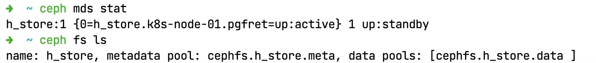
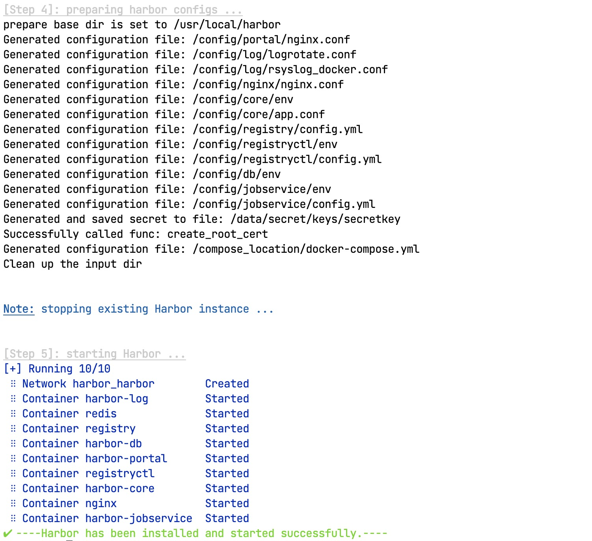

# 零步进：Harbor

> 髣髴兮若轻云之蔽月，飘飖兮若流风之回雪。——《洛神赋》

&ensp;&ensp;&ensp;&ensp;搭建完成了Ceph和K8S集群，本章进入一个小点，以工具为主，搭建私有镜像仓库帮助后期上生产环境。

* **Harbor**

## 1. 磁盘挂载

&ensp;&ensp;&ensp;&ensp;本章节第一件事就是为Harbor做好底层Ceph的初始化，前文中已经创建了CephFS，那么本章就需要消费了，所以在搭建镜像仓库之前，有必要讲讲Linux中的磁盘挂载。

### 1.1. mount命令

&ensp;&ensp;&ensp;&ensp;Linux系统是Unix系统的子系统[^1]，而Unix系统中所有的文件都排列在一颗大树中，即文件层次接口，根目录为`/`，这些文件可以分布在多个设备上。mount命令主要用于将某个设备上的文件系统附加到这个大的文件树上，相反，umount命令可再次将此分离；mount命令是Linux系统中的常用命令，它可以将分区挂接到Linux的一个文件夹下，从而将分区和该目录联系起来，因此我们只要访问这个文件夹都等于访问该分区了。

&ensp;&ensp;&ensp;&ensp;一般文件目录的挂载我们会放到`/mnt`下边，参考下边的常用命令：

```shell
# 查看命令帮助信息
mount --help
# 查看命令版本号
mount -V
# 查看系统中所有挂载
mount -l

# 挂载光盘
mkdir -p /mnt/cdrom
# /dev下的cdrom挂载到：/mnt/cdrom，于是访问 /mnt/cdrom就可以读取光盘内容了
mount /dev/cdrom /mnt/cdrom
# mount: /dev/cdrom is write-protected, mounting read-only
# 挂载的时如果目标设备是只读则你会看到上述消息输出

# 挂载ISO镜像文件
mkdir -p /mnt/vcdrom
mount -o loop -t iso9660 /opt/xxx.iso /mnt/vcdrom
# 挂载U盘
mount /dev/sdb /mnt/usb/
# 挂载NFS网络共享盘
mount -t nfs 192.168.0.208:/disk0 /mnt/bf
# 挂载Windows共享目录
mount -t cifs -o user=everyone,file_mode=0777,dir_mode=0777 //192.168.0.8/SHARE /sharedata
# 取消挂载
umount /mnt/bf
```

&ensp;&ensp;&ensp;&ensp;使用mount命令挂载的设备信息是当前会话有效，如果系统重启`reboot`则这些挂载的设备会自动被`umount`，下次启动后要重新挂载设备才能生效。

### 1.2. mtab/fstab

* **mtab**：位于`/etc/mtab`，它是一个文件，记载的是现在系统已经装载的文件系统，包括操作系统建立的虚拟文件等（一般很少用）。
* **fstab**：位于`/etc/fstab`，它也是一个文件，记录了计算机上硬盘分区的相关信息，启动Linux时，检查分区的`fsck`命令和挂载分区的`mount`命令，都要从`fstab`中读取信息，然后正确地检查和挂载硬盘。

&ensp;&ensp;&ensp;&ensp;为什么要使用fstab[^2]？手动处理挂载是很不人性化的，我们可以设置让系统在每次启动时就自动挂载，这样就避免重启系统引起麻烦。这种场景下，修改`/etc/fstab`就可以解决相关问题了。

&ensp;&ensp;&ensp;&ensp;系统**挂载的限制**：

* 根目录是必须要被挂载的，并且一定要优先于其他挂载点被挂载进来。
* 其他挂载点必须是已经建立的目录，可任意指定，但一定要遵守系统目录架构原则（FHS）。
* 所有挂载点，在同一时间内，只能挂载一次。
* 所有硬盘分区在同一时间内，只能挂载一次。
* 若要进行卸载，必须先将工作目录移到挂载点下（及其子目录）。

### 1.3. CephX

&ensp;&ensp;&ensp;&ensp;在挂载CephFS之前，聊聊`cephx`，它是什么呢？Ceph使用cephx协议对客户端进行身份认证：1）用于对ceph保存的数据执行认证访问和授权。2）用于对ceph的请求进行认证和授权检测。一般内部和mon通信的求求都要经过ceph认证，我们也可以在mon节点关闭cephx认证，关闭之后，数据本身的安全性无法保证。您可以直接查看配置文件`/etc/ceph/ceph.conf`，默认情况下下边文件中的配置都是`cephx`，若您想要**禁用**则可将配置设置成`none`（如下）：

```toml
[global]
auth_cluster_required = none
auth_service_required = none
auth_client_required = none
```

#### Ceph中的认证场景

* 命令行和Ceph集群交互：
    * RadosGW对象网关认证（对象网关认证系统 + cephx）
    * RBD认证
    * CephFS用户认证（文件路径 + cephx）
* Ceph集群内部组件之间的认证通信

&ensp;&ensp;&ensp;&ensp;默认的`ceph`命令，会使用`client.admin`用户，加载`/etc/ceph/ceph.client.admin.keyring`认证文件。**注意：CephX身份验证功能仅限制在Ceph的各个组件之间，不可以扩展到其他非Ceph组件，Ceph也只是负责认证授权，不能解决数据传输的加密问题**。

&ensp;&ensp;&ensp;&ensp;Ceph中认证的流程如：

> SK = Session Key, SSK = Secure Session Key，SK通过key加密得到SSK，SSK通过key解密得到SK。

1. 客户端携带`/etc/ceph/ceph.client.admin.keyring`的key信息向MON节点请求认证，申请SK。
2. MON节点为该用户生成SK，并通过客户端提供的key加密SK发送给客户端（SSK）。
3. 客户端使用key来解密获取的SSK得到SK，利用SK向MON节点申请ticket。
4. MON节点验证SK是否准确，验证成功就发放ticket。
5. 客户端使用Ticket访问OSD。
6. OSD验证ticket是否有效，并发送数据。

&ensp;&ensp;&ensp;&ensp;参考下边时序逻辑图：


#### 授权详解

&ensp;&ensp;&ensp;&ensp;Ceph中的用户主要表示**个人**（ceph管理者）或**系统参与者**（MON/OSD/MDS）。您可以执行如下命令查看相关内容：

```shell
# 默认 client.admin 账号
cat /etc/ceph/ceph.client.admin.keyring
```


&ensp;&ensp;&ensp;&ensp;截图中可以看到`client.admin`账号的相关配置，Ceph的授权是基于**使能/能力**（Capabilities, caps）来描述用户可针对MON/OSD/MDS使用的授权范围或级别。它的核心语法如下：

```shell
caps <daemon-type> = "allow <caps>"
```

&ensp;&ensp;&ensp;&ensp;daemon-type如截图中：`mds, mgr, mon, osd`；caps的值如下：

|能力|含义|
|---|---|
|r|向用户授予读权限，访问监视器Monitor以检索CRUSH运行的图时具有此能力。|
|w|向用户授予针对对象的写入权限。|
|x|向用户授予调用类方法（包括读取和写入）的能力，以及在监视器Monitor中执行 auth 操作的能力。|
|class-read|授予用户调用类读取方法的能力，属于 x 能力的子集。|
|class-write|授予用户调用类写入方法的能力，属于 x 能力的子集。|
|*|授予用户对特定守护进程/存储池的读取、写入和执行权限，以及执行管理命令的能力。|
|profile osd|授予用户以某个 OSD 身份连接到其他 OSD 或监视器的权限，授予OSD权限，使OSD能够处理复制检测信号流量和状态报告（获取OSD的状态信息）。|
|profile mds|授予用户以某个 MDS 身份连接到其他 MDS 或监视器的权限。|
|profile bootstrap-osd|授予用户引导 OSD 的权限（初始化OSD并将OSD加入ceph集群），授权给部署工具，使其在引导OSD时有权添加密钥。|
|profile bootstrap-mds|授权用户引导元数据服务器的权限，授权部署工具权限，使其在引导元数据服务器时有权添加密钥。|

### 1.4. CephFS挂载

&ensp;&ensp;&ensp;&ensp;CephFS又称为Ceph文件系统，Ceph文件系统需要两个RADOS池：一个用于数据，一个用于元数据（参考下图）：

*文件系统*


*数据池*


&ensp;&ensp;&ensp;&ensp;挂载CephFS的方式有两种：

* 内核挂载（Kernel Driver）
* Ceph Fuse挂载

#### 创建CephFS

&ensp;&ensp;&ensp;&ensp;创建步骤参考如下脚本：

1. 查看MDS状态：

    ```shell
    # 查看MDS状态：Metadata Server
    ceph mds stat
    ```

2. 创建数据池：

    ```shell
    # data数据池
    ceph osd pool create cephfs.h_docker.data 128
    # meta数据池
    ceph osd pool create cephfs.h_docker.meta 128
    ```

3. 基于数据池创建文件系统

    ```shell
    ceph fs new h_docker cephfs.h_docker.data cephfs.h_docker.meta
    ```

4. 查看文件系统

    ```shell
    ceph fs ls
    ```

    

> 上述步骤中，2和3可以合并，使用一个命令来处理：
>
>   ```shell
>   ceph fs volume create h_hub
>   ```

#### 内核挂载

&ensp;&ensp;&ensp;&ensp;在Linux内核`2.6.34`及以上的版本本地化支持Ceph[^3]，为了使用支持内核层的CephFS，客户端需要`2.6.34`以上版本的Linux内核，您可以使用如下步骤执行内核挂载（参考下边命令）：

```shell
# 直接使用MonitorIP，然后执行挂载
mount -t ceph 192.168.0.154:6789:/ /mnt/cephfs

# 若CephFS开启了cephx认证，挂载时需指定用户和密钥
mount -t ceph 192.168.0.154:6789:/ /mnt/cephfs -o name=admin,\
secret=xxx

# 更安全的方式是直接从文件中读取密码
mount -t ceph 192.168.0.154:6789:/ /mnt/cephfs -o name=admin,\
secretfile=/etc/ceph/admin.secret

# 卸载时使用umount命令
umount /mnt/cephfs

# 若您想要指定MDS相关信息，则可使用 mds_namespace=xx 的模式设置，放到-o之后
```

#### FUSE挂载

&ensp;&ensp;&ensp;&ensp;这种挂载模式让您可以直接在用户空间（FUSE）中挂载Ceph文件系统，在挂载之前确保客户端主机具有Ceph配置文件副本和用于Ceph元数据服务器的带有CAPS的密钥。

```shell
# 把 Monitor 上的Ceph配置文件`ceph.conf`拷贝到客户端的 /etc/ceph 目录下
scp {user}@{server-machine}:/etc/ceph/ceph.conf /etc/ceph/ceph.conf

# 把 Monitor 上的Ceph密钥拷贝到客户端 /etc/ceph 目录下
scp {user}@{server-machine}:/etc/ceph/ceph.keyring /etc/ceph/ceph.keyring

# 确保客户端上的配置文件和密钥有读写权限，使用`ceph-fuse`吧Ceph文件系统挂载为用户空间文件系统
ceph-fuse -m 192.168.0.154:6789 /home/vrv/cephfs
# 若放在其他路径，则
ceph-fuse -m 192.168.0.154:6789 -c {path}/ceph.conf /home/vrv/cephfs
# 若要挂载CephFS上的某个目录
ceph-fuse -c {path}/ceph.conf -r /{dir} /home/vrv/cephfs
```

#### 永久挂载

> 上述两种挂载都是临时性的，系统重启直接失效。

&ensp;&ensp;&ensp;&ensp;如果使用fstab挂载（编辑`/etc/fstab`），CephFS会在系统启动时自动挂载。

*内核模式*

```shell
# 语法
{ipaddress}:{port}:/ {mount}/{mountpoint} {filesystem-name}     \
[name=username,secret=secretkey|secretfile=/path/to/secretfile],[{mount.options}]
# 示例
192.168.0.1:6789:/     /mnt/cephfs    ceph    \
name=admin,secretfile=/etc/ceph/secret.key,noatime    0       2
```

*FUSE*

```shell
# 语法
id={user-ID}[,conf={path/to/conf.conf}] /mount/path  fuse.ceph defaults 0 0
# 示例
id=admin,conf=/etc/ceph/ceph.conf  /mnt/cephfs  fuse.ceph defaults 0 0
```

&ensp;&ensp;&ensp;&ensp;永久挂载配置中最后有**两个数字**，如上边提到的`0 2`或`0 0`，这两个数字的含义如下：

* `fs_freq`：用来决定哪一个文件系统需要执行dump操作，在Linux当中可以利用dump这个指令来进行系统备份；而dump指令则会针对`/etc/fstab`的设定值，去选择是否要将该partition进行备份的动作。

    |值|含义|
    |---|---|
    |0|代表不要做dump备份。|
    |1|代表要进行dump动作。|
    |2|代表要做dump备份动作，不过，该partition重要度比1小。|

* `fs_passno`：这是系统重启时fsck程序检测磁盘的顺序号，开机过程中，系统预设会以fsck检验我们的partition内的文件系统是否完整（clean），不过某些文件系统是不需要检验的，如虚拟内存SWAP、特殊档案系统如`/proc`何`/sys`等，所以这个字段中，我们可以设定是否要以fsck检验该文件系统。

    |值|含义|
    |---|---|
    |0|不要检验。|
    |1|要检验。|
    |2|要检验，不过1会比较早被检验，一般根目录设置为1，其他的需检验的为2即可。|

## 2. 私有仓库：Harbor

&ensp;&ensp;&ensp;&ensp;之前所有的配置我们都是直接从公网拉取的Docker镜像，而本章我们需要搭建一个内网的Docker镜像，如此，您开发的所有产品和相关内容就可以直接发布到私库中，商业镜像就不对外托管了；当然你也可以相信云服务商，直接在自己的账号内做镜像仓库（其实是安全的）。

&ensp;&ensp;&ensp;&ensp;Harbor[^4]是VMware公司开源的企业级Docker Registry管理项目，它包括**权限管理（RBAC）、LDAP、日志审核、管理界面、自我注册、镜像复制、中文支持**等功能，可以很好满足公司私有镜像仓库的需求。CephFS则是Ceph分布式存储系统中的文件存储，可靠性高、管理方便、伸缩性强，能轻松对PB、EB级别数据。

### 2.1. Ceph初始化

&ensp;&ensp;&ensp;&ensp;接下来按照如下步骤处理Ceph部分（**该步骤前边章节已经有了，此处再走一次，加深印象**）：

1. 先查看MDS状态（系统中最少有一个MDS，前一章节已经搭建过）：

    ```shell
    # 查看MDS状态
    ceph mds stat
    # 查看FS状态
    ceph fs ls
    # 启用多文件系统模式的相关命令
    ceph fs flag set enable_multiple true
    ```

    

2. 系统中目前已经有一个`h_store`的fs了，那么接下来创建一个新的`h_hub`的CephFS

    ```shell
    # 我们搭建的模式创建 h_hub（推荐使用这个）
    ceph fs volume create h_hub
    # 网上教程模式（先创建pool，再创建FS和Pool相关联）
    ceph osd pool create cephfs.h_docker.data 128
    ceph osd pool create cephfs.h_docker.meta 128
    ceph fs new h_docker cephfs.h_docker.data cephfs.h_docker.meta
    ```

3. 查看密钥信息

    ```shell
    # 查看密钥
    cat /etc/ceph/ceph.client.admin.keyring
    # 创建密钥文件
    vim /etc/ceph/admin.secret
    ```

    

4. 创建挂载目录，并执行挂载

    ```shell
    # 创建挂载目录
    mkdir /mnt/h_hub
    # 挂载 h_hub 目录，指明用户名和密钥
    mount -t ceph 192.168.0.154:/ /mnt/h_hub \
        -o name=admin,secretfile=/etc/ceph/admin.secret
    # 查看挂载结果
    df -h
    ```

    

&ensp;&ensp;&ensp;&ensp;经过上边操作，此处已经创建好一个cephfs文件系统，而且将cephfs挂载到了admin节点的 /mnt/h_hub目录，接下来就安装Harbor，直接将卷修改到此目录即可。

5. 编辑`/etc/fstab`文件：

    ```shell
    # 编辑分区表
    vim /etc/fstab
    # 然后执行reboot重启验证
    reboot
    ```

    

6. 然后执行下边命令挂载：

    ```shell
    mount -a # 已经修改过 /etc/fstab，所以可直接执行
    df -h
    ```

    

### 2.2. 安装docker-compose

1. 升级Python3中的pip部分

    ```shell
    yum -y install python3-pip
    pip3 install --upgrade pip
    ```

2. 直接安装docker-compose

    ```shell
    pip3 install docker-compose
    docker-compose version
    ```

    

### 2.3. 单节点Harbor

> 由于这里是搭建开发测试环境，所以并没有将DB部分单独分离出来，直接映射到卷上就可以了，本章节就搭建Harbor并将所有配置映射到上述卷中。

1. 下载离线安装包：

    ```shell
    # 国内加前缀 https://ghproxy.com/
    wget https://ghproxy.com/https://github.com/goharbor/harbor/releases/download/v2.6.2/harbor-offline-installer-v2.6.2.tgz
    # 如果您服务器可直接访问Github，则可直接使用命令
    wget https://github.com/goharbor/harbor/releases/download/v2.6.2/harbor-offline-installer-v2.6.2.tgz
    ```

    

2. 解压安装包：

    ```shell
    tar xzvf harbor-offline-installer-v2.6.2.tgz -C /usr/local/
    cd /usr/local/harbor/
    ```

    

3. 手动导入镜像：

    ```shell
    # harbor.v2.6.2.tar.gz 是解压出来的镜像文件
    docker load -i harbor.v2.6.2.tar.gz
    docker images
    ```

    

4. 初始化CephFS中的目录

    ```shell
    # CephFS
    mkdir -p /mnt/h_hub/data        # 数据目录
    mkdir -p /mnt/h_hub/log         # 日志目录
    mkdir -p /mnt/h_hub/cert        # 证书目录
    # Local
    mkdir -p /registry/data         # 数据目录
    mkdir -p /registry/log          # 日志目录
    mkdir -p /registry/cert         # 证书目录
    mkdir -p /registry/working      # 工作目录
    ```

**注意：由于CephFS的挂载有一个遗留问题没解决，虽然编辑了`/etc/fstab`并且追加了启动过程中mount的盘相关信息，但是重启过后该盘依然没有挂载成功，执行`df -h`之后之前挂载的内容就消失了，所以在这个问题没解决之前，Harbor暂时使用k8s-master主机上的路径配置**。

### 2.4. HTTPS配置

|证书项目|值|
|---|---|
|CN|k8s-master|
|O|hotel|
|ST/L|ChongQing|

&ensp;&ensp;&ensp;&ensp;最终得到的`-subj`的值为：`/C=CN/ST=ChongQing/L=ChongQing/O=hotel/OU=Personal/CN=k8s-master`，直接进入`/registry/cert`目录执行CA部分[^5]。

1. **CA证书**：生成私钥

    ```shell
    openssl genrsa -out ca.key 4096
    ```

2. **CA证书**：若您使用了FQDN（全限定域名）去连接您的Habor主机，则必须配置-subj的`CN`选项，值为`Harbor`的FQDN

    ```shell
    openssl req -x509 -new -nodes -sha512 -days 3650 \
        -subj "/C=CN/ST=ChongQing/L=ChongQing/O=hotel/OU=Personal/CN=k8s-master" \
        -key ca.key \
        -out ca.crt
    ```

3. **服务器证书**：生成私钥

    ```shell
    openssl genrsa -out k8s-master.key 4096
    ```

4. **服务器证书**：生成证书签名请求（CSR），调整`-subj`的值以体现你公司的信息，如果你用`FQDN`去连接你的Harbor主机，则必须配置`-subj`，并且CN选项的值为`FQDN`，并且这个值也要用在`key`选项和`CSR`的文件名

    ```shell
    openssl req -sha512 -new \
        -subj "/C=CN/ST=ChongQing/L=ChongQing/O=hotel/OU=Personal/CN=k8s-master" \
        -key k8s-master.key \
        -out k8s-master.csr
    ```

5. 生成一个`x509 v3`扩展文件：不管你是使用`FQDN`还是`IP`连接你得Harbor主机，你都必须创建这个文件，这样你才可以为Harbor主机生成符合`Subject Alternative Name（SAN）`和`x509 v3`扩展要求的证书：

    ```shell
    cat > v3.ext <<-EOF
    authorityKeyIdentifier=keyid,issuer
    basicConstraints=CA:FALSE
    keyUsage = digitalSignature, nonRepudiation, keyEncipherment, dataEncipherment
    extendedKeyUsage = serverAuth
    subjectAltName = @alt_names

    [alt_names]
    DNS.1=k8s-master
    EOF
    ```

6. 使用`v3.ext`扩展文件为您的Harbor主机生成证书，使用您安装Harbor的主机名做文件名：

    ```shell
    openssl x509 -req -sha512 -days 3650 \
        -extfile v3.ext \
        -CA ca.crt -CAkey ca.key -CAcreateserial \
        -in k8s-master.csr \
        -out k8s-master.crt
    ```

    

### 2.5. Harbor/Docker证书发放

&ensp;&ensp;&ensp;&ensp;生成了`ca.crt, k8s-master.crt, k8s-master.key`文件之后，您必须将它们提供给Harbor和Docker，用它们来重新配置Harbor。

1. 在你得Harbor主机上复制服务器证书和key到证书文件夹：

    ```shell
    cp k8s-master.crt /registry/cert
    cp k8s-master.key /registry/cert
    ll /registry/cert
    ```

    

2. 将`k8s-master.crt`转换成`k8s-master.cert`提供给Docker使用，Docker守护进程将`.crt`文件解释为CA证书，将`.cert`文件解释为客户端证书：

    ```shell
    openssl x509 -inform PEM -in k8s-master.crt -out k8s-master.cert
    ```

3. 由于Harbor默认的Nginx需要使用`30200`端口，所以此处需要创建新目录，然后将主机上的服务器证书，key和CA文件拷贝到Docker证书文件夹（预先创建）：

    ```shell
    # 域名
    mkdir -p /etc/docker/certs.d/k8s-master:30200
    # IP
    mkdir -p /etc/docker/certs.d/192.168.0.154:30200
    # 拷贝证书（三个）
    cp k8s-master.cert /etc/docker/certs.d/k8s-master:30200
    cp k8s-master.key /etc/docker/certs.d/k8s-master:30200
    cp ca.crt /etc/docker/certs.d/k8s-master:30200
    ```

    

> 上述内容需要在每个节点上处理一次，只要访问Harbor的Docker客户端都需要做此动作。

### 2.6. 配置文件

&ensp;&ensp;&ensp;&ensp;修改解压过后的`harbor.yml.tmpl`文件：

1. 拷贝该文件：

    ```
    cp harbor.yml.tmpl harbor.yml
    ```

2. 编辑`harbor.yml`文件：

    ```yaml
    # 你的域名
    hostname: k8s-master
    # HTTP / HTTPS 端口
    http:
      port: 30201       # HTTP  端口
    https:
      port: 30200       # HTTPS 端口
      # 证书
      certificate: /registry/cert/k8s-master.crt
      private_key: /registry/cert/k8s-master.key
    # 登录账号密码
    harbor_admin_password: xxxx
    # 数据库root账号密码
    database:
      password: pl,okmijn123
    # 卷位置
    data_volume: /registry/data
    # 日志位置
    log:
      local:
        location: /registry/log
    ```

3. 执行安装脚本`install.sh`文件：

    ```shell
    ./install.sh
    ```

    

    

4. 从浏览器中访问：`https://ox.k8s.cn:30200`，用账号密码则可以看到如下界面：

    

## 3. 小结

&ensp;&ensp;&ensp;&ensp;到这里我们的私有仓库就搭建完成了，唯一比较遗憾的是虽然规划了CephFS为Harbor使用，但实际搭建过程中由于中间BUG没有解决，所以目前还是搭建在单节点上的，但对中小型企业而言，这个已经足够使用了，所以就不再去纠结具体细节。

[^1]: [Linux命令之mount命令](https://blog.csdn.net/carefree2005/article/details/121907982)，作者：[恒悦sunsite](https://sunsite.blog.csdn.net/?type=blog)
[^2]: [Linux设置启动挂载](https://blog.51cto.com/u_15346415/5093644)，作者：[董哥的黑板报](https://blog.51cto.com/u_15346415)
[^3]: [Ceph--挂载](https://www.cnblogs.com/w1ng/p/13225735.html)，作者：[LeoWang](https://www.cnblogs.com/w1ng/)
[^4]: [基于Harbor和CephFS搭建高可用Docker镜像仓库集群](https://cloud.tencent.com/developer/article/1433266), 作者：[哎_小羊](https://cloud.tencent.com/developer/user/1148539)
[^5]: [Harbor安装教程-完全根据官方文档2.6.0版本](https://blog.csdn.net/w874307446/article/details/127068049)，作者：[EmptyCastle](https://blog.csdn.net/w874307446?type=blog)