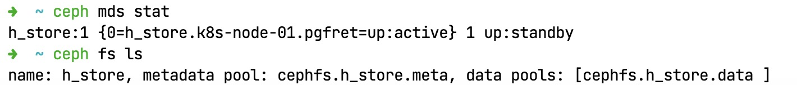
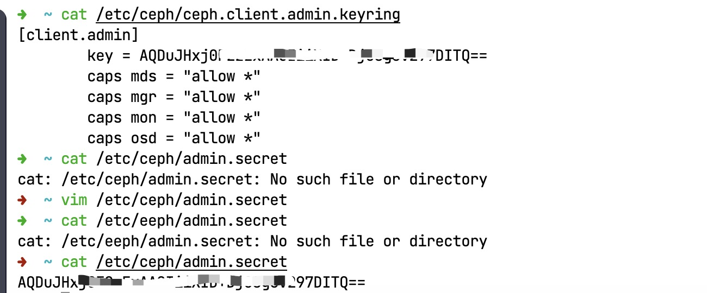
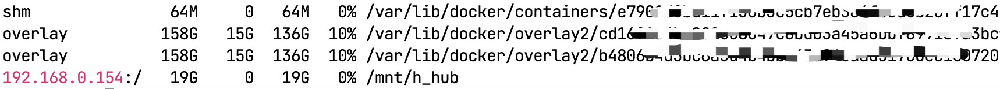

# 零步进：Harbor/KubeSphere

> 髣髴兮若轻云之蔽月，飘飖兮若流风之回雪。——《洛神赋》

&ensp;&ensp;&ensp;&ensp;搭建完成了Ceph和K8S集群，本章进入一个小点，以工具为主，搭建两个辅助工具帮助后期上生产环境。理论上来讲，这两个工具互不相干，但是由于项目计划原因我们需要合并到一起作为启航搭建，所以就将二者合并到一起了，当然仅仅搭建环境是不够的，还需要深入理解一下相关内容。

* **Harbor**
* **KubeSphere**

## 1. 私有仓库：Harbor

&ensp;&ensp;&ensp;&ensp;之前所有的配置我们都是直接从公网拉取的Docker镜像，而本章我们需要搭建一个内网的Docker镜像，如此，您开发的所有产品和相关内容就可以直接发布到私库中，商业镜像就不对外托管了；当然你也可以相信云服务商，直接在自己的账号内做镜像仓库（其实是安全的）。

&ensp;&ensp;&ensp;&ensp;Harbor[^1]是VMware公司开源的企业级Docker Registry管理项目，它包括**权限管理（RBAC）、LDAP、日志审核、管理界面、自我注册、镜像复制、中文支持**等功能，可以很好满足公司私有镜像仓库的需求。CephFS则是Ceph分布式存储系统中的文件存储，可靠性高、管理方便、伸缩性强，能轻松对PB、EB级别数据。

### 1.1. Ceph初始化

&ensp;&ensp;&ensp;&ensp;接下来按照如下步骤处理Ceph部分：

1. 先查看MDS状态（系统中最少有一个MDS，前一章节已经搭建过）：

    ```shell
    # 查看MDS状态
    ceph mds stat
    # 查看FS状态
    ceph fs ls
    ```

    

2. 系统中目前已经有一个`h_store`的fs了，那么接下来创建一个新的`h_hub`的CephFS

    ```shell
    # 我们搭建的模式创建 h_hub（推荐使用这个）
    ceph fs volume create h_hub
    # 网上教程模式（先创建pool，再创建FS和Pool相关联）
    ceph osd pool create cephfs.h_docker.data 128
    ceph osd pool create cephfs.h_docker.meta 128
    ceph fs new h_docker cephfs.h_docker.data cephfs.h_docker.meta
    ```

3. 查看密钥信息

    ```shell
    # 查看密钥
    cat /etc/ceph/ceph.client.admin.keyring
    # 创建密钥文件
    vim /etc/ceph/admin.secret
    ```

    

4. 创建挂载目录，并执行挂载

    ```shell
    # 创建挂载目录
    mkdir /mnt/h_hub
    # 挂载 h_hub 目录，指明用户名和密钥
    mount -t ceph 192.168.0.154:/ /mnt/h_hub \
        -o name=admin,secretfile=/etc/ceph/admin.secret
    # 查看挂载结果
    df -h
    ```

    

&ensp;&ensp;&ensp;&ensp;经过上边操作，此处已经创建好一个cephfs文件系统，而且将cephfs挂载到了admin节点的 /mnt/h_hub目录，接下来就安装Harbor，直接将卷修改到此目录即可。

### 1.2. 单节点Harbor

> 由于这里是搭建开发测试环境，所以并没有将DB部分单独分离出来，直接映射到卷上就可以了，本章节就搭建Harbor并将所有配置映射到上述卷中。

&ensp;&ensp;&ensp;&ensp;

[^1]: [基于Harbor和CephFS搭建高可用Docker镜像仓库集群](https://cloud.tencent.com/developer/article/1433266), 作者：[哎_小羊](https://cloud.tencent.com/developer/user/1148539)