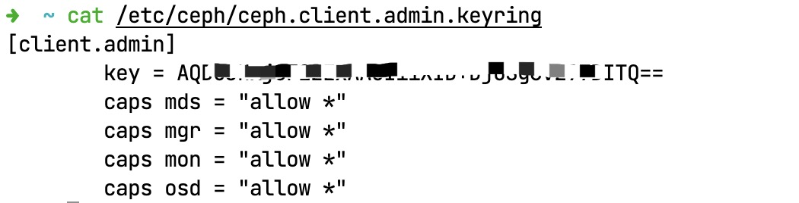
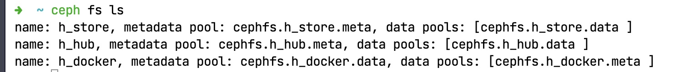
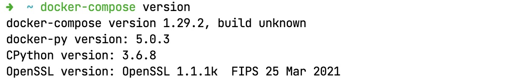
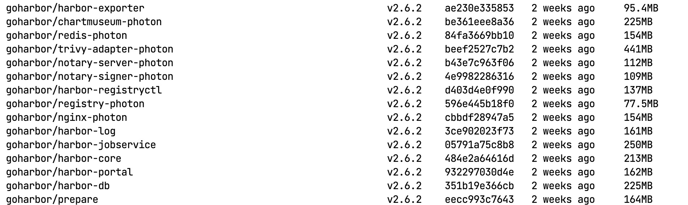

# 零步进：Harbor/KubeSphere

> 髣髴兮若轻云之蔽月，飘飖兮若流风之回雪。——《洛神赋》

&ensp;&ensp;&ensp;&ensp;搭建完成了Ceph和K8S集群，本章进入一个小点，以工具为主，搭建两个辅助工具帮助后期上生产环境。理论上来讲，这两个工具互不相干，但是由于项目计划原因我们需要合并到一起作为启航搭建，所以就将二者合并到一起了，当然仅仅搭建环境是不够的，还需要深入理解一下相关内容。

* **Harbor**
* **KubeSphere**

## 1. 磁盘挂载

&ensp;&ensp;&ensp;&ensp;本章节第一件事就是为Harbor做好底层Ceph的初始化，前文中已经创建了CephFS，那么本章就需要消费了，所以在搭建镜像仓库之前，有必要讲讲Linux中的磁盘挂载。

### 1.1. mount命令

&ensp;&ensp;&ensp;&ensp;Linux系统是Unix系统的子系统[^1]，而Unix系统中所有的文件都排列在一颗大树中，即文件层次接口，根目录为`/`，这些文件可以分布在多个设备上。mount命令主要用于将某个设备上的文件系统附加到这个大的文件树上，相反，umount命令可再次将此分离；mount命令是Linux系统中的常用命令，它可以将分区挂接到Linux的一个文件夹下，从而将分区和该目录联系起来，因此我们只要访问这个文件夹都等于访问该分区了。

&ensp;&ensp;&ensp;&ensp;一般文件目录的挂载我们会放到`/mnt`下边，参考下边的常用命令：

```shell
# 查看命令帮助信息
mount --help
# 查看命令版本号
mount -V
# 查看系统中所有挂载
mount -l

# 挂载光盘
mkdir -p /mnt/cdrom
# /dev下的cdrom挂载到：/mnt/cdrom，于是访问 /mnt/cdrom就可以读取光盘内容了
mount /dev/cdrom /mnt/cdrom
# mount: /dev/cdrom is write-protected, mounting read-only
# 挂载的时如果目标设备是只读则你会看到上述消息输出

# 挂载ISO镜像文件
mkdir -p /mnt/vcdrom
mount -o loop -t iso9660 /opt/xxx.iso /mnt/vcdrom
# 挂载U盘
mount /dev/sdb /mnt/usb/
# 挂载NFS网络共享盘
mount -t nfs 192.168.0.208:/disk0 /mnt/bf
# 挂载Windows共享目录
mount -t cifs -o user=everyone,file_mode=0777,dir_mode=0777 //192.168.0.8/SHARE /sharedata
# 取消挂载
umount /mnt/bf
```

&ensp;&ensp;&ensp;&ensp;使用mount命令挂载的设备信息是当前会话有效，如果系统重启`reboot`则这些挂载的设备会自动被`umount`，下次启动后要重新挂载设备才能生效。

### 1.2. mtab/fstab

* **mtab**：位于`/etc/mtab`，它是一个文件，记载的是现在系统已经装载的文件系统，包括操作系统建立的虚拟文件等（一般很少用）。
* **fstab**：位于`/etc/fstab`，它也是一个文件，记录了计算机上硬盘分区的相关信息，启动Linux时，检查分区的`fsck`命令和挂载分区的`mount`命令，都要从`fstab`中读取信息，然后正确地检查和挂载硬盘。

&ensp;&ensp;&ensp;&ensp;为什么要使用fstab[^2]？手动处理挂载是很不人性化的，我们可以设置让系统在每次启动时就自动挂载，这样就避免重启系统引起麻烦。这种场景下，修改`/etc/fstab`就可以解决相关问题了。

&ensp;&ensp;&ensp;&ensp;系统**挂载的限制**：

* 根目录是必须要被挂载的，并且一定要优先于其他挂载点被挂载进来。
* 其他挂载点必须是已经建立的目录，可任意指定，但一定要遵守系统目录架构原则（FHS）。
* 所有挂载点，在同一时间内，只能挂载一次。
* 所有硬盘分区在同一时间内，只能挂载一次。
* 若要进行卸载，必须先将工作目录移到挂载点下（及其子目录）。

### 1.3. CephX

&ensp;&ensp;&ensp;&ensp;在挂载CephFS之前，聊聊`cephx`，它是什么呢？Ceph使用cephx协议对客户端进行身份认证：1）用于对ceph保存的数据执行认证访问和授权。2）用于对ceph的请求进行认证和授权检测。一般内部和mon通信的求求都要经过ceph认证，我们也可以在mon节点关闭cephx认证，关闭之后，数据本身的安全性无法保证。您可以直接查看配置文件`/etc/ceph/ceph.conf`，默认情况下下边文件中的配置都是`cephx`，若您想要**禁用**则可将配置设置成`none`（如下）：

```toml
[global]
auth_cluster_required = none
auth_service_required = none
auth_client_required = none
```

#### Ceph中的认证场景

* 命令行和Ceph集群交互：
    * RadosGW对象网关认证（对象网关认证系统 + cephx）
    * RBD认证
    * CephFS用户认证（文件路径 + cephx）
* Ceph集群内部组件之间的认证通信

&ensp;&ensp;&ensp;&ensp;默认的`ceph`命令，会使用`client.admin`用户，加载`/etc/ceph/ceph.client.admin.keyring`认证文件。**注意：CephX身份验证功能仅限制在Ceph的各个组件之间，不可以扩展到其他非Ceph组件，Ceph也只是负责认证授权，不能解决数据传输的加密问题**。

&ensp;&ensp;&ensp;&ensp;Ceph中认证的流程如：

> SK = Session Key, SSK = Secure Session Key，SK通过key加密得到SSK，SSK通过key解密得到SK。

1. 客户端携带`/etc/ceph/ceph.client.admin.keyring`的key信息向MON节点请求认证，申请SK。
2. MON节点为该用户生成SK，并通过客户端提供的key加密SK发送给客户端（SSK）。
3. 客户端使用key来解密获取的SSK得到SK，利用SK向MON节点申请ticket。
4. MON节点验证SK是否准确，验证成功就发放ticket。
5. 客户端使用Ticket访问OSD。
6. OSD验证ticket是否有效，并发送数据。

&ensp;&ensp;&ensp;&ensp;参考下边时序逻辑图：


#### 授权详解

&ensp;&ensp;&ensp;&ensp;Ceph中的用户主要表示**个人**（ceph管理者）或**系统参与者**（MON/OSD/MDS）。您可以执行如下命令查看相关内容：

```shell
# 默认 client.admin 账号
cat /etc/ceph/ceph.client.admin.keyring
```



&ensp;&ensp;&ensp;&ensp;截图中可以看到`client.admin`账号的相关配置，Ceph的授权是基于**使能/能力**（Capabilities, caps）来描述用户可针对MON/OSD/MDS使用的授权范围或级别。它的核心语法如下：

```shell
caps <daemon-type> = "allow <caps>"
```

&ensp;&ensp;&ensp;&ensp;daemon-type如截图中：`mds, mgr, mon, osd`；caps的值如下：

|能力|含义|
|---|---|
|r|向用户授予读权限，访问监视器Monitor以检索CRUSH运行的图时具有此能力。|
|w|向用户授予针对对象的写入权限。|
|x|向用户授予调用类方法（包括读取和写入）的能力，以及在监视器Monitor中执行 auth 操作的能力。|
|class-read|授予用户调用类读取方法的能力，属于 x 能力的子集。|
|class-write|授予用户调用类写入方法的能力，属于 x 能力的子集。|
|*|授予用户对特定守护进程/存储池的读取、写入和执行权限，以及执行管理命令的能力。|
|profile osd|授予用户以某个 OSD 身份连接到其他 OSD 或监视器的权限，授予OSD权限，使OSD能够处理复制检测信号流量和状态报告（获取OSD的状态信息）。|
|profile mds|授予用户以某个 MDS 身份连接到其他 MDS 或监视器的权限。|
|profile bootstrap-osd|授予用户引导 OSD 的权限（初始化OSD并将OSD加入ceph集群），授权给部署工具，使其在引导OSD时有权添加密钥。|
|profile bootstrap-mds|授权用户引导元数据服务器的权限，授权部署工具权限，使其在引导元数据服务器时有权添加密钥。|

### 1.4. CephFS挂载

&ensp;&ensp;&ensp;&ensp;CephFS又称为Ceph文件系统，Ceph文件系统需要两个RADOS池：一个用于数据，一个用于元数据（参考下图）：

*文件系统*


*数据池*


#### 创建CephFS

&ensp;&ensp;&ensp;&ensp;创建步骤参考如下脚本：

1. 查看MDS状态：

    ```shell
    # 查看MDS状态：Metadata Server
    ceph mds stat
    ```

2. 创建数据池：

    ```shell
    # data数据池
    ceph osd pool create cephfs.h_docker.data 128
    # meta数据池
    ceph osd pool create cephfs.h_docker.meta 128
    ```

3. 基于数据池创建文件系统

    ```shell
    ceph fs new h_docker cephfs.h_docker.data cephfs.h_docker.meta
    ```

4. 查看文件系统

    ```shell
    ceph fs ls
    ```

    

> 上述步骤中，2和3可以合并，使用一个命令来处理：
>
>   ```shell
>   ceph fs volume create h_hub
>   ```

#### 挂载

&ensp;&ensp;&ensp;&ensp;挂载CephFS的方式有两种：

* 内核挂载（Kernel Driver）
* Ceph Fuse挂载

## 2. 私有仓库：Harbor

&ensp;&ensp;&ensp;&ensp;之前所有的配置我们都是直接从公网拉取的Docker镜像，而本章我们需要搭建一个内网的Docker镜像，如此，您开发的所有产品和相关内容就可以直接发布到私库中，商业镜像就不对外托管了；当然你也可以相信云服务商，直接在自己的账号内做镜像仓库（其实是安全的）。

&ensp;&ensp;&ensp;&ensp;Harbor[^3]是VMware公司开源的企业级Docker Registry管理项目，它包括**权限管理（RBAC）、LDAP、日志审核、管理界面、自我注册、镜像复制、中文支持**等功能，可以很好满足公司私有镜像仓库的需求。CephFS则是Ceph分布式存储系统中的文件存储，可靠性高、管理方便、伸缩性强，能轻松对PB、EB级别数据。

### 2.1. Ceph初始化

&ensp;&ensp;&ensp;&ensp;接下来按照如下步骤处理Ceph部分：

1. 先查看MDS状态（系统中最少有一个MDS，前一章节已经搭建过）：

    ```shell
    # 查看MDS状态
    ceph mds stat
    # 查看FS状态
    ceph fs ls
    ```

    

2. 系统中目前已经有一个`h_store`的fs了，那么接下来创建一个新的`h_hub`的CephFS

    ```shell
    # 我们搭建的模式创建 h_hub（推荐使用这个）
    ceph fs volume create h_hub
    # 网上教程模式（先创建pool，再创建FS和Pool相关联）
    ceph osd pool create cephfs.h_docker.data 128
    ceph osd pool create cephfs.h_docker.meta 128
    ceph fs new h_docker cephfs.h_docker.data cephfs.h_docker.meta
    ```

3. 查看密钥信息

    ```shell
    # 查看密钥
    cat /etc/ceph/ceph.client.admin.keyring
    # 创建密钥文件
    vim /etc/ceph/admin.secret
    ```

    

4. 创建挂载目录，并执行挂载

    ```shell
    # 创建挂载目录
    mkdir /mnt/h_hub
    # 挂载 h_hub 目录，指明用户名和密钥
    mount -t ceph 192.168.0.154:/ /mnt/h_hub \
        -o name=admin,secretfile=/etc/ceph/admin.secret
    # 查看挂载结果
    df -h
    ```

    

&ensp;&ensp;&ensp;&ensp;经过上边操作，此处已经创建好一个cephfs文件系统，而且将cephfs挂载到了admin节点的 /mnt/h_hub目录，接下来就安装Harbor，直接将卷修改到此目录即可。但是这种操作

### 2.2. 安装docker-compose

1. 升级Python3中的pip部分

    ```shell
    yum -y install python3-pip
    pip3 install --upgrade pip
    ```

2. 直接安装docker-compose

    ```shell
    pip3 install docker-compose
    docker-compose version
    ```

    

### 2.3. 单节点Harbor

> 由于这里是搭建开发测试环境，所以并没有将DB部分单独分离出来，直接映射到卷上就可以了，本章节就搭建Harbor并将所有配置映射到上述卷中。

1. 下载离线安装包：

    ```shell
    # 国内加前缀 https://ghproxy.com/
    wget https://ghproxy.com/https://github.com/goharbor/harbor/releases/download/v2.6.2/harbor-offline-installer-v2.6.2.tgz
    # 如果您服务器可直接访问Github，则可直接使用命令
    wget https://github.com/goharbor/harbor/releases/download/v2.6.2/harbor-offline-installer-v2.6.2.tgz
    ```

    

2. 解压安装包：

    ```shell
    tar xzvf harbor-offline-installer-v2.6.2.tgz -C /usr/local/
    cd /usr/local/harbor/
    ```

    

3. 手动导入镜像：

    ```shell
    # harbor.v2.6.2.tar.gz 是解压出来的镜像文件
    docker load -i harbor.v2.6.2.tar.gz
    docker images
    ```

    

4. 修改配置文件：
    * 将底层存储配置到CephFS中。
    * 配置端口号为`30200`。

    ```shell
    # 修改脚本
    vim prepare
    ```

[^1]: [Linux命令之mount命令](https://blog.csdn.net/carefree2005/article/details/121907982)，作者：[恒悦sunsite](https://sunsite.blog.csdn.net/?type=blog)
[^2]: [Linux设置启动挂载](https://blog.51cto.com/u_15346415/5093644)，作者：[董哥的黑板报](https://blog.51cto.com/u_15346415)
[^3]: [基于Harbor和CephFS搭建高可用Docker镜像仓库集群](https://cloud.tencent.com/developer/article/1433266), 作者：[哎_小羊](https://cloud.tencent.com/developer/user/1148539)