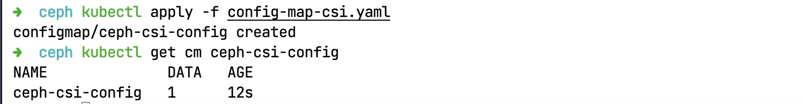
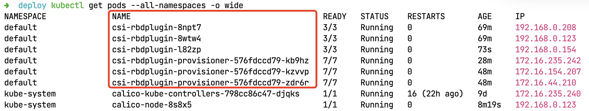
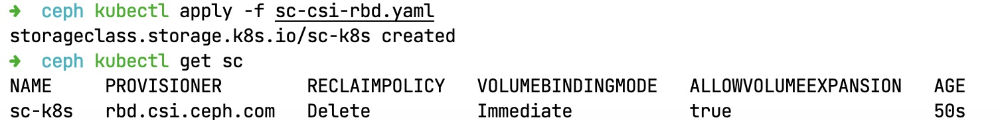
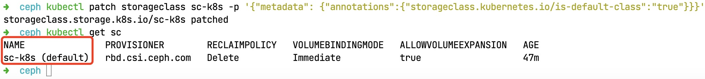
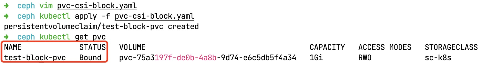

# 执子之手：Ceph RBD

> 死生契阔，与子成说。执子之手，与子偕老。——《诗经》

&ensp;&ensp;&ensp;&ensp;前边三个章节我们已经搭建好了K8S、Ceph、Harbor，基础环境已经有了，接下来这个章节就让K8S和Ceph联动起来，将Ceph作为K8S的底层存储引擎让二者协同工作，不论是之后的KubeSphere还是TiDB都可以直接使用本章配置的结果来访问底层存储。


&ensp;&ensp;&ensp;&ensp;K8S和Ceph集成有三种实现方式：

* Volumes存储卷
* PV/PVC持久化卷/持久化卷声明
* StorageClass动态存储，动态创建PV、PVC

&ensp;&ensp;&ensp;&ensp;Ceph支持K8S存储有两种类型：

* CephFS：文件系统
* Ceph RBD：块存储

> **注意**：一般写CephFS会将Ceph和FS连写，而RBD则中间加一空白来写！

## 1. ceph-csi

&ensp;&ensp;&ensp;&ensp;CSI[^1]全称Container Storage Interface，它是Ceph的一个插件，它的目的是定义行业标准“容器存储接口”，使存储供应商（SP）可以开发一个符合CSI标准的插件并使其能够在多个容器编排（CO）系统中工作。

&ensp;&ensp;&ensp;&ensp;本章K8S通过`ceph-csi`（csi plugin）来接入ceph存储（csi相关组件的分析以rbd为例进行分析），对csi系统结构、涉及的k8s对象和组件进行简单介绍，以及k8s对存储进行相关操作流程分析，存储相关操作包括**存储创建、存储扩容、存储挂载、解除存储、存储删除**操作。

### 1.1. 整体架构

> 图参考文档中内容重绘，PV/PVC/SC此处不解释其作用（烂大街的概念），下文主要围绕CSI部分。


#### VolumeAttachment组件

&ensp;&ensp;&ensp;&ensp;该组件记录了PV挂载的相关信息：**挂载到哪个Node节点、由哪个Volume Plugin来挂载**等。AD Controller会创建一个VolumeAttachment，而External-Attacher通过观察该VolumeAttachment，根据状态属性来执行存储的挂载、卸载操作。

#### CSINode

&ensp;&ensp;&ensp;&ensp;**CSINode**记录了`csi plugin`相关信息（**NodeId、DriverName、拓扑**），当Node Driver Register向kubelet注册一个csi plugin之后，会创建（更新）一个CSINode对象，记录csi plugin的相关信息。

#### Volume Plugin

&ensp;&ensp;&ensp;&ensp;该组件扩展各种存储类型的卷管理能力，实现第三方存储各种操作能力和K8S存储系统结合，并调用第三方存储的接口或命令，从而提供数据卷的创建/删除、attach/detach、mount/umount具体操作实现，可以认为是第三方存储代理人。

* **in-tree**：在K8S源码内部实现，和K8S一起发布、管理，更新迭代慢、灵活性差。
* **out-of-tree**：代码独立于K8S，由存储厂商实现，有`csi, flexvolume`两种实现。

#### CSI Plugin

&ensp;&ensp;&ensp;&ensp;`ceph-csi`就属于csi plugin，它主要分为ControllerServer和NodeServer，负责不同的存储操作。

#### External Plugin

&ensp;&ensp;&ensp;&ensp;主要包含四个子组件（参考图），它辅助csi plugin组件共同完成存储相关的操作。

|组件|作用|
|---|---|
|provisioner|Watch PVC对象，调用csi plugin创建存储，最终创建PV。|
|attacher|Watch VolumeAttachment对象，调用csi plugin做attach/dettach操作。|
|resizer|Watch PVC对象，调用csi plugin来做存储扩容。|
|snapshotter|创建快照。|

#### Node-Driver-Registrar

&ensp;&ensp;&ensp;&ensp;该组件负责实现csi plugin（NodeServer）的注册，让kubelet感知csi plugin的存在。

#### AD/PV Controller

&ensp;&ensp;&ensp;&ensp;PV Controller负责PV、PVC绑定和生命周期管理（创建/删除底层存储、创建/删除PV对象、PV和PVC对象状态变更）。

&ensp;&ensp;&ensp;&ensp;AD Controller全称Attachment/Detachment控制器，主要负责创建、删除VolumeAttachment对象，并调用volume plugin来做存储设备的Attach/Detach操作（将数据卷挂载到特定node节点上/从特定node节点上解除挂载），以及更新node.Status.VolumesAttached等。

> 关于这部分内容参考引用博文第一章，这里就不再做过多介绍，本章节的基本介绍只是起一个抛砖引玉的作用。

### 1.2. CSI插件

&ensp;&ensp;&ensp;&ensp;ceph-csi的块设备功能要`K8S v1.13`以上或更高版本才可用，它动态提供了RBD映像以支持K8S卷并将这些RBD映像映射为工作节点上的块设备（可选地挂载映像中包含的文件系统）运行引用RBD支持卷的Pod。它的整体结构如下：


&ensp;&ensp;&ensp;&ensp;所以您可以通过kubernetes sidecar部署provisioner, attacher, resizer, driver-registrar, snapshotter组件以支持CSI功能。ceph-csi插件实现了支持CSI的Container Orchestrator（OC）和Ceph集群之间的接口，允许动态供应Ceph卷并将它们附加到工作负载中。默认情况下ceph-csi使用RBD内核模块，可能不支持所有的Ceph CRUSH可调参数或RBD映像等特性。

<hr/>

## 2. ceph-csi部署步骤

### 2.1.Ceph: Pool

1. 默认情况下，Ceph块设备使用rbd池，使用下边命令为K8S创建一个池：

    ```shell
    # 存储池名称：k8s.store
    # 在目前三节点的集群中，推荐后边不使用128 128，而是32 32两个值，否则等待更新的时间会很长
    ceph osd pool create k8s.store 128 128
    # 新创建的池必须在使用之前初始化，此时需要使用rbd工具初始化
    rbd pool init k8s.store
    ```

    

    您可以登录Ceph集群管理界面等待任务执行完成（截图中可以看到**Applications类型**是`rbd`）：

    

2. 为K8S创建新的Ceph账号

    ```shell
    # 账号信息
    ceph auth get-or-create client.k8s \
        mon 'profile rbd' \
        osd 'profile rbd pool=k8s.store' \
        mgr 'profile rbd pool=k8s.store'
    # 查看创建账号
    ceph auth list
    ```

    

    

3. 账号创建完成后，ceph-csi需要一个存储在K8S中的ConfigMap对象来定义Ceph集群的Ceph mon地址

    ```shell
    ceph mon dump
    ceph -s|grep mon
    ```

    

### 2.2.K8S: ConfigMap

1. 将部署配置放在`~/deploy/ceph`中，clusterID需要和上边取得的id保持一致，并且需要修改mon地址，多个地址后面要使用逗号分隔。

    ```shell
    cd /root/deploy/ceph
    vim config-map-csi.yaml
    ```

    文件内容如下：

    ```yaml
    # 文件：config-map-csi.yaml
    # 名称：ceph-csi-config
    apiVersion: v1
    kind: ConfigMap
    data:
        config.json: |-
            [
                {
                    "clusterID":"79ed3cf4-6a04-11ed-8db2-fa163ec820ba",
                    "monitors":[
                        "192.168.0.154:6789",
                        "192.168.0.123:6789",
                        "192.168.0.208:6789"
                    ]
                }
            ]
    metadata:
        name: ceph-csi-config
    ```

    

2. 在K8S中创建该ConfigMap对象：

    ```shell
    kubectl apply -f config-map-csi.yaml
    kubectl get cm ceph-csi-config
    ```

    

3. 按照步骤4-5创建额外的几个ConfigMap（必须）

    ```yaml
    # 文件：config-map-csi-kms.yaml
    # 名称：ceph-csi-encryption-kms-config
    apiVersion: v1
    kind: ConfigMap
    data:
        config.json: |-
            {}
    metadata:
        name: ceph-csi-encryption-kms-config
    
    ------
    # 文件：config-map-ceph.yaml
    # 名称：ceph-config
    apiVersion: v1
    kind: ConfigMap
    data:
        ceph.conf: |
            [global]
            auth_cluster_required = cephx
            auth_service_required = cephx
            auth_client_required = cephx
        # keyring is a required key and its value should be empty
        keyring: |
    metadata:
        name: ceph-config
    ```

4. 获取`ceph`用户信息，找到`client.admin`用户，复制后边的Key，然后创建一个Secret对象：

    ```yaml
    # 文件：secret-csi-rbd.yaml
    # 名称：csi-rbd-secret
    apiVersion: v1
    kind: Secret
    metadata:
        name: csi-rbd-secret
        namespace: default
    stringData:
        userID: client.admin
        userKey: xxx
    ```

5. 最终结果如下：

    ```shell
    kubectl get secret
    kubectl get cm
    ```

    

### 2.3.K8S: RBAC

1. `ceph-csi`需要创建ServiceAccount和RBAC用于访问集群内部信息，先下载yaml文件：

    ```shell
    # csi-provisioner-rbac.yaml
    wget https://raw.githubusercontent.com/ceph/ceph-csi/master/deploy/rbd/kubernetes/csi-provisioner-rbac.yaml
    
    # csi-nodeplugin-rbac.yaml
    wget https://raw.githubusercontent.com/ceph/ceph-csi/master/deploy/rbd/kubernetes/csi-nodeplugin-rbac.yaml
    # /root/deploy/ceph目录下
    ll
    ```

    

2. 将下载的两个yaml文件内容配置到K8S中：

    ```shell
    kubectl apply -f csi-provisioner-rbac.yaml
    kubectl apply -f csi-nodeplugin-rbac.yaml
    ```

    

### 2.4.K8S: provisioner

1. 下载两个yaml文件到本地：

    ```shell
    # csi-rbdplugin-provisioner.yaml
    wget https://raw.githubusercontent.com/ceph/ceph-csi/master/deploy/rbd/kubernetes/csi-rbdplugin-provisioner.yaml
    
    # csi-rbdplugin.yaml
    wget https://raw.githubusercontent.com/ceph/ceph-csi/master/deploy/rbd/kubernetes/csi-rbdplugin.yaml

    ll
    ```

    

2. 查看第一个yaml文件中的镜像，手动拉取镜像（推荐）

    ```shell
    # csi-rbdplugin-provisioner.yaml
    # Resizer
    docker pull registry.k8s.io/sig-storage/csi-resizer:v1.6.0
    # Attacher
    docker pull registry.k8s.io/sig-storage/csi-attacher:v4.0.0
    # Snapshotter
    docker pull registry.k8s.io/sig-storage/csi-snapshotter:v6.1.0
    # Provisioner
    docker pull registry.k8s.io/sig-storage/csi-provisioner:v3.3.0

    # csi-rbdplugin.yaml
    docker pull registry.k8s.io/sig-storage/csi-node-driver-registrar:v2.6.0

    # 关键镜像（两个文件都需要）
    docker pull quay.io/cephcsi/cephcsi:canary
    ```

3. 将两个配置文件内容配置到K8S中：

    ```shell
    kubectl apply -f csi-rbdplugin.yaml
    kubectl apply -f csi-rbdplugin-provisioner.yaml
    ```

4. 查看csi插件是否已经启动，`FailedScheduling`问题参考问题章节：

    

### 2.5.K8S: StorageClass

1. 先获取集群ID

    ```shell
    ceph -s|grep id|awk -F "[ ]+" '{print $3}'
    ```

2. 创建新的yaml文件（StorageClass）

    ```yaml
    # 文件：sc-csi-rbd.yaml
    # 名称：sc-k8s
    apiVersion: storage.k8s.io/v1
    kind: StorageClass
    metadata:
        # storageclass名称
        name: sc-k8s    
        # 驱动器
    provisioner: rbd.csi.ceph.com   
    parameters:
        # ceph集群id
        clusterID: 79ed3cf4-6a04-11ed-8db2-fa163ec820ba 
        # pool名称 k8s.store   
        pool: k8s.store            
        # rbd特性
        imageFeatures: layering   
        csi.storage.k8s.io/provisioner-secret-name: csi-rbd-secret
        csi.storage.k8s.io/provisioner-secret-namespace: default
        csi.storage.k8s.io/controller-expand-secret-name: csi-rbd-secret
        csi.storage.k8s.io/controller-expand-secret-namespace: default
        csi.storage.k8s.io/node-stage-secret-name: csi-rbd-secret
        csi.storage.k8s.io/node-stage-secret-namespace: default
    reclaimPolicy: Delete           #pvc回收机制
    allowVolumeExpansion: true      #对扩展卷进行扩展
    # StorageClass 动态创建的 PersistentVolume 
    # 将使用类中 mountOptions 字段指定的挂载选项
    mountOptions:                   
    - discard
    ```

3. 将Yaml文件内容配置到K8S

    ```shell
    kubectl apply -f sc-csi-rbd.yaml
    kubectl get sc
    ```

    

4. 注：上述`sc-k8s`并没有带`(default)`标记，证明它不是默认的SC，您需要执行如下命令将它设置成默认：

    ```shell
    kubectl patch storageclass sc-k8s -p '{"metadata": {"annotations":{"storageclass.kubernetes.io/is-default-class":"true"}}}'
    kubectl get sc
    ```

    

5. 最后创建`PVC`验证当前SC是否可用：

    ```yaml
    # 文件：pvc-csi-block.yaml
    # 名称：test-block-pvc
    ---
    apiVersion: v1
    kind: PersistentVolumeClaim
    metadata:
        name: test-block-pvc     #pvc名称
    spec:
        accessModes:
            - ReadWriteOnce     #访问模式
        volumeMode: Block     #数据卷类型
        resources:
            requests:
            storage: 1Gi           #存储空间
        storageClassName: sc-k8s   #后端storageclass名称
    ```

    

    注意成功的标记是状态必须是Bound，如果状态不是这个值，证明有问题，可使用如下命令查看日志：

    ```shell
    describe pvc test-block-pvc
    ```

> PV, PVC到SC的使用这里就不再讲述，后边有的是机会，如此就创建了一个连接到Ceph的StorageClass了，这一步也是为kubesphere的安装做准备，因为kubesphere需要K8S中存在一个默认的SC

### 2.6. imageFeatures

&ensp;&ensp;&ensp;&ensp;上述SC中配置了一个`imageFeatures`[^2]的属性，对Ceph而言，该属性的值如下：

|类型|特性|
|---|---|
|layering|image的克隆操作，可对image创建快照并保护，然后从快照克隆新的image，父子image之间使用COW技术，共享对象数据。|
|striping v2|条带化对象数据，类似raid 0，可改善顺序读写场景较多情况下的性能。|
|exclusive lock|保护image数据一致性，对image做修改时，需要持有此锁。这个可以看做是一个分布式锁，在开启的时候，确保只有一个客户端在访问image，否则锁的竞争会导致io急剧下降。 主要应用场景是qemu live-migration。|
|object map|此特性依赖于exclusive lock。因为image的对象分配是thin-provisioning，此特性开启的时候，会记录image所有对象的一个位图，用以标记对象是否真的存在，在一些场景下可以加速io。|
|fast diff|此特性依赖于object map和exlcusive lock。快速比较image的snapshot之间的差异。|
|deep-flatten|layering特性使得克隆image的时候，父子image之间采用COW，他们之间的对象文件存在依赖关系，flatten操作的目的是解除父子image的依赖关系，但是子image的快照并没有解除依赖，deep-flatten特性使得快照的依赖也解除。|
|journaling|依赖于exclusive lock。将image的所有修改操作进行日志化，并且复制到另外一个集群（mirror)，可以做到块存储的异地灾备。这个特性在部署的时候需要新部署一个daemon进程，目前还在试验阶段，不过这个特性很重要，可以做跨集群/机房容灾。|
|Exclusive Lock|从上面可以看出，很多特性都依赖于exclusive lock，重点介绍一下。|
|exclusive lock|是分布式锁，实现的时候默认是客户端在第一次写的时候获取锁，并且在收到其他客户端的锁请求时自动释放锁。这个特性在jewel默认开启后，本身没什么问题， 客户端可以自动获取和释放锁，在客户端crash后也能够正确处理。|

## 3. 问题

### 3.1. FailedScheduling

```shell
Warning  FailedScheduling  2m16s  default-scheduler  0/3 nodes are available: 1 node(s) had untolerated taint {node-role.kubernetes.io/control-plane: }, 2 node(s) didn't match pod anti-affinity rules. preemption: 0/3 nodes are available: 1 Preemption is not helpful for scheduling, 2 node(s) didn't match pod anti-affinity rules.
```


&ensp;&ensp;&ensp;&ensp;这个问题的主要原因是K8S的Master节点默认是不参与调度的，且在Master节点上有一个**污点**NoSchedule（表示K8S不会将Pod调度到具有污点的Node上），若想让master节点参与调度，则需要先删除污点，允许k8s将Pod调度到该节点Node上，再添加master为nodes角色。

1. 先查看node以及污点

    ```shell
    kubectl get nodes
    kubectl describe node k8s-master |grep Taints
    ```

    

2. 删除污点

    ```shell
    kubectl taint nodes --all node-role.kubernetes.io/control-plane-
    ```

    

3. 再查看Pods运行情况：

    ```shell
    kubectl get pods --all-namespaces -o wide
    ```

    

[^1]: [kubernetes ceph-csi分析目录导航（系列）](https://blog.csdn.net/kyle18826138721/article/details/115531669), 作者：[良凯尔](https://blog.csdn.net/kyle18826138721?type=blog)
[^2]: [Kubernetes(k8s) 1.24 csi-ceph rbd使用手册](https://i4t.com/5474.html)
