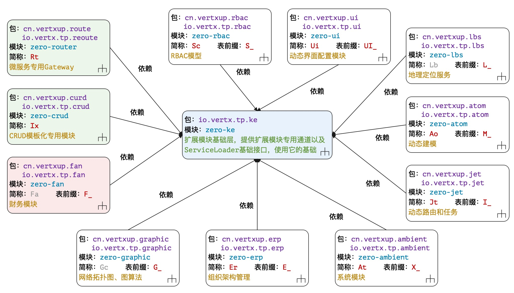
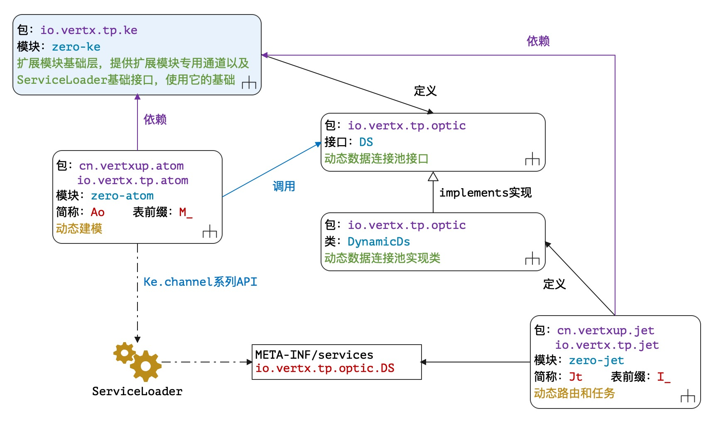
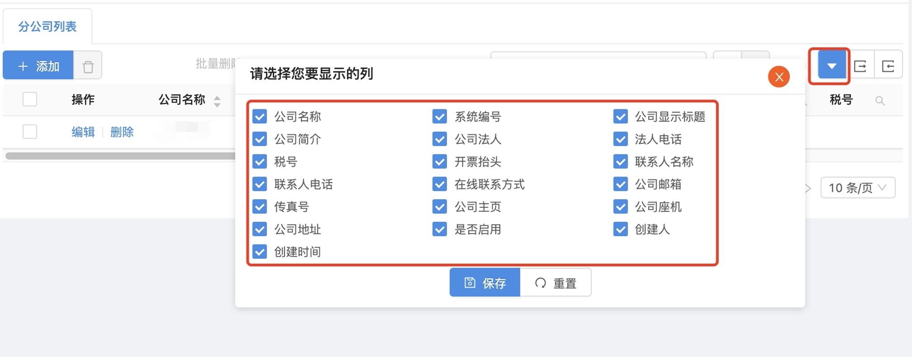
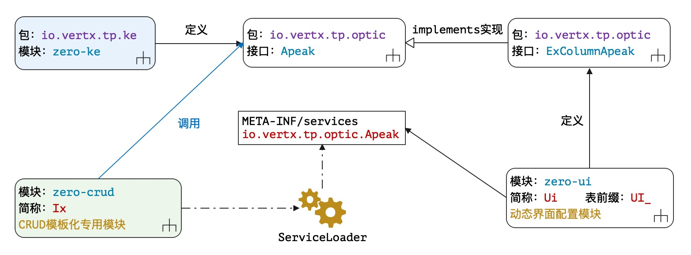

> 翩翩者鵻，载飞载下，集于苞栩。王事靡盬，不遑将父。——佚名《四牧》

* 项目地址：<https://github.com/silentbalanceyh/vertx-zero-example/>（子项目：**up-extension**）

# 「壹」背景

&ensp;&ensp;&ensp;&ensp;本章开始我们进入一个**新世界**：Zero Extension（`vertx-zero/vertx-pin`
）——Zero扩展模块，扩展模块源起于2018年产品研发初始阶段，它给读者带来的是**开箱即用**的体验，既然是开箱即用，它和原始模块有一定的区别：

1. 扩展模块的每个**业务模块**都携带了一个SQL文件，该文件会帮助你创建该模块所需的表结构。
2. 某些扩展模块附带了一部分RESTful接口，一旦引入您就可以直接使用这些接口。
3. 扩展模块内容更多是以业务为主，这种情况若您要扩展，只能提交PR等待升级版本中进行改进。

&ensp;&ensp;&ensp;&ensp;扩展模块存在的意义是帮助您开发，这种帮助是让您远离Zero和技术，只是让自己精力集中于业务系统，但是它可能会满足不了您对复杂应用的需求，但由于框架本身是可变更的，这个可以让您逐步升级，即使您不使用扩展模块，依旧可以从中学习相关思路，这也是我们的初衷——**
接触一个世界而看清这个世界，看清这个世界而看透这个世界，看透这个世界而看淡这个世界**。

## 1.1. 结构说明

&ensp;&ensp;&ensp;&ensp;整个Zero的扩展模块的完整结构如下：



&ensp;&ensp;&ensp;&ensp;这些扩展模块全部以`zero-ke`为基础，每个模块各自独立，模块和模块之前没有任何通信，两模块之间通信则使用Java中的ServiceLoader，相互之间不干涉、不影响。

|模块名|别名|表前缀|含义|
|---|---|---|:---|
|zero-ke|Ke|x|扩展模块基础层、抽象层以及共享层。|
|zero-crud|Ix|x|CRUD模板，标准化生成某个领域模型的基础15接口。|
|zero-router|Rt|x|微服务专用Gateway路由工具层。|
|zero-fan|Fa|`F_`|「保留」财务系统抽象模块，用于基础财务计算。|
|zero-graphic|Gc|`G_`|拓扑图专用表结构，描述点和线的网络图结构。|
|zero-erp|Er|`E_`|组织架构管理系统，管理企业基础组织架构。|
|zero-ambient|At|`X_`|应用、系统、模块专用，多应用配置管理结构。|
|zero-jet|Jt|`I_`|动态路由、动态接口管理。|
|zero-atom|Ao|`M_`|动态建模管理（无固定表结构）。|
|zero-lbs|Lb|`L_`|LBS地理定位服务。|
|zero-rbac|Sc|`S_`|RBAC模型，安全管理系统。|
|zero-ui|Ui|`UI_`|和前端相关的界面配置管理系统。|

> 无表前缀表示该模块不带数据表。

## 1.2. 基本规范

&ensp;&ensp;&ensp;&ensp;整个Zero Extension扩展模块中，最常用的是`zero-rbac`和`zero-crud`
，它们前者为你快速部署整个系统的基础安全环境，后者为你的新表直接部署十五个标准化的CRUD接口，这部分深入到模块内部时再详谈。本小节讲一下Zero
Extension部分的基础设计和开发规范，只要您在规范之内遵守规则，那么Zero就真让你有**零代码**的感觉了。

### 1.2.1. 表设计

1. 整个系统中所有表名、字段名都使用大写，通常格式是`<P>_<NAME>`，其中`<P>`表示模块前缀。
2. 当您在设计系统时出现了**多对多**的情况，那么表名就使用`R_`前缀，R的含义为Relation。
3. 如果存在旧系统，您可以在Jooq生成领域模型时先对接旧的表名和字段名，之后使用Zero提供的**Pojo映射层**直接对接您想要的接口数据规范，如此完成转换、迁移和升级。

&ensp;&ensp;&ensp;&ensp;表名大写是整个Zero Extension在上了几个生产环境过后做出的决定，PgSQL和MySQL可直接配置成大小写敏感，而SQL
Server是天生的大小写敏感，至于Oracle，不好意思，不支持小写——如此这般为兼容不同的主流数据库，所有的表名、字段名、以及语句中的SQL关键字全部使用大写，这种情况下，日志中出现全大写的情况您也可以第一时间知道它代表着什么，而且当您手写SQL语句时，一个Caplock键搞定。

&ensp;&ensp;&ensp;&ensp;除开上边的规则以外，Zero中还定义了部分表字段的基础命名规范：

|字段名|含义|
|---|:---|
|`KEY`|「不重复」表主键，该主键用UUID格式，通常是代理主键。|
|`CODE`|「不重复」系统编码，系统分配的唯一标识符，可做业务主键。|
|`SERIAL`|「不重复」系统编号，直接由编号系统产生，可表示订单号、账单号等。|
|`NAME`|记录名称，该名称为用户可读业务名，可称为标题，也可称为短名。|
|`TYPE`|记录所属类型，根据具体场景而定。|
|`ACTIVE`|记录锁定专用标识，为true则启用，false则禁用。|
|`SIGMA`|应用专用标识，对应到X-Sigma的自定义请求头。|
|`LANGUATE`|「保留」语言标识，对应到X-Lang的自定义请求头。|
|`METADATA`|Json格式，主要用于扩展配置处理，存储起来可针对记录特殊对待。|
|`CREATED_BY`|记录创建人。|
|`CREATED_AT`|记录创建时间。|
|`UPDATED_BY`|记录最后更新人。|
|`UPDATED_AT`|记录最后更新时间。|

> 上述字段中，`NAME, SERIAL`两个字段因业务而异，并不是所有的系统都会使用，而`CODE, TYPE`则是推荐字段，最好每张表保留，其他字段几乎是所有表都共享的字段。

&ensp;&ensp;&ensp;&ensp;上述基础表设计规范延伸到整个Zero扩展模块中，当然有人会说这个不好、有冗余、不是我想要的，Zero
Extension本身打造的就是我们目前正在使用以及可用的东西，不是为谁量身打造的系统，这些字段的通用性和命名规范全程统一，那么您就可以抛开部分设计而直接开发业务了，之所以称为扩展模块，就是您**可以选择使用也可以选择不用**
。此种设计还有一定的历史原因：

1. 主键命名为`KEY`，序列化过后会生成`key`属性，该属性对React的Jsx语法而言无缝集成，不需要做任何转换就可以实现前后端绑定，这样的设计节省了大部分接口开发的工作量；此处强调一点，Zero中的**Pojo映射层**
   可以帮助您完成字段名的映射，即使您用了ID作为系统表名，也可以在接口处直接转成`key`，但是设计**映射层**是为了兼容遗留系统，而不是为了您的特立独行，**约定**一直是Zero开发的核心。
2.

SIGMA是统一标识，其实它的存在也在某种意义上给了系统一定的开发复杂度，使得Worker组件的签名变得不是那么纯粹，但是若要实现多租户、多应用、子系统，我们引入了最笨的设计，先放一个统一标识，之后再根据该标识进行鉴别，而为了隔离也做了许多工作，比如引入`X-Sigma`
自定义头做前端隔离，以及在查询分析器上自动鉴别：当然如果是独立系统，该字段留空也可。

3. LANGUAGE是**拙劣的设计**
   ，虽然是为了多语言处理，但也是沿用的之前旧产品ITSM中的玩法，将所有的字典以及消息全部存放在一张带有LANGUAGE字段的表中，当所有的呈现界面百川归海式放到那里过后，其他所有表的LANGUAGE就不重要了，但在现阶段，一边做开源一边做项目一边做产品，只能用快而暴力的方式处理，好在前端引入了`X-Lang`
   模式，之后升级修改后端架构就可以了。
4. Auditor相关的四个字段，以前称为`CREATE_BY，CREATE_TIME, UPDATE_BY, UPDATE_TIME`
   ，为了保证这四个字段长度一致，参考ODOO老版本系统，在每张表中都引入了该四个字段，并且标准化，只是修改了名称：`CREATED_BY, CREATED_AT, UPDATED_BY, UPDATED_AT`
   ，从英文语义上也可以讲得通。
5. 应该说最自由的设计是`METADATA`
   ，该字段在数据库中存储成JSON格式，即我们为每一条数据提供了一个扩展空间，在部分前端模块中我们启用了这个扩展空间，借用之前讲过的Excel的功能把元数据导入到系统，该字段对配置数据和系统数据是一种福音，把部分**目前不可标准化**
   的设计全部暂存在该字段中，如此您就可以不担心突然来临的字段需求——当然多个版本过后做标准化是最好的。

&ensp;&ensp;&ensp;&ensp;上述历史原因导致了目前最终的表结构，这也是扩展模块的限制，若您不满足于此，要么选择提交PR修改扩展模块，要么就直接弃用也无不可，在快节奏的生活中，既要保证项目交付、又要保证开源运维、还保证产品研发，本身就是一个类似**
战时变法**的做法，我们只能保证缓慢成长不断标准，而无法保证您一用就面面俱到。

### 1.2.2. 包结构

&ensp;&ensp;&ensp;&ensp;Zero Extension部分的模块包结构几乎全面统一，思路一致，假设以`zero-rbac`模块为例：

* 项目名称：**zero-rbac**
* 包识别名：**rbac**
* 项目短名：**Sc**

&ensp;&ensp;&ensp;&ensp;包结构规范如下

> cn.vertxup您可以理解成自己的域名，可用其他代替，但若是开发新的Zero Extension扩展则依旧使用cn.vertxup而统一。

|包名|含义|
|:---|:---|
|cn.vertxup.rbac.api|RESTful接口主代码，Zero中的Worker/Agent组件。|
|cn.vertxup.rbac.domain|「Jooq生成」领域模型以及Dao。|
|cn.vertxup.rbac.ipc|「微服务」gRpc服务端和客户端代码。|
|cn.vertxup.rbac.service|业务逻辑层。|
|cn.vertxup.rbac.wall|rbac专有的@Wall的墙代码以及JSR340中Filter代码。|
|io.vertx.tp.error|自定义异常包。|
|io.vertx.tp.optic|ServiceLoader通道组件专用包。|
|io.vertx.tp.rbac.atom|自定义模型专用包。|
|io.vertx.tp.rbac.cv|专用常量包。|
|io.vertx.tp.rbac.init|初始化组件专用包，连接Zero中extension扩展初始化。|
|io.vertx.tp.rbac.refine|模块专用工具包。|
|io.vertx.tp.rbac.uca|自定义组件专用包。|

&ensp;&ensp;&ensp;&ensp;如果您开发的是Zero Extension的扩展，您可以遵循上述规范，实际上`cn.vertxup`是业务层之上的内容，而`io.vertx.tp`则是Zero专用的**第三方**
根包名，放到此处的代码或多或少带有**标准化**的含义，一旦成型几乎不会变化。若您开发的就是自己的模块，那么直接使用一个包就可以了，只要您保证您的模块包相互之间不冲突即可，如将`io.vertx.tp`前缀直接改成`cn.vertxup`。

> 还有一种办法就是直接使用黑科技
> <http://www.vertxai.cn/document/doc-web/module-aj.html#.jplugin>，
> 执行命令`aj jplugin -m xxx`为您的Maven初始化项目自动化生成插件包，只是该插件是为集成模块量身打造的，包结构和Zero Extension中的包结构还有些许差异。

&ensp;&ensp;&ensp;&ensp;除了上述提到的包规范以外，非代码部分对每个模块也存在资源目录的基本配置文件规范，所有模块的主配置文件位于如下地址：

```shell
# 如果模块名为 rbac，则配置目录位于
src/main/resources/plugin/rbac/
# 主配置文件为（该文件为固定）
src/main/resources/plugin/rbac/configuration.json
```

### 1.2.3. RESTful接口设计

&ensp;&ensp;&ensp;&ensp;在Zero Extension中严格定义了两种不同的模式的接口前缀：

* 开放模式（无认证）：`/*`
* 安全模式（带认证）：`/api/*`

&ensp;&ensp;&ensp;&ensp;由于`zero-jet`中支持动态路由，所以引入静态和动态路由过后，您可以配置动态路由前缀，该前缀存储于`X_APP`表中（`zero-ambient`），但配置文件是位于`zero-jet`
项目的配置文件中，假设您配置了两个应用：`ox`和`dr`（多应用），那么最终形成的RESTful表格如下：

|路径|含义|
|:---|:---|
|`/*`|平台无认证公共资源。|
|`/ox/*`|ox应用公共资源。|
|`/dr/*`|dr应用公共资源。|
|`/api/*`|平台带认证的安全资源、系统资源、配置资源等。|
|`/api/ox/`|ox应用安全资源。|
|`/api/dr/`|dr应用安全资源。|

&ensp;&ensp;&ensp;&ensp;上述模式下ox和dr是可配置的，所以您可以根据你自己的情况设计，当然不使用扩展模块那就是很自由的了，随意而为。

> Zero Extension更多的时候是给开发人员提供了一种无脑的设计，让您不用纠结技术选型、不用纠结某些需要您动脑筋的细节而直接上手开撸。

## 1.3. 通道架构

&ensp;&ensp;&ensp;&ensp;虽然Zero各个模块之间不存在相互依赖关系，但是`zero-ke`定义了很多接口，而底层会有调用通道来实现各个模块之间的相互调用，参考下图：



&ensp;&ensp;&ensp;&ensp;通道结构主要启用了Java中的ServiceLoader技术，如图所示：

1. `zero-ke`中定义了接口`io.vertx.tp.optic.DS`，另外两个项目`zero-atom`和`zero-jet`都依赖于`zero-ke`的基础项目。
2. `zero-jet`中提供了该接口的实现类`io.vertx.tp.optic.DynamicDs`，并且将该类配置到ServiceLoader的部署文件`META-INF/services/io.vertx.tp.optic.DS`
   中，内容如下

    ```
    io.vertx.tp.optic.DynamicDs
    ```
4. `zero-atom`不依赖`zero-jet`，但依旧可直接拿到对应的实现类对象，完全基于接口调用。

&ensp;&ensp;&ensp;&ensp;其实这种结构类似于之前提过的反转控制，如果直接调用，两个模块之间无法解耦，而讲所有的控制权递交给`zero-ke`
底层平台，那么模块和模块之间就没有必要再从Maven的pom.xml产生依赖了，至于查找类是否存在而不引起异常就是另外的话题了，最少Zero
Extension可以保证一点，如果您不加载实现类的模块，最多让下边代码产生一定的副作用，但并不会引起大规模的坍塌。

```java
    private AoDao daoD() {
        return Ke.channelSync(DS.class, () -> null, ds -> {
            /* 连接池绑定数据库 */
            final DataPool pool = ds.switchDs(this.atom.sigma());
            if (Objects.nonNull(pool)) {
                /* 返回AoDao */
                final Database database = pool.getDatabase();
                return Ao.toDao(database, this.atom);
            } else return null;
        });
    }
```

&ensp;&ensp;&ensp;&ensp;有很多人反馈，Zero代码调用层次过深，抽象层次过深，有**过度设计**的情况发生，这一点我必须得承认，毕竟这是个人作品，有时候会有我的主观思维在其中，但设计的最终原则基本是一致的：

1. 只将对象分为**调用者**和**执行者**，二者相互协作完成整个世界，调用者不包含任何逻辑代码，执行者维持极限的**单一职责**基本原则。
2. 代码文件行数限定，调用者可视情况而定，如`Ux`代码虽然超过千行，但基本一览无余；执行者代码基本不超过50行（抽象层除外）。
3. 组件化和模块化代替，如果您拆过手表，那么您就理解其实更多的时候只需要造齿轮，多与少无所谓，就像解决Puzzle难题，最终结果达到即可，所以与其说Zero调用层次深，不如说是组件粒度很细。
4. 最后一点，要将如此规模的项目代码重复率压缩在5%以下，的确也是多次重构的结果，为了不重名、为了不重复、为了名称优雅，好几次重构几乎是破坏性极大的。

&ensp;&ensp;&ensp;&ensp;**万恶的NullPointer**？这一点我必须表态，**null的合法化**一直都是业界比较有争议的问题，但是我不排斥null，它像一把双刃剑，如果您用错了可能系统中的空指针异常会铺天盖地，但若您换一种思路处理，可能就会开辟另外一个新世界。Zero的前身是Vie系统，那时候为了极端摒弃null，我走过太多弯路，比如使用类似Oval这种在AOP层执行前验逻辑，又或者使用Java8中引入的Optional，但我只能说那种模式太痛苦，治标不治本（当然有可能是我功力不够，哈哈），技术解决不了系统设计问题，而更新换代换不掉您的架构思路，您必须在系统中拥抱一些特殊值。若您无法从设计层面解决null的问题，即使引入了Optional，您依旧会在前端开发中被undefined骚扰得怀疑人生。

&ensp;&ensp;&ensp;&ensp;相信阅读到这里，我不需要再给您解释Zero Extension具体是做什么的，它就像Zero之上的标准化模块，有了它您可以快速搭建**带业务**的系统而不需要去思考您的系统有些什么元素，当然它提供的内容可能远远不够，但后期版本逐渐成长，最少您有了**芽**，也在您茫然不知所措时有了一种选择。

# 「贰」zero-ke

&ensp;&ensp;&ensp;&ensp;`ke`是`kernel`的缩写，称为Zero Extension中的**内核**，**短名**
一直是我在Zero中奉行的法则，其实软件编程过程中的命名规则考验的不是程序员的技术水平，而是英文底子。`zero-ke`作为整个扩展模块的神经中枢，它主要提供了下边几个核心功能：

1. 定义了所有模块所需的核心自定义异常。
2. 定义了所有模块可能会通用的特定数据模型。
3. 定义了所有所需要的通道接口。
4. 提供核心工具类`Ke`辅助每个模块正常运行。

&ensp;&ensp;&ensp;&ensp;该项目中有部分和rbac相关的内容，主要原因是`crud`模块和`rbac`
模块实现了解耦，由于crud是一个半自动化项目，它在执行过程中会触发数据域的部分操作而执行API的生成和注入流程，于是只能将原本rbac中的部分内容直接迁移到ke中，如此两个业务模块不用耦合在一起——但如今看来有点多余，也许后续版本中会换一种结构，那就只能未完待续了。

## 2.1. 核心数据结构

&ensp;&ensp;&ensp;&ensp;本小节讲解几种Zero Extension中需使用的核心数据结构，这些数据结构是所有模块共享的，且存在一定的运算逻辑，它们定义在`zero-ke`中。

### 2.1.1. 标准化元数据

* 类名：`io.vertx.tp.ke.atom.KMetadata`

&ensp;&ensp;&ensp;&ensp;Zero Extension模块中所有的表都包含了`metadata`的数据规范，而之前Excel中已提到`JSON:xxx`格式的字段导入时会直接从`xxx`
文件中读取对应格式的数据，而`zero-ke`中还定义了多义性格式对`metadata`属性执行标准化。

&ensp;&ensp;&ensp;&ensp;metadata若处于如下格式：

```json
{
    "__type__":"FILE",
    "__content__":{
        "path":"xxx"
    }
}
```

&ensp;&ensp;&ensp;&ensp;Zero会解析`__type__`为枚举类型`io.vertx.tp.ke.cv.em.JSource`（目前只支持文件类型），然后从`__content__`
解析内容构造最终的metadata节点，此种结构对应到类`io.vertx.tp.ke.atom.KMetadata`中。

> 该功能目前只被`X_MODULE`表使用。

&ensp;&ensp;&ensp;&ensp;除此之外，metadata还可支持其他特定的属性结构，此处枚举几个目前使用的示例。

**菜单选中状态**

```json
{
    "checkable":"布尔值，当前项是否可多选",
    "selectable": "布尔值，当前项是否可选中"
}
```

**建模属性状态**

```json
{
    "edition":"布尔值，该行数据是否可编辑",
    "deletion":"布尔值，该行数据是否可删除",
    "visible":"布尔值，建模管理中该数据是否可见（系统属性不可见）",
    "relation":"布尔值，是否可进行拓扑图计算"
}
```

&ensp;&ensp;&ensp;&ensp;这些属性是自由结构，只是一个JsonObject，所以没有任何类与之对应，但前端依旧会针对这些属性执行行数据运算。

### 2.1.2. 遗留系统切换

* 类名：`io.vertx.tp.ke.atom.KSwitcher`

&ensp;&ensp;&ensp;&ensp;这个类只有两个属性成员：

|成员名|类型|含义|
|---|---|:---|
|primary|`Class<T>`|Active主组件实现类，运行时专用。|
|secondary|`Class<T>`|StandBy备用组件实现类，可从运行时中切换。|

&ensp;&ensp;&ensp;&ensp;该类源起于CMDB 1.0平台往2.0升级的过渡升级阶段，在该阶段中由于CMDB 1.0优先于产品而存在，于是在访问数据源时创造了这种轻量级结构，通常会使用一份类似下边的配置：

```json
{
    "switcher": {
        "secondary": "cob.output.CmdbV1Service",
        "primary": "cob.output.CmdbV2Service"
    }
}
```

&ensp;&ensp;&ensp;&ensp;正式运行时会使用`primary`中的组件，而`secondary`作为备用组件而存在，如果`primary`运行出现问题时，系统会重新路由到`secondary`
，等最终版本一被移除后，就可以删掉`secondary`配置，于是开发过程中既不影响原始系统运行、也不会影响信息的开发进度。

> Zero诞生于实战项目，有部分代码是对项目进度的让步。

### 2.1.3. 凭证数据

* 类名：`io.vertx.tp.ke.atom.KCredential`

&ensp;&ensp;&ensp;&ensp;该数据主要提供给凭证通道`Credential`使用，它包含了整个应用环境中的凭证相关信息。

|属性名|含义|
|:---|:---|
|appId|应用程序ID，对应自定义头`X-App-Id`。|
|sigma|统一标识符，对应自定义头`X-Sigma`。|
|language|绑定语言信息，对应自定义头`X-Lang`「最新版支持」|
|realm|OAuth认证中的域，该域目前和应用名称（`X_APP`中`NAME`）保持一致。|
|grantType|授权类型，目前版本多为`authorization_code`。|

> 最后遗留了建模部分的核心数据结构，这个在对应章节再来讲解，以至于读者不显得那么空旷。

## 2.2. 通道定义

&ensp;&ensp;&ensp;&ensp;前文提到了通道架构，那么本节给您介绍`zero-ke`中定义的所有通道以及这些通道的使用场景，让您对底层调用通道有更深入的认识，讲解时候按场景展示。

### 2.2.1. 列计算

&ensp;&ensp;&ensp;&ensp;`Zero UI`中的列表包含了一个复杂功能：**列定义和我的列选择**，您可以为自己创建个人的视图，功能截图如下：



&ensp;&ensp;&ensp;&ensp;该功能实现的难点在于：

1. 列读取的数据源分两种：
    1. `zero-ui`中提供了动态列定义，列数量可更改（存储于`UI_COLUMN`中）。
    2. `zero-ui`中提供了静态列定义，列不可增删（`ui/column/`配置目录）。
2. 在保存列定义时，实际系统为用户修改了个人默认视图，这个更改直接关联权限系统，功能由`zero-rbac`模块提供。
3. 这三个接口属于标准化的十五个接口，而标准化接口定义在`zero-crud`中。

&ensp;&ensp;&ensp;&ensp;所以列计算通道就必须跨这个三个项目来完成其设计，参考下边表格：

> 被调用者必须包含`META-INF/services/<interface>`文件启动ServiceLoader。

|项目名|类型|角色|
|---|:---|:---|
|zero-crud|io.vertx.tp.optic.Apeak|调用者|
|zero-ui|io.vertx.tp.optic.ExAmbientApeak|被调用者|
|zero-crud|io.vertx.tp.optic.ApeakMy|调用者|
|zero-rbac|io.vertx.tp.optic.ExAmbientApeakMy|被调用者|

#### Apeak

* io.vertx.tp.optic.Apeak

> Apeak含义为：垂直、竖直。

&ensp;&ensp;&ensp;&ensp;Apeak接口用于读取模型**可选列**，可选列的计算公式如下：

```shell
接口：GET /api/columns/<model>/full
可选列 = 模型所有列 - 上述接口权限控制
```

&ensp;&ensp;&ensp;&ensp;它的定义如下：

```java
public interface Apeak {
    
    String ARG0 = KName.DYNAMIC;
    String ARG1 = KName.IDENTIFIER;
    String ARG2 = KName.SIGMA;
    String ARG3 = KName.VIEW;

    Apeak on(UxJooq jooq);
    Future<JsonArray> fetchFull(JsonObject config);
}
```

&ensp;&ensp;&ensp;&ensp;读取全列的四个核心参数如下：

|变量名|Json属性|含义|
|---:|:---|:---|
|ARG0|dynamic|布尔类型，是否启动动态列读取，鉴别从表读还是从文件读。|
|ARG1|identifier|模型统一标识符。|
|ARG2|sigma|X-Sigma值，应用统一标识符。|
|ARG3|view|视图名称，无名称则使用`DEFAULT`默认视图名。|

&ensp;&ensp;&ensp;&ensp;格式示例：

```json
{
    "dynamic": false,
    "identifier": "xxxx",
    "sigma": "xxxx",
    "view": "DEFAULT"
}
```

&ensp;&ensp;&ensp;&ensp;最终结构如下：



#### ApeakMy

* io.vertx.tp.optic.ApeakMy

&ensp;&ensp;&ensp;&ensp;ApeakMy提供了两个功能：读取**我选择的列**以及**保存选择结果**，我的列的计算公式很简单，直接通过列表读取视图中的列信息即可。

```shell
接口：GET /api/columns/<model>/my # 读取我的列
接口：PUT /api/columns/<model>/my # 保存我选择的列
```

&ensp;&ensp;&ensp;&ensp;它的定义如下：

```java
public interface ApeakMy {

    String ARG0 = KName.RESOURCE_ID;
    String ARG1 = KName.USER;
    String ARG2 = KName.VIEW;
    String ARG3 = KName.HABITUS;
    String ARG4 = KName.DATA_KEY;

    ApeakMy on(UxJooq jooq);

    Future<JsonArray> fetchMy(JsonObject params);

    Future<JsonArray> saveMy(JsonObject params, JsonArray projection);
}
```

&ensp;&ensp;&ensp;&ensp;读取我选择的列的五个核心参数如下：

|变量名|Json属性|含义|
|---:|:---|:---|
|ARG0|resourceId|读取的视图关联资源ID，和安全操作绑定。|
|ARG1|user|从Token中提取用户主键专用。|
|ARG2|view|视图名称，无名称则使用`DEFAULT`默认视图名。|
|ARG3|habitus|从Session中读取个人登录信息。|
|ARG4|dataKey|数据键，启用复杂资源视图查询时专用。|

&ensp;&ensp;&ensp;&ensp;格式示例：

```json
{
    "sigma": "xxx",
    "resourceId": "xxx",
    "view": "DEFAULT",
    "dataKey": "xxx",
    "principle": {
        "jwt": "token"
    }
}
```

&ensp;&ensp;&ensp;&ensp;此处的`jwt`被解码过后会生成格式：

```json
{
    "user": "用户登录主键"
}
```

&ensp;&ensp;&ensp;&ensp;最终结构如下：


> 参考本章节提供的图，后边讲解通道就不提供结构图了，只提供表格统计结果，也不占无谓的篇幅。

### 2.2.2. 凭证提取

* io.vertx.tp.optic.Credential

&ensp;&ensp;&ensp;&ensp;凭证提取通道很简单，它主要用于导入账号和创建账号时生成默认`O_USER`表中记录专用，在创建`O_USER`时，对应的`sigma, language, grantType，...`
等信息都是配置在`X_APP`中的，所以此处提取凭证时必须跨模块提取。

|项目名|类型|角色|
|---|:---|:---|
|zero-rbac|io.vertx.tp.optic.Credential|调用者|
|zero-jet|io.vertx.tp.optic.ExAmbientCredit|被调用者|

&ensp;&ensp;&ensp;&ensp;凭证提取最终会返回前文提到的KCredential类型，该类型数据的消费代码段如下：

```java
final List<OUser> ousers = new ArrayList<>();
users.stream().map(
    user -> new OUser()
            // 此处 credential 类型为 KCredential
            .setScope(credential.getRealm())
            .setLanguage(credential.getLanguage())
            .setGrantType(credential.getGrantType())
)
```

### 2.2.3. 动态数据源

* io.vertx.tp.optic.DS

> DS是Data Source的简写

&ensp;&ensp;&ensp;&ensp;动态数据源接口属于使用频率比较高的接口，它和`zero-ambient`项目中的表`X_SOURCE`定义相对应，用来定义除开Zero之外的第三方数据库，该数据库一般用于**动态建模**部分。

|项目名|类型|角色|
|---|:---|:---|
|zero-crud|io.vertx.tp.optic.DS|调用者|
|zero-atom|io.vertx.tp.optic.DS|调用者|
|zero-jet|io.vertx.tp.optic.DynamicDs|被调用者|

&ensp;&ensp;&ensp;&ensp;动态数据源的调用不仅仅存在于Zero Extension的其他子模块，在实际使用过程中我们通常也会使用该通道获取动态数据源，它属于**高频被调用对象**。

### 2.2.4. URI还原

* io.vertx.tp.optic.Orbit

> Orbit含义为：轨迹、踪迹

&ensp;&ensp;&ensp;&ensp;URI还原接口`io.vertx.tp.optic.Orbit`是Zero
Extension中的必备接口，主要针对带路径参数的情况，比如您在系统中发送了一个请求：`/api/user/lang`，该请求可能会被还原成`/api/:actor/:name`：

* 此处`actor`是`zero-crud`标准化过后用于标识模块的参数。
* `name`是路径上本来就附带的参数。

&ensp;&ensp;&ensp;&ensp;在这种场景下，其实这个接口的意义在于`/api/user/:name`，因为它才是具有**业务意义**
的接口，于是若您要使用RBAC执行鉴权，就必须将路径还原到`/api/user/:name`路径，而不是使用容器中的`/api/:actor/:name`路径。先参考下图：


&ensp;&ensp;&ensp;&ensp;如果直接使用Zero容器中的还原，那么上述绿色部分属于编程模式，比如您写了：

```java
@Path("/api")
public interface UserAgent{

    @Path("/user/:name")
    public JsonObject fetchUser(@PathParam("name") String name);
}
```

&ensp;&ensp;&ensp;&ensp;在这种模式下，Zero容器本身就可以针对该请求进行路径还原：

|还原之前|还原之后（可鉴权路径）|
|:---|:---|
|/api/user/lang|/api/user/:name|

&ensp;&ensp;&ensp;&ensp;但是若您使用了`zero-crud`，那么上述代码就不存在了，也就是说您需要执行一个还原过后的反向操作（**表格中的修正**）：

|还原之前|修正（可鉴权路径）|还原之后|
|:---|:---|:---|
|/api/user/lang|/api/user/:name|/api/:actor/:name|

&ensp;&ensp;&ensp;&ensp;如上表格所示，您的路径若采用上边一样的方式会被还原成`/api/:actor/:name`，而真正可鉴权路径是`/api/user/:name`，于是您需要一个通道来处理它。

|项目名|类型|角色|
|---|:---|:---|
|zero-rbac|io.vertx.tp.optic.Orbit|调用者|
|zero-crud|io.vertx.tp.optic.ExActorOrbit|被调用者|

&ensp;&ensp;&ensp;&ensp;细心的读者会发现，此处提供实现类的项目就是`zero-crud`，对的，因为上述讲的所有情况只有在启用`zero-crud`
时会发生，这个接口处理的完全是定向问题，若不使用`zero-crud`，那么直接走表格一种的路径还原，还原结果就可以直接鉴权了。Orbit的代码定义如下：

```java
public interface Orbit {

    String ARG0 = KName.URI;
    String ARG1 = KName.URI_REQUEST;

    String analyze(JsonObject arguments);
}
```

&ensp;&ensp;&ensp;&ensp;此处两个核心参数如下：

|变量名|Json属性|含义|
|---:|:---|:---|
|ARG0|uri|实际请求路径。|
|ARG1|requestUri|被Zero容器还原的路径。|

> 引起问题的源头是zero-crud的`:actor`参数，所以它自己处理也可以读取配置来提供定义参数，而此处这两个参数足够了。

### 2.2.5. 资源提取器

* io.vertx.tp.optic.Seeker

> Seeker含义为：搜寻者

&ensp;&ensp;&ensp;&ensp;资源提取器是通过请求的基本参数去提取安全资源的过程。

|项目名|类型|角色|
|---|:---|:---|
|zero-crud|io.vertx.tp.optic.Seeker|调用者|
|zero-rbac|io.vertx.tp.optic.ExIntimitySeeker|被调用者|

&ensp;&ensp;&ensp;&ensp;该接口的定义如下：

```java
public interface Seeker {

    String ARG0 = KName.URI;
    String ARG1 = KName.METHOD;
    String ARG2 = KName.SIGMA;

    Seeker on(UxJooq jooq);

    Future<JsonObject> fetchImpact(JsonObject params);
}
```

&ensp;&ensp;&ensp;&ensp;此处三个核心参数如下：

|变量名|Json属性|含义|
|---:|:---|:---|
|ARG0|uri|请求路径。|
|ARG1|method|HTTP请求方法。|
|ARG2|sigma|统一标识符。|

&ensp;&ensp;&ensp;&ensp;也许您会困惑，这个通道的调用链和前边Orbit的调用链刚好相反，是不是会产生**循环依赖**
，这也是在设计中引入了ServiceLoader的好处，它的依赖是软性的，而且是运行时的，这种情况下，不仅不会出现循环依赖，而且还会正常调用，那么使用它的好处就立竿见影了。

### 2.2.6. 删除备份

* io.vertx.tp.optic.Trash

> Trash含义为：回收站

&ensp;&ensp;&ensp;&ensp;删除备份是一个大功能，但Zero Extension并没有提供相关实现，它根据您自己的系统来设计，只提供接口，可以帮助你很方便启用`orbit`配置的历史数据库，所以在Zero
Extension中没有被调用者。

|项目名|类型|角色|
|---|:---|:---|
|zero-crud|io.vertx.tp.optic.Trash|调用者|
|zero-erp|io.vertx.tp.optic.Trash|调用者|
|zero-rbac|io.vertx.tp.optic.Trash|调用者|

### 2.2.7. 应用配置

* io.vertx.tp.optic.business.ExApp

&ensp;&ensp;&ensp;&ensp;该接口用于读取应用配置数据，除开`X_APP`中定义的数据以外，您还可以根据自己的需求提供其他应用配置的数据扩展。

|项目名|类型|角色|
|---|:---|:---|
|zero-ambient|io.vertx.tp.optic.business.ExApp|调用者|

### 2.2.8. 组织架构

* io.vertx.tp.optic.business.ExCompany
* io.vertx.tp.optic.business.ExEmployee

&ensp;&ensp;&ensp;&ensp;这两个接口一个用于读取公司数据，一个用于读取员工数据，会直接读取`E_COMPANY`以及`E_EMPLOYEE`两张表的信息。

|项目名|类型|角色|
|---|:---|:---|
|zero-rbac|io.vertx.tp.optic.business.ExEmployee|调用者|
|zero-erp|io.vertx.tp.optic.business.ExEmployeeEpic|被调用者|
|zero-erp|io.vertx.tp.optic.business.ExCompanyEpic|被调用者|

&ensp;&ensp;&ensp;&ensp;Zero Extension中账号登录过后会读取员工数据信息，而员工数据本身是可扩展的，此处`zero-rbac`调用了该接口，就是直接读取了`zero-erp`
中的员工数据，若您想提供自己的组织架构信息，就禁用`zero-erp`然后提供该接口的实现再附加ServiceLoader配置即可。

### 2.2.9. 模型读取

* io.vertx.tp.optic.business.ExModel

&ensp;&ensp;&ensp;&ensp;该接口是特殊接口，它的调用者如下：

|项目名|类型|角色|
|---|:---|:---|
|zero-ambient|io.vertx.tp.optic.business.ExModel|调用者|
|zero-rbac|io.vertx.tp.optic.business.ExModel|调用者|

&ensp;&ensp;&ensp;&ensp;该接口主要用于抓取动态建模过程中的**模型**和**属性**相关信息。

### 2.2.10. 路由表

* io.vertx.tp.optic.business.ExRoute

&ensp;&ensp;&ensp;&ensp;路由表接口主要用于读取目前容器中所有的路由数据，而数据来源有两个：

* `zero-jet`提供了动态路由数据`I_API`中的定义。
* Zero Framework则提供了静态路由数据，直接通过class扫描。

|项目名|类型|角色|
|---|:---|:---|
|zero-rbac|io.vertx.tp.optic.business.ExRoute|调用者|
|zero-jet|io.vertx.tp.optic.business.ExRouteApi|被调用者|

### 2.2.11. 序号生成器

* io.vertx.tp.optic.business.ExSerial

&ensp;&ensp;&ensp;&ensp;序号生成器让您根据`X_NUMBER`中的序号定义生成不同格式的序号，序号主要分为下边几部分：

1. 时间戳
2. 前缀
3. 后缀
4. 种子值（长度/宽度/填充符）
5. 自增长段（步长/递增/递减）

|项目名|类型|角色|
|---|:---|:---|
|zero-rbac|io.vertx.tp.optic.business.ExSerial|调用者|
|zero-erp|io.vertx.tp.optic.business.ExSerial|调用者|
|zero-ambient|io.vertx.tp.optic.business.ExSerialEpic|被调用者|

### 2.2.12. 待办读取器

* io.vertx.tp.optic.business.ExTodo

&ensp;&ensp;&ensp;&ensp;待办工单处理专用接口，不提供实现类，直接被本项目调用。

|项目名|类型|角色|
|---|:---|:---|
|zero-ambient|io.vertx.tp.optic.business.ExTodo|调用者|

&ensp;&ensp;&ensp;&ensp;待办分为两部分内容：

1. 基础部分，定义在`X_TODO`表中，由`zero-ambient`维护。
2. 扩展部分，您自己提供额外定义。

&ensp;&ensp;&ensp;&ensp;该接口主要用来对待办工单进行创建、查询、更新、状态迁移等操作。

### 2.2.13. 账号关联（子表）

* io.vertx.tp.optic.business.ExUser

|项目名|类型|角色|
|---|:---|:---|
|zero-erp|io.vertx.tp.optic.business.ExUser|调用者|
|zero-rbac|io.vertx.tp.optic.business.ExUserEpic|被调用者|

&ensp;&ensp;&ensp;&ensp;Zero Extension中有两个特殊字段：

|属性名|字段名|含义|
|:---|:---|:---|
|modelId|`MODEL_ID`|模型标识符。|
|modelKey|`MODEL_KEY`|模型记录主键。|

&ensp;&ensp;&ensp;&ensp;但凡带有上述两个字段的表就证明该表可能会存在子表，而`ExModel`就用于读取子表的相关数据来完成连接过程，此处用一个图解释读者更容易明白：


&ensp;&ensp;&ensp;&ensp;子表多态性在系统中虽然不常见也不推荐，但无法避免，如果使用上述接口，您就可以提供自己的子表接口实现类，按照您的业务逻辑来读取子表信息以及如何执行连接。

### 2.2.14. 汇总

&ensp;&ensp;&ensp;&ensp;到此，`zero-ke`中所有的通道就介绍完毕了，汇总一下Zero Extension中的通道相关内容：

1. 通道目前都是只支持`1:1`的结构，即被调用者只能提供单个实现，不能一个接口多个实现。——根据这一段您可以打开`zero-ke`的源代码查找接口实现类，只有一个类的基本是通道无疑。
2. 通道实现项目中必须加入ServiceLoader的基本规范：`META-INF/services/<interfact>`文件。
3. 通道的存在本身使得Zero Extension中的结构完全成立，而且实现类必须没有任何副作用：即使找不到实现类也不影响原始流程。

## 2.3. 常用工具

* io.vertx.tp.ke.refine.Ke

&ensp;&ensp;&ensp;&ensp;Ke类是`zero-ke`的核心工具类，它主要提供了在开发过程中常用的系列方法，本小节不介绍所有的方法，仅针对常用系列方法进行介绍。

### 2.3.1. channel系

&ensp;&ensp;&ensp;&ensp;前一个小结提到了Zero Extension中定义的通道相关信息，借用Ke的channel系API，您可以十分方便执行通道函数。

```java
// 同步执行：
public static <T, O> O channelSync(
    final Class<T> clazz, 
    final Supplier<O> supplier,
    final Function<T, O> executor)
```

&ensp;&ensp;&ensp;&ensp;该方法有三个参数：

|参数|含义|
|:---|:---|
|clazz|前文提到的接口类名（注意是接口，不是实现类）。|
|supplier|默认返回值函数。|
|executor|根据获取的通道对象实例处理结果后返回最终数据的函数。|

&ensp;&ensp;&ensp;&ensp;异步模式只是同步的变种，签名如下：

```java
// 异步执行，注意第二参数
public static <T, O> Future<O> channel(
    final Class<T> clazz, 
    final Supplier<O> supplier,
    final Function<T, Future<O>> executor)
public static <T, O> Future<O> channelAsync(
    final Class<T> clazz, 
    final Supplier<Future<O>> supplier,
    final Function<T, Future<O>> executor)
```

&ensp;&ensp;&ensp;&ensp;最后提供几段调用参考代码：

```java
    // 1
    @Override
    public Future<JsonArray> fetchModels(final String sigma) {
        return Ke.channel(ExModel.class, JsonArray::new,
                model -> model.fetchAsync(sigma));
    }
    // 2
    final JsonObject params = new JsonObject();
    params.put(KName.TYPE, ChangeFlag.ADD.name());
    params.put(KName.SIGMA, this.atom.sigma());
    return Ke.channel(ExTodo.class, () -> twins, 
        channel -> channel.valveAsync(twins, params));
```

### 2.3.2. key系

&ensp;&ensp;&ensp;&ensp;key系方法和RBAC安全模型有关，主要用于读写安全数据。

**注意**：这个系列API读取数据源头不在数据库，而是会话和缓存中，属于运行时读取，也依赖SharedData数据结构。

```java
// 生成session键的专用方法
// 格式：session-<method>:<uri>
public static String keySession(final String method, final String uri)
// 生成授权键的专用方法
// 认证只发生一次，一旦认证后在某个时间内认证结果会保存在缓存中以防止多次认证问题
// 格式：authorized-<method>:<uri>
public static String keyAuthorized(final String method, final String uri)

// Habitus是Zero为会话系统量身打造的设计，它封装了原始的Session以及替换
// 过后的RedisSession，通过使用统一的会话管理来完成单点和分布式的多重操作
// habitus数据会被加密到jwt的令牌中，而且遵循一定格式，简单说某个账号登陆
// 过后其会话的一致性就依靠它来完成
public static String keyHabitus(final Envelop envelop)

// 读取用户主键，从Envelop的User对象中提取用户主键
public static String keyUser(final Envelop envelop)
public static String keyUser(final User user)
```

&ensp;&ensp;&ensp;&ensp;User接口principle()会读取存储的附加数据信息，该信息格式如下：

```json
{
    "jwt": "tokenString"
}
```

&ensp;&ensp;&ensp;&ensp;此处`tokenString`被JWT解码后的结构如：

```json
{
    "user": "登陆用户主键",
    "habitus": "用户登录的会话加密数据"
}
```

# 「叁」小结

&ensp;&ensp;&ensp;&ensp;本章主要讲解Zero Extension是什么以及包含了哪些模块和相关功能，后半部分为您介绍了`zero-ke`项目中的通道架构，而`zero-ke`是所有子模块学习的基础，有了这些知识背景后，我们就可以正式扬帆起航。


