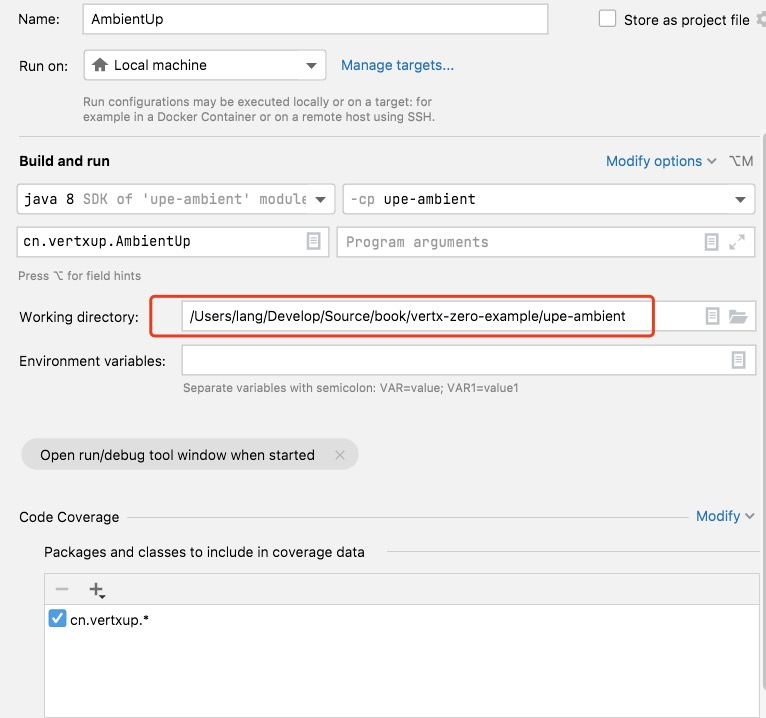
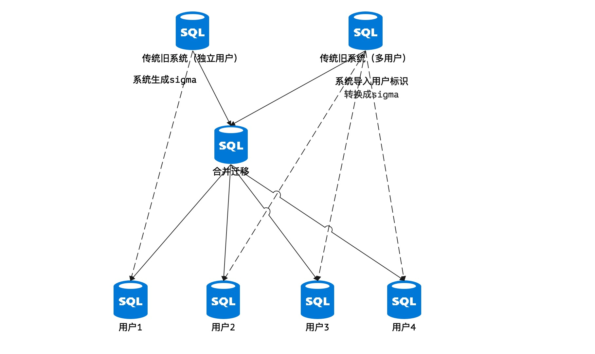
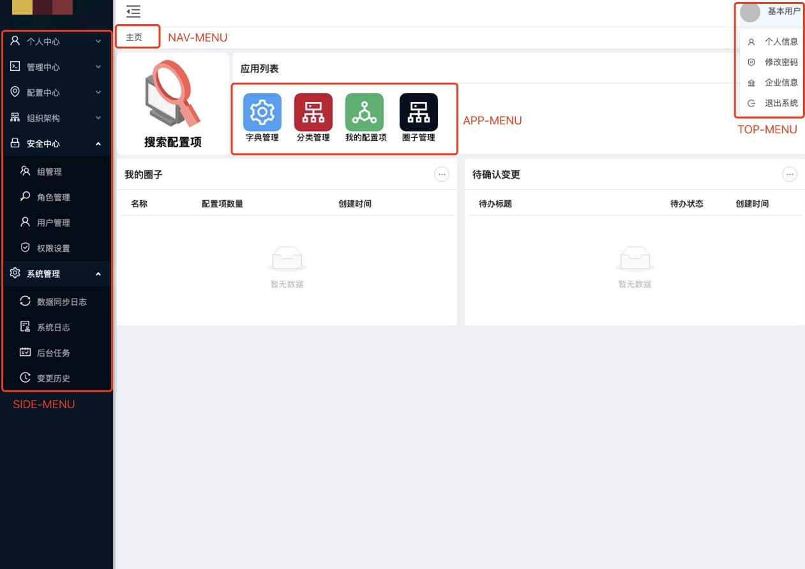
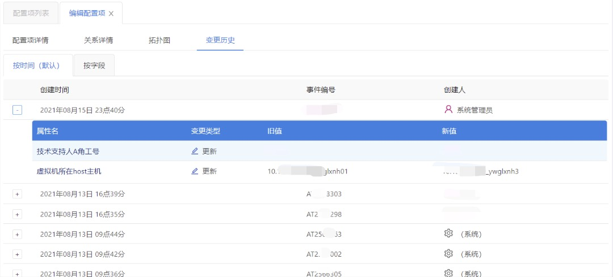
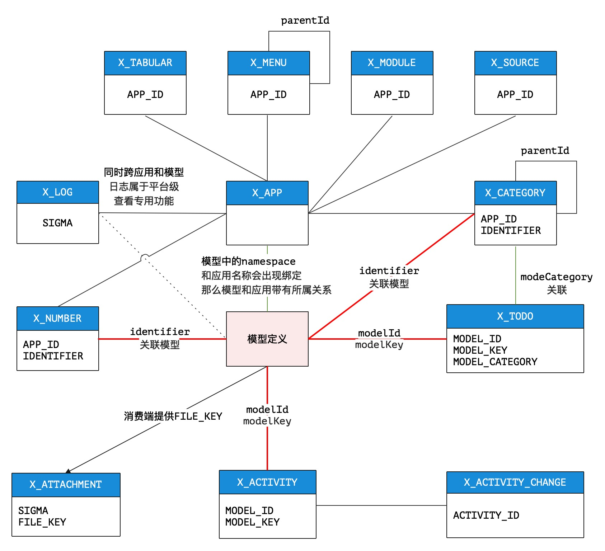

> 冰盘夏荐碧实脆，斥去不御惭其花。——韩愈《李花二首》

* 项目地址：<https://github.com/silentbalanceyh/vertx-zero-example/>（子项目：**upe-ambient**）

项目名：**zero-ambient**

|表前缀|业务名|缩略名|主配置|
|---|---|---|---|
|`X_`|ambient|At|plugin/ambient/configuration.json|

日志文件logback.xml：

```xml
    <include resource="plugin/annal/zero-module-ambient.xml"/>
```

# 「壹」初探

&ensp;&ensp;&ensp;&ensp;本文开始我们进入第一个扩展模块`zero-ambient`，该扩展模块用来定义系统级数据，从结构上讲也属于和`zero-ke`一样偏底层。

## 1.1. 初始化库

&ensp;&ensp;&ensp;&ensp;第一次使用Zero Extension扩展模块，先讲讲Zero Extension的基本环境搭建流程，以`up-extension`
为例。由于Zero扩展模块中部分模块携带了表结构，所以仅仅依靠在Maven中引入该依赖是远远不够的，于是才有了本章节的基础教程。

&ensp;&ensp;&ensp;&ensp;**第一步**：先在Maven的`pom.xml`文件中引入该子项目：

```xml
    <dependency>
        <groupId>cn.vertxup</groupId>
        <artifactId>zero-ambient</artifactId>
    </dependency>
```

&ensp;&ensp;&ensp;&ensp;然后配置linquibase插件：

```xml
    <build>
        <plugins>
            <plugin>
                <groupId>org.liquibase</groupId>
                <artifactId>liquibase-maven-plugin</artifactId>
                <configuration>
                    <!-- 配置文件路径 -->
                    <propertyFile>${basedir}/src/main/resources/init/liquibase.properties</propertyFile>
                    <changeLogFile>${basedir}/src/main/resources/init/database.yml</changeLogFile>
                    <!-- 配置参数 -->
                    <promptOnNonLocalDatabase>false</promptOnNonLocalDatabase>
                    <outputFileEncoding>UTF-8</outputFileEncoding>
                </configuration>
            </plugin>
        </plugins>
    </build>
```

&ensp;&ensp;&ensp;&ensp;**第二步**：执行下边SQL语句创建`DB_EXTENSION`数据库（**无副作用，MySQL中可反复执行该脚本**）：

```sql
-- 文件名：database-reinit.sql
SET NAMES utf8mb4;
SET FOREIGN_KEY_CHECKS = 0;
-- 删除原来的数据库
DROP DATABASE IF EXISTS DB_EXTENSION;
CREATE DATABASE IF NOT EXISTS DB_EXTENSION DEFAULT CHARSET utf8mb4 COLLATE utf8mb4_bin;
```

&ensp;&ensp;&ensp;&ensp; 关于初始化库您可以直接使用mysql命令写一个shell脚本，每次都可以直接初始化库环境。

```shell
# MacOS, 文件名：database-reinit.sh
#!/usr/bin/env bash
/usr/local/mysql/bin/mysql -u root -P 3306 -h 127.0.0.1 -p < database-reinit.sql
# Windows，文件名：database-reinit.bat
mysql -u root -P 3306 -h 127.0.0.1 -p < database-reinit.sql
```

&ensp;&ensp;&ensp;&ensp; 这三个脚本您可直接使用（**注意修改库名和账号密码**）。


&ensp;&ensp;&ensp;&ensp;**第三步**：由于您在Maven配置中配置了`init/liquibase.properties`以及`init/database.yml`，所以需要创建这两个文件，内容如下：

**liquibase.properties**

> ox.engine.cn您可直接使用IP地址，我们环境中是配置了hosts文件。

```properties
url=jdbc:mysql://ox.engine.cn:3306/DB_EXTENSION
driver=com.mysql.cj.jdbc.Driver
username=root
password=********
```

**database.yml**

```yaml
databaseChangeLog:
  - include:
      # 该文件不同的zero子项目其文件名不同，您可以根据引入的子项目修改
      file: plugin/sql/ambient.yml
      relativeToChangelogFile: false
```

&ensp;&ensp;&ensp;&ensp;**第四步**，执行下边命令直接初始化`DB_EXTENSION`库：

```shell
# 项目根目录执行
mvn liquibase:update
```

&ensp;&ensp;&ensp;&ensp;命令执行完后，您可以检查数据库中的表是否生成，如果生成那么库的初始化就成功了。


&ensp;&ensp;&ensp;&ensp;**注意**
，此处我们使用了liquibase工具，该工具已经集成在Zero框架中了，有了它您可以十分方便地执行库重置、库修改和初始化，相关配置可参考liquibase的官方文档，此处不做详细说明。

## 1.2. 应用配置

### 1.2.1. Zero配置

&ensp;&ensp;&ensp;&ensp;完成库的初始化后，您需要在您的应用中添加Zero的配置文件。

|文件名|含义|
|:---|:---|
|vertx.yml|Zero打开lime的主配置文件。|
|vertx-inject.yml|打开Jooq插件的专用配置文件。|
|vertx-extension.yml|Jooq数据库配置以及初始化生命周期专用配置。|

**vertx.yml**

```yaml
zero:
    lime: extension
    vertx:
        instance:
            -   name: extension-up
                options:
                    maxEventLoopExecuteTime: 300_000_000_000
                    maxWorkerExecuteTime: 1200_000_000_000
```

**vertx-inject.yml**

```yaml
jooq: io.vertx.tp.plugin.jooq.JooqInfix
```

**vertx-extension.yml**

```yaml
# 数据库
jooq:
    provider:
        driverClassName: "com.mysql.cj.jdbc.Driver"
        username: root
        password: "********"
        hostname: "ox.engine.cn"
        instance: DB_EXTENSION
        jdbcUrl: "jdbc:mysql://ox.engine.cn:3306/DB_EXTENSION"
# 初始化
init:
  - component: io.vertx.tp.ambient.init.AtPin
```

### 1.2.2. Zero Extension配置

&ensp;&ensp;&ensp;&ensp;完成了Zero框架配置后，追加一个Zero Extension的模块配置（每个模块路径不一致）：`plugin/ambient/configuration.json`

```json
{
    "supportSource": false,
    "initializer": "io.vertx.tp.optic.ambient.ApplicationInitializer",
    "prerequisite": "cn.originx.uca.ambient.ApplicationPrerequisite",
    "loader": "cn.originx.uca.ambient.DataLoader",
    "dataFolder": "init/oob/",
    "fileStorage": "FILE",
    "fileLanguage": "cn"
}
```

> 关于该扩展模块的所有配置将在第二大章节详细说明，您也可以置空。

## 1.3. 启动测试

&ensp;&ensp;&ensp;&ensp;在您的目录中创建启动类：

```java
// 推荐包名，您可以自定义
package cn.vertxup;

import io.vertx.up.VertxApplication;
import io.vertx.up.annotations.Up;

@Up
public class AmbientUp {
    public static void main(final String[] args) {
        VertxApplication.run(ExtensionUp.class);
    }
}
```

&ensp;&ensp;&ensp;&ensp;如果使用了IDEA，则编辑一个启动配置，主要是注意**Working directory**：



&ensp;&ensp;&ensp;&ensp;最终您会看到模块启动界面如下：


&ensp;&ensp;&ensp;&ensp;模块日志和Zero日志在Console中会有不同前缀，所以您很容易查看不同模块的日志信息（**希腊文标识**），最终启动成功后和Zero启动的消息一样。

# 「贰」功能综述

> 所有功能以0.6.x和0.7.x版本为主，后续升级会直接更新GitBook文章而不再更新公众号。

&ensp;&ensp;&ensp;&ensp;Ambient项目最初设计为**环境配置**专用数据，本文主要介绍它的核心功能点一级设计初衷，让您可一览全貌。

## 2.1. 多租户、多应用、多语言

### 多租户

&ensp;&ensp;&ensp;&ensp;在Zero Extension中，**未来**租户信息会有专程的**平台管理**
功能模块来执行管理，并且为每个租户分配独立的环境（包括独立数据库、独立容器、独立应用等），而目前的版本使用的是**最傻的设计**，仅从数据层面将租户进行**字段**分离。系统为每个租户分配一个唯一的`sigma`值，该值在`X_APP`
表中直接定义。这种设计还有一个初衷是很多遗留系统采用了目前这种设计，在我们考察的很多中小型旧项目中，这种设计的比例占了大概40%左右，傻归傻，能运行才是最主要的，为了将这些系统的内容可顺利迁移到Zero中，目前就沿用了这种傻设计。

### 多应用

&ensp;&ensp;&ensp;&ensp;`X_APP`表中定义了两个应用的唯一标识：

1. `KEY`：应用主键，对应`X-App-Id`。
2. `APP_KEY`：敏感应用主键，对应`X-App-Key`。

&ensp;&ensp;&ensp;&ensp;这两个字段的配置数据最终会渗透到很多和应用相关的各个模块中，如果目前该模块没有`APP_ID`与之对应，那么以租户（`sigma`）为中心实现其数据隔离。

### 多语言

&ensp;&ensp;&ensp;&ensp;Zero Extension有专程的`zero-ui`项目主管界面配置，目前所有呈现在界面的文字中，有75%左右是经过`zero-ui`做的转译，并且关联到了`X-Lang`
的自定义文件头中，而这些资源文件在前端界面中会有专用的`cab`包与之绑定，最终会通过`zero-ui`完成完整的界面语言动态转换。

### 目前设计

&ensp;&ensp;&ensp;&ensp;目前在`X_APP`中产生的隔离字段都是仓促应付项目而产生，甲方也只是一个**单租户单应用中文**
环境，真正要解决该问题不是依赖应用这一层，应用只提供功能、配置和数据，最终要依靠环境搭建和部署运维相结合来完成这三种实质性的分离。Zero的微服务最初就是奔着K8S去的，这也是为什么在Zero中微服务部分后端配置全部依赖etcd和ConfigMap的原因，理想状况下，开发人员不用关心如何实现多租户、多语言、多应用部分，只需考虑业务代码即可，但Ambient作为平台的中枢，需要将部分数据执行持久化才能从某种意义上往最终的理想状态过渡。

&ensp;&ensp;&ensp;&ensp;Zero针对这三个维度做了一个折中和过渡性设计，整体演进图如下（多语言、多应用思路一致）：


&ensp;&ensp;&ensp;&ensp;Zero对这三个维度做了比较折中的设计，最初就是为了解决一些实战过程中的问题，可以说**理想很丰满，现实却永远扑所迷离**，于是Zero的Ambient模块做了两层考虑：

1. 对于某些中小型客户，企业架构本身比较落后，无法直接做整体迁移（不可能推翻重来），提供一个过渡版本让它可以先把业务跑起来（主要是成本比较低端的）。
2. 对于成熟型客户，直接上最终分库的云端架构是最好的选择。

&ensp;&ensp;&ensp;&ensp;Zero两种都支持，不分库则使用数据隔离，启用本章提到的这些内容，分库后这些内容即使HardCoding也不影响运行。

> 项目开发不能总是往乐观理想的状态去考虑，有时候现实情况必须面对，如果总是执意于理论，那么落地将会是无穷尽的开发整齐。

## 2.2. 跨库应用

&ensp;&ensp;&ensp;&ensp;Ambient中您可以为某个应用定义多个数据源（`X_SOURCE`
表），让您的应用直接无缝对接跨库访问——当然这部分内容要结合动态模块来实现，换句话说，一个应用同时支持多个数据源，该数据源可以是SQL数据库，也可以是Non-SQL数据库。多数据源的应用要配合`zero-atom`
动态建模功能共同完成，如果是Zero框架本身，只是支持Jooq配置的主业务数据库以及历史备份库，当然这只是约定俗成，由于有通道架构，所以您可以直接借用`io.vertx.tp.optic.DS`接口获取系统的数据连接池。

&ensp;&ensp;&ensp;&ensp;Zero Extension中访问第二连接池的代码如下：

```java
// 访问DS通道
Ke.channel(DS.class, JsonObject::new, ds -> {
    // 读取DataPool，sigma在 X_APP 中定义，和 X_SOURCE绑定
    final DataPool pool = ds.switchDs(sigma);
    // UxJooq，on方法支持第二参数 DataPool
    final UxJooq jooq = Ux.Jooq.on(Dao.class, pool);
    // ......
})
```

## 2.3. 前端模板化

&ensp;&ensp;&ensp;&ensp;Ambient为前端提供了一个模板专用表`X_MENU`，用来呈现前端界面中的菜单信息，菜单必须绑定一个`APP_ID`用来指定该菜单是属于哪个应用，Zero目前版本中的菜单分为如下：

|type值|含义|
|---|:---|
|TOP-MENU|顶部专用菜单。|
|APP-MENU|首页Dashboard专用菜单链接，纯页面菜单。|
|SIDE-MENU|应用主菜单，标准树形菜单。|
|NAV-MENU|导航专用菜单。|
|CONTEXT-MENU|右键弹出专用菜单。|

&ensp;&ensp;&ensp;&ensp;参考下图理解几种不同的菜单：



## 2.4. 序号系统

&ensp;&ensp;&ensp;&ensp;Ambient中定义了`X_NUMBER`定义序号生成规则，根据序号生成规则您可以生成比较复杂的**流水号**，如订单号、账单号、设备编码、类型编号等。序号系统主要功能如：

1. 支持**前缀**和**后缀**。
2. 支持从0开始按某个配置好的步进系数**递增**或**递减**。
3. 对序号执行长度填充，自定义填充字符。
4. 可在序号中引入某个符合格式的**时间戳**。
5. 最终组合支持Jexl表达式，可将不同部分随意组合。

```shell
# prefix：前缀
# seed：递增或递减序号信息（填充字符 + 序号）
# time：时间戳
# suffix：后缀
# 下边为Jexl示例表达式
`${prefix}-${seed}-${time}-${suffix}`
```

## 2.5. 字典系统

&ensp;&ensp;&ensp;&ensp;Ambient中定义了三种字典：

|字典|含义|
|---|:---|
|TABULAR|列表型字典，`X_TABULAR`表中定义。|
|CATEGORY|树型字典，`X_CATEGORY`表中定义，主要用来处理分类。|
|ASSIST|动态配置，无表结构和它对应，通常是从第三张表中拉取数据构造。|

&ensp;&ensp;&ensp;&ensp;Zero Extension中的字典主要用于执行系统数据到业务数据的翻译，结构如下：


&ensp;&ensp;&ensp;&ensp;如图所示，左上表为主表，右上表为字典表（可以是`X_TABULAR`、`X_CATEGORY`或其他），下边是最终呈现在用户界面的数据，由于`type-uuid1`
是一个人工无法读取的类似主键的数据，所以最终被翻译后呈现在界面的类型信息是`type1`而不是主键。这种结构在企业系统中几乎随处可见，只要牵涉显示关联表数据时这个过程都是**高频场景**。

## 2.6. 附件系统

&ensp;&ensp;&ensp;&ensp;Zero中的附件上传最终转换成了BASE64加密过的二进制数据存储在专用的**附件表**
中，您可以在应用配置中设定当前应用支持的附件的大小、附件格式以及所有和附件上传下载相关的配置参数来完成对附件部分的配置。

## 2.7. 待办系统

&ensp;&ensp;&ensp;&ensp;Ambient中提供了TODO待办工单系统，您可以使用它的表结构完成申请、审批、完成、拒绝等简易的待办工单工作流程。

## 2.8. 日志追踪

&ensp;&ensp;&ensp;&ensp;Zero中的系统日志使用logback写入到日志文件中，而业务日志以及相关业务异常是直接存储在`X_LOG`
表中的，目前设计的日志主要分为下边类型，您也可以直接扩充该日志类型进行开发（数据插入到`X_LOG`表中即可：

|日志类型|含义|
|---|:---|
|`INVALID_DATA`|「集成」数据规范异常，接收到的数据未满足必须的数据基础规范。|
|`PUSH_NONE`|「集成」数据本该执行推送却最终没发生推送，前置条件不满足。|
|`PUSH_FAIL`|「单量集成」数据执行推送过后从远程返回了错误信息。|
|`PUSH_BATCH_FAIL`|「批量集成」数据执行推送过后从远程返回了错误信息。|
|`INTEGRATION_ERROR`|集成配置出错或远程连不上。|
|`TODO_ONGOING`|待确认流程出现了不可预知的错误。|
|`DATABASE_ERROR`|Zero本身数据访问异常，通常是Jooq执行SQL时出错。|

## 2.9. 变更系统

&ensp;&ensp;&ensp;&ensp;Zero中对变更处理支持如下功能：

1. 针对特定数据生成变更历史，将比对结果存储起来，并实现监控。
2. 对主体工单可执行**二次变更**，当集成数据从第三方进入系统时，必须经过**确认**审批后才可落库，若未通过审批则视本次变更无效。



# 「叁」开发测试

## 3.1. 配置

&ensp;&ensp;&ensp;&ensp;本小节主要讲解核心配置文件`plugin/ambient/configuration.json`中的相关配置，一个基本配置文件内容如下：

```json
{
    "supportSource": false,
    "initializer": "io.vertx.tp.optic.ambient.ApplicationInitializer",
    "prerequisite": "cn.originx.uca.ambient.ApplicationPrerequisite",
    "loader": "cn.originx.uca.ambient.DataLoader",
    "dataFolder": "init/oob/",
    "fileStorage": "FILE",
    "fileLanguage": "cn"
}
```

&ensp;&ensp;&ensp;&ensp;该配置文件会映射到类`io.vertx.tp.ambient.atom.AtConfig`中：

|属性名|含义|
|---|:---|
|supportSource|是否开启`X_SOURCE`中的多数据源配置。|
|prerequisite|应用初始化预处理组件。|
|initializer|元数据初始化组件。|
|loader|数据初始化组件。|
|dataFolder|数据目录配置，数据初始化从此目录读取数据文件。|
|fileStorage|「后期移除」附件存储模式，目前支持FILE。|
|fileLanguage|「后期移除」当前环境使用的附件语言信息。|

&ensp;&ensp;&ensp;&ensp;这部分内容是静态配置，而且是系统比较核心级的配置，且这部分配置的主要目的是配置当前模块，且提供**非运行时**的配置，这些配置大部分会在**启动时**生效，所以最终分类如下：

* **启动时**：plugin/ambient/configuration.json
* **运行时**：`X_APP, X_MODULE，X_SOURCE`动态管理，可修改和调整

## 3.2. 统一接口

> 统一接口在`zero-ke`中定义，您可以自己实现部分，也可以根据Ambient中的实现调整。

### 3.2.1. 预处理接口

> io.vertx.tp.optic.extension.Prerequisite

&ensp;&ensp;&ensp;&ensp;预处理接口是为前端初始化应用量身打造的接口，在前端界面系统使用Wizard界面按步骤执行，而这个步骤过程中，您是可以暂存中间结果的，即整个Deployment过程中您可以做**往复操作**
，由于应用初始化本身复杂，**往复操作**可简化用户的界面初始化步骤，而Prerequisite接口就是辅助这个操作而定义的，即配置节点`prerequisite`。

&ensp;&ensp;&ensp;&ensp;该接口的定义如：

```java
package io.vertx.tp.optic.extension;

import io.vertx.core.Future;
import io.vertx.core.json.JsonObject;
import io.vertx.up.fn.Fn;
import io.vertx.up.util.Ut;

public interface Prerequisite {
    static Prerequisite generate(final Class<?> clazz) {
        return Fn.pool(Pool.PREREQUISITE_POOL, clazz.getName(), () -> Ut.instance(clazz));
    }

    Future<JsonObject> prepare(String appName);
}
```

> 由于该接口为控制型接口，所以使用了池化单例模式，按配置的类名进行分流。

### 3.2.1. 初始化接口

> io.vertx.tp.optic.extension.Init

&ensp;&ensp;&ensp;&ensp;初始化接口是应用执行初始化的主接口，当您准备了所有的配置相关数据过后，系统自动化完成该应用的所有初始化操作，该接口定义如下：

```java
package io.vertx.tp.optic.extension;

import io.vertx.core.Future;
import io.vertx.core.json.JsonObject;
import io.vertx.up.fn.Fn;
import io.vertx.up.util.Ut;

import java.util.function.Function;

public interface Init {

    static Init generate(final Class<?> clazz) {
        return Fn.pool(Pool.INIT_POOL, clazz.getName(), () -> Ut.instance(clazz));
    }

    Function<JsonObject, Future<JsonObject>> apply();

    default JsonObject whereUnique(final JsonObject input) {
        return new JsonObject();
    }

    default JsonObject result(final JsonObject input, final JsonObject appJson) {
        return appJson;
    }
}
```

&ensp;&ensp;&ensp;&ensp;Ambient中提供了基础初始化流程，您可以重新定制修改该流程：

1. 应用初始化`X_APP`。
2. 数据源配置初始化`X_SOURCE`。
3. 表结构更新，使用DDL修改业务数据源指定数据库的结构。
4. 元数据/数据初始化

&ensp;&ensp;&ensp;&ensp;实际`initializer`和`loader`两个项配置的都是Init组件。

## 3.3. 表结构

&ensp;&ensp;&ensp;&ensp;Ambient中所有表结构规范，此处仅列举表中有实际业务意义的表字段，如果共享字段有实际业务意义，则该字段会出现在本章节，如果没有业务意义则不列举在表规范中。

|表|术语|
|---|:---|
|`X_APP`|应用表。|
|`X_MODULE`|应用旗下的模块表。|
|`X_SOURCE`|应用关联数据源表。|
|`X_MENU`|应用菜单数据。|
|`X_NUMBER`|应用编号定义。|
|`X_LOG`|应用日志数据。|
|`X_ATTACHMENT`|应用附件表。|
|`X_TODO`|应用待办主表（父表）。|
|`X_CATEGORY`|树形，分类字典。|
|`X_TABULAR`|平行，列表字典。|
|`X_ACTIVITY`|变更对象主表。|
|`X_ACTIVITY_CHANGE`|变更对象属性表。|

&ensp;&ensp;&ensp;&ensp;它的完整ER图如下：



* 注图中的红线是**软关联**，模型在系统中分为**静态模型**和**动态模型**两种，和模型定义直接相关的关联走`identifier`，如果要和数据记录相关，才走`modelId, modelKey`的双维度。
* 附件、日志、变更记录、待办都是独立运行的模块，比较特殊，所以和应用直接不关联（没有`APP_ID`），而且附件是执行的反向关联`fileKey`抓取附件文件。
* 最终应用中，一个独立的租户环境下边的值是唯一的：
    * 一个租户只有一个数据库。
    * sigma唯一，标识一个租户，日志和附件管理是租户维度。
    * appId有多个，所以多应用和多语言都在这一个库中操作。

### 3.3.1. `X_APP`

|列名|属性|含义|
|---|---|:---|
|`TITLE`|title|应用标题，显示在界面上的主标题。|
|`LOGO`|logo|应用程序图标。|
|`ICP`|icp|应用程序发布公网时的ICP备案号。|
|`COPY_RIGHT`|copyRight|应用版权Copy Right信息。|
|`EMAIL`|email|应用管理员联系邮箱。|
|`DOMAIN`|domain|应用发布的域名。|
|`APP_PORT`|appPort|应用端口号。|
|`URL_ENTRY`|urlEntry|应用入口，标准登录地址。|
|`URL_MAIN`|urlMain|管理入口，标准管理主界面。|
|`PATH`|path|前端应用名路由`:port/<xxx>`部分的`<xxx>`。|
|`ROUTE`|route|后端动态路由根路径，`/api/<xxx>`部分的`<xxx>`。|
|`APP_KEY`|appKey|对应`X-App-Key`，敏感信息应用唯一键。|

&ensp;&ensp;&ensp;&ensp;此表是主表，它会定义当前应用的几个核心信息：

|列名|属性|HTTP头|
|---|---|---|
|`KEY`|key|`X-App-Id`|
|`APP_KEY`|appKey|`X-App-Key`|
|`SIGMA`|sigma|`X-Sigma`|

### 3.3.2. `X_MODULE`

|列名|属性|含义|
|---|---|:---|
|`ENTRY`|entry|模块入口地址。|
|`APP_ID`|appId|「外键」关联应用程序ID。|
|`MODEL_ID`|modelId|当前模块关联的主模型ID（identifier）。|
|`METADATA`|metadata|该模块的配置内容。|

### 3.3.3. `X_SOURCE`

|列名|属性|含义|
|---|---|:---|
|`IP_V4`|ipV4|数据源IP V4地址。|
|`IP_V6`|ipV6|数据源IP V6地址。|
|`HOSTNAME`|hostname|数据库主机域名或地址。|
|`PORT`|port|数据库端口号。|
|`CATEGORY`|category|数据库类型。|
|`DRIVER_CLASS_NAME`|driverClassName|Java驱动className。|
|`JDBC_URL`|jdbcUrl|JDBC连接字符串。|
|`JDBC_CONFIG`|jdbcConfig|JDBC连接字符串中配置项。|
|`INSTANCE`|instance|数据库实例名称。|
|`USERNAME`|username|账号。|
|`PASSWORD`|password|密码。|
|`APP_ID`|appId|「外键」关联应用程序ID。|

### 3.3.4. `X_MENU`

|列名|属性|含义|
|---|---|:---|
|`ICON`|icon|菜单使用的icon图标。|
|`TEXT`|text|菜单显示文字。|
|`URI`|uri|菜单地址，不包含path。|
|`TYPE`|type|菜单类型设置。|
|`ORDER`|order|菜单排序。|
|`LEVEL`|level|菜单层级数据。|
|`PARENT_ID`|parentId|菜单父ID（树型）。|
|`APP_ID`|appId|「外键」关联应用程序ID。|

### 3.3.5. `X_NUMBER`

|列名|属性|含义|
|---|---|:---|
|`COMMENT`|comment|编号备注信息，描述。|
|`CURRENT`|current|`${seed}`编号当前值。|
|`FORMAT`|format|格式表达式，用来表示编号的最终格式。|
|`IDENTIFIER`|identifier|编号对应的identifier，绑定的模型标识符。|
|`PREFIX`|prefix|编号前缀：`${prefix}`。|
|`SUFFIX`|suffix|编号后缀：`${suffix}`。|
|`TIME`|time|时间戳格式，表达式`${time}`，该字段设置时间模式类似：YYYY-MM-DD。|
|`LENGTH`|length|编号长度，不包含prefix和suffix部分。|
|`STEP`|step|步进系数，每次变化的值。|
|`DECREMENT`|decrement|是否降序，true为降序，默认升序。|
|`APP_ID`|appId|「外键」关联应用程序ID。|

### 3.3.6. `X_LOG`

|列名|属性|含义|
|---|---|:---|
|`TYPE`|type|日志类型，自定义，系统默认七种。|
|`LEVEL`|level|日志级别：ERROR, WARN, INFO。|
|`INFO_STACK`|infoStack|「调试级」JVM堆栈信息。|
|`INFO_SYSTEM`|infoSystem|「系统级」日志的系统信息描述，可定制。|
|`INFO_READABLE`|infoReadible|「业务级」日志的可读信息。|
|`INFO_AT`|infoAt|记录日志的真实时间戳。|
|`LOG_AGENT`|logAgent|记录日志的agent信息，默认为Java类名。|
|`LOG_IP`|logIp|日志记录的IP地址。|
|`LOG_USER`|logUser|日志记录人的主键。|

### 3.3.7. `X_ATTACHMENT`

|列名|属性|含义|
|---|---|:---|
|`STORE_WAY`|storeWay|附件存储方式（四种）：`BLOB / FILE / TPL / REMOTE`。|
|`STATUS`|status|附件上传状态：`PROGRESS / SUCCESS`。|
|`NAME`|name|文件名（带扩展名）。|
|`FILE_NAME`|fileName|文件名（不带扩展名）。|
|`FILE_KEY`|fileKey|TPL模式下的文件唯一的key。|
|`FILE_URL`|fileUrl|全局唯一，文件下载链接。|
|`FILE_PATH`|filePath|文件存储地址，FILE模式下读取文件的位置。|
|`EXTENSION`|extension|文件扩展名。|
|`MODULE`|module|文件的业务标识，可松弛维度的模块导向。|
|`MIME`|mime|该文件的MIME类型。|
|`SIZE`|size|该文件的尺寸。|

### 3.3.8. `X_TODO`

|列名|属性|含义|
|---|---|:---|
|`SERIAL`|serial|待办编号，对应`X_NUMBER`生成。|
|`NAME`|name|待办名称和标题。|
|`CODE`|code|待办系统编码（备用）。|
|`ICON`|icon|待办显示的图标。|
|`STATUS`|status|待办状态。|
|`TODO_URL`|todoUrl|待办前端路径，点击该路径会打开待办。|
|`TYPE`|type|待办类型设置。|
|`EXPIRED_AT`|expiredAt|待办超时时间。|
|`MODEL_ID`|modelId|关联模型identifier。|
|`MODEL_KEY`|modelKey|关联模型记录主键。|
|`MODEL_CATEGORY`|modelCategory|关联模型的category主键，类别。|
|`TO_GROUP`|toGroup|「按组」待办指定组。|
|`TO_USER`|toUser|「按用户」待办指定人。|
|`TO_ROLE`|toRole|「按角色」待办指定角色。|
|`ASSIGNED_BY`|assignedBy|待办指派人。|
|`ACCEPTED_BY`|acceptedBy|待办接收人。|
|`FINISHED_BY`|finishedBy|待办完成人。|
|`TRACE_ID`|traceId|同一个流程的待办执行（分组）。|
|`PARENT_ID`|parentId|待办分支，父待办执行时子待办跟随执行。|

### 3.3.9. `X_CATEGORY`

|列名|属性|含义|
|---|---|:---|
|`NAME`|name|类型名称（显示文字）。|
|`CODE`|code|类型编码（系统码）。|
|`ICON`|icon|类型关联图标信息。|
|`TYPE`|type|类型本身的分类，执行多棵树专用。|
|`SORT`|sort|类型专用排序字段，无默认排序则使用该排序字段。|
|`LEAF`|leaf|是否也节点？|
|`PARENT_ID`|parentId|父类ID，构造树的核心节点。|
|`IDENTIFIER`|identifier|当前类型描述的关联模型identifier。|
|`COMMENT`|comment|该类型的备注信息。|
|`APP_ID`|appId|「外键」关联应用程序ID。|

### 3.3.10. `X_TABULAR`

|列名|属性|含义|
|---|---|:---|
|`NAME`|name|列表名称（显示文字）。|
|`CODE`|code|列表编码（系统码）。|
|`ICON`|icon|列表关联图标信息。|
|`TYPE`|type|列表本身的分类，执行多棵树专用。|
|`SORT`|sort|列表专用排序字段，无默认排序则使用该排序字段。|
|`COMMENT`|comment|该类型的备注信息。|
|`APP_ID`|appId|「外键」关联应用程序ID。|

### 3.3.11. `X_ACTIVTY`

|列名|属性|含义|
|---|---|:---|
|`TYPE`|type|操作类型，可自己灵活定义！|
|`SERIAL`|serial|变更主单号。|
|`DESCRIPTION`|description|变更描述详细信息。|
|`MODEL_ID`|modelId|关联模型identifier。|
|`MODEL_KEY`|modelKey|关联模型记录主键。|
|`RECORD_OLD`|recordOld|变更之前旧记录（可回滚）。|
|`RECORD_NEW`|recordNew|变更之后新记录（主用于更新）。|

### 3.3.12. `X_ACTIVITY_CHANGE`

|列名|属性|含义|
|---|---|:---|
|`ACTIVITY_ID`|activityId|关联主单ID。|
|`TYPE`|type|字段变更类型，只有三种：ADD / UPDATE / DELETE。|
|`STATUS`|status|待确认状态，PENDING / CONFIRMED / REJECTED。|
|`FIELD_NAME`|fieldName|变更属性名。|
|`FIELD_ALIAS`|fieldAlias|变更属性别名。|
|`FIELD_TYPE`|fieldType|变更属性的数据类型，从模型定义中读取。|
|`VALUE_OLD`|valueOld|变更属性旧值。|
|`VALUE_NEW`|valueNew|变更属性新值。|

## 3.4. RESTful

> Ambient中所有RESTful的OOB接口，只有`/api`是安全类，其他的是不需认证的非安全类。

### 3.4.1. 应用类

|方法|接口|含义|
|---|:---|:---|
|GET|/app/name/:name|「公开」读取应用基础配置信息，无法读取类似`appKey`以及重要的系统级配置和相关数据，主要是返回`appId`到客户端让前端可使用。|
|GET|/api/app|传入名称和Token，读取当前应用的详细配置数据，登录之后的完整配置读取。|
|POST|/api/app/prepare/:name|应用程序的准备流程，调用Prerequisite接口执行应用环境准备。|
|POST|/api/app/init|应用程序的初始化流程，调用Init接口执行应用程序完整初始化。|
|POST|/api/app/connect|检查配置的数据源是否可连接。|

### 3.4.2. 字典类

|方法|接口|含义|
|---|:---|:---|
|POST|/api/types/tabulars|批量读取`X_TABULAR`中的字典数据。|
|GET|/api/type/tabulars/:type|读取单个类型的`X_TABULAR`字典（type条件）。|
|GET|/api/:type/tabular/:code|读取唯一一条`X_TABULAR`字典记录。|
|POST|/api/types/categories|批量读取`X_CATEGORY`中的分类数据。|
|GET|/api/type/categories/:type|读取单个类型的`X_CATEGORY`分类（type条件）。|
|GET|/api/:type/category/:code|读取唯一一条`X_CATEGORY`字典记录。|

### 3.4.3. 附件类

|方法|接口|含义|
|---|:---|:---|
|GET|/api/file/download/:fileKey|下载文件专用接口。|
|POST|/api/file/upload/:category|上传文件专用接口。|

### 3.4.4. 配置类

|方法|接口|含义|
|---|:---|:---|
|GET|/api/menus|读取当前应用下所有菜单的接口。|
|GET|/api/model|读取该应用中所有的模型信息。|
|GET|/api/model/fields/:identifier|读取某个模型的所有属性集信息。|
|GET|/api/module|读取某个模块的相关信息，根据模型入口做条件。|

### 3.4.5. 业务类

|方法|接口|含义|
|---|:---|:---|
|GET|/api/x-activity/:key|读取某条`X_ACTIVITY`的主单数据。|
|POST|/api/x-activity/search|「不分模型」搜索引擎搜索目前存在的所有变更历史。|
|GET|/api/todo/:key|读取单条`X_TODO`待办工单详细信息。|
|GET|/api/history/:identifier/:key|读取某个模型某条数据记录的所有变更历史。|
|GET|/api/history/:identifier/:key/:field|读取某个模型某条数据记录单个字段相关的变更历史。|
|GET|/api/history/:key|读取变更历史的详细记录，包含主单数据和所有变更历史数据。|

# 「肆」小结

&ensp;&ensp;&ensp;&ensp;到这里，Ambient部分的内容就解析得差不多了，那么`zero-ambient`
目前的版本拥有的内容也一一讲解了，至于配置部分的额外组件相关信息在单独的开发实战章节再回头来讲解，读者可以先了解一下部分子项目。


