# 木叶鸢：CRUD

> 谁作轻鸢壮远观，似嫌飞鸟未多端。才乘一线凭风去，便有愚儿仰面看。——王令《纸鸢》

* 项目地址：<https://github.com/silentbalanceyh/vertx-zero-example/>（子项目：**upe-ambient**）

项目名：**zero-crud**

|表前缀|业务名|缩略名|主配置|
|---|---|---|---|
|无|crud|Ix|plugin/crud/configuration.json|

日志文件logback.xml：

```xml
    <include resource="plugin/annal/zero-module-crud.xml"/>
```

> 前文有两个章节讲解如何配置Jooq和自动生成Zero中需要的代码，本篇开始不再说明，主要参考《[1.10.珷玞：Jooq](/document/zero/010.jooq.md)》。

# 「壹」CRUD

## 1.1. 功能表

&ensp;&ensp;&ensp;&ensp;我们大多数时间开发的基于RESTful的企业系统都是标准的CRUD系统，该系统中包含了普通的增删查改相关操作，而这些操作于很多系统而言都是没有任何技术含量的，但其业务含量和复杂度却根据需求而有所不同。Zero
Framework中标准化的CRUD的基础层（领域层和数据访问层）是依赖Jooq工具生成，而扩展模块`zero-crud`在提供了快速开发基础CRUD的**功能**：

|功能名称|说明|
|---|:---|
|模板化|根据生成的Dao和Entity两种class执行反射调用，便面重复的CRUD接口开发。|
|标准化|提供CRUD接口的十五个标准化接口，包括增强的CRUD接口。|
|查询引擎|Zero自动提供语法分析、语句分析和性能优化工作，提供复杂条件查询。|
|映射层|连接Zero中的Pojo配置文件，让遗留系统很容易对接到Zero框架中。|
|属性 - 主键|主键属性自动识别和运算，UUID格式。|
|属性 - 序号|「依赖`zero-ambient`」序号属性自动运算，对接`X_NUMBER`中的序号定义生成。|
|属性 - 唯一|提供多维度唯一属性自动计算，每个实体支持多组唯一键、每组跨越多字段。|
|属性 - 责任|责任属性自动辅助，创建/更新（`createdAt, createdBy, updatedAt, updatedBy`）。|
|属性 - 复杂|复杂属性自动计算，`JsonObject`和`JsonArray`格式。|
|`X-`请求头|支持`X-`系列自定义头运算，支持多租户、多语言、多应用功能。|
|列 - 静态|「依赖`zero-ui`」静态计算数据列，关联配置`plugin/ui/column/configuration.json`。|
|列 - 动态|「依赖`zero-ui`」动态计算数据列，最终访问`UI_COLUMN`表。|
|连接模式|自动计算简单常用的`JOIN`连接，支持跨表模型，提供简单CRUD操作。|
|转换|支持数据在导入、导出的整个流程中实现字段级的转换运算。|

&ensp;&ensp;&ensp;&ensp;上述功能是`zero-crud`扩展模块提供的功能支持表，如果您使用了Zero扩展模块，则您就可以不用开发任意的CRUD标准化接口，只是这些功能有一定的限制：

1. 部分功能依赖其他Zero扩展模块如`zero-ambient`或`zero-ui`，但`zero-crud`项目可独立使用，并不和这些模块产生依赖关系。
2. 部分功能依赖前端设置启用和禁用开关，根据适当的配置打开或关闭相关功能点。
3. 部分表结构属性是基于Zero扩展模块设计，所以其字段属性名是固定而不可变更的。

&ensp;&ensp;&ensp;&ensp;**注**：`zero-crud`项目一旦开启，它提供的RESTful定义有可能会导致**开发路径**的冲突，若要使用则请先理解十五个标准化接口以避免URI冲突；其次该项目不会有任何额外表结构，它提供的更多功能是**工具性**的；最后，您项要求的功能越复杂，则配置也会相对复杂。

> 由于配置路径优先级低于开发路径，如果路径发生冲突会以开发路径为主。

## 1.2. 接口标准化

&ensp;&ensp;&ensp;&ensp;`zero-crud`中提供的十五个标准化接口如下，假设实体名称为`pojo`：

|方法|路径|批量|含义以及示例|
|---|:---|---|:---|
|POST|/api/pojo|x|单记录创建|
|GET|/api/pojo/:key|x|根据ID读取记录|
|PUT|/api/pojo/:key|x|根据ID更新记录|
|DELETE|/api/pojo/:key|x|根据ID删除记录|
|POST|/api/pojo/search|o|Qr查询，分页、排序、列过滤、条件综合查询接口|
|PUT|/api/batch/pojo/update|o|批量更新接口|
|DELETE|/api/batch/pojo/delete|o|批量删除接口|
|GET|/api/columns/pojo/full|o|「视图」读取列表中的所有列接口|
|GET|/api/columns/pojo/my|x|「视图」读取角色或用户视图信息|
|PUT|/api/columns/pojo/my|x|「视图」更新用户视图信息|
|POST|/api/pojo/import|o|批量导入数据接口|
|POST|/api/pojo/export|o|批量导出数据接口|
|POST|/api/pojo/existing|x|Qr查询，记录存在true，不存在false|
|POST|/api/pojo/missing|x|Qr查询，记录不存在true，存在false|
|GET|/api/pojo/by/sigma|o|完整记录查询接口，查询某个`sigma`租户旗下所有记录|

&ensp;&ensp;&ensp;&ensp;`zero-crud`中的实际路径匹配表（Vert.x中Router加载的原始路径）如：

|方法|路径|实际路径|
|---|:---|:---|
|POST|/api/pojo|/api/:actor|
|GET|/api/pojo/:key|/api/:actor/:key|
|PUT|/api/pojo/:key|/api/:actor/:key|
|DELETE|/api/pojo/:key|/api/:actor/:key|
|POST|/api/pojo/search|/api/:actor/search|
|PUT|/api/batch/pojo/update|/api/batch/:actor/update|
|DELETE|/api/batch/pojo/delete|/api/batch/:actor/delete|
|GET|/api/columns/pojo/full|/api/columns/:actor/full|
|GET|/api/columns/pojo/my|/api/columns/:actor/my|
|PUT|/api/columns/pojo/my|/api/columns/:actor/my|
|POST|/api/pojo/import|/api/:actor/import|
|POST|/api/pojo/export|/api/:actor/export|
|POST|/api/pojo/existing|/api/:actor/existing|
|POST|/api/pojo/missing|/api/:actor/missing|
|GET|/api/pojo/by/sigma|/api/:actor/by/sigma|

&ensp;&ensp;&ensp;&ensp;如果您不使用`zero-crud`，那么对URI的设计可以随意而为之，但您若使用了该扩展模块，那么您所考虑的路径设计就是避免和上述**实际路径**发生冲突而不是原始路径。例如：`POST /api/user/search`和`POST /api/role/search`在Zero中都会被映射到`POST /api/:actor/search`，底层属于同一个接口，该部分内容在`zero-rbac`鉴权引入时会讲解部分解决方案以实现优良的**路径编排**。您也可以参考下边的指导规则（实战经验，`zero-crud`的限制）

1. 当遇到复杂接口需编写时，可直接使用`POST /api/pojo/xxx`，此处`xxx`为一个动词，如：`POST /api/order/submit`表示提交订单。
2. 上述十五个接口中若您的接口有必要重写，可直接指定路径，如直接重写`GET /api/pojo/:key`，如此，`pojo`这个类的按ID读取记录的方法会被直接重写，并且不会覆盖其他配置上标准化接口。
3. 如果查询方式很多并且复杂，尽可能不设计过多的路径参数，如`/api/user/:status/:name/:type`这种路径就有可能导致很大的副作用，有时候会无意识覆盖您已经开发好的路径。
4. 参数过多的查询，使用`POST`在代码级别去考虑接口幂等性，而不是使用`GET`带上过长的查询参数。

# 「贰」配置详解

&ensp;&ensp;&ensp;&ensp;`zero-crud`的配置文件根据Zero Extension的扩展规范，会放在`plugin/crud/`目录中，该目录为固定目录，它的整理目录结构如下：

```shell
/configuration.json      # 主配置
/module/                 # 模块配置
/validator/              # 验证规则配置
```

&ensp;&ensp;&ensp;&ensp;验证规则配置文件和《[1.5.孤城暗雪：验证](/document/zero/005.validation.md)》中的玩法一样，此处就不累赘，本章节主要讲解该模块中的核心功能配置。

## 2.1. 主配置

&ensp;&ensp;&ensp;&ensp;主配置位于`configuration.json`中，常用配置如：

```json
{
    "patterns": [
        "/api/{0}",
        "/api/{0}/by/sigma",
        "/api/{0}/:key",
        "/api/batch/{0}/delete",
        "/api/batch/{0}/update",
        "/api/columns/{0}/my",
        "/api/columns/{0}/full",
        "/api/{0}/search",
        "/api/{0}/missing",
        "/api/{0}/existing",
        "/api/{0}/import",
        "/api/{0}/export"
    ],
    "columnKeyField": "dataIndex",
    "columnLabelField": "title"
}
```

&ensp;&ensp;&ensp;&ensp;它包含了三个配置项：

|节点名|类型|含义|
|---|---|:---|
|patterns|JsonArray|标准化接口列表|
|columnKeyField|String|属性字段名|
|columnKeyLabel|String|属性显示字段名|

### 2.1.1. 标准化扩展

&ensp;&ensp;&ensp;&ensp;`patterns`主要负责标准化接口的扩展，除了上述十五个**标准化接口**以外，您还可以开发自定义的标准化接口，表达式中的`{0}`等价于标准化接口中的`:actor`参数。自己开发标准化接口的难点在于必须对`zero-crud`中的核心数据结构完全理解并且理解相关流程。

> actor含义为行动者，此处为module含义等价，一方面代表了当前API在执行时模块的名称，另外一方面隐喻了内部算法使用了Actor设计模式。

### 2.1.2. 业务属性

&ensp;&ensp;&ensp;&ensp;`columnKeyField`和`columnKeyLabel`配置的是业务属性，如下可看见的列表：


&ensp;&ensp;&ensp;&ensp;由于`zero-ui`使用了基于React的Ant-Design，此处包含了三个属性：**父类型、编码、名称**，这三个属性在后端可能对应：`parentId=父类型,code=编码,name=名称`，如果您的前端无需支持**多语言**结构，这两个配置留空也不会影响前端呈现，这两个配置可以说是为了界面语言**可配置**量身定制的属性。

&ensp;&ensp;&ensp;&ensp;核心功能在于支持标准化接口中的三个「**视图**」接口，整体流程参考下图：

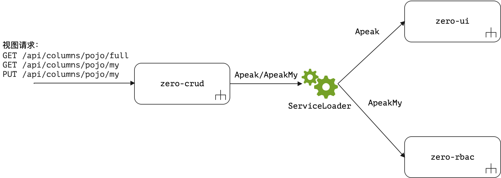

&ensp;&ensp;&ensp;&ensp;从图上可以看到，`zero-crud`中的视图信息主要来自两个模块`zero-ui`和`zero-rbac`，`zero-ui`中包含了整个系统的全部视图列信息，而`zero-rbac`中仅包含了**我的**视图（个人视图）信息，整个视图的层次过滤结构如下图：


> 废话这么多是因为这Zero中的这部分内容和**columnKeyField**和**columnKeyLabel**紧密相关。

&ensp;&ensp;&ensp;&ensp;图中呈现的是Zero中的完整视图结构，解释一下几个定义：

* **可见列**：除开系统不可见（比如开发人员后台代码需要使用）以外所有可访问的列信息。
* **可配列**：这部分控制在Zero Extension中由`zero-ui`实现，比如一个固定列表可能只显示整张表的部分列信息，那么可以在`zero-ui`中使用**动态配置**（存储在数据库中）或**静态配置**（配置文件中定义），只有动态配置的列可直接在平台级管理——如此您可以直接修改您的列表。
* **可控列**：可控列主要包含**角色级**和**用户级**两种，这两种列信息在Zero Extension中由`zero-rbac`实现，角色级的列主要由后台管理员创建、管理和定义，用户级的列就是**个人视图**的一部分。

&ensp;&ensp;&ensp;&ensp;为了实现上述列呈现功能，往往会用到如下数据格式：

```json
[
    {
        "field": "xxx",
        "title": "yyy"
    },
    "..."
]
```

&ensp;&ensp;&ensp;&ensp;上述格式中，`field`表示从后端读取到的数据的记录属性名，`title`则表示从后端读取到的数据对应的**呈现文字**，一般情况下呈现文字并不会包含在您的代码中，这部分如何实现放到`zero-ui`中去讲，而`columnKeyField`和`columnKeyLabel`就是对`field`和`title`的节点名称的配置，如此，您的数据库中存储的属性名和前端呈现用的数据格式部分的属性名就直接解耦（不绑定），所以前端开发可以肆无忌惮、而后端开发就可以随心所欲了，最终链接时依赖这个配置即可。

## 2.2. 模块 - 表级

&ensp;&ensp;&ensp;&ensp;模块配置是`zero-crud`部分的重点，也是难点。配置文件为JSON格式，示例内容如下：

```json
{
    "name": "resource",
    "daoCls": "cn.vertxup.rbac.domain.tables.daos.SResourceDao",
    "field": {
        "unique": [
            [
                "code",
                "sigma"
            ]
        ]
    }
}
```

&ensp;&ensp;&ensp;&ensp;该文件的表级配置只需配置三个：

1. 文件名决定了模型的`identifier`属性，比如：`res.customer.json`，那么对应的模型的全局标识符就是`res.customer`（该模式直接借用了系统中文件名不可重复的原理）。
2. 文件内容中的`name`对应路径中的`:actor`参数，如：`team`，那么请求就会类似：`/api/team/:key`这种。
3. 文件内容中的`daoCls`对应Jooq生成的数据层访问Dao组件，在旧版本中，表名和领域模型名也是需要配置的。

&ensp;&ensp;&ensp;&ensp;旧版本配置（`0.8.0`之前），新版自动分析：

```json
{
    "name": "resource",
    "table": "S_RESOURCE",
    "daoCls": "cn.vertxup.rbac.domain.tables.daos.SResourceDao",
    "pojoCls": "cn.vertxup.rbac.domain.tables.pojos.SResource",
    "field": {
        "unique": [
            [
                "code",
                "sigma"
            ]
        ]
    }
}
```

## 2.3. 模块 - 属性级

&ensp;&ensp;&ensp;&ensp;属性级的配置主要位于`field`节点中，用于描述属性的相关属性：

1. 是否启用序号字段，启用后会直接关联`zero-ambient`中的序号生成系统，为不同字段设置序号。
2. **业务标识规则**：用于标识当前记录是唯一记录的字段、字段集、标识集。
3. Auditor相关字段：创建人、创建时间、更新人、更新时间。
4. 复杂字段：JsonArray和JsonObject类型的字段，会根据数据库中存储的字符串执行自动序列化反序列化。

&ensp;&ensp;&ensp;&ensp;一个完整的`field`片段如下：

```json
{
    "field": {
        "key": "key",
        "numbers": {
            "code": "NUM.CUSTOMER"
        },
        "unique": [
            [
                "code",
                "sigma"
            ]
        ],
        "created": {
            "by": "createdBy",
            "at": "createdAt"
        },
        "updated": {
            "by": "updatedBy",
            "at": "updatedAt"
        },
        "object": [
            "metadata"
        ],
        "array": [
            "roomAttrs"
        ]
    }
}
```

&ensp;&ensp;&ensp;&ensp;几个注意点：

1. `key`表示主键，主键不支持符合主键定义，大部分时候只有单字段主键。
2. `unique`是一个二维数组，您可以设置一个字段为业务唯一标识规则，也可设置多组规则。
3. `created`和`updated`分别对应创建和编辑信息。
4. 除非要对接`X_NUMBER`中的序号生成系统，否则不用配置`numbers`，并且序号是一个Json格式，可以同时支持多个属性都使用序号（实际操作中我们在订单里使用了订单序号和凭证序号）。

&ensp;&ensp;&ensp;&ensp;为了简化该部分配置，系统提供了部分默认值，所以一般情况如下表：

> 按需配置尽可能在`0.6.2`版本之前带*号的是必须配的。

|节点|必须？|含义|
|---|---|:---|
|numbers|x|有需求就配置|
|unique|x *|有需求就配置，一般属于高频需求|
|created|x *|默认就是`createdAt, createdBy`，旧系统必须|
|updated|x *|默认就是`updatedAt, updatedBy`，旧系统必须|
|key|x *|默认就是`key`，旧系统必须|
|object|x|有需求就配置|
|object|x|有需求就配置|

## 2.4. 模块 - HTTP自定义头

&ensp;&ensp;&ensp;&ensp;自定义头配置比较简单：

```json
{
    "headers": {
        "sigma": "X-Sigma",
        "...": "..."
    }
}
```

&ensp;&ensp;&ensp;&ensp;Zero Extension框架中默认提供了sigma属性，再加上新版中已经有了Tenant模块，所以这部分配置只是在0.6.2之前使用，默认几个头如：

|属性名|自定义头|
|:---|:---|
|appId|`X-App-Id`|
|appKey|`X-App-Key`|
|tenant|`X-Tenant`|
|sigma|`X-Sigma`|
|language|`X-Lang`|

> 之后真正开发多语言环境时可能会移除`X-Lang`，用标准的HTTP中的头替代。

## 2.5. 模块 - 列连接

&ensp;&ensp;&ensp;&ensp;列连接配置和《2.1.2.业务属性》中的配置相关
* 如果您的前端应用不是从`zero-ui`中读取列信息，则该配置可以忽略不计。
* `0.8.0`之后使用了**约定命名**，也可以省略该配置。

&ensp;&ensp;&ensp;&ensp;该配置示例如下：

```json
    "column": {
        "identifier": "sec.resource"
    }
```

&ensp;&ensp;&ensp;&ensp;此处`identifier`对应到`plugin/ui/configuration.json`中的列配置的JSON键。

## 2.6. 模块 - 属性转换

&ensp;&ensp;&ensp;&ensp;属性转换的配置主要是服务于**导入、导出、集成**，业务复杂度越高的场景下，通常会采用多张表做关联，如下表（订单表）部分示例：

|属性名|关联表|含义|
|---|---|:---|
|type|订单类型表|订单类型，type关联到订单类型ID。|
|sourceId|市场来源|订单所属市场来源。|
|productId|产品表|订单关联产品。|
|...|...|...|

&ensp;&ensp;&ensp;&ensp;您可以让设计变得轻量级，甚至消除这些关联，但一个完整的业务系统无法彻底消除关联，在这样的场景下，您就需要构造一个类似数据分析中的**宽表**结构，这种结构中你无法避免所有的数据来自于一张表，在前端业务列表中，**导入、导出、集成**就需要执行转换。

&ensp;&ensp;&ensp;&ensp;转换的完整示例代码如下：

```json
{
    "transform": {
        "initial": {
            "type": "`${module}`",
            "identifier": "`${module}`"
        },
        "tree": {
            "in": "code"
        },
        "mapping": {
            "owner": {
                "IN": "贷方",
                "OUT": "借方"
            }
        },
        "fabric": {
            "source": [
                {
                    "source": "TABULAR",
                    "types": [
                        "pay.term.type"
                    ]
                }
            ],
            "epsilon": {
                "termType": {
                    "source": "pay.term.type",
                    "in": "name",
                    "out": "key"
                }
            }
        }
    }
}
```

&ensp;&ensp;&ensp;&ensp;`zero-crud`中支持的转换方式主要包含以下几种：

### 2.6.1. 初始值计算

（使用场景：**导入数据**）

&ensp;&ensp;&ensp;&ensp;初始值计算规则主要用于一些系统后台值在导入数据时的规则填充，比如有10个属性的表，真正在做Excel数据导入时可能只提供了6个属性，而剩余的4个属性在系统中又是必须的，这种情况下，就只能使用初始值来填充，这些初始值不能**硬编码**到系统中，Zero Extension中提供了部分组件可以让初始值经过计算来完成导入的默认值填充过程。

&ensp;&ensp;&ensp;&ensp;导入默认值主要分两种：

* Tenant租户信息：`zero-ifx-excel`可完成
* 特殊系统值

*1. Tenant租户全局信息*

&ensp;&ensp;&ensp;&ensp;新版的`zero-ifx-excel`提供了一个新的配置节点如下：

```yaml
excel:
    tenant: "init/environment.json"
```

&ensp;&ensp;&ensp;&ensp;该节点指定的文件内容如（只截取初始值相关）：

```json
{
    "global": {
        "sigma": "xxx",
        "appId": "xxx",
        "appKey": "xxx",
        "language": "cn",
        "active": true,
        "createdBy": "zero-environment",
        "hotelId": "xxx"
    },
}
```

&ensp;&ensp;&ensp;&ensp;此处`global`节点的属性信息会全部追加到所有**导入**数据中，如果该领域模型存在此属性，则赋值，不存在此属性，则忽略，假设有下表：

|属性名|领域模型|Excel导入文件|global补充|
|---|---|---|---|
|name|o|o||
|code|o|o||
|sigma|o||o|
|language|o||o|
|active|o||o|

&ensp;&ensp;&ensp;&ensp;也就是说，`sigma, language, active`三个属性的值来自于Tenant中定义的全局属性值。

*2. 初始值计算*

&ensp;&ensp;&ensp;&ensp;另外一种补充数据的方式就是初始值计算，即上边配置段：

```json
{
    "transform": {
        "initial": {
            "type": "`${module}`",
            "identifier": "`${module}`"
        }
    }
}
```

&ensp;&ensp;&ensp;&ensp;此处`initial`的左值表示领域模型中拥有的属性值，右值则是使用`common-jexl3`的解析表达式，语法参考`JEXL3`的文档，目前所有的入参为：

```json
{
    "module": "xxx",
    "sigma": "xxx",
    "appId": "xxx",
    "appKey": "xxx",
    "language": "xxx"
}
```

> 这是目前支持的入参格式，后续有需求可扩展。

&ensp;&ensp;&ensp;&ensp;其他四个参数此处不解释，`module`是在**双表连接**时使用的关键参数，标准化接口中支持`view`和`module`的完整支持如下：

> 关于`view`参数的使用我们在`zero-rbac`中会详细讲解。

|方法|实际路径|module|view|
|---|:---|---|---|
|POST|/api/:actor|||
|GET|/api/:actor/:key|||
|PUT|/api/:actor/:key|||
|DELETE|/api/:actor/:key|||
|POST|/api/:actor/search|o|o|
|PUT|/api/batch/:actor/update|o||
|DELETE|/api/batch/:actor/delete|||
|GET|/api/columns/:actor/full|o|o|
|GET|/api/columns/:actor/my|o|o|
|PUT|/api/columns/:actor/my|o|o|
|POST|/api/:actor/import|o||
|POST|/api/:actor/export|o|o|
|POST|/api/:actor/existing|o||
|POST|/api/:actor/missing|o||
|GET|/api/:actor/by/sigma|o||

&ensp;&ensp;&ensp;&ensp;最终的转换流程图如下：

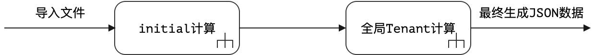

&ensp;&ensp;&ensp;&ensp;最后需说明的是，全局Tenant计算做的数据部分是**补齐**，下边两种情况会被忽略：

* 如果您的Pojo实体领域模型中不包含该属性，则忽略不赋值。
* 如果您的JSON数据在Tenant计算之前已经有了该属性值，跳过不赋值。

### 2.6.2. 树计算

（使用场景：**导入数据**）

&ensp;&ensp;&ensp;&ensp;树模型的处理主要用于树形字段的计算，参考下边表结构图：

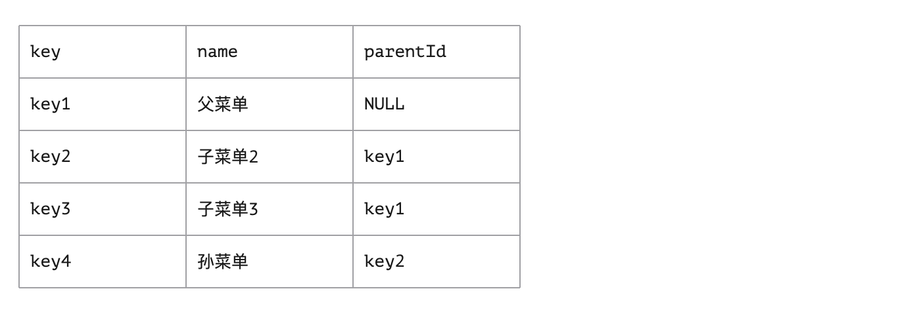

&ensp;&ensp;&ensp;&ensp;数据库中的树模型只能使用**二维表**的方式执行构造，构造过程中通常会采用一个字段引用父ID信息，如此就构造了如下树形结构：

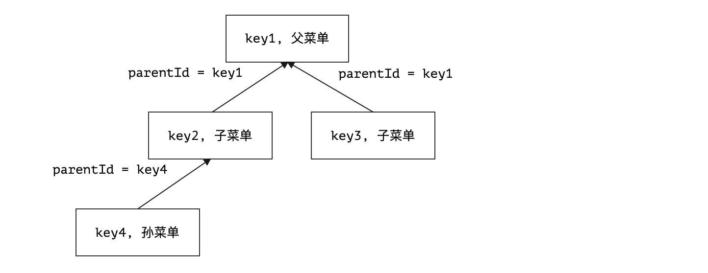

&ensp;&ensp;&ensp;&ensp;而Excel是**业务二维表**，由于主键在系统中可能是**代理主键模式**（自增长、UUID、发号器），通常在导入过程中会采用名称或编码来提供数据，导入数据源本身可能如下：

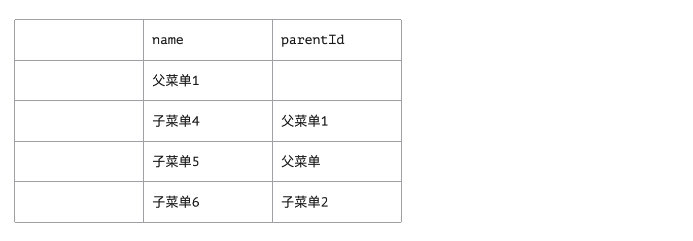

* 导入的Excel数据源中通常不会包含主键信息，所以系统只能根据不重名的**业务标识规则**如名称来自动计算，图中第一列可以视为无数据，只是为了和最早的那份存在的数据对齐而设定。
* 父菜单字段有三个值：`父菜单1、父菜单、子菜单2`，其中这三个菜单中
    * `父菜单、子菜单2`是已经存在于数据库中的菜单记录
    * `父菜单1`导入时并没有在数据库记录中，而是存在于当前导入列表中。
* 当前导入的四条数据可能会使用系统生成新的**主键值**，假设`key5, key6, key7, key8`。

&ensp;&ensp;&ensp;&ensp;**树计算转换**的目的就在此，最终生成的数据表如下：

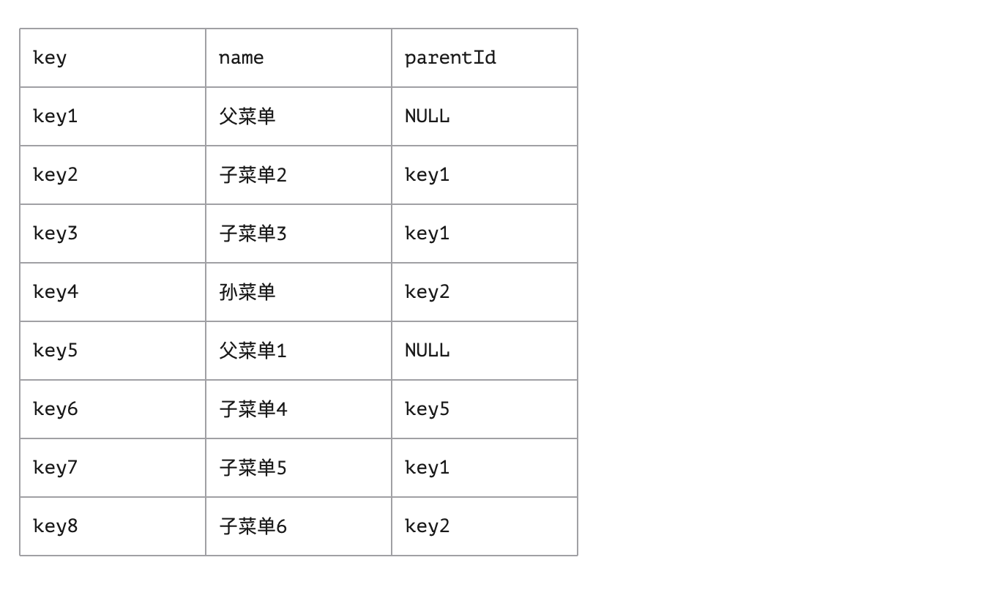

&ensp;&ensp;&ensp;&ensp;数据导入后构造的完整树模型如下：

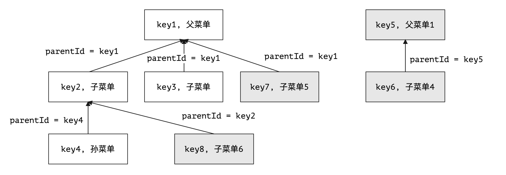

&ensp;&ensp;&ensp;&ensp;Zero Extension中针对这种情况提供了完备的数据解决方案，其对应配置如：

```json
{
    "transform": {
        "tree": {
            "in": "name",
            "out": "key",
            "field": "parentId
        }
    }
}
```

* `in`表示Excel中输入的属性名，此处使用了`name`做基础树计算，如果您想要使用其他属性如`code`，则可以调整该配置。
* `out`表示您的领域模型的主键名，Zero默认使用了`key`，您也可以设置成其他。
* `field`则是构造树的关联字段，示例中就是`parentId`。

> 因为`out`和`field`是Zero Extension规范中的默认值，所以配置时可省略，只配置`in`即可，并且配置过程中树计算在一张表中只允许存在一个，所以它的数据结构是`JsonObject`。

### 2.6.3. 常量映射

（使用场景：**导入、导出数据**）

&ensp;&ensp;&ensp;&ensp;**常量映射**通常服务于系统界面中的下拉框，在很多系统设计中，一个下拉框、单选框会设计成两个列表：**值列表和显示列表**，值列表通常是对应系统字段，不提供给人看，而显示列表则是用户在界面可以看到的字段，其原理近似于树计算中的`name`和`key`的关系。

&ensp;&ensp;&ensp;&ensp;所以用户在导入时一般只提供`name`显示字段值，而系统存储的却是`key`的值列表对应的值，而在导出时，系统又需执行逆向转换运算，其原理如下图：

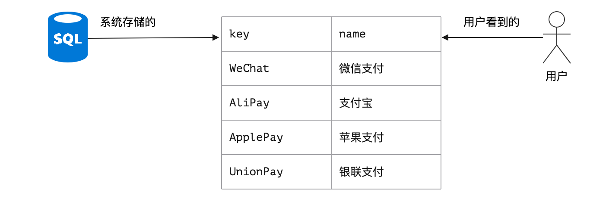

&ensp;&ensp;&ensp;&ensp;上图中`key`会构成值列表、`name`会构成显示列表，并且系统中只有这四个**固定值**，假设设置支付方法的属性名为`payType`，对应的常量映射配置如下：

```json
{
    "transform": {
        "mapping": {
            "payType": {
                "WeChat": "微信支付",
                "AliPay": "支付宝",
                "ApplePay": "苹果支付",
                "UnionPay": "银联支付"
            }
        }
    }
}
```

&ensp;&ensp;&ensp;&ensp;有了该计算过后，系统会执行自动运算和转换，您不需要任何新代码完成这种级别的转换操作。

### 2.6.4. 字典映射

（使用场景：**导入、导出数据**）

&ensp;&ensp;&ensp;&ensp;**字典映射**是**常量映射**的另外一种形态，上述常量映射的支付方式的数量在系统中是固定的，只有四个，如果要管理如何操作？那么此时就会用到**字典映射**，字典翻译器的详细内容留到`zero-jet`模块去讲解，此处主要提及配置信息：

```json
{
    "transform":{
        "fabric": {
            "source": [
                {
                    "source": "TABULAR",
                    "types": [
                        "pay.term.type"
                    ]
                }
            ],
            "epsilon": {
                "termType": {
                    "source": "pay.term.type",
                    "in": "name",
                    "out": "key"
                }
            }
        }        
    }
}
```

&ensp;&ensp;&ensp;&ensp;字典配置中`source`用于定义当前导入导出操作中字典使用的数量，即多种数据源，`epsilon`则用于定义字典的消费字段信息，`in`和`out`和常量映射中是一致的，最终可能配置出如下结构：

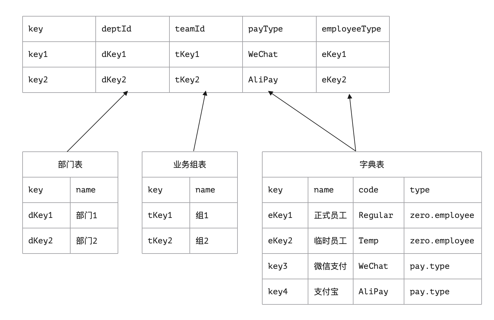

&ensp;&ensp;&ensp;&ensp;上图对应字典配置的完整片段如下：

```json
{
    "transform":{
        "fabric": {
            "source": [
                {
                    "source": "TABULAR",
                    "types": [
                        "zero.employee",
                        "pay.type"
                    ]
                },
                {
                    "source": "ASSIST",
                    "key": "resource.departments",
                    "component": "io.vertx.tp.optic.dict.DepartmentDict"
                },
                {
                    "source": "ASSIST",
                    "key": "resource.teams",
                    "component": "io.vertx.tp.optic.dict.TeamDict"
                }
            ],
            "epsilon": {
                "payType": {
                    "source": "pay.type",
                    "in": "name",
                    "out": "code"
                },
                "employeCode":{
                    "source": "zero.employee",
                    "in": "name",
                    "out": "key"
                },
                "deptId": {
                    "source": "resource.departments",
                    "in": "name",
                    "out": "key"
                },
                "teamId": {
                    "source": "resource.teams",
                    "in": "name",
                    "out": "key"
                }
            }
        }        
    }
}
```

&ensp;&ensp;&ensp;&ensp;`0.8.0`中提供了一种新的字典数据源配置，配置片段如下：

```json
    {
        "source": "DAO",
        "key": "resource.company",
        "component": "cn.vertxup.erp.domain.tables.daos.ECompanyDao",
        "componentConfig": {
            "pojo": "xxx"
        }
    }
```

&ensp;&ensp;&ensp;&ensp;学习了本章，该配置的用法就不言而喻了，不再多做说明，只是这种字典目前会有如下限制：

1. 不支持多表Join模式，若想支持多表，则可直接使用`ASSIST`类型自己开发字典组件。
2. 只支持`sigma`的基础条件配置，不支持其他条件配置，若包含复杂条件，您需要开发自己的字典组件。

## 2.7. 模块 - 多表Join

（使用场景：**导入、导出数据、普通增删查改**）

### 2.7.1. 基本Join

&ensp;&ensp;&ensp;&ensp;多表Join是Zero Extension提供的一种多表联合增删查改的功能，目前版本中的多表Join只支持**一对一**结构，一对一本来就不是一种合理结构，那么为什么会出现一对一，是因为表设计中出现了继承，如下边结构：

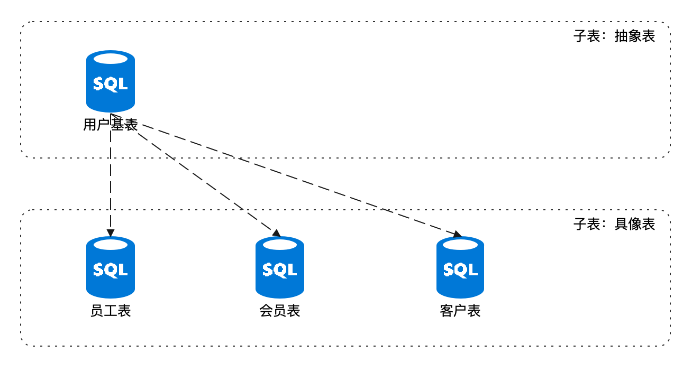

&ensp;&ensp;&ensp;&ensp;这种场景通常在单个项目中不太容易出现，但若是从框架到项目的组合，就十分常见了，所以这种结构的实用性还挺高，假设上述三个模型对应的设计如下：

|模型名|模型标识|关联字段|计算字段|
|---|---|:---|---|
|用户表|sec.user|x|userType|
|员工表|res.employee|userId|x|
|会员表|res.member|userId|x|
|客户表|res.customer|userId|x|

&ensp;&ensp;&ensp;&ensp;关联字段用于设置子表到主表的关联信息，计算字段用来截断鉴别当前记录应该对应到哪张子表，计算主表到子表的信息，此处计算字段结构如下：

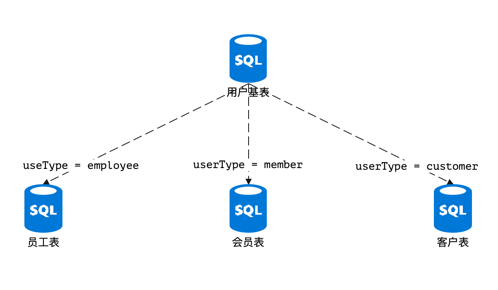

> 既然从数据库层面可以通过JOIN的左外连接直接拉取不同用户的宽表信息，那么此处为什么还需要`userType`呢？主要原因是这种设计中，我们需要提供一个输入，该输入可以让`LEFT JOIN`的右值固定下来，知道程序应该和谁做连接，这就是计算字段存在的意义。

&ensp;&ensp;&ensp;&ensp;最后**计算字段**的情况可以分为如下几种：

1. 存放一个固定字段到系统里作为计算字段，如此处的`userType`。
2. 提供一种计算规则（后续版本提供支持），来运算`LEFT JOIN`的右值。

&ensp;&ensp;&ensp;&ensp;如此，上述配置简化后如下：

```json
{
    "connect": {
        "targetIndent": "userType",
        "target": {
            "res.employee": {
                "keyJoin": "userId"
            },
            "res.member": {
                "keyJoin": "userId"
            },
            "res.customer": {
                "keyJoin": "userId"
            }
        },
        "source": {
            "keyJoin": "key"
        }
    }    
}
```

&ensp;&ensp;&ensp;&ensp;上述`JOIN`连接会形成如下结构图：

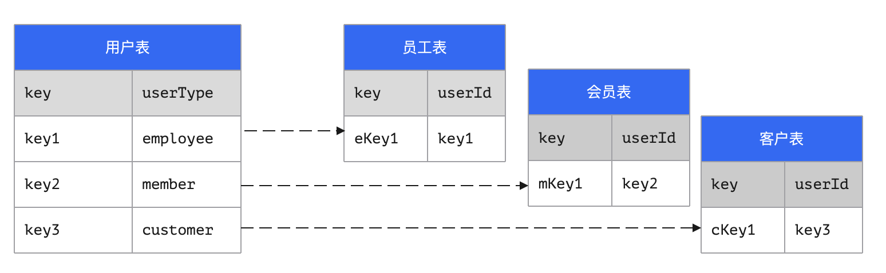

&ensp;&ensp;&ensp;&ensp;上述结构中的`source`和`target`是可以展开的，`source`是主实体，内容为JsonObject类型，`target`则是连接实体，内容为JsonArray类型（包含多种target）。它们的完整配置是一样的，如下：

```json
{
    "identifier": "xxx",
    "crud": "xxx",
    "classDao": "xxx",
    "classDefine": "xxx",
    "keyJoin": "xxx",
    "synonym": {
        "field1": "xxx",
        "field2": "xxx"
    }
}
```

&ensp;&ensp;&ensp;&ensp;配置说明如下：

|属性名|类型|含义|
|---|---|:---|
|identifier|String|当前实体的`identifier`名称。|
|crud|String|「CRUD」模式专用，配置文件名称，默认等于`identifier`。|
|classDao|String|「DAO」模式专用。|
|classDefine|String|「DEFINE」模式。|
|keyJoin|String|默认为`key`，主表做JOIN的字段名。|
|synonym|String|同意语法，解决连接过后的双表重名冲突问题。|

&ensp;&ensp;&ensp;&ensp;目前的JOIN实现的只有一种方式，它的链接模式定义在`io.vertx.tp.ke.cv.em.JoinMode`中：

* **CRUD模式**：直接在环境中搜索`crud`指定的`crud.json`配置（`plugin/crud/module`目录中），计算得到连接模型的基本模型配置信息。
* **DAO模式**：忽略连接模型的配置信息，直接提供执行类计算被连接模型相关信息。
* **DEFINE模式**：原理和DAO模式一样，只是需要您自己提供连接模型相关信息。

> 由于项目周期紧张，目前只标准化了CRUD模式。

### 2.7.2. 双表重名冲突

&ensp;&ensp;&ensp;&ensp;最后解决一个老生常谈的问题，两张表出现了重名字段，这种情况使用`synonym`配置进行定义，重名问题的结构如下：

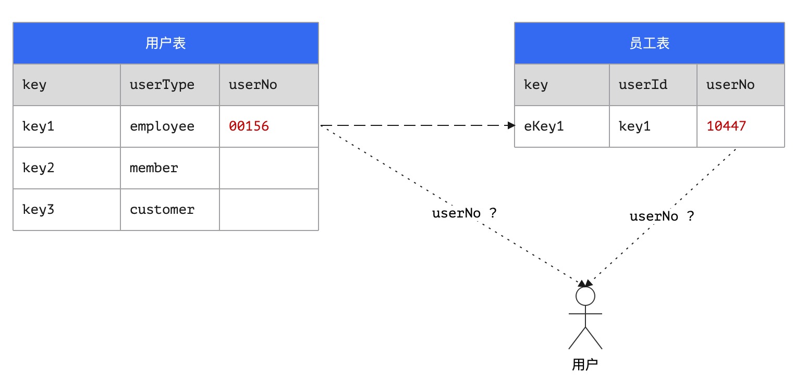

&ensp;&ensp;&ensp;&ensp;如图，主表定义了`userNo`，子表也定义了`userNo`，两个字段**重名**，且值有所不同，那么用户究竟应该看到的是`userNo=00156`还是`userNo=10447`呢？于是`synonym`的配置就是解决这种情况而生的，它的配置如：

```json
{
    "connect": {
        "targetIndent": "userType",
        "target": {
            "res.employee": {
                "keyJoin": "userId",
                "synonym":{
                    "userNo": "employeeNo"
                }
            }
        },
        "source": {
            "keyJoin": "key"
        }
    }    
}
```

&ensp;&ensp;&ensp;&ensp;如此配置后，生成的最终结果如下：

```json
{
    "key": "key1",
    "userType": "employee",
    "userNo": 00156,
    "userId": "key1",
    "employeeNo": 10447
}
```

## 2.8. 暂不支持的功能

&ensp;&ensp;&ensp;&ensp;最终提供一份模块配置的完整模板：

```json
{
    "name": "x-category",
    "table": "X_CATEGORY",
    "daoCls": "cn.vertxup.ambient.domain.tables.daos.XCategoryDao",
    "pojoCls": "cn.vertxup.ambient.domain.tables.pojos.XCategory",
    "field": {
        "key": "key",
        "numbers": {
            "code": "NUM.CUSTOMER"
        },
        "unique": [
            [
                "code",
                "sigma"
            ]
        ],
        "created": {
            "by": "createdBy",
            "at": "createdAt"
        },
        "updated": {
            "by": "updatedBy",
            "at": "updatedAt"
        },
        "object": [
            "metadata"
        ],
        "array": [
            "roomAttrs"
        ]
    },
    "transform": {
        "initial": {
            "type": "`${module}`",
            "identifier": "`${module}`"
        },
        "tree": {
            "in": "code"
        },
        "fabric": {
            "source": [
                {
                    "source": "ASSIST",
                    "key": "resource.departments",
                    "component": "io.vertx.tp.optic.dict.DepartmentDict"
                }
            ],
            "epsilon": {
                "deptId": {
                    "source": "resource.departments",
                    "in": "name",
                    "out": "key"
                }
            }
        }
    },
    "connect": {
        "targetIndent": "identifier",
        "target": {
            "fm.term": {
                "keyJoin": "category",
                "synonym": {
                    "type": "termType"
                }
            },
            "fm.subject": {
                "keyJoin": "category"
            },
            "hotel.commodity": {
                "keyJoin": "categoryId"
            },
            "hotel.compensation": {
                "keyJoin": "categoryId"
            }
        },
        "source": {
            "keyJoin": "key"
        }
    }
}
```

&ensp;&ensp;&ensp;&ensp;后续开发版本会提供的功能：

1. 追加**一对多、多对一**的连接模式，实现批量插入。
2. 提供新的转换方式`transform`用于更复杂的子表规则运算。
3. 提供新的字典方式执行更复杂的字典运算。

# 「叁」总结

&ensp;&ensp;&ensp;&ensp;到这里，所有和`zero-crud`模块相关的内容就全部讲解完成了，这部分内容关联到代码的整体**开发效率**，希望读者自己去细品其相关用法，正式开发模式中一般遵循下边三个步骤：

1. Jooq根据表结构生成代码，并且修改`pojo`映射文件执行Zero规范连接。
2. 定义`zero-crud`的模块配置。
3. 填写`zero-rbac`所需的完整安全数据信息，并将鉴权数据导入系统。
4. 若使用`zero-ui`，整个模块都开发完成了。

> 经过详细测试，这样一个复杂的模块开发周期在30分钟左右。