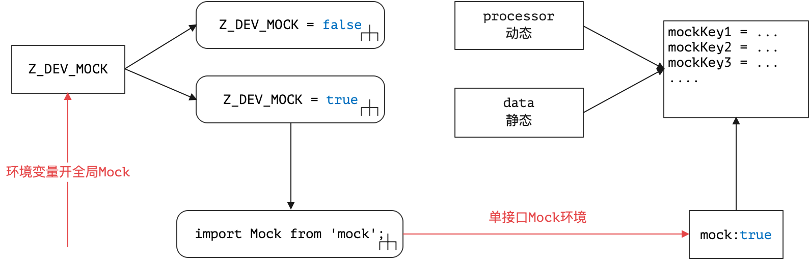
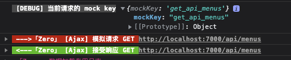

> 有壎民之国。有綦山。又有摇山。有䰝山，又有门户山，又有盛山。又有待山。有五采之鸟。——《大荒东经》

* 项目地址：<https://github.com/silentbalanceyh/vertx-ui/>

# 2. 苍山暮雪：Ajax

&ensp;&ensp;&ensp;&ensp;本文以Ajax为中心，讲解Zero Ui中的交互通道：

1. 基于WebSQL的纯前端Mock通道。
2. 标准的Ajax和后端远程交互的专用通道。

&ensp;&ensp;&ensp;&ensp;有了本文的基础后，您就可以了解在Zero Ui中如何访问远程后端接口了。

## 「壹」API详解

### 1.1. 基本使用

* [参考教程](http://www.vertxui.cn/document/doc-web/module-_ajax.html)

&ensp;&ensp;&ensp;&ensp;Zero Ui中的Ajax调用可直接通过`Ux`来完成，代码如下：

```js
import Ux from 'ux';

// 最终发送请求：GET /app/name/vie.app.zui
Ux.ajaxGet("/app/name/:name", {name:"vie.app.zui"})
```

&ensp;&ensp;&ensp;&ensp;上述代码中直接使用了`Ux.ajaxXXX`的API发送常用请求，这一系列API主要分为几大类：

* **请求类**：安全模式请求/非安全模式请求
* **回调类**：纯异步请求
* **响应类**：和Zero Ui结合的响应信息

#### 1.1.1. 请求类

|函数名|HTTP方法|说明|
|---|---|---|
|ajaxGet|GET|GET方法读取数据。|
|ajaxPut|PUT|PUT方法执行更新。|
|ajaxPost|POST|POST方法执行添加或复杂查询。|
|ajaxDelete|DELETE|DELETE方法执行删除。|
|ajaxFetch|GET|**开放性**GET方法读取数据。|
|ajaxPush|POST|**开放性**POST方法提交数据。|
|ajaxDownload|GET|GET方法下载文件。|
|ajaxPull|POST|POST方法下载文件。|
|ajaxUpload|POST|POST方法上传文件。|
|ajaxResource|GET|读取当前站点资源专用方法，一般读HTML用。|
|microGet|GET|「微服务」GET方法读取数据。|
|microPut|PUT|「微服务」PUT方法执行更新。|
|microPost|POST|「微服务」POST方法执行添加或复杂查询。|
|microDelete|DELETE|「微服务」DELETE方法执行删除。|
|microFetch|GET|「微服务」**开放性**GET方法读取数据。|
|microPush|POST|「微服务」**开放性**POST方法提交数据。|

&ensp;&ensp;&ensp;&ensp;请求类API的函数分两个维度：

* 是否执行微服务请求（Spring模式/Vertx中服务名分离模式），该维度下的函数签名通常为：

    ```js
    (service, uri, params, options)
    ```
* 是否执行安全请求，如果执行的是非安全请求（只支持GET/POST两种，表格中的**开放性**方法），则在请求中不会引入`Authorization`请求头，但依旧支持**数字签名**功能，而执行安全请求，会从用户数据中读取Token信息并将信息并入`Authorization`请求头，同时解决跨域难题，这种类型的函数签名通常为：

    ```js
    (uri, params, options)
    ```

* 上传/下载类的请求都是基于**安全模式**（带Token的），其中下载分两种：GET/POST。

&ensp;&ensp;&ensp;&ensp;微服务模式的对应表：

|说明|标准模式|微模式|
|:---|:---:|:---:|
|开放性GET|ajaxFetch|microFetch|
|开放性POST|ajaxPush|microPush|
|标准GET|ajaxGet|microGet|
|标准POST|ajaxPost|microPost|
|标准PUT|ajaxPut|microPut|
|标准DELETE|ajaxDelete|microDelete|

&ensp;&ensp;&ensp;&ensp;这一类的函数参数表如下：

|参数名|类型|含义|
|---|---|:---|
|service|String|「微服务」微服务专用参数，服务名称。|
|uri|String|请求专用路径，可带`:param`模式的参数正则表达式。|
|params|Object|请求参数，通常是`key=value`键值对。|
|options|Object|HTTP请求头信息。|

#### 1.1.2. 回调类

&ensp;&ensp;&ensp;&ensp;回调类API是基于配置的远程Ajax调用，通常会传入`ajax`相关配置来完成交互过程，回调方法不多，但由于配置本身可实现基础HTTP的方法转换，所以回调模式是针对**请求类API**的一层封装，核心回调方法有三个：

* **asyncTrue**：该方法通常用于检查某个表单字段存在与否，如果远程返回值为`true`则执行`success`回调，`false`则执行`failure`回调。  
* **asyncData**：该方法用于执行远程请求专用回调，如果远程请求正常，则直接执行`callback`回调，无`failure`回调。
* **asyncPromise**：该方法是请求类API的标准封装，可直接生成上述请求类（`ajaxXXX`方法）的所有Promise对象。

&ensp;&ensp;&ensp;&ensp;这三个API的回调内置函数如下（和请求的对应关系）：

```js
const ajaxFun = {
    get: Ajax.ajaxGet,
    post: Ajax.ajaxPost,
    put: Ajax.ajaxPut,
    fetch: Ajax.ajaxFetch,
    push: Ajax.ajaxPush,
    delete: Ajax.ajaxDelete
};
```

&ensp;&ensp;&ensp;&ensp;参数表如：

|参数名|类型|含义|
|---|---|:---|
|config|Object|配置参数，主要包含`uri`和`method`两个核心配置。|
|callback|Object/Function|在`asyncTrue`中，支持success和failure两种回调，而在`asyncData`中直接传入一个Function实现远程数据交互成功的回调。|
|params|Object|请求参数，通常是`key=value`键值对。|
|options|Object|HTTP请求头信息。|

#### 1.1.3. 响应类

&ensp;&ensp;&ensp;&ensp;响应类API主要用于后期处理，更多在于渲染界面效果以简化响应流程，比如：

1. 提交成功后，弹出消息表示结果（`message`类）。
2. 提交成功后，弹出对话框表示结果（`Modal`类）。
3. 如果提交失败，通常会有上述两种清醒出现，如验证失败、防重复提交失败等。

&ensp;&ensp;&ensp;&ensp;部分API包含了二阶API，提供给用户做`then`方法的快速部署，二阶API通常会使用**配置模式**来书写结果，当然这些方法如果满足不了您的需要，您可以自己在`then`方法之后书写自己想要的逻辑而忽略这些响应结果。

```js
// 2阶使用如
const $opConfirm = (todo = {}, ref) => (reference) => (data = {}) => {
    const request = {key: todo.key, data};
    return Ex.I.todo(request, true)
        // 二阶API弹出对话框提示
        .then(Ux.ajax2Dialog(ref, buildConfig(ref, "confirmed"), true))
        .then(response => Ex.rx(reference).close(response));
};
```

&ensp;&ensp;&ensp;&ensp;这类API的详细信息如下

|函数名|说明|
|---|---|
|ajaxError|异常回调，错误信息专用。|
|ajaxDialog|正常回调，使用弹出框呈现正确信息。|
|ajaxMessage|正常回调，使用消息框呈现正确信息。|
|ajax2Dialog|`ajaxDialog`的二阶函数。|
|ajax2Message|`ajaxMessage`的二阶函数。|
|ajax2True|特殊二阶函数，主要用于`true`和`false`返回专用。|
|messageSuccess|呈现成功消息。|
|messageFailure|呈现失败消息。|
|messageCatch|呈现失败消息，在`then, catch`链中专用。|

### 1.2. 参数说明

&ensp;&ensp;&ensp;&ensp;本章节主要讲解上述API中的参数特殊用法，让您对Ajax的API有更深入的理解。

#### 1.2.1. uri

&ensp;&ensp;&ensp;&ensp;使用uri参数时，参数会一式两份，分别填充路径参数`:param`以及转换成Query查询参数并执行encoding，如：

```shell
# 调用 Ux.ajaxGet("/api/user/:name", {
#    name: "Lang",
#    email: "silentbalanceyh@126.com
# })
GET /api/user/:name
# 参数params如下
{
    "name": "Lang",
    "email": "silentbalanceyh@126.com"
}
```

&ensp;&ensp;&ensp;&ensp;上述请求带了路径参数，所以转换时最终会生成下边格式：

```shell
GET /api/user/Lang?name=Lang&email=....
```

&ensp;&ensp;&ensp;&ensp;**注意**，这种情况会被忽略：参数值本身为`undefined`，`null`或者长度小于`40`（由于实战中以UUID为最长GET参数，长度带中划线`36`，不带中划线`32`，所以在查询参数构造时长度小于`40`为上界）。

#### 1.2.2. 默认参数

&ensp;&ensp;&ensp;&ensp;如果系统配置了`Z_LANGUAGE`，则在数据部分系统会为所有的`Json`对象以及子对象注入`language=<Z_LANGUAGE>`的属性，该属性目前主要在Zero Extension**单语言环境**中广泛使用。

&ensp;&ensp;&ensp;&ensp;有一种比较特殊的格式，如执行POST方法：

```shell
POST /api/user/:key
# 参数 params 如下
{
    "key": "xxx",
    "$body": {
        "a": "value1"
    }
}
```

&ensp;&ensp;&ensp;&ensp;这种特殊格式主要用于**同时带有路径参数和请求体的情况**，上述请求最后会被降级翻译成如下请求：

```
POST /api/user/xxx
# 最终发送参数如下
{
    "a": "value1"
}
```

> 实战过程中这种情况还比较常见。

#### 1.2.3. 禁用关键字

&ensp;&ensp;&ensp;&ensp;禁用关键字是为Zero Extension扩展模块的`Qr`查询引擎量身打造，标准的查询引擎参数格式如：

```json
{
    "criteria":{},
    "pager":{
        "page": 1,
        "size": 20
    },
    "sorter": [
        "createdAt,DESC"
    ],
    "projection": []
}
```

&ensp;&ensp;&ensp;&ensp;由于有此限制，Qr类请求会以检测参数中是否包含了上述格式（任意一个键）为优先级，如果包含了上述格式中的键，Zero Ui会将此请求判断为查询引擎专用请求，如此，在Zero Ui中的部分位置其前端行为会随之变化。

> 所以您在实际请求中，若有自己的请求要发送，需要规避`criteria, pager, sorter, projection`关键字以防止和Zero Ui中的查询引擎冲突。

#### 1.2.4. 安全请求

&ensp;&ensp;&ensp;&ensp;Zero Ui中的安全请求主要解决下边情况：

1. 跨域安全请求
2. 带token的安全请求
3. 带`xsrfToken`的安全请求（测试版）
4. 数字签名

&ensp;&ensp;&ensp;&ensp;跨域安全请求在Zero Ui中使用了环境变量来进行模式配置：

```properties
Z_CORS_CREDENTIALS=include
Z_CORS_MODE=cors        # 默认值可不配置
```

&ensp;&ensp;&ensp;&ensp;上述两个环境变量控制了`fetch`在跨域中处理跨域信息的`options`，对应到：

```json
{
    "mode": "cors",
    "credentials": "include"
}
```

&ensp;&ensp;&ensp;&ensp;token令牌的构造分两部分：应用安全模式和用户数据：

* 应用安全模式和后端`X_APP`中定义的`auth`参数有关，目前支持`OAuth`和`Basic`两种，默认为`OAuth`模式，如果有其他模式可直接在Zero Ui中自己扩展。
* 用户数据主要读取SessionStorage中用户登录过后的`token`。

&ensp;&ensp;&ensp;&ensp;最终计算的`Authorization`头如下：

|模式|token|计算结果|
|---|---|---|
|Basic|xxx|Basic xxx|
|OAuth|xxx|Bearer xxx|

> **开放式**：请求不受上述条件限制。

### 1.3. 响应格式特殊说明

&ensp;&ensp;&ensp;&ensp;Zero Ui的响应格式以Zero框架为核心，基础格式如下：

```json
{
    "data": {}
}
```

&ensp;&ensp;&ensp;&ensp;上述格式中`data`为数据部分，但除此之外，有如下扩展格式：

```json
{
    "data": {},
    "meta": {},
    "extension": {},
    "plugin": {},
    "qr": {},
    "acl": {}
}
```

&ensp;&ensp;&ensp;&ensp;扩展格式属性含义如：

|属性名|注入属性|含义|
|---|---|:---|
|meta|__meta|模型定义元数据，动态建模时使用该属性做模型反向解析专用。|
|qr|__qr|远程`S_VIEW`中定义的查询信息，该查询信息提供给前端**视图管理**专用。|
|acl|__acl|RBAC中的ACL权限控制专用节点以控制当前请求的数据权限，**数据域**功能专用。|
|extension|__extension|服务端扩展插件，可使用Java语言的类名实现服务端扩展处理。|
|plugin|__plugin|客户端扩展插件，可使用Js语言的函数名实现客户端扩展处理。|

&ensp;&ensp;&ensp;&ensp;上述扩展节点会直接挂载在`data`节点中，不论`data`节点是Object还是Array，都可直接注入属性，此处有一点JS的基本语法技巧，由于JS中的Array对象也是object，所以可直接实现该属性注入，而注入过后，该Array无法做`forEach`遍历来读取该属性，只能通过`x.__acl`这种模式来读取相关属性，刚好规避了`Array`中无法挂载附加属性的问题。`extension、plugin、meta`目前是保留节点，您可以自定义扩展，Zero Extension扩展模块已经使用了`acl, qr`两个节点。

## 「贰」配置详解

&ensp;&ensp;&ensp;&ensp;可以说**配置模式**是Zero Ui中的强项，不仅可以通过编程模式开发您想要的程序，也可通过配置模式来实现，所以最终形成的完成模式表如下：

1. 编程模式：直接使用Js代码实现。
2. 静态配置：绑定`cab/cn`中的资源文件实现配置，如果配置有更改需重启。
3. 动态配置：直接和远程`zero-ui`对接实现可更改的配置模式，更新后**所见即所得**。

### 2.1. API配置

&ensp;&ensp;&ensp;&ensp;支持配置的API主要是**回调类**，上述提到的`asyncXXX`函数。

#### config

&ensp;&ensp;&ensp;&ensp;config数据格式如下：

```json
{
    "method": "get | post | put | fetch | push | delete",
    "uri": "访问Ajax的路径信息"
}
```

#### callback

&ensp;&ensp;&ensp;&ensp;回调参数只会用在`asyncTrue`和`asyncData`函数中：

**asyncTrue**中的callback格式如：

```json
{
    "success": "成功的回调函数，返回 = true",
    "failure": "失败的回调函数，返回 = false"
}
```

**asyncData**中的callback不是Object，而是直接的Function对象，所以可直接操作。

### 2.2. 窗口配置

&ensp;&ensp;&ensp;&ensp;响应配置通常会在资源文件中定义，并且透过`props`传入：

```js
const {config = {}} = reference.props;
const {dialog = {}} = config;
```

&ensp;&ensp;&ensp;&ensp;此处相当于读取了`props`中的`config.dialog`，该配置键的数据结构如：

```json
{
    "title": "窗口标题",
    "modal": {
        "confirm": {
            "key1": "confirm类型以及提示框处理",
        },
        "success": {
            "key2": "success类型成功提示框处理",
        },
        "error": {
            "key3": "error类型失败提示框处理"
        }
    }
}
```

&ensp;&ensp;&ensp;&ensp;上述消息格式中支持模式格式化处理，如`订单信息为:order`，如果响应数据为：

```json
{
    "order": "订单号XABC"
}
```

&ensp;&ensp;&ensp;&ensp;最终显示出来的数据信息如：`订单信息为订单号XABC`，而上述消息中的`key1, key2, key3`为调用`Ux.ajaxDialog`时传入的`key`值，该`key`值若使用**字符串**格式则走上述配置解析流程，如果`key`本身是一个对象，则传入格式如：

```json
{
    "title": "窗口标题",
    "content": "直接内容",
    "pattern": "可解析的内容格式，优先级比content高。",
    "mode": "窗口类型"
}
```

> 消息格式此处就不多做说明了，它比窗口少了个`confirm`配置，只支持`success`和`failure`两种。

## 「叁」详解Mock

&ensp;&ensp;&ensp;&ensp;Zero Ui并未使用类似`mock-server`的远程服务端，而是直接构造了`mock`模块，模拟数据存储默认使用`WebSQL`前端数据库，而`mock`模拟数据功能和开发人员书写的代码没有任何关系，开发人员可无缝开发应用，如果不想后端联调，直接打开MOCK功能即可。

&ensp;&ensp;&ensp;&ensp;Zero Ui中的Mock功能打开分两个级别：



* **全局级别**，设置`Z_DEV_MOCK`环境变量，为`true`则打开Mock。
* **局部级别**（单接口），必须在`Z_DEV_MOCK=true`时才生效，可根据后续教程动态或静态设置。

### 3.1. Mock Key计算

&ensp;&ensp;&ensp;&ensp;最简单拿到`Mock Key`的方式是在开发过程中直接查看浏览器的`Console`中的输出：



&ensp;&ensp;&ensp;&ensp;`Mock Key`的计算规则如下：

1. 使用HTTP方法和路径执行计算，将`/`替换成`_`，如上述`get_api_menus`实际是`GET/api/menus`转换而来。
2. 如果包含路径参数如`GET/api/user/:key`则执行`:`符号到`$`的替换，最终变成：`get_api_user_$key`的键值。

### 3.2. `mock/index.js`

&ensp;&ensp;&ensp;&ensp;参考下边`index.js`的源代码：

```js
import get_app_name_$name from './zero-ui/login/get_app_name_$name';
import post_oauth_login from "./zero-ui/login/post_oauth_login";
import post_oauth_token from "./zero-ui/login/post_oauth_token";
import post_oauth_authorize from "./zero-ui/login/post_oauth_authorize";
import get_api_user from "./zero-ui/login/get_api_user";
import get_api_app from "./zero-ui/login/get_api_app";
import get_api_menus from './zero-ui/login/get_api_menus';
import post_api_user_logout from './zero-ui/login/post_api_user_logout';


export default {
    // 登录到主界面
    get_app_name_$name,
    post_oauth_login,
    post_oauth_authorize,
    post_oauth_token,
    get_api_user,
    get_api_app,
    get_api_menus,
    post_api_user_logout,
}
```

&ensp;&ensp;&ensp;&ensp;上述代码中，直接将`Mock Key`作为mock模块中的**键**导出，有了`Mock Key`的计算规则后，此处就不详细说明了。

### 3.3. 数据结构

&ensp;&ensp;&ensp;&ensp;标准Mock文件的数据结构如下：

```js
{
    mock: true,
    data: {},
    processor: (response, request) => {
        // 返回异步 Promise
    }
}
```

&ensp;&ensp;&ensp;&ensp;该文件中有三个核心参数：

|参数名|含义|
|---|:---|
|mock|单接口开关，如果`mock=false`则当前接口直接禁用Mock功能，您依旧可以远程调试。|
|data|静态数据结构，直接使用Json格式的基础数据。|
|processor|动态数据结构，如果在原始数据结构中包含了计算逻辑生成新的，可带此配置。|

&ensp;&ensp;&ensp;&ensp;如果没有特定逻辑，可直接使用JSON数据格式以及JSON文件替代`js`文件。

## 「肆」小结

&ensp;&ensp;&ensp;&ensp;本章主要解析了Zero Ui中的Ajax类的方法使用方法以及相关支持功能，让开发人员可直接使用Zero Ui和远程接口集成以及联调。