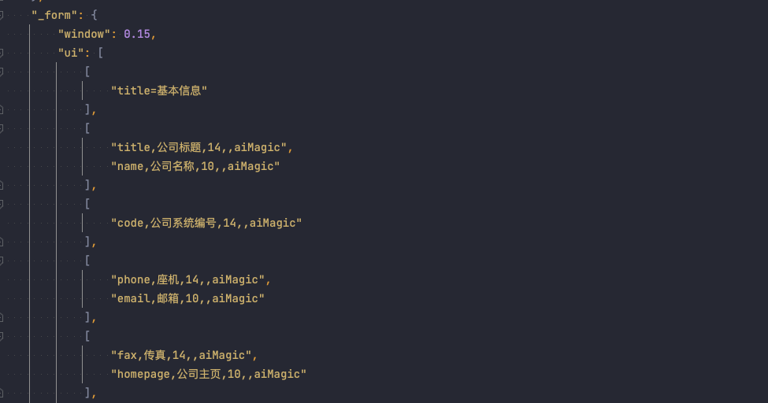
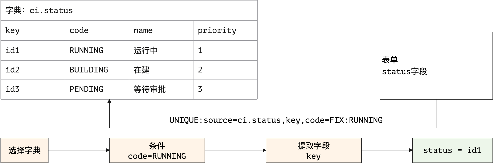

> 有草焉，其状如葵，其臭如靡芜，名曰杜蘅，可以走马，食之已瘿。——《西山经》

* 项目地址：<https://github.com/silentbalanceyh/vertx-ui/>

&ensp;&ensp;&ensp;&ensp;本文讲解一下Zero Ui中的一大配置亮点：**属性解析器**，属性解析器设计的初衷在于减少配置数据的书写，通过简化可让开发人员大面积缩减JSON配置体积，简化配置格式在开发过程中会十分有用。

# 「壹」基本概念

## 1.1.解析目的

&ensp;&ensp;&ensp;&ensp;假设系统中存在配置：

```json
{
    "dataIndex": "name",
    "title": "标题",
    "$render": "DATUM",
    "sorter": true
}
```

&ensp;&ensp;&ensp;&ensp;如果写成属性解析器可解析的格式如：

```json
{
    "metadata": "name,标题,DATUM,true"
}
```

&ensp;&ensp;&ensp;&ensp;更简化的模式可直接把某个节点写成字符串：

```json
"name,标题,DATUM,true"
```

&ensp;&ensp;&ensp;&ensp;这种模式下，大段Json格式的数据会被直接压缩，长度只有原来的25%左右（**属性越多的组件，最终压缩出来的体积越小！**），这就是属性解析器带来的配置层面的一种便利，而比较繁琐的一点是您必须知道此处的`name,标题,DATUM,true`代表什么。

## 1.2.写法和场景

&ensp;&ensp;&ensp;&ensp;Zero UI中的属性配置的写法主要分三种：

1. 完全模式（不启用属性解析器）
2. 标准模式（可附加额外配置的书写方式）
3. 字符串模式（不带附加配置）

&ensp;&ensp;&ensp;&ensp;**完全模式**就是完整的JSON参考格式，也属于传统意义上的完整模式，这种模式下不会触发属性解析器，是人最容易阅读的格式，完整格式参考如（示例为表格列）：

```json
{
    "dataIndex": "name",
    "title": "标题",
    "$render": "DATUM",
    "sorter": true
}
```

&ensp;&ensp;&ensp;&ensp;**标准模式**的写法如下：

```json
{
    "metadata": "name,标题,DATUM,true,,attr3=z",
    "attr1": "x",
    "attr2": "y"
}
```

&ensp;&ensp;&ensp;&ensp;标准模式中必须带上`metadata`节点数据用以标识，当完全模式和标准模式同时出现时完全模式的优先级更高，系统会优先使用完全模式中的数据。

&ensp;&ensp;&ensp;&ensp;**字符串模式**最简单，直接书写成：

```json
"name,标题,DATUM,true,,attr3=z"
```

&ensp;&ensp;&ensp;&ensp;这种模式主要是为了提供更加便利的书写模式，该书写模式中`attr3`之后的部分用于处理`$KV`默认属性的解析。

> 不论哪种模式最终解析出来的配置格式都是**完全模式**的格式。

## 1.3.拉平语法

&ensp;&ensp;&ensp;&ensp;拉平语法主要用于书写配置中简化JSON的深度，对树的叶节点的模式实现深度压缩的过程，如下边示例，基本格式为：

```json
{
    "optionJsx":{
        "style":{
            "height":300
        },
        "config":{
            "title":[
                "left",
                "right"
            ]
        }
    }
}
```

&ensp;&ensp;&ensp;&ensp;拉平后的处理格式如：

```json
{
    "optionJsx.style.height": 300,
    "optionJsx.config.title": [
        "left",
        "right"
    ]
}
```

&ensp;&ensp;&ensp;&ensp;拉平过程中，您可以在任意节点处理拉平语法，即上述格式也可以写成：

```json
{
    "optionJsx":{
        "style.height": 300,
        "config.title": [
            "left",
            "right"
        ]
    }
}
```

&ensp;&ensp;&ensp;&ensp;**属性解析器**的目的是在某种数据结构中简化配置，以实现对封装组件的基础写法而不用开发人员去考虑前端组件的基本细节，这种封装带来的直接福利就是开发人员无脑书写特定界面，而无需去管理组件状态、属性，如表单的防重复提交、列表的自动刷新、窗口的隐藏和显示等系列前端效果都可以由Zero Ui完成。

# 「贰」常用解析器

&ensp;&ensp;&ensp;&ensp;本章讲解属性解析器的常用场景，并且让开发人员了解Zero Ui中哪些界面使用了**属性解析器**

1. 属性定义源码文件：`src/ux/engine/expression/I.definition.js`。
2. 常用解析源码文件：`src/ux/engine/expression/O.apply.js`

## 2.1.窗口解析器

&ensp;&ensp;&ensp;&ensp;Zero Ui中的窗口解析器主要分三种：

1. 弹出窗口，对应Ant Design中的`<Modal/>`组件。
2. 抽屉窗口，对应Ant Design中的`<Drawer/>`组件。
3. 浮游窗口，对应Ant Design中的`<Popover/>`组件。

### 2.1.1.窗口内表单

&ensp;&ensp;&ensp;&ensp;讲解这部分配置之前，先看看Zero Ui中**外层窗口**和**内层表单**的交互，H5中已经支持提交按钮（可以是`<button/>`，也可以是`<input/>`）在表单`<form/>`之外，但由于Zero Ui最早开发时H5规范还没落地，所以使用了最原生态的HTML的做法。先看窗口中的结构图：


1. 窗口和内部表单会形成一个**父子继承**结构
2. 外层窗口有两个核心变量：
    1. `$visible`用来控制窗口的显示和隐藏，`rxClose`触发时会将该变量设置成`false`
    2. `$submitting`用来控制表单的**防重复提交**，点击提交按钮之后按钮会处于加载（`loading = true`）状态。
3. 整个结构中有两个按钮
    1. 内层为表单的**提交按钮**，带`id`属性（示例中`id = $opSave`），该按钮是隐藏起来的，用户不可见。
    2. 外层为窗口中的**确认按钮**，该按钮会调用`Ux.connectId`实现**提交按钮**的点击事件。
4. `rxClose`函数作为窗口的关闭函数，会传入到表单中，当表单提交完成之后，可以直接触发关闭操作（并还原防重复提交的状态）：`$visible = false, $submitting = false`。

### 2.1.2.弹出框属性

&ensp;&ensp;&ensp;&ensp;弹出框的属性定义如下：

```js
    [
        "title",
        "okText",
        "cancelText",
        "visible",
        "width",
        "maskClosable",
        "onOk",
        "component"
    ]
```

&ensp;&ensp;&ensp;&ensp;示例：

```json
"_window": "配置信息,选择,关闭,false,800,true,$opSaveApi"
```

&ensp;&ensp;&ensp;&ensp;最终解析结果如：

```js
{
    "title": "配置信息",
    "okText": "选择",
    "cancelText": "关闭",
    "visible": false,
    "width": 800,
    "maskClosable": true,
    "onOk": () => Ux.connectId("$opSaveApi"),
    "component": null
}
```

* 这份配置对应Ant Design中`<Modal/>`组件的属性信息，详细的属性信息参考：[Modal Api](https://3x.ant.design/components/modal-cn/#API)。
* 上述示例中`visible`表示窗口初始化的默认状态，通常情况下弹出窗口的默认状态是关闭的`visible = false`，而某些特定场景中窗口初始化是**打开的**，由于Zero Ui最早参与的项目中出现了默认场景下打开的窗口，所以这个配置一直被保留下来了，为了兼容旧系统，所以未来的版本也不会移除。
* `onOk`属性在原生属性中是一个函数，而此处的窗口函数为`Ux.connectId("$opSaveApi")`，含义为触发`id = $opSaveApi`的**点击事件**。

&ensp;&ensp;&ensp;&ensp;Zero Ui中属性表如下：

|索引|属性|含义|
|---|---|---|
|0|title|窗口标题。|
|1|okText|确认按钮显示的文字，如果没有该配置则省略**确认按钮**。|
|2|cancelText|取消按钮文字。|
|3|visible|窗口默认显示还是隐藏。|
|4|maskClosable|点击蒙层是否允许关闭。|
|5|width|窗口宽度。|
|6|onOk|一般为字符串，配置**被连接**按钮的`id`。|
|7|component|窗口内组件，扩展时使用。|

&ensp;&ensp;&ensp;&ensp;Zero UI的API调用代码如：

```js
// Zero UI Development
import Ux from 'ux';

// expression格式：
// 1. 字符串格式：配置信息,选择,关闭,false,800,true,$opSaveApi
// 2. 标准格式：{}
const config = Ux.aiExprWindow(expression);    
```

### 2.1.3.抽屉框属性

&ensp;&ensp;&ensp;&ensp;抽屉框的属性定义如下：

```js
    [
        "title",
        "placement",
        "width",
        "closable",
        "maskClosable",
        "visible"
    ]
```

&ensp;&ensp;&ensp;&ensp;示例：

```json
"window.extra.view": "视图管理,right,400,true,false",
```

&ensp;&ensp;&ensp;&ensp;最终解析结果如下：

```js
{
    "title": "视图管理",
    "placement": "right",
    "width": 400,
    "closable": true,
    "maskClosable": false,
    "visible": false
}
```

&ensp;&ensp;&ensp;&ensp;和窗口配置不同的点是抽屉没有**确认按钮**，只有关闭按钮，所以整个配置中没有类似`Ux.connectId`部分的配置信息，这些配置对应Ant Design中的`<Drawer/>`组件，Zero Ui配置中的属性表如下：

|索引|属性|含义|
|---|---|---|
|0|title|窗口标题。|
|1|placement|抽屉方向，主要包含`top, bottom, left, right`四个值。|
|2|width|抽屉窗口的宽度，一般`left, right`使用，如果`top, bottom`则该值表示高度。|
|3|closable|是否支持`关闭`功能。|
|4|maskClosable|点击蒙层是否允许关闭。|
|5|visible|该窗口默认显示值。|

&ensp;&ensp;&ensp;&ensp;Zero UI的API调用代码如：

```js
// Zero UI Development
import Ux from 'ux';

// expression格式：
// 1. 字符串格式：视图管理,right,400,true,false
// 2. 标准格式：{}
const config = Ux.aiExprDrawer(expression);    
```

### 2.1.4.浮游框属性

&ensp;&ensp;&ensp;&ensp;浮游框的属性定义如下：

```js
    [
        "title",
        "placement",
        "width",
        "closable",
        "visible"
    ]
```


&ensp;&ensp;&ensp;&ensp;示例：

```json
 "window.extra.column": "请选择您要显示的列,leftTop,640,true"
```

&ensp;&ensp;&ensp;&ensp;最终解析结果如下：

```js
{
    "title": "请选择您要显示的列",
    "placement": "leftTop",
    "width": 640,
    "closable": true,
    "visible": false
}
```

&ensp;&ensp;&ensp;&ensp;浮游窗口没有蒙层（遮罩）的功能，所有属性几乎和Drawer是一致的，但`placement`的值域有点小区别。

|索引|属性|含义|
|---|---|---|
|0|title|窗口标题。|
|1|placement|浮游方向，有八个：`leftTop, left, leftBottom, bottom, rightBottom, right, rightTop, top`。|
|2|width|浮游窗口的宽度。|
|3|closable|是否支持`关闭`功能。|
|5|visible|该窗口默认显示值。|

&ensp;&ensp;&ensp;&ensp;Zero UI的API调用代码如：

```js
// Zero UI Development
import Ux from 'ux';

// expression格式：
// 1. 字符串格式：请选择您要显示的列,leftTop,640,true
// 2. 标准格式：{}
const config = Ux.aiExprPopover(expression);    
```

## 2.2. Ajax配置解析

&ensp;&ensp;&ensp;&ensp;Ajax请求的属性定义如下：

```js
    [
        "method",
        "uri",
        "params.pager.page",
        "params.pager.size",
        "$KV$"
    ]
```

&ensp;&ensp;&ensp;&ensp;该配置主要应用于特定的解析场景中，通常写法如下：

```json
"metadata": "POST,/api/user/search,1,10,sorter=updatedAt`DESC",
```

&ensp;&ensp;&ensp;&ensp;上述配置中，解析的最终结果如：

```js
{
    "method": "POST",
    "uri": "/api/user/search",
    "params":{
        "pager": {
            "page": 1,
            "size": 10
        },
        "sorter": [
            "updatedAt,DESC"
        ]
    }
}
```

&ensp;&ensp;&ensp;&ensp;该操作为Zero中的查询引擎操作，同时支持排序和分页功能，一般这段代码在特定组件中使用，如`ListSelector/TreeSelector/MatrixSelector`中，**注**——此处开始出现`$KV$`相关配置，此配置为特殊配置，会在后边章节单独说明。

&ensp;&ensp;&ensp;&ensp;Ajax部分解析配置如：

|索引|属性|含义|
|---|---|---|
|0|method|Ajax使用的HTTP方法。|
|1|uri|Ajax调用的远程URI路径。|
|2|params.pager.page|分页功能中的页码，从`1`开始。|
|3|params.pager.size|分页功能中的每页记录数，默认`10`。|
|4|`$KV$`|专用键值对处理。|

## 2.3. 表单解析

&ensp;&ensp;&ensp;&ensp;表单字段解析器是整个环境中最常用的一种解析器，几乎应用于每个表单的简化写法，也是`$KV$`支持得最多的解析配置，它的属性定义如下：

```js
    [
        "field",
        "optionItem.label",
        "span",
        "optionJsx.style.width",
        "render",
        "$KV$"
    ]
```

&ensp;&ensp;&ensp;&ensp;表单由于比较特殊，可能带有额外的配置，所以通常情况会采用`metadata`的模式进行书写，而不是直接字符串，只有特别简单的时候才会使用直接的字符串格式：

```json
"workTitle,头衔,,,,normalize=text:40",
```

&ensp;&ensp;&ensp;&ensp;如果是复杂组件，则通常会使用如下：

```json
{
    "metadata": "companyId,所属公司,,,aiTreeSelect,placeholder=（请选择所属公司）",
    "optionJsx.config.datum": "source=resource.companys,value=key,label=name",
    "optionJsx.config.tree": "text=name,parent=companyId",
    "optionJsx.config.selection": "mode=FULL",
    "optionConfig.rules": [
        "required,请选择员工所属的公司！"
    ]
}
```

&ensp;&ensp;&ensp;&ensp;上述代码解析出来的完整格式如：

```js
// 第一段代码
{
    "field": "workTitle",
    "optionItem":{
        "label": "头衔"
    },
    "optionConfig":{
        "normalize": () => Function     // 输入限制专用
    }
}
// 第二段代码
{
    "field": "companyId",
    "optionItem": {
        "label": "所属公司"
    },
    "$render": "aiTreeSelect",
    "optionJsx":{
        "placeholder": "（请选择所属公司）",
        "config":{
            "datum": {
                "source": "resource.companys",
                "value": "key",
                "label": "name"
            },
            "tree": {
                "text": "name",
                "parent": "companyId"
            },
            "selection":{
                "mode": "FULL"
            }
        }
    },
    "optionConfig": {
        "rules": [
            {
                "type": "required",
                "message": "请选择员工所属的公司！"
            }
        ]
    }
}
```

&ensp;&ensp;&ensp;&ensp;上述解析可以看到，**属性解析器**和**拉平语法**带来的很大的一层福利就是可以大量压缩JSON的配置格式，使得配置文件的深度和体积不用那么冗重。表单解析的配置表如：

|索引|属性|含义|
|---|---|---|
|0|field|表单对应字段名。|
|1|optionItem.label|表单字段前边的标题。|
|2|span|当前表单字段在Grid布局中宽度，最大宽度为24，默认根据列的不同可设置。|
|3|optionJsx.style.width|当前表单的相对宽度，一般为百分比。|
|4|$render|该表单调用的渲染API，用于渲染不同组件专用。|
|5|`$KV$`|专用键值对处理。|

&ensp;&ensp;&ensp;&ensp;关于表单本身的配置解析不在此章节做说明。

## 2.4. 操作按钮

&ensp;&ensp;&ensp;&ensp;操作按钮的配置相对比较曲折和复杂，主要原因是整个框架在按钮这个级别经过了几个不同版本的升级，所以出现了不同种类的按钮配置。

### 2.4.1. 连接按钮解析

&ensp;&ensp;&ensp;&ensp;前文提到过Zero Ui中支持按钮的**连接操作**：使用一个按钮调用`Ux.connectId`去触发另外一个**隐藏**按钮的点击事件，连接按钮解析主要是解析调用`Ux.connectId`的按钮配置，它的定义如下：

```js
    [
        "key",
        "text",
        "connectId",
        "type",
        "icon",
        "disabledKey",
        "$KV$"
    ]
```

&ensp;&ensp;&ensp;&ensp;一般这种按钮会位于外层组件中，如：

1. Tab页签的`tabBarExtraContent`中的按钮去连接内部（children）`TabPanel`中隐藏按钮。
2. Card左右标题中的按钮去连接内部（children）中隐藏按钮。

&ensp;&ensp;&ensp;&ensp;按钮的连接操作除了触发点击事件，还需要实现两个按钮同时的**防重复提交**效果——一旦点击后按钮必须处于加载状态，在执行完成或出现错误过后该状态必须还原，这种视觉层面的操作由Zero框架帮助您完成；连接按钮的常用解析操作如：

```json
    "_page": {
        "title": "新建申请",
        "left": [
            "btnOrderSave,提交,$opCreate,primary",
            "btnOrderReset,重置,$opReset,default"
        ]
    }
```

&ensp;&ensp;&ensp;&ensp;上述按钮中以**提交**为例，会被解析成如下：

```js
{
    "key": "btnOrderSave",
    "text": "提交",
    "connectId": "$opCreate",
    "type": "primary",
    "icon": null,
    "disabledKey": null,
    "$KV$": null
}
```

&ensp;&ensp;&ensp;&ensp;对应的配置表如下：

|索引|属性|含义|
|---|---|---|
|0|key|当前按钮的`key`值（React专用）。|
|1|text|当前按钮显示的文字信息。|
|2|connectId|被连接的隐藏按钮的id。|
|3|type|该按钮的类型，对应Ant Design中的`<Button/>`对应的`type`属性。|
|4|icon|该按钮显示的图标信息，对应`icon`属性。|
|5|disabledKey|该配置为一个遗留配置，用来控制按钮在什么场景中被动态禁用。|
|6|`$KV$`|专用键值对处理。|


### 2.4.2. 提交按钮解析

&ensp;&ensp;&ensp;&ensp;**提交按钮**为表单内部专用按钮，它会和Ant Design中的表单产生绑定作用，以实现表单的快速提交，它的定义如下：

```js
    [
        "key",
        "text",
        "event",
        "type",
        "className",
        "icon",
        "$KV$"
    ]
```

&ensp;&ensp;&ensp;&ensp;这种类型的按钮只会位于表单内部，不会在其他地方触发事件，控制该按钮提交的核心配置是`event`，您可以从服务端读取`event`实现动态的行为注入，也可以直接在前端书写该事件信息实现提交事件设置，关于`event`的种类会在表单章节单独讲解，此处不展开。

&ensp;&ensp;&ensp;&ensp;表单中常用的提交按钮部分配置如：

```json
[
    {
        "metadata": "$button",
        "hidden": true,
        "optionJsx.extension": [
            "$opAdd,添加,SUBMIT,primary",
            "$opReset,重置,RESET"
        ]
    }
]
```

&ensp;&ensp;&ensp;&ensp;上述配置中表单内部按钮为隐藏按钮，一般会被Tab容器或窗口容器触发，其中**添加**按钮的最终解析配置如：

```js
{
    "key": "$opAdd",
    "text": "添加",
    "event": "SUBMIT",
    "type": "primary",
    "className": null,
    "icon": null,
    "$KV$": null
}
```

&ensp;&ensp;&ensp;&ensp;对应属性表如下：

|索引|属性|含义|
|---|---|---|
|0|key|当前按钮的`key`值（React专用），表单中绑定触发函数也是依赖该key做函数名。|
|1|text|当前按钮显示的文字信息。|
|2|event|当前表单实现的标准化事件的名称，如`SUBMIT`或`RESET`等。|
|3|type|该按钮的类型，对应Ant Design中的`<Button/>`对应的`type`属性。|
|4|className|Zero中定义了不同颜色和风格的按钮专用className，该配置主要用于风格切换。|
|5|icon|该按钮显示的图标信息，对应`icon`属性。|
|6|`$KV$`|专用键值对处理。|

### 2.4.3. 组件按钮解析

&ensp;&ensp;&ensp;&ensp;**组件按钮**是Zero Ui中提供的两种特殊的按钮`<DialogMenu/> / <DialogButton/>`，这两种按钮除了按钮部分，内部还包含了子组件，该子组件和按钮产生绑定，帮助开发人员完成按钮触发窗口的快捷操作，当用户点击该按钮或菜单项时，该按钮会弹出一个内置的窗口实现进一步操作。它的定义如下：

```js
    [
        "key",
        "text",
        "type",
        "icon",
        "confirm",
        "$KV$"
    ]
```

&ensp;&ensp;&ensp;&ensp;如下边的配置片段：

```json
"button": "itemCancel,撤销,,undo,若执行撤销，则这单据全部会变成无效，确认？,className=ux-spec",
```

&ensp;&ensp;&ensp;&ensp;最终会解析成：

```js
{
    "key": "itemCancel",
    "text": "撤销",
    "type": null,   // 此处会使用 default 做默认值
    "icon": "undo",
    "confirm": "若执行撤销，则这单据全部会变成无效，确认？",
    "$KV$": "className=ux-spec"
}
```

&ensp;&ensp;&ensp;&ensp;由于这种类型的按钮不需要其他额外配置，点击过后只是单纯显示窗口，所以移除掉了部分不必要的配置，它的属性表如下：


|索引|属性|含义|
|---|---|---|
|0|key|当前按钮的`key`值（React专用），表单中绑定触发函数也是依赖该key做函数名。|
|1|text|当前按钮显示的文字信息。|
|2|type|该按钮的类型，对应Ant Design中的`<Button/>`对应的`type`属性。|
|3|icon|该按钮显示的图标信息，对应`icon`属性。|
|4|confirm|该按钮是否启用确认/取消的提示浮游窗口功能，打开选项后设置成浮游提示文字。|
|5|`$KV$`|专用键值对处理。|

&ensp;&ensp;&ensp;&ensp;Zero Ui解析按钮事件时进行了部分基于场景的深度定制，如`confirm`属性会执行下边转换：

```jsx
// 不带 confirm 的操作
<Button onClick={fnEvent}/>

// 带 confirm 的操作
<Popconfirm title={confirm} onConfirm={fnEvent}>
    <Button/>
</Popconfirm>
```

&ensp;&ensp;&ensp;&ensp;如此，您就不需要再书写任何代码就可以实现按钮点击之前的确认效果，该效果主要用于**删除**操作中，二次确认再让用户点击按钮。

### 2.4.4. 命令按钮解析

&ensp;&ensp;&ensp;&ensp;命令按钮是在G6的绘图仪中使用的专用按钮，这种按钮也可以扩展到其他场景，这种按钮最特殊的地方在于不会绑定任何onClick事件，同时也不会有类似`event`的行为，而是直接触发某个`command`命令，然后该命令由容器传递到其他组件如窗口、画布、节点、边等。它的定义如下：

```js
    [
        "key",              // 事件专用 key，依靠这个绑定
        "text",             // 显示文字
        "className",        // 风格处理
        "confirm",          // confirm 窗口
        "confirmPosition",  // confirm 位置
        "icon",             // 图标信息
        "tooltip",          // tooltip 打开（打开过后文字放到 tooltip中）
        "$KV$"
    ]
```

&ensp;&ensp;&ensp;&ensp;命令按钮的配置属于**高级用法**，主要操作为`Ux`中的三个核心API：

1. `opExtra`：右上角附加命令按钮渲染专用。
2. `opLink`：链接命令按钮专用。
3. `opCommand`：标准命令按钮专用。

&ensp;&ensp;&ensp;&ensp;命令按钮之所以不用绑定`onClick`以及`event`行为，原因呢在于所有的执行器都是外层传入，如下边配置：

```json
_commands: [
    "$opAutoSave,,ux-spec,确认打开？,left,undo"
]
```

&ensp;&ensp;&ensp;&ensp;上述配置会被解析成：

```js
{
    "key": "$opAutoSave",
    "text": null,
    "className": "ux-spec",
    "confirm": "确认打开？",
    "confirmPosition": "left",
    "icon": "undo",
    "tooltip": null,
    "$KV$": null
}
```

&ensp;&ensp;&ensp;&ensp;它的属性表如下：

|索引|属性|含义|
|---|---|---|
|0|key|当前按钮的`key`值（React专用），表单中绑定触发函数也是依赖该key做函数名。|
|1|text|当前按钮显示的文字信息。|
|2|className|Zero中定义了不同颜色和风格的按钮专用className，该配置主要用于风格切换。|
|3|confirm|该按钮是否启用确认/取消的提示浮游窗口功能，打开选项后设置成浮游提示文字。|
|4|confirmPosition|浮游窗口的位置，该配置仅存在于命令模式的按钮。|
|5|icon|该按钮显示的图标信息，对应`icon`属性。|
|6|tooltip|该配置用于命令模式只配置图标型按钮（不显示文字），tooltip为鼠标移动到按钮上的提示文字。|
|7|`$KV$`|专用键值对处理。|

## 2.5. 列解析

&ensp;&ensp;&ensp;&ensp;列解析对应Ant Design中的`<Table/>`组件中的列呈现模式，支持各种不同的列呈现。标准列配置定义如下：

```js
    [
        "dataIndex",
        "title",
        "$render",
        "sorter",
        "$KV$"
    ]
```

&ensp;&ensp;&ensp;&ensp;这种模式常用的配置如下：

```json
    "columns": [
        "name,权限名称",
        "code,权限编码"
    ]
```

&ensp;&ensp;&ensp;&ensp;上述配置中**权限名称**会解析成如下：

```js
{
    "dataIndex": "name",
    "title": "权限名称",
    "$render": "TEXT",
    "sorter": false,
    "$KV$": null
}
```

&ensp;&ensp;&ensp;&ensp;对应的配置表如：

|索引|属性|含义|
|---|---|---|
|0|dataIndex|绑定的记录对应的属性名。|
|1|title|当前列的列标题。|
|2|$render|列的渲染类型，该类型在列表章节详细解析。|
|3|sorter|是否打开列排序，如果打开则列中会启用排序功能。|
|4|`$KV$`|专用键值对处理。|

## 2.6.选项解析

&ensp;&ensp;&ensp;&ensp;选项解析存在于各种复杂组件中，主要用来简化某些比较小的修饰组件，如：

1. 图标完整风格解析`<Icon/>`。
2. 数据源的过滤条件解析。
3. 下拉、多选、单选选项解析。

### 2.6.1. 图标解析

&ensp;&ensp;&ensp;&ensp;图标写法在Zero Ui中因为历史原因出现了几种不同的形态，这些形态用来修饰文字前后的图标内容，标准形态的配置定义如：

```js
    [
        "text",
        "icon",
        "iconStyle.fontSize",
        "iconStyle.color",
        "style.color",
        "$KV$"
    ]
```

&ensp;&ensp;&ensp;&ensp;该配置应用于带图标的文字标签，它对应的全部代码如：

```jsx
<span>
    <Icon/>
    &nbsp;&nbsp;
    {文字部分}
</span>
```

&ensp;&ensp;&ensp;&ensp;常用写法如：

```json
    "$mapping": {
        "Pending": "未结算,exclamation-circle,16,#0a7bed",
        "Finished": "已结算,check-circle,16,#268941",
        "InValid": "无效,stop,16,#e22015"
    }
```

&ensp;&ensp;&ensp;&ensp;其中每个选项会解析成：

```js
{
    "text": "未结算",
    "icon": "exclamation-circle",
    "iconStyle": {
        "fontSize": 16,
        "color": "#0a7bed"
    },
    "style":{
        "color": null
    }
}
```

&ensp;&ensp;&ensp;&ensp;图标解析会包含两部分：

1. 文字部分风格
2. 图标部分，其中`iconStyle`用来设置图标风格

&ensp;&ensp;&ensp;&ensp;对应配置表如：

|索引|属性|含义|
|---|---|---|
|0|text|标签显示的文字。|
|1|icon|图标类型，对应`<Icon/>`中的`type`属性。|
|2|iconStyle.fontSize|控制图标大小。|
|3|iconStyle.color|控制图标颜色。|
|4|style.color|控制文字颜色。|
|5|`$KV$`|专用键值对处理。|

### 2.6.2. 过滤条件

&ensp;&ensp;&ensp;&ensp;Zero UI中对选项有两种常用的数据源操作：

1. 静态数据源：在JSON配置中直接写选项，如前文中的`$mapping`配置。
2. 动态数据源：配置字典数据，该字典从后端读取。

&ensp;&ensp;&ensp;&ensp;数据源的过滤条件的配置直接从后端数据源中的字典中提取信息，它的配置定义如：

```js
    [
        "source",
        "field",
        "type",
        "cond"
    ]
```

&ensp;&ensp;&ensp;&ensp;一般配置信息如：

```js
/*
 * source = form 表示条件值的来源是 form 的 comment 字段，
 * type = integer 则表示整数类型，类型有三
 * - integer：整数
 * - decimal：浮点数
 * - 默认其他类型，如字符串
 * 最终构成的查询条件为：
 * condField = form中的整数字段comment
 **/
form,comment,integer,condField
```

&ensp;&ensp;&ensp;&ensp;比较特殊的点是这种解析会直接生成JS的Function函数，而不会构造Json配置，对应的属性表：

|索引|属性|含义|
|---|---|---|
|0|source|标识条件字段的值来源，可以是form，可以是state，可以是props。|
|1|field|标识来源处的某个字段名。|
|2|type|对于整数和浮点型必须做转换和设置，Zero Ui中所有判断都是`===`的三等号模式。|
|3|cond|从字典中提取数据时的条件字段，最终形成`cond = value`进行过滤。|

### 2.6.3. 选项解析

&ensp;&ensp;&ensp;&ensp;选项解析是整个Zero Ui中的标准化选项部分，常用于**单选框组、多选框组、下拉**等复合组件中，用来描述每一组选项的相关内容，它的配置定义如：

```js
    [
        "key",
        "label",
        "style"
    ]
```

&ensp;&ensp;&ensp;&ensp;这段使用范围十分广泛，也可以手动调用API来生成，写法如：

```json
    "optionJsx.config.items": [
        "STANDARD,标准",
        "VALID,无效"
    ]
```

&ensp;&ensp;&ensp;&ensp;上述代码会被直接解析成：

```json
    "items": [
        {
            "key": "STANDARD",
            "label": "标准",
            "value": "STANDARD",
        },
        {
            "key": "VALID",
            "label": "无效",
            "value": "VALID"
        }
    ]
```

&ensp;&ensp;&ensp;&ensp;这些选项会被用于多种组件中提供给用户选择，对应的属性表如：

|索引|属性|含义|
|---|---|---|
|0|key|选项键值，React专用。|
|1|label|选项呈现的文字信息（支持表达式格式）。|
|2|style|该选项的风格：文字颜色、大小等（保留，以前用过，现在很少用）。|

## 2.7. 选项解析

&ensp;&ensp;&ensp;&ensp;最后一类是`<Tab/>`页专用的页面选项解析，很简单，其定义如：

```js
    [
        "tab",
        "key",
        "icon",
        "$KV$"
    ]
```

&ensp;&ensp;&ensp;&ensp;当你使用多个页签时则可直接启用该选项解析，示例如：

```js
    // 不拉平模式
    "_tabs": {
        "defaultActiveKey": "keyPending",
        "type": "card",
        "items": [
            "等待处理,keyPending",
            "处理完成,keyFinished"
        ]
    }
    // 完全拉平模式（更简洁）
    "_tabs": {
        "defaultActiveKey": "keyPending",
        "type": "card",
        "items": "等待处理,keyPending;处理完成,keyFinished"
    }
```

&ensp;&ensp;&ensp;&ensp;最终会解析成：

```json
    "items": [
        {
            "tab": "等待处理",
            "key": "keyPending"
        },
        {
            "tab": "处理完成",
            "key": "keyFinished"
        }
    ]
```

&ensp;&ensp;&ensp;&ensp;对应属性表如：

|索引|属性|含义|
|---|---|---|
|0|tab|页签上显示的文字信息。|
|1|key|页签的键值，React专用。|
|2|icon|页签对应的图标。|
|3|`$KV$`|专用键值对处理。|

## 2.8. 小结

&ensp;&ensp;&ensp;&ensp;此处做个小结，Zero Ui中**常用解析器**主要是压缩JSON配置，为此量身打造的轻量级格式语法，使用这种语法开发人员可以只关注两个配置点：

1. 系统需要识别的字段名、属性名、列名。
2. 在界面呈现的文字（包括各种格式的配置）。

&ensp;&ensp;&ensp;&ensp;如此操作就不需要写冗长的JSON代码，也会大面积减少JSON格式的深度，使得JSON看起来更加易于人去阅读（当然前提是您不写错），如下图中表单的部分：



# 「叁」$KV$解析

&ensp;&ensp;&ensp;&ensp;本章节来解答上一章节残留的格式解析中的`$KV$`部分，这个标记是一个特殊标记，它可以让您的字符串中支持`key1=value1,key2=value2`的格式来实现属性解析的扩展（同样是低容量配置），如下边的写法：

```json
"workNumber,工号,14,,,readOnly=true"
```

&ensp;&ensp;&ensp;&ensp;最终会被解析成：

```js
{
    "field": "workNumber",
    "optionItem":{
        "label": "工号"
    },
    "span": 14,
    "$render": "aiInput",
    "optionJsx": {
        "readOnly": true
    }
}
```

&ensp;&ensp;&ensp;&ensp;示例中使用的表单解析，它的定义如：

```js
    [
        "field",
        "optionItem.label",
        "span",
        "optionJsx.style.width",
        "render",
        "$KV$"
    ]
```

&ensp;&ensp;&ensp;&ensp;所以`$KV$`部分就是`readOnly=true`，而此处的`$KV$`部分不能随便填写，为了让开发人员避免出错，所有出现在表达式中的`$KV$`必须是Zero Ui支持的属性，如果不支持的您还是老老实实使用`metadata`的组合方式来书写，如：

```js
{
    "metadata": "workNumber,工号,14",
    "optionJsx.extension": true
}
```

## 3.1. 属性支持表

&ensp;&ensp;&ensp;&ensp;以下是Zero Ui中支持的属性表。

> 注：所有optionJsx节点下的属性都会直接传入组件。
> 1. 如果是Ant Design直接组件，则参考Ant Design官方文档处理该属性。
> 2. 如果是自定义组件，则可以查看Zero Ui中的组件源代码。

|属性名|数据类型|解析后位置|含义|
|---|---|---|---|
|colon|Boolean|optionItem.colon|表单组件中是否显示冒号。|
|itemClass|Any|optionItem.className|表单组件的标签css类。|
|labelSpan|Any|optionItem.labelCol.span|表单字段中标签布局占据的栅栏数。|
|wrapperSpan|Any|optionItem.wrapperCol.span|表单字段中输入组件布局占据的栅栏数。|
|status|Any|optionItem.status|「自定义」用于依赖属性状态判断，根据状态开验证。|
|valuePropName|Any|optionConfig.valuePropName|`<Checkbok/>`使用哪个属性做值。|
|normalize|Function|optionConfig.normalize|数据输入限制使用（只能输入某些特定字符）。|
|closable|Boolean|optionJsx.closable|是否支持关闭按钮，像`<Drawer/>`等组件专用。|
|disabled|Boolean|optionJsx.disabled|是否禁用。|
|readOnly|Boolean|optionJsx.readOnly|是否只读。|
|autoFocus|Boolean|optionJsx.autoFocus|自动聚焦。|
|className|Any|optionJsx.className|输入框对应的css类。|
|mode|Any|optionJsx.mode|`<DatePicker/>`时间日期选择面板的模式。|
|showTime|Boolean|optionJsx.showTime|`<DatePicker/>`中是否显示时间。|
|format|Any|optionJsx.format|`<DatePicker/>`组件中的时间格式，moment时间格式。|
|maxTagCount|Integer|optionJsx.maxTagCount|`<Select/>`多选时设置显示标签的个数。|
|allowClear|Boolean|optionJsx.allowClear|`<Select/>`是否允许清除选项。|
|step|Integer|optionJsx.step|`<InputNumber/>`中的步进系数。|
|precision|Integer|optionJsx.precision|`<InputNumber/>`中设置的精度。|
|max|Integer|optionJsx.max|`<InputNumber/>`中设置的最大值。|
|min|Integer|optionJsx.min|`<InputNumber/>`中设置的最小值。|
|maxLength|Integer|optionJsx.maxLength|`<Input/>`中设置输入的最大长度。|
|placeholder|Any|optionJsx.placeholder|`<Input/>, <Select/>`中无数据的水印文字。|
|suffix|Icon|optionJsx.suffix|`<Input/>`中后置标记（支持图标）。|
|prefix|Icon|optionJsx.prefix|`<Input/>`中前置标记（支持图标）。|
|addonAfter|Any|optionJsx.addonAfter|`<Input/>`中的后置插件。|
|addonBefore|Any|optionJsx.addonBefore|`<Input/>`中的前置插件。|
|rows|Integer|optionJsx.rows|`<Input.TextArea/>`中设置行数。|
|listType|Any|optionJsx.listType|`<Upload/>`上传组件的列表类型。|
|text|Any|optionJsx.text|`<Upload/>`上传组件的文字。|
|withCredentials|Boolean|optionJsx.withCredentials|`<Upload/>`是否带认证上传。|
|type|Any|optionJsx.type|「自定义」解析组件类型。|
|callback|Any|optionJsx.callback|「自定义」传入组件中的回调配置，可包含多个函数。|
|inscribe|String|optionJsx.inscribe|「自定义」readOnly=true时的黑色文字高亮效果。|
|showSearch|Boolean|optionJsx.showSearch|「自定义」是否显示搜索按钮。|
|sorter|Function|（无）|Ajax排序专用解析，解析成查询引擎的sorter参数实现排序。|
|size|Any|（无）|「按钮主用」设置`<Button/>`中的`size`属性。|
|shape|Any|（无）|「按钮主用」设置`<Button/>`中的`shape`属性。|
|_submit|Any|（无）|「旧版」旧版提交按钮专用属性，`_submit=DIRECT`时常用窗口直接提交。|
|fixed|Any|（无）|「旧版」旧版布局模式专用属性，设置`fixed`固定布局，也可用于列渲染中的`fixed=left`。|
|group|Any|（无）|分组专用属性，通常用于字典数据列表分组。|
|key|Any|（无）|如果出现了第一个位置不是`key`的情况，可额外附加设置`key`属性。|
|moment|Any|（无）|时间格式初始化不能是undefined，必须是null，修正时间格式BUG专用属性。|

## 3.2. 特殊格式

&ensp;&ensp;&ensp;&ensp;特殊格式是透过字符串可直接转换成复杂组件的格式，包括转换成Jsx组件和Function函数。

### 3.2.1. 输入限制

&ensp;&ensp;&ensp;&ensp;输入限制是最常用的一个属性，直接使用`normalize`进行设置，您可以直接在表单中输入`normalize=`的模式，也可以用原生的Json；Zero Ui中支持的normalize函数如下：

|函数名|含义|语法|配置示例|
|---|---|---|---|
|decimal|只能录入浮点数。|`<值>:<长度>:<精度>`|normalize=decimal:12:2|
|number|只能录入数值。|`<值>:<位数>`|normalize=number:10|
|id|只能录入账号和标识格式。|`<值>:<长度>`|normalize=id:16|
|integer|只能录入大于0的数。|`<值>:<位数>`|normalize=integer:4|
|length|录入不超过该长度的数值。|`<值>:<长度>`|normalize=length:16|
|text|录入比不超过某长度的文本。|`<值>:<长度>`|normalize=text:512|
|upper|只能录入不超过长度的大写。|`<值>:<长度>`|normalize=upper:32|

&ensp;&ensp;&ensp;&ensp;真实场景中的使用：

```json
{
    "metadata": "name,银行名称,16,,,placeholder=请输入名称,normalize=text:40",
    "optionConfig.rules": [
        "required,请输入名称，名称不可为空！"
    ]
}
```

### 3.2.2. 排序参数

&ensp;&ensp;&ensp;&ensp;排序参数只在Ajax格式中使用，用来处理表达式中的排序专用参数，先看一个示例：

```json
{
    "ajax": {
        "metadata": "POST,/api/customer/search,1,10,sorter=name`ASC",
        "params.criteria": {
            "sigma": "PROP:app.sigma",
            "type": "FIX:corporation",
            "": "OPERATOR:AND"
        }
    }
}
```

&ensp;&ensp;&ensp;&ensp;如上边片段的`metadata`部分，可以看到专用参数`sorter`的格式如：

```shell
# 单个字段排序
sorter=name`ASC
# 多个字段排序
sorter=name`ASC;code`DESC
```

&ensp;&ensp;&ensp;&ensp;上边代码会被分别解析成：

```js
// 单字段解析
[
    "name,ASC"
]
// 多字段解析
[
    "name,ASC",
    "code,DESC"
]
```

### 3.2.3. 水印效果变换

&ensp;&ensp;&ensp;&ensp;支持水印效果变换的属性如下：

* incribe
* placeholder

&ensp;&ensp;&ensp;&ensp;这两个属性主要在只读效果中进行切换，它们支持一个特定的值`$CLEAR$`，该值会清除掉已经设置好的水印文字，主要是在**只读/禁用**两种状态切换时设置，通常填写表单会出现一种情况，某个输入信息会根据其他字段的状态变化实现只读效果，那么就有两种状态：

* 可编辑：水印文字需要继续显示在交互式组件中。
* 只读：如果不显示水印文字，则直接切换成`$CLEAR$`的清除效果，如果依旧要显示水印文字，则需要启用`incribe`来完成水印文字在只读状态下的呈现效果。

### 3.2.4. 图标效果

&ensp;&ensp;&ensp;&ensp;图标解析是一个非常特殊的效果，用来设置修饰专用的图标信息，是`<Icon/>`组件的专用转换，它最终会将该值转换成`optionJsx`中的对象（目前只支持`suffix`和`prefix`）。

```js
/*
 * 直接将字符串的 suffix 格式转换成对象格式，则
 * 此处对象会注入到内部的 <Icon/> 中实现图标渲染。
 **/
optionJsx.suffix =  = {
    type: value
}
```

# 「肆」数据来源解析

&ensp;&ensp;&ensp;&ensp;最后要讲解的一种解析是数据来源的专用解析，该解析主要用于如下场景中：

1. 表单初始化字段设置。
2. 组件的Ajax请求参数设置。
3. 列表的查询参数设置。

&ensp;&ensp;&ensp;&ensp;如一个表单有五个字段，在添加表单打开时针对其中三个字段赋值，如何操作？若是编程模式，您可以自由发挥，但若在表单配置中仅解决布局问题，这不是Zero Ui的初衷，可配置本身是静态的，如何让这些数据动态地完成上述三种任务？假设有如下配置：

```json
{
    "ajax": {
        "metadata": "POST,/api/customer/search,1,10,sorter=name`ASC",
        "params.criteria": {
            "sigma": "x",
            "type": "y",
            "": true
        }
    }
}
```

&ensp;&ensp;&ensp;&ensp;在数据读取过程中，这样的配置不做解析会直接产生类似：

```sql
-- 此处不做翻译，用属性代替，能看懂即可
sigma = 'x' and `type` = 'y'
```

&ensp;&ensp;&ensp;&ensp;由于配置部分不可以编程，所以如果此处的`type`数据源不是一个可预先固定的值，而是在运行时从表单、属性或状态传入呢，这样的配置就显得特别**鸡肋**，于是就有了数据来源解析，您可以写成如下：

```json
{
    "ajax": {
        "metadata": "POST,/api/customer/search,1,10,sorter=name`ASC",
        "params.criteria": {
            "sigma": "PROP:app.sigma",
            "type": "FIX:corporation",
            "": "OPERATOR:AND"
        }
    }
}
```

&ensp;&ensp;&ensp;&ensp;上述参数中，三个参数都是**表达式**，这些表达式由Zero Ui定义，主要用于从不同数据源解析数据，表达式的语法通常是：`<TYPE>:<EXPR>`，清单如下：

|类型TYPE|含义|
|---|---|
|NUMBER|调用`Ux.valueInt`转换成数值型数据。|
|BOOL|判断是否为`true`，强制转换成布尔型。|
|OPERATOR|查询引擎专用，用于设置`""=true | false`提供查询引擎连接符。|
|FIX|固定值，即常量，等价于什么类型都不给。|
|DELAY|很特殊的一种操作，它用于后期数据处理，一般初始值都是在表单初始化时提供，而这一类的值需要在render方法中做二次处理。|
|ENUM|枚举值，一般是多个集合，会解析成Array类型。|
|FORM|该数据从Ant Design的表单中直接读取。|
|DATUM|字典数据读取，用于读取绑定的字典列表专用数据源采集（依赖项专用）。|
|UNIQUE|增强型字典数据，DATUM变种，读取唯一记录的某个固定字段值。|
|PROP|从React的组件属性中读取值。|
|ROUTE|从React-Router的路由中读取数据。|
|STATE|从React组件的状态中读取值。|
|USER|从当前登录用户的会话存储中读取用户数据。|

## 4.1. NUMBER

&ensp;&ensp;&ensp;&ensp;由于JavaScript中的数值型只有`Number`类型，所以数据源解析中只处理直接的数值，如果数值不能解析则默认为`0`（调用了内置的`Ux.valueInt`进行转换，就一定不会允许出现undefined值），它的用法通常如下：

```json
    "person": "NUMBER:1",
    "price": "NUMBER:0",
```

## 4.2. BOOL

&ensp;&ensp;&ensp;&ensp;布尔值用法几乎和`Number`类型一致，通常对应JavaScript中的Boolean类型：

```json
    "active": "BOOL:true",
```

&ensp;&ensp;&ensp;&ensp;**注**：Zero Ui判断是否布尔值并没有使用类似parseBoolean的函数调用，而是直接判断字面量是否为`true`，简单说，除了`true`，其他表达式都会被解析成`false`。

## 4.3. OPERATOR

&ensp;&ensp;&ensp;&ensp;查询操作符一般只会针对查询引擎的情况：

```json
    "":"OPERATOR:AND"
```

&ensp;&ensp;&ensp;&ensp;在Zero Ui中，如果您的格式不是表达式而是`true`或`false`，则由于字段是`""`，那么该键值对会直接被忽略，所以若要生成`"" = true/false`的键值对作为查询引擎中的AND和OR的条件，就必须让值进入表达式解析流程。关于Zero Framework中的查询引擎语法可参考：[「叁」查询引擎](https://lang-yu.gitbook.io/zero/000.index/010.jooq#san-cha-xun-yin-qing)。

## 4.4. FIX

&ensp;&ensp;&ensp;&ensp;固定值设置就不解释了，和什么都不写一样，实际就是解析器的默认值。

## 4.5. DELAY

&ensp;&ensp;&ensp;&ensp;这种格式比较特殊，通常在Ant Design的表单中，第一次`render()`方法调用时表单往往没有执行任何初始化操作，那么这种值就必须延迟加载，延迟加载的组件有可能是在表单的第一次初始化值完成后再执行远程读取、下载文件等所有延迟操作，这种情况下这种类型的值就变得有用了，而且延迟字段会引起Ajax的延迟行为而变成数据后发送。

## 4.6. ENUM

&ensp;&ensp;&ensp;&ensp;枚举格式一般用于多值，转换成JavaScript中的Array类型：

```json
    "status,i": "ENUM:Requested`Pending`Finished"
```

&ensp;&ensp;&ensp;&ensp;上述枚举表达式会转换成：

```js
{
    "status,i": [
        "Requested",
        "Pending",
        "Finished"
    ]
}
```

&ensp;&ensp;&ensp;&ensp;枚举类型有一点需要说明，每个选项之间使用符号“`”来区分选项，由于英文的逗号在解析过程中经常会被计算或切断，所以很多Zero Ui中的表达式对符号进行了重新设计，部分地方替换**逗号**的就是**分号**、**撇号**、**冒号**等以实现机器化脚本。

## 4.7. FORM

&ensp;&ensp;&ensp;&ensp;Form是特殊的数据来源，通常不会在表单初始化中使用（因为表单初始化时form变量还未生成），但对于某些表单级的级联操作、依赖操作、状态判断则可以依赖这种类型的数据解析。如：

```json
{
    "metadata": "floorId,楼层,14,,aiSelect,placeholder=（请选择层信息）",
    "optionJsx.config.datum": "source=floors,key=key,label=name",
    "optionJsx.config.cascade": {
        "source": "tentId",
        "target": "FORM:tentId"
    }
}
```

&ensp;&ensp;&ensp;&ensp;此处的`cascade`配置直接实现了级联操作，它表示：

*根据 tentId = 表单中选中的 tentId 的值对当前字典进行过滤，实现级联下拉。*

## 4.8. DATUM/UNIQUE

&ensp;&ensp;&ensp;&ensp;这两种类型因为历史原因其实比较近似，通常会去读取一个字典，如一个配置项，它的状态有：运行中、等待审批、在建，那么在系统后台存储的可能如下：

|存储值|显示值|
|---|---|
|RUNNING|运行中|
|PENDING|等待审批|
|BUILDING|在建|

&ensp;&ensp;&ensp;&ensp;而`DATUM`的数据源会直接读取一个数组，它包含两种格式：

```js
// 格式一：直接拉取数组Array
DATUM:source=ci.status
// 格式二：根据条件对数组执行过滤
DATUM:source=ci.status,code=(xxx)
```

&ensp;&ensp;&ensp;&ensp;此处 xxx 可以是第二表达式实现嵌套，由于该用法只是特殊场景才会使用，所以此处就不累赘了，真正在表单初始化过程中最常用的一种是它的变种UNIQUE——读取唯一记录的唯一字段值。

```json
"status": "UNIQUE:ci.status,key,code=FIX:RUNNING",
```

&ensp;&ensp;&ensp;&ensp;上述配置中会读取字典`ci.status`中的数据，满足唯一条件`code=RUNNING`，最终提取的字段为`key`，其中`code=FIX:RUNNING`和上边的表达式一致，整个结构图如下：



## 4.9. PROP/STATE

&ensp;&ensp;&ensp;&ensp;状态和属性中读取时，主要注意第一个参数，如下：

```js
PROP:app.sigma
```

&ensp;&ensp;&ensp;&ensp;它会从React组件的`props`属性中提取数据，提取的数据变量为`$app`（根据Zero Ui基本规范，除开`data`和`config`以外，其他所有自定义变量都是`$`前缀，这样可在日志中直接和其他第三方的变量区分开），而此处的`$app`可能会有两种数据结构：

1. 如果是DataObject，则内部调用`$app._("sigma")`读取字段值。
2. 如果是Object，则直接调用`$app["sigma"]`读取字段值。

&ensp;&ensp;&ensp;&ensp;状态中提取规则是一致的。

## 4.10. ROUTE

&ensp;&ensp;&ensp;&ensp;Zero Ui中的`$router`变量类型是特殊类型DataRouter，该操作会让您直接从路由数据中提取参数，如：

```json
{
    "params": {
        "type": "ROUTE:type"
    }
}
```

&ensp;&ensp;&ensp;&ensp;内部则直接调用`$router._("type")`代码提取该参数，路由中参数一般有两种：

1. 路径参数如：`/xc/customer/:type`，当浏览器访问`/xc/customer/regular`时，type = regular。
2. 查询参数如：`/xc/customer/ext?type=id1`，此时 type = id1。

## 4.11. USER

&ensp;&ensp;&ensp;&ensp;最后一种是读取当前登录用户数据：

```json
"companyId":"USER:companyId",
```

&ensp;&ensp;&ensp;&ensp;该解析器同样支持嵌套结构如：

```json
"companyId":"USER:company.companyId",
```

# 「伍」总结

&ensp;&ensp;&ensp;&ensp;本文主要讲解了Zero的底层设计中的**属性解析器**，解析器的设计目的如：

1. 简化Json配置化数据的写法，压缩体积（到完整格式的20%左右）。
2. 简化代码开发，把**防重复提交、提示框**等常用前端行为全部封装在配置中，让系统智能化处理这些边角开发。
3. 执行动态行为，让**开发模式**演变成：代码驱动、配置驱动、数据驱动三种不同模式。

&ensp;&ensp;&ensp;&ensp;掌握了**属性解析器**，等价于掌握了大部分Zero Ui的内容，所以本章节是基础中的基础，请细细品读。