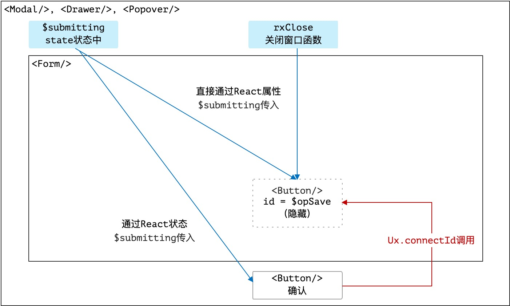

> 有草焉，其状如葵，其臭如靡芜，名曰杜蘅，可以走马，食之已瘿。——《西山经》

* 项目地址：<https://github.com/silentbalanceyh/vertx-ui/>

&ensp;&ensp;&ensp;&ensp;本文讲解一下Zero Ui中的一大配置亮点：**属性解析器**，属性解析器设计的初衷在于减少配置数据的书写，通过简化可让开发人员大面积缩减JSON配置体积，简化配置格式在开发过程中会十分有用。

# 「壹」基本概念

## 1.1.解析目的

&ensp;&ensp;&ensp;&ensp;假设系统中存在配置：

```json
{
    "dataIndex": "name",
    "title": "标题",
    "$render": "DATUM",
    "sorter": true
}
```

&ensp;&ensp;&ensp;&ensp;如果写成属性解析器可解析的格式如：

```json
{
    "metadata": "name,标题,DATUM,true"
}
```

&ensp;&ensp;&ensp;&ensp;更简化的模式可直接把某个节点写成字符串：

```json
"name,标题,DATUM,true"
```

&ensp;&ensp;&ensp;&ensp;这种模式下，大段Json格式的数据会被直接压缩，长度只有原来的25%左右（**属性越多的组件，最终压缩出来的体积越小！**），这就是属性解析器带来的配置层面的一种便利，而比较繁琐的一点是您必须知道此处的`name,标题,DATUM,true`代表什么。

## 1.2.写法和场景

&ensp;&ensp;&ensp;&ensp;Zero UI中的属性配置的写法主要分三种：

1. 完全模式（不启用属性解析器）
2. 标准模式（可附加额外配置的书写方式）
3. 字符串模式（不带附加配置）

&ensp;&ensp;&ensp;&ensp;**完全模式**就是完整的JSON参考格式，也属于传统意义上的完整模式，这种模式下不会触发属性解析器，是人最容易阅读的格式，完整格式参考如（示例为表格列）：

```json
{
    "dataIndex": "name",
    "title": "标题",
    "$render": "DATUM",
    "sorter": true
}
```

&ensp;&ensp;&ensp;&ensp;**标准模式**的写法如下：

```json
{
    "metadata": "name,标题,DATUM,true,,attr3=z",
    "attr1": "x",
    "attr2": "y"
}
```

&ensp;&ensp;&ensp;&ensp;标准模式中必须带上`metadata`节点数据用以标识，当完全模式和标准模式同时出现时完全模式的优先级更高，系统会优先使用完全模式中的数据。

&ensp;&ensp;&ensp;&ensp;**字符串模式**最简单，直接书写成：

```json
"name,标题,DATUM,true,,attr3=z"
```

&ensp;&ensp;&ensp;&ensp;这种模式主要是为了提供更加便利的书写模式，该书写模式中`attr3`之后的部分用于处理`$KV`默认属性的解析。

> 不论哪种模式最终解析出来的配置格式都是**完全模式**的格式。

## 1.3.拉平语法

&ensp;&ensp;&ensp;&ensp;拉平语法主要用于书写配置中简化JSON的深度，对树的叶节点的模式实现深度压缩的过程，如下边示例，基本格式为：

```json
{
    "optionJsx":{
        "style":{
            "height":300
        },
        "config":{
            "title":[
                "left",
                "right"
            ]
        }
    }
}
```

&ensp;&ensp;&ensp;&ensp;拉平后的处理格式如：

```json
{
    "optionJsx.style.height": 300,
    "optionJsx.config.title": [
        "left",
        "right"
    ]
}
```

&ensp;&ensp;&ensp;&ensp;拉平过程中，您可以在任意节点处理拉平语法，即上述格式也可以写成：

```json
{
    "optionJsx":{
        "style.height": 300,
        "config.title": [
            "left",
            "right"
        ]
    }
}
```

&ensp;&ensp;&ensp;&ensp;**属性解析器**的目的是在某种数据结构中简化配置，以实现对封装组件的基础写法而不用开发人员去考虑前端组件的基本细节，这种封装带来的直接福利就是开发人员无脑书写特定界面，而无需去管理组件状态、属性，如表单的防重复提交、列表的自动刷新、窗口的隐藏和显示等系列前端效果都可以由Zero Ui完成。

# 「贰」常用解析器

&ensp;&ensp;&ensp;&ensp;本章讲解属性解析器的常用场景，并且让开发人员了解Zero Ui中哪些界面使用了**属性解析器**

1. 属性定义源码文件：`src/ux/engine/expression/I.definition.js`。
2. 常用解析源码文件：`src/ux/engine/expression/O.apply.js`

## 2.1.窗口解析器

&ensp;&ensp;&ensp;&ensp;Zero Ui中的窗口解析器主要分三种：

1. 弹出窗口，对应Ant Design中的`<Modal/>`组件。
2. 抽屉窗口，对应Ant Design中的`<Drawer/>`组件。
3. 浮游窗口，对应Ant Design中的`<Popover/>`组件。

&ensp;&ensp;&ensp;&ensp;讲解这部分配置之前，先看看Zero Ui中**外层窗口**和**内层表单**的交互，H5中已经支持提交按钮（可以是`<button/>`，也可以是`<input/>`）在表单`<form/>`之外，但由于Zero Ui最早开发时H5规范还没落地，所以使用了最原生态的HTML的做法。先看窗口中的结构图：



1. 窗口和内部表单会形成一个**父子继承**结构
2. 外层窗口有两个核心变量：
    1. `$visible`用来控制窗口的显示和隐藏，`rxClose`触发时会将该变量设置成`false`
    2. `$submitting`用来控制表单的**防重复提交**，点击提交按钮之后按钮会处于加载（`loading = true`）状态。
3. 整个结构中有两个按钮
    1. 内层为表单的**提交按钮**，带`id`属性（示例中`id = $opSave`），该按钮是隐藏起来的，用户不可见。
    2. 外层为窗口中的**确认按钮**，该按钮会调用`Ux.connectId`实现**提交按钮**的点击事件。
4. `rxClose`函数作为窗口的关闭函数，会传入到表单中，当表单提交完成之后，可以直接触发关闭操作（并还原防重复提交的状态）：`$visible = false, $submitting = false`。