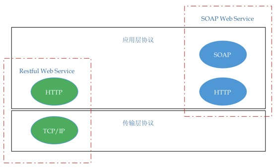

# 四叶葎：Http方法

> &ensp;&ensp;&ensp;&ensp;东风袅袅泛崇光，香雾空蒙月转廊。只恐夜深花睡去，故烧高烛照红妆。——苏轼《海棠》

* 项目地址：<https://github.com/silentbalanceyh/vertx-zero-example/>（子项目：**up-apollo**）

## 「壹」浅谈RESTful

&ensp;&ensp;&ensp;&ensp;首先，读者需要知道：**RESTful是一种架构风格，又称为架构指导规范，不是标准**——注意最后一句话，它和我们熟知的**XML、SOAP**
标准不可同日而语。简单说，RESTful不是标准，它只是一种架构风格，也是随着最近几年的SOA架构流行而风靡起来的。

### 1.1. SOAP vs RESTful

&ensp;&ensp;&ensp;&ensp;RESTful作为一种新的架构风格，它和传统意义上常用的SOAP有什么区别呢？首先读者需要排除一些误区：

1. 使用了HTTP方法中的`PUT/DELETE`就叫做RESTful（错的）。
2. 使用了Json数据格式就是RESTful，而Xml数据格式就是SOAP（错的）。

&ensp;&ensp;&ensp;&ensp;SOAP全称为Simple Object Access
Protocol——简单对象访问协议，它是用来描述Web服务消息格式的一种规范，基于XML标准定制，在这种Web服务中，所有的通信格式都是XML的。

&ensp;&ensp;&ensp;&ensp;RESTful又称为REST、全称为Representational State Transfer——表述性状态传递，它是Roy
Fielding博士在2000年中的博士论文中提出来的一种软件架构风格，相比于SOAP，它可以降低开发复杂度，提高系统的可伸缩性。



&ensp;&ensp;&ensp;&ensp;简单说，二者真正的区别在——是否对HTTP协议进行了语义上的表述。HTTP协议是应用层协议，设计它的最初目的就是面向应用的标准网络协议。SOAP在表述语义上，并没有使用HTTP协议的语义，而是定义了自己的`SOAPHeader、SOAPBody、Envelop`
等节点，而这种情况下，SOAP把HTTP协议当做了：“传输层”协议在使用，“应用语义”却隐藏于SOAP规范之中。相反REST回归到HTTP协议的本源，它完全围绕着HTTP协议本身来设计，而不是重新封装，包括设计时去考虑客户端偏好、服务端偏好、条件查询、查询缓存，HTTP幂等性等——这都是REST应用设计对开发人员的挑战。

### 1.2. 幂等性

&ensp;&ensp;&ensp;&ensp;HTTP协议的幂等性（Idempotence）在原生定义中如下：

> Methods can also have the property of "idempotence" in that (aside from error or expiration issues) the side-effects of N > 0 identical requests is the same as for a single request.

&ensp;&ensp;&ensp;&ensp;读者需要理解两点：

* HTTP协议的幂等性原本不是为了REST的Web服务设计的，而是为了分布式计算设计的。
* 它定义了这样一种特性：针对某一个API，一次请求和多次（n）请求应该具有同样的副作用和结果。

&ensp;&ensp;&ensp;&ensp;HTTP协议的原生方法对幂等性的描述如下：

| 方法名 | 幂等性 |
|---|:---|
| GET | 是 |
| HEAD | 是 |
| OPTIONS | 是 |
| DELETE | 是 |
| PUT | 是 |
| POST | 否 |

&ensp;&ensp;&ensp;&ensp;简单说在HTTP常用的方法中，只有`POST`方法天生就不具有幂等性，而我们可以在实现上采取另外的技巧去解决它的这个缺陷。

&ensp;&ensp;&ensp;&ensp;关于幂等性的场景，举个例子——当你发送请求：`GET http://www.bank.com/account/123456`，该请求不会改变资源状态，调用一次和调用N次的结果相同，所以是没有副作用的。——这里Todd Wei也强调了，调用N次不影响不是说每次GET的数据结果相同（123456这条记录的数据有可能更新过），而是资源的语义，`
账号=133456 的账号信息`，不论一次还是多次，它的这种对状态的表述语义不发生变化。

<hr/>

## 「贰」Zero中的Http方法

### 2.1. 初识

&ensp;&ensp;&ensp;&ensp;Zero是如何实现RESTful中不同的HTTP方法的呢？先看下边代码：

```java
package cn.vertxup.micro.method;

import io.vertx.core.json.JsonObject;
import io.vertx.up.annotations.EndPoint;

import javax.ws.rs.GET;
import javax.ws.rs.Path;
import javax.ws.rs.QueryParam;

@EndPoint
public class GetAgent {
    /*
     * 返回值：
     * {
     *     "data": {
     *         "name": ???
     *     }
     * }
     */
    @GET
    @Path("/hi/method/get-first")
    public JsonObject sayGet(@QueryParam("name") String name){
        final JsonObject response = new JsonObject();
        response.put("name", name);
        return response;
    }
}
```

&ensp;&ensp;&ensp;&ensp;上边代码实现了Http方法中的GET方法，当您使用工具postman测试的时候，就可以得到对应的响应结果，并且在启动zero容器时可以看到如下输出：

```shell
[ μηδέν ] ( Uri Register ) "/hi/method/get" has been deployed by ZeroHttpAgent, Options = ...
```

&ensp;&ensp;&ensp;&ensp;注意上边的方法定义中是可以传入`name`参数的，如果发送请求地址改成：`/hi/method/get-first?name=Lang`，那么将会得到如下输出：

```json
{
    "data": {
        "name": "Lang"
    }
}
```

&ensp;&ensp;&ensp;&ensp;`@QueryParam`是`JSR311`中的标准注解，zero对标准注解的使用方法是完全支持的，不仅如此，还扩展了原生注解用于更多`业务类`场景的数据规范，这些内容将在参数章节单独介绍。

### 2.2. 完整例子

再看一个比较完整的例子：

```java
package cn.vertxup.micro.method;

import io.vertx.core.json.JsonObject;
import io.vertx.up.annotations.EndPoint;

import javax.ws.rs.*;

@EndPoint
public class FourAgent {
    /*
     * 返回值：
     * {
     *     "data": {
     *         "name": ???
     *     }
     * }
     */
    @GET
    @Path("/hi/method/get")
    public JsonObject sayGet(@QueryParam("name") final String name) {
        final JsonObject response = new JsonObject();
        response.put("name", name);
        return response;
    }

    /*
     * 返回值：
     * {
     *     "data": {
     *         ???
     *     }
     * }
     */
    @POST
    @Path("/hi/method/post")
    public JsonObject sayPost(@BodyParam final JsonObject body) {
        final JsonObject response = new JsonObject();
        response.mergeIn(body, true);
        return response;
    }

    /*
     * 返回值：
     * {
     *     "data": {
     *         "key": "???",
     *         ???
     *     }
     * }
     */
    @PUT
    @Path("/hi/method/put/:id")
    public JsonObject sayPut(@BodyParam final JsonObject body,
                             @PathParam("id") final String id) {
        final JsonObject response = new JsonObject();
        response.mergeIn(body, true);
        response.put("key", id);
        return response;
    }

    /*
     * 返回值：
     * {
     *     "data": {
     *         "deleted": ???
     *     }
     * }
     */
    @DELETE
    @Path("/hi/method/delete/:id")
    public JsonObject sayDelete(@PathParam("id") final String id) {
        final JsonObject response = new JsonObject();
        response.put("deleted", id);
        return response;
    }
}
```

&ensp;&ensp;&ensp;&ensp;开发了上述接口过后，可以使用`Postman`对每个接口进行单独测试，分别得到对应注释中的响应结果，注意此处对于`PUT/DELETE`使用了`@PathParam`
，该注解也属于JSR311，唯一不同的是：`@BodyParam`**并不是JSR311中的注解，它是zero框架中的扩展注解，除开这些注释外zero还扩展了更多JSR311中的注解，形成统一规范的“框架协议”**
——通常Body参数只在`POST`和`PUT`方法中使用，而不在`GET/DELETE`中使用。

### 2.3. 关于GET/DELETE的Body问题

&ensp;&ensp;&ensp;&ensp;通常来讲，HTTP协议中的`GET/DELETE`是不推荐带Body的，但是为了满足业务场景的需求，zero定义了两种特殊的注解扩展`JSR311`
，在zero中，不论是`GET/DELETE`还是其他方法，只要使用了下边介绍的注解，都可以直接读取到Http中的`Body`数据（再强调一遍，**下边的方法在JSR311规范中是不存在的**）。

* `javax.ws.rs.BodyParam`：处理字符流请求体数据。
* `javax.ws.rs.StreamParam`：处理字节流请求体数据（一般用于上传下载）。

> zero中对于第三方开源项目的扩展，全部写在第三方的原始包中，这样可能会对读者产生误解，但这种方式更容易说明框架内部某些第三方插件的源头，如扩展的JSR311在`javax.ws.rs`包中，扩展的Jackson在`com.fasterxml.jackson.databind`包中。

参考下边代码：

```java
package cn.vertxup.micro.method;

import io.vertx.core.json.JsonObject;
import io.vertx.up.annotations.EndPoint;

import javax.ws.rs.BodyParam;
import javax.ws.rs.DELETE;
import javax.ws.rs.GET;
import javax.ws.rs.Path;

@EndPoint
public class BodyAgent {
    /*
     * 返回值：
     * {
     *     "data": {
     *         ???
     *     }
     * }
     */
    @GET
    @Path("/hi/body/get")
    public JsonObject sayPost(@BodyParam final JsonObject body) {
        final JsonObject response = new JsonObject();
        response.mergeIn(body, true);
        return response;
    }

    /*
     * 返回值：
     * {
     *     "data": {
     *         ???
     *     }
     * }
     */
    @DELETE
    @Path("/hi/body/delete")
    public JsonObject sayDelete(@BodyParam final JsonObject body) {
        final JsonObject response = new JsonObject();
        response.mergeIn(body, true);
        return response;
    }
}
```

&ensp;&ensp;&ensp;&ensp;通过`Postman`发送请求则可以得到注解中的响应数据。

## 「叁」常用错误响应表

&ensp;&ensp;&ensp;&ensp;zero 框架在处理一些常见的通用请求时，对容错系统进行了重新设计，如何处理容错信息我会在后边的教程中逐步说明，但是 zero 针对通常会出现的业务场景错误信息会有统一的数据规范。

### 404

&ensp;&ensp;&ensp;&ensp;zero 没有对默认的 404 定制过，如果发送请求，该资源不存在，那么会直接使用 `vert.x` 中的默认定义，返回下边的HTML片段：

```xml
<html>

<body>
	<h1>Resource not found</h1>
</body>

</html>
```

### 405

&ensp;&ensp;&ensp;&ensp;如果请求资源有数据，但使用的方法不当，那么会直接返回下边信息：

1. 状态代码 405
2. 状态信息 Method Not Allowed
3. 返回的 Http 响应体为空

### 400

&ensp;&ensp;&ensp;&ensp;如果请求格式和定义格式不相同，那么会直接返回下边内容：

1. 状态代码 400
2. 状态信息 Bad Request

&ensp;&ensp;&ensp;&ensp;返回的Http响应体为：

```json
{
    "code": -60004,
    "message": "[ERR-60004] (JsonObjectSaber) Web Exception occus: (400) - Zero system detect conversation from \"\" to type \"class io.vertx.core.json.JsonObject\", but its conflict."
}
```

### 500

&ensp;&ensp;&ensp;&ensp;如果出现了常用的 500 异常，则直接返回下边内容：

1. 状态代码 500
2. 状态信息 Internal Server Error

&ensp;&ensp;&ensp;&ensp;返回的Http响应体为：

```json
{
    "code": -60007,
    "message": "[ERR-60007] (Envelop) Web Exception occus: (500) - The system detected internal error, contact administrator and check details = For input string: \"HX\"."
}
```

> 注，message中包含了异常的详细信息，而且在后端日志中可以看到对应的异常堆栈日志。

## 「肆」总结

&ensp;&ensp;&ensp;&ensp;本章我们主要学习 zero 中如何处理RESTful常用的四种基本请求：`@GET, @POST, @DELETE, @PUT`，这是很多开发人员的常用需求，并且简单谈到了 RESTful 的
Web服务的基本概念。

> 四叶葎别称四角金，叶四片轮生，影射到四种 Http 方法中，这四种方法也是 RESTful 开发中常用的方法。