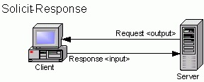
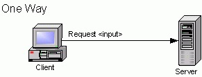
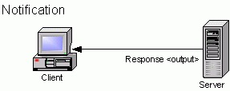
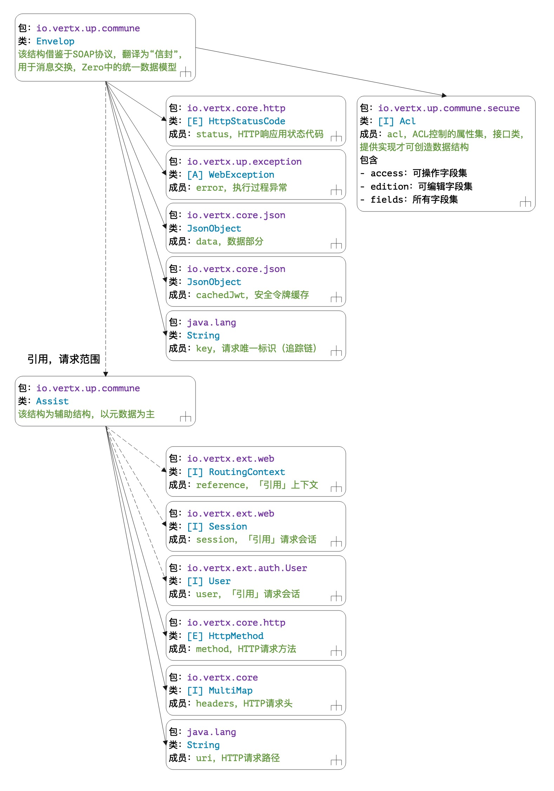
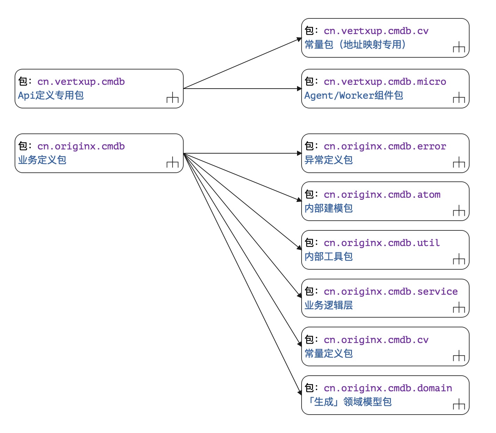

# 潘多拉魔盒：异步

> 敕勒川，阴山下。天似穹庐，笼盖四野。天苍苍，野茫茫，风吹草低见牛羊。 ——南北《敕勒歌》

* 项目地址：<https://github.com/silentbalanceyh/vertx-zero-example/>（子项目：**up-rhea**）

## 「壹」异步原理

&ensp;&ensp;&ensp;&ensp;到目前为止，所有的代码示例都是**同步（Sync）**的，代码并没有真正释放Zero框架和Vert.x的魔力，本章节就是彻底地放飞，把这个**潘多拉**
魔盒打开。在Vert.x中，我们通常会把一份数据、一个包含数据的请求统称为Event（事件），所以本章将会讲解Zero中最核心的内容——事件驱动模型（Event Drivent Model）。

### 1.1. 风格综述

&ensp;&ensp;&ensp;&ensp;在网络消息交互模式中，通常会有下边四种（参考WSDL规范）：

* Request-Response：请求/响应模式。
  
* Solicit-Response：发布/订阅模式。
  
* One-Way：单向请求模式。
  
* Notification：提醒模式。
  

> 图片引用地址：<https://help.perforce.com/hydraexpress/4.3.0/html/rwsfexpwsfabricationug/9-2.html>

&ensp;&ensp;&ensp;&ensp;Zero中针对上述四种模式分成了四种类型：

|名称|模式|使用场景|
|---|---|:---|
|标准流|Request-Response|「高频」通常使用的RESTful API。|
|单向流|One-Way|不关心任何请求结果的RESTful API。|
|检测流|One-Way|检测远程服务器是否合法（通常仅发送Header请求）。|

> 由于Solicit-Response模式和Notification模式都是服务端主动触发，这两种模式目前Zero的版本还不支持（和作者接触的项目需求有关）。

&ensp;&ensp;&ensp;&ensp;Zero中对编程风格的划分主要基于三个维度：

1. Java语言：是interface类还是class类。
2. Vert.x工具集：是否启用EventBus。
3. WSDL规范：是否关心响应。

&ensp;&ensp;&ensp;&ensp;本章之后章节会讲解**八种风格**中Zero推荐和高频使用的编程风格。

### 1.2. Zero模式

&ensp;&ensp;&ensp;&ensp;Vert.x中的Verticle组件主要分为两种类型：EventLoop和Worker，根据这两类组件的特征，最终Zero对组件职责进行了重新定义：

|线程类型|组件名|Lambda组件|含义/职责|
|---|:---|:---|:---|
|EventLoop|Agent组件|发送者Sender|接收请求、同步执行、发送异步请求到EventBus|
|Worker|Worker组件|消费者Consumer|消费EventBus请求、异步执行、生成响应|

&ensp;&ensp;&ensp;&ensp;Zero最终支持五种核心的请求模式。

#### 1.2.1. Sync - 同步模式

**流程图**


**代码**

```java
    @GET
    @Path("/sync")
    public String doSync(
            @QueryParam("name") final String name
    ) {
        return "Hi + " + name;
    }
```

**限制规则**

* 方法定义的返回类型（return）**不能是**`void`。
* 不使用`@Address`注解（Zero专用注解`io.vertx.up.annotations.Address`）。

#### 1.2.2. Ping - 信号模式

**流程图**


**代码**

```java
    @GET
    @Path("/ping/{name}")
    public void doPing(
            @PathParam("name") final String name) {
        System.out.println("Ping Request");
    }
```

**限制规则**

* 方法定义的返回类型（return）**必须是**`void`。
* 该方法只会收到类似`true/false`的响应信息，并不会得到任何和**代码逻辑**相关的响应数据。

#### 1.2.3. OneWay - 单向模式

**流程图**


**代码：Sender发送者**

```java
    @POST
    @Path("/one-way")
    @Address("ZERO://ONE-WAY")
    public String sendOneWay(
            @BodyParam final JsonObject json) {
        return json.encode();
    }
```

**代码：Consumer消费者**

```java
    @Address("ZERO://ONE-WAY")
    public void reply(final Envelop message) {
        final JsonObject data = Ux.getJson(message);
        // Do somethings
        System.out.println(data.encodePrettily());
    }
```

**限制规则**

* 该模式中使用了Zero的三个核心注解：
    * Agent组件：`io.vertx.up.annotations.EndPoint`。
    * Worker组件：`io.vertx.up.annotations.Queue`。
    * EventBus地址：`io.vertx.up.annotations.Address`。
* EndPoint注解的Agent组件方法不能使用`void`的返回值。
* Worker签名必须符合Zero中的Worker方法签名规范，并且返回值**必须是**`void`。

#### 1.2.4. Standard - 标准模式

**流程图**


**代码：Sender发送者**

```java
    @POST
    @Path("/async")
    @Address("ZERO://ASYNC")
    public String sendAsync(
            @BodyParam final JsonObject json) {
        return json.encode();
    }
```

**代码：Consumer消费者**

```java
    @Address("ZERO://ASYNC")
    public Envelop replyAsync(final Envelop message) {
        final JsonObject data = Ux.getJson(message);
        // Do somethings
        return Envelop.success(data);
    }
```

**限制规则**

* 该模式中使用了Zero的三个核心注解：
    * Agent组件：`io.vertx.up.annotations.EndPoint`。
    * Worker组件：`io.vertx.up.annotations.Queue`。
    * EventBus地址：`io.vertx.up.annotations.Address`。
* EndPoint注解的Agent组件方法不能使用`void`的返回值。
* Worker签名必须符合Zero中的Worker方法签名规范，并且返回值**不能是**`void`。

#### 1.2.5. Callback - 回调模式

**流程图**


**代码：Sender发送者**

```java
    @Path("/callback")
    @POST
    @Address("ZERO://CALLBACK")
    public JsonObject sayCallback(
            @BodyParam final JsonObject data) {
        return data;
    }
```

**代码：Consumer消费者**

```java
    @Address("ZERO://CALLBACK")
    public void replyCallback(final Message<Envelop> message) {
        message.reply(Envelop.success("Callback Success"));
    }
```

**限制规则**

* 该模式中使用了Zero的三个核心注解：
    * Agent组件：`io.vertx.up.annotations.EndPoint`。
    * Worker组件：`io.vertx.up.annotations.Queue`。
    * EventBus地址：`io.vertx.up.annotations.Address`。
* EndPoint注解的Agent组件方法不能使用`void`的返回值。
* Worker签名是固定签名规范，返回值**必须是**`void`。

> 可下载完整代码后，参考up-rhea项目。

## 「贰」统一模型

&ensp;&ensp;&ensp;&ensp;上述原理解析过程中，图解和代码十分容易理解，稍显复杂的是Zero中定义的**统一数据模型**：`io.vertx.up.commune.Envelop`
，该模型充斥在整个Zero环境中，并且可直接在EventBus中传输（重写过Codec），于是它的数据结构就值得我们细细分析了——该数据模型融合了Request-Response过程中所有牵涉的核心数据，成为Zero框架中序列化子系统的核心内部传输模型（下文统一翻译“信封”）。

### 2.1. 数据结构

&ensp;&ensp;&ensp;&ensp;它的核心结构如下：



&ensp;&ensp;&ensp;&ensp;说明几点：

1. 虚线箭头为「引用」，仅保存了某个复杂Java对象引用，虽然当前**信封**是请求域内的数据消息，但所有**引用**类型对象是单次请求内跨**所有信封**
   而实现共享——微服务RPC传输、完美转发等所有内部逻辑中会拷贝Envelop而生成新的**信封**，但会保留最初的请求信息。
2. Assist中存储的大部分内容为请求的元数据，由于它是包域，所以不推荐开发人员直接使用，为内部对象，它主要包括：
    * 上下文环境
    * 当前会话
    * 登录用户基本信息
    * HTTP方法和uri地址
    * HTTP请求头
3. Acl在使用时必须提供额外的实现，在`zero-rbac`中提供了`io.vertx.tp.rbac.atom.acl.AclData`实现，有兴趣的读者可以参考它的源代码。该数据结构中的access, edition,
   fields等信息可自定义，最终根据实现代码决定。

### 2.2. 常用API

&ensp;&ensp;&ensp;&ensp;在分析了Envelop本身的数据结构后，再根据部分场景来看它对应的API相关应用。

> Java Bean规范类型的API列表格说明，用于设置获取，就不详细解析了。

#### 2.2.1. 构造Envelop

&ensp;&ensp;&ensp;&ensp;Envelop没有提供`public`的构造方法，在构造Envelop对象过程中只能使用该类中定义的静态API；不论是**同步**还是**异步**
模式，最终都会绑定一个HTTP状态（状态代码和描述文字），Envelop的内部构造函数如：

```java
// 成功的信封
private <T> Envelop(final T data, final HttpStatusCode status)
// 错误的信封
private Envelop(final WebException error)
```

&ensp;&ensp;&ensp;&ensp;根据它的使用场景，有七个常用的静态构造API：

```java
// 状态代码，数据内容
// 成功的信封
Envelop.ok();                             // 204, null
Envelop.okJson();                         // 200, {}
Envelop.success(T);                       // 「常用」200, {}, {}为序列化过后的Json
Envelop.success(T,HttpStatusCode);        // ??, {}, 重载方法，可设置非200的状态代码
// 失败的信封，这种类型的数据部分为WebException序列化后的结果，验证章节提过的异常结构。
Envelop.failure(String);                  // 500, {}, 
Envelop.failure(Throwable);               // 「常用」500, {}，将JVM异常封装
Envelop.failure(WebException);            // 「常用」??, {}, WebException中自带Http状态代码
```

#### 2.2.2. 数据操作

&ensp;&ensp;&ensp;&ensp;Envelop对象的**数据操作**类API主要分为三种核心操作：

1. 合法性检测
2. 数据读取
3. 数据修改

&ensp;&ensp;&ensp;&ensp;Zero前端接收到的请求数据最终会以JSON格式存储在Envelop对象中，直接消费Envelop对象的组件通常是Worker组件（前文提到的消费者Consumer）并非Agent组件，标准模式下一个Worker中的方法定义如：

```java
public Envelop doAsync(Envelop envelop);
```

##### 1）合法性检测

&ensp;&ensp;&ensp;&ensp;**合法性检测**是最简单的API，由于一个信封会分为：成功和失败两种，所以合法性检测类的API主要用于检查当前信封是否是一个成功的信封。成功和失败的定义如下：

* 成功：当前请求执行过程中没有出现任何意料之外的错误，内部`error`为空。
* 失败：执行过程出现了不可预知的错误，内部`error`为一个合法的`WebException`异常。

```java
// 检查当前Envelop是否成功
public boolean valid()
// 读取当前Envelop中生成的WebException
public WebException error()
```

&ensp;&ensp;&ensp;&ensp;一个Envelop对象只有在构造时（`Envelop.failure`）可设置内部的WebException，被构造成**失败的信封**
后，该Envelop对象不可再更改WebException——用业务语义解释就是：一旦出错就只能生成异常响应。

##### 2）数据读取

&ensp;&ensp;&ensp;&ensp;**数据读取**包含了四个方法：

```java
/*
 * 直接读取内置`data`节点的数据，该方法会执行二选一
 * 1. 如果包含`data`节点，则直接读取`data`节点
 * 2. 如果不包含`data`节点，则读取当前Json（此种情况可直接调用body()）
 */
public <T> T data()
/*
 * 直接读取请求数据并转换成输入的clazz类型执行Pojo反序列化
 * 该API通常在执行Java类的反序列化时使用。
 */
public <T> T data(Class<T> clazz)
/*
 * 在使用interface模式读取参数时，针对方法中定义的参数索引进行不同类型的数据提取
 * 该API的clazz可以是常用的Java类型（和接口中定义的一致），interface模式是一个比较特殊
 * 的模式，这种模式下@EndPoint注解用来注解接口而不是类。
 */ 
public <T> T data(Integer argIndex, Class<T> clazz)
/*
 * 最简单直接的JsonObject请求数据提取，如果读者想自己操作原始数据，则可以调用
 * 该API来读取相关数据。
 */ 
public JsonObject body()
```

> Envelop的数据提取是在Worker中发生，一般情况除非是同步模式的代码，否则在Agent组件中不会操作Envelop，所以读者要有一个基本的认知：一旦开始使用Envelop，就意味着你开始执行异步模式，引入了Worker组件开发。

##### 3）数据修改

&ensp;&ensp;&ensp;&ensp;Envelop中的数据修改包含三个方法：

```java
// 直接在原始数据（body() 返回结果）中追加 field = value 键值对
public void valueOn(String field, Object value)
// 非interface模式下，或interface模式下的主体JsonObject中直接追加 field = value 键值对
public void value(String field, Object value)
// interface模式下，针对Json以及函数签名索引设置 field = value 键值对
public void value(Integer integer, String field, Object value) 
```

&ensp;&ensp;&ensp;&ensp;数据修改需说明的是`Object value`必须是Vert.x中JsonObject内部支持的数据类型，不支持的类型如`LocalDateTime, LocalDate`
等无法直接设置，会报错。

#### 2.2.3. 拷贝Envelop

&ensp;&ensp;&ensp;&ensp;虽然这里用了**拷贝**一词，严格说是不够严谨的，本小节提到的所有API都**不拷贝数据**，而是拷贝`Envelop`
中的元数据，如`Assist, RoutingContext, User`
等等；在Vert.x中，Worker组件本身是无法得到任何和RoutingContext相关数据的，除非开发人员在EventBus中传入了相关数据信息，否则无法在Worker组件中拿到任何请求过程中的Web对象——**
Zero的Envelop解决了这个问题**。

##### 1）核心拷贝

&ensp;&ensp;&ensp;&ensp;核心拷贝API的图如下：


```java
// 和RoutingContext绑定，为当前Envelop设置元数据，返回值为当前Envelop
public Envelop bind(RoutingContext context)
// 将当前Envelop中的数据拷贝到Envelop中，返回传入的Envelop
public Envelop to(Envelop to)
// 从传入的Envelop中拷贝数据，是to的逆向操作
public Envelop from(Envelop from)
```

> 这些API的基本思路——最终返回的Envelop都是拷贝的目标对象。

##### 2）查询引擎

&ensp;&ensp;&ensp;&ensp;查询引擎类的API只能修改两个查询参数`criteria`和`projection`：

```java
// 修改查询参数中的 projection（追加模式）
public void onProjection(JsonArray projection)
// 修改查询参数中的 projection（替换模式）
public void inProjection(JsonArray projection)
// 修改查询参数中的 criteria（追加模式）
public void onCriteria(JsonObject criteria)
// 修改查询参数中的 criteria（替换模式）
public void inCriteria(JsonObject criteria)
```

&ensp;&ensp;&ensp;&ensp;核心规则：

1. 修改projection过程中，系统自动实现去重，会生成最后的列过滤字段集合。
2. 修改criteria时，Zero会检测查询语法树进行同条件合并（复杂运算，树算法）。

##### 3）安全和头

&ensp;&ensp;&ensp;&ensp;Envelop中和安全相关的API有四类：

1. 设置追踪唯一标识，可执行**追踪链**功能。
2. 存储`vertx-auth`项目中的`io.vertx.ext.auth.User`引用，并且提供了Jwt令牌的快速读写以及User中存储的**principal**的快速读写（实现依赖安全部分的开发）。
3. 扩展了原始的HTTP头方法，提供`X-`前缀的自定义头的参数转换。
4. 读写Zero中定义的`io.vertx.up.commune.secure.Acl`权限控制对象（实现依赖安全部分的开发）。

&ensp;&ensp;&ensp;&ensp;安全相关的API如下：

|函数签名|读|写|含义|
|---:|---|---|:---|
|Envelop key(String)|x|o|设置信封的唯一标识字符串。|
|String key()|o|x|读取信封的唯一标识字符串。|
|Envelop acl(Acl acl)|x|o|设置信封绑定的Acl对象。|
|Acl acl()|o|x|读取信封绑定的Acl对象。|
|void user(User)|x|o|设置信封绑定的User对象。|
|MultiMap headers()|o|x|读取信封中请求的HTTP Header集合。|
|void headers(MultiMap)|x|o|设置信封中请求的HTTP Header集合。|
|String jwt()|o|x|读取Token的字符串。|
|String jwt(String)|o|x|从Token中读取数据信息。|
|String identifier(String)|o|x|从User的附加信息principal中读取数据信息。|

&ensp;&ensp;&ensp;&ensp;请求头的数据，为简化Extension扩展模块的开发，所以Envelop提供了一个特殊的API：

```java
public JsonObject headersX()
```

&ensp;&ensp;&ensp;&ensp;该API会返回一个完整的JsonObject，它包含了四个键值`appId, appKey, sigma, language`，分别对应下边表格中的自定义请求头。

|自定义头|Json属性名|含义|
|---|---|:---|
|X-Sigma|sigma|多租户标识符。|
|X-Lang|language|多语言标识符。|
|X-App-Id|appId|多应用标识符。|
|X-App-Key|appKey|多应用标识符（敏感信息专用）。|

##### 4）设置获取

&ensp;&ensp;&ensp;&ensp;本小节提到的方法可能和前一小节有些重复，主要是枚举所有和设置获取相关的成对方法，注意`0.5.4`版和`0.6.0`版本的区别（表格中旧版为`0.5.4`版）。

|对象类型|设置获取|旧版`0.5.4`|
|---:|---|---|
|String|key(String) <br/> key()|key(String)|
|Acl|acl(Acl)  <br/> acl()|acl(Acl)|
|HttpStatusCode|无  <br/> status()|无|
|User|user(User) <br/> user()|setUser(User) |
|MultiMap|headers(MultiMap) <br/> headers()|setHeaders(MultiMap)|
|Session|session(Session) <br/> session()|setSession(Session) <br/> getSession()|
|HttpMethod|method(HttpMethod) <br/> method()|setMethod(HttpMethod) <br/> getMethod()|
|String|uri(String) <br/> uri()|setUri(String) <br/> getUri()|
|RoutingContext|无 <br/> context()|无|
|Map<String,Object>|context(Map<String,Object>) <br/> context(String, Class)|setContext(Map<String,Object>)|

&ensp;&ensp;&ensp;&ensp;新版在旧版中的改动主要是**设置**
函数，获取数据的方法没有任何更改，这种改动主要是应用Java语言设计中的方法重载，简化API方法名，并且摒弃曾经比较繁琐的JavaBean规范相关方法（set/get等）。

##### 5）响应格式

&ensp;&ensp;&ensp;&ensp;响应格式的API只有三个方法：

```java
// 以String字符串的内容格式作为最终输出
public String outString()
// 以JsonObject的Json对象格式作为最终输出
public JsonObject outJson()
// 以二进制字节流作为最终的格式输出（文件流、上传、下载）
public Buffer outBuffer()
```

#### 2.2.4. 参数规范

&ensp;&ensp;&ensp;&ensp;浅析过Envelop的数据结构和核心API，本小节补充几个示例来演示内部Json的格式变化，称这部分内容为**参数规范**
，是因为不同的场景中，格式的变化、演化、区分都是由Zero框架来完成的。

##### 1）隐藏键值

&ensp;&ensp;&ensp;&ensp;隐藏键值为Zero定义的内部属性值，分别在Zero内部承担着不同的职责，所有隐藏键值定义于`io.vertx.up.eon.ID`中。

**请求缓存`$$PARAM_CONTENT$$`**


&ensp;&ensp;&ensp;&ensp;**工作原理**：参考上图，在Vert.x中读取请求数据时，`RoutingContext`中`getBody**`
类的方法只能调用一次（底层是流模式，一旦流数据被消费，通道会被关闭，不可执行二次读取），但往往在实际项目中处理参数时会包含部分**预处理**
逻辑，如：验证、过滤、规范化等。为解决此问题，Zero中设计了请求缓存，请求缓存帮助Zero执行参数规范化，步骤如下：

1. 参数来源主要分五种：查询参数（Query）、路径参数（Path）、请求体（Body）、请求头（Header）、自定义，规范化的第一步是将五种不同来源的参数合并到一个Json中。
2. 如果存在Zero扩展的验证器（非Hibernate Validator基础验证），对合并过后的Json数据进行验证，检查是否生成400（Bad Request）响应。
3. 如果存在JSR340中的过滤器，修改了参数，则将修改过后的参数回写到`$$PARAM_CONTENT$$`中。
4. 若存在其他扩展自定义操作，则执行完成后都可回写到`$$PARAM_CONTENT$$`中。

&ensp;&ensp;&ensp;&ensp;注意：

1. 请求缓存执行的任何代码逻辑都在**第一次**调用`RoutingContext`的`next()`之前。
2. 执行完请求缓存的代码后，请求数据处于可构造Envelop模型的阶段（已完成了基本标准化），换句话说，`$$PARAM_CONTENT$$`存储的是合法的原始请求。

**Mime分流器**

&ensp;&ensp;&ensp;&ensp;Mime分流器有两个隐藏键值：

* `$$DIRECT$$`：对应`MimeFlow.RESOLVER`——自定义Mime解析流程，Resolver扩展。
* `$$IGNORE$$`：对应`MimeFlow.TYPED`——按类型解析。
* 默认情况对应`MimeFlow.STANDARD`——标准解析流程。

**参数缓存`$$CONTEXT_REQUEST$$`**


&ensp;&ensp;&ensp;&ensp;**工作原理**：参考上图，从第一次调用`RoutingContext`的`next()`开始，参数传输都是使用**参数缓存**
来完成，不仅如此，编排的所有Handler串联在一起形成处理器链，每一个处理器形成函数化后的Monad单子。执行完处理器链过后，您有两种选择：

1. 异步：将请求数据发送到EventBus丢给Worker组件执行。
2. 同步：直接使用或消费，生成响应。

&ensp;&ensp;&ensp;&ensp;注意：

1. 参数缓存是跨Handler的缓存，所有代码逻辑在**第一次**调用`RoutingContext`的`next()`之后。
2. `$$CONTEXT_REQUEST$$`存储的是合法的业务请求。

> 如果没有添加任何扩展，`$$PARAM_CONTENT$$`和`$$CONTEXT_REQUEST$$`中存储的请求内容是一致的。

##### 2）Json结构

&ensp;&ensp;&ensp;&ensp;原始请求在执行完参数提取后，会生成统一的Json结构：

```json
{
    "$$__BODY__$$": "请求体，JsonObject或JsonArray",
    "$$__HEADER__$$": "请求头，JsonObject结构",
    "$$__STREAM__$$": [
        "上传文件内容，包含下边属性，每个元素是JsonObject",
        {    
            "path":"文件路径（上传后）",
            "mime":"文件MIME类型（直接分析的）",
            "size":"文件大小"
        }
    ],
    "param1": "value1",
    "param2": "value2",
    "...": "..."
}
```

&ensp;&ensp;&ensp;&ensp;参数说明如：

|属性名|含义|
|---|:---|
|paramX|从Query查询字符串和Path路径中提取的参数键值对，有多少个提取多少个。|
|`$$__BODY__$$`|请求体中的JsonObject，如果是数组类型则直接是JsonArray类型。|
|`$$__HEADER__$$`|自定义请求头相关信息，X-前缀。|
|`$$__STREAM__$$`|JsonArray，包含了所有已上传的基本文件对象（无内容）。|

&ensp;&ensp;&ensp;&ensp;这种数据结构存在于Zero内部，只有在提取了Envelop中的原始Json数据时，需要开发人员自己去操作，大多数场景中，不需要开发人员去解析，理解结构后方便调试。

## 「叄」编程规范

&ensp;&ensp;&ensp;&ensp;Zero开发中，有一套目前已经应用于**生产环境**的基础编程规范，此处介绍部分实用的命名规范。

> 除开本章提到的编程规范，读者还可以参考`vertx-zero/vertx-pin`中子模块的代码结构。

### 3.1. 包结构

&ensp;&ensp;&ensp;&ensp;先设定一个模块的根包，如：

|参数|示例|含义|
|:---|:---|:---|
|项目名|ox-cmdb|Maven模块（Module）的名字。|
|根包|cn.originx|当前项目使用的根包名。|
|模块包|cmdb|当前模块的缩略包名，可以是完整的单词。|
|模块缩略名|Cm|一般用两个字母，一个完整项目中模块数量完全够用。|

&ensp;&ensp;&ensp;&ensp;如此完整的Zero模块包结构如下：



&ensp;&ensp;&ensp;&ensp;此处分享几个基本的设计心得，上述包结构中，`cmdb`作为了整个模块的根包，主要分成两大类：

|根包|传统层|含义|
|:---|---|:---|
|cn.vertxup|控制层|用来存放当前模块所有的控制层组件（Agent/Worker）|
|cn.originx|业务层|当前模块的核心业务逻辑层（组件化）|

&ensp;&ensp;&ensp;&ensp;此处将Agent/Worker组件放在`cn.vertxup`子包中的目的是提高系统扫描的速度，并且防止Zero框架对代码进行深度扫描（后续版本需要**替换算法**
改进），而在Zero项目里，已经没有原来类似MVC分层的概念：

1. Jooq的自动化工具引入可直接生成领域模型和Dao层，所以数据访问层以及领域模型之下的内容全部放在`domain`的领域模型包中。
2. 按照职责把业务逻辑层主要分为五个大类：
    1. 异常包：位于`error`包中，连接Zero的容错系统。
    2. 常量包：位于`cv`包中（枚举则用`cv.em`子包）。
    3. 工具包：位于`util`包中（我们使用时则是用了`refine`的包名，带有**提炼**的含义）。
    4. 业务组件包：位于`service`包中——包含了核心业务逻辑，一般业务逻辑层的接口不消费Envelop，如果存在多个子模块则可以用`service.xxx`的名称，将子模块直接分开。
    5. 模型包：位于`atom`包中，通常的**复杂业务模型**将会使用该包（如果只是CRUD则不用）。
3. Zero连接专用包位于`cn.vertxup`的子包中，主要分为两种
    1. 常量包：位于`cv`，这里的常量包只存储EventBus绑定地址和Pojo映射文件名。
    2. 组件包：位于`micro`，如果存在多个子模块，则可以用子模块名代替包名。

### 3.2. 通用命名

&ensp;&ensp;&ensp;&ensp;本章提供部分推荐命名（**已经过生产环境验证**）。

#### 3.2.1. cn.vertxup包

> 根包：`cn.vertxup.cmdb`

|子包|文件名|含义|
|---:|---|:---|
|cv|Pojo.java|使用了`pojo`映射模式的Pojo文件名常量。|
|cv|Addr.java|EventBus专用地址常量，用在@Address中。|
|micro|XxxApi.java|Agent组件名称（接口专用），@EndPoint。|
|micro|XxxAgent.java|Agent组件名称（类专用），@EndPoint。|
|micro|XxxActor.java|Worker组件中的Consumer专用，@Queue。|

#### 3.2.2. cn.originx包

> 根包：`cn.originx.cmdb`

|子包|文件名|含义|
|---:|---|:---|
|error|_4xxException.java|异常专用命名方式，4xx表示状态代码，也可以是5xx。|
|atom|无|建模部分根据实际情况而定，需要进行复杂模型定义则可以考虑开此包。|
|util|Cm.java|统一工具入口文件，工具部分后边统一在讲解Ux、Ut时详解。|
|util|CmXxx.java|「全包域」Cm类调用的包内工具类，创建多少个根据实际情况分职责而定。|
|service|XxxStub.java|核心业务逻辑层接口类。|
|service|XxxService.java|核心业务逻辑层实现类。|

### 3.3. Zero的命名哲学

&ensp;&ensp;&ensp;&ensp;刚开始接触Zero的读者对Zero中的部分数据规范、文件命名会有些许不习惯，最后介绍一下Zero中基础命名规范的设计哲学。五代时的《还金述》中有一句经典：“妙言至径，大道至简。”，而**简**
就是Zero中命名的核心，不论是开发Zero还是在Zero项目中，都遵循了几个基本规则：

1. 规则一：打破传统的**分层**结构，以组件/模块化为核心的编程。——在Zero中我不推荐开**层**
   的概念，主要原因是在复杂度高了过后，调用链会变得混乱，这里并不是说传统的分层思维不好，而是在如今的企业系统中，一个高内聚的组件比起业务分层更具有说服力，在这样的生态中，**切分**
   会变得十分容易。所以最终在Zero的项目中，一个具有完整语义的业务组件往往会放到一个子包中去实现，如前文提到的`cmdb`。
2. 规则二：极致的重复率。——Zero的代码重复率并不高，是因为组件本身比较散，用IDEA检测下来的代码重复率在5%以下（几乎没有重复代码警告），而达到这种重复率的目的就是为了容易改BUG，当你系统中遇到某一个问题时，不会出现**
   牵一发动全身**的情况（我们在生产环境中遇到的大部分文件和BUG三年运维下来目前都是修改的不超过十行代码的地方）。
3. 规则三：新闻导语法。——写过新闻文体的读者应该清楚，新闻的主要内容有时候可能很多，但导语往往如同一个快照，决定了你是否会进入到内容里面去，而Zero中的导语就是**文件名**：
    1. 最典型的命名是异常：`_500ServerInternalException`这种，文件名中既包含了Http状态代码，又包含了基础描述，当你Stack信息中出现异常时也可以精准定位该异常发生的位置。
    2. 文件名通常会是`主体 + 组件类型`的格式，这样的格式方便您在文件系统中查找，简单说在同一个包内，UserActor, UserApi, UserStub,
       UserService四个类名会放到集中在一起的四个Java文件中（字典序）。
4. 规则四：短而具体。——Zero在项目开发过程中祛除了曾经通用的一些类似Manager，Dao，Service等各种太过于泛化的名称，而是使用了更具有**隐喻**
   的组件类型名来规划整个系统，整个系统中的文件内容部分有效代码几乎都不会超过30行：
    1. 如果出现了复杂行数的类文件，则可以考虑按职责拆分。
    2. 如果出现了只有一个方法的类文件，则可以考虑把代码逻辑放到调用它的组件中。
    3. 如果一个方法在两个地方或以上被调用，则可以考虑工具化。
    4. 如果一个工具方法只在某个一类中调用，则可以直接转换成私有内部静态方法。

&ensp;&ensp;&ensp;&ensp;归根到底，Zero框架中的某些你不太适应的命名规则并不是为了破坏，而是方便不同职位的人：开发、测试、运维，三者均衡的命名模式，大部分比较古怪的规则都是为了**调试**。

## 「肆」总结

&ensp;&ensp;&ensp;&ensp;本文主要涵盖了三个核心知识点：

1. Zero中同步和异步编程的基本代码框架，图示数据流程原理。
2. Zero中请求封装核心数据模型`io.vertxup.up.communit.Envelop`的结构和常用API解析。
3. Zero中的基本编程规范。

