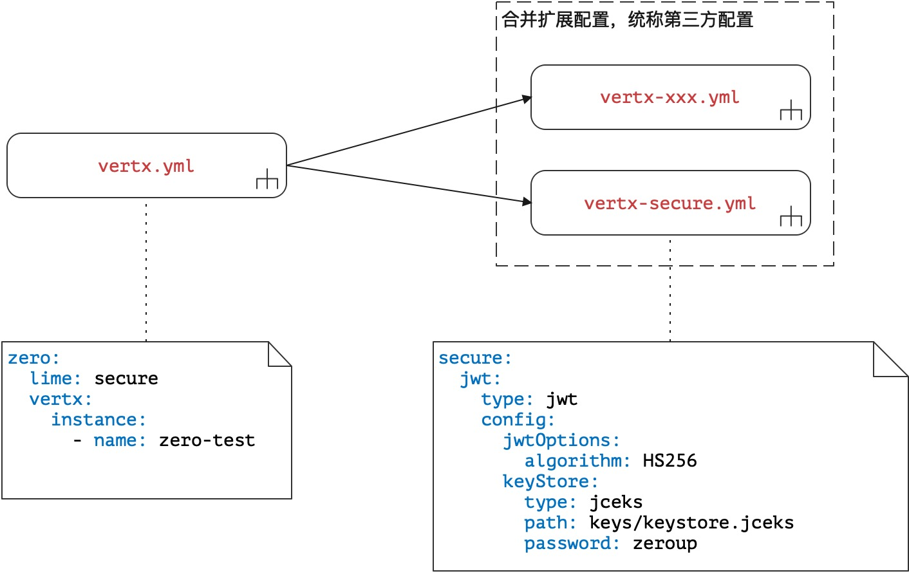
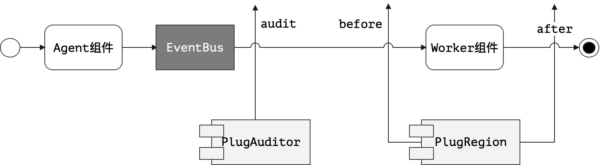

> 木落如飞鸟，山平疑澹烟。灯残挥手去，曳杖听流泉。——陈继儒《同印空夜坐凭虚阁》

* 项目地址：<https://github.com/silentbalanceyh/vertx-zero-example/>（子项目：**up-rhea**）

# 「壹」基本开发

&ensp;&ensp;&ensp;&ensp;本文介绍Zero中关于安全部分的开发，该部分开发主要使用配置实现，而且Zero框架中所有和认证授权相关的内容都写在AOP层，AOP全称为Aspect Oriented
Program，面向切面编程，一般通过预编译方式和运行时动态代理实现程序功能的统一维护技术，它属于OOP的延续。

## 1.1. 基本配置

&ensp;&ensp;&ensp;&ensp;Zero框架中的配置文件结构如下：



&ensp;&ensp;&ensp;&ensp;上述结构中注意两个根节点：

|节点名|含义|
|---|:---|
|type|当前安全框架实现的类型，目前版本`jwt`|
|config|和安全实现相关的配置数据，不同类型配置数据有所区别。|

&ensp;&ensp;&ensp;&ensp;由于项目原因，目前Zero只支持比较主流的jwt类型，`zero-rbac`中提供的默认安全实现也是基于jwt的，为了强化jwt，旧版本Zero中的`basic`和`mongo`
两种类型目前都不考虑，如果您想要自己实现，可参考下边两个类去自定义：

* `io.vertx.up.secure.handler.JwtOstium`（AuthHandler子接口）
* `io.vertx.up.secure.provider.authenticate.JwtAuth`（AuthProvider子接口）

## 1.2. 跨域

&ensp;&ensp;&ensp;&ensp;跨域配置是Zero和Zero-UI前后端集成时的核心配置，该配置同样采用第三方集成配置，文件结构参考上图，文件内容如下：

```yaml
cors:
  credentials: true
  methods:
    - DELETE
    - GET
    - POST
    - PUT
    - OPTIONS
  headers:
    - Authorization
    - Accept
    - Content-Disposition
    - Content-Encoding
    - Content-Length
    - Content-Type
    - X-App-Id
    - X-App-Key
    - X-Sigma
    - X-Lang
  origin: "http://ox.server.cn:4000"
```

> 这个配置就没有必要解释了，读者一看就明白。

## 1.3. @Wall

&ensp;&ensp;&ensp;&ensp;言归正传，接下来看看Zero中安全部分的核心开发，在看这部分之前先区分几个基本工作流：

1. **登录流程**：根据用户账号和口令生成令牌（Token），该令牌会在后续请求过程中追加到Authorization请求头中。
2. **认证流程**：（401）触发系统的安全框架验证Authorization请求头中提供的令牌Token是否合法。
3. **授权流程**：（403）认证成功后，触发系统安全框架中的核心授权逻辑。

&ensp;&ensp;&ensp;&ensp;综上，您开发的任何一个系统前两个流程是可以标准化的，比如JWT算法生成令牌、基于OAuth的三步骤交换令牌、或者在Basic认证中检查用户名和密码一步到位等等，而最后一个授权流程就根据系统需求有所差异了，您可以基于RBAC模型来设计系统的授权流程（后续教程会带您分析`zero-rbac`
子模块的授权系统）。

### 1.3.1. Security接口

&ensp;&ensp;&ensp;&ensp;`io.vertx.up.secure.Security`接口是Zero配合认证授权设计的核心接口，它的代码定义如下：

```java
package io.vertx.up.secure;

import io.vertx.core.Future;
import io.vertx.core.json.JsonObject;

public interface Security {
    /*
     * 该方法在登录成功后调用，属于登录成功的callback回调函数，用来
     * 关联登录账号的安全信息存储介质——如Redis、Database、Etcd等都
     * 可透过该方法关联某种或多种，默认情况什么都不做。
     **/
    default Future<JsonObject> store(final JsonObject data) {   
        return Future.succeededFuture(data);
    }
    /*
     * 核心令牌（Token）校验专用接口，校验时会验证Authorization头是否
     * 合法，不合法返回401错误，其中不合法包括：
     * - 1）提供的令牌Token不匹配。
     * - 2）Token过期，需执行Refresh流程。
     * - 3）数字签名不合法，sig错误，不可调用。
     **/
    Future<Boolean> verify(JsonObject data);
    /*
     * 认证过后的核心授权专用接口，用来执行403校验，默认访问任何API
     * 都是已经授权的情况。
     **/
    default Future<Boolean> access(final JsonObject user) {
        return Future.succeededFuture(Boolean.TRUE);
    }
}
```

### 1.3.2. 开发步骤

&ensp;&ensp;&ensp;&ensp;Zero使用了`vertx-auth-common`
框架执行安全流程，并根据Vert.x的原始代码进行重新设计以及开发，创建了自定义可配置的安全模块，从前文可知，Zero重写了`AuthProvider`和`AuthHandler`，重写过后支持下边功能：

1. 和Security接口连接，实现标准化的认证、授权流程。
2. 将权限认证转移到切面代码中，使用Annotation注解技术实现AOP层的认证。
3. 让Zero可启用插件模块对授权进行强定制（`zero-rbac`中数据域实现）。

&ensp;&ensp;&ensp;&ensp;先看一个基本示例：

**Agent代码**

```java
@EndPoint
@Path("/api")
public class SecAgent {
    @GET
    @Path("/hi/secure")
    public String sendOneWay(
            @BodyParam final JsonObject json) {
        return "Hello World";
    }
}
```

**Security实现类**

```java
package cn.vertxup.secure;

import io.vertx.core.Future;
import io.vertx.core.json.JsonObject;
import io.vertx.up.secure.Security;

public class SecStub implements Security {

    @Override
    public Future<Boolean> verify(final JsonObject data) {
        return Future.succeededFuture(Boolean.TRUE);
    }
}
```

&ensp;&ensp;&ensp;&ensp;**注意**：上边代码主要是为了测试，所以只重写了认证的方法，并没有提供其他实现。

**@Wall主类**

```java
package cn.vertxup.secure;

import io.vertx.core.Vertx;
import io.vertx.core.json.JsonObject;
import io.vertx.ext.auth.jwt.JWTAuthOptions;
import io.vertx.ext.web.handler.AuthHandler;
import io.vertx.up.annotations.Authenticate;
import io.vertx.up.annotations.Wall;
import io.vertx.up.secure.Security;
import io.vertx.up.secure.handler.JwtOstium;
import io.vertx.up.secure.provider.authenticate.JwtAuth;

import javax.inject.Inject;

// 墙相关配置，类型和路径
@Wall(value = "jwt", path = "/api/*")
public class SecWall {
    // Zero中支持JSR330依赖注入代码
    @Inject
    private transient Security security;

    // 主方法，用来创建AuthHandler和AuthProvider
    @Authenticate
    public AuthHandler authenticate(final Vertx vertx,
                                    final JsonObject config) {
        return JwtOstium.create(JwtAuth.create(vertx, new JWTAuthOptions(config))
            .bind(() -> this.security));
    }
}
```

&ensp;&ensp;&ensp;&ensp;此处的基本思路和`vertx-auth-common`模块扩展思路一样，都是创建自定义的`AuthHandler`和`AuthProvider`
，而Zero只是将这几部分内容通过轻量级的方式编连到一起，上述代码的内部实现处于切面层，所以它们的存在不影响Agent/Worker结构。

&ensp;&ensp;&ensp;&ensp;@Wall注解，单词翻译为“墙”，它是Zero中打开安全模块的注解，内部定义的注解方法如下：

|方法名|含义|
|:---|:---|
|value()|默认方法，用于描述安全类型，目前可用值为`jwt`，若要添加其他模式，可扩展开发Zero。|
|path()|设置执行该墙的路径，默认为`/*`，示例中使用了`/api/*`。|
|order()|墙检测顺序，当您拥有多个@Wall定义时使用，可在同一个系统中支持多种安全模式。|
|define()|是全扩展开发还是半扩展开发，半扩展开发依赖@Phase的定义。|

&ensp;&ensp;&ensp;&ensp;运行上述案例代码，任意发送到`/api/*`下的请求都会收到如下响应：

```json
{
    "code": -60012,
    "message": "[ERR-60012] (JwtPhylum) Web Exception occurs: (401) - ..."
}
```

&ensp;&ensp;&ensp;&ensp;并且在后台会看到如下信息：

```shell
io.vertx.tp.error._401UnauthorizedException: [ERR-60012] (JwtPhylum) Web Exception \ 
occurs: (401) - (Security) Unauthorized request met in request.
	at io.vertx.up.secure.handler.AuthPhylum.<init>(AuthPhylum.java:34)
	at io.vertx.up.secure.handler.AuthPhylum.<init>(AuthPhylum.java:40)
```

&ensp;&ensp;&ensp;&ensp;如何将请求发送成功呢？需在客户端增加Authorization的HTTP请求头重新发送请求，这个例子中由于Security类的verity方法直接返回了ture，任意格式合法的JwtToken都可以得到最终的正确请求：

```json
{
    "data": "Hello World"
}
```

### 1.3.3. 工具类

&ensp;&ensp;&ensp;&ensp;为了方便用户将信息存储到JWT的令牌并执行提取，Zero提供了核心工具类`Ux.Jwt`，先看下边代码：

**Agent代码**

```java
@EndPoint
@Path("/hi/jwt")
public class JwtAgent {
    @GET
    @Path("/generate")
    public String hiJwt(
            @QueryParam("name") final String name,
            @QueryParam("email") final String email) {
        // Encoding
        final JsonObject tokenJson = new JsonObject()
                .put("name", name)
                .put("email", email);
        return Ux.Jwt.token(tokenJson);
    }
}
```

&ensp;&ensp;&ensp;&ensp;上述代码请求会返回一个当前环境中的令牌值：

```json
{
    "data": "eyJ0eXAiOiJKV1QiLCJhbGciOiJIUzI1NiJ9....."
}
```

&ensp;&ensp;&ensp;&ensp;运行上述代码需在您的环境中做一定的准备：

1. 安全配置文件中的配置如下：

    ```yaml
    secure:
      jwt:
        type: jwt
        config:
          jwtOptions:
            algorithm: HS256
          keyStore:
            type: jceks
            path: keys/keystore.jceks
            password: zeroup
    ```
1. 在该配置下，需在`src/main/resources`中追加`keys/keystore.jceks`文件，该文件为自己生成，如果读者嫌麻烦可直接下载代码找到该文件。
2. IDEA运行时，运行截图如下：
   

&ensp;&ensp;&ensp;&ensp;若不做上边三个准备，会遇到下边的错误：

```json
{
    "code": -60007,
    "message": "[ERR-60007] (Envelop) Web Exception ... Algorithm not supported."
}
```

&ensp;&ensp;&ensp;&ensp;如代码中所示，Zero中提供的工具函数如下：

```java
// 将JsonObject对象存储在token中并生成新的token
Ux.Jwt.token(JsonObject);
// 将token还原得到原始的JsonObject对象
Ux.Jwt.extract(String);
```

&ensp;&ensp;&ensp;&ensp;上述准备代码就是为工具类服务的，主要目的如下：

1. 生成Jwt的Token时，保证算法的基本条件满足，这部分内容可参考Jwt的Token算法相关资料，如此才可保证Token可正确生成。
2. 两个工具类执行的底层Jwt配置必须一致，如果算法不一致就会导致前边`Algorithm not supported`错。

> 有了工具类，您就很容易将数据存储到Token中，并且很容易从Token中提取数据。

# 「贰」插件扩展

&ensp;&ensp;&ensp;&ensp;Zero中的认证授权逻辑主要基于Security接口，本章节抛开第一节提及的@Wall开发细节，转移到两个核心数据插件中，这两个插件可帮助您完成如下任务：

1. 支持授权过后的数据域操作。
2. 支持Auditor责任数据的切面注入。

&ensp;&ensp;&ensp;&ensp;配置扩展插件的代码如下：

```yaml
extension:
  region:
    component: io.vertx.tp.rbac.extension.DataRegion
    config:
      prefix: /api/
  auditor:
    component: io.vertx.tp.rbac.extension.AuditorPin
    config:
      include:
      exclude: 
```

&ensp;&ensp;&ensp;&ensp;两个插件对流程的影响如下：



## 2.1. 数据域插件

&ensp;&ensp;&ensp;&ensp;数据域插件的实现可参考`io.vertx.tp.rbac.extension.DataRegion`源代码，它的基本结构如下：

```java
// 未显示完整代码
import io.vertx.up.extension.PlugRegion;

public class DataRegion implements PlugRegion {
    @Override
    public Future<Envelop> before(final RoutingContext context, 
                                  final Envelop request){
        // 请求处理：修改Worker组件中收到的Envelop对象
        return request;
    }
    @Override
    public Future<Envelop> after(final RoutingContext context, 
                                 final Envelop response){
        // 响应处理：修改Worker组件执行完成后的响应对象
        return response;
    }
}
```

&ensp;&ensp;&ensp;&ensp;我在开发过程中提供的实现是基于`zero-rbac`模块的，数据域插件主要完成：

1. 根据配置文件中的prefix判断哪些请求需执行**数据域**功能。
2. before流程中，对请求的修改
    * 修改查询条件，根据权限定义缩小查询范围（行筛选）。
    * 修改列过滤信息，根据权限定义缩小查询范围（列筛选）。
3. after流程中，对响应再次修改
    * 行二次过滤（区域筛选、单行筛选、动态筛选）。
    * 列二次过滤。
    * 提供模型中合法的`acl`信息（动态计算），创建多状态**表单**和多状态**列表**。

&ensp;&ensp;&ensp;&ensp;上述几点只是目前`zero-rbac`模块中已实现的基础数据域的功能，也只能作为您的一个参考，而位于**切面**层的代码让您更容易对请求和响应数据执行修改以及限制，`zero-rbac`
的详细功能后边我会专程写一篇文章来讲解，包括配置步骤，动态资源访问器和界面配置等。

## 2.2. Auditor插件

&ensp;&ensp;&ensp;&ensp;Auditor插件的实现可参考`io.vertx.tp.rbac.extension.AuditorPin`源代码，它的基本结构如下：

```java
// 未显示完整代码部分
import io.vertx.up.extension.PlugAuditor

public class AuditorPin implements PlugAuditor {
    @Override
    public PlugAuditor bind(final JsonObject config) {
        // 绑定当前插件的配置定义
        return this;
    }
    @Override
    public Future<Envelop> audit(final RoutingContext context,
                                 final Envelop request){
        // 请求处理：修改Worker组件中收到的Envelop对象
        return request;
    }
}
```

&ensp;&ensp;&ensp;&ensp;Auditor插件主要用于修改请求数据（不处理响应），在CRUD模型中，只有**新增**和**更新**
会使用该插件，该插件负责让用户在系统中留下操作痕迹，至于痕迹如何存储就在于您如何设计这两个插件的内置逻辑。

&ensp;&ensp;&ensp;&ensp;`zero-rbac`中提供了最简单的Auditor数据如下：

|属性名|追加条件|含义|
|---|---|:---|
|createdAt|添加数据|创建时间|
|createdBy|添加数据|创建人|
|updatedAt|添加/更新数据|更新时间|
|updatedBy|添加/更新数据|更新人|

&ensp;&ensp;&ensp;&ensp;执行了该插件过后，上述四个属性会被直接追加到Envelop的统一模型中，当然若您不使用`zero-rbac`
，也可以自己去实现，插件对请求和响应的修改是AOP模式，若不提供这两个插件，不影响正常数据流的运行。

# 「叄」小结

&ensp;&ensp;&ensp;&ensp;到这里，Zero安全部分的开发就告一段落，虽然部分内容和安全没有直接关系，但这些东西都是实战过程中有用的部分，可提供给您参考。若您使用了`zero-rbac`
扩展模块，无疑可以直接忽略掉系统的认证、授权并拥有它所有的功能，包括在微服务环境下提供的认证授权服务器的功能。

&ensp;&ensp;&ensp;&ensp;最后，提供一段`zero-rbac`的@Wall完整代码（不包含服务类），让您对本章内容有所回顾。

```java
package cn.vertxup.rbac.wall;

import cn.vertxup.rbac.service.accredit.AccreditStub;
import cn.vertxup.rbac.service.jwt.JwtStub;
import io.vertx.core.Future;
import io.vertx.core.Vertx;
import io.vertx.core.json.JsonObject;
import io.vertx.ext.auth.jwt.JWTAuthOptions;
import io.vertx.ext.web.handler.AuthHandler;
import io.vertx.tp.rbac.cv.AuthMsg;
import io.vertx.tp.rbac.refine.Sc;
import io.vertx.up.annotations.Authenticate;
import io.vertx.up.annotations.Wall;
import io.vertx.up.log.Annal;
import io.vertx.up.secure.Security;
import io.vertx.up.secure.handler.JwtOstium;
import io.vertx.up.secure.provider.authenticate.JwtAuth;
import io.vertx.up.unity.Ux;

import javax.inject.Inject;

@Wall(value = "jwt", path = "/api/*")
public class JwtWall implements Security {
    private static final Annal LOGGER = Annal.get(JwtWall.class);
    @Inject
    private transient JwtStub jwtStub;
    @Inject
    private transient AccreditStub accredit;

    @Authenticate
    public AuthHandler authenticate(final Vertx vertx,
                                    final JsonObject config) {
        return JwtOstium.create(JwtAuth.create(vertx, new JWTAuthOptions(config))
            .bind(() -> this));
    }

    @Override
    public Future<JsonObject> store(final JsonObject data) {
        final String userKey = data.getString("user");
        Sc.infoAuth(LOGGER, AuthMsg.TOKEN_STORE, userKey);
        return jwtStub.store(userKey, data);
    }

    @Override
    public Future<Boolean> verify(final JsonObject data) {
        final String token = data.getString("jwt");
        final JsonObject extracted = Ux.Jwt.extract(data);
        Sc.infoAuth(LOGGER, AuthMsg.TOKEN_INPUT, token, extracted.encode());
        return jwtStub.verify(extracted.getString("user"), token);
    }

    @Override
    public Future<Boolean> access(final JsonObject data) {
        /*
         * User defined accessor
         */
        return accredit.authorize(data);
    }
}
```


