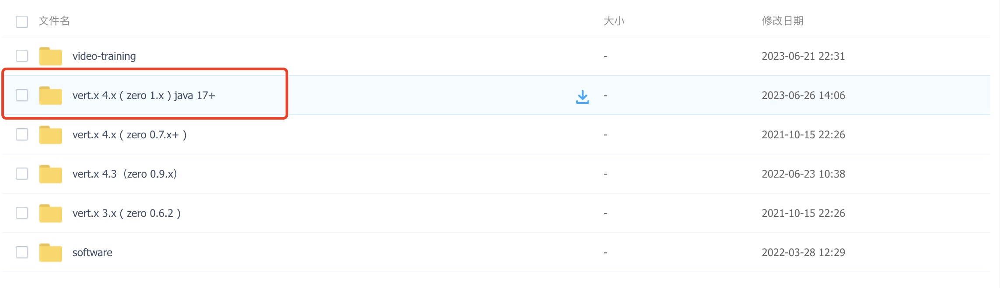

> “故美玉蕴於碔砆。”——《四子讲德论》

* 项目地址：<https://github.com/silentbalanceyh/vertx-zero-example/>（子项目：**up-athena**）
* 工具地址：<https://pan.baidu.com/s/1u3XayfvUZh8bOMMfK4zQhg> 提取码: d1qy 

&ensp;&ensp;&ensp;&ensp;Zero的支持表格如下：

| 版本         | Zero 0.6.2 | Zero 0.7.x |
|------------|------------|------------|
| Vert.x     | 3.9.9      | 4.1.x      |
| Jooq       | 3.10.8     | 3.15.x     |
| vertx-jooq | 2.4.1      | 6.3.x      |

> 新版都是支持最新的，所以根据您选择的版本下载不同的工具



# 「壹」环境准备

## 1.1. 引入Jooq

&ensp;&ensp;&ensp;&ensp;选择Jooq框架的主要目的如下：

* 和原生SQL的DDL语句结合得比较紧，在做动态建模的时候更容易使用面向对象的方式执行元数据操作（参考`zero-atom`
  项目），包括视图创建、表更改、字段增删等。
* Jooq近似于一个ORM框架，可以在开发过程中很方便实现面向对象模式的CRUD操作，并且让开发人员不用去关心底层SQL，但它提供了SQL模式的思路来实现数据库访问，比很多ORM框架更加灵活。
*
Jooq具有代码生成功能，对于最基本的增删查改等操作，开发人员可避免在项目过程中书写Domain/Dao/Service等重复性代码，这些代码可以直接使用`jooq-codegen`
工具生成。

&ensp;&ensp;&ensp;&ensp;Zero中的Jooq设计整体如下图：


&ensp;&ensp;&ensp;&ensp;Zero框架中，Jooq是以插件模式引入到系统内部，如果项目不需要访问数据库，该模块的整体功能如下：

* 和Vert.x协同提供通用的CRUD编程接口（同步和异步双版本），实现面向对象的无缝编程。
* 提供查询分析引擎，使用Json格式的语法实现复杂的SQL查询，支持大部分常用的聚集功能。
* 可接入Redis或其他缓存接口，实现AOP层的缓存支持，内置使用Cache-Aside模式。
* 使用单`Class<?>`构造`UxJooq`统一访问接口，在生成的Dao基础之上不需要引入额外的类来完成数据库访问操作。

&ensp;&ensp;&ensp;&ensp;为什么要封装Jooq？既然Jooq已经自带了所有核心级别的CRUD操作，那么Zero对它的封装是基于什么目的呢，这也许是很多读者不太容易理解的点，这样的做法是不是有点
**重复造轮子**
的行为？其实相反，Zero对Jooq的封装是基于实际业务场景的一种补充：

1. Jooq和Vert.x并没有强相关性，在开发过程中，让开发人员结合Jooq和Vert.x进行编程会有一定的难度，封装过后的API底层是基于Jooq和Vert.x，这样开发人员就不用关心CRUD的技术细节，可实现这层操作的无缝对接。
2. Zero中提供了强大的查询分析引擎，可构造各种动态SQL以及复杂查询，并且这种查询分析引擎语法使用JSON数据实现，并且提供了特殊的API处理底层数据类型的兼容。
3. Zero提供了三层缓存，L1的数据库级缓存、L2的业务级缓存、L3的HTTP缓存，在数据库缓存中，开发人员不需要再额外开发缓存逻辑，OOB中提供了Redis的Cache-Aside缓存架构，可处理高并发访问。

## 1.2. 准备步骤

&ensp;&ensp;&ensp;&ensp;这一小节我带着大家一起看看Zero中如何准备Jooq的基本环境，准备步骤完成后，我们再来讲解Jooq中的核心编程接口，参考`up-athena`
项目。

### 1.2.1. 创建数据表

&ensp;&ensp;&ensp;&ensp;使用如下SQL语句初始化您的数据库，默认数据库名`DB_ETERNAL`：

```sql
-- script/database/database-rinit.sql
SET NAMES utf8mb4;
SET FOREIGN_KEY_CHECKS = 0;
-- 删除原来的数据库
DROP DATABASE IF EXISTS DB_ETERNAL;
CREATE DATABASE IF NOT EXISTS DB_ETERNAL DEFAULT CHARSET utf8mb4 COLLATE utf8mb4_bin;
```

&ensp;&ensp;&ensp;&ensp;写好语句保存到文件，然后执行下边脚本，输入密码、则可初始化一个空库：

```shell
#!/usr/bin/env bash
# script/database/database-rinit.sh
/usr/local/mysql/bin/mysql -u root -P 3306 -h 127.0.0.1 -p < database-reinit.sql
echo "[OX] 重建 DB_ETERNAL 数据库成功!";
```

&ensp;&ensp;&ensp;&ensp;创建数据表有两种方式，在我们生产环境项目中，使用的是`liquibase`创建数据表，当然您也可以手工创建，在数据库中执行如下代码：

```sql
-- script/database/database-demo.sql
-- liquibase formatted sql

-- changeset Lang:ox-tabular-1
-- 列表数据表专用
DROP TABLE IF EXISTS X_TABULAR;
CREATE TABLE IF NOT EXISTS X_TABULAR
(
    `KEY`        VARCHAR(36) COMMENT '「key」- 列表主键',
    `NAME`       VARCHAR(255) COMMENT '「name」- 列表名称',
    `CODE`       VARCHAR(255) COMMENT '「code」- 列表编号',
    `TYPE`       VARCHAR(255) COMMENT '「type」- 列表类型',
    `ICON`       VARCHAR(255) COMMENT '「icon」- 列表图标',
    `SORT`       INTEGER COMMENT '「sort」- 排序信息',
    `COMMENT`    TEXT COMMENT '「comment」- 备注信息',
    `APP_ID`     VARCHAR(255) COMMENT '「appId」- 关联的应用程序ID',

    -- 特殊字段
    `ACTIVE`     BIT         DEFAULT NULL COMMENT '「active」- 是否启用',
    `SIGMA`      VARCHAR(32) DEFAULT NULL COMMENT '「sigma」- 统一标识',
    `METADATA`   TEXT COMMENT '「metadata」- 附加配置',
    `LANGUAGE`   VARCHAR(8)  DEFAULT NULL COMMENT '「language」- 使用的语言',

    -- Auditor字段
    `CREATED_AT` DATETIME COMMENT '「createdAt」- 创建时间',
    `CREATED_BY` VARCHAR(36) COMMENT '「createdBy」- 创建人',
    `UPDATED_AT` DATETIME COMMENT '「updatedAt」- 更新时间',
    `UPDATED_BY` VARCHAR(36) COMMENT '「updatedBy」- 更新人',
    PRIMARY KEY (`KEY`)
);

-- changeset Lang:ox-tabular-2
ALTER TABLE X_TABULAR
    ADD UNIQUE (`APP_ID`, `TYPE`, `CODE`); -- 每一个应用内的 app - type - code 维持唯一
ALTER TABLE X_TABULAR
    ADD UNIQUE (`SIGMA`, `TYPE`, `CODE`);

ALTER TABLE X_TABULAR
    ADD INDEX IDXM_X_TABULAR_APP_ID_TYPE_ACTIVE (`APP_ID`, `TYPE`, `ACTIVE`);
ALTER TABLE X_TABULAR
    ADD INDEX IDXM_X_TABULAR_SIGMA_TYPE_ACTIVE (`SIGMA`, `TYPE`, `ACTIVE`);
```

> 为了兼容Oracle，所有的SQL关键字以及表名字段名全部统一使用大小写敏感的大写，虽然在Zero中这个动作不是必须，不过推荐使用此种方式处理。

### 1.2.2. 代码生成

&ensp;&ensp;&ensp;&ensp;访问文首链接地址下载所有工具，将工具放在`script/code`目录下（**重要**
），修改配置文件`config/zero-jooq.xml`中的部分核心配置，参考下边的片段部分：

```xml
    <!-- 数据库配置 -->
<jdbc>
    <driver>com.mysql.cj.jdbc.Driver</driver>
    <url>
        <![CDATA[ jdbc:mysql://ox.engine.cn:3306/DB_ETERNAL]]>
    </url>
    <username>root</username>
    <password>????????</password>
</jdbc>
        <!-- 数据表配置 -->
<inputSchema>DB_ETERNAL</inputSchema>
<includes>(^(X_).*)</includes><!-- 表模式前缀 -->
        <!-- 领域模型包名 -->
<target>
<packageName>cn.vertxup.demo.domain</packageName>
<directory>../../src/main/java</directory>
</target>
```

&ensp;&ensp;&ensp;&ensp;修改了上述配置后，运行工具脚本，生成对应的领域模型、Dao层代码。脚本运行后，您的项目目录`src/main/java`
中将会有新代码生成。

### 1.2.3. 配置

&ensp;&ensp;&ensp;&ensp;在您的`src/main/resources`目录中准备下边三个资源配置文件（Zero中的Jooq相关核心配置）：

**vertx.yml**

```yaml
zero:
  lime: jooq
  vertx:
    instance:
      - name: athena-demo
        options:
          # Event loop default executing: 120s
          # Worker executing: 1200s -> 20 min
          maxEventLoopExecuteTime: 300_000_000_000
          maxWorkerExecuteTime: 1200_000_000_000
```

**vertx-jooq.yml**

```yaml
# ------------------- 数据库存储 ----------------------
jooq:
  provider:
    driverClassName: "com.mysql.cj.jdbc.Driver"
    username: root
    password: "????"
    hostname: "ox.engine.cn"
    instance: DB_ETERNAL
    jdbcUrl: "jdbc:mysql://ox.engine.cn:3306/DB_ETERNAL"
```

> 注意此处生成代码时使用的是固定数据库，从空库到有表的库转换，且为固定名称 `DB_ETERNAL`。

**vertx-inject.yml**

```yaml
# Database，静态数据库访问专用，访问：DB_ORIGIN_X 元数据库
jooq: io.vertx.tp.plugin.jooq.JooqInfix
```

&ensp;&ensp;&ensp;&ensp;最后在Maven中配置MySQL的依赖：

```xml

<dependencies>
    <dependency>
        <!-- 新版 -->
        <groupId>com.mysql</groupId>
        <artifactId>mysql-connector-j</artifactId>
        <!-- 版本可省略，自带了 -->
    </dependency>
</dependencies>
```

## 1.3. 连接测试

&ensp;&ensp;&ensp;&ensp;接下来使用JUnit执行下边代码，测试一下连接：

```java
package cn.vertxup.demo;

import cn.vertxup.demo.domain.tables.daos.XTabularDao;
import cn.vertxup.demo.domain.tables.pojos.XTabular;
import io.vertx.core.Future;
import io.vertx.ext.unit.TestContext;
import io.vertx.quiz.JooqBase;
import io.vertx.up.unity.Ux;
import org.junit.Assert;
import org.junit.Test;

import java.util.UUID;

/**
 * @author <a href="http://www.origin-x.cn">lang</a>
 */
public class JqTc extends JooqBase {

    @Test
    public void testInsert(final TestContext context) {
        this.tcAsync(context, this.insertDemo(), actual -> {
            System.out.println(actual);
            Assert.assertNotNull(actual);
        });
    }

    private Future<XTabular> insertDemo() {
        final XTabular tabular = new XTabular();
        tabular.setKey(UUID.randomUUID().toString());
        tabular.setCode("TEST.CODE");
        tabular.setName("测试代码");
        // 插入数据
        return Ux.Jooq.on(XTabularDao.class).insertAsync(tabular);
    }
}
```

&ensp;&ensp;&ensp;&ensp;运行测试用例，您将看到如下输出（检查数据库中的数据，您也可以看到新插入的数据信息），如此，Jooq的配置就完成了。
&ensp;&ensp;&ensp;&ensp;**注意**
：这里使用的XTabular对象是jooq生成的模型对象而不是表对象，生成对象中有两个同名类：`cn.vertxup.demo.domain.tables.pojos.XTabular`
和`cn.vertxup.demo.domain.tables.XTabular`，我们使用的是第一个带有`pojos`包名的模型对象，这点经常在环境中容易搞错。

```shell
XTabular (968a5f94-5514-42ad-adbe-eaef4ec6e297, 测试代码, TEST.CODE, \
    null, null, null, null, null, null, null, null, null, null, null, null, null)
```

# 「贰」常用操作

&ensp;&ensp;&ensp;&ensp;根据第一章节的引导，您的环境配置就已经彻底完成了，那么本章节我们来看看基本的CRUD操作，通过对本章节的学习，让读者理解Zero中如何实现数据库的基本CRUD，Zero中提供了八大类的常用数据库操作：

* 添加/批量添加
* 更新/批量更新
* 删除/批量删除/按添加删除
* 保存：添加 + 更新
* 存在丢失检查
* 搜索
* 各种查找编程接口
* 聚集/分组

&ensp;&ensp;&ensp;&ensp;Zero中操作数据库的核心对象为`io.vertx.up.uca.jooq.UxJooq`，它的实例化方式如下：

```java
/*
 * 其中 XTabularDao 为 jooq-codegen 生成
 * Zero 中并不限制用户实例化 UxJooq 的方式，它的构造函数是 public 的，但使用下边的代码是标准方式，
 * 它会启用 Zero 内部的对象池，保证多次实例化时不生成多余的数据库访问对象，在模型级别实现了“单件模式”
 * 同一个模型只会生成唯一的一个`UxJooq`对象，所以推荐读者使用下边代码实例化 UxJooq 对象。
 **/
UxJooq jooq=Ux.Jooq.on(XTabularDao.class)
```

&ensp;&ensp;&ensp;&ensp;为了提高读者的辨识度，后边所有的示例代码中定义的变量如下：

|       变量名称 |       数据类型 | 含义                  |
|-----------:|-----------:|:--------------------|
|          t |        泛型T | 生成的实体类型             |
|       list |  `List<T>` | 生成的实体列表集合类型         |
|        key |       泛型ID | 主键类型，可以是字符串，可以是整数   |
|   criteria | JsonObject | 查询条件                |
|      query | JsonObject | 带分页、排序、列过滤的查询引擎完整条件 |
|    jobject | JsonObject | 可序列化的Json单条数据       |
|     jarray |  JsonArray | 可序列化的Json多条数据       |
| collection |       集合类型 | 可以是Set也可以是List      |
|      array |         [] | 数组类型，也可以是变参类似 T...  |
|       pojo |     String | POJO模式中的文件名（支持映射）   |
|      field |     String | 字段名称                |
|       aggr |     String | 聚集字段名称              |
|      value |     Object | 字段传入值               |

&ensp;&ensp;&ensp;&ensp;初次接触这份基础编程接口时，很多读者会觉得数量繁多不太容易记住，但实际上这是在实际项目中使用过后的一份总结，为了方便开发人员，对很多编程接口进行了扩展，主要扩展点如下：

* 由于很多遗留系统使用的字段名和期望字段名不匹配，如旧系统使用的是：`sname`，而客户端的新请求在迁移过程中使用的是：`name`
  ，这种情况下，很多开发人员不得不修订基础字段，更有甚者会修改数据库中的列名，而Zero框架中不需要这样做，Zero中引入了一层映射层，可以通过`pojo`
  的配置文件将输入的数据直接映射到实体(`T`)
  信息中，这样开发人员就不会为了字段的变更而烦恼，简单说，输入数据的字段、POJO模型的字段直接解耦，防止二者不匹配的情况。
*

Vert.x中最常用的数据结构是JsonObject/JsonArray，为了让开发人员可以不去思考序列化的细节，所以Zero引入了默认序列化机制，调用这种类型的编程接口，只要定义了Dao类型，开发人员可以直接将数据丢给Jooq来完成数据库的访问，这种场景下甚至不需要开发人员去构造生成的领域模型。

* 数据库访问是在遗留系统和Vert.x的纯异步系统中演化而来的，所以在提供编程的API时，所有的接口都有同步、异步两个版本，带`Async`
  关键字的就是异步版本，而同步版本在某些场景中依然实用。

&ensp;&ensp;&ensp;&ensp;为了辅助开发人员记忆和使用，参考下边的规则来理解每一种操作扩展过后的API含义。

1. 第一个维度是同步和异步，主要分**两种**：带`Async`的是异步版本。
2. 第二个维度是输入，主要分**三种**：领域模型、Json数据、带映射层（Pojo）的Json数据。
3. 第三个维度是返回值，主要分**四种**：`T、List<T>、JsonObject、JsonArray`。

## 2.1. 基础增删改

### 2.1.1. 新增

&ensp;&ensp;&ensp;&ensp;**新增**接口的骨架代码：

```java

    // --> 返回值：T / Future<T>
    // 新增：T -> T
    Ux.Jooq.on(XTabularDao.class).insert(t);
    Ux.Jooq.on(XTabularDao.class).insertAsync(t);
    // 新增：JsonObject -> T
    Ux.Jooq.on(XTabularDao.class).insert(jobject);
    Ux.Jooq.on(XTabularDao.class).insertAsync(jobject);
    // 新增：JsonObject + pojo -> T
    Ux.Jooq.on(XTabularDao.class).insert(jobject,pojo);
    Ux.Jooq.on(XTabularDao.class).insertAsync(jobject,pojo);

    // --> 返回值：List<T> / Future<List<T>>
    // 新增：List<T> -> List<T>
    Ux.Jooq.on(XTabularDao.class).insert(list);
    Ux.Jooq.on(XTabularDao.class).insertAsync(list);
    // 新增：JsonArray -> List<T>
    Ux.Jooq.on(XTabularDao.class).insert(jarray);
    Ux.Jooq.on(XTabularDao.class).insertAsync(jarray);
    // 新增：JsonArray + pojo -> List<T>
    Ux.Jooq.on(XTabularDao.class).insert(jarray,pojo);
    Ux.Jooq.on(XTabularDao.class).insertAsync(jarray,pojo);

    // --> 返回值：JsonObject / Future<JsonObject>
    // 新增：T -> JsonObject
    Ux.Jooq.on(XTabularDao.class).insertJ(t);
    Ux.Jooq.on(XTabularDao.class).insertJAsync(t);
    // 新增：JsonObject -> JsonObject
    Ux.Jooq.on(XTabularDao.class).insertJ(jobject);
    Ux.Jooq.on(XTabularDao.class).insertJAsync(jobject);
    // 新增：JsonObject + pojo -> JsonObject
    Ux.Jooq.on(XTabularDao.class).insertJ(jobject,pojo);
    Ux.Jooq.on(XTabularDao.class).insertJAsync(jobject,pojo);

    // --> 返回值：JsonArray / Future<JsonArray>
    // 新增：List<T> -> JsonArray
    Ux.Jooq.on(XTabularDao.class).insertJ(list);
    Ux.Jooq.on(XTabularDao.class).insertJAsync(list);
    // 新增：JsonArray -> JsonArray
    Ux.Jooq.on(XTabularDao.class).insertJ(jarray);
    Ux.Jooq.on(XTabularDao.class).insertJAsync(jarray);
    // 新增：JsonArray + pojo -> JsonArray
    Ux.Jooq.on(XTabularDao.class).insertJ(jarray,pojo);
    Ux.Jooq.on(XTabularDao.class).insertJAsync(jarray,pojo);      
```

>
新增接口只有一点需要说明，如果传入的实体、JsonObject数据本身没有主键值，那么Zero会使用UUID的方式为主键赋值，生成一个新的主键，并且在返回的数据中会带上该主键信息，为了配合前端开发，Zero中推荐所有主键使用属性名`key`
而不是使用传统常用的`id`，当然如果开发人员定义了自己的主键，那么Zero会从生成的jooq代码中自动识别。

&ensp;&ensp;&ensp;&ensp;将上述代码统计一下，可得到下边的表格，其中`领域模型T、Json数据、带Pojo映射层`为新增接口的入参搭配。

|              |                  返回值 | 领域模型 T    | Json数据     | 带Pojo映射层 | 
|-------------:|---------------------:|-----------|------------|----------|
|       insert |                    T | T         |            |          |
|              |                    T |           | JsonObject |          |
|              |                    T |           | JsonObject | String   |
|              |            `List<T>` | `List<T>` |            |          |
|              |            `List<T>` |           | JsonArray  |          |
|              |            `List<T>` |           | JsonArray  | String   |
|      insertJ |           JsonObject | T         |            |          |
|              |           JsonObject |           | JsonObject |          |
|              |           JsonObject |           | JsonObject | String   |
|              |            JsonArray | `List<T>` |            |          |
|              |            JsonArray |           | JsonArray  |          |
|              |            JsonArray |           | JsonArray  | String   |
|  insertAsync |          `Future<T>` | T         |            |          |
|              |          `Future<T>` |           | JsonObject |          |
|              |          `Future<T>` |           | JsonObject | String   |
|              |    `Future<List<T>>` | `List<T>` |            |          |
|              |    `Future<List<T>>` |           | JsonArray  |          |
|              |    `Future<List<T>>` |           | JsonArray  | String   |
| insertJAsync | `Future<JsonObject>` | T         |            |          |
|              | `Future<JsonObject>` |           | JsonObject |          |
|              | `Future<JsonObject>` |           | JsonObject | String   |
|              |  `Future<JsonArray>` | `List<T>` |            |          |
|              |  `Future<JsonArray>` |           | JsonArray  |          |
|              |  `Future<JsonArray>` |           | JsonArray  | String   |

### 2.1.2. 搜索

&ensp;&ensp;&ensp;&ensp;**搜索**接口的骨架代码：

> 先写查询接口的教程，主要原因是后续编程接口都会牵涉带条件查询，在查询过程中让读者对Zero中的查询引擎有所了解，然后再慢慢来深入到查询引擎部分。

```java
    // 「搜索」
    // --> 返回值：JsonObject / Future<JsonObject>
    // 搜索：带分页、排序、列过滤、条件的查询引擎专用接口
    Ux.Jooq.on(XTabularDao.class).search(query);
    Ux.Jooq.on(XTabularDao.class).searchAsync(query);
    // 搜索：带分页、排序、列过滤、条件的查询引擎专用接口，支持POJO模式
    Ux.Jooq.on(XTabularDao.class).search(query,pojo);
    Ux.Jooq.on(XTabularDao.class).searchAsync(query,pojo);         
```

&ensp;&ensp;&ensp;&ensp;搜索是读取数据中最简单的接口，因为它只包含了两种模式：带POJO映射和不带POJO映射，带POJO映射的模式中，输入和输出的字段名都是调用POJO映射之前的字段名，只有内部的领域模型可能不是该名称，这样整个数据转换过程对开发人员都是透明的。

#### 输入格式

&ensp;&ensp;&ensp;&ensp;Zero中的查询引擎详细语法在后边的查询引擎部分详细讲解，此处不再加以说明。

#### 输出格式

&ensp;&ensp;&ensp;&ensp;搜索接口的输出在Zero中使用下边这种固定格式：

```json
{
    "count": 0,
    "list": []
}
```

|   字段名 | 数据类型   | 业务含义                |
|------:|:-------|:--------------------|
| count | 整数值    | 总数据量                |
|  list | Json数组 | 当前页数据（带分页参数） / 完整数据 |

### 2.1.3. 读取

&ensp;&ensp;&ensp;&ensp;**读取**接口的骨架代码：

```java
    // 「集合返回」返回值是多条记录
    // --> 返回值：List<T> / Future<List<T>>
    // 查找：无参 -> List<T> 
    Ux.Jooq.on(XTabularDao.class).fetchAll();
    Ux.Jooq.on(XTabularDao.class).fetchAllAsync();
    // 查找：field = value -> List<T> ，不支持POJO模式
    Ux.Jooq.on(XTabularDao.class).fetch(field,value);
    Ux.Jooq.on(XTabularDao.class).fetchAsync(field,value);
    // 查找：全条件 -> List<T>，全条件查找
    Ux.Jooq.on(XTabularDao.class).fetch(criteria);
    Ux.Jooq.on(XTabularDao.class).fetchAsync(criteria);
    // 查找：全条件带POJO -> List<T>
    Ux.Jooq.on(XTabularDao.class).fetch(criteria,pojo);
    Ux.Jooq.on(XTabularDao.class).fetchAsync(criteria,pojo);

    // 「集合返回」协变类型
    // --> 返回值：List<T> / Future<List<T>>
    // 快速查询：In，第二参为 JsonArray
    Ux.Jooq.on(XTabularDao.class).fetchIn(field,jarray);
    Ux.Jooq.on(XTabularDao.class).fetchInAsync(field,jarray);
    // 快速查询：In，第二参为 List, Set 或其他 Collection
    Ux.Jooq.on(XTabularDao.class).fetchIn(field,collection);
    Ux.Jooq.on(XTabularDao.class).fetchInAsync(field,collection);
    // 快速查询：In，第二参为 [] 类型或变参
    Ux.Jooq.on(XTabularDao.class).fetchIn(field,array);
    Ux.Jooq.on(XTabularDao.class).fetchInAsync(field,array);

    // 「集合返回」协变类型
    // --> 返回值：List<T> / Future<List<T>>
    // 快速查询：AND, criteria -> List<T>
    Ux.Jooq.on(XTabularDao.class).fetchAnd(criteria);
    Ux.Jooq.on(XTabularDao.class).fetchAndAsync(criteria);
    // 快速查询：AND，带Pojo模式, criteria + pojo -> List<T>
    Ux.Jooq.on(XTabularDao.class).fetchAnd(criteria,pojo);
    Ux.Jooq.on(XTabularDao.class).fetchAndAsync(criteria,pojo);
    // 快速查询：Or, criteria -> List<T>
    Ux.Jooq.on(XTabularDao.class).fetchOr(criteria);
    Ux.Jooq.on(XTabularDao.class).fetchOrAsync(criteria);
    // 快速查询：Or，带Pojo模式, criteria + pojo -> List<T>
    Ux.Jooq.on(XTabularDao.class).fetchOr(criteria,pojo);
    Ux.Jooq.on(XTabularDao.class).fetchOrAsync(criteria,pojo);

    // ----- 下边是Json版本
    // --> 返回值：JsonArray / Future<JsonArray>
    // 「集合返回」返回值是多条记录
    // 查找：无参 -> JsonArray
    Ux.Jooq.on(XTabularDao.class).fetchJAll();
    Ux.Jooq.on(XTabularDao.class).fetchJAllAsync();
    // 查找：pojo -> JsonArray
    Ux.Jooq.on(XTabularDao.class).fetchJAll(pojo);
    Ux.Jooq.on(XTabularDao.class).fetchJAllAsync(pojo);

    // 「集合返回」协变类型，In类型中的JsonArray返回不支持外置的pojo映射
    // --> 返回值：JsonArray / Future<JsonArray>
    // 快速查询：In，第二参为 JsonArray
    Ux.Jooq.on(XTabularDao.class).fetchJIn(field,jarray);
    Ux.Jooq.on(XTabularDao.class).fetchJInAsync(field,jarray);
    // 快速查询：In，第二参为 List, Set 或其他 Collection
    Ux.Jooq.on(XTabularDao.class).fetchJIn(field,collection);
    Ux.Jooq.on(XTabularDao.class).fetchJInAsync(field,collection);
    // 快速查询：In，第二参为 [] 类型或变参
    Ux.Jooq.on(XTabularDao.class).fetchJIn(field,array);
    Ux.Jooq.on(XTabularDao.class).fetchJInAsync(field,array);

    // 「集合返回」协变类型
    // --> 返回值：JsonArray / Future<JsonArray>
    // 快速查询：AND, criteria -> JsonArray
    Ux.Jooq.on(XTabularDao.class).fetchJAnd(criteria);
    Ux.Jooq.on(XTabularDao.class).fetchJAndAsync(criteria);
    // 快速查询：AND，带Pojo模式, criteria + pojo -> JsonArray
    Ux.Jooq.on(XTabularDao.class).fetchJAnd(criteria,pojo);
    Ux.Jooq.on(XTabularDao.class).fetchJAndAsync(criteria,pojo);
    // 快速查询：Or, criteria -> JsonArray
    Ux.Jooq.on(XTabularDao.class).fetchJOr(criteria);
    Ux.Jooq.on(XTabularDao.class).fetchJOrAsync(criteria);
    // 快速查询：Or，带Pojo模式, criteria + pojo -> JsonArray
    Ux.Jooq.on(XTabularDao.class).fetchJOr(criteria,pojo);
    Ux.Jooq.on(XTabularDao.class).fetchJOrAsync(criteria,pojo);

    // 「单记录返回」返回值是唯一记录
    // --> 返回值：T / Future<T>
    // 查找：按主键读取 key -> T
    Ux.Jooq.on(XTabularDao.class).fetchById(key);
    Ux.Jooq.on(XTabularDao.class).fetchByIdAsync(key);
    // 查找：单字段查找 field, value -> T
    Ux.Jooq.on(XTabularDao.class).fetchOne(field,value);
    Ux.Jooq.on(XTabularDao.class).fetchOneAsync(field,value);
    // 查找：全条件查找（强制And）criteria -> T
    Ux.Jooq.on(XTabularDao.class).fetchOne(condition);
    Ux.Jooq.on(XTabularDao.class).fetchOneAsync(condition);
    // 查找：全条件查找（Pojo模式）criteria + pojo -> T
    Ux.Jooq.on(XTabularDao.class).fetchOne(criteria,pojo);
    Ux.Jooq.on(XTabularDao.class).fetchOneAsync(criteria,pojo);

    // 「单记录返回」Json版本 key -> JsonObject
    // --> 返回值：JsonObject / Future<JsonObject>
    Ux.Jooq.on(XTabularDao.class).fetchJById(key);
    Ux.Jooq.on(XTabularDao.class).fetchJByIdAsync(key);
    // 查找：单字段查找 field, value -> JsonObject
    Ux.Jooq.on(XTabularDao.class).fetchJOne(field,value);
    Ux.Jooq.on(XTabularDao.class).fetchJOneAsync(field,value);
    // 查找：全条件查找（强制And）criteria -> JsonObject
    Ux.Jooq.on(XTabularDao.class).fetchJOne(condition);
    Ux.Jooq.on(XTabularDao.class).fetchJOneAsync(condition);
    // 查找：全条件查找（Pojo模式）criteria + pojo -> JsonObject
    Ux.Jooq.on(XTabularDao.class).fetchJOne(criteria,pojo);
    Ux.Jooq.on(XTabularDao.class).fetchJOneAsync(criteria,pojo);   
```

&ensp;&ensp;&ensp;&ensp;Zero中的读取接口内容最多，但实际上也可以分类来记忆，它和Insert唯一的不同点是入参的搭配有些差异：

|  |   返回值 | 字段kv/主键   | criteria条件    | 带Pojo映射层  |
|---:|---:|---|---|---|
| fetchAll |`List<T>`|||
| fetchJAll | `JsonArray` ||| String | 
| fetchAllAsync | `Future<List<T>>` |||
| fetchJAllAsync| `Future<JsonArray>` |||String|
| fetch | `List<T>` | |String,Object ||
|| `List<T>` ||JsonObject |||
| `List<T>` || JsonObject | String | 
| fetchJ | `JsonArray` |String,Object ||| 
|| `JsonArray` ||JsonObject |||
| `JsonArray`|| JsonObject | String | 
| fetchAsync | `Future<List<T>>` | String,Object |||
||   `Future<List<T>>` || JsonObject||
|| `Future<List<T>>` || JsonObject | String | 
| fetchJAsync | `Future<JsonArray>`|String,Object |||
|| `Future<JsonArray>`  || JsonObject | | |
|| `Future<JsonArray>` || JsonObject | String | 
| fetchIn|`List<T>` |  String, Collection |||
|| `List<T>` | String, Object... ||| 
|| `List<T>` | String, JsonArray ||| 
|fetchJIn |`JsonArray` | String, Collection |||
|| `JsonArray` | String, Object... ||| 
|| `JsonArray` | String,JsonArray |||
| fetchInAsync| `Future<List<T>>`    | String, Collection ||| 
|| `Future<List<T>>` | String, Object... |||
||   `Future<List<T>>` | String, JsonArray  |||
| fetchJInAsync | `Future<JsonArray>` | String, Collection |||
|| `Future<JsonArray>` | String, Object...  |||
|| `Future<JsonArray>` | String, JsonArray ||| 
| fetchAnd | `List<T>` ||JsonObject |||
|| `List<T>`|| JsonObject | String | 
| fetchJAnd | `JsonArray` || JsonObject || 
|| `JsonArray` ||JsonObject |String |
| fetchAndAsync | `Future<List<T>>`   || JsonObject || 
|| `Future<List<T>>` || JsonObject | String |
|fetchJAndAsync | `Future<JsonArray>` || JsonObject||
|| `Future<JsonArray>` || JsonObject | String | 
| fetchOr|`List<T>` || JsonObject||
|| `List<T>` || JsonObject | String | 
| fetchJOr | `JsonArray` || JsonObject ||
||         `JsonArray` || JsonObject    | String|
| fetchOrAsync | `Future<List<T>>` || JsonObject || 
|| `Future<List<T>>` ||JsonObject |String |
| fetchJOrAsync | `Future<JsonArray>` || JsonObject || 
|| `Future<JsonArray>` || JsonObject |String |
| fetchById| T| key, Object||| 
| fetchByIdAsync | `Future<T>` | key, Object ||| 
| fetchJById | JsonObject |key, Object |||
| fetchJByIdAsync| `Future<JsonObject>` | key, Object ||| 
| fetchOne | T | key, Object ||| 
|| T ||JsonObject |||
|| T|| JsonObject | String | 
| fetchJOne | JsonObject | key, Object ||| 
|| JsonObject || JsonObject | |
||JsonObject || JsonObject| String|
| fetchOneAsync | `Future<T>` | key, Object ||| 
|| `Future<T>` || JsonObject | |
||`Future<T>` || JsonObject| String|
| fetchJOneAsync |`Future<JsonObject>` | key, Object ||| 
|| `Future<JsonObject>`||JsonObject ||
|| `Future<JsonObject>` || JsonObject | String |

&ensp;&ensp;&ensp;&ensp;编程接口的扩展在于是否使用**领域模型T**、**字段级查询**、**映射层使用**，这里再强调一下此处三个知识点的核心使用场景：

* **领域模型**：在Java语言中，可以用`class`
  来定义一个领域模型，定义过后基于JavaBean的规范，可使用不同的API对该模型中的数据进行访问；但在Vert.x编程中，很多地方都不使用Java中的对象，取而代之的是简化过后的`JsonObject`
  和`JsonArray`
  ，于是就出现了是否使用领域模型的API分离。
* **字段级查询**：程序访问数据库的过程中，**单条件**
  一直是一个高频场景，不论是单条件单值还是单条件多值，在编程过程中都是业务系统的核心，所以Zero提供了快速的字段查询功能，如`fetchIn`
  和`fetch`
  中的`(field, value)`方法签名模式，方便开发人员直接查询相关数据。
* **映射层**：映射层是一个附加功能，主要目的是做接口兼容，不论是旧系统和新系统做对接，还是新系统和旧系统做对接，两边的系统都不可能绝对统一，为了保证数据字段的灵活性，对两边的
  **模型属性名**进行解耦，于是Zero提供了**映射层**
  的机制，使得集成开发变得更加简单和流畅。

### 2.1.4. 更新

&ensp;&ensp;&ensp;&ensp;**更新**接口的骨架代码：

```java
    // 更新
    // --> 返回值：T / Future<T>
    // 直接更新：T -> T
    Ux.Jooq.on(XTabularDao.class).update(t);
    Ux.Jooq.on(XTabularDao.class).updateAsync(t);
    // 直接更新：JsonObject -> T
    Ux.Jooq.on(XTabularDao.class).update(jobject);
    Ux.Jooq.on(XTabularDao.class).updateAsync(jobject);
    // 直接更新：JsonObject + pojo -> T
    Ux.Jooq.on(XTabularDao.class).update(jobject,pojo);
    Ux.Jooq.on(XTabularDao.class).updateAsync(jobject,pojo);

    // --> 返回值：List<T> / Future<List<T>>
    // 批量更新，其中 list 的类型为 java.util.List<T>
    Ux.Jooq.on(XTabularDao.class).update(list);
    Ux.Jooq.on(XTabularDao.class).updateAsync(list);
    // 更新：JsonArray -> List<T>
    Ux.Jooq.on(XTabularDao.class).update(jarray);
    Ux.Jooq.on(XTabularDao.class).updateAsync(jarray);
    // 更新：JsonArray + pojo -> List<T>
    Ux.Jooq.on(XTabularDao.class).update(jarray,pojo);
    Ux.Jooq.on(XTabularDao.class).updateAsync(jarray,pojo);

    // 带条件的更新
    // --> 返回值：T / Future<T>
    // 更新：按 id 更新, T -> T
    Ux.Jooq.on(XTabularDao.class).update(key,t);
    Ux.Jooq.on(XTabularDao.class).updateAsync(key,t);
    // 更新：按 id 更新, JsonObject -> T
    Ux.Jooq.on(XTabularDao.class).update(key,jobject);
    Ux.Jooq.on(XTabularDao.class).updateAsync(key,jobject);
    // 更新：按 id 更新, JsonObject + pojo -> T
    Ux.Jooq.on(XTabularDao.class).update(key,jobject,pojo);
    Ux.Jooq.on(XTabularDao.class).updateAsync(key,jobject,pojo);

    // --> 返回值：T / Future<T>
    // 更新：按条件更新 JsonObject, T -> T
    Ux.Jooq.on(XTabularDao.class).update(criteria,t);
    Ux.Jooq.on(XTabularDao.class).updateAsync(criteria,t);
    // 更新：按条件更新 JsonObject, JsonObject -> T        
    Ux.Jooq.on(XTabularDao.class).update(criteria,jobject);
    Ux.Jooq.on(XTabularDao.class).updateAsync(criteria,jobject);

    // --> 返回值：T / Future<T>
    // 更新：按条件更新（带POJO模式）, JsonObject, T, pojo -> T
    Ux.Jooq.on(XTabularDao.class).update(criteria,t,pojo);
    Ux.Jooq.on(XTabularDao.class).updateAsync(criteria,t,pojo);
    // 更新：按条件更新（带POJO模式）, JsonObject, JsonObject, pojo -> T
    Ux.Jooq.on(XTabularDao.class).update(criteria,jobject,pojo);
    Ux.Jooq.on(XTabularDao.class).updateAsync(criteria,jobject,pojo);

    // ----- 下边是Json版本
    // --> 返回值：JsonObject / Future<JsonObject>
    // 直接更新：T -> JsonObject
    Ux.Jooq.on(XTabularDao.class).updateJ(t);
    Ux.Jooq.on(XTabularDao.class).updateJAsync(t);
    // 直接更新：JsonObject -> JsonObject
    Ux.Jooq.on(XTabularDao.class).updateJ(jobject);
    Ux.Jooq.on(XTabularDao.class).updateJAsync(jobject);
    // 直接更新：JsonObject + pojo -> JsonObject
    Ux.Jooq.on(XTabularDao.class).updateJ(jobject,pojo);
    Ux.Jooq.on(XTabularDao.class).updateJAsync(jobject,pojo);

    // --> 返回值：JsonArray / Future<JsonArray>
    // 批量更新，其中 list 的类型为 java.util.List<T>
    Ux.Jooq.on(XTabularDao.class).updateJ(list);
    Ux.Jooq.on(XTabularDao.class).updateJAsync(list);
    // 更新：JsonArray -> JsonArray
    Ux.Jooq.on(XTabularDao.class).updateJ(jarray);
    Ux.Jooq.on(XTabularDao.class).updateJAsync(jarray);
    // 更新：JsonArray + pojo -> JsonArray
    Ux.Jooq.on(XTabularDao.class).updateJ(jarray,pojo);
    Ux.Jooq.on(XTabularDao.class).updateJAsync(jarray,pojo);

    // --> 返回值：JsonObject / Future<JsonObject>
    // 带条件的更新
    // 更新：按 id 更新, T -> JsonObject
    Ux.Jooq.on(XTabularDao.class).updateJ(key,t);
    Ux.Jooq.on(XTabularDao.class).updateJAsync(key,t);
    // 更新：按 id 更新, JsonObject -> JsonObject
    Ux.Jooq.on(XTabularDao.class).updateJ(key,jobject);
    Ux.Jooq.on(XTabularDao.class).updateJAsync(key,jobject);
    // 更新：按 id 更新, JsonObject + pojo -> T
    Ux.Jooq.on(XTabularDao.class).updateJ(key,jobject,pojo);
    Ux.Jooq.on(XTabularDao.class).updateJAsync(key,jobject,pojo);

    // --> 返回值：JsonObject / Future<JsonObject>
    // 更新：按条件更新 JsonObject, T -> JsonObject
    Ux.Jooq.on(XTabularDao.class).updateJ(criteria,t);
    Ux.Jooq.on(XTabularDao.class).updateJAsync(criteria,t);
    // 更新：按条件更新 JsonObject, JsonObject -> JsonObject        
    Ux.Jooq.on(XTabularDao.class).updateJ(criteria,jobject);
    Ux.Jooq.on(XTabularDao.class).updateJAsync(criteria,jobject);

    // --> 返回值：JsonObject / Future<JsonObject>
    // 更新：按条件更新（带POJO模式）, JsonObject, T, pojo -> JsonObject
    Ux.Jooq.on(XTabularDao.class).updateJ(criteria,t,pojo);
    Ux.Jooq.on(XTabularDao.class).updateJAsync(criteria,t,pojo);
    // 更新：按条件更新（带POJO模式）, JsonObject, JsonObject, pojo -> JsonObject
    Ux.Jooq.on(XTabularDao.class).updateJ(criteria,jobject,pojo);
    Ux.Jooq.on(XTabularDao.class).updateJAsync(criteria,jobject,pojo);
```

&ensp;&ensp;&ensp;&ensp;**更新**接口的二维表如下：

|              |                  返回值 | 领域模型 T    | Json数据     | 带Pojo映射层 | 更新条件     |
|-------------:|---------------------:|-----------|------------|----------|----------|
|       update |                    T | T         |            |          |
|              |                    T |           | JsonObject |          |
|              |                    T |           | JsonObject | String   |
|              |                    T | T         |            |          | key      |
|              |                    T |           | JsonObject |          | key      |
|              |                    T |           | JsonObject | String   | key      |
|              |                    T | T         |            |          | criteria |
|              |                    T |           | JsonObject |          | criteria |
|              |                    T | T         |            | String   | criteria |
|              |                    T |           | JsonObject | String   | criteria |
|              |            `List<T>` | `List<T>` |            |          |
|              |            `List<T>` |           | JsonArray  |          |
|              |            `List<T>` |           | JsonArray  | String   |
|      updateJ |           JsonObject | T         |            |          |
|              |           JsonObject |           | JsonObject |          |
|              |           JsonObject |           | JsonObject | String   |
|              |           JsonObject | T         |            |          | key      |
|              |           JsonObject |           | JsonObject |          | key      |
|              |           JsonObject |           | JsonObject | String   | key      |
|              |           JsonObject | T         |            |          | criteria |
|              |           JsonObject |           | JsonObject |          | criteria |
|              |           JsonObject | T         |            | String   | criteria |
|              |           JsonObject |           | JsonObject | String   | criteria |
|              |            JsonArray | `List<T>` |            |          |
|              |            JsonArray |           | JsonArray  |          |
|              |            JsonArray |           | JsonArray  | String   |
|  updateAsync |          `Future<T>` | T         |            |          |
|              |          `Future<T>` |           | JsonObject |          |
|              |          `Future<T>` |           | JsonObject | String   |
|              |          `Future<T>` | T         |            |          | key      |
|              |          `Future<T>` |           | JsonObject |          | key      |
|              |          `Future<T>` |           | JsonObject | String   | key      |
|              |          `Future<T>` | T         |            |          | criteria |
|              |          `Future<T>` |           | JsonObject |          | criteria |
|              |          `Future<T>` | T         |            | String   | criteria |
|              |          `Future<T>` |           | JsonObject | String   | criteria |
|              |    `Future<List<T>>` | `List<T>` |            |          |
|              |    `Future<List<T>>` |           | JsonArray  |          |
|              |    `Future<List<T>>` |           | JsonArray  | String   |
| updateJAsync | `Future<JsonObject>` | T         |            |          |
|              | `Future<JsonObject>` |           | JsonObject |          |
|              | `Future<JsonObject>` |           | JsonObject | String   |
|              | `Future<JsonObject>` | T         |            |          | key      |
|              | `Future<JsonObject>` |           | JsonObject |          | key      |
|              | `Future<JsonObject>` |           | JsonObject | String   | key      |
|              | `Future<JsonObject>` | T         |            |          | criteria |
|              | `Future<JsonObject>` |           | JsonObject |          | criteria |
|              | `Future<JsonObject>` | T         |            | String   | criteria |
|              | `Future<JsonObject>` |           | JsonObject | String   | criteria |
|              |  `Future<JsonArray>` | `List<T>` |            |          |
|              |  `Future<JsonArray>` |           | JsonArray  |          |
|              |  `Future<JsonArray>` |           | JsonArray  | String   |

### 2.1.5. 合并

&ensp;&ensp;&ensp;&ensp;**合并**操作和其他操作有本质的区别，其区别点就在于语义上的不同，**合并**
操作具有语义：“按某个条件进行合并”，所以合并操作不支持`method(T)`或`method(list)`
这种方法直接合并。Zero中的Jooq合并基本规则如下：

1. 编程接口必须提供参数**按什么条件**合并，目前支持`criteria, key`和查找函数`finder`三种，查找函数`finder`
   主要用于批量合并时判断两条记录是否具有同样语义。
2. 合并内部会调用核心CRUD接口，主要包含了INSERT和UPDATE两种操作，如果可以找到记录则执行更新，反之找不到记录执行插入。

&ensp;&ensp;&ensp;&ensp;**合并**接口的骨架代码：

```java
// 「单条合并」
// --> 返回值：T / Future<T>
// 合并：按 id 合并, T -> T
Ux.Jooq.on(XTabularDao.class).upsert(key,t);
    Ux.Jooq.on(XTabularDao.class).upsertAsync(key,t);
    // 合并：按 id 和 Json 合并，JsonObject -> T
    Ux.Jooq.on(XTabularDao.class).upsert(key,jobject);
    Ux.Jooq.on(XTabularDao.class).upsertAsync(key,jobject);
    // 合并：按 id 和 Json 合并，JsonObject + pojo -> T
    Ux.Jooq.on(XTabularDao.class).upsert(key,jobject,pojo);
    Ux.Jooq.on(XTabularDao.class).upsertAsync(key,jobject,pojo);

    // --> 返回值：T / Future<T>
    // 合并：按条件合并，T -> T
    Ux.Jooq.on(XTabularDao.class).upsert(criteria,t);
    Ux.Jooq.on(XTabularDao.class).upsertAsync(criteria,t);
    // 合并：按条件和 Json 合并，JsonObject -> T
    Ux.Jooq.on(XTabularDao.class).upsert(criteria,jobject);
    Ux.Jooq.on(XTabularDao.class).upsertAsync(criteria,jobject);

    // --> 返回值：T / Future<T>
    // 合并：按条件合并（POJO模式），T + pojo -> T
    Ux.Jooq.on(XTabularDao.class).upsert(criteria,t,pojo);
    Ux.Jooq.on(XTabularDao.class).upsertAsync(criteria,t,pojo);
    // 合并：按条件和 Json 合并（POJO模式），JsonObject + pojo -> T
    Ux.Jooq.on(XTabularDao.class).upsert(criteria,jobject,pojo);
    Ux.Jooq.on(XTabularDao.class).upsertAsync(criteria,jobject,pojo);

    // 「单条合并」Json版本
    // --> 返回值：JsonObject / Future<JsonObject>
    // 合并：按 id 合并，T -> JsonObject
    Ux.Jooq.on(XTabularDao.class).upsertJ(key,t);
    Ux.Jooq.on(XTabularDao.class).upsertJAsync(key,t);
    // 合并：按 id 和 Json 合并，JsonObject -> JsonObject
    Ux.Jooq.on(XTabularDao.class).upsertJ(key,jobject);
    Ux.Jooq.on(XTabularDao.class).upsertJAsync(key,jobject);
    // 合并：按 id 和 Json 合并，JsonObject + pojo -> JsonObject
    Ux.Jooq.on(XTabularDao.class).upsertJ(key,jobject,pojo);
    Ux.Jooq.on(XTabularDao.class).upsertJAsync(key,jobject,pojo);

    // --> 返回值：JsonObject / Future<JsonObject>
    // 合并：按条件合并，T -> JsonObject
    Ux.Jooq.on(XTabularDao.class).upsertJ(criteria,t);
    Ux.Jooq.on(XTabularDao.class).upsertJAsync(criteria,t);
    // 合并：按条件和 Json 合并，JsonObject -> JsonObject
    Ux.Jooq.on(XTabularDao.class).upsertJ(criteria,jobject);
    Ux.Jooq.on(XTabularDao.class).upsertJAsync(criteria,jobject);

    // --> 返回值：JsonObject / Future<JsonObject>
    // 合并：按条件合并（POJO模式），T + pojo -> JsonObject
    Ux.Jooq.on(XTabularDao.class).upsertJ(criteria,t,pojo);
    Ux.Jooq.on(XTabularDao.class).upsertJAsync(criteria,t,pojo);
    // 合并：按条件和 Json 合并（POJO模式），JsonObject + pojo -> JsonObject
    Ux.Jooq.on(XTabularDao.class).upsertJ(criteria,jobject,pojo);
    Ux.Jooq.on(XTabularDao.class).upsertJAsync(criteria,jobject,pojo);

    // 「批量合并」
    // --> 返回值：List<T> / Future<List<T>>
    // 合并：按条件函数finder, List<T> -> List<T>
    Ux.Jooq.on(XTabularDao.class).upsert(criteria,list,finder);
    Ux.Jooq.on(XTabularDao.class).upsertAsync(criteria,list,finder);
    // 合并：按条件函数finder, JsonArray -> List<T>
    Ux.Jooq.on(XTabularDao.class).upsert(criteria,jarray,finder);
    Ux.Jooq.on(XTabularDao.class).upsertAsync(criteria,jarray,finder);

    // --> 返回值：List<T> / Future<List<T>>
    // 合并：按条件函数finder（POJO模式）, List<T> -> List<T>
    Ux.Jooq.on(XTabularDao.class).upsert(criteria,list,finder,pojo);
    Ux.Jooq.on(XTabularDao.class).upsertAsync(criteria,list,finder,pojo);
    // 合并：按条件函数finder（POJO模式）, JsonArray -> List<T>
    Ux.Jooq.on(XTabularDao.class).upsert(criteria,jarray,finder,pojo);
    Ux.Jooq.on(XTabularDao.class).upsertAsync(criteria,jarray,finder,pojo);

    // 「批量合并」Json版本
    // --> 返回值：JsonArray / Future<JsonArray>
    // 合并：按条件函数finder, List<T> -> JsonArray
    Ux.Jooq.on(XTabularDao.class).upsertJ(criteria,list,finder);
    Ux.Jooq.on(XTabularDao.class).upsertJAsync(criteria,list,finder);
    // 合并：按条件函数finder, JsonArray -> JsonArray
    Ux.Jooq.on(XTabularDao.class).upsertJ(criteria,jarray,finder);
    Ux.Jooq.on(XTabularDao.class).upsertJAsync(criteria,jarray,finder);

    // --> 返回值：JsonArray / Future<JsonArray>
    // 合并：按条件函数finder（POJO模式）, List<T> -> JsonArray
    Ux.Jooq.on(XTabularDao.class).upsertJ(criteria,list,finder,pojo);
    Ux.Jooq.on(XTabularDao.class).upsertJAsync(criteria,list,finder,pojo);
    // 合并：按条件函数finder（POJO模式）, JsonArray -> JsonArray
    Ux.Jooq.on(XTabularDao.class).upsertJ(criteria,jarray,finder,pojo);
    Ux.Jooq.on(XTabularDao.class).upsertJAsync(criteria,jarray,finder,pojo);
```

&ensp;&ensp;&ensp;&ensp;**合并**接口的二维表如下：

|              |                  返回值 | 领域模型 T    | Json数据     | 带Pojo映射层 | 更新条件     |
|-------------:|---------------------:|-----------|------------|----------|----------|
|       upsert |                    T | T         |            |          | key      |
|              |                    T |           | JsonObject |          | key      |
|              |                    T |           | JsonObject | String   | key      |
|              |                    T | T         |            |          | criteria |
|              |                    T | T         |            | String   | criteria |
|              |                    T |           | JsonObject |          | criteria |
|              |                    T |           | JsonObject | String   | criteria |
|              |            `List<T>` | `List<T>` |            |          | criteria |
|              |            `List<T>` | `List<T>` |            | String   | criteria |
|              |            `List<T>` |           | JsonArray  |          | criteria |
|              |            `List<T>` |           | JsonArray  | String   | criteria |
|  upsertAsync |          `Future<T>` | T         |            |          | key      |
|              |          `Future<T>` |           | JsonObject |          | key      |
|              |          `Future<T>` |           | JsonObject | String   | key      |
|              |          `Future<T>` | T         |            |          | criteria |
|              |          `Future<T>` | T         |            | String   | criteria |
|              |          `Future<T>` |           | JsonObject |          | criteria |
|              |          `Future<T>` |           | JsonObject | String   | criteria |
|              |    `Future<List<T>>` | `List<T>` |            |          | criteria |
|              |    `Future<List<T>>` | `List<T>` |            | String   | criteria |
|              |    `Future<List<T>>` |           | JsonArray  |          | criteria |
|              |    `Future<List<T>>` |           | JsonArray  | String   | criteria |
|      upsertJ |           JsonObject | T         |            |          | key      |
|              |           JsonObject |           | JsonObject |          | key      |
|              |           JsonObject |           | JsonObject | String   | key      |
|              |           JsonObject | T         |            |          | criteria |
|              |           JsonObject | T         |            | String   | criteria |
|              |           JsonObject |           | JsonObject |          | criteria |
|              |           JsonObject |           | JsonObject | String   | criteria |
|              |            JsonArray | `List<T>` |            |          | criteria |
|              |            JsonArray | `List<T>` |            | String   | criteria |
|              |            JsonArray |           | JsonArray  |          | criteria |
|              |            JsonArray |           | JsonArray  | String   | criteria |
| upsertJAsync | `Future<JsonObject>` | T         |            |          | key      |
|              | `Future<JsonObject>` |           | JsonObject |          | key      |
|              | `Future<JsonObject>` |           | JsonObject | String   | key      |
|              | `Future<JsonObject>` | T         |            |          | criteria |
|              | `Future<JsonObject>` | T         |            | String   | criteria |
|              | `Future<JsonObject>` |           | JsonObject |          | criteria |
|              | `Future<JsonObject>` |           | JsonObject | String   | criteria |
|              |  `Future<JsonArray>` | `List<T>` |            |          | criteria |
|              |  `Future<JsonArray>` | `List<T>` |            | String   | criteria |
|              |  `Future<JsonArray>` |           | JsonArray  |          | criteria |
|              |  `Future<JsonArray>` |           | JsonArray  | String   | criteria |

### 2.1.6. 删除

&ensp;&ensp;&ensp;&ensp;**删除**接口的骨架代码：

```java
// 「单记录删除」
// --> 返回值：T / Future<T>
// 删除：T -> T
Ux.Jooq.on(XTabularDao.class).delete(t);
    Ux.Jooq.on(XTabularDao.class).deleteAsync(t);
    // 删除：JsonObject -> T
    Ux.Jooq.on(XTabularDao.class).delete(jobject);
    Ux.Jooq.on(XTabularDao.class).deleteAsync(jobject);
    // 删除：JsonObject + pojo -> T
    Ux.Jooq.on(XTabularDao.class).delete(jobject,pojo);
    Ux.Jooq.on(XTabularDao.class).deleteAsync(jobject,pojo);

    // 「单记录删除」Json版
    // --> 返回值：JsonObject / Future<JsonObject>
    // 删除：T -> JsonObject
    Ux.Jooq.on(XTabularDao.class).deleteJ(t);
    Ux.Jooq.on(XTabularDao.class).deleteJAsync(t);
    // 删除：JsonObject -> JsonObject
    Ux.Jooq.on(XTabularDao.class).deleteJ(jobject);
    Ux.Jooq.on(XTabularDao.class).deleteJAsync(jobject);
    // 删除：JsonObject + pojo -> JsonObject
    Ux.Jooq.on(XTabularDao.class).deleteJ(jobject,pojo);
    Ux.Jooq.on(XTabularDao.class).deleteJAsync(jobject,pojo);

    // 「批量删除」
    // --> 返回值：List<T> / Future<List<T>>
    // 直接删除：其中 list 的类型为 java.util.List<T>
    Ux.Jooq.on(XTabularDao.class).delete(list);
    Ux.Jooq.on(XTabularDao.class).deleteAsync(list);
    // 删除：JsonArray -> List<T>
    Ux.Jooq.on(XTabularDao.class).delete(jarray);
    Ux.Jooq.on(XTabularDao.class).deleteAsync(jarray);
    // 删除：JsonArray + pojo -> List<T>
    Ux.Jooq.on(XTabularDao.class).delete(jarray,pojo);
    Ux.Jooq.on(XTabularDao.class).deleteAsync(jarray,pojo);

    // 「批量删除」Json版
    // --> 返回值：JsonArray / Future<JsonArray>
    // 直接删除：其中 list 的类型为 java.util.List<T>
    Ux.Jooq.on(XTabularDao.class).deleteJ(list);
    Ux.Jooq.on(XTabularDao.class).deleteJAsync(list);
    // 删除：JsonArray -> JsonArray
    Ux.Jooq.on(XTabularDao.class).deleteJ(jarray);
    Ux.Jooq.on(XTabularDao.class).deleteJAsync(jarray);
    // 删除：JsonArray + pojo -> JsonArray
    Ux.Jooq.on(XTabularDao.class).deleteJ(jarray,pojo);
    Ux.Jooq.on(XTabularDao.class).deleteJAsync(jarray,pojo);

    // 「批量删除」
    // --> 返回值：Boolean / Future<Boolean>
    // 删除：按 id 删除，key... -> boolean
    Ux.Jooq.on(XTabularDao.class).deleteById(key...);
    Ux.Jooq.on(XTabularDao.class).deleteByIdAsync(key...);
    // 删除：按 id 删除，Collection -> boolean
    Ux.Jooq.on(XTabularDao.class).deleteById(keys);
    Ux.Jooq.on(XTabularDao.class).deleteByIdAsync(keys);
    // 删除：按条件删除，criteria -> boolean
    Ux.Jooq.on(XTabularDao.class).deleteBy(criteria);
    Ux.Jooq.on(XTabularDao.class).deleteByAsync(criteria);
    // 删除：按条件删除，criteria + pojo -> boolean
    Ux.Jooq.on(XTabularDao.class).deleteBy(criteria,pojo);
    Ux.Jooq.on(XTabularDao.class).deleteByAsync(criteria,pojo);   
```

&ensp;&ensp;&ensp;&ensp;**删除**接口的二维表如下：

|                 |                  返回值 | 领域模型 T    | Json数据     | 带Pojo映射层 | 删除条件     |
|----------------:|---------------------:|-----------|------------|----------|----------|
|          delete |                    T | T         |            |          |          |
|                 |                    T |           | JsonObject |          |          |
|                 |                    T |           | JsonObject | String   |          |
|                 |            `List<T>` | `List<T>` |            |          |          |
|                 |            `List<T>` |           | JsonArray  |          |          |
|                 |            `List<T>` |           | JsonArray  | String   |          ||
|     deleteAsync |          `Future<T>` | T         |            |          |          |
|                 |          `Future<T>` |           | JsonObject |          |          |
|                 |          `Future<T>` |           | JsonObject | String   |          |
|                 |    `Future<List<T>>` | `List<T>` |            |          |          |
|                 |    `Future<List<T>>` |           | JsonArray  |          |          |
|                 |    `Future<List<T>>` |           | JsonArray  | String   |          ||
|         deleteJ |           JsonObject | T         |            |          |          |
|                 |           JsonObject |           | JsonObject |          |          |
|                 |           JsonObject |           | JsonObject | String   |          |
|                 |            JsonArray | `List<T>` |            |          |          |
|                 |            JsonArray |           | JsonArray  |          |          |
|                 |            JsonArray |           | JsonArray  | String   |          ||
|    deleteJAsync | `Future<JsonObject>` | T         |            |          |          |
|                 | `Future<JsonObject>` |           | JsonObject |          |          |
|                 | `Future<JsonObject>` |           | JsonObject | String   |          |
|                 |  `Future<JsonArray>` | `List<T>` |            |          |          |
|                 |  `Future<JsonArray>` |           | JsonArray  |          |          |
|                 |  `Future<JsonArray>` |           | JsonArray  | String   |          ||
|      deleteById |              Boolean |           |            |          | key      |
|                 |              Boolean |           |            |          | keys     |
| deleteByIdAsync |    `Future<Boolean>` |           |            |          | key      |
|                 |    `Future<Boolean>` |           |            |          | keys     |
|        deleteBy |              Boolean |           | JsonObject |          | criteria |
|                 |              Boolean |           | JsonObject | String   | criteria |
| deleteByIdAsync |    `Future<Boolean>` |           | JsonObject |          | criteria |
|                 |    `Future<Boolean>` |           | JsonObject | String   | criteria |

### 2.1.7. 检查

&ensp;&ensp;&ensp;&ensp;**检查**接口的骨架代码：

* 存在检查：存在 = true，不存在 = false。
* 丢失检查：存在 = false，不存在 = true。

```java
// 「检查」存在检查
// --> 返回值：Boolean / Future<Boolean>
// 检查：按 id 检查
Ux.Jooq.on(XTabularDao.class).existById(key);
    Ux.Jooq.on(XTabularDao.class).existByIdAsync(key);
    // 检查：按 条件 检查
    Ux.Jooq.on(XTabularDao.class).exist(criteria);
    Ux.Jooq.on(XTabularDao.class).existAsync(criteria);
    // 检查：按 条件 检查（POJO模式）
    Ux.Jooq.on(XTabularDao.class).exist(criteria,pojo);
    Ux.Jooq.on(XTabularDao.class).existAsync(criteria,pojo);

    // 「检查」丢失检查
    // --> 返回值：Boolean / Future<Boolean>
    // 检查：按 id 检查
    Ux.Jooq.on(XTabularDao.class).missById(key);
    Ux.Jooq.on(XTabularDao.class).missByIdAsync(key);
    // 检查：按 条件 检查
    Ux.Jooq.on(XTabularDao.class).miss(criteria);
    Ux.Jooq.on(XTabularDao.class).missAsync(criteria);
    // 检查：按 条件 检查（POJO模式）
    Ux.Jooq.on(XTabularDao.class).miss(criteria,pojo);
    Ux.Jooq.on(XTabularDao.class).missAsync(criteria,pojo);      
```

&ensp;&ensp;&ensp;&ensp;**检查**接口的二维表如下：

|                |               返回值 | Json数据     | 带Pojo映射层 | 检查条件     |
|---------------:|------------------:|------------|----------|----------|
|      existById |           Boolean |            |          | key      |
| existByIdAsync | `Future<Boolean>` |            |          | key      |
|       missById |           Boolean |            |          | key      |
|  missByIdAsync | `Future<Boolean>` |            |          | key      |
|          exist |           Boolean | JsonObject |          | criteria |
|                |           Boolean | JsonObject | String   | criteria |
|           miss |           Boolean | JsonObject |          | criteria |
|                |           Boolean | JsonObject | String   | criteria |
|     existAsync | `Future<Boolean>` | JsonObject |          | criteria |
|                | `Future<Boolean>` | JsonObject | String   | criteria |
|      missAsync | `Future<Boolean>` | JsonObject |          | criteria |
|                | `Future<Boolean>` | JsonObject | String   | criteria |

&ensp;&ensp;&ensp;&ensp;检查接口会经常用于一些表单提交过程中的**验证环节**，比如检查用户名是否存在、检查邮箱是否存在、检查当前手机是否是一个新手机等等。

### 2.1.8. 分组

&ensp;&ensp;&ensp;&ensp;**分组**接口的骨架代码：

```java
// 「分组」
// --> 返回值：ConcurrentMap<String,List<T>> / Future<ConcurrentMap<String,List<T>>>
// 分组：不带条件单字段 -> Map
Ux.Jooq.on(XTabularDao.class).group(field);
    Ux.Jooq.on(XTabularDao.class).groupAsync(field);
    // 分组：带条件单字段 -> Map
    Ux.Jooq.on(XTabularDao.class).group(criteria,field);
    Ux.Jooq.on(XTabularDao.class).groupAsync(criteria,field);

    // 「分组」Json版本
    // --> 返回值：ConcurrentMap<String,JsonArray> / Future<ConcurrentMap<String,JsonArray>>
    // 分组：不带条件单字段 -> Map
    Ux.Jooq.on(XTabularDao.class).groupJ(field);
    Ux.Jooq.on(XTabularDao.class).groupJAsync(field);
    // 分组：带条件单字段 -> Map
    Ux.Jooq.on(XTabularDao.class).groupJ(criteria,field);
    Ux.Jooq.on(XTabularDao.class).groupJAsync(criteria,field); 
```

> 分组不支持POJO的直接模式，只能通过`on`方法绑定。

&ensp;&ensp;&ensp;&ensp;**分组**接口的二维表如下：

|             |                                       返回值 | 输入数据              | 分组条件  |
|------------:|------------------------------------------:|-------------------|-------|
|       group |           `ConcurrentMap<String,List<T>>` | String            | field |
|             |           `ConcurrentMap<String,List<T>>` | JsonObject,String | field |
|  groupAsync |   `Future<ConcurrentMap<String,List<T>>>` | String            | field |
|             |   `Future<ConcurrentMap<String,List<T>>>` | JsonObject,String | field |
|      groupJ |         `ConcurrentMap<String,JsonArray>` | String            | field |
|             |         `ConcurrentMap<String,JsonArray>` | JsonObject,String | field |
| groupJAsync | `Future<ConcurrentMap<String,JsonArray>>` | String            | field |
|             | `Future<ConcurrentMap<String,JsonArray>>` | JsonObject,String | field |

## 2.2. 聚集函数

### 2.2.1. 计数

&ensp;&ensp;&ensp;&ensp;**计数**接口的骨架代码：

```java
// 「不分组」
// --> 返回值：Long / Future<Long>
// 计数：全部：-> Long
Ux.Jooq.on(XTabularDao.class).countAll();
    Ux.Jooq.on(XTabularDao.class).countAllAsync();
    // 计数：按条件：criteria -> Long
    Ux.Jooq.on(XTabularDao.class).count(criteria);
    Ux.Jooq.on(XTabularDao.class).countAsync(criteria);
    // 计数：按条件：criteria + pojo -> Long
    Ux.Jooq.on(XTabularDao.class).count(criteria,pojo);
    Ux.Jooq.on(XTabularDao.class).countAsync(criteria,pojo);

    // 「分组」单个组
    // --> 返回值：ConcurrentMap<String,Long> / Future<ConcurrentMap<String,Long>>
    // 计数：不带条件：field -> Map
    Ux.Jooq.on(XTabularDao.class).countBy(field);
    Ux.Jooq.on(XTabularDao.class).countByAsync(field);
    // 计数：带条件：criteria, field -> Map
    Ux.Jooq.on(XTabularDao.class).countBy(criteria,field);
    Ux.Jooq.on(XTabularDao.class).countByAsync(criteria,field);

    // 「分组」多个组
    // --> 返回值：JsonArray / Future<JsonArray>
    // 计数：不带条件：field -> JsonArray
    Ux.Jooq.on(XTabularDao.class).countBy(fields);
    Ux.Jooq.on(XTabularDao.class).countByAsync(fields);
    // 计数：带条件：criteria, field -> JsonArray
    Ux.Jooq.on(XTabularDao.class).countBy(criteria,fields);
    Ux.Jooq.on(XTabularDao.class).countByAsync(criteria,fields);
```

&ensp;&ensp;&ensp;&ensp;**计数**接口的二维表如下：

> 此处Map数据结构为`ConcurrentMap<String,Long>`！

|               |                 返回值 | 输入数据                | 带Pojo映射层 | 分组条件    |
|--------------:|--------------------:|---------------------|----------|---------|
|      countAll |                Long |                     |          |         |
| countAllAsync |      `Future<Long>` |                     |          |
|         count |                Long | JsonObject          |          |         |
|               |                Long | JsonObject          | String   |         |
|    countAsync |      `Future<Long>` | JsonObject          |          |         |
|               |      `Future<Long>` | JsonObject          | String   |         ||
|       countBy |               `Map` | String              |          | field   |
|               |               `Map` | JsonObject,String   |          | field   |
|               |           JsonArray | String[]            |          | field[] |
|               |           JsonArray | JsonObject,String[] |          | field[] |
|  countByAsync |       `Future<Map>` | String              |          | field   |
|               |       `Future<Map>` | JsonObject,String   |          | field   |
|               | `Future<JsonArray>` | String[]            |          | field[] |
|               | `Future<JsonArray>` | JsonObject,String[] |          | field[] |

#### 响应格式

&ensp;&ensp;&ensp;&ensp;基本的计数操作在底层都是执行类似`COUNT`的SQL语法，对大部分场景而言它已经足够使用了，而上述接口中如果是
**单字段分组**
计数，那么响应结果就是`ConcurrentMap<String,Long>`格式，其中键的值就是当前组名。在Zero的Jooq编程接口中，**多字段分组**
格式采用了`JsonArray`
的数据类型，其中每一组包含了分组字段名和固定字段`count`的值。例如下边语句：

```sql
SELECT COUNT(*)
FROM S_USER
GROUP BY USERNAME, EMAIL
```

假设字段对应数据如：

|       列名 |      字段名 | 含义  |
|---------:|---------:|-----|
| USERNAME | username | 用户名 |
|    EMAIL |    email | 邮件  |

&ensp;&ensp;&ensp;&ensp;那么最终返回的多组格式如：

```json
[
    {
        "username": "Lang",
        "email": "lang.yu@hpe.com",
        "count": 22
    },
    {
        "username": "Lang",
        "email": "silentbalanceyh@126.com",
        "count": 21
    },
    ...
]
```

&ensp;&ensp;&ensp;&ensp;这种模式下，分组时无法计算具有业务意义的键值，所以使用了数组格式来存储每一组的数据，如上述例子中虽然两组的用户名都是`Lang`
，但由于`email`地址不同，所以会生成两条用户名相同的记录。

&ensp;&ensp;&ensp;&ensp;不仅如此，下边所有的聚集函数格式和计数都类似，只是分组过后的字段名称有些差异，简单总结一下聚集函数部分的编程接口：

> 此处`op`表示聚集函数专用名称，如`sum、max、min、avg、count`等。

1. 所有的聚集函数都分为两种编程接口：`op`和`opBy`，前者用于统计，返回结果为单结果集，后者用于分组统计，返回结果为上述分组接口。
2. 只有`op`类型的接口支持POJO模式，查询条件中可以直接引用**映射层**，而`opBy`接口不支持POJO模式访问。

### 2.2.2. 求和

&ensp;&ensp;&ensp;&ensp;**求和**接口的骨架代码：

```java
// 「不分组」
// --> 返回值：BigDecimal / Future<BigDecimal>
// 求和：-> BigDecimal
Ux.Jooq.on(XTabularDao.class).sum(field);
    Ux.Jooq.on(XTabularDao.class).sumAsync(field);
    // 求和：带条件：criteria -> BigDecimal
    Ux.Jooq.on(XTabularDao.class).sum(field,criteria);
    Ux.Jooq.on(XTabularDao.class).sumAsync(field,criteria);
    // 求和：带条件：criteria + pojo -> BigDecimal
    Ux.Jooq.on(XTabularDao.class).sum(field,criteria,pojo);
    Ux.Jooq.on(XTabularDao.class).sumAsync(field,criteria,pojo);

    // 「分组」单个组
    // --> 返回值：ConcurrentMap<String,BigDecimal> / Future<ConcurrentMap<String,BigDecimal>>
    // 求和：不带条件：field -> Map
    Ux.Jooq.on(XTabularDao.class).sumBy(aggr,field);
    Ux.Jooq.on(XTabularDao.class).sumByAsync(aggr,field);
    // 求和：带条件：criteria, field -> Map
    Ux.Jooq.on(XTabularDao.class).sumBy(aggr,criteria,field);
    Ux.Jooq.on(XTabularDao.class).sumByAsync(aggr,criteria,field);

    // 「分组」多个组
    // --> 返回值：JsonArray / Future<JsonArray>
    // 求和：不带条件：field -> JsonArray
    Ux.Jooq.on(XTabularDao.class).sumBy(aggr,fields);
    Ux.Jooq.on(XTabularDao.class).sumByAsync(aggr,fields);
    // 求和：带条件：criteria, field -> JsonArray
    Ux.Jooq.on(XTabularDao.class).sumBy(aggr,criteria,fields);
    Ux.Jooq.on(XTabularDao.class).sumByAsync(aggr,criteria,fields);
```

&ensp;&ensp;&ensp;&ensp;**求和**接口的二维表如下：

> 此处Map数据结构为`ConcurrentMap<String,BigDecimal>`，`aggr`则是被聚集字段。

|            |                  返回值 | 输入数据                     | Pojo映射层 | 分组条件    |
|-----------:|---------------------:|--------------------------|---------|---------|
|        sum |           BigDecimal | aggr                     |         | field   |
|            |           BigDecimal | aggr,JsonObject          |         | field   |
|            |           BigDecimal | aggr,JsonObject          | String  | field   |
|   sumAsync | `Future<BigDecimal>` | aggr                     |         | field   |
|            | `Future<BigDecimal>` | aggr,JsonObject          |         | field   |
|            | `Future<BigDecimal>` | aggr,JsonObject          | String  | field   |
|      sumBy |                `Map` | aggr,String              |         | field   |
|            |                `Map` | aggr,JsonObject,String   |         | field   |
|            |          `JsonArray` | aggr,String[]            |         | field[] |
|            |          `JsonArray` | aggr,JsonObject,String[] |         | field[] |
| sumByAsync |        `Future<Map>` | aggr,String              |         | field   |
|            |        `Future<Map>` | aggr,JsonObject,String   |         | field   |
|            |  `Future<JsonArray>` | aggr,String[]            |         | field[] |
|            |  `Future<JsonArray>` | aggr,JsonObject,String[] |         | field[] |

### 2.2.3. 求平均

&ensp;&ensp;&ensp;&ensp;**求平均**接口的骨架代码：

```java
// 「不分组」
// --> 返回值：BigDecimal / Future<BigDecimal>
// 求平均：-> BigDecimal
Ux.Jooq.on(XTabularDao.class).avg(field);
    Ux.Jooq.on(XTabularDao.class).avgAsync(field);
    // 求平均：带条件：criteria -> BigDecimal
    Ux.Jooq.on(XTabularDao.class).avg(field,criteria);
    Ux.Jooq.on(XTabularDao.class).avgAsync(field,criteria);
    // 求平均：带条件：criteria + pojo -> BigDecimal
    Ux.Jooq.on(XTabularDao.class).avg(field,criteria,pojo);
    Ux.Jooq.on(XTabularDao.class).avgAsync(field,criteria,pojo);

    // 「分组」单个组
    // --> 返回值：ConcurrentMap<String,BigDecimal> / Future<ConcurrentMap<String,BigDecimal>>
    // 求平均：不带条件：field -> Map
    Ux.Jooq.on(XTabularDao.class).avgBy(aggr,field);
    Ux.Jooq.on(XTabularDao.class).avgByAsync(aggr,field);
    // 求平均：带条件：criteria, field -> Map
    Ux.Jooq.on(XTabularDao.class).avgBy(aggr,criteria,field);
    Ux.Jooq.on(XTabularDao.class).avgByAsync(aggr,criteria,field);

    // 「分组」多个组
    // --> 返回值：JsonArray / Future<JsonArray>
    // 求平均：不带条件：field -> JsonArray
    Ux.Jooq.on(XTabularDao.class).avgBy(aggr,fields);
    Ux.Jooq.on(XTabularDao.class).avgByAsync(aggr,fields);
    // 求平均：带条件：criteria, field -> JsonArray
    Ux.Jooq.on(XTabularDao.class).avgBy(aggr,criteria,fields);
    Ux.Jooq.on(XTabularDao.class).avgByAsync(aggr,criteria,fields);
```

&ensp;&ensp;&ensp;&ensp;**求平均**接口的二维表如下：

> 此处Map数据结构为`ConcurrentMap<String,BigDecimal>`，`aggr`则是被聚集字段。

|            |                  返回值 | 输入数据                     | Pojo映射层 | 分组条件    |
|-----------:|---------------------:|--------------------------|---------|---------|
|        avg |           BigDecimal | aggr                     |         | field   |
|            |           BigDecimal | aggr,JsonObject          |         | field   |
|            |           BigDecimal | aggr,JsonObject          | String  | field   |
|   avgAsync | `Future<BigDecimal>` | aggr                     |         | field   |
|            | `Future<BigDecimal>` | aggr,JsonObject          |         | field   |
|            | `Future<BigDecimal>` | aggr,JsonObject          | String  | field   |
|      avgBy |                `Map` | aggr,String              |         | field   |
|            |                `Map` | aggr,JsonObject,String   |         | field   |
|            |          `JsonArray` | aggr,String[]            |         | field[] |
|            |          `JsonArray` | aggr,JsonObject,String[] |         | field[] |
| avgByAsync |        `Future<Map>` | aggr,String              |         | field   |
|            |        `Future<Map>` | aggr,JsonObject,String   |         | field   |
|            |  `Future<JsonArray>` | aggr,String[]            |         | field[] |
|            |  `Future<JsonArray>` | aggr,JsonObject,String[] |         | field[] |

### 2.2.4. 最大值

&ensp;&ensp;&ensp;&ensp;**最大值**接口的骨架代码：

```java
// 「不分组」
// --> 返回值：BigDecimal / Future<BigDecimal>
// 最大值：-> BigDecimal
Ux.Jooq.on(XTabularDao.class).max(field);
    Ux.Jooq.on(XTabularDao.class).maxAsync(field);
    // 最大值：带条件：criteria -> BigDecimal
    Ux.Jooq.on(XTabularDao.class).max(field,criteria);
    Ux.Jooq.on(XTabularDao.class).maxAsync(field,criteria);
    // 最大值：带条件：criteria + pojo -> BigDecimal
    Ux.Jooq.on(XTabularDao.class).max(field,criteria,pojo);
    Ux.Jooq.on(XTabularDao.class).maxAsync(field,criteria,pojo);

    // 「分组」单个组
    // --> 返回值：ConcurrentMap<String,BigDecimal> / Future<ConcurrentMap<String,BigDecimal>>
    // 最大值：不带条件：field -> Map
    Ux.Jooq.on(XTabularDao.class).maxBy(aggr,field);
    Ux.Jooq.on(XTabularDao.class).maxByAsync(aggr,field);
    // 最大值：带条件：criteria, field -> Map
    Ux.Jooq.on(XTabularDao.class).maxBy(aggr,criteria,field);
    Ux.Jooq.on(XTabularDao.class).maxByAsync(aggr,criteria,field);

    // 「分组」多个组
    // --> 返回值：JsonArray / Future<JsonArray>
    // 最大值：不带条件：field -> JsonArray
    Ux.Jooq.on(XTabularDao.class).maxBy(aggr,fields);
    Ux.Jooq.on(XTabularDao.class).maxByAsync(aggr,fields);
    // 最大值：带条件：criteria, field -> JsonArray
    Ux.Jooq.on(XTabularDao.class).maxBy(aggr,criteria,fields);
    Ux.Jooq.on(XTabularDao.class).maxByAsync(aggr,criteria,fields);
```

&ensp;&ensp;&ensp;&ensp;**最大值**接口的二维表如下：

> 此处Map数据结构为`ConcurrentMap<String,BigDecimal>`，`aggr`则是被聚集字段。

|            |                  返回值 | 输入数据                     | Pojo映射层 | 分组条件    |
|-----------:|---------------------:|--------------------------|---------|---------|
|        max |           BigDecimal | aggr                     |         | field   |
|            |           BigDecimal | aggr,JsonObject          |         | field   |
|            |           BigDecimal | aggr,JsonObject          | String  | field   |
|   maxAsync | `Future<BigDecimal>` | aggr                     |         | field   |
|            | `Future<BigDecimal>` | aggr,JsonObject          |         | field   |
|            | `Future<BigDecimal>` | aggr,JsonObject          | String  | field   |
|      maxBy |                `Map` | aggr,String              |         | field   |
|            |                `Map` | aggr,JsonObject,String   |         | field   |
|            |          `JsonArray` | aggr,String[]            |         | field[] |
|            |          `JsonArray` | aggr,JsonObject,String[] |         | field[] |
| maxByAsync |        `Future<Map>` | aggr,String              |         | field   |
|            |        `Future<Map>` | aggr,JsonObject,String   |         | field   |
|            |  `Future<JsonArray>` | aggr,String[]            |         | field[] |
|            |  `Future<JsonArray>` | aggr,JsonObject,String[] |         | field[] |

### 2.2.5. 最小值

&ensp;&ensp;&ensp;&ensp;**最小值**接口的骨架代码：

```java
// 「不分组」
// --> 返回值：BigDecimal / Future<BigDecimal>
// 最小值：-> BigDecimal
Ux.Jooq.on(XTabularDao.class).min(field);
    Ux.Jooq.on(XTabularDao.class).minAsync(field);
    // 最小值：带条件：criteria -> BigDecimal
    Ux.Jooq.on(XTabularDao.class).min(field,criteria);
    Ux.Jooq.on(XTabularDao.class).minAsync(field,criteria);
    // 最小值：带条件：criteria + pojo -> BigDecimal
    Ux.Jooq.on(XTabularDao.class).min(field,criteria,pojo);
    Ux.Jooq.on(XTabularDao.class).minAsync(field,criteria,pojo);

    // 「分组」单个组
    // --> 返回值：ConcurrentMap<String,BigDecimal> / Future<ConcurrentMap<String,BigDecimal>>
    // 最小值：不带条件：field -> Map
    Ux.Jooq.on(XTabularDao.class).minBy(aggr,field);
    Ux.Jooq.on(XTabularDao.class).minByAsync(aggr,field);
    // 最小值：带条件：criteria, field -> Map
    Ux.Jooq.on(XTabularDao.class).minBy(aggr,criteria,field);
    Ux.Jooq.on(XTabularDao.class).minByAsync(aggr,criteria,field);

    // 「分组」多个组
    // --> 返回值：JsonArray / Future<JsonArray>
    // 最小值：不带条件：field -> JsonArray
    Ux.Jooq.on(XTabularDao.class).minBy(aggr,fields);
    Ux.Jooq.on(XTabularDao.class).minByAsync(aggr,fields);
    // 最小值：带条件：criteria, field -> JsonArray
    Ux.Jooq.on(XTabularDao.class).minBy(aggr,criteria,fields);
    Ux.Jooq.on(XTabularDao.class).minByAsync(aggr,criteria,fields);
```

&ensp;&ensp;&ensp;&ensp;**最小值**接口的二维表如下：

> 此处Map数据结构为`ConcurrentMap<String,BigDecimal>`，`aggr`则是被聚集字段。

|            |                  返回值 | 输入数据                     | Pojo映射层 | 分组条件    |
|-----------:|---------------------:|--------------------------|---------|---------|
|        min |           BigDecimal | aggr                     |         | field   |
|            |           BigDecimal | aggr,JsonObject          |         | field   |
|            |           BigDecimal | aggr,JsonObject          | String  | field   |
|   minAsync | `Future<BigDecimal>` | aggr                     |         | field   |
|            | `Future<BigDecimal>` | aggr,JsonObject          |         | field   |
|            | `Future<BigDecimal>` | aggr,JsonObject          | String  | field   |
|      minBy |                `Map` | aggr,String              |         | field   |
|            |                `Map` | aggr,JsonObject,String   |         | field   |
|            |          `JsonArray` | aggr,String[]            |         | field[] |
|            |          `JsonArray` | aggr,JsonObject,String[] |         | field[] |
| minByAsync |        `Future<Map>` | aggr,String              |         | field   |
|            |        `Future<Map>` | aggr,JsonObject,String   |         | field   |
|            |  `Future<JsonArray>` | aggr,String[]            |         | field[] |
|            |  `Future<JsonArray>` | aggr,JsonObject,String[] |         | field[] |

&ensp;&ensp;&ensp;&ensp;Zero中整个数据库部分的基本操作接口到此就告一段落，其实从整个编程接口中可以看到对开发人员还是比较友好的，虽然接口繁多，但整体命名规范方便记忆（大部分接口使用了函数重载模式），使得本身使用起来比较简单——再借用IDE的代码智能感知，使用过程就变得十分流畅了。

# 「叁」查询引擎

&ensp;&ensp;&ensp;&ensp;Zero中的**查询引擎**语法使用Json数据格式，它主要分为两种，前文中提到的`criteria`和`query`
，一种是查询格式，一种是全格式，其中`query`
包含了`criteria`格式。

&ensp;&ensp;&ensp;&ensp;`criteria`的格式在Zero的Jooq中是本章要讲解的查询引擎基本语法，而`query`（包含了排序、列过滤、分页功能）的完整格式如下：

```json
{
    "cirteria": {
    },
    "pager": {
        "page": 1,
        "size": 10
    },
    "sorter": [
        "name,DESC"
    ],
    "projection": [
    ]
}
```

&ensp;&ensp;&ensp;&ensp;四个属性的含义如下：

|        属性名 | 类型         | 备注    | 
|-----------:|------------|-------| 
|   criteria | JsonObject | 查询条件  |
|      pager | JsonObject | 分页参数  |
|     sorter | JsonArray  | 排序参数  |
| projection | JsonArray  | 列过滤参数 |

## 3.1. 基本语法

&ensp;&ensp;&ensp;&ensp;查询语法本身是一个Json树的格式，支持嵌套，整个查询树的每一个节点使用`column=value`的方式，节点主要包含三种类型。

|   节点 | 格式              | 
|-----:|-----------------|
| 直接节点 | column = value  |
| 嵌套节点 | column = {}     |
| 连接节点 | "" = true/false |

&ensp;&ensp;&ensp;&ensp;上述查询条件中，根据`column`的格式不同，可演变成不同条件，每一个`column=value`的语法格式如下：

```properties
"field,op":"value"
```

&ensp;&ensp;&ensp;&ensp;其中：

1. `field`是属性名。
2. `op`是操作符。
3. `value`是当前查询条件的属性值。

### 3.1.1. op操作列表

&ensp;&ensp;&ensp;&ensp;接下来以示例字段为例看看不同的op构成的最终查询条件，假设系统中有如下模型：

|      属性名 | 数据类型 | 列名       | 
|---------:|------|----------|
|     name | 字符串  | NAME     |
|    email | 字符串  | EMAIL    |
| password | 字符串  | PASSWORD |
|      age | 数值   | AGE      |
|   active | 逻辑值  | ACTIVE   |

&ensp;&ensp;&ensp;&ensp;目前Zero中支持的所有`op`列表如下：

|      操作符 | 格式                     | 含义      | SQL等价                  | 
|---------:|------------------------|---------|------------------------|
|     &lt; | "age,&lt;":20          | 小于某个值   | AGE &lt; 20            |
|    &lt;= | "age,&lt;=":20         | 小于等于某个值 | AGE &lt; 20            |
|     &gt; | "age,&gt;":16          | 大于某个值   | AGE &gt;= 16           |
|    &gt;= | "age,&gt;=":16         | 大于等于某个值 | AGE &gt;= 16           |
|        = | "age,=":12 或 "age":12  | 等于某个值   | AGE = 12               |
| &lt;&gt; | "name,&lt;&gt;":"LANG" | 不等于     | NAME &lt;&gt; 'LANG'   |
|       !n | "name,!n":"随意"         | 不为空     | NAME IS NOT NULL       |
|        n | "name,n":"随意"          | 为空      | NAME IS NULL           |
|        t | "active,t":"随意"        | 等于TRUE  | NAME = TRUE            |
|        f | "active,f":"随意"        | 等于FALSE | NAME = FALSE           |
|        i | "name,i":\["A","B"\]   | 在某些值内   | NAME IN \('A','B'\)    |
|       !i | "name,!i":\["C","D"\]  | 不在某些值内  | NAME NOT IN\('A','B'\) |
|        s | "name,s":"Lang"        | 以某个值开始  | NAME LIKE 'Lang%'      |
|        e | "name,e":"Lang"        | 以某个值结束  | NAME LIKE '%Lang'      |
|        c | "name,c":"Lang"        | 模糊匹配    | NAME LIKE '%Lang%'     |

### 3.1.2. 连接节点

&ensp;&ensp;&ensp;&ensp;上述`op`是**直接节点**专用的`column`中的操作符语法（等价于SQL中的`AND`和`OR`），**嵌套节点**
则直接在`criteria`基础上递归，本小节讲解一下**
连接节点**的语法。连接节点使用了编程中的一个禁忌**空键**，使用它代替连接节点的目的如：

1. 方便开发人员记忆，只要学会了Zero中的查询引擎语法，就可以直接将Json转换成核心查询树。
2. **空键**不具有任何业务意义，在真实业务场景中不属于任何**业务领域**，这样就和其他占位符不构成任何冲突。

&ensp;&ensp;&ensp;&ensp;Zero中的空键只有两个值：`true/false`，它们的含义如下：

| 键  | 值     | 连接符       |
|:---|:------|:----------|
| "" | true  | AND（或者不写） |
| "" | false | OR（或者不写）  |

## 3.2. 示例

1. 查询引擎中的默认连接符是`AND`。
2. 如果值格式是JsonArray则语法字段转换为`IN/NOT IN`。
3. 如果`op`不书写，则默认为语法`=`。
4. `$?`主要用于特殊条件下的占位符，补齐`column=value`中的两端专用，推荐使用`$`前缀，使得系统不会因为属性名存在而冲突。

### 3.2.1. 基本语句

```json
{
    "name": "Lang",
    "email,s": "lang.yu"
}
```

&ensp;&ensp;&ensp;&ensp;等价的SQL语句如：

```SQL
-- 查询name属性为Lang，email属性以lang.yu开始的记录。
NAME = 'Lang' AND `EMAIL` LIKE 'lang.yu%'
```

### 3.2.2. 嵌套格式

```json
{
    "name,c": "Huan",
    "$0": {
        ""
        ：
        false,
        "email,e": "hpe.com",
        "email,s": "lang"
    }
}
```

&ensp;&ensp;&ensp;&ensp;等价的SQL语句如：

```SQL
-- 查询name属性包含了Huan，并且email以lang开始或以hpe.com结尾的记录
NAME LIKE '%Huan%' AND (EMAIL LIKE '%hpe.com' OR EMAIL LIKE 'lang%')
```

### 3.2.3. 同字段查询

&ensp;&ensp;&ensp;&ensp;由于Json数据格式中键的限制，如果是同一个条件出现多次时，只能使用嵌套模式代替平行模式，如：

```json
{
    "name,c": "lang",
    "": false,
    "$0": {
        "name,c": "yu"
    }
}
```

&ensp;&ensp;&ensp;&ensp;等价的SQL语句如：

```sql
-- 查询name中包含了lang或者包含了yu的记录集
NAME LIKE '%lang%' OR (NAME LIKE '%yu')
```

### 3.2.4. 其他操作符

```json
{
    "age,>"
    ：
    16,
    "active,f": "$0"
}
```

&ensp;&ensp;&ensp;&ensp;等价的SQL语句如:

```sql
AGE > 16 AND ACTIVE = FALSE
```

# 「肆」L1缓存

&ensp;&ensp;&ensp;&ensp;除了前文提到的Zero中的查询引擎以外，新版的Zero（`0.6.0`
）引入了查询缓存，系统采用Cache-Aside模式提供了数据库级别的缓存，为了使得缓存结构本身不具有代码侵入性，整个缓存的调用会在您启用了AspectJ的时候执行。

&ensp;&ensp;&ensp;&ensp;其实以前有人吐槽过Zero框架本身**越来越重**
的问题，关于这一点我只能说我会跟着项目实际需要和产品研发的路线走，它并不是一个单纯得什么都没有的框架，很多需求只是在开发过程中逐渐形成的，而它本身的插件模式使得您可以在使用过程中选择自己所需的组件，针对不同的项目可选择不同的Zero插件来完成。

## 4.1. 整体架构

&ensp;&ensp;&ensp;&ensp;Zero中的完整L1缓存架构如下：


&ensp;&ensp;&ensp;&ensp;Zero中的L1缓存设计主要基于目前Ox平台的CMDB高并发访问场景，它要解决如下几个核心问题：

1. 在多种不同查询交叉查询相同数据时，提高缓存中不同查询条件的命中率和缓存本身的使用效率。
2. 保证启用了缓存过后，数据本身的实时性，由监控平台实时查询Zero系统的数据。
3. 在写数据的过程中完善处理缓存中的变更（双删策略），减轻查询压力、提高查询的准确性，保证缓存数据一致性。

## 4.2. 环境配置

&ensp;&ensp;&ensp;&ensp;Zero中的缓存使用了Redis + MySQL的架构，所以在启用缓存时需要在项目中配置Redis的相关信息，Zero中的Redis配置和Jooq配置比较类似。

**vertx.yml**

```yaml
zero:
  lime: redis, cache
```

**vertx-redis.yml**

```yaml
redis:
  host: ox.integration.cn
  port: 6379
  username: "redis"
  password: "redis"
```

**vertx-inject.yml**

```yaml
redis: io.vertx.tp.plugin.redis.RedisInfix
```

**vertx-cache.yml**

```yaml
cache:
  # L1 Cache between Dao and Database
  l1:
    component: "io.vertx.tp.plugin.redis.cache.L1"
    worker: "io.vertx.tp.plugin.redis.cache.L1Worker"
    address: "EVENT://L1-CACHE/FOR/DAO"
    options:
    # Definition for spec situations
    matrix:
```

&ensp;&ensp;&ensp;&ensp;`lime`
使用最多的语义是“石灰”，具有侵入、腐蚀、热之隐喻，最早考虑使用这个词语也很随意，它负责将所有其他的文件全部组合到一起，如上述配置中因为配置了`redis, cache`
两个节点，就意味着你需要另外两个文件`vertx-redis.yml、vertx-cache.yml`来配置其扩展部分，此处我们其实配置了两个扩展。

## 4.3. 缓存中的问题

### 4.3.1. 穿透

&ensp;&ensp;&ensp;&ensp;缓存穿透指数据库和缓存中都没有数据，当用户不断发起请求，如发起`id = x`
的请求时，数据库中根本不存在`id = x`
的请求，如果用户本人就是攻击者，那么这种请求会无限放大，这种情况称之为穿透。这种情况可以用如下方法：

1. 接口层增加校验，如鉴权校验、参数校验、基于拦截。
2. 从缓存取不到数据，而且数据库中也没取到，可以将缓存写成`key=null`。
3. 减掉缓存的有效时间，如30秒（太长也会使得缓存无法使用），这样防止用户使用同一个id暴力攻击。

### 4.3.2. 击穿

&ensp;&ensp;&ensp;&ensp;缓存击穿是指缓存中没有数据，但数据库中有数据（一般是缓存时间到期），此时由于并发用户特别多，同时读取缓存时并没读到数据，而此时又同时去数据库中读取数据，造成数据库压力瞬间增大，造成了过大压力。这种情况可以用如下方法：

1. 设置热点数据（经常访问的）永远不过期。
2. 加互斥锁代码逻辑。

### 4.3.3. 雪崩

&ensp;&ensp;&ensp;&ensp;缓存雪崩是指缓存中数据大批量过期，而查询数据量巨大，引起数据库压力过大甚至停止。和击穿不同的是，缓存击穿是并发访问同一条数据，而雪崩是不同数据都过期导致大面积无法查询到。这种情况可以用如下方法：

1. 缓存数据的过期时间随机设置，防止同一时间大量数据过期现象发生。
2. 如果缓存数据是分布式部署，将热点数据均匀分布在不同的缓存数据库中。
3. 设置热点数据永不过期。

# 「伍」小结

&ensp;&ensp;&ensp;&ensp;到此，Zero中的Jooq部分教程就到此为止了，本文没有讲解和Jooq相关的太多实例内容，这部分内容可以参考`up-athena`
项目中的测试用例，在文中就不重复了。


