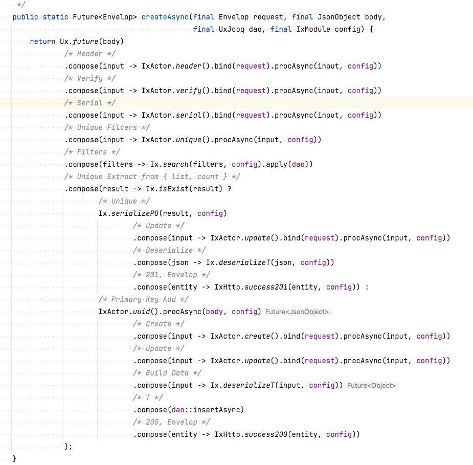
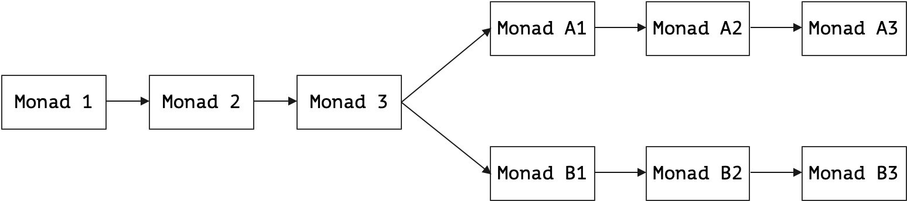
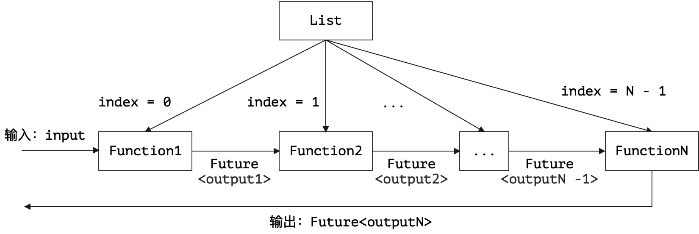
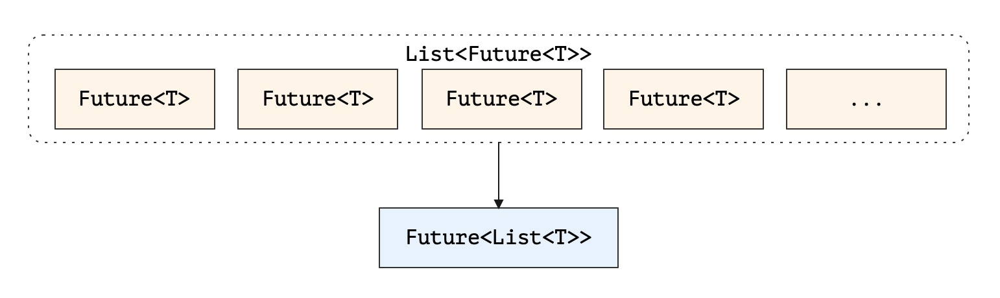
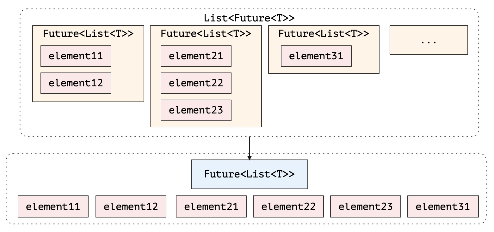
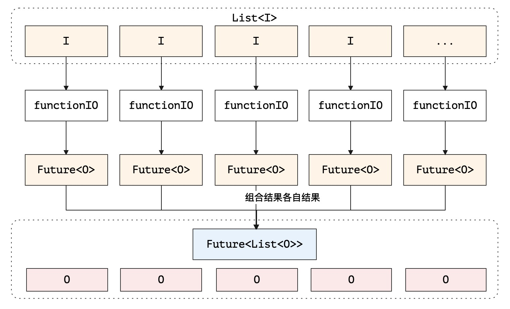
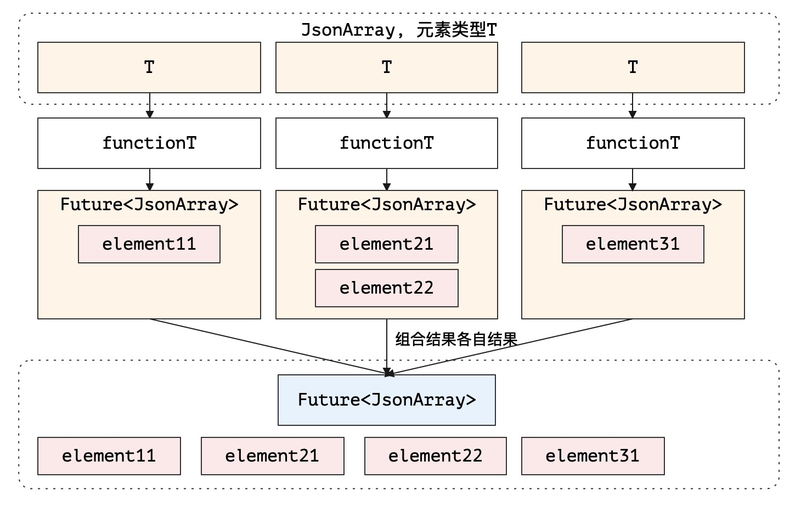
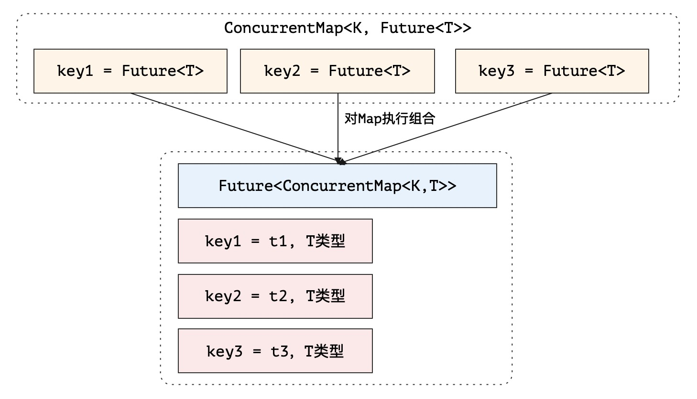
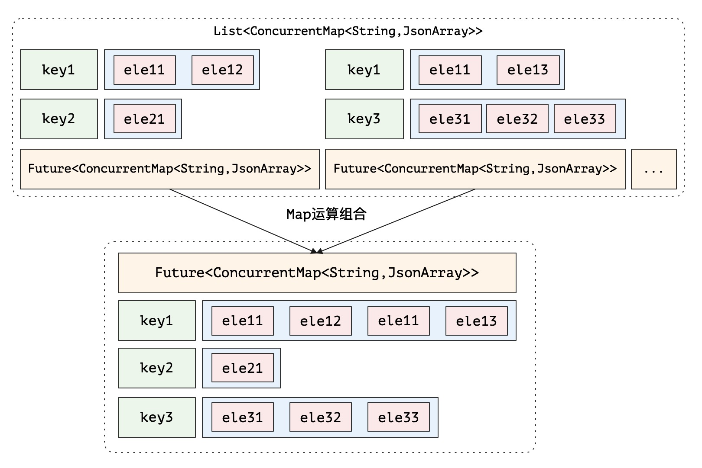
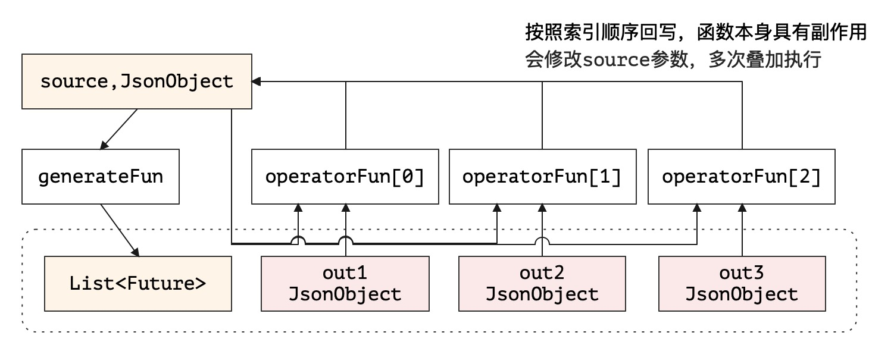

# 阡陌：Ux编排

> 山镇红桃阡陌，烟迷绿水人家。——宋 葛胜仲《西江月·山镇红桃阡陌》

* 项目地址：<https://github.com/silentbalanceyh/vertx-zero-example/>（子项目：**up-rhea**）

## 「壹」工具类

&ensp;&ensp;&ensp;&ensp;本系列教程中不会对Zero中的所有工具类一一讲解，但高频使用的工具类以及工具类的核心实现会穿插在各个所需的章节中，Zero中的工具类设计**前后端**统一，它的设计原则如下：

1. 工具类名短小，统一使用。
2. 同一类的功能函数使用相同单词前缀，拉平调用。
3. 放弃以前各种满天飞的`Util`后缀模式。

&ensp;&ensp;&ensp;&ensp;Zero后端包含单个核心工具类：

|工具类名|项目|含义|
|---:|---|:---|
|io.vertx.up.fn.Fn|vertx-co|将Java函数化专用工具类，实现丰富的函数式编程功能。|
|io.vertx.up.util.Ut|vertx-co|和Vert.x框架无关、业务无关的核心工具类。|
|io.vertx.up.unity.Ux|vertx-up|带业务功能、编排功能的容器工具类（编程高频使用）。|

&ensp;&ensp;&ensp;&ensp;为了使得前后端一致，前端则使用如下（JavaScript代码）：

```js
import Ux from 'ux';        // 无界面操作的基本工具类
import Ex from 'ex';        // 和Zero Extension模块绑定的扩展工具类
```

### 1.1. 设计思路

&ensp;&ensp;&ensp;&ensp;看看下图：


&ensp;&ensp;&ensp;&ensp;整个`unity`包中所有的工具类按职责划分成不同的类文件，每个类文件使用**包域**（不使用`public`，直接使用default域），这些类文件中所有的函数都是**静态**
（static）函数，并且也是包域；而`Ux`类中定义了和其他类的同名方法，整个包中只有`Ux`是public的（类和函数都是），那么您在编程过程中，就可以直接使用`Ux.xxx`的方式调用任何功能函数。

&ensp;&ensp;&ensp;&ensp;这种设计方式可能比较古怪，但我们团队在编程过程中却能感受它的优点：

1. 工具类中封装了所有**第三方依赖库**，使得系统的核心代码全部调用了自己开发的类，在`import`代码区域部分，只会出现`import io.vertx`和`import io.vertx.up`
   两种代码，再也不会看到第三方包出现在自己的代码中，一旦出现就可以用统一的思路进行工具化。
2. 工具类统一使用`Ux.xxx`调用，您不需要在使用工具过程中去记忆相关功能函数存在于哪个`XxxUtil`中，减少了开发人员记忆工具类的压力，仅记忆相关函数即可。
3. 重构更简单：如果遇到改变代码逻辑，可以不用修改`Ux.java`的代码逻辑，而是改内部工具逻辑，此种情况下，多个人协同开发时也减少了相互之间冲突的概率。
4. 更容易代码去重：前边提到过一个Zero中代码重构的原则——如果一个函数只有单个类在调用，那么直接使用`private`私有代替工具类，如果一个函数有两个或两个以上的类在调用，直接工具化。

&ensp;&ensp;&ensp;&ensp;有了这样的设计，在整个编程过程中，您的大部分时间都是如何思考业务，一旦要用工具，使用`Ux.`就可以选择您想使用想要的方法了，非常简单。

> 这只是Zero中的工具箱设计思路，和容错部分异常结构的设计类似，读者可以参考，不可奉为圭臬。

### 1.2. 编排初探

&ensp;&ensp;&ensp;&ensp;在看编排之前，我们一起看一段`zero-crud`中的代码：



&ensp;&ensp;&ensp;&ensp;这段代码包含复杂的代码逻辑，但主程序中只负责**编排**
，每一个功能点都直接抽象成一个Monad单子，在这样的结构下，主流程代码量会很少，而且逻辑会变得更加清晰，不论这是否是你喜欢的风格，都不可否认这种方式的代码流畅性和可维护性。上述代码结构类似下图：



&ensp;&ensp;&ensp;&ensp;这种编排结构代码的特征如下：

1. 每一个Monad单子中内部代码逻辑可以是同步也可以是异步，但**箭头**表示的数据流过程全程异步。
2. 每一个Monad单子都是接近封闭逻辑的全函数，一方面它们没有任何副作用，另外一方面自己执行失败也不会影响后续Monad单子的运行。
3. 主代码只负责Monad的排兵布阵，不负责执行，调试时只需将关注点集中在单个Monad中。
4. 一个完整的代码逻辑会被分成独立的代码执行函数，如果每个Monad能设计成**单一职责**，调试将会是莫大的福音。
5. 整个结构中同一个链上的Monad位置可切换，切换过后不影响执行结果，当然二者之间不依赖是代码这一层相互独立，有时候数据层面还是有一定的依赖关系，这种情况会导致切换位置过后数据不完整，但不会造成严重的代码错误。

&ensp;&ensp;&ensp;&ensp;如此，您就理解编排的意义所在了，这样的代码编排更多的思考是在如何拆分和设计结构，不用去纠结过多的判断逻辑导致代码难于维护。

### 1.3. 异步带来的挑战

&ensp;&ensp;&ensp;&ensp;如果您使用了`async/await`
的方式编写异步代码，那么我们就不聊了，毕竟这种模式是最好的也是思路最正的，但是用过Vert.x的开发人员都知道，这种方式需要您开启Java的Fiber，并且引入额外的`-agent`
才能实现，会导致环境不纯；而另外一种Rx响应式的模式在Vert.x中又是另外一个故事了，也不在讨论范围。

&ensp;&ensp;&ensp;&ensp;在选择Vert.x中四种异步模式时，Zero选择了中规中矩的Future模式，虽然支持Callback回调模式，但本身不推荐使用这种模式编程，——这也许不是最好的选择，但是比较原生态的，所以您可以理解为什么Vert.x官方并没有把`Fiber`
和`Rx`放到`vertx-core`中，而是以子模块存在。

&ensp;&ensp;&ensp;&ensp;Future模式实际结构和Promise规范很像，我们在业务开发过程往往会遇到不同的情况：

1. 两个步骤必须一前一后地执行，因为后者的执行依赖前者的结果，而前者结果是异步返回。
2. 几个步骤同时执行，执行完成后要合并到一起返回最终结果。
3. 对多个步骤执行结果进行数据结构的转换。
4. 不同步骤之间有各种集合运算和数据结构转换，不能和流程控制**解耦**。

&ensp;&ensp;&ensp;&ensp;Vert.x中使用了如下代码执行Future的基本构造：

```java
// 成功Future
Future.succeededFuture(input);
// 失败Future
Future.failedFuture(exception);
```

&ensp;&ensp;&ensp;&ensp;有了这些简单的API过后，**同步数据异步化**、**单链执行**
对大部分开发人员而言没有任何难度，而本章我们将介绍Zero为多步骤编排提供的核心函数，这些函数可以大大提升您在异步代码流程开发中的效率，而且可以从一定程度上改变您的编程思路，并且解决上边提到的各种挑战和问题。

## 「贰」简单编排

&ensp;&ensp;&ensp;&ensp;可能对很多读者而言，本章比较无趣，主要原因是本章的部分内容可能存在**过度设计**而显得画蛇添足，但从实战中可以看到，Zero中的**编排工具**
的确是帮助了我们而使得编程流程不是想象中那么繁琐，省掉了编排压力后，开发过程会变得相对简单，这是我在用Zero开发前两个系统时最大的感受——几乎是无脑编排，相当于扩展过的API调用。

> 本小节主要讲解部分代码在有了Ux过后的演化，虽然侧重点很小，但实际开发过程中比较受用。而简单编排的函数我称为future系。

&ensp;&ensp;&ensp;&ensp;虽然Vert.x中提供了类似`Future.succeededFuture`
的方法直接支持泛型，但为了简化代码和引入部分初始化的运算，Zero又重新对此执行了封装。Zero中future系的API主要包含下边几种：

|方法名|返回类型|含义|
|:---|---|:---|
|future|T|返回单实体类型。|
|futureL|`List<T>`|返回集合`List<T>`类型。|
|futureA|JsonArray|返回JsonArray类型。|
|futureE|Throwable|返回异常类型。|
|futureJ|JsonObject|返回JsonObject类型。|
|futureG|Map|对集合执行分组，返回Map类型。|

### 2.1. 直接构造

&ensp;&ensp;&ensp;&ensp;读者根据自身习惯书写，除了简化和短小，这些代码并没进行任何逻辑改动。

```java
// 类型：null
Future.succeededFuture();                    
Ux.future();
// 类型：T
Future.succeededFuture(t);
Ux.future(t);                                
// 类型：JsonArray
Future.succeededFuture(new JsonArray());
Ux.futureA();                             
// 类型：JsonObject
Future.succeededFuture(new JsonObject());
Ux.futureJ();
// 类型：List<JsonObject>
Future.succeededFuture(new ArrayList<>());
Ux.futureL();
```

&ensp;&ensp;&ensp;&ensp;是不是特别无趣？这些代码几乎只是浅层次的封装，不过您不要着急，由于future系的API众多，如果只是这样的更改，那么提供future系的代码功能就没有必要了，这些基本层次的改动只是为了统一API而做。

### 2.2. 微型转换

&ensp;&ensp;&ensp;&ensp;更进一步，看看下边的代码改动（这部分不提供Vert.x中的代码转换，因为存在大量重复性的类型转换代码）：

```java
// List<T> 转换成 JsonArray
Ux.futureA(list);
// T 转换成 JsonObject
Ux.futureJ(entity);
// List<T> 转换成 List<JsonObject>
Ux.futureL(list);
```

&ensp;&ensp;&ensp;&ensp;除了上述的基本类型转换，Ux还包含业务类型相关的转换：`io.vertx.up.commune.Record`是Zero中定义的一种概念对象——**记录**，该对象在**动态建模**
时会作为数据主体对象，动态建模依赖`zero-atom`项目，底层数据结构定义在Zero框架内部，所以和它相关的部分运算收录在Ux中。由于是**动态建模**专用，Record不会有`class`
定义的Java类型和它进行类型转换，只能让它和Json数据进行互转。

```java
// Record 转换成 JsonObject
Ux.futureJ(record);
// Record[] 转换成 JsonArray
Ux.futureA(records);
```

### 2.3. 带错转换

&ensp;&ensp;&ensp;&ensp;带错转换只出现于返回值为具体类型的情况，这种转换大部分时候应用在`otherwise`相关的方法中：

```java
// Vert.x 中带Throwable的otherwise方法定义如下：
default Future<T> otherwise(Function<Throwable, T> mapper)
```

&ensp;&ensp;&ensp;&ensp;Vert.x中的设计是为了让系统本身变得很完美，而这个方法在开发人员调试时通常会使用类似下边的代码段：

```java
future.compose(...).compose(...).otherwise(error -> {
    error.printStackTrace();
    return ??;    // 此处 ?? 在某些场景下不可为 null 
})
```

&ensp;&ensp;&ensp;&ensp;如果想要查看异步流程的异常堆栈信息，上述代码有时候必须的，当然如果代码测试通过，这些内容似乎就没有必要了，往往您在开发过程中会出现**中间态**
，Zero的目的是帮助您思考甚至辅助您的思考过程，这似乎是它“画蛇添足”的一点。参考Zero中的写法：

```java
// 返回 JsonArray，默认 []
future.compose(...).otherwise(Ux::futureA);
// 返回 JsonObject，默认 {}
future.compose(...).otherwise(Ux::futureJ);
// 自定义默认值, Supplier模式，不可传null
future.compose(...).otherwise(Ux.otherwise(DefaultClass::new));
// 自定义默认值, 值模式，不可传null
future.compose(...).otherwise(Ux.otherwise(defaultClass));
// Envelop专用的otherwise
future.compose(...).otherwise(Ux.otherwise());
```

&ensp;&ensp;&ensp;&ensp;是不是更简洁而且可以**无脑编码**？

### 2.4. 简单串并联

&ensp;&ensp;&ensp;&ensp;简单串并联模式中，并联过程会返回输入值，但很方便做**插件链**。

```java
// 串联模式，(final T input, final List<Function<T, Future<T>>> functions)
Ux.future(input, list);
// 并联模式，(final T input, final Set<Function<T, Future<T>>> functions)
Ux.future(input, set);
```

&ensp;&ensp;&ensp;&ensp;这两个方法需要使用图示法给读者讲解，否则仅仅从函数调用上会**不知所云**。

**简单串联模式**



&ensp;&ensp;&ensp;&ensp;如图所示，串联模式的API中，第一个参数为列表第一个函数的输入，执行完后使用Future封装将结果传给第二个函数，依次类推（有点像JSR340中的**责任链**
模式），整个函数链执行完成后最终返回**最后一个函数**的执行结果。

**简单并联模式**

> 简单并联模式不关心执行结果，最终返回的是input输入数据，复杂并联模式没有在future系的API中。


&ensp;&ensp;&ensp;&ensp;如图所示，并联模式下，所有的函数都是**同时执行**
，并且不等待任何函数执行的输出结果就直接将输入信息返回，这种模式下不存在等待，而且每个函数都是无序的，所以这种模式下往往调用过后会不知道是否执行完，从外部看来也是**异步操作**。

&ensp;&ensp;&ensp;&ensp;如果将二者合并到一起就可以创造出多维流程，读者可以自己去探索，此处就不详细解读了。

### 2.5. 映射转换

&ensp;&ensp;&ensp;&ensp;映射层是Zero为部分旧系统量身打造的功能，在请求数据和最终的领域模型之间引入了可配置的映射层，透过该映射层去实现旧系统往新的数据规范升级的功能，之前的Jooq部分所有的API都带有pojo的映射转换参数，它会关联一个特定的领域模型配置文件，所有的映射文件位于`src/main/resources/pojo/`
目录中。

&ensp;&ensp;&ensp;&ensp;先看一个例子：

**映射文件内容**

```yaml
# src/main/resources/pojo/user.yml
mapping:
  userName: username
  pwd: password
  emailAccount: email
```

> 映射文件左值是Domain对象的属性值，右值是请求数据中的属性值。

**领域模型代码**

```java
package cn.vertxup.pojo;

import java.io.Serializable;

public class OldUser implements Serializable {
    private String userName;
    private String pwd;
    private String emailAccount;
    // 省略掉get/set部分的代码以及其他
}
```

**Agent代码**

```java
@EndPoint
@Path("/hi/pojo")
public interface PojoAgent {
    
    @POST
    @Path("/user")
    @Address("ZERO://WORKER/POJO/USER")
    String hiSync(@BodyParam JsonObject data);
}
```

**Worker代码**

```java
package cn.vertxup.pojo;

import io.vertx.core.Future;
import io.vertx.core.json.JsonObject;
import io.vertx.up.annotations.Address;
import io.vertx.up.annotations.Queue;
import io.vertx.up.unity.Ux;

@Queue
public class PojoActor {

    @Address("ZERO://WORKER/POJO/USER")
    public Future<JsonObject> hiPojo(final OldUser user) {
        return Ux.future(user).compose(Ux.futureJ("user"));
    }
}
```

&ensp;&ensp;&ensp;&ensp;最终发送请求：

```json
{
    "userName": "lang.yu",
    "pwd": "pwd",
    "emailAccount": "lang.yu@126.com"
}
```

会得到如下响应信息：

```json
{
    "data": {
        "username": "lang.yu",
        "password": "pwd",
        "email": "lang.yu@126.com"
    }
}
```

&ensp;&ensp;&ensp;&ensp;结合配置中的映射文件，轻松实现了字段名的映射操作，此处枚举所有和带pojo转换的API的详细列表，您可以自己去尝试。

**future系**

```java
// List<T> 转换成 JsonArray （直接模式、函数模式）
future.compose(listT -> Ux.futureA(listT, pojo));
future.compose(Ux.futureA(pojo));
// T 转换成 JsonObject（直接模式、函数模式）
future.compose(t -> Ux.futureJ(t, pojo));
future.compose(Ux.futureJ(pojo));
// List<T> 转换成 List<JsonObject>
future.compose(listT -> Ux.futureL(listT, pojo));
future.compose(Ux.futureL(pojo));
```

**from/to系（同步）**

```java
// 序列化
// t -> JsonObject
JsonObject tJson = Ux.toJson(t);
JsonObject tJson = Ux.toJson(t, pojo);
// list<T> -> JsonArray
JsonArray tArray = Ux.toJson(listT);
JsonArray tArray = Ux.toJson(listT, pojo);

// 反序列化
// JsonObject -> t
T t = Ux.fromJson(tJson, T.class);
T t = Ux.fromJson(tJson, T.class, pojo);
// JsonArray -> List<T>
List<T> tl = Ux.fromJson(tArray, T.class);
List<T> tl = Ux.fromJson(tArray, T.class, pojo);
```

&ensp;&ensp;&ensp;&ensp;此处就不枚举和Envelop相关的**序列化/反序列化**方法了，读者可以直接去查看`Ux`中的`fromEnvelop`
相关方法，比起映射方法，这部分方法相对复杂一点，如果不是特殊场景一般用得很少。

### 2.6. 分组转换

&ensp;&ensp;&ensp;&ensp;分组转换是`Ux`中future系函数中的最后一类，主要是帮助您完成分组操作，它的API主要有四个：

* 快速方法：按`type`属性执行分组
    * `futureG(JsonArray)`
    * `futureG(List<T>)`
* 标准方法：按输入属性执行分组
    * `futureG(JsonArray, field)`
    * `futureG(List<T>, field)`

&ensp;&ensp;&ensp;&ensp;分组转换是Zero中后期追加的方法，所以这些方法的返回值统一为：

```java
Future<ConcurrentMap<String, JsonArray>>
```

&ensp;&ensp;&ensp;&ensp;分组转换在此处就不提供示例了，读者可以参考下图理解分组转换的执行流程：


> 分组不支持映射转换，因为可以先做映射再分组，也没有必要提供同时支持二者的结构。

## 「叁」复杂编排

&ensp;&ensp;&ensp;&ensp;看完了Zero中的**简单编排**系列的函数，您是不是有所心得了呢？那么本章节将会带您走入复杂编排，这里包含更多的异步操作，理论上用**编排**
一词好像不太科学，因为前一个章节大部分代码都是在运算而不是编排，但我们就不去纠结这里的内容了，读懂了内容，叫什么也显得没那么重要，可是本章节的内容绝对是和编排直接相关。

&ensp;&ensp;&ensp;&ensp;组合编排是十分高频的一种编排模式，它把一个元素类型为`Future<T>`的集合组合成唯一的一个`Future`，then系函数剩余部分的编排都是**同样的思路**，只是细节上有所区别。

&ensp;&ensp;&ensp;&ensp;then系函数的方法名不多，大部分都是函数重载（方便记忆），基本统计如下：

|函数名|含义|
|:---|:---|
|thenCombine|元素类型是JsonObject。|
|thenCombineT|元素类型是T（泛型）。|
|thenCombineArray|元素类型是JsonArray。|
|thenCombineArrayT|元素类型是集合，类似`List<T>`。|
|thenCompress|主要执行了压缩，元素类型是复合类型。|

> 复杂编排的函数我称为then系。

### 3.1. 异常

&ensp;&ensp;&ensp;&ensp;异常函数不能称为编排，主要是在Zero容错生成的基础上更进一步简化该流程，此处枚举等价代码让读者自己体会：

```java
// 原始代码
final WebException error = new _500EnvironmentException(this.getClass(), sigma);
return Future.failedFuture(error);
// 使用 thenError
return Ux.thenError(_500EnvironmentException.class, this.getClass(), sigma);
```

&ensp;&ensp;&ensp;&ensp;**注意**：`thenError`方法的参数表，第二个参数开始是动参，可支持多个，直接和Zero中的`WebException`构造函数参数表统一。

```java
// thenError函数参数表
thenError(final Class<? extends WebException> clazz, final Object... args);

// _500EnvironmentException.class构造函数参数表
_500EnvironmentException(final Class<?> clazz, final String sigma)
```

&ensp;&ensp;&ensp;&ensp;由于在Zero中，定义的、WebException的首参必须是class类型，有了这种约定过后，它们的转换才可以生效，最终的结构图如下:


&ensp;&ensp;&ensp;&ensp;另外一个函数是为Zero Extension量身打造的方法，返回固定异常（-60045）：

```java
Future<T> thenErrorSigma(final Class<?> clazz, 
                         final String sigma, final Supplier<Future<T>> supplier)
```

> 该方法在后续版本中可能会被直接废弃，只保留thenError足够使用了。

### 3.2. 直接组合

&ensp;&ensp;&ensp;&ensp;直接组合的代码流程图如下：



&ensp;&ensp;&ensp;&ensp;Zero Extension中的一段代码如：

```java
// 构造 List<Future<String>>
final List<Future<String>> futures = new ArrayList<>();
stream(folder).map(BtLoader::importFuture).forEach(futures::add);
// 返回 Future<List<String>>
return Ux.thenCombineT(futures)
```

&ensp;&ensp;&ensp;&ensp;上述代码中就完成了直接组合图中的逻辑，调用了`Ux.thenCombineT`函数，此处集合中的每一个元素都是`Future<T>`
，真正在执行过程中所有的元素会并行执行，最终返回的类型为`Future<List<String>>`，您可以很轻松得到所有元素的执行结果（索引对应）。除开这个函数以外，Ux中还针对特殊场景有各种组合，不带转换的组合代码汇总如下：

```java
// 单元素合并成集合
// List<Future<T>> 组合成 Future<List<T>>
Ux.thenCombineT(futureList);
// List<Future<JsonObject>> 组合成 Future<JsonArray>
Ux.thenCombine(futureList);

// 集合合并成集合
// List<Future<List<T>>> 组合成 Future<List<T>>
Ux.thenCombineArrayT(futureList);
// List<Future<JsonArray>> 组合成 Future<JsonArray>
Ux.thenCombineArray(futureList);
```

&ensp;&ensp;&ensp;&ensp;代码中的集合合并的组合流程图如下：



&ensp;&ensp;&ensp;&ensp;直接组合运算在实战过程中很实用，它可以驱动多个子线程同时执行，将多个异步流并行组合成独立的异步操作，这样您就不用担心如何让主线程等待各自的执行结果，也无需去考虑它们运行的合并细节，这就是Ux工具类带来的便利。

### 3.3. 转换组合

&ensp;&ensp;&ensp;&ensp;在**直接组合**中，输入的类型是`T / List<T>`，而输出的类型是`List<T>`，这种模式适用于简单的场景，在某些复杂场景中，这种单纯的操作不一定适用，于是有了**转换组合**
——输入**元素类型**和输出元素类型不一致。由于Future的`compose`方法可以很容易让`Future<T>`转换成`Future<O>`，所以Zero在设计转换组合时主要侧重于**同步转异步**
的模式，而不是异步直接转换，若您理解了这两种API，那么配合`compose`方法最终编排的函数会是一个全集。

```java
// List<I> 转换成 Future<List<O>>
// 第二参数：functionIO = I -> Future<O>
Ux.thenCombineT(listI, functionIO);
// JsonArray 转换成 Future<JsonArray>
// 第二参数：functionJJ = JsonObject -> Future<JsonObject>
Ux.thenCombine(jarray, functionJJ);

// JsonArray 转换成 Future<JsonArray>
// 不限定元素类型，元素为T类型
// 第三参数：functionT = T -> Future<JsonArray>
Ux.thenCombineArray(jarray, T.class, functionT);
// 限定JsonArray中类型为JsonObject（常用的对象数组），上一行代码的特殊形态
// 第二参数：functionJA = JsonObject -> Future<JsonArray>
Ux.thenCombineArray(jarray, functionJA);
```

&ensp;&ensp;&ensp;&ensp;示例中第一个函数的流程图如下：



&ensp;&ensp;&ensp;&ensp;第二个函数仅仅看输入和输出，也许您是迷茫的，因为输入是`JsonArray`，而返回值是`Future<JsonArray>`，看起来这种转换类似于`T`转换成`Future<T>`
，但它的内部逻辑是完全不一样的，请参考下边的执行流程图。



&ensp;&ensp;&ensp;&ensp;如上图所示，有几点需说明：

1. 输入的JsonArray中，每一个元素的类型都是T。
2. 最终组合后的类型会将每一个返回类型中的JsonArray连接到一起。
3. 最后一个`Ux.thenCombineArray`的双参数格式实际就是将`T`类型限定为`JsonObject`类型。

> 最终`elementX`的类型必须是JsonArray支持的Java对应数据类型。

### 3.4. 哈希组合

&ensp;&ensp;&ensp;&ensp;**哈希组合**是针对`Map`数据结构的运算，它的调用代码如下：

```java
// ConcurrentMap<K,Future<T>> 
// 转换成 Future<ConcurrentMap<K,T>>
Ux.thenCombine(mapFuture);
// List<Future<ConcurrentMap<String, JsonArray>>>
// 转换成：Future<ConcurrentMap<String, JsonArray>>
// 特殊用法，Zero Extension中字典翻译器专用
// 这里注意方法名和运算逻辑，它执行的更多是压缩
Ux.thenCompress(mapListFuture);
```

&ensp;&ensp;&ensp;&ensp;第一个函数的运算逻辑很简单，流程图如下：



&ensp;&ensp;&ensp;&ensp;第二个函数的运算比较复杂，它的输入是一个多维哈希映射的列表，列表中的每一个元素都是一个`Future`，它的函数执行难点在于List中的元素和元素之间的哈希表有可能会出现**重复键**
，而此处压缩的含义就是一旦出现重复键，会把这两个值进行合并（默认行为是将两个JsonArray连接到一起），运算的完整流程图如下：



&ensp;&ensp;&ensp;&ensp;**注意**：从结果可以看到，默认函数直接将**相同键值**的元素连接到一起了，所以`ele11`出现了两次。此处提供它的使用代码让您有一个直观认识：

```java
    /*
     * Merged each futures here
     * 1) Tabular ( type -> JsonArray )      size > 0
     * 2) Category ( type -> JsonArray )     size > 0
     * 3) Assist ( type -> JsonArray )       size > 0
     */
    return Ux.thenCompress(futures).compose(dict -> {
        final StringBuilder report = new StringBuilder();
        report.append("[ PT ] Dictionary Total：").append(dict.size());
        dict.forEach((key, array) -> report
                .append("\n\tkey = ").append(key)
                .append(", value size = ").append(array.size()));
        At.infoFlow(this.getClass(), report.toString());
        return Ux.future(dict);
    });
```

### 3.5. Json组合

&ensp;&ensp;&ensp;&ensp;**Json组合**主要面向JsonObject和JsonArray，这种组合在**旧版本**
实战中经常使用，也是所有的组合中最复杂的（理解困难，但是从实际场景中抽取），因为设计巧妙运算复杂，所以至今保留了下来。

#### 形态一

```java
public static Future<JsonArray> thenCombine(
    final Future<JsonArray> source, 
    final Function<JsonObject, Future<JsonObject>> generateFun, 
    final BinaryOperator<JsonObject> operatorFun
)
```

&ensp;&ensp;&ensp;&ensp;它的运算流程图如下：


&ensp;&ensp;&ensp;&ensp;它的执行步骤如下：

1. 输入的JsonArray中每一个元素都是合法`JsonObject`类型（不为`null`，不为`{}`，不符合的类型会直接被程序逻辑过滤掉（注：输入类型是`Future<JsonArray>`）。
2. 针对每一个JsonObject元素执行`generateFun`（支持同步和异步），最终格式如`JsonObject -> Future<JsonObject>`，假设输入为input，输出为output。
3. 使用`operatorFun`对input以及output执行计算，得到最终每个元素的唯一输出，该函数最终格式如`(JsonObject, JsonObject) -> Future<JsonObject>`。
4. 将计算结果`List<Future<JsonObject>>`组合成最终结果`Future<JsonArray>`。

#### 形态二

```java
Future<JsonArray> thenCombine(
    final JsonArray input, 
    final Function<JsonObject, Future<JsonObject>> function
)
```

&ensp;&ensp;&ensp;&ensp;它的运算流程图如下：


&ensp;&ensp;&ensp;&ensp;这种形态十分简单，此处就不列举步骤了，如果您从最初的组合阅读到此处，那么理解这个流程图也就是分分钟的事。

#### 形态三

```java
Future<JsonObject> thenCombine(
    final JsonObject source, 
    final Function<JsonObject, List<Future>> generateFun, 
    final BiConsumer<JsonObject, JsonObject>... operatorFun
)
```

&ensp;&ensp;&ensp;&ensp;它的运算流程图如下：



&ensp;&ensp;&ensp;&ensp;该形态是目前所有组合中唯一带有副作用的形态，它有三个和其他**组合**不同的点：

1. operatorFun是一个数组（变参），数组每一个元素都是函数，形态如`(JsonObject, JsonObject) -> Future<JsonObject>`。
2. operatorFun中每一个元素执行过后，一定要修改第一个参数（就是source），该数组中的函数应该都是**副作用函数**，简单说：不修改source的执行没有任何作用。
3. 该形态最终返回原始source的引用，修改流程是一次修改且和生成的List元素按索引一一对应。

### 3.6. 原子组合

&ensp;&ensp;&ensp;&ensp;then系的组合方法中最后一种是**原子组合**，这种组合的实用范围最广，使用频率更高，函数名依旧是`thenCombine`，因为它包含了所有复杂**编排**
最小操作单元；若您理解了这些函数化的操作，那么**编排**工作就变得更简单。

```java
// Future<F> + Future<S> 经过双输入函数运算生成最终的 Future<T>
// 直接运算
Ux.thenCombine(futureF, futureS, (f, s) -> futureT);
// 延迟模式
Ux.thenCombine(() -> futureF, () -> futureS, (f, s) -> futureT);
```

&ensp;&ensp;&ensp;&ensp;这两个方法是**编排**功能最早的原型，它可以帮助您组合两种不同的Future，第三参数是一个`BiFunction`
，其中f和s是前两个Future中计算的结果，而最终会生成一个`Future<T>`类型的对象（支持异步生成）。它的函数流程图下：


&ensp;&ensp;&ensp;&ensp;细心的读者会发现，这个才是**组合**的最小单元。看完了前几小节中所有的`Ux.thenX`
函数后，您会发现大部分函数都是针对List、Set、Map执行组合运算，而前边看的所有函数或多或少都不是**原子级**，而这两个函数用法就是原子级用法。**两个方法的思路是二合一，拓展开来——任意的多合一都可以拆成无数二合一**
，所以它就是原子操作。

## 「肆」小结

&ensp;&ensp;&ensp;&ensp;Ux编排部分的函数讲解到此处就差不多告一段落了，这部分内容对不熟悉Vert.x中Future开发的人而言可能比较晦涩，但的确涵盖了很多异步**编排**
的思路，并且本章节大部分的函数都是直接从实战项目衍生而来。最后汇总说明：

1. 目前Ux提供的所有then系的函数涵盖了部分变化，但并没有涵盖所有的编排情况。
2. 目前出现的情况除开**编排**以外，也可以使用集合算法去实现，使用集合算法时，您就需要思考每一步只使用一个Future的情况，不能出现类似`List<Future>`的结构，但从实战经验看来，不是每次您在编程时都可以思考出**
   最佳方案**，况且不能为了所谓的最佳方案直接视进度于不顾，项目本身不是艺术品，是商品，您的时间空间十分有限。
3.
在一些复杂任务中，集合的处理效率不如单元素并行处理效率，虽然您可以使用复杂的数学公式计算出二者的奇点（性能平衡点），但不会一次命中，这是程序性能中一个永恒的博弈话题：究竟是1个线程处理100个元素快，还是100个线程每个线程处理1个快，如果把100换成y，把1换成x呢？其实这个问题绝对不是您肉眼可直接观测的答案。
4. **编排**是异步编程中的一种艺术，而且它也不是银弹，您可以根据自己的实际需要去写复杂的运算逻辑，而且您会发现Ux中编排函数的占比是最大的。

&ensp;&ensp;&ensp;&ensp;Zero中为什么会有then系和future系这些稀奇古怪看似无用而有时候又蕴含复杂逻辑的方法，理论上讲框架是不是应该纯粹一点？我最初写这些方法的目的就是为了解决IDE对代码重复的提示，这是**
起点**，当我发现场景中越来越多的地方要使用同样的编排逻辑，就只有将这些逻辑全部抽成工具函数，然后代码重复率直线下降，而且收集的编排需求越多，代码量越小，所以在实战过程中，Ux中的**编排**
功能也给整个团队带来了很大的福音，也使得最后Zero中代码重复率几乎在3% ~ 5%以下，最少IDEA不会提示有代码重复的地方。希望本文的思路对读者的助力最大，而不是这些函数本身，当然如果您熟练掌握了`Ux`
的编排函数，在Zero中开发将会更加顺风顺水。


