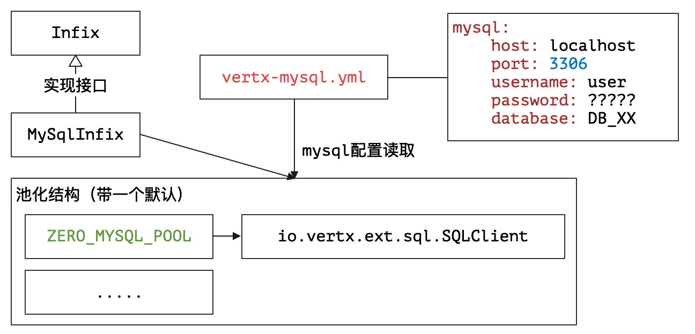

# 13. 始源之地：Vert.x集成

> 考槃在涧，硕人之宽。独寐寤言，永矢弗谖。——佚名《国风·卫风》

* 项目地址：<https://github.com/silentbalanceyh/vertx-zero-example/>（子项目：**up-native**）

## 「壹」Vert.x子项目

&ensp;&ensp;&ensp;&ensp;Vert.x从3.x开始，就将曾经的工具箱重新进行了模块化设计，您可以在官方文档中看到很多相关子项目（2.x中的模块化完全是灾难级的）：


&ensp;&ensp;&ensp;&ensp;可能您会困惑，如果使用Zero，是不是就用不了这些相关的子项目了呢？答案是否定的，在Zero中您可以开发**连接点**
程序，有了它您可以直接和Vert.x提供的官方子项目集成（类似`MySQL Client`
），也可以和Zero中设计的标准插件集成。Zero中的标准插件主要源起于实战，有些插件是Vert.x的子项目未提供的，而两种插件的引入使用统一的模式，Zero的玩法不一定最炫，但铁定会让您眼前一亮！

> `ifx`全称为`infix`，翻译为“中缀、插入”。

&ensp;&ensp;&ensp;&ensp;Zero的子项目`vertx-ifx`中包含了目前支持的所有插件，这些插件的开发流程都遵循了本章节的思路，其中还包含类似**Neo4j**、**ElasticSearch**、**
Excel**等官方不支持的集成，一旦您学会了本章完整的开发思路，那么您的项目自然如虎添翼。目前的插件如下表：

|项目名|类型|含义|
|:---|---|:---|
|zero-ifx-es|Zero|ElasticSearch功能模块。|
|zero-ifx-excel|Zero|Excel导入导出功能模块（可直连Jooq功能模块）。|
|zero-ifx-feign|Zero|Feign功能模块。|
|zero-ifx-history|Zero|系统读写日志历史数据库（第二库）。|
|zero-ifx-iqiy|Zero|Qiy爱奇艺视频客户端。|
|zero-ifx-neo4j|Zero|Neo4j的非SQL数据库图库集成模块。|
|zero-ifx-shell|Zero|命令行工具抽象框架。|
|zero-ifx-sms|Zero|阿里云手机短信服务。|
|zero-ifx-native|Vertx|MySQL和PgSQL客户端专用集成（标准）。|
|zero-ifx-mongo|Vertx|Mongo数据库客户端。|
|zero-ifx-redis|Vertx|Redis功能模块。|

&ensp;&ensp;&ensp;&ensp;**表格中的类型**标识了该插件是Vert.x集成插件还是Zero的集成插件，本章不去剖析部分复杂的插件用法，后续会有单独的章节讲解，主要告诉读者：

1. 如何在Zero中开发这种插件项目以及**连接点**程序（如何扩展）。
2. 如何在您的Agent/Worker组件中使用这些扩展。

&ensp;&ensp;&ensp;&ensp;这些插件的设计以**单一职责**为原则，项目本身比较小，代码不多，目的也是让您在选择时可直接根据所需**按需引入**。

### 1.1. MySQL孤岛

#### 1.1.1. 插件分析

&ensp;&ensp;&ensp;&ensp;Zero中使用了MySQL，但由于**动态建模**的影响，并没有使用Vert.x中的`MySQL Client`，而是将Jooq标准化了。有关`MySQL Client`
的引入目前存在于`zero-ifx-native`项目中，它只包含了一个代码文件（读者无需自己开发）：

```java
package io.vertx.up.plugin.jdbc;

import io.vertx.core.Vertx;
import io.vertx.ext.asyncsql.MySQLClient;
import io.vertx.ext.sql.SQLClient;
import io.vertx.up.annotations.Plugin;
import io.vertx.up.eon.Plugins;
import io.vertx.up.fn.Fn;
import io.vertx.up.plugin.Infix;

import java.util.concurrent.ConcurrentHashMap;
import java.util.concurrent.ConcurrentMap;

@Plugin
@SuppressWarnings("unchecked")
public class MySqlInfix implements Infix {

    private static final String NAME = "ZERO_MYSQL_POOL";

    private static final ConcurrentMap<String, SQLClient> CLIENTS
            = new ConcurrentHashMap<>();

    private static void initInternal(final Vertx vertx,
                                     final String name) {
        Fn.pool(CLIENTS, name, () -> 
            Infix.init(
                Plugins.Infix.MYSQL,
                (config) -> MySQLClient.createShared(vertx, config, name),
                MySqlInfix.class
            )
        );
    }

    public static void init(final Vertx vertx) {
        initInternal(vertx, NAME);
    }

    public static SQLClient getClient() {
        return CLIENTS.get(NAME);
    }

    @Override
    public SQLClient get() {
        return getClient();
    }
}
```

&ensp;&ensp;&ensp;&ensp;把它称为**孤岛**，就是因为整个`zero-ifx-native`项目中只有这个文件，而这个文件却包含了很多巧思，也包含了Zero插件结构的骨架代码。
&ensp;&ensp;&ensp;&ensp;接口`io.vertx.up.plugin.Infix`是Zero中为第三方功能模块设计的插件接口，实现该接口的类必须包含两个基本规范：

1. 这是一个插件，必须被@Plugin（`io.vertx.up.annotations.Plugin`）注解。
2. 这个插件必须包含初始化静态方法（根据Vertx实例初始化插件）：

    ```java
    public static void init(final Vertx vertx)
    ```

&ensp;&ensp;&ensp;&ensp;Zero中的插件连接点实现了**池化客户端**，如`MySqlInfix`构造完成后的完整结构如下：



&ensp;&ensp;&ensp;&ensp;默认情况下，您获取的客户端引用直接和`ZERO_MYSQL_POOL`绑定，Zero中和Vert.x集成的所有`Infix`目前的版本都没扩展**第二客户端**
，是否扩展最终取决于您的实际项目需求，上边代码中的插件您可以直接使用。

#### 1.1.2. 插件使用

&ensp;&ensp;&ensp;&ensp;本章讲解如何在Zero中使用`Infix`插件。

&ensp;&ensp;&ensp;&ensp;第一步：先在您的项目`pom.xml`文件中引入该插件的依赖，由于Zero中所有`vertx-ifx`子项目都已经定义过版本，所以可省略`<version>`标签：

```xml
    <dependency>
        <groupId>cn.vertxup</groupId>
        <artifactId>zero-ifx-native</artifactId>
        <!-- 版本部分可省略，如果编译通不过，就使用下边这种。-->
        <version>${zero.version}</version>
    </dependency>
```

&ensp;&ensp;&ensp;&ensp;第二步：在项目中书写以下配置文件（以MySQL为例）：

```shell
src/main/resources/vertx.yml
src/main/resources/vertx-inject.yml
src/main/resources/vertx-mysql.yml
```

&ensp;&ensp;&ensp;&ensp;上述三个文件内容如下：

**vertx.yml片段**

```yaml
zero:
    # lime专用扩展，默认会读取vertx-inject.yml，所以不需配置它；
    # 此处的mysql表示Zero会去读取vertx-mysql.yml配置文件
    lime: mysql
    vertx:
        instance:
            # 未显示实例列表
```

**vertx-mysql.yml**内容如：

```yaml
mysql:
  host: localhost
  port: 3306
  username: root
  password: ????
  database: DB_IOP
```

**vertx-inject.yml**内容如：

```yaml
# MySQL插件引入
mysql: io.vertx.up.plugin.jdbc.MySqlInfix
```

&ensp;&ensp;&ensp;&ensp;第三步：完成了上述配置后，您就可以直接在您的Agent或Worker组件中使用`SQLClient`了，参考下边代码：

**Agent代码**

```java
package cn.vertxup.mysql;

import io.vertx.core.json.JsonObject;
import io.vertx.ext.sql.SQLClient;
import io.vertx.up.annotations.EndPoint;
import io.vertx.up.annotations.Plugin;

import javax.inject.infix.MySql;
import javax.ws.rs.GET;
import javax.ws.rs.Path;

@EndPoint
@Path("/hi/mysql")
public class MySqlAgent {
    @Plugin
    private transient SQLClient clientA;

    @MySql
    private transient SQLClient clientB;

    @GET
    @Path("/client")
    public JsonObject hiAgent() {
        final JsonObject response = new JsonObject();
        response.put("clientA", this.clientA.toString());
        response.put("clientB", this.clientB.toString());
        return response;
    }
}
```

&ensp;&ensp;&ensp;&ensp;发送请求到地址`/hi/mysql/client`，您可以得到如下响应：

```json
{
    "data": {
        "clientA": "io.vertx.ext.asyncsql.impl.ClientWrapper@225b8ca6",
        "clientB": "io.vertx.ext.asyncsql.impl.ClientWrapper@225b8ca6"
    }
}
```

&ensp;&ensp;&ensp;&ensp;从响应结果可以知道，实际`clientA`和`clientB`引用了同一个对象，在整个环境中，都指向了`ZERO_MYSQL_POOL`绑定的`SQLClient`
。上边注解部分的代码使用了依赖注入（Worker和Agent组件中代码相同），如果不使用依赖注入，则您可以使用下边代码获取：

```java
// 这种代码在非Agent/Worker环境中尤其有用，比如工具类中。
final SQLClient client = MySqlInfix.getClient();
```

&ensp;&ensp;&ensp;&ensp;值的注意的是在Vert.x的3.9.8中（不知哪个版本开始），原来的`vertx-mysql-postgresql-client`项目已经被**废弃**
了，那是不是本章内容无用了呢？其实不然，虽然废弃了原来的SQLClient，但还引入了`MySQLClient`以及`PgSQLClient`，只是分得更细了，后续版本中我会更新Zero的Vert.x集成部分的代码，将`native`
拆成不同的子项目来对待，但整体思路以及玩法和本章节的内容保持高度一致，读者就不用去困惑了。

> `javax.inject.infix`包中的注解为保留注解，后续版本扩展时会根据不同功能执行拓展，如果是您自己定义的插件，直接使用标准的`io.vertx.up.annotations.Plugin`即可。

### 1.2. Mongo

&ensp;&ensp;&ensp;&ensp;前一个章节讲解了`zero-ifx-native`项目的内容、用法、以及Zero中**插件**的开发和使用思路，本章节使用同样的思路来分析`zero-ifx-mongo`
，这个项目是从最早的手机实战中延生出来的子项目，当初使用了`MongoDB`作为数据库。回到前文思路中，先看看`MongoInfix`的写法：

```java
package io.vertx.tp.plugin.mongo;

import io.vertx.core.Vertx;
import io.vertx.ext.mongo.MongoClient;
import io.vertx.up.annotations.Plugin;
import io.vertx.up.eon.Plugins;
import io.vertx.up.fn.Fn;
import io.vertx.up.plugin.Infix;

import java.util.concurrent.ConcurrentHashMap;
import java.util.concurrent.ConcurrentMap;

@Plugin
@SuppressWarnings("unchecked")
public class MongoInfix implements Infix {

    private static final String NAME = "ZERO_MONGO_POOL";

    private static final ConcurrentMap<String, MongoClient> CLIENTS
            = new ConcurrentHashMap<>();

    private static void initInternal(final Vertx vertx,
                                     final String name) {
        Fn.pool(CLIENTS, name,() -> 
            Infix.init(
                Plugins.Infix.MONGO,
                (config) -> MongoClient.createShared(vertx, config, name),
                MongoInfix.class
            )
        );
    }

    public static void init(final Vertx vertx) {
        initInternal(vertx, NAME);
    }

    public static MongoClient getClient() {
        return CLIENTS.get(NAME);
    }

    @Override
    public MongoClient get() {
        return getClient();
    }
}
```

&ensp;&ensp;&ensp;&ensp;熟悉的味道、熟悉的配方，有了前一个章节的基础，理解这部分代码轻车熟路。它的基本配置如下：

**Maven中引入**

```xml
    <dependency>
        <groupId>cn.vertxup</groupId>
        <artifactId>zero-ifx-mongo</artifactId>
        <!-- 版本部分可省略，如果编译通不过，就使用下边这种。-->
        <version>${zero.version}</version>
    </dependency>
```

**vertx-mongo.yml**

> 具体配置项可参考官方的MongoOptions。

```yaml
mongo:
    db_name: xxx
    post: xxx
    host: xxx
    connection_string: xxxx
    username: xxx
    password: xxx
```

**vertx-inject.yml**

```yaml
mongo: io.vertx.tp.plugin.mongo.MongoInfix
```

&ensp;&ensp;&ensp;&ensp;这部分的代码就不详细叙述了，参考下边代码段：

```java
// ..... import 部分
// Mongo客户端引用
import io.vertx.ext.mongo.MongoClient;
// Mongo专用注解
import javax.inject.infix.Mongo;
// ..... 主代码部分
// 插件引用
    @Plugin
    private transient MongoClient clientA;

    @Mongo
    private transient MongoClient clientB;
```

&ensp;&ensp;&ensp;&ensp;如此，您就可以直接在Zero的Agent和Worker组件中直接使用Mongo客户端了，若想要直接在工具类中使用，则可参考：

```java
// 工具类中使用
final MongoClient client = MongoInfix.getClient();
```

### 1.3. Redis

&ensp;&ensp;&ensp;&ensp;Zero目前版本只支持三个和Vert.x集成项目的子项目：

* `zero-ifx-native`：MySQL/PgSQL
* `zero-ifx-mongo`：MongoDB
* `zero-ifx-redis`：Redis

&ensp;&ensp;&ensp;&ensp;本章我们分析一下Redis的基础用法，Redis的**插件**在Zero中是最复杂的，它支持的功能如下：

1. 提供了和Mongo类似的`RedisInfix`实现Redis的异步访问。
2. 引入`Jedis`客户端新增同步访问（适用于旧场景）。
3. 可替换Vert.x Web中的Session存储介质，将`web-session`存储在Redis中替换原生存储。

&ensp;&ensp;&ensp;&ensp;还是回到本章重点`Infix`的代码：

```java
package io.vertx.tp.plugin.redis;

import io.vertx.core.Vertx;
import io.vertx.core.json.JsonObject;
import io.vertx.redis.client.Redis;
import io.vertx.redis.client.RedisOptions;
import io.vertx.up.annotations.Plugin;
import io.vertx.up.eon.Plugins;
import io.vertx.up.log.Annal;
import io.vertx.up.plugin.Infix;
import io.vertx.up.util.Ut;
import redis.clients.jedis.Jedis;

import java.util.Objects;
import java.util.concurrent.ConcurrentHashMap;
import java.util.concurrent.ConcurrentMap;

@Plugin
@SuppressWarnings("unchecked")
public class RedisInfix implements Infix {

    private static final String NAME = "ZERO_REDIS_POOL";
    private static final Annal LOGGER = Annal.get(RedisInfix.class);

    private static final ConcurrentMap<String, Redis> CLIENTS
            = new ConcurrentHashMap<>();
    private static final ConcurrentMap<String, Jedis> CLIENTS_SYNC
            = new ConcurrentHashMap<>();

    private static void initInternal(final Vertx vertx,
                                     final String name) {
        final RedisOptions options = Infix.init(Plugins.Infix.REDIS,
                /*
                 * Two parts for
                 * - Redis reference
                 * - RedisOptions reference ( For Sync usage )
                 */
                (config) -> new RedisOptions(initSync(name, config)),
                RedisInfix.class);
        /*
         * Redis client processing, ping to check whether it's Ok
         */
        final Redis redis = Redis.createClient(vertx, options);
        CLIENTS.put(name, redis);
        redis.connect(handler -> {
            /*
             * If connected, keep
             * If not connected, remove
             * This kind of operation could let your system synced the Redis
             * instead of Null Pointer in Unit Testing
             */
            if (handler.succeeded()) {
                LOGGER.info("[ Redis ] Connected successfully! {0}", 
                    options.toJson().encode());
            } else {
                final Throwable ex = handler.cause();
                if (Objects.nonNull(ex)) {
                    LOGGER.jvm(ex);
                }
                CLIENTS.remove(name);
            }
        });
    }

    private static JsonObject initSync(
        final String name, 
        final JsonObject options) {
        if (!CLIENTS_SYNC.containsKey(name)) {
            final String host = options.getString("host");
            final Integer port = options.getInteger("port");
            final Jedis client = new Jedis(host, port);
            // Auth
            final String password = options.getString("password");
            if (Ut.notNil(password)) {
                final String username = options.getString("username");
                if (Ut.isNil(username)) {
                    client.auth(password);
                } else {
                    client.auth(username, password);
                }
            }
            try {
                client.ping();
                CLIENTS_SYNC.put(name, client);
            } catch (final Throwable ex) {
                LOGGER.jvm(ex);
            }
        }
        return options;
    }

    public static void init(final Vertx vertx) {
        initInternal(vertx, NAME);
    }

    public static Redis getClient() {
        return CLIENTS.get(NAME);
    }

    public static Jedis getJClient() {
        return CLIENTS_SYNC.get(NAME);
    }

    public static void disabled() {
        CLIENTS.clear();
        CLIENTS_SYNC.clear();
    }

    @Override
    public Redis get() {
        return getClient();
    }
}
```

&ensp;&ensp;&ensp;&ensp;在Redis部分，除了Vert.x在集成中引入了新版的Redis异步访问部分，还包含了Jedis的同步访问部分（同步不支持JSR330），二者结合使得功能更加完善，基本代码如下：

**Maven引入**

```xml
    <dependency>
        <groupId>cn.vertxup</groupId>
        <artifactId>zero-ifx-redis</artifactId>
        <!-- 版本部分可省略，如果编译通不过，就使用下边这种。-->
        <version>${zero.version}</version>
    </dependency>
```

**vertx-redis.yml**

```yaml
redis:
    post: xxx
    host: xxx
```

**vertx-inject.yml**

```yaml
redis: io.vertx.tp.plugin.redis.RedisInfix
```

&ensp;&ensp;&ensp;&ensp;使用部分参考下边代码段：

```java
// ..... import 部分
// Redis客户端引用
import io.vertx.redis.client.Redis;
// Jedis客户端引用
import redis.clients.jedis.Jedis;
// Redis专用注解
import javax.inject.infix.Redis;
// ..... 主代码部分
// 插件引用（注入模式只支持Redis，不支持Jedis）
    @Plugin
    private transient Redis clientA;
    @Redis
    private transient Redis clientB;
// 工具读取（异步）
final Redis client = RedisInfix.getClient();
// 同步唯一获取引用方式
final Jedis client = RedisInfix.getJClient();
```

&ensp;&ensp;&ensp;&ensp;那么到这里，整个Zero中目前牵涉的三个和Vert.x的集成就告一段落，根据本章节的内容，读者可以很快和MySQL、Mongo、Redis集成，并去详细体会Zero中`Infix`
插件的详细内容，后续版本中，我会根据实际项目需求将部分客户端内容标准化，当前版本则提供给读者自己发挥。最后强调一点，本章节所有的`Infix`实现代码都是Zero已经提供的代码，使用时不需额外开发。

> 挑战：最后留一个挑战，您可以尝试自己去开发一个Infix彻底理解Zero中的插件结构。

## 「贰」内置插件

&ensp;&ensp;&ensp;&ensp;除了第一章节表格中枚举的Zero子项目以外，Zero中还有部分内置的`Infix`插件，本章主要讲解一个特殊的内置插件`MapInfix`
；和Redis项目插件一样，Zero为了兼容部分遗留系统或老系统，通常都会开**同步**和**异步**双通道来做新旧的桥接，如果只支持异步不支持同步，虽然看起来更加Vert.x，但对很多项目的迁移将是灾难。

### 2.1. MapInfix

&ensp;&ensp;&ensp;&ensp;Vert.x中的SharedData数据结构是类似Hash表的一种结构，它不仅仅可以在本地环境使用，也可以在集群环境使用，Zero Extension中用来存储**临时授权码**
就使用了该结构，为了同时支持**同步**和**异步**，Zero提供了一个特殊的`SharedClient`，该客户端架构和`MySQLClient`以及`MongoClient`类似（Vert.x没有），而本章的`MapInfix`
就是用来访问该Client的**插件**。

&ensp;&ensp;&ensp;&ensp;`MapInfix`的完整代码如下：

```java
package io.vertx.tp.plugin.shared;

import io.vertx.core.Vertx;
import io.vertx.up.annotations.Plugin;
import io.vertx.up.eon.Plugins;
import io.vertx.up.fn.Fn;
import io.vertx.up.plugin.Infix;

import java.util.concurrent.ConcurrentHashMap;
import java.util.concurrent.ConcurrentMap;

@Plugin
@SuppressWarnings("all")
public class MapInfix implements Infix {

    private static final String NAME = "ZERO_MAP_POOL";

    private static final ConcurrentMap<String, SharedClient<String, Object>> 
        CLIENTS = new ConcurrentHashMap<>();

    private static void initInternal(final Vertx vertx,
                                     final String name) {
        Fn.pool(CLIENTS, name,() -> 
            Infix.init(
                Plugins.Infix.SHARED,
                (config) -> SharedClient.createShared(vertx, config, name),
                MapInfix.class
            )
        );
    }

    public static void init(final Vertx vertx) {
        initInternal(vertx, NAME);
    }

    public static SharedClient<String, Object> getClient() {
        return CLIENTS.get(NAME);
    }

    public static String getDefaultName() {
        return NAME;
    }

    @Override
    public SharedClient<String, Object> get() {
        return getClient();
    }
}
```

&ensp;&ensp;&ensp;&ensp;由于该插件是内置，所以基本使用代码中不需Maven的额外引入，直接可用。

**vertx-shared.yml**

```yaml
shared:
  # 默认模式是同步模式，如果要使用异步模式，则需打开该开关
  async: true
```

**vertx-inject.yml**

```yaml
shared: io.vertx.tp.plugin.shared.MapInfix
```

&ensp;&ensp;&ensp;&ensp;使用代码段如：

```java
// ...import 导入部分
import io.vertx.tp.plugin.shared.SharedClient;
import io.vertx.up.annotations.Plugin;
// JSR330注入
    @Plugin
    private transient SharedClient client;
// 工具类中使用方法
final SharedClient client = SharedInfix.getClient();
```

### 2.2. SharedClient

#### 2.2.1. 结构综述

&ensp;&ensp;&ensp;&ensp;由于当前插件的特殊性，`SharedClient`是Zero提供的接口，本小节简单讲解该接口中常用的API函数，该客户端的完整图示如下：


&ensp;&ensp;&ensp;&ensp;每个SharedClient内部都包含了一个对应的**同步引用**（LocalMap）和**异步引用**
（AsyncMap）。由于Vert.x中的LocalMap不能在集群环境中跨环境使用，`vertx-shared.yml`
中的配置会让SharedClient选择内部实现模式，如果是异步则使用AsyncMap，如果是同步则使用LocalMap，且只能二选一。

&ensp;&ensp;&ensp;&ensp;如果您要使用多个Map如何操作，您可以使用下边的API函数（图中的切换）。

```java
SharedClient<K, V> switchClient(final String name)
```

&ensp;&ensp;&ensp;&ensp;上述API可以让您直接切换客户端引用，一旦切换后您就可以操作第二个SharedClient，Zero中保证每个名字下只有一个SharedClient实例，实现池化单件结构。

```java
// name = ZERO_MAP_POOL
SharedClient client1 = MapInfix.getClient(); 
// name = test
SharedClient client2 = client1.switchClient("test");
```

#### 2.2.2. 最小单元

&ensp;&ensp;&ensp;&ensp;SharedClient最小操作单元为`io.vertx.up.atom.Kv`——该数据结构存储了一个`key = value`的完整信息，包括键名、键值等，该类的完整实现代码如下:

```java
package io.vertx.up.atom;

import java.util.Map;
import java.util.Objects;

/*
 * [Data Structure]
 * Definition for `key = value` pair here
 * It stored `key = value` and act as Pair here for some spec usage
 */
public final class Kv<K, V> {
    private K key;
    private V value;

    private Kv(final K key, final V value) {
        this.key = key;
        this.value = value;
    }

    public static <K, V> Kv<K, V> create() {
        return new Kv<>(null, null);
    }

    public static <K, V> Kv<K, V> create(final K key,
                                         final V value) {
        return new Kv<>(key, value);
    }

    public final K getKey() {
        return this.key;
    }

    public final V getValue() {
        return this.value;
    }

    public void set(final K key, final V value) {
        this.key = key;
        this.value = value;
    }

    @Override
    public final int hashCode() {
        return Objects.hashCode(this.key) ^ Objects.hashCode(this.value);
    }

    @Override
    public final boolean equals(final Object o) {
        if (o == this) {
            return true;
        }
        if (o instanceof Map.Entry) {
            final Map.Entry<?, ?> e = (Map.Entry<?, ?>) o;
            return Objects.equals(this.key, e.getKey()) &&
                    Objects.equals(this.value, e.getValue());
        }
        return false;
    }

    @Override
    public String toString() {
        return "Kv{" +
                "key=" + this.key +
                ", value=" + this.value +
                '}';
    }
}
```

&ensp;&ensp;&ensp;&ensp;该结构和`Map.Entry`类似，但比`Map.Entry`更简化，Zero内部很多地方都使用了该数据结构。

#### 2.2.3. 操作类API

&ensp;&ensp;&ensp;&ensp;同步所有API定义如下：

```java
    // 将 key = value 存储到SharedData中
    Kv<K, V> put(K key, V value);
    // 将 key = value 存储到SharedData中，expiredSecs秒后自动移除
    Kv<K, V> put(K key, V value, int expiredSecs);
    // 移除 key 对应的 key = value 键值对，返回刚移除的项
    Kv<K, V> remove(K key);
    // 读取 key 对应的 value 值
    V get(K key);
    // 读取 key 对应的 value，如果 once = true，则读取后移除
    V get(K key, boolean once);
    // 清除所有
    boolean clear();
    // 返回当前Map尺寸
    int size();
    // 返回当前Map所有 key 名集合
    Set<K> keys();
```

&ensp;&ensp;&ensp;&ensp;异步所有API定义如下：

```java

    @Fluent
    SharedClient<K, V> put(K key, V value, 
        Handler<AsyncResult<Kv<K, V>>> handler);

    @Fluent
    SharedClient<K, V> put(K key, V value, int expiredSecs, 
        Handler<AsyncResult<Kv<K, V>>> handler);

    @Fluent
    SharedClient<K, V> remove(K key, 
        Handler<AsyncResult<Kv<K, V>>> handler);

    @Fluent
    SharedClient<K, V> get(K key, 
        Handler<AsyncResult<V>> handler);

    @Fluent
    SharedClient<K, V> get(K key, boolean once, 
        Handler<AsyncResult<V>> handler);

    @Fluent
    SharedClient<K, V> clear(
        Handler<AsyncResult<Boolean>> handler);

    @Fluent
    SharedClient<K, V> size(
        Handler<AsyncResult<Integer>> handler);

    @Fluent
    SharedClient<K, V> keys(
        Handler<AsyncResult<Set<K>>> handler);
```

&ensp;&ensp;&ensp;&ensp;简单汇总：

1. 异步类型的API全部参考Vert.x子项目中的Client架构量身打造，且每个API都是`@Fluent`的，由于参考了Vert.x子项目，所以并不包含Future模式。
2. 这些API比Map常规API唯一多出来的两个功能是：
    1. 存储到Map中的**项（key = value）**可按秒计时，如果超时则Zero会自动移除该项。
    2. 可使用**一次读取**的函数，该项被消费后就直接从数据结构中移除。

### 2.3. Ux.Pool

&ensp;&ensp;&ensp;&ensp;`Ux.Pool`是Zero提供的另外一个工具函数，它近似于`Ux.Jwt`和`Ux.Jooq`
，提供了Zero中常用的函数（可以理解成SharedClient的Future模式的封装）。使用它的初始化代码如：

```java
// 使用默认的SharedData，name = ZERO_MAP_POOL
Ux.Pool.on();         // UxPool 类型
// 使用带名称的SharedData，name = test
Ux.Pool.on("test");    // UxPool类型
```

&ensp;&ensp;&ensp;&ensp;实际上边代码片段最终返回了`UxPool`类型，看看它开放的所有API定义：

```java
public <K, V> Future<Kv<K, V>> put(final K key, final V value)
public <K, V> Future<Kv<K, V>> put(final K key, final V value, int expiredSecs)
public <K, V> Future<Kv<K, V>> remove(final K key)
public <K, V> Future<V> get(final K key)
public <K, V> Future<V> get(final K key, final boolean once)
public Future<Boolean> clear()
public Future<Integer> size()
public Future<Set<String>> keys()
```

&ensp;&ensp;&ensp;&ensp;该工具和SharedClient中的API维持了高度统一，所以只是转换了异步函数，转换成了`Future`
的返回结果以方便使用Zero的开发人员，最后提供一份内部使用临时授权码部分的调用代码给您参考：

```java
    // 读取授权码
    @SuppressWarnings("all")
    static <V> Future<V> code(final String key) {
        final String codePool = CONFIG.getCodePool();
        return Ux.Pool.on(codePool).remove(key)
                .compose(value -> Ux.future((V) value.getValue()));
    }
    // 写入授权码，加入30秒的过期时间
    static <V> Future<V> code(final String key, final V value) {
        final String codePool = CONFIG.getCodePool();
        final Integer codeExpired = CONFIG.getCodeExpired();
        return Ux.Pool.on(codePool).put(key, value, codeExpired)
                .compose(item -> Ux.future(item.getValue()));
    }
```

## 「叁」小结

&ensp;&ensp;&ensp;&ensp;本文主要给您讲解了Zero如何和Vert.x中的子项目做集成，并且通过集成部分给您讲解了Zero中的**插件**Infix架构，可能有部分读者会困惑，为什么不直接在`SharedClient`
中提供Future模式？这和Vert.x中的子项目有关，为了和Vert.x中的大部分子项目高度统一，所以才提供了原生风格类似的异步API（全@Fluent模式结构），而扩展部分的API才会提供Future模式，简单说SharedClient几乎是参考Vert.x中子项目的各种Client仿造的。

&ensp;&ensp;&ensp;&ensp;目前Zero提供的工具类中，主要包含如下：

|工具类|类型|含义|
|:---|---|:---|
|Ux.Jooq.on(daoClass)|UxJooq|和Jooq生成的VertxDAO绑定简化数据库访问。|
|Ux.Join.on()|UxJoin|实现跨表访问，JOIN类型的读取、搜索、统一。|
|Ux.Pool.on()|UxPool|和SharedData绑定可调Future模式的异步API。|
|Ux.Jwt|UxJwt|和安全中Jwt相关的核心工具类。|
|Ux.Job.on()|UxJob|获取任务管理器，启动、停止、恢复后台任务专用。|


