# 14. 俯瞰：配置地图

> 俯瞰江流青一带，坐看山色碧千寻。——蔡戡《陪宪使登榕溪阁》

* 项目地址：<https://github.com/silentbalanceyh/vertx-zero-example/>（子项目：**up-native**）
*
完整地图文件：[Version 1.1](https://github.com/silentbalanceyh/vertx-zero-example/blob/master/document/zero/graphic/zero-configuration.png)

&ensp;&ensp;&ensp;&ensp;本文不讲解任何和Zero Extension相关的详细配置信息，那是另外一个故事，而本文中使用的配置地图部分以1.1版为主，可能和本系列教程中的内容不一致，主要是写本文时Zero
Extension最新版还在开发中。

## 「壹」内部配置

&ensp;&ensp;&ensp;&ensp;虽然Zero框架名字叫“零”，没有任何配置也是可启动的，但往往在真实项目中要真正零配置几乎是不太可能，只是设计时如何让配置的量减到最低，又或者说让配置本身变得简单而实用且易于扩展，让开发人员压力更小，这才是目的。

&ensp;&ensp;&ensp;&ensp;Zero的基础配置规范如下：

1. 只有两种配置文件名，`.json`和`.yml`（yaml）格式。
2. 主配置从`src/main/resources`中的`vertx.yml`文件作入口。

&ensp;&ensp;&ensp;&ensp;选择`yml`文件是因为我在设计和开发Zero之前一直使用的是Spring Boot，而Zero框架的很多设计思路也是基于它而来，正因为在实际项目开发中看到了**痛点、难点**
，所以一切从简，同时使得曾经用过Spring Boot的开发者可以很流畅过渡。

### 1.1. Zero配置结构

&ensp;&ensp;&ensp;&ensp;Zero预定义了基础框架的部分结构，该结构存储在`vertx-co`项目中，且它的完整结构如下图：


&ensp;&ensp;&ensp;&ensp;Zero中的核心配置主要分两部分：

* **内部配置**：内部配置在您提供了相关配置后会被合并（`内部配置 = 默认配置 + 您的配置`）。
* **Lime配置**：Lime配置主要由用户提供，提供该配置后，Zero会去扫描所有关联的节点，最终生成唯一的一份`JsonObject`——全环境统一配置。

&ensp;&ensp;&ensp;&ensp;从上述配置信息可知，除了内部配置以外，其他Lime相关配置的根节点不能出现重复（重复会覆盖），本章的任务就是带着您看看Zero中目前的Lime有些什么样的魑魅魍魉。

### 1.2. 异常配置

&ensp;&ensp;&ensp;&ensp;异常配置包含两个文件：

|文件名|Lime方式|含义|
|:---|---|:---|
|vertx-error.yml|Lime配置|错误代码异常堆栈信息定义模板，以E打头。|
|vertx-readible.yml|独立文件|直接读取，和vertx-error.yml代码绑定。|

&ensp;&ensp;&ensp;&ensp;之前讲解容错部分已经解释过这两个文件的用法，此处就不详细解释它的基本结构了，您可以将这两个文件理解成两个**哈希表**，针对某一个错误代码`code`而言：

```yaml
# vertx-error.yml
# WebException定义时，该文件中的配置是必须的，如果没有则报错。
E<code>: "message, {0}, {1}, {2}"

# vertx-readible.yml
# 如果定义了该文件，那么就会在错误响应信息中追加一个业务描述节点`info`给前端使用。
<code>: "您的错误信息，xxxxx"
```

#### 配置地图

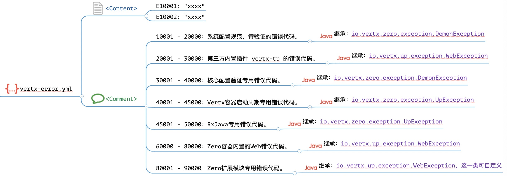

### 1.3. 插件配置

&ensp;&ensp;&ensp;&ensp;插件配置位于`vertx-inject.yml`文件中，默认插件配置只包含了日志记录器：

```yaml
logger: io.vertx.up.log.internal.Log4JAnnal
```

&ensp;&ensp;&ensp;&ensp;除此，您还可以增加以下配置：

```yaml
# 「Zero框架内置」
# 启用Jooq数据库访问功能，启用后才可使用 Ux.Jooq
jooq: io.vertx.tp.plugin.jooq.JooqInfix
# Cache，缓存专用，内置缓存实现，SharedMap
shared: io.vertx.tp.plugin.shared.MapInfix
# Job，任务插件，启用后台任务系统
job: io.vertx.tp.plugin.job.JobInfix

# 「Zero标准化插件」
# zero-ifx-history专用配置，启用trash回收站功能，可保存删除历史
trash: io.vertx.tp.plugin.history.TrashInfix
# zero-ifx-excel专用配置，启用Excel的导入/导出功能
excel: io.vertx.tp.plugin.excel.ExcelInfix
# zero-ifx-es专用配置，启用ElasticSearch功能
elasticsearch: io.vertx.tp.plugin.elasticsearch.ElasticSearchInfix
# zero-ifx-neo4j专用配置，启用Neo4j，图引擎数据库专用
neo4j: io.vertx.tp.plugin.neo4j.Neo4jInfix

# 「Zero和Vert.x集成插件」
# zero-ifx-redis专用配置，启用Redis
redis: io.vertx.tp.plugin.redis.RedisInfix
# zero-ifx-native专用配置，启用SQLClient
mysql: io.vertx.up.plugin.jdbc.MySqlInfix
# zero-ifx-mongo专用配置，启用MongoClient
mongo: io.vertx.tp.plugin.mongo.MongoInfix

# 「Zero扩展模块插件」
# zero-jet 动态路由专用配置，启用非Annotation模式的动态路由发布功能
router: io.vertx.tp.jet.JetPollux
```

> 如果您编写了自定义的Infix，那么上述配置中只要不重名即可。

#### 配置地图

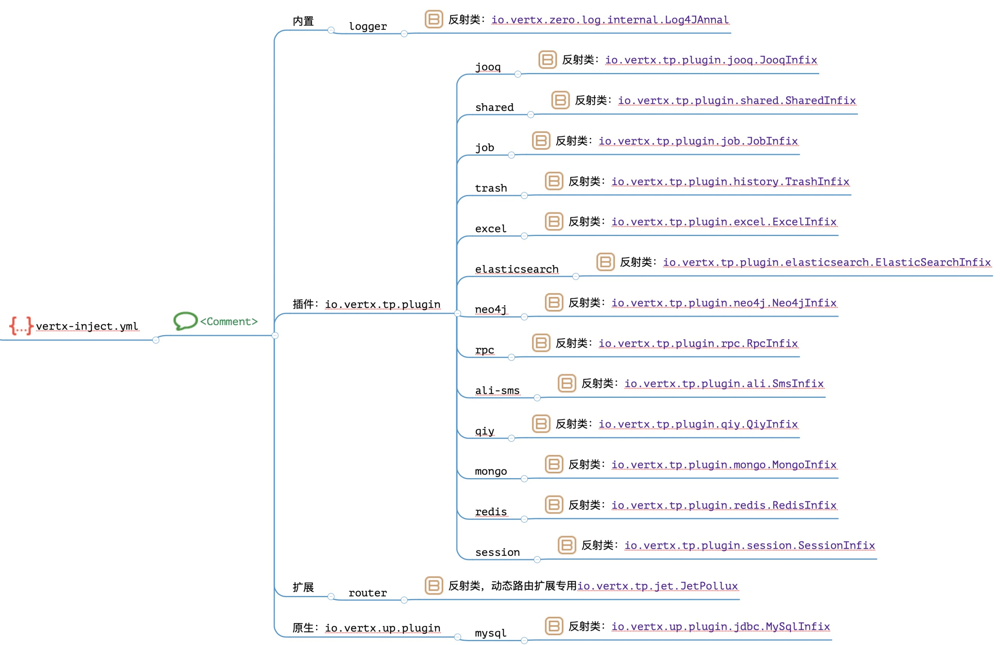

### 1.4. Resolver配置

&ensp;&ensp;&ensp;&ensp;Resolver配置是Zero中的特殊配置，它的基础内容位于`vertx-resolver.yml`文件中，默认内容如：

```yaml
default: io.vertx.up.uca.rs.mime.resolver.DefaultResolver
application:
  json: io.vertx.up.uca.rs.mime.resolver.JsonResolver
  octet-stream: io.vertx.up.uca.rs.mime.resolver.BufferResolver
  x-www-form-urlencoded: io.vertx.up.uca.rs.mime.resolver.XFormResolver
multipart:
  form-data: io.vertx.up.uca.rs.mime.resolver.FormResolver
```

&ensp;&ensp;&ensp;&ensp;上述配置在之前的文件中讲解过，按文件结构，它处理的MIME如下表格：

|MIME值|处理类|含义|
|:---|:---|:---|
|（默认）|DefaultResolver|处理不带MIME的请求。|
|application/json|JsonResolver|Json数据处理。|
|application/octet-stream|BufferResolver|二进制数据处理。|
|application/x-www-form-urlencoded|XFormResolver|多媒体表单处理。|
|multipart/form-data|FormResolver|带上传功能请求处理。|

#### 配置地图

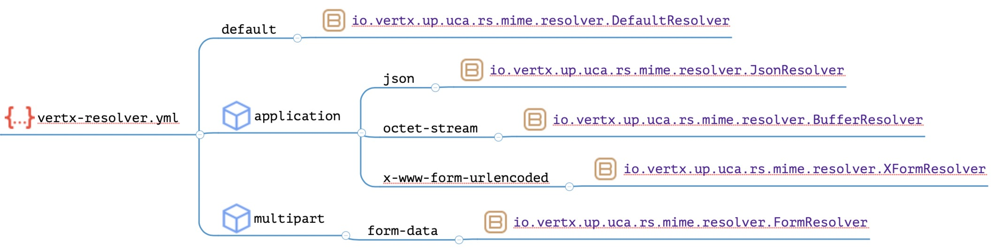

### 1.5. 服务器配置

&ensp;&ensp;&ensp;&ensp;服务器配置位于`vertx-server.yml`文件中，默认的配置如下：

```yaml
server:
# 当前服务节点名称，微服务模式下可标识节点服务器
- name: zero-ws
# 服务器类型
  type: http
# 服务器配置数据，类型不同则配置有所区别
  config:
    # 端口号
    port: 6083
    # 发布服务的Host地址，该值表示任意IP
    host: 0.0.0.0
```

&ensp;&ensp;&ensp;&ensp;注意这里支持的服务器数量是多个，`server`节点是一个数组，而不是单个服务器，主要是为**微服务环境**量身打造的，而此处的`type`节点是读者必须要理解的节点

|type值|含义|Options|
|---|:---|:---|
|http|Http服务器，常用的RESTful容器。|HttpServerOptions|
|api|微服务模式中的Api Gateway服务。|HttpServerOptions|
|ipc|微服务模式中的Service服务，此时根据名称进行连接。|HttpServerOptions|
|sock|「保留」WebSocket专用服务。||
|rx|「保留」Rx模式下的Http服务器（类名不同。||

> 「保留」为设计了此扩展但还未实现的部分，后续版本会逐渐扩展。

#### 地图配置


### 1.6. 主配置

&ensp;&ensp;&ensp;&ensp;主配置位于`vertx.yml`文件中，默认的配置内容如：

```yaml
zero:
  # 默认连接三个扩展文件
  #     vertx-error.yml
  #     vertx-inject.yml
  #     vertx-server.yml
  lime: error, inject, server
  vertx:
    # Vert.x集群服务配置
    clustered:
      # 启用 Vert.x 集群服务
      enabled: false
      # 配置 Vert.x 集群服务中的类名，为ClusterManager
      # 后期版本会使用 HA 配置代替
      manager:
      # 配置数据（根据不同的ClusterManager有所区别）
      options: 
   
    # Vert.x实例配置，为数组结构，如果是集群模式则可使用多个
    instance:
      # Vert.x实例名
    - name: vx-zero
      # Vert.x实例对应的Vert.x配置，VertxOptions类型的Json序列化结构
      options:
        # Fix block 2000 limit issue.
        maxEventLoopExecuteTime: 6000000000
```

&ensp;&ensp;&ensp;&ensp;Zero中设计的完整Vert.x部分的配置结构图如下：

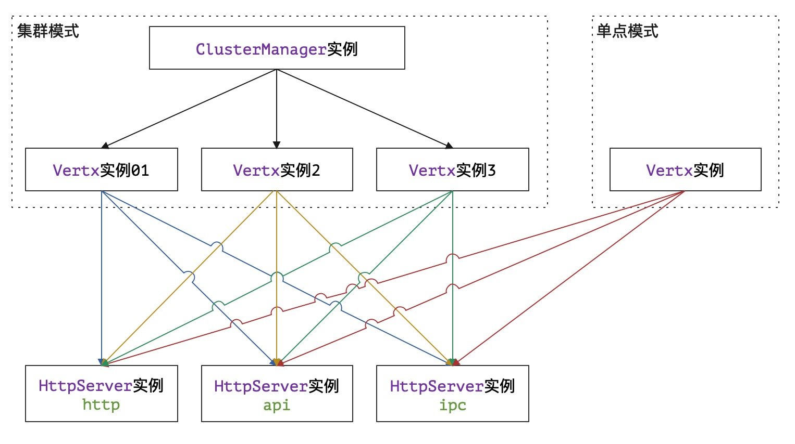

&ensp;&ensp;&ensp;&ensp;整个结构包含了两个维度处理RESTful的配置：

1. 您是使用Vert.x的集群模式还是单点模式（实战可知，单点模式已经够用了）。
2. 您是使用Zero中的单机模式还是微服务模式（微服务模式下需配置ipc和api两种服务器）。

&ensp;&ensp;&ensp;&ensp;主配置的Vert.x实例的每个节点`options`对应的就是`VertxOptions`数据结构。

&ensp;&ensp;&ensp;&ensp;本章节中所有的配置都包含了**固定的文件名**，这是Zero内置的固定配置，如果您想要拓展自己的配置只能走Lime，这也是本文第一章节称为**内部配置**的原因，汇总如下：

|文件名|Lime方式|含义|
|:---|---|:---|
|vertx.yml|独立文件|主配置文件，Vertx实例专用配置。|
|vertx-inject.yml|Lime配置|插件Infix专用配置文件。|
|vertx-server.yml|Lime配置|HTTP服务器专用配置。|
|vertx-resolver.yml|独立文件|MIME解析器（可扩展）。|
|vertx-error.yml|Lime配置|异常代码表。|
|vertx-readible.yml|独立文件|业务异常信息配置。|

#### 配置地图


## 「贰」Lime配置

> lime的翻译为石灰，石灰遇水就会爆发出能量，在系统中它表示所有的插件遇到了Zero后就可发挥出它的最大能量，对所有lime配置而言，Zero就是：生命之源。

&ensp;&ensp;&ensp;&ensp;Lime配置是Zero中最灵活的配置，您可以使用一个文件来配置所有内容，也可以使用多个文件来分开配置，不论多少文件，其文件名都是按照`lime`中定义的子文件进行汇总，假设您定义了如下片段：

```yaml
vertx:
    lime: x1, x2, x3
```

&ensp;&ensp;&ensp;&ensp;那么Zero会将`vertx-x1.yml、vertx-x2.yml、vertx-x3.yml`
三个文件内容合并到一起生成一个唯一的JsonObject配置，这种做法唯一的限制就是Lime针对不同功能时配置的键名必须唯一。

### 2.1. 常用规范

&ensp;&ensp;&ensp;&ensp;此处提供两套完整的文件规范（不包含主配置）。

**按功能拆分**

|文件名|含义|
|:---|:---|
|vertx-jooq.yml|Jooq主库配置、历史库配置。|
|vertx-session.yml|会话专用配置。|
|vertx-redis.yml|Redis相关配置（zero-ifx-redis)。|
|vertx-trash.yml|历史库备份功能专用配置（zero-ifx-history）。|
|vertx-es.yml|ElasticSearch专用配置（zero-ifx-es）。|
|vertx-neo4j.yml|Neo4j图库配置（zero-ifx-neo4j）。|
|vertx-secure.yml|安全相关配置（包括跨域配置）。|
|vertx-shell.yml|DevOps命令行专用配置（zero-ifx-shell）。|
|vertx-router.yml|动态路由启用专用配置（zero-jet）。|
|vertx-deployment.yml|Verticle部署专用配置。|
|vertx-init.yml|初始化专用配置。|
|vertx-extension.yml|Zero Extension模块核心配置。|
|vertx-job.yml|后台任务专用配置。|
|vertx-cache.yml|L1、L2、L3缓存专用配置。|
|vertx-debug.yml|调试专用配置。|
|vertx-shared.yml|SharedData专用配置。|
|vertx-sms.yml|阿里短信服务配置（zero-ifx-sms）。|
|vertx-iqiy.yml|爱奇艺视频服务配置（zero-ifx-iqiy）。|
|vertx-feign.yml|Feign客户端配置（zero-ifx-feign）。|
|vertx-excel.yml|Excel导入导出专用配置（zero-ifx-excel）。|
|vertx-rpc.yml|微服务专用配置（zero-iproxy）。|
|vertx-etcd.yml|微服务ETCD专用配置。|

**最佳实践**

&ensp;&ensp;&ensp;&ensp;最佳实践主要来自于生产环境中的基础文件合并，上述文件过多，如果不做一定程度的压缩，那么对开发人员而言挺繁琐的，压缩文件符合几个基本原则：

1. 复杂配置和独立功能放到一个独立文件中以方便直接更改。
2. 常用固定配置基本只需要配置一次，修改后就不变了，放到一起。
3. 生产部署和开发不同的文件放到一起，每次部署之前统一修改，也方便DevOps脚本。

&ensp;&ensp;&ensp;&ensp;压缩过后的文件结构如：

|文件名|含义|
|:---|:---|
|vertx-excel.yml|Excel导入导出专用定义，内容比较长，独立文件。|
|vertx-cache.yml|L1、L2、L3三级缓存的基础配置（目前只支持L1，Redis）。|
|vertx-shell.yml|DevOps专用配置。|
|vertx-secure.yml|维持不变。|
|vertx-rpc.yml|微服务专用配置（zero-iproxy），原`-rpc, -etcd`|
|vertx-extention.yml|原`-init, -extension，-job, -shared, -session`配置。|
|vertx-jet.yml|原`-router, -deployment`配置。|
|vertx-jooq.yml|原`-jooq, -redis, -trash, -es, -neo4j`配置，以及跨域。|
|vertx-tp.yml|原`-sms, -iqiy`相关配置。|

&ensp;&ensp;&ensp;&ensp;简单说明一下：

1. `vertx-jooq.yml`是在切换环境时改动最大的一个文件，这样的结构做环境迁移几乎不需要去改动其他配置文件，仅修改`vertx-jooq.yml`即可，因为它包含了所有和Zero相关的集成部分。
2. 单点模式下`vertx-tp.yml、vertx-rpc.yml`是不用配置的文件。
3. `vertx-jet.yml`主控Verticle数量，可做简单模式下的性能调优。

&ensp;&ensp;&ensp;&ensp;所以最终形成的配置文件结构如：


&ensp;&ensp;&ensp;&ensp;截图中目录配置表如下：

|目录名|含义|
|:---|:---|
|cab|`X_MODULE`中和前端页面绑定的动态配置。|
|codex|Zero验证模块专用的接口验证配置（@Codex）。|
|keys|安全专用jceks文件目录以及其他签名文件目录。|
|plugin|Zero Extension模块专用文件目录。|
|pojo|旧系统映射层专用配置文件目录。|
|init|初始化Excel模板数据存储位置，包含所有OOB数据文件。|
|runtime|运行时的静态配置（可自由处理）。|

&ensp;&ensp;&ensp;&ensp;以上目录中除`init`和`runtime`是可自定义的，其他几个目录几乎是固定的，而且不会重复以及冲突。`init`目录中包含了系统初始化的所有配置数据，它是**产品**
第一个版本的OOB（Out-Of-Box）数据，您可以直接使用该目录的数据重置系统，等价于**恢复出厂**；`runtime`
目录中包含了运行时的各种配置数据，如DevOps、动态建模临时文件、数据模板、特殊插件、测试框架Mock配置等所有和运行相关的配置文件都在此目录中。

> 接下来按功能来看看各部分的详细配置，瞅瞅这张地图，详细配置图可参考：

### 2.2. vertx-jooq.yml

#### 配置地图

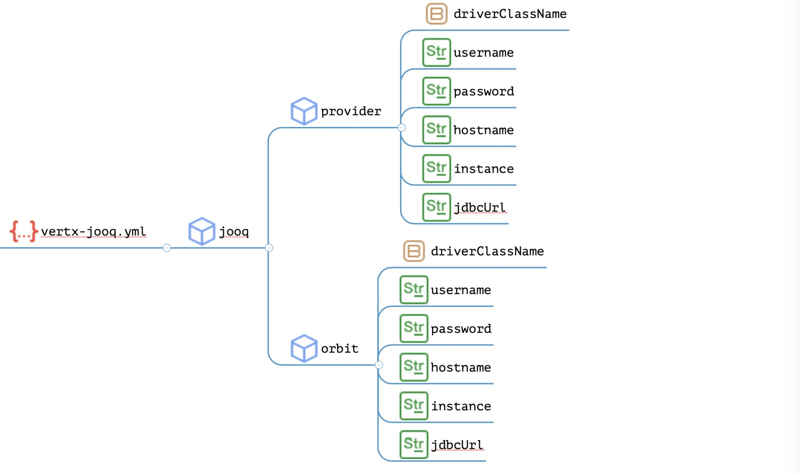

#### 示例

```yaml
jooq:
    provider:
        driverClassName: "com.mysql.cj.jdbc.Driver"
        username: cmdb
        password: "????"
        hostname: "ox.engine.cn"
        instance: DB_ORIGIN_X
        jdbcUrl: "jdbc:mysql://ox.engine.cn:3306/DB_ORIGIN_X..."
    # 历史数据库，如果启用逻辑删除则需要使用该库
    orbit:
        driverClassName: "com.mysql.cj.jdbc.Driver"
        username: cmdb
        password: "????"
        hostname: "ox.engine.cn"
        instance: DB_IOP_HIS
        jdbcUrl: "jdbc:mysql://ox.engine.cn:3306/DB_IOP_HIS
```

#### 说明

1. **provider**是主业务数据库配置，如果是动态建模方式，它表示平台数据库，一般用`DB_ORIGIN_X`或其他，若不启用动态建模，则该数据库就是核心业务数据库。
2. **orbit**是历史记录数据库，若启用了删除备份功能，则使用该数据库存储被**物理删除**的数据。

### 2.3. vertx-session.yml

#### 配置地图


#### 示例

```yaml
session:
    config:
        category: DEFINED
        store: io.vertx.tp.plugin.redis.RedisStore
        options: 
```

#### 说明

&ensp;&ensp;&ensp;&ensp;此处需要说明的是会话存储器的核心配置，该会话存储器主要分三类：

|category值|使用存储类|
|---|:---|
|LOCAL|io.vertx.ext.web.sstore.LocalSessionStore|
|CLUSTER|io.vertx.ext.web.sstore.ClusteredSessionStore|
|DEFINE|io.vertx.tp.plugin.redis.RedisStore或其他|

&ensp;&ensp;&ensp;&ensp;上述配置在配置了`session`节点时自动生效，而`options`配置主要针对`category = DEFINE`
类型，这种情况需开发人员自己提供自定义的SessionStore实现，该实现可参考`RedisStore`的代码。

### 2.4. vertx-redis.yml

> zero-ifx-redis

#### 配置地图

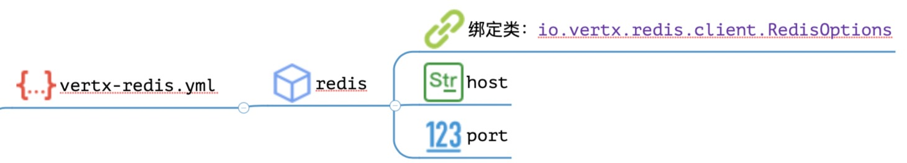

#### 示例

```yaml
redis:
    # Redis运行的Host名或IP地址
    host: ox.integration.cn
    # Redis运行的接口
    port: 6379
```

### 2.5. vertx-trash.yml

> zero-ifx-history

#### 配置地图


#### 示例

```yaml
trash:
    # 历史记录保留的时间，-1表示在历史库中永久保留。
    keepDay: -1
```

### 2.6. vertx-es.yml

> zero-ifx-es

#### 配置地图


#### 示例

```yaml
elasticsearch:
    hostname: ox.integration.cn
    port: 9200
    scheme: http
    index: cmdb
    username: elastic
    password: ???????
```

### 2.7. vertx-neo4j.yml

> zero-ifx-neo4j

#### 配置地图


#### 示例

```yaml
neo4j:
    port: 7687
    protocol: bolt
    hostname: ox.integration.cn
    username: neo4j
    password: ?????
```

#### 说明

&ensp;&ensp;&ensp;&ensp;Neo4j一般支持三种连接协议：

|协议名|默认端口|对应neo4j配置|
|---|---|:---|
|bolt|7687|dbms.connector.bolt|
|http|7474|dbms.connector.http|
|https|7473|dbms.connector.https|

### 2.8. vertx-secure.yml

#### 配置地图

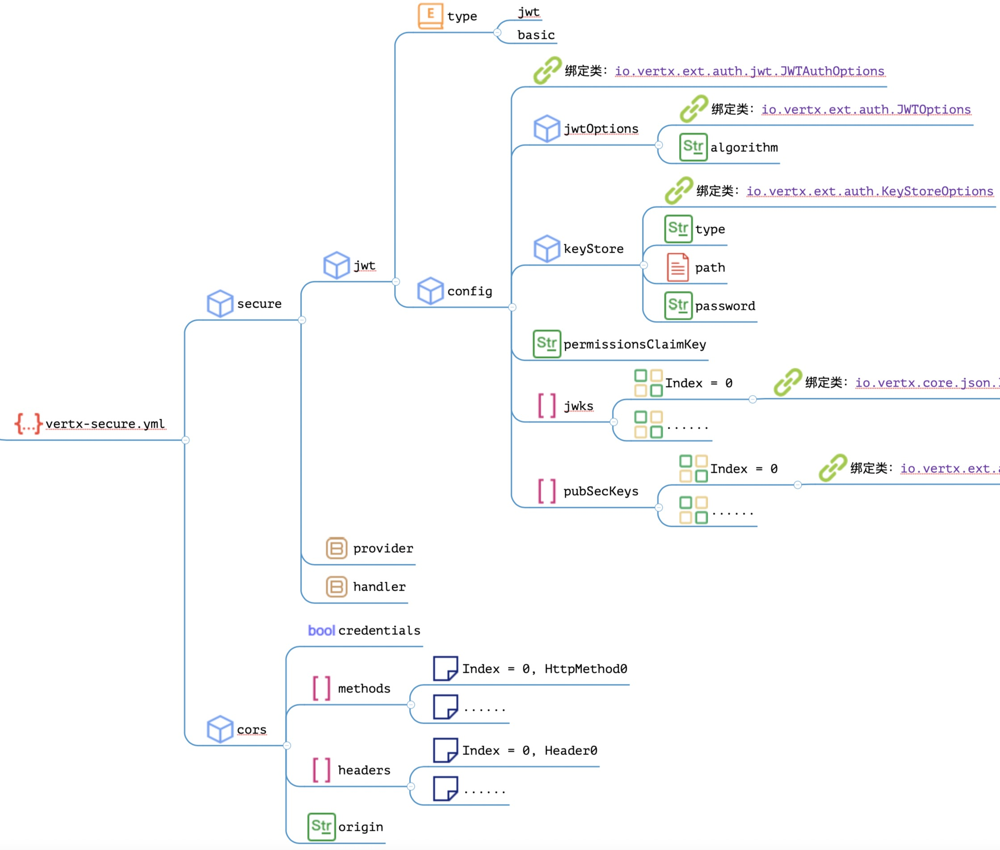

#### 示例

```yaml
# 安全配置
secure:
    # Standard Type
    jwt:
        type: jwt
        config:
            jwtOptions:
                algorithm: HS256
            keyStore:
                type: jceks
                path: keys/keystore.jceks
                password: zeroup
# 跨域配置
cors:
    credentials: true
    methods:
        - DELETE
        - GET
        - POST
        - PUT
        - OPTIONS
    headers:
        - Authorization
        - Accept
        - Content-Disposition
        - Content-Encoding
        - Content-Length
        - Content-Type
        - X-App-Id
        - X-App-Key
        - X-Sigma
        - X-Lang
    origin: "http://ox.server.cn:5000"
```

> 这部分配置在安全章节已经讲解，此处就不再过多说明。

### 2.9. vertx-shell.yml

> zero-ifx-shell

#### 配置地图


#### 示例

```yaml
shell:
    debug: false # 是否开启命令行的Debug模式，Debug模式可以查看堆栈信息
    welcome:
        banner: "Ox Engine Shell ( γραμμή εντολών )"
        version: "1.0"
        message:
            environment: "[ {0} ]"
            wait: "请输入命令，使用 h 可查看帮助文档"
            quit: "您已经成功推出控制台！Successfully"
            back: "您已经退出当前子系统：{0}！Successfully"
            header: "参数选项表："
            help: "命令表："
            footer: "版权: 深圳招为科技 Ver.1.0"
            empty: "[ Error ] 您还没有输入任何命令，请输入合法命令！"
            invalid: "对不起，该命令无法识别 \"{0}\"，请输入合法命令！"
            previous: "执行命令：\"{0}\", \"{1}\""
            usage: "基本语法：<command> [options...]
                        \t命令名称：{0}, 命令类型：{1}
                        \t参数格式: [-opt1 value1 -opt2 value2]"
    commands:
        default: "runtime/console/commands.default.json"
        defined: "runtime/console/commands.json"
    validate:
        input:
            required: "参数缺失或者长度不匹配（长度必须大于1），请输入合法参数！"
            existing: "请输入合法的参数，参数列表：{0}，当前输入：`{1}`"
        args:
            - start
            - config
```

#### 说明

&ensp;&ensp;&ensp;&ensp;注意图中红色部分，还有隐藏的配置，但这些配置太过复杂，在讲解Zero中的**命令行框架**时会单独讲解所有详细配置。

### 2.10. vertx-jet.yml

> zero-jet

该文件合并表格中的`vertx-router.yml`和`vertx-deployment.yml`。

#### 配置地图

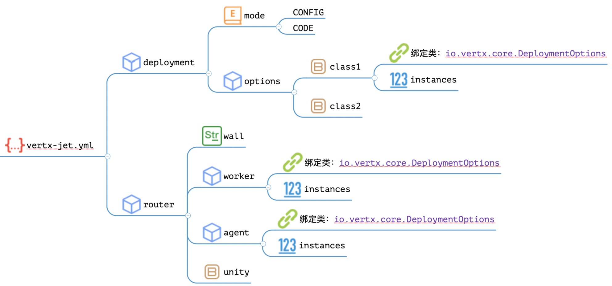

#### 示例

```yaml
# 路由配置
router:
    wall: /api
    worker:
        instances: 4
    agent:
        instances: 32
    unity: io.vertx.tp.optic.environment.UnityAmbient

## 配置
deployment:
    mode: CONFIG
    options:
        io.vertx.up.verticle.ZeroHttpAgent:
            instances: 32
        io.vertx.up.verticle.ZeroHttpWorker:
            instances: 128
```

#### 说明

&ensp;&ensp;&ensp;&ensp;这份配置有几点说明：

1. router主控**动态路由**配置
    1. Agent组件线程数就是32。
    2. Worker组件线程数为`Agent x 4 = 128`，Worker依靠Agent发布。
2. deployment主控**静态路由**配置
    1. Agent组件线程数为32。
    2. Worker组件线程数为128。

> 后续版本中会将router中的Worker标准化，instances是多少就发布多少，这是曾经的一次失误开发引起的问题。

### 2.11. vertx-extension.yml

该文件合并表格中的`vertx-init.yml`和`vertx-extension.yml`。

#### 配置地图

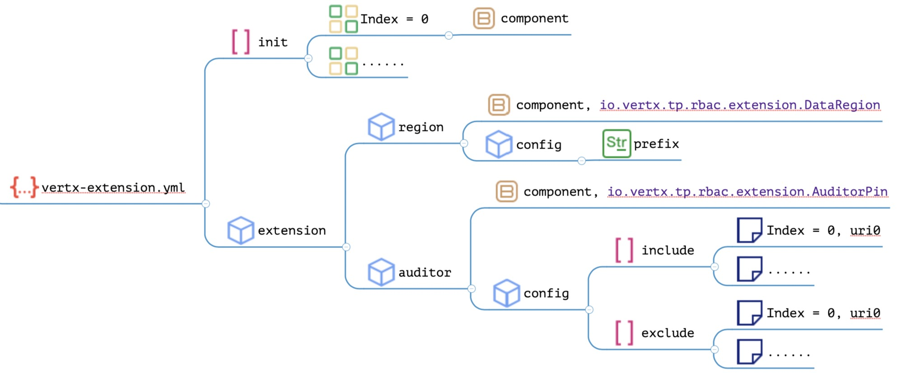

#### 示例

```yaml
# -----------------------------------------------------
# 扩展模块专用配置
init:
    # 初始化Crud
    -   component: io.vertx.tp.crud.init.IxPin
    # 初始化Rbac
    -   component: io.vertx.tp.rbac.init.ScPin
    # 初始化Ambient
    -   component: io.vertx.tp.ambient.init.AtPin
    # 初始化Ui
    -   component: io.vertx.tp.ui.init.UiPin
    # 初始化Api
    -   component: io.vertx.tp.jet.init.JtPin
    # 初始化Atom
    -   component: io.vertx.tp.atom.init.AoPin

# -----------------------------------------------------
# Extension 模块中的`数据域`和`Auditor`部分
extension:
    region:
        component: io.vertx.tp.rbac.extension.DataRegion
        config:
            prefix: /api/
    auditor:
        component: io.vertx.tp.rbac.extension.AuditorPin
        config:
            # 重写过 /api/:actor 的模块需要配置
            include:
                - /api/employee                                 # 员工
                - /api/user                                     # 用户
                - /api/permission                               # 权限
            exclude:
                # 员工排除
                - /api/employee/search
                - /api/employee/missing
                - /api/employee/existing
                - /api/employee/export
                - /api/employee/import
                # 权限排除
                - /api/permission/search
                - /api/permission/missing
                - /api/permission/existing
                - /api/permission/export
                - /api/permission/import
                # 用户排除
                - /api/user/existing
                - /api/user/missing
                - /api/user/search
                - /api/user/export
                - /api/user/import
```

#### 说明

&ensp;&ensp;&ensp;&ensp;这部分配置和前文提到过的插件相关，启用了CRUD项目过后，配置本身就变得比较复杂了，特别是Auditor的exclude部分，若不启用CRUD则这部分配置会简单很多，主要目的是开启Zero
Extension中的**职责模块、数据域**等功能，CRUD模块会在Zero Extension中单独介绍。

### 2.12. vertx-job.yml

#### 配置地图

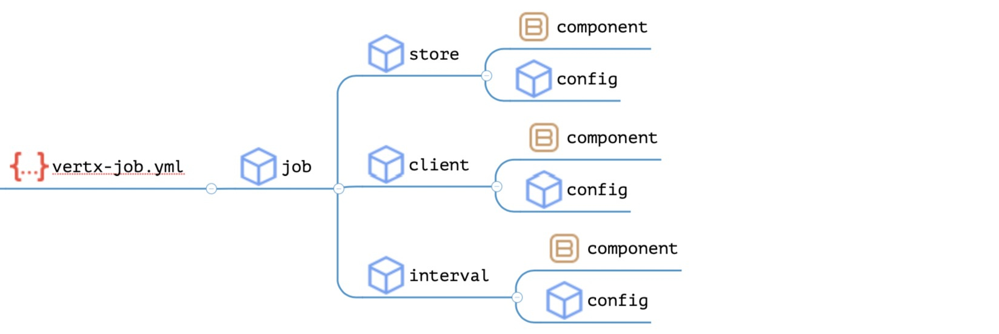

#### 示例

```yaml
job:
    store:
        component: io.vertx.tp.jet.uca.micro.JtHypnos
```

> 这部分配置会在任务系统章节单独说明。

### 2.13. vertx-cache.yml

#### 配置地图

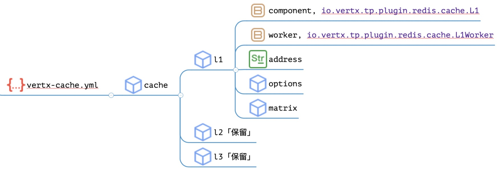

#### 示例

```yaml
cache:
    # L1 Cache between Dao and Database
    l1:
        component: "io.vertx.tp.plugin.redis.cache.L1"
        worker: "io.vertx.tp.plugin.redis.cache.L1Worker"
        address: "EVENT://L1-CACHE/FOR/DAO"
        options:
        # Definition for spec situations
        matrix:
        # 
    # L2 Cache between Service and Dao

    # L3 Cache between Api and Service
```

> 直接查看上述注释部分，目前系统只支持Redis的L1级别的缓存信息。

### 2.14. vertx-debug.yml

#### 配置地图

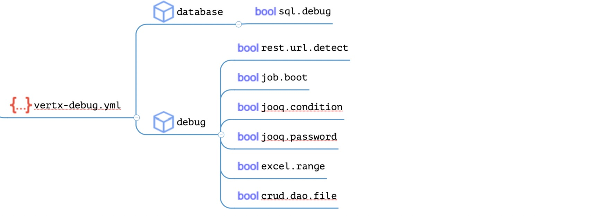

#### 示例

```yaml
database:
    sql.debug: false                  # 旧系统用，新版会移除
# Debugger 模块
debug:
    rest.url.detect: false            # Uri 日志关闭（默认打开）
    # job.boot:       false           # Job 详细日志（默认关闭）
    # jooq.condition:   false         # Jooq 条件日志（默认关闭）
    # jooq.password:  false           # Jooq 密码隐藏（默认关闭）
    # excel.range:    false           # Excel 扫描区域日志（默认关闭）

    # Extension Module
    # crud.dao.file:  false           # IxDao 文件读取日志（默认关闭）
```

> 0.8.0之后这部分配置有所变化，如：

```yaml
debug:
    # （默认打开）Restful的路径扫描检查日志，规范检查专用
    web.uri.detecting:      false
    # （默认关闭）Job任务启动时的日志打印
    # job.booting:            true
    # （默认关闭）隐藏初始密码，后台账号可以在日志中看到初始密码
    # password.hidden:        true
    # （默认关闭）打印底层Stack Trace的调试信息
    # stack.tracing:          true
    # Jooq 条件日志（默认关闭）
    # jooq.condition:         true
    # Excel 扫描区域日志（默认关闭）
    # excel.ranging:          true
```

#### 说明

> 只用于调试，生产环境部分日志会自动关闭。

|选项|新|默认|含义|
|:---|:---|---|:---|
|rest.url.detect|web.uri.detecting|true|是否打开Uri的Detect日志，若打开则打印计算日志。|
|job.boot|job.booting|false|是否打印启动Job的日志。|
|jooq.condition|jooq.condition|false|是否打印Jooq的SQL底层条件监控日志。|
|jooq.password|password.hidden|false|是否在后台日志隐藏Jooq密码（防服务端盗窃）。|
|excel.range|excel.ranging|false|是否开启Excel的区域扫描日志。|
|crud.dao.file|crud.dao.file|false|是否打开IxDao的文件专用日志。|
|x|stack.tracing|false|是否打印部分底层异常。|

### 2.15. vertx-tp.yml

该文件合并表格中的`vertx-shared.yml, vertx-feign.yml, vertx-iqiy.yml, vertx-sms.yml`。

> zero-ifx-feign, zero-ifx-iqiy, zero-ifx-sms

#### 配置地图


&ensp;&ensp;&ensp;&ensp;该文件中主要包含了第三方的详细配置，而`vertx-shared.yml`配置其实放在哪个文件中都不影响整体，至于Feign, AliSms,
IQiy这些第三方都是比较特殊的第三方集成，此处不提供示例。

### 2.16. vertx-excel.yml

> zero-ifx-excel

#### 配置地图

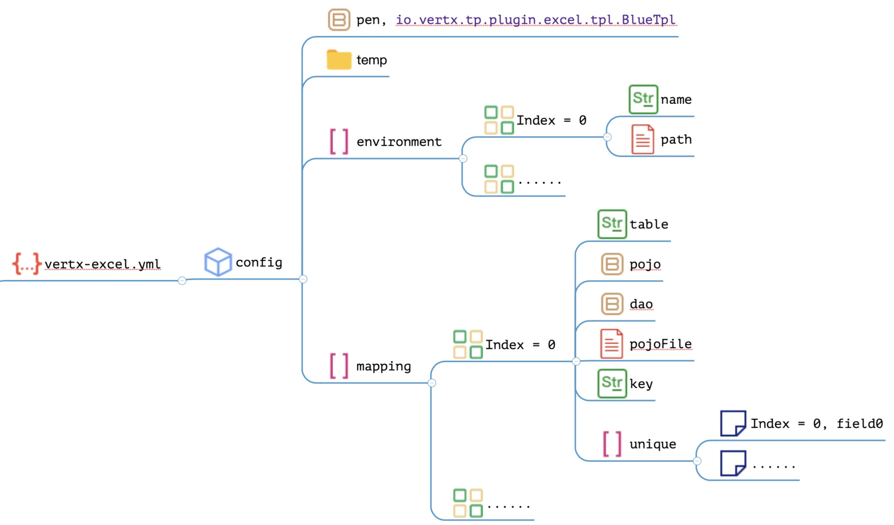

#### 示例

```yaml
excel:
    pen: "io.vertx.tp.plugin.excel.tpl.BlueTpl"
    environment:
        -   name: environment.ambient.xlsx
            path: "init/oob/environment.ambient.xlsx"
    temp: /tmp/
    mapping:
        # Source
        -   table: X_SOURCE
            pojo: cn.vertxup.ambient.domain.tables.pojos.XSource
            dao: cn.vertxup.ambient.domain.tables.daos.XSourceDao
            key: key
            unique:
```

> 0.8.0之后这部分配置有所变化，如：

```yaml
        # Source
        -   dao: cn.vertxup.ambient.domain.tables.daos.XSourceDao
            key: key
            unique:
```

#### 说明

&ensp;&ensp;&ensp;&ensp;Zero中在处理Excel模板时，支持很复杂的Excel模板，同时也支持复杂的风格渲染，如上边片段中`pen`配置的是**蓝色风格**：

* 支持JsonArray的分离和合并导入导出。
* 支持Formula表达式以及外联文件表达式实现目录下的Excel链接。
* 2003和2007双格式支持。
* 支持单元格直接从文件读取序列化成JsonArray或JsonObject操作，`JSON:`前缀。
* 支持单元格中的引用值读取，跨表导入导出。

&ensp;&ensp;&ensp;&ensp;详细功能在讲解插件时再举例说明。

### 2.17. vertx-rpc.yml

该文件合并表格中的`vertx-rpc.yml、vertx-etcd.yml`。

> zero-iproxy

#### 配置地图


#### 说明

&ensp;&ensp;&ensp;&ensp;最后一份配置比较复杂，和微服务相关。

|节点|含义|
|:---|:---|
|rpc|gRpc完整配置，做微服务之间服务通讯专用。|
|circuit|微服务中熔断专用配置。|
|etcd|微服务中服务配置中心Etcd相关配置（可支持集群配置中心）。|

## 「叄」小结

&ensp;&ensp;&ensp;&ensp;本章节带您领略了整个Zero框架中的所有配置，详细的配置图可参考本文最开始的配置地图专用链接下载该图（2.8M），后续更新会有新版本的配置完整地图。这些配置中某些配置部分是还没讲解的章节，而大部分都是已经讲解过的章节，有关配置的细节只能读者自己在学习过程去体会。

