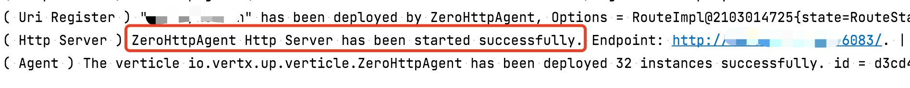
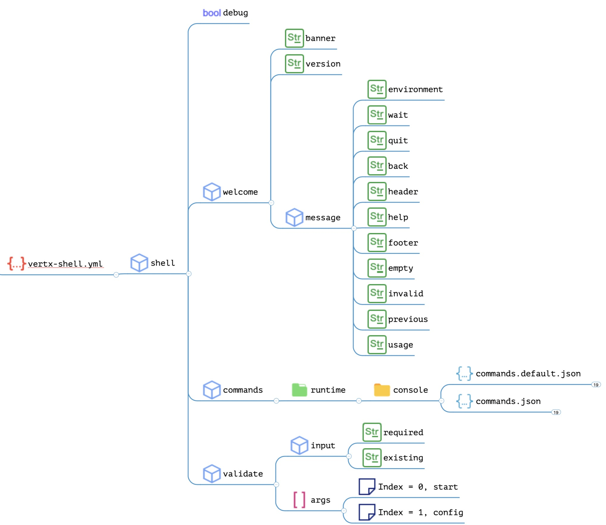
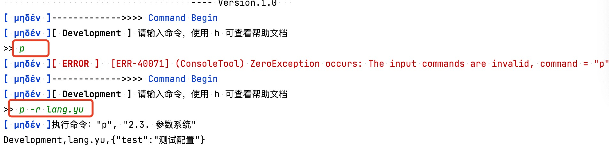

# 15. 鼚乎：Shell

> 卿云烂兮，乣缦缦兮。日月光华，旦复旦兮。明明上天，烂然星陈。日月光华，弘于一人。日月有常，星辰有行。——佚名《卿云歌》

* 项目地址：<https://github.com/silentbalanceyh/vertx-zero-example/>（子项目：**up-shell**）

&ensp;&ensp;&ensp;&ensp;本章节主要讲解Zero中的其中一个插件`zero-ifx-shell`
，它可以帮助您很快书写想要的可交互式命令行程序（又称Shell程序），您可以在Zero中开发第二程序入口用来帮助开发、部署、调试。我们在产品版本中书写了一个统一入口，部署到生产环境时可根据不同命令参数启动Zero容器，参考如下：

|启动命令|含义|
|:---|:---|
|start|启动Zero容器。|
|config|打开生产环境交互式命令行。|
|config dev|打开开发环境交互式命令行。|

> 在Linux中通常我们称为Shell，Windows中又称为Console，由于习惯我使用了交互式命令行。

## 「壹」自动化工具

### 1.1. Out-Of-Box

&ensp;&ensp;&ensp;&ensp;前文中多次提到了OOB，那么什么是OOB？OOB的全称是`Out-Of-Box`，您可以将这个理解成**开箱标准数据**——即当你的系统第一次在生产环境发布时的初始化数据，这些数据包括**
配置数据**、**基础数据**、**账号数据**、**环境数据**等一切支撑系统运行的数据，如果您开发的系统具有业务标准化的一面，可能还会携带标准化过后的业务数据如分类、初始角色、账号、组织架构、任务配置、界面配置等等。

&ensp;&ensp;&ensp;&ensp;我写的不是代码么，为什么运行还依赖数据呢？这个问题不好回答，您可以思考一个场景：假设您设计了订单系统，订单中有一个属性叫做市场来源，最初的时候您就设计了两到三种市场来源，那时候硬编码够用，但随着系统的扩大，您通常会面临开发一个市场来源管理的基础数据模块——一旦这个模块成型，那么在最初发布系统时，您的代码变成了数据，就自然面临将最初的基础数据导入系统。也许有人会说：我可以将数据录入系统！没错，你的确可以这样做，但如果市场来源数据不是两三条，而是上百条或者上千条呢，若您没有自动化工具去完成这些操作，系统部署将会成为您的噩梦。

&ensp;&ensp;&ensp;&ensp;于是在系统部署之前，您最好可以做到：

1. 准备一种人工容易填写的OOB数据格式（Zero中用Excel和Json混合）。
2. 准备一种可直接导入数据的方式（本章的Shell以及配合Excel插件）。

&ensp;&ensp;&ensp;&ensp;有了如此准备，OOB数据就可以自动化导入到系统了，如果您在开发导入程序时维持了数据导入的**幂等性**
——导入一次和多次维持最终结果一致，那么您就不用担忧是否因为开发和测试破坏了原始数据，Zero中就是如此操作。

### 1.2. Zero Shell

&ensp;&ensp;&ensp;&ensp;写交互式命令行在每个项目中都是**必须**存在的，它提供了一种**沉默**
的方式让你对系统执行各种操作，这些操作包括数据校验、配置校验、数据修改、实时监控等，这种思路和DevOps的部分思路是一致的。Zero提供了两种方法做这个事：

|执行方式|含义|
|:---|:---|
|zero-ifx-shell|（本章）编写和项目直接相关的交互式命令行程序。|
|`ai`命令|（拓展）NodeJs工具，在线地址：http://www.vertxai.cn|

&ensp;&ensp;&ensp;&ensp;本章主要学习第一种方法。Zero提供了一个命令行框架，它可以让你用最小的成本开发交互式命令行，主要设计原则如下：

1. 不让开发人员写命令的基础判断。
2. 不让开发人员检查命令的输入规范。
3. 不让开发人员设置环境相关信息。
4. 整个交互式命令行使用约定大于配置、配置大于编码的方式，易于拓展。

&ensp;&ensp;&ensp;&ensp;归根到底，Zero直接让开发人员书写程序的命令逻辑，越简单越直接越暴力越好。在Zero中写交互式命令行程序需先在Maven中添加以下片段引入该项目：

```xml
    <dependency>
        <groupId>cn.vertxup</groupId>
        <artifactId>zero-ifx-shell</artifactId>
    </dependency>
```

### 1.3. 启动

&ensp;&ensp;&ensp;&ensp;本小节引导读者使用Zero中的交互式命令行框架先搭好整个完整环境，开发在Zero中我们的**第一个交互式命令行**程序。

#### 1.3.1. 环境配置

&ensp;&ensp;&ensp;&ensp;先在您的`src/main/resources`中打开Shell的核心配置文件：

**vertx.yml**

```yaml
zero:
  lime: shell
  vertx:
    instance:
      - name: zero-shell
        options:
          # Fix block 2000 limit issue.
          maxEventLoopExecuteTime: 30000000000
```

**vertx-shell**

&ensp;&ensp;&ensp;&ensp;由于`lime`的值是shell，所以创建`vertx-shell.yml`文件，此处列出该文件的内容：

```shell
shell:
    debug: true # 是否开启命令行的Debug模式，Debug模式可以查看堆栈信息
    welcome:
        banner: "Zero Shell App  ( γραμμή εντολών )"
        version: "1.0"
        message:
            environment: "[ {0} ]"
            wait: "请输入命令，使用 h 可查看帮助文档"
            quit: "您已经成功推出控制台！Successfully"
            back: "您已经退出当前子系统：{0}！Successfully"
            header: "参数选项表："
            help: "命令表："
            footer: "版权: Lang.Yu Ver.1.0"
            empty: "[ Error ] 您还没有输入任何命令，请输入合法命令！"
            invalid: "对不起，该命令无法识别 \"{0}\"，请输入合法命令！"
            previous: "执行命令：\"{0}\", \"{1}\""
            usage: "基本语法：<command> [options...]
                        \t命令名称：{0}, 命令类型：{1}
                        \t参数格式: [-opt1 value1 -opt2 value2]"
    commands:
        default: "console/commands.default.json"
        defined: "console/commands.json"
    validate:
        input:
            required: "参数缺失或者长度不匹配（长度必须大于1），请输入合法参数！"
            existing: "请输入合法的参数，参数列表：{0}，当前输入：`{1}`"
        args:
            - start
            - config
```

&ensp;&ensp;&ensp;&ensp;您先不用去关注每个配置项，本文后边我会说明，先关注`commands`中配置的两个文件：

```yaml
        # 默认命令专用配置文件，由于语言原因，需提供
        default: "console/commands.default.json"
        # 用户定义的命令专用配置文件
        defined: "console/commands.json"
```

&ensp;&ensp;&ensp;&ensp;在console目录中创建两个Shell的配置文件，文件格式为`json`格式，其中：

**commands.default.json**

> 除非您想开发英文、日文等其他语言系统，您需要将下边内容翻译，否则直接拷贝文件原始内容即可。

```json
[
    {
        "name": "help",
        "simple": "h",
        "description": "帮助文档",
        "options": [
            {
                "simple": "c",
                "name": "command",
                "description": "请输入查看帮助命令",
                "config": {
                    "name": "命令名称",
                    "simple": "简写",
                    "description": "使用描述"
                }
            }
        ]
    },
    {
        "name": "quit",
        "simple": "q",
        "description": "退出控制台"
    },
    {
        "name": "back",
        "simple": "b",
        "description": "<< 返回上级"
    }
]
```

**commands.json**

```json
[]
```

> commands.json的内容意味着您目前只是搭建基础交互式命令行框架，不提供任何命令。

#### 1.3.2. 入口修改

&ensp;&ensp;&ensp;&ensp;学过前边文章，您的程序入口通常如：

```java
package cn.vertxup;

import io.vertx.up.VertxApplication;
import io.vertx.up.annotations.Up;

@Up
public class ShellUp {
    public static void main(final String[] args) {
        VertxApplication.run(ShellUp.class);
    }
}
```

&ensp;&ensp;&ensp;&ensp;上边入口可直接运行启动Zero容器，那么现在为交互式命令行提供第二入口：

```java
package cn.vertxup;

import io.vertx.tp.plugin.shell.ConsoleFramework;
import io.vertx.up.unity.Ux;

public class ShellCmd {
    public static void main(final String[] args) {
        ConsoleFramework
                // Ux.nativeVertx() 返回一个根据配置创建的Vertx实例
                .start(Ux.nativeVertx())
                // 绑定命令 start 专用的 Consumer（原Zero入口）
                .bind(input -> ShellUp.main(args))
                // 直接运行
                .run(args);
    }
}
```

#### 1.3.3. 运行测试

&ensp;&ensp;&ensp;&ensp;先运行启动容器的命令，参考下图IDEA中配置截图运行：


&ensp;&ensp;&ensp;&ensp;您可以在终端看到如下输出：



&ensp;&ensp;&ensp;&ensp;于是Zero容器就启动了，再创建一个启动配置，参考下边截图：


&ensp;&ensp;&ensp;&ensp;此时终端的输出信息发生了变化，可使用的命令有两个`h`和`q`：


### 1.4. 配置详解

&ensp;&ensp;&ensp;&ensp;本小节主要解析`vertx-shell.yml`中的详细配置，从前文可知该文件的配置地图如下：



&ensp;&ensp;&ensp;&ensp;整个配置主要分三部分，把大部分文字抽取出来主要是为了**多语言**
环境，虽然大家都是中国人，但由于计算器源起于国外，有些人喜欢用英文、有些人喜欢用中文，所以Zero考虑了用配置文件驱动的方式，如此，您就可以使用不同的语言书写配置文件了。

&ensp;&ensp;&ensp;&ensp;配置表格如下：

|节点|类型|含义|
|:---|---|:---|
|debug|Boolean|是否打开调试模式，只有调试模式才能看到异常堆栈信息，建议开发时打开，发布后关闭，相信您也不想让一个使用工具的管理人员看到一堆Java异常信息。|
|welcome|JsonObject|环境界面定制、默认过场信息定制，根据示例内容设置。|
|commands|JsonObject|配置文件路径设置，`default`为默认的`h`和`q`定制，`defined`为您将要扩展的命令的配置。|
|validate|JsonObject|启动参数设置、参数验证数据规范，参考示例内容设置。|

### 1.5. 命令结构

#### 1.5.1. 启动命令结构

> 您也可以自定义启动命令。

&ensp;&ensp;&ensp;&ensp;根据Zero默认定义，程序运行命令分为三种：

|运行参数|含义|
|---|:---|
|start|运行Zero容器。|
|config dev|开发环境启动交互式命令行，Environment = Development。|
|config|生产环境启动交互式命令行，Environment = Production。|

&ensp;&ensp;&ensp;&ensp;启动命令并不限制使用start，config，您可以直接在配置文件的input节点中重新修订两个命令表，唯一固定的是` dev`
部分，用来区分生产环境和开发环境，您可以直接从命令行执行程序中读取环境数据，目前版本中，开发环境和生产环境唯一的区别在于：

1. Development：直接从`src/main/resources`中读取配置以及数据文件。
2. Production：从**当前目录**中读取配置以及数据文件，读取不到才从`jar`文件中读取。

#### 1.5.2. 默认命令

> 您也可以自定义默认命令。

&ensp;&ensp;&ensp;&ensp;Zero设计的是交互式命令框架，所以设计了默认命令，默认命令的文字部分可参考`commands.default.json`文件中的配置。默认命令如下：

|命令|全称|含义|
|---|---|:---|
|h|help|显示所有帮助文档或显示某个命令的帮助文档。|
|q|quit|退出整个命令行程序（只能在顶层中执行）。|
|b|back|退出当前子系统，返回上一级命令行程序（只能在子系统中执行）。|

#### 1.5.3. 命令分类

&ensp;&ensp;&ensp;&ensp;Zero中定义了特定的命令结构，命令本身可**分层嵌套**，此处命令分两种：

* 子系统：可进入嵌套的交互式命令行界面（不用开发，直接配置）。
* 执行命令：执行开发插件运行命令。

&ensp;&ensp;&ensp;&ensp;完整的配置地图如下：

> 两个命令配置文件格式相同。


&ensp;&ensp;&ensp;&ensp;命令分类主要依靠`type = SYSTEM`属性，两种命令的配置如下表：

|属性名|子系统|执行命令|含义|
|:---|---|---|:---|
|name|o|o|命令全名。|
|simple|o|o|「高频」命令短名。|
|description|o|o|命令详细描述，帮助文档可呈现所有。|
|type|值为`SYSTEM`|无|鉴别是子系统还是执行命令。|
|commands|o|x|子命令列表（数据结构递归）。|
|plugin|x|o|执行组件，开发人员真正关注的组件。|
|options|x|o|命令参数定义列表，JsonArray格式。|
|config|o|o|命令执行的额外配置（重用命令时专用）。|

> 带 o 表示这种类型支持的属性，带 x 表示这种类型不支持的属性。

## 「贰」命令开发

&ensp;&ensp;&ensp;&ensp;前边章节讲解了Zero中Shell的基本环境以及相关规范，本章节使用不同的示例给大家演示Zero中的Shell程序的开发细节。

### 2.1. 最简单命令

&ensp;&ensp;&ensp;&ensp;先开发一个最简单的Shell执行命令的类：

```java
package cn.vertxup.command;

import io.vertx.tp.plugin.shell.AbstractCommander;
import io.vertx.tp.plugin.shell.atom.CommandInput;
import io.vertx.tp.plugin.shell.cv.em.TermStatus;

public class SimpleCommand extends AbstractCommander {
    /* 同步执行 */
    @Override
    public TermStatus execute(final CommandInput args) {
        System.out.println("执行指令");
        return TermStatus.SUCCESS;
    }
}
```

&ensp;&ensp;&ensp;&ensp;将该类配置到`commands.json`中：

```json
[
    {
        "simple": "t",
        "name": "test",
        "description": "2.1. 最简单命令！",
        "plugin": "cn.vertxup.command.SimpleCommand"
    }
]
```

&ensp;&ensp;&ensp;&ensp;启动交互式命令行，然后输入命令`t`，可看到如下输出：


&ensp;&ensp;&ensp;&ensp;示例中您直接让指令执行类继承自`io.vertx.tp.plugin.shell.AbstractCommander`，这个类有两个主执行方法——同步和异步都支持，先看它对执行部分的定义：

```java
    // 异步执行，返回Future<TermStatus>，内部调用同步执行方法
    @Override
    public Future<TermStatus> executeAsync(final CommandInput args) {
        return Future.succeededFuture(this.execute(args));
    }
    // 同步执行，直接返回TermStatus
    @Override
    public TermStatus execute(final CommandInput args) {
        return TermStatus.SUCCESS;
    }
```

&ensp;&ensp;&ensp;&ensp;Zero中的函数链调用如下图：


&ensp;&ensp;&ensp;&ensp;您可以在开发过程中在**异步或同步**方法中二选一重写，从定义中可知**异步**方法是主方法，不论您重写的是异步方法还是同步方法，最终Zero
Shell调用的都是异步方法，命令执行的返回值类是：`io.vertx.tp.plugin.shell.cv.em.TermStatus`，它有四个值：

|值|含义|
|---|:---|
|SUCCESS|成功执行了该命令。|
|FAILURE|执行过程中出了问题，命令未正常执行完成。|
|WAIT|「保留」执行过后等待执行结果。|
|EXIT|执行出现严重错误，直接退出交互式命令行。|

### 2.2. 子系统

&ensp;&ensp;&ensp;&ensp;子系统类型的命令在Zero Shell中直接配置，不需要开发，在您的`commands.json`中新增下边命令：

```json
[
    ....,
    {
        "simple": "s",
        "name": "sub",
        "description": "2.2. 子系统进入",
        "type": "SYSTEM",
        "commands": [
        ]
    }
]
```

&ensp;&ensp;&ensp;&ensp;运行过会直接运行`s`命令进入子系统：


&ensp;&ensp;&ensp;&ensp;Zero Shell中的输出信息中包含了很多详细内容，最典型的是环境信息以及当前位置：

1. `（sub）`：表示您现在位于某个**子系统**。
2. `--->>> Command Begin`：表示您位于**主系统**中。
3. `Development`：表示当前环境（开发 - Development，生产 - Production）。

### 2.3. 命令参数

&ensp;&ensp;&ensp;&ensp;接下来通过一个带有命令参数的例子看看`CommandInput`的使用方法，并给读者讲解一下抽象类`AbstractCommander`中的常用API，还是先开发一个命令类：

```java
package cn.vertxup.command;

import io.vertx.tp.plugin.shell.AbstractCommander;
import io.vertx.tp.plugin.shell.atom.CommandInput;
import io.vertx.tp.plugin.shell.cv.em.TermStatus;

public class ParamCommand extends AbstractCommander {
    /* 同步执行 */
    @Override
    public TermStatus execute(final CommandInput args) {
        final String env = this.inString(args, "e");
        final String required = this.inString(args, "r");
        final JsonObject config = this.atom.getConfig();
        System.out.println(env + "," + required + "," 
            + config.encode());
        return TermStatus.SUCCESS;
    }
}
```

&ensp;&ensp;&ensp;&ensp;将该类配置到`commands.json`：

```json
[
    ....,
    {
        "simple": "p",
        "name": "param",
        "description": "2.3. 参数系统",
        "plugin": "cn.vertxup.command.ParamCommand",
        "config": {
            "test": "测试配置"
        },
        "options": [
            {
                "simple": "e",
                "name": "env",
                "description": "基本环境名称",
                "defaultValue": "Development"
            },
            {
                "simple": "r",
                "name": "required",
                "description": "必须参数",
                "required": true
            }
        ]
    }
]
```

&ensp;&ensp;&ensp;&ensp;运行该命令：



&ensp;&ensp;&ensp;&ensp;从图中可知，命令运行了两次，第一次没有带`-r`参数，所以抛出了`-40071`的异常信息，如果您打开了`debug`
参数，那么此处还会打印Java中完整的Stack堆栈信息。AbstractCommander中提供了快速提取参数的专用方法`in`系列方法，该方法列表如下：

```java
// 根据参数 name 从 CommandInput 中提取类型为 Class<T> 的参数
<T> T inValue(final CommandInput input, 
              final String name, 
              final Class<T> clazzT)

// 读取文件名为 name 路径下的Json文件，可返回JsonObject或JsonArray
<T> T inJson(final CommandInput input, final String name)

// 读取目录的绝对地址
String inFolder(final String folderName)
String inFolder(final CommandInput input, final String name)

// 读取布尔值
Boolean inBoolean(final CommandInput input, final String name)
// 读取字符串
String inString(final CommandInput input, final String name)
// 读取整数
Integer inInteger(final CommandInput input, final String name)
```

&ensp;&ensp;&ensp;&ensp;那么到此有关Shell的基本使用就讲解得差不多了，有关CommandInput和CommandAtom的用法您可以在开发过程中去查看相关源代码：

1. `CommandAtom`：当前命令的元数据定义信息，最常用为提取配置（示例中）。
2. `CommandInput`：当前命令用户的输入信息，可提取命令中相关数据。

### 2.4. 启动命令

&ensp;&ensp;&ensp;&ensp;Zero Shell框架的核心启动命令有三个`start, config dev, config`，这三个命令在`ConsoleFramework`
类中是已经写死的，本章节提供`ConsoleFramework`的源代码，若您想要修改启动命令，目前的版本只能重写一个专用启动类，后续可能使用更加简单的方式修改启动命令：

```java
package io.vertx.tp.plugin.shell;

import io.vertx.core.Vertx;
import io.vertx.tp.error.InternalConflictException;
import io.vertx.tp.plugin.shell.refine.Sl;
import io.vertx.up.eon.em.Environment;
import io.vertx.up.log.Annal;

import java.util.Objects;
import java.util.concurrent.ConcurrentHashMap;
import java.util.concurrent.ConcurrentMap;
import java.util.function.Consumer;

/**
 * @author <a href="http://www.origin-x.cn">Lang</a>
 */
public class ConsoleFramework {
    private static final Annal LOGGER = Annal.get(ConsoleFramework.class);
    private static final ConcurrentMap<String, Consumer<String>> INTERNAL =
            new ConcurrentHashMap<>();

    static {
        Sl.init();
    }

    private final transient Vertx vertxRef;

    private ConsoleFramework(final Vertx vertxRef) {
        this.vertxRef = vertxRef;
        if (INTERNAL.isEmpty()) {
            /*
             * config dev
             * config ( Default for production )
             */
            INTERNAL.put("config", arg -> {
                /*
                 * Callback consume for execution
                 */
                final ConsoleInteract interact;
                if ("dev".equals(arg)) {
                    interact = ConsoleInteract.start(this.vertxRef, Environment.Development);
                } else {
                    LOGGER.info("The console will go through production mode");
                    interact = ConsoleInteract.start(this.vertxRef, Environment.Production);
                }
                interact.run(arg);
            });
        }
    }

    public static ConsoleFramework start(final Vertx vertxRef) {
        return new ConsoleFramework(vertxRef);
    }

    public ConsoleFramework bind(final Consumer<String> consumer) {
        if (INTERNAL.containsKey("start")) {
            LOGGER.warn("There exist 'start' consumer, you'll overwrite previous.");
        }
        return this.bind("start", consumer);
    }

    /**
     * The start point of zero console for console started up
     *
     * @param args Input command here
     */
    public void run(final String[] args) {
        /*
         * Arguments process
         */
        if (Sl.ready(args)) {
            /*
             * Argument
             */
            final String input = args[0];
            final Consumer<String> consumer = INTERNAL.get(input);
            if (Objects.nonNull(consumer)) {
                final String consumerArgs = 2 == args.length ? args[1] : null;
                consumer.accept(consumerArgs);
            } else {
                LOGGER.warn("No consumer found for argument `{0}`", input);
                System.exit(-1);
            }
        } else {
            System.exit(-1);
        }
    }

    /*
     * 绑定 args 中的执行
     */
    public ConsoleFramework bind(final String name, final Consumer<String> consumer) {
        if ("config".equals(name)) {
            throw new InternalConflictException(ConsoleFramework.class);
        }
        INTERNAL.put(name, consumer);
        return this;
    }
}
```

## 「叁」小结

&ensp;&ensp;&ensp;&ensp;本章主要给读者介绍Zero中交互式命令行程序的开发，使用该部分内容，您可以在项目中开发十分方便的自动化后台程序以帮助您对系统进行操作和控制，并且可以和Vert.x中的DevOps子项目集成实现对系统的后台监控。


