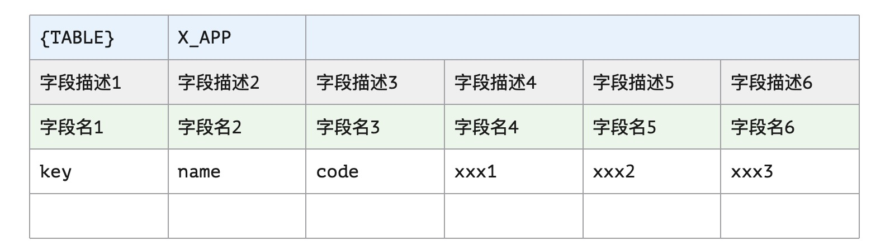
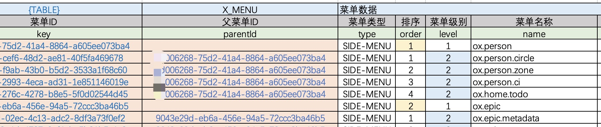
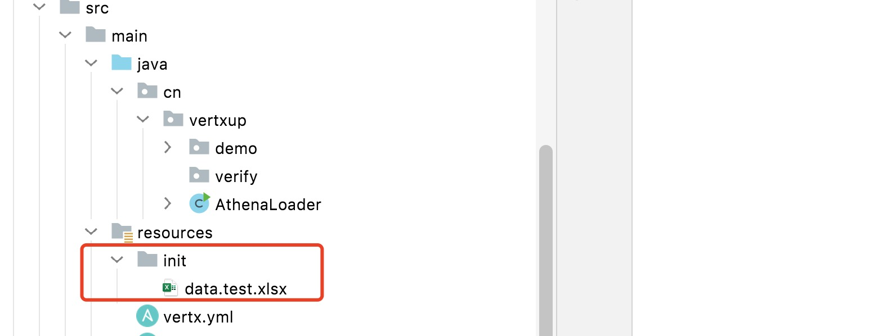
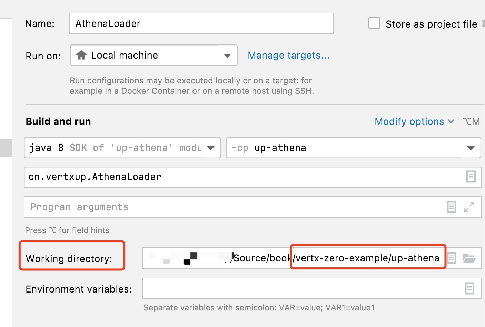
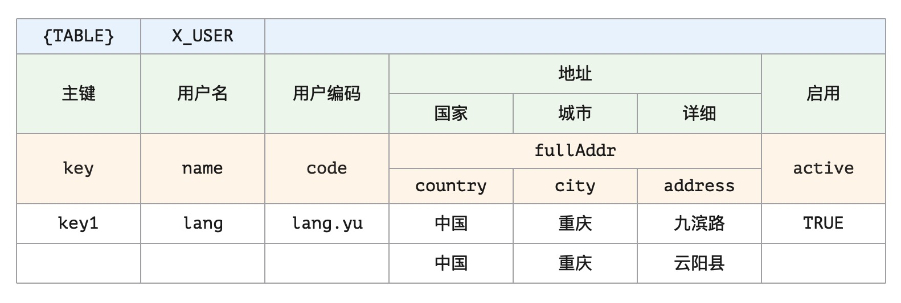
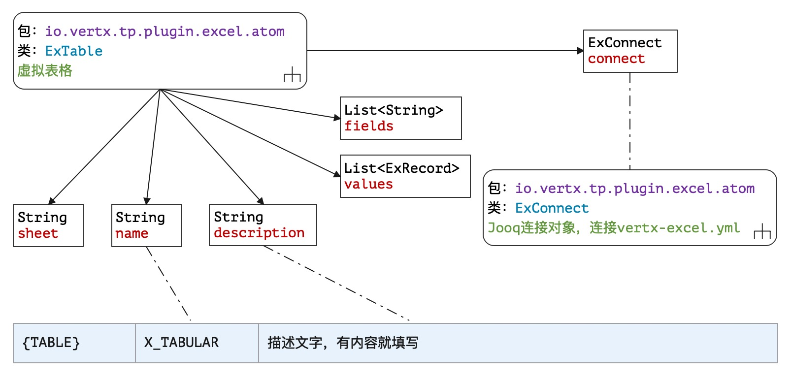

> 谁能亨鱼？溉之釜鬵。谁将西归？怀之好音。——佚名 先秦《匪风》

* 项目地址：<https://github.com/silentbalanceyh/vertx-zero-example/>（子项目：**up-athena**）
*
数据文件：[data.test.xlsx](https://github.com/silentbalanceyh/vertx-zero-example/blob/master/document/zero/data/data.test.xlsx)

&ensp;&ensp;&ensp;&ensp;本章节讲解Zero中另外一个比较重要的插件`zero-ifx-excel`，它可以帮助您将Excel中的数据快速导入系统中，同时在上传下载过程中也可以帮您很快完成**导入导出**编程。

# 「壹」基本配置

&ensp;&ensp;&ensp;&ensp;先在您的Maven的`pom.xml`中引入下边依赖片段：

```xml
    <dependency>
        <groupId>cn.vertxup</groupId>
        <artifactId>zero-ifx-excel</artifactId>
    </dependency>
```

## 1.1. Excel模板

&ensp;&ensp;&ensp;&ensp;Zero中的一个Excel模板格式如下：



&ensp;&ensp;&ensp;&ensp;该模板的注意事项：

1. 一个Sheet中可以包含多个`{TABLE}`的起始区域，边界计算条件如：
    * 左边界：从左往右扫描的第一个出现了`{TABLE}`的列。
    * 上边界：从上往下扫描的第一个出现了`{TABLE}`的列。
    * 右边界：`{TABLE}`行右边横跨的列总数（如上图）——一定要**合并单元格**。
    * 下边界：下边没有数据的行的上一行。
2. 一个Workbook中可以包含多个Sheet，且`{TABLE}`后一个单元格表示了当前程序应该导入到哪一张数据表中，如示例中会导入到`X_APP`表。
3. 字段描述一般为中文，提供给人阅读，而字段名不是表中的列名，而是和表绑定的Java Pojo类的属性名，例：

   |表名|列名|属性名（字段名）|字段描述|
       |---|---|---|---|
   |`X_APP`|NAME|name|应用名称|
   |`X_APP`|PORT|port|应用端口号|

&ensp;&ensp;&ensp;&ensp;当然若您不想使用Zero中提供的导入功能以及和Jooq绑定的数据访问功能，那就只有直接使用`ExcelInfix`
结构来执行纯粹的编码模式了，Zero中的Excel使用了`Apache POI`的`4.x`版本，你可以独立开发，像前文提到过的集成插件一样，也可以直接借着本章的内容直接实现导入。一个Excel模板的示例截图如下：



> Zero中导入和导出的文件模板是一致的，只要数据准备无误，那么就可导入数据到系统。

## 1.2. Zero配置

&ensp;&ensp;&ensp;&ensp;提供了数据模板后，您需要在Zero中打开`-excel`的配置（**假设您已经完成了VertxDAO的生成流程，参考Jooq章节**）：

**vertx.yml**

```yaml
zero:
    # lime连接 vertx-excel.yml 文件
    lime: jooq, cache, excel
    vertx:
        # 省略其他部分
```

**vertx-excel.yml**

```yaml
excel:
    # 导出Excel的风格（彩色模板专用）
    pen: "io.vertx.tp.plugin.excel.tpl.BlueTpl"
    # 临时文件夹（该文件夹必须有权限写）
    temp: /tmp/
    # 映射配置，一个JsonArray结构
    mapping:
        # X_TABULAR表的导入配置
        -   table: X_TABULAR
            # Pojo类（Jooq生成）
            pojo: cn.vertxup.ambient.domain.tables.pojos.XTabular
            # 启用映射层的配置，读取 src/main/resources/pojo/tabular.yml
            # pojoFile: tabular 
            # Dao类（Jooq生成）
            dao: cn.vertxup.ambient.domain.tables.daos.XTabularDao
            # 主键属性名
            key: key
            # 唯一键设置，检查唯一记录依靠先主键，再唯一键
            unique:
                - code
                - type
                - appId
```

> 0.8.0之后的版本变化，移除了pojo/dao两个属性

```yaml
excel:
    # 导出Excel的风格（彩色模板专用）
    pen: "io.vertx.tp.plugin.excel.tpl.BlueTpl"
    # 临时文件夹（该文件夹必须有权限写）
    temp: /tmp/
    # 映射配置，一个JsonArray结构
    mapping:
        # X_TABULAR表的导入配置
        -   dao: cn.vertxup.ambient.domain.tables.daos.XTabularDao
            # Dao类（Jooq生成）
            # pojoFile: tabular 
            # 启用映射层的配置，读取 src/main/resources/pojo/tabular.yml
            key: key    # 主键属性名
            
            # 唯一键设置，检查唯一记录依靠先主键，再唯一键
            unique:
                - code
                - type
                - appId
```

**vertx-inject.yml**

```yaml
# 省略其他部分
# Excel
excel: io.vertx.tp.plugin.excel.ExcelInfix
```

## 1.3. 导入测试

&ensp;&ensp;&ensp;&ensp;将数据文件放到您的`src/main/resources/init/`目录中：



&ensp;&ensp;&ensp;&ensp;在您的IDEA中开发普通启动类：

```java
package cn.vertxup;

import io.vertx.tp.ke.booter.Bt;

public class AthenaLoader {
    public static void main(final String[] args) {
        // 直接调用Bt工具类（导入导出专用类）
        // Bt是轻量级工具，所以此处的 / 不能少，表示目录
        Bt.doImports("init/");
    }
}
```

&ensp;&ensp;&ensp;&ensp;创建对应的运行配置：



&ensp;&ensp;&ensp;&ensp;这样配置后，您就可以在运行的控制台看到如下信息：

```shell
[ Εισόδημα ]  ( Ke ) Excel importing file = init/data.test.xlsx
[ Έξοδος ] Table: X_TABULAR, Data Size: 7
[ Εισόδημα ]  ( Ke ) Successfully to finish loading ! \
        data file = init/data.test.xlsx
```

&ensp;&ensp;&ensp;&ensp;运行完成后，查看您的数据库（**数据已经进入系统**）：


&ensp;&ensp;&ensp;&ensp;这是最简单的一种场景，直接将一个Excel中`{TABLE}`区域的数据导入到数据表`X_TABULAR`中，但这种场景对OOB数据的基础数据导入尤其有效，您可以放一批数据文件在`init`
目录中，然后直接运行上述程序实现批量的数据导入。在输出中您不仅可以看到读取的数据量以及文件，还可以看到线程名称，整个过程是多线程运行的（**一个数据文件一个线程**）。

&ensp;&ensp;&ensp;&ensp;由于`vertx-excel.yml`文件中已经配置过key和unique，所以您可以再执行该程序，不论最终您执行多少次，数据库中的数据一直都只有7条。

# 「贰」开发场景

## 2.1. ExcelClient获取

> 本节省略了部分配置，请把第一章节阅读完了再进行本章节的示例程序编写。

&ensp;&ensp;&ensp;&ensp;不可否认，`zero-ifx-excel`和Shell部分不同，Excel功能里多了一个`Infix`插件——这意味着您可以使用插件模式直接在Worker组件中使用它的客户端。先看一段代码：

```java
package cn.vertxup.excel;

import io.vertx.core.json.JsonObject;
import io.vertx.tp.plugin.excel.ExcelClient;
import io.vertx.up.annotations.EndPoint;
import io.vertx.up.annotations.Plugin;

import jakarta.ws.rs.GET;
import jakarta.ws.rs.Path;
import jakarta.ws.rs.QueryParam;

@EndPoint
@Path("/hi")
public class ExcelAgent {
    @Plugin
    private transient ExcelClient client;

    @Path("/excel/hello")
    @GET
    public JsonObject sayHi(
            @QueryParam("name") final String name) {
        final JsonObject response = new JsonObject();
        response.put("name", name);
        response.put("client", this.client.toString());
        return response;
    }
}
```

&ensp;&ensp;&ensp;&ensp;测试上述程序您会得到类似如下响应：

> 请求：GET /hi/excel/hello?name=Lang

```json
{
    "data": {
        "name": "Lang",
        "client": "io.vertx.tp.plugin.excel.ExcelClientImpl@401fd1f5"
    }
}
```

&ensp;&ensp;&ensp;&ensp;如此您就可以在Agent组件和Worker组件中直接使用ExcelClient了，有了该Client就可以直接操作Excel文件，而它的配置不需要那么复杂的部分，仅需`vertx-inject.yml`
中的代码段即可：

```yaml
# 省略其他部分
# Excel
excel: io.vertx.tp.plugin.excel.ExcelInfix
```

&ensp;&ensp;&ensp;&ensp;除此之外，您同样可以使用下边代码段读取ExcelClient引用（插件的两种获取方式）：

```java
final ExcelClient client = ExcelInfix.createClient();
final ExcelClient client = ExcelInfix.getClient();
```

&ensp;&ensp;&ensp;&ensp;本小节最后附上`ExcelInfix`的源代码，让读者再回顾一下Zero中插件Infix的详细开发流程：

```java
package io.vertx.tp.plugin.excel;

import io.vertx.core.Vertx;
import io.vertx.up.annotations.Plugin;
import io.vertx.up.fn.Fn;
import io.vertx.up.plugin.Infix;
import io.vertx.up.unity.Ux;

import java.util.concurrent.ConcurrentHashMap;
import java.util.concurrent.ConcurrentMap;

@Plugin
@SuppressWarnings("all")
public class ExcelInfix implements Infix {

    private static final String NAME = "ZERO_EXCEL_POOL";

    private static final ConcurrentMap<String, ExcelClient> CLIENTS
            = new ConcurrentHashMap<>();

    private static void initInternal(final Vertx vertx,
                                     final String name) {
        Fn.pool(CLIENTS, name, () -> 
            Infix.init(
                "excel",
                (config) -> ExcelClient.createShared(vertx, config),
                ExcelInfix.class
            )
        );
    }

    public static void init(final Vertx vertx) {
        initInternal(vertx, NAME);
    }

    public static ExcelClient getClient() {
        return CLIENTS.get(NAME);
    }

    public static ExcelClient createClient() {
        return createClient(Ux.nativeVertx());
    }

    public static ExcelClient createClient(final Vertx vertx) {
        return Infix.init("excel", (config) -> 
            ExcelClient.createShared(vertx, config), ExcelInfix.class);
    }

    @Override
    public ExcelClient get() {
        return getClient();
    }
}
```

&ensp;&ensp;&ensp;&ensp;上述ExcelInfix比其他Infix多出了一个`createClient`的方法，主要是为独立环境（不启动Zero容器的工具环境）的导入导出量身打造，而这个方法在`Bt`中一直在使用。

## 2.2. ExcelClient的API

&ensp;&ensp;&ensp;&ensp;ExcelClient的API函数主要有三种：

|函数前缀|依赖Jooq|含义|
|:---|---|:---|
|ingest|否|读取Excel文件。|
|export|否|将数据导出成Excel模板。|
|import|是|从Excel文件读取数据导入到对应表中。|

&ensp;&ensp;&ensp;&ensp;上述API中只有import系列的API是需要和Jooq绑定的，否则即使可以从Excel中读取数据，也无法执行后续导入流程，该Jooq绑定位于`vertx-excel.yml`
中的mapping配置中。

### 2.2.1. ingest

&ensp;&ensp;&ensp;&ensp;ingest前缀API定义如下：

```java
    // 异步，读取文件名 filename 中的数据, xxx.xlsx
    Future<Set<ExTable>> ingestAsync(String filename);
    // 异步，读取文件名 filename 中的数据，xxx.xlsx
    // 带类型定义（TypeAtom）
    Future<Set<ExTable>> ingestAsync(String filename, TypeAtom TypeAtom);
    // 异步，从 InputStream 字节流读取数据，isXlsx鉴别2003，2007格式
    Future<Set<ExTable>> ingestAsync(InputStream in, boolean isXlsx);
    // 异步，从 InputStream 字节流读取数据，isXlsx鉴别2003，2007格式
    // 带类型定义（TypeAtom）
    Future<Set<ExTable>> ingestAsync(InputStream in, boolean isXlsx, 
                                     TypeAtom TypeAtom);

    // 同步，读取文件名 filename 中的数据，xxx.xlsx
    Set<ExTable> ingest(String filename);
    // 同步，读取文件名 filename 中的数据，xxx.xlsx
    // 带类型定义（TypeAtom）
    Set<ExTable> ingest(String filename, TypeAtom TypeAtom);
    // 同步，从 InputStream 字节流读取数据，isXlsx鉴别2003，2007格式
    Set<ExTable> ingest(InputStream in, boolean isXlsx);
    // 同步，从 InputStream 字节流读取数据，isXlsx鉴别2003，2007格式
    // 带类型定义（TypeAtom）
    Set<ExTable> ingest(InputStream in, boolean isXlsx, 
                        TypeAtom TypeAtom);

    // 异步，读取文件名 filename 中的数据, xxx.xlsx
    @Fluent
    ExcelClient ingest(String filename, 
        Handler<AsyncResult<Set<ExTable>>> handler);
    // 异步，读取文件名 filename 中的数据，xxx.xlsx
    // 带类型定义（TypeAtom）
    @Fluent
    ExcelClient ingest(String filename, TypeAtom TypeAtom, 
        Handler<AsyncResult<Set<ExTable>>> handler);
    // 异步，从 InputStream 字节流读取数据，isXlsx鉴别2003，2007格式
    @Fluent
    ExcelClient ingest(InputStream in, boolean isXlsx, 
        Handler<AsyncResult<Set<ExTable>>> handler);
    // 异步，从 InputStream 字节流读取数据，isXlsx鉴别2003，2007格式
    // 带类型定义（TypeAtom）
    @Fluent
    ExcelClient ingest(InputStream in, boolean isXlsx, 
        TypeAtom TypeAtom, 
        Handler<AsyncResult<Set<ExTable>>> handler);
```

### 2.2.2. export

&ensp;&ensp;&ensp;&ensp;export前缀的API定义如下：

> 导出不支持同步模式，但异步转同步可直接在外层使用回调，而Zero本身大部分地方都是异步。

```java
    // 文件名：identifier-uuid.xlsx
    // 异步，导出JsonArray中的数据
    Future<Buffer> exportAsync(String identifier, JsonArray data);
    // 异步，导出JsonArray中的数据
    // 带类型定义（TypeAtom）
    Future<Buffer> exportAsync(String identifier, JsonArray data, 
                               TypeAtom TypeAtom);

    // 异步，导出JsonArray中的数据
    @Fluent
    ExcelClient exportAsync(String identifier, JsonArray data, 
        Handler<AsyncResult<Buffer>> handler);

    // 异步，导出JsonArray中的数据
    // 带类型定义（TypeAtom）
    @Fluent
    ExcelClient exportAsync(String identifier, JsonArray data, 
        TypeAtom TypeAtom, 
        Handler<AsyncResult<Buffer>> handler);
```

### 2.2.3. import

&ensp;&ensp;&ensp;&ensp;import前缀的API定义如下：

```java
    // 异步，导入 filename 文件名数据，xxx.xlsx
    @Fluent
    <T> ExcelClient importAsync(String filename, 
        Handler<AsyncResult<Set<T>>> handler);
    // 异步，导入 filename 文件名数据，xxx.xlsx
    // 带类型定义（TypeAtom）
    @Fluent
    <T> ExcelClient importAsync(String filename, TypeAtom TypeAtom, 
        Handler<AsyncResult<Set<T>>> handler);
    // 异步，从 InputStream 导入文件，isXlsx鉴别2003，2007
    @Fluent
    <T> ExcelClient importAsync(InputStream in, boolean isXlsx,
        Handler<AsyncResult<Set<T>>> handler);
    // 异步，从 InputStream 导入文件，isXlsx鉴别2003，2007
    // 带类型定义（TypeAtom）
    @Fluent
    <T> ExcelClient importAsync(InputStream in, boolean isXlsx, 
        TypeAtom TypeAtom, 
        Handler<AsyncResult<Set<T>>> handler);

    // 异步，导入 filename 文件名数据，xxx.xlsx
    <T> Future<Set<T>> importAsync(String filename);
    // 异步，导入 filename 文件名数据，xxx.xlsx
    // 带类型定义（TypeAtom）
    <T> Future<Set<T>> importAsync(String filename, TypeAtom TypeAtom);
    // 异步，从 InputStream 导入文件，isXlsx鉴别2003，2007
    <T> Future<Set<T>> importAsync(InputStream in, boolean isXlsx);
    // 异步，从 InputStream 导入文件，isXlsx鉴别2003，2007
    // 带类型定义（TypeAtom）
    <T> Future<Set<T>> importAsync(InputStream in, boolean isXlsx, 
        TypeAtom TypeAtom);

    // 过滤异步，导入 filename 文件名数据，xxx.xlsx
    @Fluent
    <T> ExcelClient importAsync(String filename, 
        Handler<AsyncResult<Set<T>>> handler, String... includes);
    // 过滤异步，导入 filename 文件名数据，xxx.xlsx
    // 带类型定义（TypeAtom）
    @Fluent
    <T> ExcelClient importAsync(String filename, TypeAtom TypeAtom, 
        Handler<AsyncResult<Set<T>>> handler, String... includes);
    // 过滤异步，从 InputStream 导入文件，isXlsx鉴别2003，2007
    @Fluent
    <T> ExcelClient importAsync(InputStream in, boolean isXlsx, 
        Handler<AsyncResult<Set<T>>> handler, String... includes);
    // 过滤异步，从 InputStream 导入文件，isXlsx鉴别2003，2007
    // 带类型定义（TypeAtom）
    @Fluent
    <T> ExcelClient importAsync(InputStream in, boolean isXlsx, 
        TypeAtom TypeAtom, 
        Handler<AsyncResult<Set<T>>> handler, String... includes);

    // 过滤异步，导入 filename 文件名数据，xxx.xlsx
    <T> Future<Set<T>> importAsync(String filename, String... includes);
    // 过滤异步，导入 filename 文件名数据，xxx.xlsx
    // 带类型定义（TypeAtom）
    <T> Future<Set<T>> importAsync(String filename, TypeAtom TypeAtom, 
        String... includes);
    // 过滤异步，从 InputStream 导入文件，isXlsx鉴别2003，2007
    <T> Future<Set<T>> importAsync(InputStream in, boolean isXlsx, 
        String... includes);
    // 过滤异步，从 InputStream 导入文件，isXlsx鉴别2003，2007
    // 带类型定义（TypeAtom）
    <T> Future<Set<T>> importAsync(InputStream in, boolean isXlsx, 
        TypeAtom TypeAtom, String... includes);
```

### 2.2.4. 汇总

&ensp;&ensp;&ensp;&ensp;上边的API定义比较统一，于是汇总说明下：

1. 输入参数为filename时，系统直接通过后缀名`.xlsx`和`.xls`判断是2007格式还是2003格式，推荐使用2007格式，`.xls`格式在导入时部分功能可能会有问题。
2. 输入参数为InputStream时，系统则直接通过`isXlsx`参数来判断格式，这种模式下无法读取输入字节流的后缀名。
3. TypeAtom是Zero中定义的核心数据结构，用于描述字段、类型信息。
4. ExTable是`zero-ifx-excel`定义的核心数据结构——**虚拟表**，用于描述导入的二维数据表，和它相对应的数据结构是ExRecord——**虚拟记录**。

## 2.3. 核心数据结构

### 2.3.1. TypeAtom

&ensp;&ensp;&ensp;&ensp;`io.vertx.up.commune.element.TypeAtom`是Zero中的**类型定义**核心数据结构，它的完整结构如下图：


&ensp;&ensp;&ensp;&ensp;此处先解析下`io.vertx.up.commune.element.TypeField`类型，该类型主要包含两部分内容：

1. 基础属性信息

   |属性名|类型|含义|
       |:---|---|:---|
   |name|String|当前字段的字段名称。|
   |alias|String|当前字段的别名，通常是文字描述。|
   |unique|`Set<String>`|如果是JsonArray，则该值用于标识唯一记录。|
   |type|`Class<?>`|当前字段的类型，一般是JsonObject或JsonArray。|

2. 子属性信息

   |属性名|含义|
       |:---|:---|
   |children|一个`List`类型定义，以索引为键的类型定义，JsonArray专用。|
   |childMap|以`name`为键的类型定义，JsonObject专用。|

&ensp;&ensp;&ensp;&ensp;在读取到的Excel模板信息中，如果出现了JsonArray、JsonObject两种复杂类型，那么TypeAtom中的`complex = true`
，这种情况下，那个复杂类型的字段会启用TypeField的复杂部分，并且在扫描模板时会启用复杂扫描算法扫描`{TABLE}`区域，这样就可以处理更复杂的导入结构。假设有下边Excel格式：



&ensp;&ensp;&ensp;&ensp;该模板是复杂模板，启用了复杂扫描算法，最终生成的Json格式如：

```json
{
    "key": "key1",
    "name": "lang",
    "code": "lang.yu",
    "fullAddr":[
        {
            "country": "中国",
            "city": "重庆",
            "address": "九滨路"
        },
        {
            "country": "中国",
            "city": "重庆",
            "address": "云阳县"
        }
    ],
    "active": true
}
```

&ensp;&ensp;&ensp;&ensp;这种情况TypeAtom就显得十分重要了。**注意**
：这种模板只有在带有TypeAtom的API中会生效，我们产品中启用了动态建模功能，有专用组件生成每个模型对应的TypeAtom对象来执行复杂模板的导入和导出，而Zero框架本身并没有提供任何工具类可快速生成TypeAtom，您若想要导入复杂模板则可以自己生成这个对象。

### 2.3.2. ExTable

&ensp;&ensp;&ensp;&ensp;**虚拟表格**（`io.vertx.tp.plugin.excel.atom.ExTable`）是`zero-ifx-excel`为`{TABLE}`
量身定制的一种数据结构，它的完整结构如下：



&ensp;&ensp;&ensp;&ensp;上述结构中sheet属性就是当前ExTable所属Excel的sheet名称，而`name`和`description`对应数据模板`{TABLE}`
行的内容，ExConnect则直接对应到`vertx-excel.yml`的mapping节点配置，一张表只拥有一个ExConnect，`fields`和`values`就不解释了。

### 2.3.3. ExRecord

&ensp;&ensp;&ensp;&ensp;最后一种核心数据结构`io.vertx.tp.plugin.excel.atom.ExRecord`相对比较简单，这里放出它的源代码让您去理解：

```java
package io.vertx.tp.plugin.excel.atom;

import io.vertx.core.json.JsonObject;
import io.vertx.tp.plugin.excel.cell.ExValue;
import io.vertx.up.commune.Json;
import io.vertx.up.eon.Strings;
import io.vertx.up.util.Ut;

import java.io.Serializable;
import java.util.HashMap;
import java.util.Map;
import java.util.Objects;
import java.util.function.BiConsumer;

public class ExRecord implements Serializable, Json {

    private final transient Map<String, Object> data
            = new HashMap<>();

    public void put(final String field, final Object value) {
        this.data.put(field, ExValue.get(value).to(value));
    }

    @SuppressWarnings("unchecked")
    public <T> T get(final String field) {
        final Object value = this.data.get(field);
        return null == value ? null : (T) value;
    }

    public boolean isEmpty() {
        return isEmpty(this.toJson());
    }

    public static boolean isEmpty(final JsonObject recordRef) {
        final boolean isEmpty = recordRef.isEmpty();
        if (isEmpty) {
            return true;
        } else {
            /*
             * Remove ""
             */
            final long counter = recordRef.fieldNames().stream().filter(
                field -> Objects.nonNull(recordRef.getValue(field))
            ).filter(
                field -> Ut.notNil(recordRef.getValue(field).toString())
            ).count();
            return 0 == counter;
        }
    }

    @Override
    public String toString() {
        final StringBuilder content = new StringBuilder();
        this.data.forEach((key, value) -> 
            content.append(key)
                   .append(Strings.EQUAL)
                   .append(value)
                   .append(Strings.COMMA));
        return content.toString();
    }

    @Override
    public JsonObject toJson() {
        final JsonObject json = new JsonObject();
        this.data.forEach((key, value) -> 
            this.consume(key, value, json::put));
        return json;
    }

    @Override
    public void fromJson(final JsonObject json) {
        if (null != json) {
            this.data.clear();
            json.stream().forEach(entry -> this.consume(
                entry.getKey(), entry.getValue(), this.data::put
            ));
        }
    }

    private void consume(final String key, final Object value, 
        final BiConsumer<String, Object> consumer) {
        if (Objects.nonNull(value)) {
            consumer.accept(key, value);
        }
    }
}
```

&ensp;&ensp;&ensp;&ensp;前边章节学习过`io.vertx.up.atom.Kv`的键值对结构，而本章中的`ExRecord`和键值对的数据结构比较类似，唯一不同点在于：

1. ExRecord包含了多个键值对。
2. ExRecord的值执行了`ExValue`转换。

## 2.4. ExValue解析

&ensp;&ensp;&ensp;&ensp;除了上述提到的所有功能以外，Zero中的`zero-ifx-excel`支持单元格的部分高级功能，它依赖`ExValue`执行解析。

### 2.4.1. 基础表达式

&ensp;&ensp;&ensp;&ensp;基础表达式主要参考下边表格：

|格式|含义|
|:---|:---|
|{UUID}|直接生成UUID格式的字符串，每次导入生成的值都不同。|
|JSON:前缀|读取`JSON:`之后的数据文件转换成JsonObject或JsonArray。|

&ensp;&ensp;&ensp;&ensp;第二种格式示例如：


&ensp;&ensp;&ensp;&ensp;这些配置中，Zero会去读取`src/main/resources`根目录（生产环境就是当前目录）之下的对应数据文件，如果无法读取则为null。

### 2.4.2. Formula引用

&ensp;&ensp;&ensp;&ensp;Formula引用表达式是Excel中的功能，而Zero中支持两种Formula表达式：

1. 当前文件内的Formula表达式。
2. 外联文件（额外的Excel文件）的Formula表达式。

&ensp;&ensp;&ensp;&ensp;接下来演示外联文件（更复杂）的导入过程，在`src/main/resources/init/`目录中创建新的数据文件，内容如下：


&ensp;&ensp;&ensp;&ensp;编辑`data.test.xlsx`中的sigma和appId字段：


&ensp;&ensp;&ensp;&ensp;修改`vertx-excel.yml`配置：

```yaml
excel:
    # 追加下边这段配置
    environment:
        -   name: data.reference.xlsx
            path: "init/data.reference.xlsx"
```

&ensp;&ensp;&ensp;&ensp;重新导入后查看数据库，使用`Formula`格式的单元格被解析了：


&ensp;&ensp;&ensp;&ensp;如果您没有更改vertx-excel.yml配置文件内容，将收到类似如下异常信息：

```shell
Could not resolve external workbook name 'data.reference.xlsx'. \
    The following workbook names are valid: ('')
```

&ensp;&ensp;&ensp;&ensp;在最新的版本中，引入了新的引用配置`alias`，完整版如下：

```yaml
excel:
    environment:
        -   name: data.reference.xlsx
            path: "init/data.reference.xlsx"
            alias:
                - src/main/resources/init/data.reference.xlsx
```

&ensp;&ensp;&ensp;&ensp;该配置是为了各种环境兼容而量身打造的，在Excel文件中若使用了`Formula`的表达式类型`=XXX`
格式，使用外联文件时外联文件的路径在设置中会使用相对路径，而使用了可嵌套的方法后，该路径有时候会被**操作系统**自动转换成**绝对**
路径，使用绝对路径时候它对应的根路径会有所变化，后期使用运维部署的手段可处理，目前临时的解决方案则是使用别名。

|环境|根路径|含义|
|---|:---|:---|
|Development|src/main/resources|开发源代码环境，Excel中设置表达式的编辑环境。|
|Development|target/classes|开发运行环境，IDEA运行时的根路径。|
|Production|.|生产环境使用了`java -jar`的命令运行，则当前目录则是根路径。|

# 「叁」小结

&ensp;&ensp;&ensp;&ensp;到这里，有关`zero-ifx-excel`插件的内容就讲解得差不多了，它所支持的功能其实已经远远超过了Excel本身的内容，本文并没有讲解如何开发`pen`
来实现不同颜色模板的导出，但您可以查看配置类`io.vertx.tp.plugin.excel.tpl.BlueTpl`的源代码。

&ensp;&ensp;&ensp;&ensp;从实战看来，Zero最好用的功能是`JSON:`
这个表达式，有了这个表达式的辅助过后，单元格的数据就不用采用JSON格式的字符串（Excel单元格无法对Json格式的数据做格式校验，并且无法高亮），而是直接引用外联文件，如此，单元格也可以实现重用某个数据文件的功能，这也是我们在开发过程中导数据最实用的功能。


