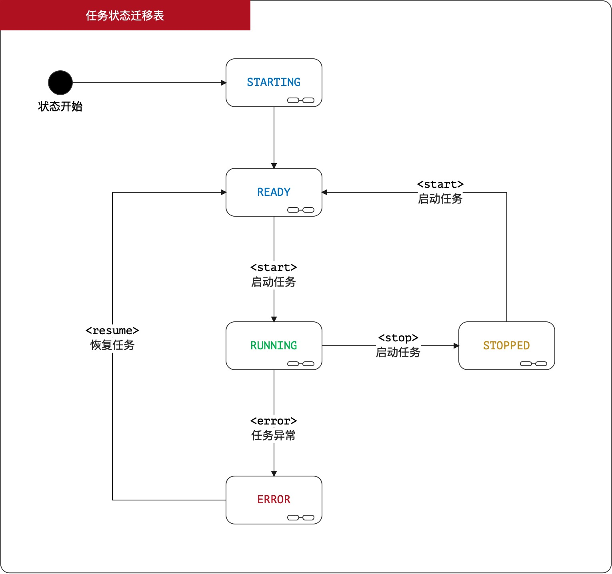
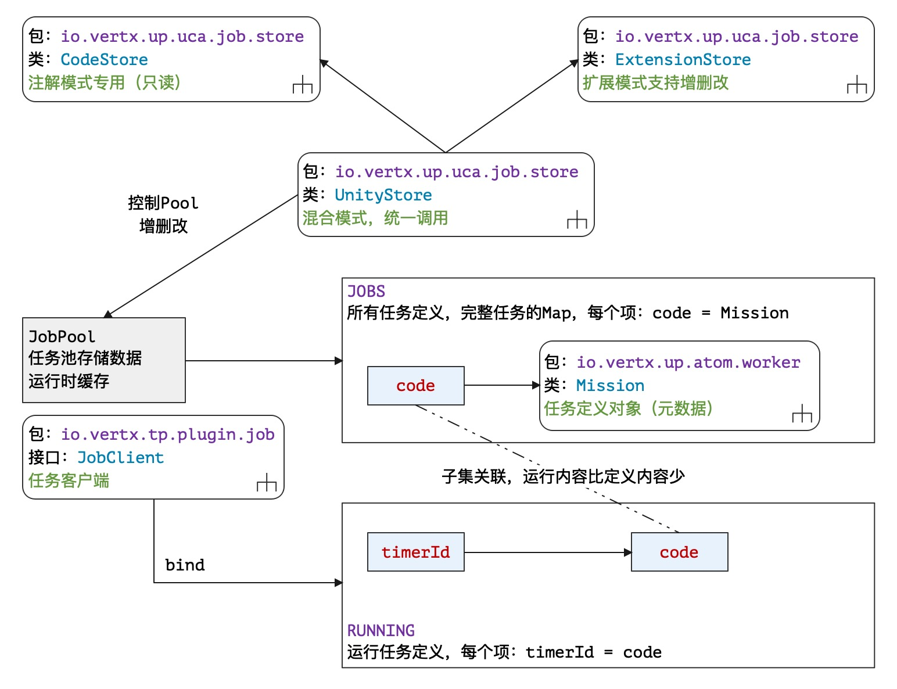

# 17. 隐匿者：Job

> 烟霞壁立水溶溶，路转崖回旦暮中。鸂鶒畏人沈涧月，山羊投石挂岩松。——唐 薛逢《五峰隐者》

* 项目地址：<https://github.com/silentbalanceyh/vertx-zero-example/>（子项目：**up-ares**）

&ensp;&ensp;&ensp;&ensp;本章回到Zero中一个重要功能：**后台任务**，由于任务模块在很多场景中都实用，所以Zero将该模块直接设计到了框架内部，有了该模块您就可以在容器启动时执行某些系统专用的后台任务。

> 我们在生产环境设置了超过400多个Job，目前用该架构运行是可靠并且稳定的。

## 「壹」基础知识

&ensp;&ensp;&ensp;&ensp;后台任务在Zero中使用了额外设计，主要原因是Vert.x的3.9.x的版本中并没有提供专用的任务子模块，于是在项目中使用Vert.x中提供的Timer实现了任务的完整流程，在重新设计后提供给开发者让您也可以很方便在Zero中开发想要的后台任务组件。

### 1.1. 任务配置

&ensp;&ensp;&ensp;&ensp;先在环境中打开任务配置：

**vertx.yml**

```yaml
zero:
    # lime 连接vertx-job.yml配置文件
    lime: job
```

**vertx-job.yml**

```yaml
job:
    store:
        # 任务存储器
        component: io.vertx.tp.jet.uca.micro.JtHypnos
```

&ensp;&ensp;&ensp;&ensp;回顾任务部分的配置图如下：


&ensp;&ensp;&ensp;&ensp;整个任务组件按职责分为三种：

|组件名|配置节点|含义|
|---|---|:---|
|任务存储器|store|存储任务定义数据的专用组件。|
|任务调度器|interval|提供可扩展的调度、管理组件对任务进行控制。|
|任务客户端|client|客户端组件，可发送启动、停止、恢复等命令。|

### 1.2. 状态迁移图

> 定义在文件`io.vertx.up.eon.em.JobStatus`中。

&ensp;&ensp;&ensp;&ensp;Zero中的任务状态迁移图如下：



&ensp;&ensp;&ensp;&ensp;状态说明：

|状态|名称|含义|
|---|---|:---|
|STARTING|启动中|任务正在执行启动并执行配置初始化（异步）。|
|READY|就绪|该任务处于就绪状态，等待执行。|
|RUNNING|运行中|该任务正在运行中，长时间任务可能一直处于该状态。|
|ERROR|异常|任务执行过程中遇到了不可预知的错误导致任务异常终止。|
|STOPPED|停止|该任务执行完成，正常停止。|

### 1.3. 任务分类

> 定义在文件`io.vertx.up.eon.em.JobType`中。

&ensp;&ensp;&ensp;&ensp;Zero中把任务种类分成了四种（其中一种保留）：

|任务名|值|含义|
|:---|---|:---|
|一次任务|ONCE|触发式，执行完后直接停止等待下一次触发命令。|
|计划任务|PLAN|计划式，Zero启动时开始执行，每隔一段时间轮询执行。|
|定时任务|FIXED|计划式，可设置固定启动时间戳，同PLAN。|
|任务集|CONTAINER|「保留」任务编排器，可对更多子任务进行调度。|

&ensp;&ensp;&ensp;&ensp;如果您是使用@Job开发任务，那么只支持ONCE和PLAN两种，若使用`zero-jet`项目中的**动态路由**和**动态任务**
功能，就直接支持FIXED任务了，目前有一种解决方案就是在Income组件中对Mission对象进行修正。

### 1.4 启动组件

&ensp;&ensp;&ensp;&ensp;Zero中的任务启动器是`io.vertx.up.verticle.ZeroScheduler`类，它的定义如下：

```java
/**
 * Background worker of Zero framework, 
 * it's for schedule of background tasks here.
 * This scheduler is for task deployment, it should deploy all tasks
 * This worker must be SINGLE ( instances = 1 ) 
 * because multi worker with the same tasks may be
 * conflicts
 */
@Worker(instances = Values.SINGLE)
public class ZeroScheduler extends AbstractVerticle
```

&ensp;&ensp;&ensp;&ensp;此处使用了@Worker（`io.vertx.up.annotations.Worker`）注解，且它的instances的值为`1`
，为什么该启动组件的实例只有1个？它的职责是在Vertx实例启动时直接发布所有目前系统中定义的任务，并连接各自不同的任务调度器，由于它的类型是一个Verticle组件，如果有多个实例，对于定时任务这种后台执行时会出现多任务抢资源的情况，所以从某种意义上讲，一种类型的后台任务只维持一个（这个只能在实战中逐渐体会）。所以ZeroScheduler是一个**
任务发布器**，它不负责任务调度，只负责在Zero容器启动时发布定义的任务，它只会在启动时运行一次。

### 1.5. @Job

&ensp;&ensp;&ensp;&ensp;Zero中定义任务使用任务注解`io.vertx.up.annotations.Job`，该任务注解可配置的方法表如下：

|方法名|类型|含义|
|:---|---|:---|
|value()|JobType|描述被注解的类的任务类型。|
|name()|String|该任务的名称，如果不提供则Zero会为您自动生成任务名。|
|config()|String|提供一个资源文件路径，可设置复杂任务的相关配置。|
|duration()|long|计划任务的时间间隔，默认：300。|
|durationUnit|TimeUnit|时间间隔单位，默认：秒。|
|threshold()|long|任务运行时长，影响Worker的block时间，默认：900|
|thresholdUnit()|TimeUnit|时长单位，默认：秒。|
|runAt()|String|`0.6.2`后支持，指定计划任务运行时间。|

&ensp;&ensp;&ensp;&ensp;有一点需说明即定时任务中的开始时间只能依赖`config()`
来实现复杂配置，即您可以在一个静态配置文件中将该任务部署到环境里（每个任务一个），如此您就可以直接编写您的任务逻辑，而不需要去考虑**任务调度**了。

&ensp;&ensp;&ensp;&ensp;runAt的格式如下：

|值|前缀|含义|
|---|---|:---|
|D,00:00|D|按天算，00:00指定的时间运行。|
|W,00:00,3|W|按周算，每周3，指定的00:00时间运行。|
|M,00:00,11|M|按月算，每月11日，指定的00:00时间运行。|

&ensp;&ensp;&ensp;&ensp;runAt主要用于计算任务的下一次运行时间，如果下一次运行时间小于当前时间，则执行下一轮操作，下一轮开始时间可根据D、W、M进行计算，不断循环。

### 1.6. Mission

&ensp;&ensp;&ensp;&ensp;任务的核心数据对象就是`io.vertx.up.atom.worker.Mission`，您在编写任务组件时，必须对该对象有详细了解，它将**注解式**和**配置式**
的两种存储源统一到一起，不论你使用哪种任务存储器，最终ZeroScheduler拿到的任务定义数据类型是`Set<Mission>`；本章节不牵涉Zero Extention模块，所以不深入`zero-jet`
中存在的基于数据表的任务存储器，只讨论注解模式下纯开发的部分。

&ensp;&ensp;&ensp;&ensp;该对象的核心结构参考下图（**属性分布图**）：


&ensp;&ensp;&ensp;&ensp;需说明的一点是`readOnly`属性，该属性是根据定义计算出来的属性，它表示的并不是运行时的Mission不可变更，而表示的是**任务存储器**中的**元数据**不可变更，目前从实战中可知：

1. 使用@Job注解模式开发的任务为静态任务，readOnly = true。
2. 使用`zero-jet`开发的任务为动态任务，readOnly = false（可随时更改）。

### 1.7. Income/Outcome

&ensp;&ensp;&ensp;&ensp;Zero任务系统中包含两个特殊组件`Income/Outcome`，一个组件在任务之前执行，另外一个组件在任务之后执行，它们之间通过EventBus互通数据，整体执行步骤如：


&ensp;&ensp;&ensp;&ensp;三个组件交互数据时使用的就是统一数据模型`Envelop`，incomeAddress地址中的数据是在任务**每次启动之前**
被您发送到EventBus的，如果发送了，您可以在Income组件中处理相关逻辑，如果没发送，当前任务该执行的话依旧会执行；而outcomeAddress属性中，若您使用了，后续步骤从`outcome -> callback（@Off）`
的执行逻辑是异步的，若不启用，则后续步骤是同步的。

## 「贰」实战分析

&ensp;&ensp;&ensp;&ensp;本章会修改部分Job相关的Zero框架代码，推荐升级到`0.6.2`的最新版完成下边示例，新版本中补充的功能如下：

* 新增JobClient的API对任务执行额外控制。
* 追加JobClient的Future模式和同步模式。
* 修改@Job中让它支持**定时任务**，让整个功能脱离`zero-jet`的模式依旧可运行。

> `0.6.x`版本中更新的所有功能都会出现在`0.7.0-SNAPSHOT`中，如果下载最新代码这些功能自然支持。

### 2.1. 第一个Job

&ensp;&ensp;&ensp;&ensp;好，接下来我们在项目中书写我们的第一个任务，先看下边代码：

**Job组件**

```java
package cn.vertxup.job;

import io.vertx.core.Future;
import io.vertx.core.Vertx;
import io.vertx.up.annotations.Contract;
import io.vertx.up.annotations.Job;
import io.vertx.up.annotations.On;
import io.vertx.up.commune.Envelop;
import io.vertx.up.eon.em.JobType;

@Job(JobType.ONCE)
public class HiJob {

    @Contract
    private transient Vertx vertx;

    @On
    public Future<String> on(final Envelop input) {
        System.out.println("Start: " + this.vertx.hashCode());
        return Future.succeededFuture("On");
    }

    public Future<String> off(final Envelop input) {
        System.out.println("End " + this.vertx.hashCode());
        return Future.succeededFuture("Off");
    }
}
```

&ensp;&ensp;&ensp;&ensp;注意代码段中的这段：

```java
    @Contract
    private transient Vertx vertx;
```

&ensp;&ensp;&ensp;&ensp;如果没有该段代码，那么您会收到如下错误信息：

```shell
io.vertx.up.exception.web._412ContractFieldException: \
[ERR-60040] (InstanceField) Web Exception occurs: (412) - \
The field of type `interface io.vertx.core.Vertx` must be declared only ...
```

> @Contract是另外一个话题的内容，它是Zero对JSR330的扩展，使用依赖注入的方式将约定的对象通过类型和数量的匹配直接注入到目标对象中，它的基本限制如下：
> 1. 被注入的对象必须定义@Contract注解的实例变量，如果自身没有定义该实例变量，父类或祖类定义该实例变量也可以。
> 2. @Contract注解的实例变量的类型必须是和调用者的**类型一致**的。
> 3. @Contract注解的实例变量只能**定义一次**，不可重复定义（保持唯一性）。

&ensp;&ensp;&ensp;&ensp;任务中提供Vertx实例，其目的是让开发人员在某些场景中可自由发挥，众所周知，Vert.x框架中的很多子项目在初始化时是依赖Vertx实例的，而任务组件的目的就在此，若您想要当前任务和Vert.x子项目直接集成，那么这里约定的Vertx实例就是您的**
银弹**。

&ensp;&ensp;&ensp;&ensp;如上边代码示例所示，任务主要有两个方法：

* @On注解的方法是任务启动时的逻辑（主逻辑）。
* @Off注解的方法是任务停止时的逻辑。

&ensp;&ensp;&ensp;&ensp;如此您的任务组件就十分自由了，只要参考Zero教程，您的任务组件就可以直接上线了，只是这个例子中有一个限制，由于类型是ONCE，必须依靠触发而不是自动执行，所以我们目前只能在启动时看到该任务的部署情况：

```shell
# 省略......
( 1 Job ) The Zero system has found 1 components of @Job.
# 省略......
[ Job ] Job configuration read : \
        JobConfig{store=null, interval=null, client=null}
# 省略......
[ Job ] The system scanned 1 jobs with type Programming
[ Job ] The system scanned 0 jobs with type Dynamic/Stored
Zero system detect 1 jobs, the scheduler will begin....
```

### 2.2. @On/@Off

&ensp;&ensp;&ensp;&ensp;上边示例使用了`@On`和`@Off`对方法进行注解，您对这些方法如何书写还比较陌生，本章讲解这些方法签名的规则，让您更容易书写Job组件中的方法，若您的方法不符合规范，会收到如下异常：

```shell
io.vertx.up.exception.web._501JobOnMissingException: \ 
        [ERR-60042] (Mission) Web Exception occurs: (501)
```

&ensp;&ensp;&ensp;&ensp;先参考下边表格

|方法注解|是否必须|含义|
|---|---|:---|
|@On|是|任务主逻辑专用方法，@Job组件中必须定义。|
|@Off|否|任务停止时回调方法，可定义可省略。|

&ensp;&ensp;&ensp;&ensp;任务中的方法参数主要根据类型执行匹配，这些类型大部分都是Zero中定义的核心数据模型，且您可以任意组合（一般不推荐方法参数不超过三个，极端环境中您可以定义更多），任务方法支持的类型表格如下：

|类型|含义|
|:---|:---|
|io.vertx.up.commune.Envelop|「数据」信封，Zero中的统一数据模型。|
|io.vertx.ext.web.Session|Web会话对象（vertx-web项目）。|
|io.vertx.ext.auth.User|登录账号信息（vertx-auth项目）。|
|io.vertx.core.MultiMap|Http请求头数据获取。|
|io.vertx.up.commune.Commercial|通道对象，zero-jet动态路由专用，mission的metadata中定义。|
|io.vertx.core.json.JsonObject|存在输入则检查@BodyParam提取，不存在输入则从mission的additional中提取。|
|io.vertx.up.atom.worker.Mission|「元数据」任务定义专用对象，该组件的核心对象。|
|io.vertx.up.atom.Refer|Income/Outcome/Job任务链上共享的数据池，任意类型。|

&ensp;&ensp;&ensp;&ensp;上述结构中，有部分参数来自于Web请求（如`Envelop、Session、User、MultiMap`
），您可能会困惑——后台任务由服务端主动发起，为何会收到来自前端的请求信息呢？主要来源如下：

1. Zero中的一次性任务是触发式的，即您需要从前端发送一个命令来触发该任务的发生，这种情况会发送Web请求到您的任务组件中。
2. 如果您绑定了`inconme`组件，此处的所有内容都可以直接在`income`中被模拟，同样也可以收到相关数据，数据信息来自`incomeAddress`地址。

&ensp;&ensp;&ensp;&ensp;如果您的方法定义类型不对，会收到如下异常信息：

```shell
[ERR-60041] (TypedArgument) Web Exception occurs: (417) - \
    The job `zero.vertx.jobs-xxx` method parameter definitions are wrong.
```

> xxx是您的Job的名称，可自定义，不自定义时是类全名。

### 2.3. JobClient

&ensp;&ensp;&ensp;&ensp;为了让您有更好的任务体验，本章我们先学习如何书写任务客户端，任务客户端和SharedClient一样属于内置`Infix`
插件，所以您不需要引入任何Maven项目就可使用，我们直接在项目中打开任务客户端的基础配置。

**vertx-inject.yml**

```yaml
# Job，任务插件
job: io.vertx.tp.plugin.job.JobInfix
```

&ensp;&ensp;&ensp;&ensp;JobClient中包含了一个特殊的静态方法`bind`，它用来将Vert.x中的计时器的ID（`timerId`
）和任务Mission的系统编码一对一绑定到一起，该方法在三种任务的启动器中直接被调用，方法签名如下：

```java
    // 绑定执行（启动容器时执行）
    static void bind(final Long timerId, final String code)

    // 调用代码如下
    JobClient.bind(timerId, mission.getCode());
```

&ensp;&ensp;&ensp;&ensp;该方法的调用是控制类API使用的核心，如果不调用该方法，那么控制类API的调用会失效，整个Job在Zero中的结构参考下图：



#### 2.3.1. 控制类API

> 控制指令的API只支持异步，不支持同步。

&ensp;&ensp;&ensp;&ensp;控制类API的定义如下：

```java
    /* 启动任务 */
    // Fluent模式，回调启动
    @Fluent
    JobClient startAsync(String code, 
        Handler<AsyncResult<Long>> handler);
    // Future模式，异步启动
    Future<Long> startAsync(String code);

    /* 停止任务 */
    // Fluent模式，回调停止
    @Fluent
    JobClient stopAsync(String code, 
        Handler<AsyncResult<Boolean>> handler);
    // Future模式，异步停止
    Future<Boolean> stopAsync(String code);

    /* 恢复任务 */
    // Fluent模式，回调恢复
    @Fluent
    JobClient resumeAsync(String code, 
        Handler<AsyncResult<Long>> handler);
    // Future模式，异步恢复
    Future<Long> resumeAsync(String timerId);
```

#### 2.3.2. 存储类API

&ensp;&ensp;&ensp;&ensp;存储类API比控制类API多一种同步模式，该同步模式的API会被任务存储器调用，任务存储器启动之前Zero容器可能未完全启动完成——同步类的API就是为解决该问题而存在。还需要说明的是，这类API的增删改在不提供扩展存储时，只操作JobPool的任务池（缓存数据），不会操作**
持久层**。这类API的定义如下（**注释只区分同异步，异步两种模式就不备注了**）：

```java
    // 「任务查询」
    // 按 code 查询单个 Mission
    // 异步
    @Fluent
    JobClient fetchAsync(String code, 
        Handler<AsyncResult<Mission>> handler);
    Future<Mission> fetchAsync(String code);
    // 同步
    Mission fetch(String code);

    // 按 多个code 查询 Mission 列表
    // 异步
    @Fluent
    JobClient fetchAsync(Set<String> code, 
        Handler<AsyncResult<List<Mission>>> handler);
    Future<List<Mission>> fetchAsync(Set<String> codes);
    // 同步
    List<Mission> fetch(Set<String> codes);

    // 「任务同步」新增/更新
    // 单量异步
    @Fluent
    JobClient saveAsync(Mission mission, 
        Handler<AsyncResult<Mission>> handler);
    Future<Mission> saveAsync(Mission mission);
    // 单量同步
    Mission save(Mission mission);

    // 批量异步
    @Fluent
    JobClient saveAsync(Set<Mission> missions,
        Handler<AsyncResult<Set<Mission>>> handler);
    Future<Set<Mission>> saveAsync(Set<Mission> missions);
    // 批量同步
    Set<Mission> save(Set<Mission> missions);

    // 「任务删除」
    // 异步
    @Fluent
    JobClient removeAsync(String code, 
        Handler<AsyncResult<Mission>> handler);
    Future<Mission> removeAsync(String code);
    // 同步
    Mission remove(String code);

    // 「任务状态查看」
    // 异步
    @Fluent
    JobClient statusAsync(String namespace, 
        Handler<AsyncResult<JsonObject>> handler);
    Future<JsonObject> statusAsync(String namespace);
    // 同步
    JsonObject status(String namespace);
```

### 2.4. Agent组件

&ensp;&ensp;&ensp;&ensp;接下来在环境中书写一个控制类的Agent组件，用来查看环境中的详细任务信息。

**Agent组件代码**

```java
package cn.vertxup.job;

import io.vertx.core.json.JsonObject;
import io.vertx.tp.plugin.job.JobClient;
import io.vertx.up.annotations.EndPoint;
import io.vertx.up.annotations.Plugin;

import javax.ws.rs.GET;
import javax.ws.rs.Path;

@EndPoint
@Path("/hi/job")
public class JobAgent {
    @Plugin
    private transient JobClient client;

    @GET
    @Path("/status")
    public JsonObject status() {
        return this.client.status(null);
    }
}
```

&ensp;&ensp;&ensp;&ensp;发送请求您可以得到如下响应：

```json
{
    "data": {
        "zero.vertx.jobs-cn.vertxup.job.HiJob": {
            "name": "cn.vertxup.job.HiJob",
            "status": "STOPPED",
            "timer": null
        }
    }
}
```

&ensp;&ensp;&ensp;&ensp;说明几点：

1. 由于并没有启动该任务，所以任务的状态是STOPPED，timer的值为null。
2. 如果您不提供任务名称，该任务的基础信息如下：

   |属性|含义|
       |---|:---|
   |name|不给定时，名称为任务类全名。|
   |code|任务系统码，格式为：`zero.vertx.jobs-` + name 结构。|
3. 如果您定义了name属性，则可直接调用`JobClient.code(name)`的静态方法得到任务系统码。

## 「叄」高级用法

### 3.1. 计划/定时任务

**PlanJob**

```java
package cn.vertxup.job;

import io.vertx.core.Future;
import io.vertx.core.Vertx;
import io.vertx.up.annotations.Contract;
import io.vertx.up.annotations.Job;
import io.vertx.up.annotations.On;
import io.vertx.up.commune.Envelop;
import io.vertx.up.eon.em.JobType;

@Job(value = JobType.PLAN, duration = 10, name = "Plan")
public class PlanJob {
    @Contract
    private transient Vertx vertx;
    private transient int counter = 0;

    @On
    public Future<String> on(final Envelop envelop) {
        this.counter++;
        System.out.println("第 " + this.counter + " 次执行: "
                + this.vertx.hashCode());
        return Future.succeededFuture("On");
    }
}
```

&ensp;&ensp;&ensp;&ensp;启动该容器，则您可以看到如下启动信息：

```shell
[ Job ] Job `zero.vertx.jobs-Plan`（ Moved: STARTING -> READY ）, Type = PLAN
[ Job ] Interval selected: io.vertx.up.uca.job.timer.VertxInterval
```

&ensp;&ensp;&ensp;&ensp;只有计划任务和定时任务会有`Inverval`的日志出现，触发任务不需要该组件配合。由于此处设置的`duration`
是10，默认单位秒，所以10秒之后它会第一次执行，然后每隔十秒执行一次，每次运行时您都可以看到如下输出：

```shell
[ Job ] Job `zero.vertx.jobs-Plan`（ Moved: READY -> RUNNING ）, Type = PLAN
[ Job ] `zero.vertx.jobs-Plan` worker executor will be created. \
    The max executing time is 900 s
第 1 次执行: 421824326
[ Job ] Job `zero.vertx.jobs-Plan`（ Moved: RUNNING -> STOPPED ）, Type = PLAN
[ Job ] Job `zero.vertx.jobs-Plan`（ Moved: STOPPED -> READY ）, Type = PLAN
[ Job ] `zero.vertx.jobs-Plan` worker executor has been closed!
```

&ensp;&ensp;&ensp;&ensp;从上述输出可知，任务执行时，会从`READY`状态按照之前的流程图执行直到完成后返回`READY`，默认情况下一个子线程的执行最长时间空间是`15`
分钟（900s），若您想要改这个时间，可设置threshold参数——一般只有长时间执行的任务才修改该参数。

&ensp;&ensp;&ensp;&ensp;若是定时任务，您可设置runAt，其他任务即使设置了也无效，参考下边代码：

```java
package cn.vertxup.job;

import io.vertx.core.Future;
import io.vertx.core.Vertx;
import io.vertx.up.annotations.Contract;
import io.vertx.up.annotations.Job;
import io.vertx.up.annotations.On;
import io.vertx.up.commune.Envelop;
import io.vertx.up.eon.em.JobType;

import java.util.concurrent.TimeUnit;

@Job(
        value = JobType.FIXED, name = "Fixed",
        duration = 1, durationUnit = TimeUnit.DAYS,
        runAt = "D,18:20"
)
public class FixedJob {
    @Contract
    private transient Vertx vertx;
    private transient int counter = 0;

    @On
    public Future<String> on(final Envelop envelop) {
        this.counter++;
        System.out.println("第 " + this.counter + " 次执行: "
                + this.vertx.hashCode());
        return Future.succeededFuture("On");
    }
}
```

&ensp;&ensp;&ensp;&ensp;然后运行代码，您就可以看到一条额外的定时日志：

```shell
[ Job ] Job "zero.vertx.jobs-Fixed" will started after `00:08:36.116`
```

&ensp;&ensp;&ensp;&ensp;运行程序时间为`18:11:23.886`，设置时间是`18:20`，学习了本章内容，关于定时任务和计划任务的相关内容就讲完了。

### 3.2. Income/Outcome

&ensp;&ensp;&ensp;&ensp;最后讲解一下前置组件和后置组件，这两部分比较简单，直接看代码：

**Income**

```java
package cn.vertxup.job;

import io.vertx.core.Future;
import io.vertx.core.Vertx;
import io.vertx.up.annotations.Contract;
import io.vertx.up.atom.worker.Mission;
import io.vertx.up.commune.Envelop;
import io.vertx.up.uca.job.plugin.JobIncome;
import io.vertx.up.unity.Ux;

public class FinalIncome implements JobIncome {
    @Contract
    private transient Vertx vertx;
    @Contract
    private transient Mission mission;

    @Override
    public Future<Envelop> beforeAsync(final Envelop envelop) {
        return Ux.future(Envelop.success("Hello Income"));
    }
}
```

&ensp;&ensp;&ensp;&ensp;既然此处出现了@Contract那么在您的Income组件中是必须定义这两个实例变量的，前文提过，就不特别说明了，这两个实例可以让您在Income和Outcome组件中很方便拿到环境相关的引用：

1. Vertx实例，可用于做Vert.x集成。
2. Mission实例，可获取当前任务的定义相关数据。

**Job**

```java
package cn.vertxup.job;

import io.vertx.core.Future;
import io.vertx.core.Vertx;
import io.vertx.up.annotations.Contract;
import io.vertx.up.annotations.Job;
import io.vertx.up.annotations.On;
import io.vertx.up.commune.Envelop;
import io.vertx.up.eon.em.JobType;

@Job(value = JobType.PLAN, duration = 10, name = "Final")
public class FinalJob {

    @Contract
    private transient Vertx vertx;

    @On(address = "JOB://INCOME/FINAL", income = FinalIncome.class)
    public Future<String> on(final Envelop input) {
        System.out.println("Income: " + input.data());
        System.out.println("Start: " + this.vertx.hashCode());
        return Future.succeededFuture("On");
    }
}
```

&ensp;&ensp;&ensp;&ensp;直接运行Zero容器，10秒之后，您会看到如下**额外**输出：

```shell
[ Job ] Income event bus enabled: JOB://INCOME/FINAL
[ Job ] JobIncome selected: cn.vertxup.job.FinalIncome
Income: Hello Income
Start: 2063896788
```

&ensp;&ensp;&ensp;&ensp;这样，Income组件就被触发了，它不仅被触发，还为@Job组件构造了合法的Envelop对象。

## 「肆」小结

&ensp;&ensp;&ensp;&ensp;到这里，所有和任务相关的内容都已经讲解完成了，之所以称为**隐匿者**
就是因为所有的任务都是后台执行，一旦执行任务过后，您可以不用关注任务本身的执行过程，等到执行结果出来过后，任务本身状态会有所变更，若您结合`zero-ui`中的**任务管理**
模块，这部分内容会更加直观。整个示例中大部分内容都是书写过程改动的，所以最好在`0.6.2`的版本中运行，之前的版本没有这么复杂的功能。


