> 冰缩寒流，川凝冻霭，前回鹭渚冬晚。燕阁红炉，驼峰翠釜，曾忆花柔酒软。――刘天游《氐州第一》

* 项目地址：<https://github.com/silentbalanceyh/vertx-zero-example/>

&ensp;&ensp;&ensp;&ensp;本篇为实战总结帖，主要用于多个项目同时运行时的统一文档，目前Zero上已经运行了几个比较重量级的项目，本文主要针对几个平台从环境搭建、开发、运行、测试到部署进行基于实战的讲解，以Step-By-Step的方式让开发人员能更加流畅搭建Zero的企业实战开发环境。本文内容和原始教程中的内容略微有些出入，是因为引用了更多Zero Extension中的模块来辅助开发，所以此文算是Zero Core和Zero Extension的交叉参考教程。

# 「壹」开发环境

## 1.1. 环境介绍

### 1.1.1. 基础环境

&ensp;&ensp;&ensp;&ensp;最新的依赖库版本如下：

|依赖库|类型|版本|
|---|---|---|
|NodeJs|前端|16.14.0|
|Yarn|前端|1.22.17|
|Ant Design|前端|3.26.19|
|React|前端|16.14.0|
|JDK|后端|11|
|Maven|后端|3.8.5|
|Zero|后端|0.8.1 ~|
|Vertx|后端|4.2.6|
|ElasticSearch|集成（全文检索）|7.x ~|
|Neo4j|集成（拓扑图）|4.x ~|
|Camunda|集成（工作流）|7.x ~|
|MySQL|数据库|5.x|
|Oracle|数据库|12.x|
|TiDB|数据库|5.x|

### 1.1.2. 特殊说明

#### 基础环境部分

* JDK的版本推荐使用ZuLu的开源JDK：<https://www.azul.com/downloads/>
* Maven推荐使用mvnd工具：<https://github.com/apache/maven-mvnd/releases>
* Maven的仓库推荐使用中心仓库，以防止部分jar包无法从代理仓库下载。

#### 可选扩展部分

* 如果使用了**动态建模**（zero-atom）功能，则需要根据您的数据库下载相关依赖库：<https://github.com/silentbalanceyh/vertx-zero/tree/master/vertx-pin/zero-vista>，若是其他类型数据库需参考内置源代码自己写一套基础插件。
* 集成部分的ElasticSearch、Neo4j、Camunda、Redis根据您自身项目情况而定。
* **动态建模**/**动态路由**功能根据您自身项目情况而定。
* Zero的基础版本是支持微服务和K8S（Istio）的，而此功能受限于目前项目，处于**实验性版本**阶段，需启用`vertx-istio`项目。

### 1.1.3. 脚手架数据

&ensp;&ensp;&ensp;&ensp;本教程**假设**您的基本环境如下：

|实体|必须/可选|类型|含义|
|---|---|---|---|
|Maven仓库|x|依赖库目录|~/.m2/repository|
|本地开发|x|工作目录|~/runtime/develop|
|生产存储|可选|工作目录|~/runtime/zero-store/（文档管理专用）|
|生产部署|x|工作目录|~/server（前后端一致）|
|`DB_UP`|x|数据表|数据库中的主库|
|`DB_UP_WF`|可选|数据表|数据库中工作流专用库（Camunda库）|
|`DB_UP_HIS`|可选|数据表|数据库中的删除历史库|
|`DB_XX`|可选|数据表|动态建模专用库|

&ensp;&ensp;&ensp;&ensp;**注**：可选部分根据您搭建环境过程中选择的zero extension模块进行相关定义，最新版的模块化会自动化部署相关模块已经环境内容，详细部分参考后续章节，从`0.8.1`的版本开始，zero extension扩展模块引入了**OOB——Out Of Box**开箱即用的配置数据，若您启用了OOB功能，即使您的系统内没有任何内容，这些配置数据都会跟随本教程的发布流程进入到您的主库中。

### 1.1.4. 默认登录

* 默认账号：falcon（开发者）
* 默认密码：11111111

<hr/>

## 1.2. zero主框架

&ensp;&ensp;&ensp;&ensp;如果您不关注最新版的功能，直接使用`0.8.1`版本，则可**跳过该步骤**，由于zero本身是一个跟着项目成长很迅速的项目，所以在`1.0`版本发布之前，个人推荐紧跟最新版本走。虽然最新版本是`X-SNAPSHOT`，基础功能已经经过了生产环境验证，所以该版本是可靠的；再者，最新版本会包含一部分重用性极高的新功能，如`0.9.0-SNAPSHOT`中引入的：

* 文档管理平台（FTP、SSH）
* 模块化管理平台（License、Modulat）
* 工作流标准化平台（ITSM、ISO）
* WebSocket功能（正在开发中，用于提醒）
* 短信邮件集成

&ensp;&ensp;&ensp;&ensp;zero框架导入的**操作步骤**如下：

1. 进入目录`~/runtime/develop/`中，下载`vertx-zero`代码到环境中：

    ```shell
    # 由于是只读类型，所以可不带access_token的模式拉取开源代码
    ~/runtime/develop >> git clone https://github.com/silentbalanceyh/vertx-zero.git
    # 命令执行后的输出如下
    Cloning into 'vertx-zero'...
    remote: Enumerating objects: 62003, done.
    remote: Counting objects: 100% (17224/17224), done.
    remote: Compressing objects: 100% (6252/6252), done.
    remote: Total 62003 (delta 8657), reused 16131 (delta 8157), pack-reused 44779
    Receiving objects: 100% (62003/62003), 87.48 MiB | 15.39 MiB/s, done.
    Resolving deltas: 100% (35166/35166), done.
    Updating files: 100% (4850/4850), done.
    ```

2. 下载完成后`~/runtime/develop`中会有一个`vertx-zero`目录，使用IDEA导入该目录中的项目：
    * 2.1. 启动IDEA

        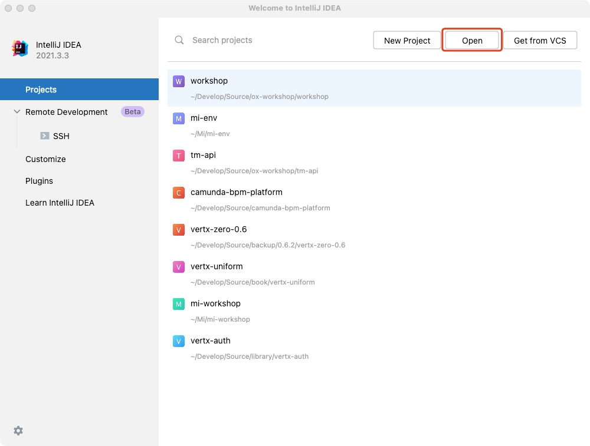
    * 2.2. 选中下载的`vertx-zero`目录中的`pom.xml`文件（自动导入成Maven类型的项目）

        
    * 2.3. 在弹出的对话框中选择`Open as Project`（以项目方式打开）

        
    * 2.4. 如果弹出下边对话框，直接勾选`Trust projects in ~/runtime/develop`，然后点击`Trust Project`

        
    * 2.5. 等待右下角的项目初始化完成

        
    * 2.6. 若您点开进度条会看到正在执行的后台任务，请等待后台任务全部完成后再执行下一步

        
    * 2.7. 项目初始化过程中，系统会下载部分所需的Maven依赖包，您的Maven库中会开始有内容
        （**注：如果之前您的Maven目录中已存在相关库，则可忽略，Demo从空Maven库开始初始化以方便初学者理解。**）：
        
3. 导入完成后，检查IDE中的JDK运行环境是否符合：**File -> Project Structure...**，推荐**11**。

    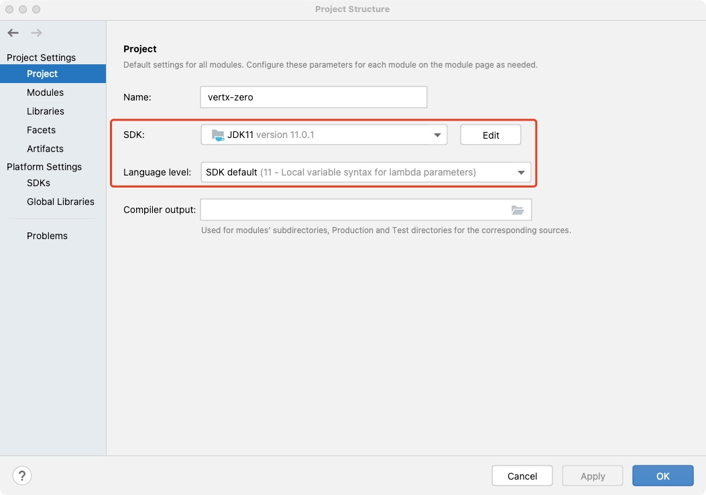

    > 此处注意Language level（语言级别），从`zero`的`0.7.x`版本开始，框架引入了`Camunda`工作流引擎，该引擎最新版本最低要求支持JDK11，基于这一点出发，`zero`也将JDK从8升级到了11，所以从该版本开始所有的Java环境以11为准。
4. 打开Terminal终端，使用内置脚本（**mvnd环境**）编译`vertx-zero`：

    

    ```shell
    # zero中内置脚本主要用于快速编译以及增量编译框架，其中内容如下：
    # 1）完整编译（常用）                -- zero-compile.sh
    # 2）增量编译                       -- zero-compile-increase.sh
    # 3）「部分」编译核心框架             -- zero-compile-core.sh
    # 4）「部分」编译扩展框架             -- zero-compile-extension.sh
    # 5）「部分」编译插件                -- zero-compile-infix.sh
    # 
    ~/runtime/develop/vertx-zero(master) >> ./zero-compile.sh
    ......
    # 最终输出如下
    [INFO] ------------------------------------------------------------------------
    [INFO] BUILD SUCCESS
    [INFO] ------------------------------------------------------------------------
    [INFO] Total time:  45.021 s (Wall Clock)
    [INFO] Finished at: 2022-03-27T22:32:07+08:00
    [INFO] ------------------------------------------------------------------------
    ```

    zero-compile.sh内容如：

    ```shell
    mvnd clean package install -DskipTests=true -Dmaven.javadoc.skip=true -Dmaven.compile.fork=true -T 1C
    ```

&ensp;&ensp;&ensp;&ensp;上述步骤的编译不会触发zero的测试流程，如果使用`mvnd clean package install`方式处理，会触发zero的测试流程，使得整个框架编译的时间拉长，所以不推荐`clean package install`方式，这种方式仅留给zero的**研发人员**使用。编译成功后，您的开发环境Maven库中就安装了最新的zero版本，目前是`0.9.0-SNAPSHOT`。

<hr/>

## 1.3. zero插件环境（可选）

&ensp;&ensp;&ensp;&ensp;如果您在项目中使用了动态建模功能（启用`zero-atom`），此步骤是必须的，动态建模为高级功能，只有在引入主框架的场景下可使用，直接从中心仓库下载的依赖库中并不包含动态建模部分，此功能目前依然处于研发阶段，只有最新版可支持。

&ensp;&ensp;&ensp;&ensp;**操作步骤**如：

1. 执行Oracle依赖库的安装脚本（动态建模**编译必须**，运行可根据您的项目情况而定）
   
   ```shell
   # 进入 infix-oracle 项目目录
   ~/runtime/develop/vertx-zero(master) » cd vertx-pin/zero-vista/infix-oracle
   # 进入 Maven 本地安装目录
   ~/runtime/develop/vertx-zero/vertx-pin/zero-vista/infix-oracle(master) » cd maven
   # 执行安装脚本
   ~/runtime/develop/vertx-zero/vertx-pin/zero-vista/infix-oracle/maven(master) » ./install-oracle-jar.sh
   # 脚本内容如下
   # mvn install:install-file \
   #     -Dfile=ojdbc7-12.1.0.2.jar \
   #     -DgroupId=com.oracle \
   #     -DartifactId=ojdbc7 \
   #     -Dversion=12.1.0.2 
   #     -Dpackaging=jar
   ```

   `install-oracle-jar.sh`的内容如：

   ```shell
    mvn install:install-file \
        -Dfile=ojdbc7-12.1.0.2.jar \         
        -DgroupId=com.oracle \
        -DartifactId=ojdbc7 \
        -Dversion=12.1.0.2 
        -Dpackaging=jar
   ```

2. 在IDEA的Maven窗口中添加新项目：

   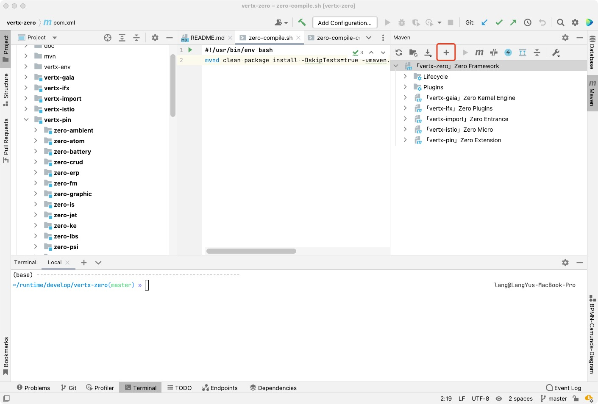

3. 导入项目`vertx-zero/vertx-pin/zero-vista/`（选择pom.xml文件）

   

4. 导入项目后直接编译`zero-vista`：

   ```shell
   ~/runtime/develop/vertx-zero/vertx-pin/zero-vista(master) » mvn clean package install
   .....
   # 最终输出如下
   [INFO] ------------------------------------------------------------------------
   [INFO] Reactor Summary for 「vertx-vista」Scaffold Extension 0.9.0-SNAPSHOT:
   [INFO] 
   [INFO] 「vertx-vista」Scaffold Extension .................... SUCCESS [  1.693 s]
   [INFO] Scaffold Plugin: MySQL（infix-mysql） ................ SUCCESS [  6.121 s]
   [INFO] Scaffold Plugin: Oracle（infix-oracle） .............. SUCCESS [  3.783 s]
   [INFO] ------------------------------------------------------------------------
   [INFO] BUILD SUCCESS
   [INFO] ------------------------------------------------------------------------
   [INFO] Total time:  12.339 s
   [INFO] Finished at: 2022-03-28T05:46:15+08:00
   [INFO] ------------------------------------------------------------------------
   ```

5. 如此您就可以直接在项目中使用动态建模的SQL DDL插件了，使用时只需要在`pom.xml`中引入下边片段即可（根据您使用的数据库选择合适的插件）：

    ```xml
        <!-- MySQL -->
        <dependency>
            <groupId>cn.vertxup</groupId>
            <artifactId>infix-mysql</artifactId>
            <version>${zero.version}</version>
        </dependency>
        <!-- Oracle -->
        <dependency>
            <groupId>cn.vertxup</groupId>
            <artifactId>infix-oracle</artifactId>
            <version>${zero.version}</version>
        </dependency>
    ```

    > zero中的数据库支持以MySQL和TiDB为主，目前开放的支持的数据库种类基于项目需求。

<hr/>

## 1.4. GitHub安全设置

> 注：当您作为协作者Coordinator提交代码时必须此步骤！

&ensp;&ensp;&ensp;&ensp;由于Github站点升级，当你作为Coordinator加入到项目开发时，新版本已不推荐使用**用户名/密码**方式拉取代码，而是需要在您的账号中生成个人的`access_token`[^1]，拉取项目代码时使用该`access_token`拉取。

[^1]: <https://docs.github.com/en/authentication/keeping-your-account-and-data-secure/creating-a-personal-access-token>

&ensp;&ensp;&ensp;&ensp;其**操作步骤**如下：


1. 登录您的Github个人账号空间，右上角选择**Settings**菜单：

   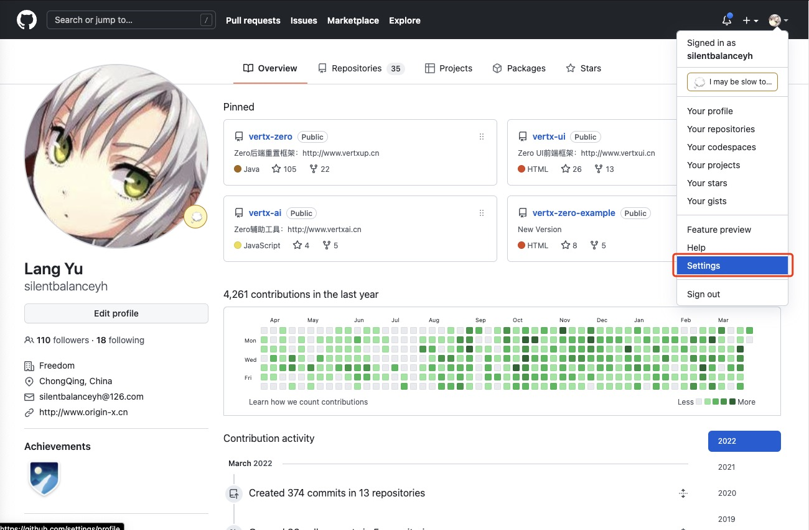

2. 选择左边菜单中最下边的**Developer Settings**：

   

3. 选择左边菜单**Personal access tokens**，然后点击**Generate new token**按钮

   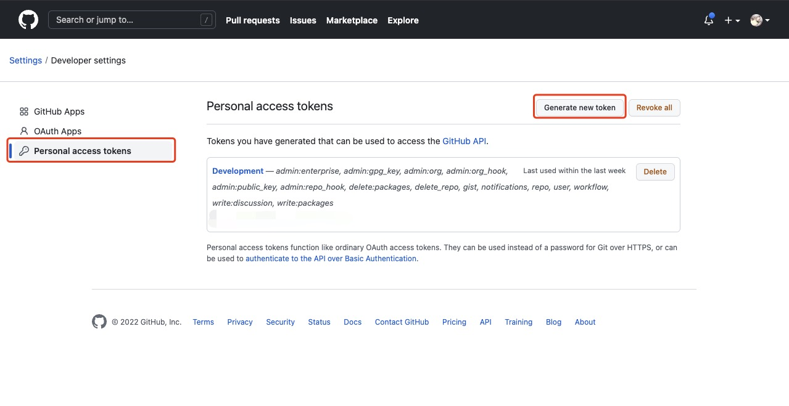

4. 勾选好您所需的权限后直接点击**Genarate token**按钮：

   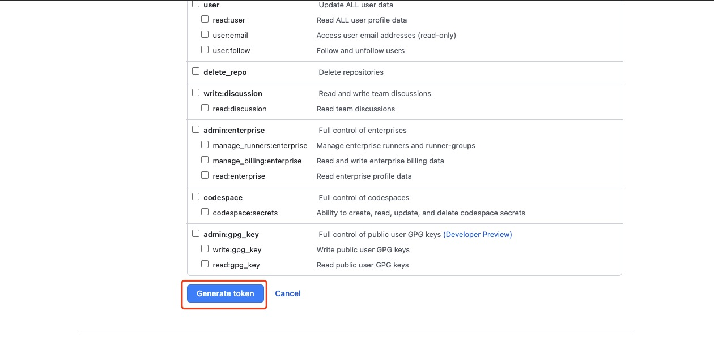
   
5. 在结果页记录下您的个人token：

   

6. 进入您的项目环境中，执行如下**操作步骤**进行库关联，先查看目前的远程库版本：

    ```shell
    ~/runtime/develop/vertx-zero(master) » git remote -v
    origin  https://github.com/silentbalanceyh/vertx-zero.git (fetch)
    origin  https://github.com/silentbalanceyh/vertx-zero.git (push)
    ```

7. 您的远程库名称为`origin`，执行如下命令：
   
    ```shell
    ~/runtime/develop/vertx-zero(master) » git remote set-url origin \
        https://<TOKEN>@github.com/silentbalanceyh/vertx-zero.git 
    ```

    注意上述命令格式，token的位置介于`https://`和`github.com`之间，并且以`@`结尾。

8. 再次查看您的远程库，库路径已发生改变：

    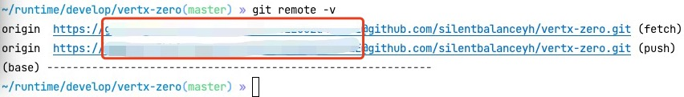

&ensp;&ensp;&ensp;&ensp;完成上述步骤之后，基本设置就完成了，当然在后续步骤中您可以直接使用`git clone https://<Token>@<Repo>`的方式拉取代码，**则 6 ~ 8 步骤可省略**，即下边命令：

```shell
git clone https://<TOKEN>@github.com/silentbalanceyh/vertx-zero.git
```

<hr/>

## 1.5. 项目后端

&ensp;&ensp;&ensp;&ensp;如果从头搭建zero脚手架，使用**新建**流程，若是导入已经搭建好的项目则使用**导入**流程。

### 1.5.1. 新建

&ensp;&ensp;&ensp;&ensp;新建项目可直接下载最新的脚手架版本：<https://github.com/silentbalanceyh/vertx-zero-scaffold>，然后根据自身项目修改如下内容：

* [ ] 添加hosts映射记录（团队协作开发专用）
* [ ] 修改Maven项目标识
* [ ] 修改各个数据库名称、账号、口令
* [ ] 修改容器端口号
* [ ] 修改前端跨域配置
* [ ] 「**数据部分**」修改初始化登录账号
* [ ] 「**数据部分**」修改租户、应用基本信息

&ensp;&ensp;&ensp;&ensp;其中**数据部分**需修改Excel数据文件中的内容，这部分教程在配置章节讲解，上述修改部分参考本教程的**配置篇**来详细修改，一旦搭建好环境后就不用再变更，为一次性操作。

### 1.5.2. 导入

&ensp;&ensp;&ensp;&ensp;导入项目时如果作为Coordinator需更改项目内容，参考《**1.4.Github安全设置**》先配置个人token，导入的**操作步骤**执行如下：

> 为了区分标准脚手架和新项目，从`vertx-zero-scaffold`中下载的项目在此章节为`smave`名称，从新建到配置完成的部分参考后续各配置章节。

1. 从仓库下载代码（带token安全下载）：

    ```shell
    git clone https://<Token>@<Repo>
    # 截图中以项目名smave为例，但该项目在私库中，所以读者无法直接访问，读者可直接访问自己创建好的Github仓库
    ```
    
    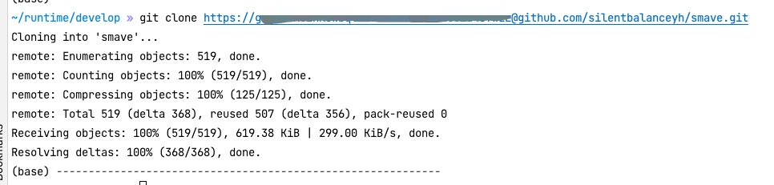

2. 参考《**1.3.zero插件环境**》直接添加一个新的Maven项目到IDEA环境中，添加完成后效果如：

   

   **注：vertx-zero和smave共存于一个IDEA窗口中**。

3. 打开终端，执行根目录的编译脚本

    ```shell
    ~/runtime/develop/smave(master) » ./build.sh
    # build.sh                      （Linux专用）
    # build.bat                     （Windows专用）
    ```

4. 编译成功后可以看到如下截图（如此后端基本开发环境就搭建完成了）

   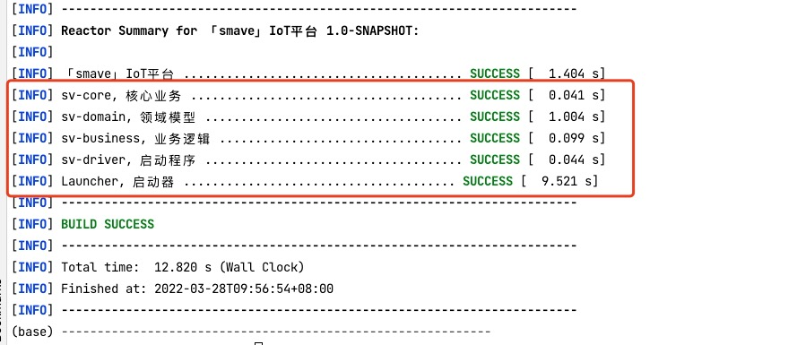

### 1.5.3. 初始化

&ensp;&ensp;&ensp;&ensp;Zero脚手架的初始化流程**操作步骤**如下：

1. 为了团队协作开发，先在自己本地开发环境中追加如下hosts映射（**部署时另外配置**）：

    ```shell
    # Mac位置              /private/etc/hosts
    # Windows位置          C:/Windows/System32/drivers/etc/hosts
    127.0.0.1     ox.server.cn      # 容器专用
    127.0.0.1     ox.engine.cn      # 服务专用
    127.0.0.1     ox.integration.cn # 集成专用（可选）
    ```

2. 为您的应用创建MySQL数据库账号：

    ```shell
    ~/server$ mysql -u root -p                          # 输入root密码连接到MySQL中
    mysql > USE mysql;
    mysql > CREATE USER 'smave'@'%' IDENTIFIED BY '<PASSWORD>';
    mysql > GRANT all privileges ON *.* TO smave@'%' WITH GRANT OPTION;
    ```

3. 执行数据库建库脚本
    > 账号密码位于脚本 database-reinit.sh，请自行修改，按第二步创建的账号更改即可，推荐团队开发账号统一。

    ```shell
    ~/runtime/develop/smave/script/database(master) » ./database-reinit.sh
    [Zero] 重建数据库成功!
    ```

    重建完成后，可以看到**空库**（文中仅演示了最小配置，不带**工作流库、动态库、删除历史备份库**，其他库的配置参考后续配置章节处理）：

    

4. 执行初始化脚本，zero中的初始化使用liquibase完成，直接运行如下脚本：

    ```shell
    ~/runtime/develop/smave/sv-driver/ix-smave(master*) » ./run-init.sh
    # 最终输出如下：
    [INFO] ------------------------------------------------------------------------
    [INFO] 
    [INFO] ------------------------------------------------------------------------
    [INFO] BUILD SUCCESS
    [INFO] ------------------------------------------------------------------------
    [INFO] Total time:  7.531 s
    [INFO] Finished at: 2022-03-28T10:20:04+08:00
    [INFO] ------------------------------------------------------------------------
    ```

    执行完初始化脚本后可以在数据库看到生成的表结构：
    
    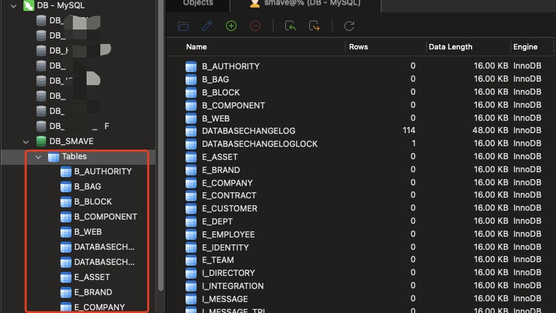

5. 「**重要！**」执行下边命令备份最新表结构用于生产发布：

    ```shell
    mysqldump -u root -pxxxx -h localhost --databases DB_SMAVE > src/main/resources/init/initialize.sql
    ```

6. 表创建好过后，执行数据导入专用程序：`cn.vertxup.SvLoader`

   

7. 「**重要！**」从此处开始，所有直接从IDEA中运行的主程序都必须配置好运行目录，否则无法以正确路径的方式加载数据，该步骤在生产环境中是不需要的，先点击`SvLoader`的运行配置：

   

8. 「**重要！**」点开运行配置后设置您的主程序的运行目录并保存该配置：

   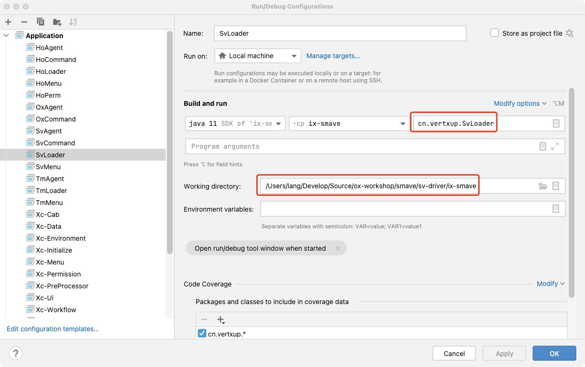

    重要的事情说三遍：
    * 注意第二个红色框，这一步对开发人员十分重要！*
    * 注意第二个红色框，这一步对开发人员十分重要！*
    * 注意第二个红色框，这一步对开发人员十分重要！*

9. 然后点击运行或调试运行执行数据初始化主程序

   

   运行完成后可看到如下日志：

   

&ensp;&ensp;&ensp;&ensp;如此，数据初始化就完成了，这个`SvLoader`可以在您更改了任何`/init/oob`中的数据过后执行反复初始化操作，属于高频使用的主程序，而本小节的**初始化流程**也会在开发过程中反复使用。

### 1.5.3. 启动

&ensp;&ensp;&ensp;&ensp;容器启动流程**操作步骤**如下：

1. 初始化完成后，直接运行主程序：`cn.vertxup.SvAgent`：

   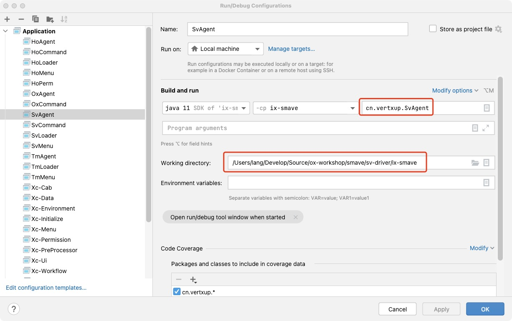

2. 看到如下界面，后端zero容器就启动成功了：

   

<hr/>

## 1.6. 项目前端

&ensp;&ensp;&ensp;&ensp;如果是自己从头搭建zero-ui脚手架，则使用**新建**流程，若是导入已经搭建好的项目则使用**导入**流程。

### 1.6.1. 新建

&ensp;&ensp;&ensp;&ensp;新建zero-ui项目先安装zero的脚本工具：<https://www.vertxai.cn/>，安装好工具之后直接运行如下命令[^2]：

[^2]: <http://www.vertxai.cn/document/doc-web/module-ai.html#.init>。

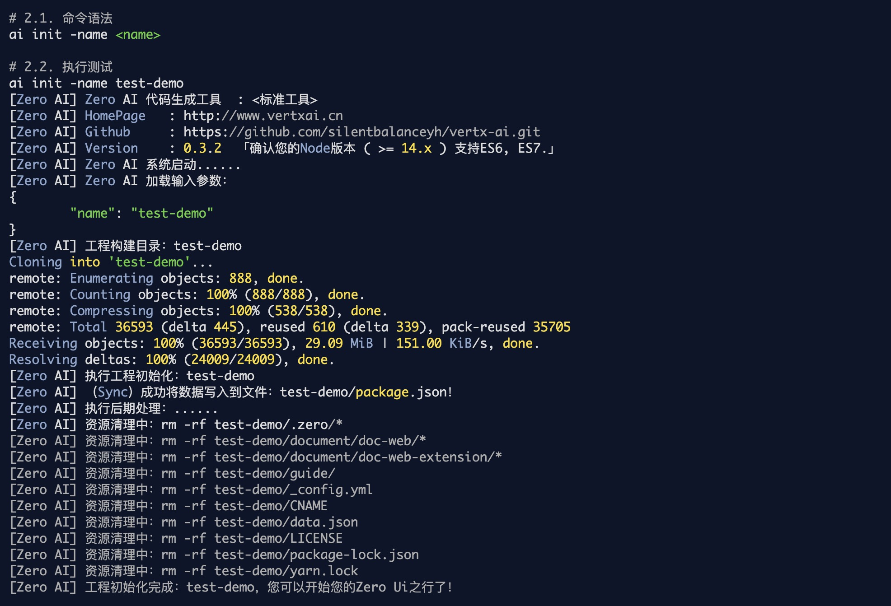

&ensp;&ensp;&ensp;&ensp;新建项目后根据自身项目修改如下内容：

* [ ] 项目名称
* [ ] 远程集成配置
* [ ] 应用配置
* [ ] 风格配置
* [ ] 开发调试工具配置

### 1.6.2. 导入/启动

&ensp;&ensp;&ensp;&ensp;前端导入使用WebStorm，**操作步骤**如下：

1. 从仓库下载代码（带token安全下载）：

    ```shell
    git clone https://<Token>@<Repo>
    # 截图中以项目名smave-ui为例，但该项目在私库中，所以读者无法直接访问，读者可直接访问自己创建好的Github仓库
    ```

    

2. 将代码导入WebStorm或其他前端工具IDE中：

   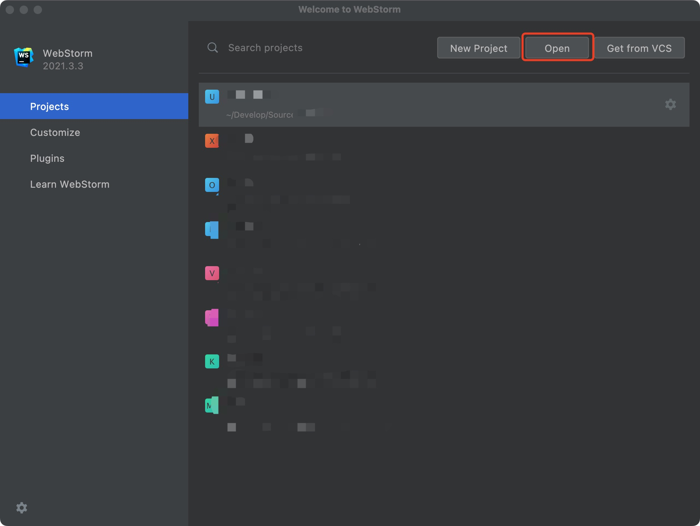

3. 选中您下载的项目打开

   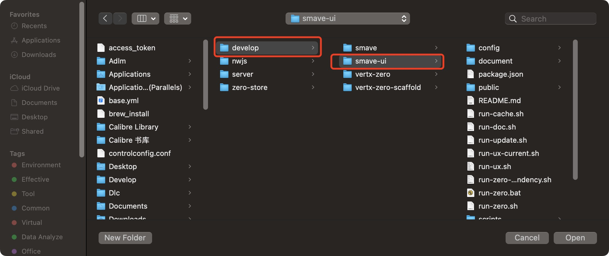

4. 弹出框中选择

   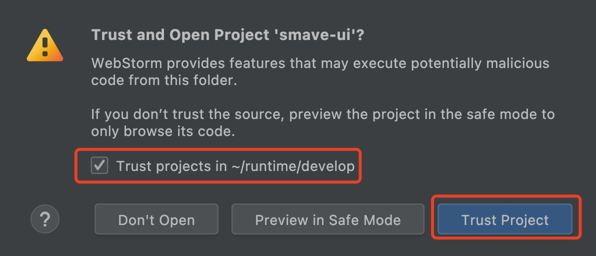
   
5. 安装本地依赖库，基于`yarn`，一次性执行，生产部署之前也需执行
   
    ```shell
    ~/runtime/develop/smave-ui(master) » ./run-update.sh
    ```
    脚本内容如下

    ```shell
    #!/usr/bin/env bash
    ncu -u                              # package.json 检查更新
    node ./scripts/zrun-package.js      # 自动化版本管理（防止依赖）
    rm -rf yarn.lock                    # 删除缓存
    yarn install                        # 重新安装依赖
    ```

    上述脚本运行完成后可看到如下截图：

    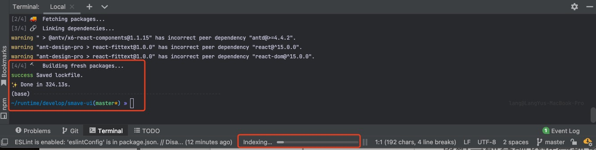

6. 运行启动脚本

    ```shell
    ~/runtime/develop/smave-ui(master*) » ./run-zero.sh
    # 由于引入了TypeScript，第一次启动会十分慢，启动过一次后如果依赖包不更改启动速度会很快
    ```
    最终运行后可看到如下截图

    

7. 从浏览器中打开前端：<http://ox.server.cn:PORT/zo/login/index>，此处`PORT`是前端配置的端口号：
    如果连接不上后端显示

    
    如果连接上后端则显示

    
8. 使用`falcon/11111111`登录可进入主界面。

# 「贰」生产环境准备

* [x] Ubuntu Server
* [ ] Red Hat

<hr/>

## 2.1. JDK

### 2.1.1. Open JDK

1. 直接使用Ubuntu工具安装JDK 11：

    ```shell
    sudo apt install openjdk-11-jdk
    ```

    执行过后会有如下截图

    

2. 验证Java是否安装成功
    
    ```shell
    java -version
    ```

    

3. 最终安装路径：`/usr/lib/jvm/java-11-openjdk-amd64`，后续设置`JAVA_HOME`。

### 2.1.2. ZuLu JDK 11（推荐配置）

* 安装包下载：<https://cdn.azul.com/zulu/bin/zulu11.54.25-ca-jdk11.0.14.1-linux_amd64.deb>

1. 安装Azul APT仓库[^3]：

    ```shell
    # install the necessary dependencies
    sudo apt-get -q update
    sudo apt-get -yq install gnupg curl 

    # add Azul's public key
    sudo apt-key adv \
    --keyserver hkp://keyserver.ubuntu.com:80 \
    --recv-keys 0xB1998361219BD9C9

    # download and install the package that adds 
    # the Azul APT repository to the list of sources 
    curl -O https://cdn.azul.com/zulu/bin/zulu-repo_1.0.0-3_all.deb

    # install the package
    sudo apt-get install ./zulu-repo_1.0.0-3_all.deb

    # update the package sources
    sudo apt-get update
    ```
    
    执行包安装的截图如下：

    

2. 执行命令安装Zulu JDK 11：

    ```shell
    # 标准安装
    sudo apt-get install zulu11-jdk
    ```

3. 本地安装Zulu JDK 11：

    ```shell
    # 下载 deb 安装包
    wget https://cdn.azul.com/zulu/bin/zulu11.54.25-ca-jdk11.0.14.1-linux_amd64.deb
    # 执行本地安装
    sudo apt-get install ./zulu11.54.25-ca-jdk11.0.14.1-linux_amd64.deb
    ```

    安装截图如：

    

4. 检查Java版本

    ```shell
    java -version
    ```

    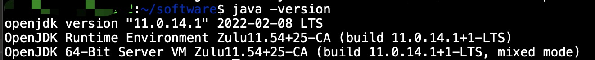

5. 最终安装地址：`/usr/lib/jvm/zulu-11-amd64`，后续设置`JAVA_HOME`。

<hr/>

## 2.2. Git

1. 直接使用Ubuntu工具安装Git：

    ```shell
    sudo apt install git
    ```

2. 验证Git是否安装完成

    ```shell
    git --version
    ```

    

[^3]: <https://docs.azul.com/core/zulu-openjdk/install/debian>

<hr/>

## 2.3. Mvnd

* 下载地址：<https://github.com/apache/maven-mvnd/releases/download/0.7.1/mvnd-0.7.1-linux-amd64.zip>

1. 下载安装包：

    ```shell
    wget https://github.com/apache/maven-mvnd/releases/download/0.7.1/mvnd-0.7.1-linux-amd64.zip
    ```

    执行截图

    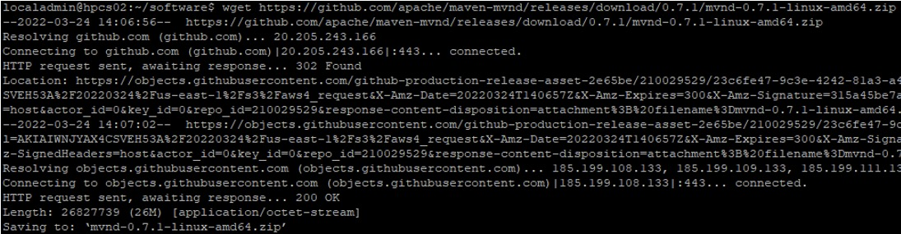

2. 对安装包执行解压：

    ```shell
    unzip mvnd-0.7.1-linux-amd64.zip
    ```

3. 重命名目录

    ```shell
    mvn mvnd-0.7.1-linux-amd64.zip mvnd
    ```

    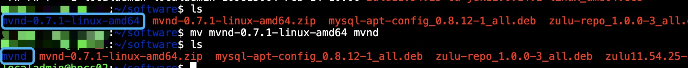

<hr/>

## 2.4. 环境变量

> 该章节为2.2、2.3的补充章节。

* Java环境变量
* Mvnd环境变量

1. 执行下边命令打开环境变量文件：

    ```shell
    sudo vim /etc/profile
    ```
    
2. 追加如下片段（按`i`键编辑）：

    ```shell
    export JAVA_HOME=/usr/lib/jvm/zulu-11-amd64
    export MAVEN_HOME=/home/localadmin/software/mvnd
    export PATH=$PATH:$MAVEN_HOME/bin:$JAVA_HOME/bin
    ```

    截图参考

    

3. 编辑完成后执行`Esc`，使用`wq`退出`vim`工具并保存，然后执行下边命令在当前会话中生效

    ```shell
    source /etc/profile
    ```

4. 检查Java和Mvnd
    * Java环境检查：`java -version`

        

    * Mvnd环境检查：`mvnd -v`

        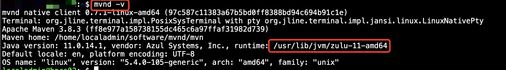

<hr/>

## 2.5. MySQL

1. 执行命令安装MySQL

    ```shell
    sudo apt install mysql-server
    ```

    

2. 验证安装好的服务
    
    ```shell
    sudo systemctl status mysql
    ```

    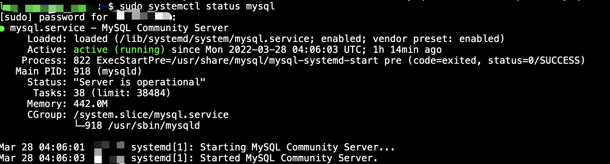

3. 新版本操作系统安装`5.7`[^4]（参考引用中教程先设置，然后执行此步骤的命令）：

    ```shell
    sudo apt install -f mysql-client=5.7* mysql-server=5.7*
    ```

4. 配置root密码

    ```shell
    sudo mysql_secure_installation
    ```

5. 配置mysql
   
    ```shell
    sudo vim /etc/mysql/mysql.conf.d/mysqld.cnf
    ```

    追加下边配置

    ```properties
    # Windows专用，MySQL大小写敏感
    lower_case_table_names=2 

    # 连接参数设置
    max_connections=2048
    wait_timeout=1814400
    ```

    **为了兼容Oracle数据库，zero对数据库的要求是大小写敏感的，且以大写为主，所有SQL关键字、数据库相关的内容都一律使用大写。**

6. 重启MySQL服务

    ```shell
    service mysql restart
    ```

    

7. 验证MySQL服务和端口

    ```shell
    ps -ef|grep mysql
    netstat -an|grep 3306
    ```

    

8. 连接MySQL

    ```shell
    mysql -u root -p
    ```

    

9. 创建您的应用所需账号：

    ```shell
    ~/server$ mysql -u root -p # 连接到MySQL中
    mysql > USE mysql;
    mysql > CREATE USER 'smave'@'%' IDENTIFIED BY '<PASSWORD>';
    mysql > GRANT all privileges ON *.* TO smave@'%' WITH GRANT OPTION;
    ```

[^4]: <https://www.vultr.com/docs/how-to-install-mysql-5-7-on-ubuntu-20-04/>

<hr/>

## 2.6. NodeJs

* 安装包下载：<https://nodejs.org/dist/v16.14.2/node-v16.14.2-linux-x64.tar.xz>

1. 下载NodeJs安装包：

    ```shell
    wget https://nodejs.org/dist/v16.14.2/node-v16.14.2-linux-x64.tar.xz
    ```

    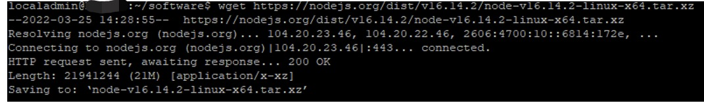

2. 解压

    ```shell
    tar -xvf ./node-v16.14.2-linux-x64.tar.xz
    ```

3. 重命名目录（为后续方便）：

    ```shell
    mv node-v16.14.2-linux-x64 nodejs
    ```

4. 环境变量配置

    ```shell
    sudo vim /etc/profile
    ```
    
    追加下边内容

    ```shell
    export NODE_HOME=/home/localadmin/software/nodejs
    export PATH=$NODE_HOME/bin:$PATH
    ```

5. 保存后执行下边命令让环境生效

    ```shell
    source /etc/profile
    ```

6. 验证环境：

    ```shell
    node -v
    ```

    

7. 安装yarn，yarn在安装过程请使用全局模式安装`-g`参数。

    ```shell
    npm install -g yarn
    ```

<hr/>

## 2.7. Zero Ai安装

* Zero Ai是自研发的开发辅助工具
* （仅Linux环境）参考文档：<http://www.vertxai.cn>

1. 执行安装命令

    ```shell
    npm install -g vertx-ai
    ```

2. 检查安装结果：

    ```shell
    ai help
    ```

    

<hr/>

## 2.8. Httpd

1. 执行命令安装服务器：

    ```shell
    sudo apt install apache2
    ```

2. 查看服务器运行状态

    ```shell
    sudo systemctl status apache2
    ```

    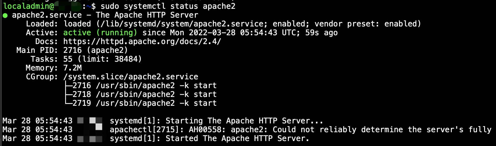

3. 修改端口和根目录
    * 进入默认配置目录`/etc/apache2/`
        ```shell
        # 进入配置目录
        cd /etc/apache2
        ```
    * 在文件`ports.conf`中修改内容
        ```shell
        sudo vim /etc/apache2/ports.conf
        ```
        追加下边配置
        ```shell
        NameVirtualHost *:6002
        Listen 6002
        ```

        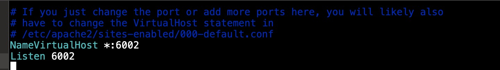
    * 创建默认目录
        ```shell
        # 此处 xxx 是当前登录用户名
        mkdir -P /home/xxx/server
        # 权限必须是 755 以上
        chmod 755 /home/xxx/server
        ```
    * 修改默认配置

        ```shell
        cd sites-available/
        cp 000-default.conf 000-default.conf.bak        # 备份
        sudo vim 000-default.conf
        ```
        修改开始配置以及中间配置
        ```xml
        <VirtualHost *:6002>
        ....
            DocumentRoot: /home/xxx/server
        </VirtualHost>
        ```

        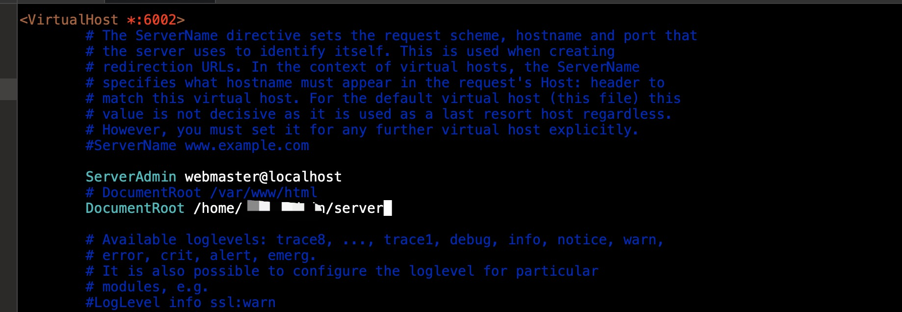

    * 为防止403错误，需要在`/etc/apache2/apache2.conf`配置文件中追加

        ```xml
        <Directory /home/localadmin/server>
                    Options Indexes FollowSymLinks
                    AllowOverride None
                    Require all granted
        </Directory>
        ```

        此步骤是因为在配置过程中我们更改了apache2的默认目录，从`/var/www/html`修改到了`/home/localadmin/server`中，如果您没有更改默认目录则可忽略这一步。

4. 重启apache2服务

    ```shell
    sudo systemctl restart apache2
    ```

# 「叄」部署应用

* **以 smave 为例，基本结构和在线的 vertx-zero-scaffold 一致**。

<hr/>

## 3.1. 后端部署

1. 在后端服务器中追加数据库配置，先添加hosts映射：

    ```shell
    127.0.0.1     ox.server.cn          # 前后端部署在同一台机器时前端使用该记录（开发也使用该记录）
    127.0.0.1     ox.engine.cn          # 数据库使用此映射记录
    127.0.0.1     ox.integration.cn     # 仅用于集成
    ```
2. （**本地打包忽略**）下载代码到生产环境
   
   ```shell
   git clone https://<TOKEN>@github.com/silentbalanceyh/smave
   ```

3. （**本地打包忽略**）执行下边命令编译打包：

    ```shell
    # vertx-zero，前文提到过
    ~/runtime/vertx-zero$ git pull
    ~/runtime/vertx-zero$ ./zero-compile.sh

    # smave，编译项目
    ~/runtime/smave$ git pull
    ~/runtime/smave$ ./build.sh
    ```

4. （**本地打包忽略**）查看编译结果

    ```shell
    ll sv-driver/ix-smave/target/
    ```

    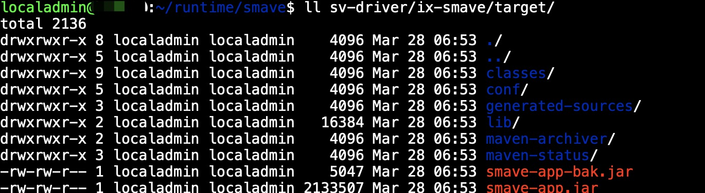

5. 本地编译后直接跳过 **2 ~ 4** 步骤，拷贝下边目录到容器启动目录

    ```shell
    # 创建运行目录
    mkdir ~/server
    # 将打包的内容拷贝到该目录中
    # - conf 文件夹         （配置文件位置）
    # - lib 依赖库          （jar位置）
    # - smave-app.jar       (启动程序)

    $ cp -rf \
    > runtime/smave/sv-driver/ix-smave/target/smave-app.jar \
    > runtime/smave/sv-driver/ix-smave/target/conf \
    > runtime/smave/sv-driver/ix-smave/target/lib \
    > server/
    ```

    

6. 查看`server`目录结构

    ```shell
    ll server
    ```

    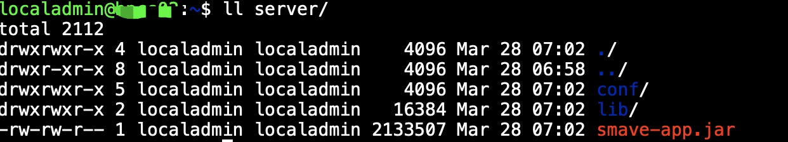

7. 在`server`目录中创建启动命令工具和容器启动的脚本
    * 程序更新脚本如下：
    
        ```shell
        #!/usr/bin/env bash
        rm -rf conf lib smave-app.jar
        cp -rf ../runtime/smave/sv-driver/ix-smave/target/smave-app.jar \
            ../runtime/smave/sv-driver/ix-smave/target/conf \
            ../runtime/smave/sv-driver/ix-smave/target/lib \
            .
        # 保存为 smave-update-whole.sh
        ```
        
        如果您更改了`conf`部分的配置，请在更新时注意先备份，更新过后再还原，如下截图：

        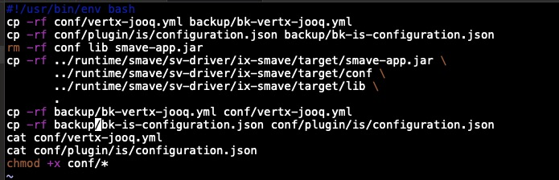

    * 表结构初始化脚本：

        ```shell
        #!/usr/bin/env bash
        mysql -u root -P 3306 -h 127.0.0.1 -p < conf/init/initialize.sql
        echo "[Zero] 数据库表初始化完成"
        ```

    * 命令行启动脚本如下：

        ```shell
        #!/usr/bin/env bash
        chmod +x smave-app.jar
        java -Djava.io.tmpdir=./tmp \
             -cp conf \
             -jar smave-app.jar config
        # 保存为 smave-console.sh
        ```

    * 容器启动脚本如：

        ```shell
        #!/usr/bin/env bash
        chmod +x smave-app.jar
        OX_OPTS="$OX_OPTS -server \
            -Xms8g -Xmx16g -XX:NewRatio=1 \
            -XX:SurvivorRatio=3 -XX:PermSize=256m \
            -XX:MaxPermSize=4g"
        # 后台运行
        nohup java $OX_OPTS -Djava.io.tmpdir=./tmp -cp conf -jar smave-app.jar start &
        # 保存为 smave-server.sh
        ```

8. 更改配置文件
    * 更改跨域配置：

        ```shell
        # 跨域配置更改
        vim conf/vertx-jooq.yml
        ```
        将最后一行内容更改为（**注意域名小写，浏览器会自动转。**）：
        ```yaml
        origin: "http://hpcs01"
        ```

    * 文件管理地址更改：

        ```shell
        # 文件存储目录变更
        vim conf/plugin/is/configuration.json
        ```

        将内容更改为：
        
        ```json
        {
            "storeRoot": "/home/localadmin/server/store"
        }
        ```

<hr/>

## 3.2. 数据初始化

&ensp;&ensp;&ensp;&ensp;`database-reinit.sh`脚本在开发章节已经存在，此处不再重复，可以将该部分脚本拷贝到`~/server/script/`中。

1. （**第一次或表变更**）执行数据库初始化

    ```shell
    # 进入script/database目录去初始化
    cd script/database
    ./database-reinit.sql
    ```

    

2. （**第一次或表变更**）执行建库操作，开发过程中已经导出了表结构的SQL，直接执行上边的建表的脚本

    ```shell
    # 直接执行
    ./smave-database.sh
    ```

    

3. 启动命令行工具

    ```shell
    # 直接执行
    ./smave-console.sh
    ```

    

4. 执行命令：`r`，`l`导入数据（Zero Ai命令）

    ```shell
    > r
    [ μηδέν ]执行命令："r", "（子系统）标准部署工具"
    [ μηδέν ] (runtime)------>>>> Sub System: （子系统）标准部署工具
    [ μηδέν ][ Production ] 请输入命令，使用 h 可查看帮助文档
    > l
    ......
    # 最终输出结果
    [ μηδέν ]您的元数据仓库已重置初始化完成！重置结果：true

    # 退出命令
    # - b：返回上一级菜单（退出子系统）
    # - q：退出整个命令行程序
    ```

5. 启动容器：

    ```shell
    # 执行启动命令
    ./smave-server.sh
    ~/server$ ./smave-server.sh
    ~/server$ nohup: appending output to 'nohup.out'
    ```

6. 启动容器后可从日志查看容器启动状态：

    ```shell
    cd ~/server/
    cat nohup.out
    ```

    最终输出如下：

    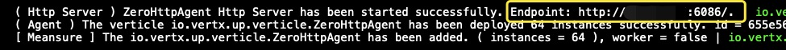

7. 同时在`logs/`目录中可以看到日志清单：

    ```shell
    ll logs/2022-03-28/
    ```

    
    * **zero-epic-fabric**目录中是核心框架日志
    * **zero-epic-extension**目录中是扩展框架日志
    * **zero-epic-fabric.log**是汇总后的日志

8. 在运行日志中确认两个配置以证明`conf`目录下的内容已生效

    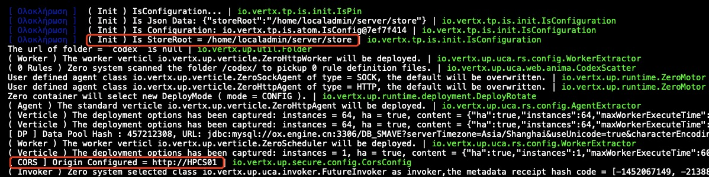

9.  执行下边命令可看到运行的java进程：

    ```shell
    # 查看运行进程
    ps auxg|grep smave-app.jar
    # 停止
    kill -9 <进程号>
    ```

<hr/>

## 3.3. 前端部署

1. 下载代码到前端服务器中

    ```shell
    cd ~/runtime/
    git clone http://<TOKEN>@github.com/silentbalanceyh/smave-ui.git
    # 下载前端代码到本机中
    ```

    

2. 安装前端依赖库

    ```shell
    ~/runtime$ cd smave-ui
    ~/runtime/smave-ui$ yarn install
    # 等待前端依赖库安装结束（第一次速度很慢）
    ```

    

3. 由于生产环境的环境变量已经提前设置了，在`./env.production`文件中，所以安装好依赖库后，前端可直接打包

    ```shell
    # 打包消耗时间会挺长，主要原因是使用了TypeScript做部分数据结构的校验
    # 所以最好是在本地打包好了直接把 `build` 目录上传到
    ~/runtime/smave-ui$ yarn build
    ```

    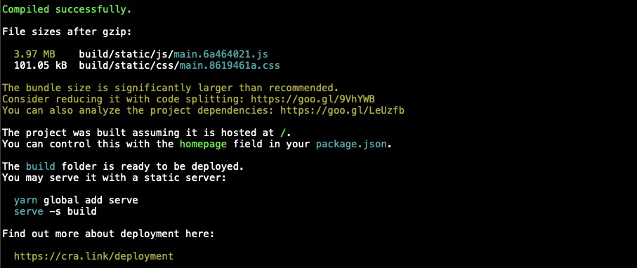

4. 最后将`build`中的所有内容拷贝到`~/server`中。

    ```shell
    cp -rf build/* ~/server
    ```

5. 使用浏览器打开，您就可以看到如下界面：

    

# 「肆」配置调整

# 「伍」小结